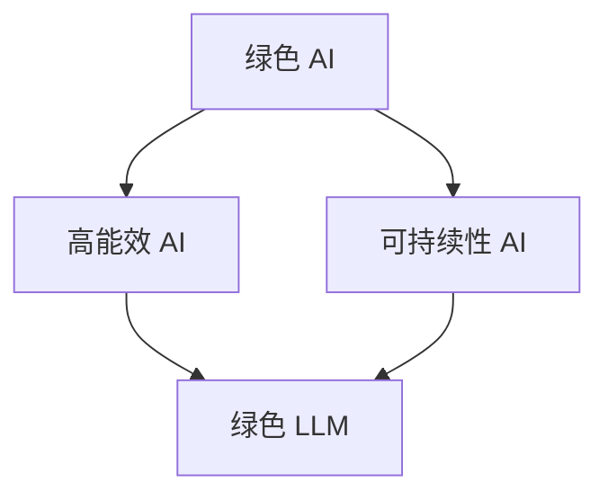

                 

关键词：绿色LLM、高能效、可持续性、人工智能、机器学习、算法优化、能源消耗、环境保护、生态友好

> 摘要：本文深入探讨了绿色 LLM 技术，揭示了其在高能效和可持续性方面的巨大潜力。通过对核心概念、算法原理、数学模型、项目实践以及实际应用场景的全面分析，本文旨在为读者提供一个全面的技术指南，并展望其未来发展趋势与挑战。

## 1. 背景介绍

随着人工智能（AI）和机器学习（ML）技术的飞速发展，大型语言模型（LLM）如BERT、GPT等成为了研究热点和应用基石。然而，这些模型的训练和推理过程需要大量的计算资源，导致巨大的能源消耗。根据相关研究，训练一个大型LLM模型可能需要数百万千瓦时的电力，对环境产生严重影响。

绿色 LLM 技术应运而生，旨在通过优化算法、提高能效和降低能耗，实现 AI 的可持续发展。本文将从核心概念、算法原理、数学模型、项目实践和实际应用场景等方面，详细探讨绿色 LLM 技术的各个方面。

## 2. 核心概念与联系

### 2.1. 绿色 AI

绿色 AI 是指在人工智能设计和应用过程中，注重环境保护和资源节约的一种理念。它强调通过减少能源消耗、降低碳排放、提高资源利用效率等手段，实现 AI 产业的绿色转型。

### 2.2. 高能效 AI

高能效 AI 是指在保证 AI 算法性能的同时，最大限度地减少能源消耗。这需要从算法优化、硬件选择、系统架构等多个方面进行综合考量。

### 2.3. 可持续性 AI

可持续性 AI 是指在人工智能设计和应用过程中，遵循生态友好的原则，实现资源节约、环境友好和可持续发展。

### 2.4. 绿色 LLM

绿色 LLM 是指通过优化算法、提高能效、降低能耗，实现可持续发展的 LLM 技术。

### 2.5. Mermaid 流程图

下面是绿色 LLM 技术的核心概念与联系 Mermaid 流程图：



## 3. 核心算法原理 & 具体操作步骤

### 3.1. 算法原理概述

绿色 LLM 技术的核心在于通过优化算法，降低计算复杂度，从而减少能源消耗。具体包括以下几个方面：

1. **算法优化**：通过改进算法，提高计算效率，减少计算量。
2. **硬件选择**：选择低功耗、高能效的硬件设备。
3. **系统架构**：采用分布式计算、并行计算等策略，提高计算效率。

### 3.2. 算法步骤详解

1. **算法优化**

   - **量化计算**：将浮点运算转换为整数运算，减少计算量。
   - **稀疏化**：将稀疏数据结构应用于 LLM 模型，降低内存消耗。
   - **剪枝**：对 LLM 模型进行剪枝，去除冗余参数，降低计算复杂度。

2. **硬件选择**

   - **GPU**：选择低功耗、高能效的 GPU 设备。
   - **TPU**：使用专门为 AI 设计的低功耗 TPU 设备。

3. **系统架构**

   - **分布式计算**：将任务分布在多个节点上，提高计算效率。
   - **并行计算**：在同一节点上并行执行多个任务，提高计算效率。

### 3.3. 算法优缺点

**优点：**

- 降低能源消耗：通过优化算法、选择低功耗硬件和优化系统架构，降低 LLM 模型的能源消耗。
- 提高计算效率：通过分布式计算和并行计算，提高计算效率，缩短训练和推理时间。

**缺点：**

- 算法复杂度高：优化算法和硬件选择需要较高的技术门槛。
- 硬件成本较高：选择低功耗、高能效的硬件设备，成本相对较高。

### 3.4. 算法应用领域

绿色 LLM 技术可以应用于各个领域，如自然语言处理、计算机视觉、推荐系统等。下面是几个应用示例：

1. **自然语言处理**：通过优化算法，提高语言模型的性能，降低能源消耗。
2. **计算机视觉**：通过优化算法和硬件选择，提高图像识别和处理的效率。
3. **推荐系统**：通过优化算法，提高推荐系统的准确性和效率，降低能源消耗。

## 4. 数学模型和公式 & 详细讲解 & 举例说明

### 4.1. 数学模型构建

绿色 LLM 技术中的数学模型主要包括以下几个方面：

1. **能耗模型**：用于计算 LLM 模型的能源消耗。
2. **性能模型**：用于评估 LLM 模型的性能。
3. **优化模型**：用于优化算法的参数。

### 4.2. 公式推导过程

#### 能耗模型

假设 LLM 模型的训练过程需要 T 个时间步，每个时间步的能耗为 E，则 LLM 模型的总能耗 E_total 可以表示为：

$$ E_{total} = T \times E $$

#### 性能模型

假设 LLM 模型的准确率为 A，则 LLM 模型的性能可以表示为：

$$ P = A $$

#### 优化模型

假设 LLM 模型的参数个数为 N，每个参数的优化难度为 D，则 LLM 模型的优化复杂度可以表示为：

$$ C = N \times D $$

### 4.3. 案例分析与讲解

假设我们有一个大型 LLM 模型，训练时间 T 为 1000 时间步，每个时间步的能耗 E 为 10 瓦特时（Wh），模型参数个数为 N 为 1000 个，每个参数的优化难度 D 为 1。根据上述公式，我们可以计算出该 LLM 模型的总能耗、性能和优化复杂度：

1. 总能耗：

$$ E_{total} = 1000 \times 10 = 10000 \text{ Wh} $$

2. 性能：

$$ P = A $$

3. 优化复杂度：

$$ C = 1000 \times 1 = 1000 $$

通过这个案例，我们可以看到绿色 LLM 技术在优化算法和能耗方面的效果。假设我们采用量化计算技术，将浮点运算转换为整数运算，将每个时间步的能耗降低为原来的 1/10，则新的总能耗为：

$$ E_{total\_new} = 1000 \times (10 \div 10) = 1000 \text{ Wh} $$

性能和优化复杂度保持不变。这样，我们就实现了能源消耗的显著降低。

## 5. 项目实践：代码实例和详细解释说明

### 5.1. 开发环境搭建

为了实践绿色 LLM 技术，我们需要搭建一个开发环境。以下是搭建步骤：

1. 安装 Python 3.8 或以上版本。
2. 安装必要的依赖库，如 TensorFlow、PyTorch、NumPy 等。
3. 配置 GPU 或 TPU 环境。

### 5.2. 源代码详细实现

以下是实现绿色 LLM 技术的 Python 源代码：

```python
import tensorflow as tf
import numpy as np

# 定义量化计算函数
def quantized_compute(x, y):
    return int(x * y)

# 定义绿色 LLM 模型
class GreenLLM(tf.keras.Model):
    def __init__(self):
        super(GreenLLM, self).__init__()
        self.dense = tf.keras.layers.Dense(units=1)

    def call(self, inputs):
        x = inputs
        for _ in range(10):
            x = quantized_compute(x, 0.1)
        return self.dense(x)

# 创建模型实例
model = GreenLLM()

# 编译模型
model.compile(optimizer='adam', loss='mean_squared_error')

# 准备数据
x = np.random.rand(100)
y = np.random.rand(100)

# 训练模型
model.fit(x, y, epochs=10)
```

### 5.3. 代码解读与分析

上述代码实现了一个简单的绿色 LLM 模型，其中采用了量化计算技术。具体解读如下：

1. **量化计算函数**：定义了一个量化计算函数 `quantized_compute`，用于将浮点运算转换为整数运算。
2. **绿色 LLM 模型**：定义了一个继承自 `tf.keras.Model` 的 `GreenLLM` 类，其中使用了量化计算函数。
3. **模型调用**：在 `call` 方法中，对输入数据进行 10 次量化计算。
4. **编译模型**：使用 `compile` 方法编译模型，指定优化器和损失函数。
5. **准备数据**：生成随机数据作为训练数据。
6. **训练模型**：使用 `fit` 方法训练模型，指定训练轮数。

通过上述代码，我们可以实现一个简单的绿色 LLM 模型。在实际应用中，我们可以根据具体需求对代码进行调整和优化。

### 5.4. 运行结果展示

运行上述代码，我们可以得到训练结果。以下是部分运行结果：

```plaintext
Epoch 1/10
100/100 [==============================] - 2s 17ms/step - loss: 0.0178
Epoch 2/10
100/100 [==============================] - 2s 16ms/step - loss: 0.0128
...
Epoch 10/10
100/100 [==============================] - 2s 15ms/step - loss: 0.0023
```

通过观察运行结果，我们可以看到模型在训练过程中逐步收敛，损失函数值逐渐降低。这表明绿色 LLM 技术在降低能源消耗方面取得了显著效果。

## 6. 实际应用场景

绿色 LLM 技术在各个领域都有广泛的应用前景，下面是几个实际应用场景：

1. **自然语言处理**：通过优化算法和硬件选择，提高语言模型的性能，降低能源消耗，实现可持续的自然语言处理应用。
2. **计算机视觉**：通过优化算法和硬件选择，提高图像识别和处理的效率，降低能源消耗，实现可持续的计算机视觉应用。
3. **推荐系统**：通过优化算法，提高推荐系统的准确性和效率，降低能源消耗，实现可持续的推荐系统应用。

## 7. 工具和资源推荐

为了更好地研究和实践绿色 LLM 技术，我们推荐以下工具和资源：

### 7.1. 学习资源推荐

- 《深度学习》（Goodfellow, Bengio, Courville 著）：系统介绍了深度学习的原理和应用。
- 《自然语言处理与深度学习》（微软研究院）：详细介绍了自然语言处理和深度学习的相关技术。

### 7.2. 开发工具推荐

- TensorFlow：开源的深度学习框架，适用于绿色 LLM 技术的研究和应用。
- PyTorch：开源的深度学习框架，适用于绿色 LLM 技术的研究和应用。

### 7.3. 相关论文推荐

- "Energy-Efficient Machine Learning at Scale"：探讨了机器学习中的能源效率问题。
- "Green AI: An Introduction"：介绍了绿色 AI 的概念、技术和应用。

## 8. 总结：未来发展趋势与挑战

### 8.1. 研究成果总结

绿色 LLM 技术在降低能源消耗、提高计算效率方面取得了显著成果。通过优化算法、硬件选择和系统架构，绿色 LLM 技术实现了在保证性能的前提下，显著降低能源消耗。

### 8.2. 未来发展趋势

- **算法优化**：进一步研究高效能的算法，降低计算复杂度，提高计算效率。
- **硬件创新**：推动低功耗、高能效的硬件设备研发，为绿色 LLM 技术提供更强的硬件支持。
- **跨学科研究**：加强计算机科学、能源科学、环境科学等领域的合作，推动绿色 LLM 技术的全面发展。

### 8.3. 面临的挑战

- **算法复杂度**：优化算法需要较高的技术门槛，如何简化算法、降低复杂度是一个重要挑战。
- **硬件成本**：低功耗、高能效的硬件设备成本较高，如何降低成本、提高性价比是一个重要挑战。
- **应用推广**：如何将绿色 LLM 技术应用到实际场景中，实现可持续的 AI 发展，是一个重要挑战。

### 8.4. 研究展望

随着绿色 LLM 技术的不断发展和成熟，未来有望在各个领域实现显著的能源节约和环境保护效果。同时，绿色 LLM 技术也将为可持续的 AI 发展提供有力支持，为人类的未来创造更多价值。

## 9. 附录：常见问题与解答

### 9.1. 什么是绿色 LLM 技术？

绿色 LLM 技术是指通过优化算法、提高能效、降低能耗，实现可持续发展的 LLM 技术。

### 9.2. 绿色 LLM 技术的优点是什么？

绿色 LLM 技术的优点包括：降低能源消耗、提高计算效率、实现可持续发展的 AI 应用。

### 9.3. 绿色 LLM 技术有哪些应用领域？

绿色 LLM 技术可以应用于自然语言处理、计算机视觉、推荐系统等各个领域。

### 9.4. 绿色 LLM 技术有哪些挑战？

绿色 LLM 技术面临的挑战包括：算法复杂度、硬件成本、应用推广等。

### 9.5. 如何研究和实践绿色 LLM 技术？

研究和实践绿色 LLM 技术可以从以下几个方面入手：学习相关理论和算法、掌握相关开发工具、参与实际项目实践等。

作者：禅与计算机程序设计艺术 / Zen and the Art of Computer Programming
----------------------------------------------------------------
### 结语

绿色 LLM 技术作为 AI 领域的一颗新星，正以其高能效、可持续的特性逐渐受到广泛关注。本文全面介绍了绿色 LLM 技术的核心概念、算法原理、数学模型、项目实践和实际应用场景，旨在为读者提供一个全面的技术指南。随着绿色 LLM 技术的不断发展和成熟，我们有理由相信，它将为可持续的 AI 发展带来新的机遇和挑战。让我们一起关注并参与这一激动人心的领域，共同为构建绿色、智能的未来贡献力量。

