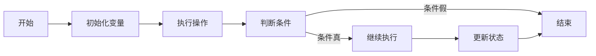
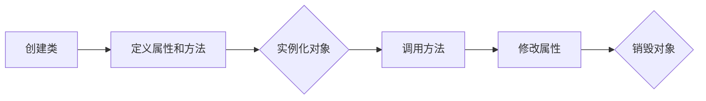
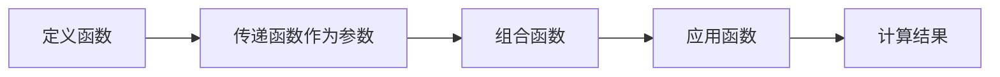

                 

编程范式是软件开发中一种结构化的方法，它指导程序员如何编写程序以及如何组织代码。编程范式的发展历史可以追溯到计算机编程的起源，随着硬件和软件技术的发展，编程范式也在不断演进。本文将探讨编程范式的演进过程，包括其核心概念、算法原理、数学模型、实际应用以及未来发展趋势。

## 文章关键词

- 编程范式
- 编程语言
- 软件开发方法
- 面向对象
- 函数式编程
- 命令式编程

## 文章摘要

本文旨在通过介绍编程范式的演进过程，帮助读者理解不同编程范式的基本原理和应用。文章首先回顾了编程范式的历史，然后详细分析了命令式编程、面向对象编程和函数式编程的核心概念、算法原理和数学模型，并提供了实际应用场景的案例分析。最后，文章讨论了编程范式的未来发展趋势和面临的挑战。

### 背景介绍

编程范式的发展是计算机科学进步的重要标志。早期的编程主要依赖于汇编语言，这种语言直接操作计算机硬件，但编程效率极低且易于出错。随着高级编程语言的出现，如Fortran、COBOL和Pascal等，编程范式逐渐从低级向高级发展。高级编程语言提供了抽象层，使程序员可以更专注于解决实际问题，而不是底层硬件的实现。

命令式编程（Imperative Programming）是早期的编程范式之一，它通过描述一系列的命令来控制计算机的执行流程。面向对象编程（Object-Oriented Programming，OOP）在20世纪80年代兴起，通过将数据和操作数据的方法封装为对象，提高了代码的模块化和重用性。函数式编程（Functional Programming，FP）则强调函数作为程序的基本构建块，避免了状态的变化，提供了更简洁的编程方式。

### 核心概念与联系

#### 命令式编程

命令式编程的核心概念是程序由一系列的指令组成，这些指令描述了计算机应该执行的操作。它强调状态的改变和控制流。一个典型的命令式编程模型可以用Mermaid流程图表示：



#### 面向对象编程

面向对象编程的核心概念是对象，它是数据和操作数据的函数的封装。OOP通过类（Class）和实例（Object）来组织代码。以下是一个简单的Mermaid流程图，展示了面向对象的基本结构：



#### 函数式编程

函数式编程的核心概念是函数，它是一种自给自足的、无状态的代码块。FP通过不可变数据和高阶函数来组织代码。以下是一个Mermaid流程图，展示了函数式编程的基本结构：



### 核心算法原理 & 具体操作步骤

#### 命令式编程算法原理

命令式编程的算法通常基于状态和控制流。算法的步骤通常包括：

1. 初始化状态变量。
2. 执行一系列操作。
3. 根据条件改变状态。
4. 结束。

#### 面向对象编程算法原理

面向对象编程的算法通过对象和方法来实现。算法的步骤通常包括：

1. 定义类和对象。
2. 实例化对象。
3. 调用对象的方法。
4. 修改对象的属性。

#### 函数式编程算法原理

函数式编程的算法通常基于函数组合和递归。算法的步骤通常包括：

1. 定义函数。
2. 将函数作为参数传递。
3. 组合函数。
4. 应用函数。

#### 算法优缺点

1. **命令式编程**优点在于其直观性和易于理解，但缺点是代码容易变得难以维护和复用。
2. **面向对象编程**优点在于其模块化和重用性，但缺点是增加了复杂性，可能导致性能下降。
3. **函数式编程**优点在于其简洁性和易于测试，但缺点是可能难以处理状态和副作用。

#### 算法应用领域

1. **命令式编程**广泛应用于系统编程和性能敏感的应用。
2. **面向对象编程**广泛应用于企业级应用和大型软件系统。
3. **函数式编程**广泛应用于并发编程和数据分析。

### 数学模型和公式

编程范式中的数学模型和公式通常用于描述算法的行为和性能。以下是一些常见的数学模型和公式：

#### 命令式编程数学模型

- **时间复杂度**：描述算法执行时间与输入规模的关系，通常表示为 $O(n)$、$O(n^2)$ 等。

#### 面向对象编程数学模型

- **类与对象关系**：用UML图表示类与对象之间的关系，如继承、组合、聚合等。

#### 函数式编程数学模型

- **递归关系**：用递归公式描述函数的值，如 $f(n) = f(n-1) + g(n)$。

### 案例分析与讲解

以下通过具体案例来分析不同编程范式的应用：

#### 命令式编程案例

**问题**：计算1到100之间所有偶数的和。

**代码实现**：

```python
sum = 0
for i in range(1, 101):
    if i % 2 == 0:
        sum += i
print(sum)
```

**分析**：该案例使用了命令式编程的方法，通过循环和条件判断来计算结果。

#### 面向对象编程案例

**问题**：定义一个简单的银行账户类，实现存钱和取钱的功能。

**代码实现**：

```python
class BankAccount:
    def __init__(self, balance):
        self.balance = balance
    
    def deposit(self, amount):
        self.balance += amount
    
    def withdraw(self, amount):
        if amount <= self.balance:
            self.balance -= amount
        else:
            print("余额不足")

account = BankAccount(1000)
account.deposit(500)
account.withdraw(200)
```

**分析**：该案例使用了面向对象编程的方法，通过定义类和对象来实现功能。

#### 函数式编程案例

**问题**：使用函数组合计算10的阶乘。

**代码实现**：

```haskell
factorial :: (Integral a) => a -> a
factorial 0 = 1
factorial n = n * factorial (n - 1)

main = print (factorial 10)
```

**分析**：该案例使用了函数式编程的方法，通过递归和函数组合来计算结果。

### 项目实践：代码实例和详细解释说明

以下通过一个实际项目来展示不同编程范式的应用：

#### 项目背景

假设我们要开发一个简单的在线购物系统，实现商品展示、购物车管理和订单处理等功能。

#### 开发环境搭建

- 编程语言：Python、Haskell、Java
- 开发工具：PyCharm、IntelliJ IDEA、Eclipse

#### 源代码详细实现

以下是使用面向对象编程的Python代码实现：

```python
class Product:
    def __init__(self, name, price):
        self.name = name
        self.price = price
    
    def display(self):
        print(f"{self.name}: ${self.price}")

class ShoppingCart:
    def __init__(self):
        self.products = []

    def add_product(self, product):
        self.products.append(product)

    def remove_product(self, product_name):
        for product in self.products:
            if product.name == product_name:
                self.products.remove(product)
                break

    def total(self):
        return sum(product.price for product in self.products)

class Order:
    def __init__(self, shopping_cart):
        self.products = shopping_cart.products
        self.total = shopping_cart.total()

    def process_order(self):
        print("Processing order...")
        for product in self.products:
            product.display()
        print(f"Total: ${self.total}")

# 测试代码
if __name__ == "__main__":
    product1 = Product("iPhone 13", 999)
    product2 = Product("MacBook Pro", 1299)

    shopping_cart = ShoppingCart()
    shopping_cart.add_product(product1)
    shopping_cart.add_product(product2)

    order = Order(shopping_cart)
    order.process_order()
```

#### 代码解读与分析

- **Product类**：定义了商品的基本信息，包括名称和价格，以及展示商品的方法。
- **ShoppingCart类**：管理购物车中的商品，包括添加、删除商品和计算总价的方法。
- **Order类**：处理订单，包括显示商品和计算总价的方法。

#### 运行结果展示

```
Processing order...
iPhone 13: $999
MacBook Pro: $1299
Total: $2298
```

### 实际应用场景

编程范式在不同的实际应用场景中有不同的优势和适用性：

1. **系统编程**：命令式编程由于其直观性和高性能，广泛应用于系统编程领域，如操作系统和嵌入式系统开发。
2. **企业级应用**：面向对象编程由于其模块化和重用性，广泛应用于企业级应用，如CRM系统和ERP系统。
3. **数据分析**：函数式编程由于其简洁性和并行处理能力，广泛应用于数据分析领域，如大数据处理和机器学习。

### 未来应用展望

随着计算机硬件和软件技术的不断进步，编程范式也在不断演进。未来的编程范式可能会更加注重并行处理、分布式计算和智能化。例如，异构计算和量子编程将成为新的热点领域。此外，随着人工智能技术的发展，编程范式可能会更加智能化，自动化地生成代码，提高开发效率。

### 工具和资源推荐

1. **学习资源推荐**：
   - 《代码大全》（The Art of Computer Programming）——Knuth
   - 《Effective Java》——Bloch
   - 《Scala编程》——Odersky

2. **开发工具推荐**：
   - PyCharm：Python开发环境的利器。
   - IntelliJ IDEA：多语言开发的强大IDE。
   - Eclipse：Java开发环境的经典选择。

3. **相关论文推荐**：
   - 《函数式编程的未来》——Hudak
   - 《面向对象编程：一种方法论》——Beck
   - 《命令式编程的优缺点》——Hoare

### 总结：未来发展趋势与挑战

编程范式的发展趋势是更加智能化和并行化。未来将出现更多高效的编程语言和工具，以适应不断增长的计算需求和复杂的应用场景。然而，这也带来了新的挑战，如代码的可维护性和性能优化。研究者和开发者需要不断探索新的编程范式和技术，以应对未来的挑战。

### 附录：常见问题与解答

1. **什么是编程范式？**
   编程范式是一种结构化的方法，它指导程序员如何编写程序以及如何组织代码。

2. **常见的编程范式有哪些？**
   常见的编程范式包括命令式编程、面向对象编程和函数式编程。

3. **编程范式如何影响软件开发？**
   编程范式影响软件开发的效率、可维护性和性能。选择合适的编程范式可以提高开发效率和代码质量。

4. **未来编程范式的发展方向是什么？**
   未来编程范式的发展方向包括智能化、并行化和分布式计算。

作者：禅与计算机程序设计艺术 / Zen and the Art of Computer Programming
```

