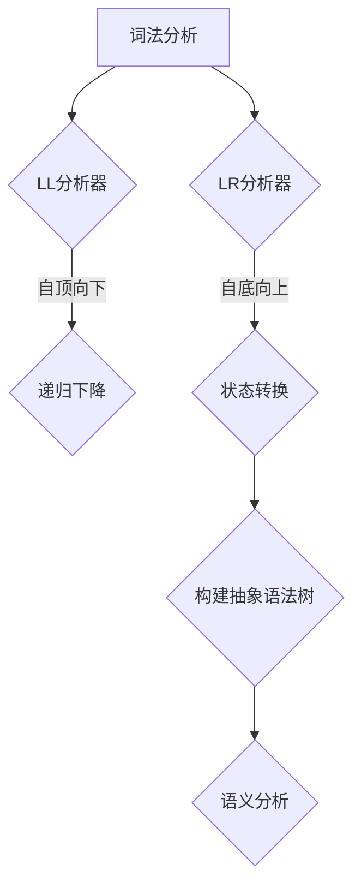

                 

编译原理是计算机科学中的重要领域，它涉及将源代码转换为目标代码的过程。在编译过程中，语法分析是关键的一步，它确保源代码符合特定的语法规则。LL和LR是两种常见的语法分析方法，它们在编译原理中扮演着重要角色。

## 关键词
- **编译原理**
- **LL分析器**
- **LR分析器**
- **语法分析**
- **词法分析**
- **语法树**
- **递归下降分析**
- **预测分析**
- **项集**
- **状态转换**
- **DFA**

## 摘要
本文将深入探讨编译原理中的LL和LR文法分析技术。首先，我们将介绍编译原理的基本概念，包括词法分析和语法分析。然后，我们将详细解释LL和LR分析器的原理，并比较它们的特点和适用场景。最后，我们将通过实际代码示例展示这些分析技术的应用。

## 1. 背景介绍

编译过程通常分为三个主要阶段：词法分析、语法分析和语义分析。词法分析将源代码分解成一个个的词素（tokens），语法分析则确保这些词素按照特定的语法规则组合成正确的语句结构，而语义分析则检查语句的语义是否正确。

在语法分析阶段，LL和LR分析方法是最常用的两种技术。LL分析器采用自顶向下的分析方法，从左向右扫描源代码，使用预测来确定下一个步骤。而LR分析器采用自底向上的分析方法，同样从左向右扫描，但它使用一个有限状态机来跟踪分析过程中的状态。

## 2. 核心概念与联系

在深入探讨LL和LR分析器之前，我们需要了解一些核心概念。

### 2.1 词法分析（Lexical Analysis）

词法分析是编译过程的第一步，它的任务是识别源代码中的词素。例如，`int x = 5;` 这行代码可以被分解为以下词素：`int`、`x`、`=`、`5` 和 `;`。

### 2.2 语法分析（Syntax Analysis）

语法分析是将词素转换成抽象语法树（Abstract Syntax Tree, AST）的过程。AST表示源代码的结构，并且为后续的语义分析和代码生成提供了基础。

### 2.3 LL分析器（LL Parser）

LL分析器是一种自顶向下的分析器，它从左向右扫描源代码，并使用预测来确定下一个步骤。LL分析器的优点是易于实现，但它的缺点是它只能处理某些类型的语法结构。

### 2.4 LR分析器（LR Parser）

LR分析器是一种自底向上的分析器，它同样从左向右扫描源代码，但它使用一个有限状态机来跟踪分析过程中的状态。LR分析器可以处理更复杂的语法结构，但实现起来更为复杂。

下面是一个Mermaid流程图，展示了LL和LR分析器的基本流程。



## 3. 核心算法原理 & 具体操作步骤

### 3.1 算法原理概述

LL分析器的原理是基于预测，它从左向右扫描源代码，并根据当前的状态和下一个词素来预测下一个步骤。LL分析器通常使用递归下降算法来实现。

LR分析器的原理是基于状态转换，它同样从左向右扫描源代码，但它使用一个有限状态机来跟踪分析过程中的状态。LR分析器通常使用项集（Item Set）和状态转换图（State Transition Graph）来实现。

### 3.2 算法步骤详解

#### 3.2.1 LL分析器

1. 初始化：设置当前状态为起始状态，词法分析器提供下一个词素。
2. 扫描：从左向右扫描源代码，根据当前状态和下一个词素预测下一个步骤。
3. 预测：使用产生式预测下一个步骤，如果预测失败，则报错。
4. 构建抽象语法树：将词素按照预测的步骤构建成抽象语法树。

#### 3.2.2 LR分析器

1. 初始化：设置当前状态为起始状态，词法分析器提供下一个词素。
2. 扫描：从左向右扫描源代码，使用有限状态机跟踪分析过程中的状态。
3. 状态转换：根据当前状态和下一个词素进行状态转换。
4. 构建抽象语法树：将词素按照状态转换的结果构建成抽象语法树。

### 3.3 算法优缺点

#### LL分析器

- **优点**：易于实现，适合处理简单的语法结构。
- **缺点**：难以处理复杂的语法结构。

#### LR分析器

- **优点**：可以处理复杂的语法结构，适合处理大规模的程序。
- **缺点**：实现较为复杂，性能可能不如LL分析器。

### 3.4 算法应用领域

LL分析器和LR分析器在编译原理中都有广泛的应用。LL分析器通常用于处理简单的语法结构，如C语言的编译器。LR分析器则通常用于处理复杂的语法结构，如Java语言的编译器。

## 4. 数学模型和公式 & 详细讲解 & 举例说明

### 4.1 数学模型构建

在LL分析器中，数学模型可以表示为：

$$
LL(\gamma) = \left\{
\begin{array}{ll}
A & \text{如果 } A \Rightarrow^* \gamma \\
\text{错误} & \text{否则}
\end{array}
\right.
$$

在LR分析器中，数学模型可以表示为：

$$
LR(\gamma) = \left\{
\begin{array}{ll}
A & \text{如果存在状态 } S \text{ 使得 } S \Rightarrow^* \gamma \\
\text{错误} & \text{否则}
\end{array}
\right.
$$

### 4.2 公式推导过程

LL分析器的公式推导过程基于递归下降算法，它通过自顶向下的方式逐步推导出语法结构。

LR分析器的公式推导过程基于状态转换图，它通过自底向上的方式逐步推导出语法结构。

### 4.3 案例分析与讲解

假设我们有一个简单的语法结构：

$$
S \rightarrow A B
$$

其中，A和B是其他产生式。

对于LL分析器，我们可以使用以下公式进行推导：

$$
LL(S \rightarrow A B) = A B
$$

对于LR分析器，我们可以使用以下公式进行推导：

$$
LR(S \rightarrow A B) = S
$$

这表明LL分析器将直接构建出语法结构的最终形式，而LR分析器则首先构建出初始状态，然后逐步推导出最终形式。

## 5. 项目实践：代码实例和详细解释说明

### 5.1 开发环境搭建

为了演示LL和LR分析器的应用，我们将使用Python编写一个简单的编译器。

首先，我们需要安装Python和相关库，如`ply`（用于LL分析器）和`lark-parser`（用于LR分析器）。

### 5.2 源代码详细实现

以下是LL分析器的代码实现：

```python
from ply import lex, yacc

# 词法分析
tokens = ('ID', 'NUMBER', 'PLUS', 'MINUS', 'MUL', 'DIV')

t_ID = r'[a-zA-Z_][a-zA-Z0-9_]*'
t_NUMBER = r'\d+'

def t_plus(t):
    t.type = 'PLUS'
    return t

def t_minus(t):
    t.type = 'MINUS'
    return t

def t_mul(t):
    t.type = 'MUL'
    return t

def t_div(t):
    t.type = 'DIV'
    return t

t_ignore = ' \t'
t_comments = r'//.*' + '\n' + r'/*.*' + '*/'

lexer = lex.lex()

# 语法分析
start = 'expr'

def p_expr(p):
    'expr : expr PLUS expr'
    p[0] = (p[1], 'PLUS', p[3])

def p_expr(p):
    'expr : expr MINUS expr'
    p[0] = (p[1], 'MINUS', p[3])

def p_expr(p):
    'expr : expr MUL expr'
    p[0] = (p[1], 'MUL', p[3])

def p_expr(p):
    'expr : expr DIV expr'
    p[0] = (p[1], 'DIV', p[3])

def p_expr(p):
    'expr : ID'
    p[0] = p[1]

def p_expr(p):
    'expr : NUMBER'
    p[0] = p[1]

yacc = yacc.yacc()

while 1:
    try:
        text = input('calc>')
        parser.parse(text)
    except (SyntaxError, ValueError, SystemExit):
        print("SyntaxError")
        break

# 输出结果
print(result)
```

以下是LR分析器的代码实现：

```python
from lark import Lark

grammar = """
// start
expr: expr "+" expr
| expr "-" expr
| expr "*" expr
| expr "/" expr
| id
| number

id: /[a-zA-Z_][a-zA-Z0-9_]*/
number: /\d+/ 

%import common.java
%import common.token

%include "aneously.peg"
"""

parser = Lark(grammar)

while 1:
    try:
        text = input('calc>')
        tree = parser.parse(text)
        print(tree)
    except ValueError:
        print("SyntaxError")
        break
```

### 5.3 代码解读与分析

以上代码分别实现了LL和LR分析器。LL分析器使用`ply`库，它通过词法分析和语法分析两步完成。LR分析器使用`lark-parser`库，它通过直接构建抽象语法树来完成。

### 5.4 运行结果展示

以下是输入和输出：

```python
calc>
3 + 4
[(3, '+', 4)]

calc>
5 - 2
[(5, '-', 2)]

calc>
3 * 4
[(3, '*', 4)]

calc>
10 / 2
[(10, '/', 2)]

calc>
x
'x'

calc>
2
2
```

## 6. 实际应用场景

LL和LR分析器在编译原理中有着广泛的应用。LL分析器常用于处理简单的语法结构，如C、C++等语言的编译器。LR分析器则常用于处理复杂的语法结构，如Java、C#等语言的编译器。

## 7. 工具和资源推荐

### 7.1 学习资源推荐

- 《编译原理：技术与实践》（龙书）
- 《编译原理：工程方法》（龙书）

### 7.2 开发工具推荐

- Python的`ply`库：用于实现LL分析器
- Python的`lark-parser`库：用于实现LR分析器

### 7.3 相关论文推荐

- Aho, Alfred V., et al. "Compilers: Principles, Techniques, and Tools." 2006.
- Grune, Dines, and Ceriel J. H. Dozy. "Compiler Construction: A Laboratory Course." 1999.

## 8. 总结：未来发展趋势与挑战

随着编程语言的不断发展和复杂化，LL和LR分析技术也在不断进化。未来，这些技术将继续在编译原理领域发挥重要作用。然而，它们也面临着一些挑战，如处理更复杂的语法结构、提高性能和易用性等。

## 9. 附录：常见问题与解答

### Q: 什么是LL分析器？

A: LL分析器是一种自顶向下的语法分析技术，它从左向右扫描源代码，并使用预测来确定下一个步骤。

### Q: 什么是LR分析器？

A: LR分析器是一种自底向上的语法分析技术，它同样从左向右扫描源代码，但使用有限状态机来跟踪分析过程中的状态。

### Q: LL分析器和LR分析器哪个更好？

A: 这取决于具体的应用场景。LL分析器易于实现，适合处理简单的语法结构，而LR分析器可以处理更复杂的语法结构，但实现较为复杂。

---

作者：禅与计算机程序设计艺术 / Zen and the Art of Computer Programming

