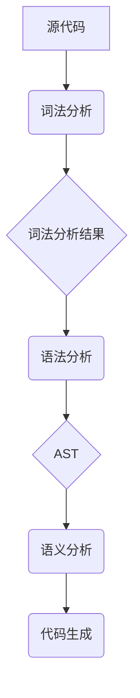

                 

关键词：编译器设计，词法分析，语法分析，解析器，抽象语法树，编译原理

> 摘要：本文深入探讨了编译器设计中的核心组成部分——词法分析器和解析器。通过介绍其基本概念、原理和应用，本文旨在为读者提供对编译过程的理解，并展示其在实际项目中的应用价值。

## 1. 背景介绍

编译器是计算机科学中一个至关重要的工具，它将高级语言编写的源代码转换成计算机可以理解和执行的机器语言。这一转换过程通常被分为几个阶段，其中词法分析（Lexical Analysis）和语法分析（Syntactic Analysis）是前两个关键阶段。这两个阶段的任务分别是识别源代码中的基本元素（单词）和检查这些元素的语法结构是否符合指定的规则。

词法分析器（Lexer）主要负责将输入的源代码字符串分割成一系列有意义的词法单元（tokens），例如变量名、关键字、操作符等。解析器（Parser）则将这些词法单元组合成符合语法规则的抽象语法树（Abstract Syntax Tree，AST），为后续的语义分析和代码生成阶段提供基础。

## 2. 核心概念与联系

在深入探讨词法分析和语法分析之前，我们需要明确一些核心概念，并理解它们之间的相互关系。以下是几个关键概念和它们的联系：

### 2.1 词法单元（Token）

词法单元是源代码中最小的语义单位，它由一个或多个字符组成，具有明确的语义意义。例如，“int”、“if”、“+”等都是常见的词法单元。

### 2.2 抽象语法树（Abstract Syntax Tree，AST）

抽象语法树是源代码的语法结构在内存中的表示，它由节点和边组成，每个节点代表一个语法元素，如表达式、语句或函数定义。AST 不仅是语法分析的结果，也为后续的语义分析和代码生成提供了结构化的数据。

### 2.3 词法分析器与解析器的联系

词法分析器和解析器是编译器中的两个独立但又相互依赖的组件。词法分析器将源代码分割成词法单元，并将其传递给解析器。解析器则将这些词法单元组合成 AST。词法分析器负责词汇层面的错误检测，而解析器则负责语法层面的错误检测。

### 2.4 Mermaid 流程图

以下是一个简化的 Mermaid 流程图，展示了词法分析器和解析器在编译过程中的位置和作用。



## 3. 核心算法原理 & 具体操作步骤

### 3.1 算法原理概述

词法分析器的核心算法是正则表达式匹配。它通过预定义的正则表达式规则来识别源代码中的词法单元。解析器的核心算法则是递归下降分析（Recursive Descent Parsing）或 LL(1) 分析，它通过定义语法规则的前向推导来构建 AST。

### 3.2 算法步骤详解

#### 3.2.1 词法分析步骤

1. 读取输入的源代码字符串。
2. 使用预定义的正则表达式规则匹配词法单元。
3. 将匹配成功的词法单元转换为内部表示（例如，转换为 token 对象）。
4. 传递词法单元给解析器。

#### 3.2.2 解析器步骤

1. 接收词法单元序列。
2. 根据语法规则，从词法单元序列中识别出语法元素。
3. 使用递归或迭代方法构建 AST。
4. 验证 AST 是否符合预期的语法结构。

### 3.3 算法优缺点

#### 优点

- **词法分析**：正则表达式匹配使得词法分析过程高效且易于实现。
- **解析器**：递归下降分析或 LL(1) 分析使得解析过程直观且易于理解。

#### 缺点

- **词法分析**：对于复杂语言的词法规则，正则表达式可能变得难以维护。
- **解析器**：递归下降分析可能存在递归深度问题，对于复杂语法规则，可能导致栈溢出。

### 3.4 算法应用领域

词法分析和语法分析在编译器设计中至关重要，它们广泛应用于各种编程语言的编译器，例如 C、C++、Java 等。此外，词法分析和语法分析的概念也广泛应用于解释器设计、代码生成工具、语法检查工具等领域。

## 4. 数学模型和公式 & 详细讲解 & 举例说明

### 4.1 数学模型构建

词法分析和语法分析的核心在于定义一组规则来描述源代码的词法单元和语法结构。这些规则通常使用正则表达式和语法形式化描述语言（如 BNF 或 EBNF）来表示。

### 4.2 公式推导过程

假设我们有一个简单的算术表达式语言，其语法规则可以表示为以下 BNF 形式：

```
<表达式> ::= <数>
            | <数> + <表达式>
            | <数> - <表达式>
```

我们可以使用递归下降分析算法来解析这个表达式语言。以下是一个简单的递归下降解析器的伪代码：

```python
def parse_expression(tokens):
    token = next_token(tokens)
    result = parse_term(tokens)
    while token == '+':
        token = next_token(tokens)
        result += parse_term(tokens)
    return result

def parse_term(tokens):
    token = next_token(tokens)
    result = token.value
    while token == '-':
        token = next_token(tokens)
        result -= parse_term(tokens)
    return result
```

### 4.3 案例分析与讲解

假设我们有一个算术表达式 "3 + 4 - 2"，以下是它的词法分析和语法分析过程：

#### 词法分析

1. 读取源代码字符串："3 + 4 - 2"
2. 使用正则表达式匹配词法单元：
   - "3"：匹配数字词法单元
   - "+"：匹配操作符词法单元
   - "4"：匹配数字词法单元
   - "-"：匹配操作符词法单元
   - "2"：匹配数字词法单元
3. 词法分析结果：[Token(3, 'NUMBER'), Token('+', 'OPERATOR'), Token(4, 'NUMBER'), Token('-', 'OPERATOR'), Token(2, 'NUMBER')]

#### 语法分析

1. 使用递归下降分析器解析词法单元序列：
   - 解析第一个表达式：3
     - 调用 `parse_expression` 函数
     - 解析结果：3
   - 遇到 "+"，调用 `parse_term` 函数
     - 解析结果：7（3 + 4）
   - 遇到 "-"，再次调用 `parse_term` 函数
     - 解析结果：5（7 - 2）
2. 语法分析结果：5

## 5. 项目实践：代码实例和详细解释说明

### 5.1 开发环境搭建

为了演示词法分析和语法分析的过程，我们将使用 Python 语言编写一个简单的算术表达式编译器。以下是一个基本的开发环境搭建步骤：

1. 安装 Python 3.8 或更高版本。
2. 安装必要的库，例如 `regex` 用于正则表达式匹配和 `matplotlib` 用于可视化 AST。
3. 创建一个名为 `calculator` 的项目目录，并在其中创建以下文件：
   - `lexer.py`：词法分析器实现
   - `parser.py`：语法分析器实现
   - `ast.py`：抽象语法树表示
   - `main.py`：主程序入口

### 5.2 源代码详细实现

以下是我们将实现的各个模块的基本代码框架：

#### `lexer.py`

```python
import re

class Lexer:
    def __init__(self, source_code):
        self.source_code = source_code
        self.tokens = []

    def tokenize(self):
        # 使用正则表达式匹配词法单元
        pattern = r'\d+|\+|\-'
        for match in re.finditer(pattern, self.source_code):
            self.tokens.append(Token(match.group(), 'NUMBER' if match.group()isdigit() else 'OPERATOR'))
        return self.tokens

class Token:
    def __init__(self, value, type):
        self.value = value
        self.type = type
```

#### `parser.py`

```python
from lexer import Lexer, Token

class Parser:
    def __init__(self, tokens):
        self.tokens = tokens
        self.current_token = self.tokens[0]

    def parse_expression(self):
        result = self.parse_term()
        while self.current_token.type == 'OPERATOR':
            operator = self.current_token
            self.advance()
            result += self.parse_term()
            if operator.value == '+':
                result += result
            elif operator.value == '-':
                result -= result
        return result

    def parse_term(self):
        result = self.current_token.value
        self.advance()
        return result

    def advance(self):
        self.current_token = self.tokens.pop(0) if self.tokens else None
```

#### `ast.py`

```python
class AST:
    def __init__(self, type, value):
        self.type = type
        self.value = value
        self.children = []

    def add_child(self, child):
        self.children.append(child)
```

#### `main.py`

```python
from lexer import Lexer
from parser import Parser
from ast import AST

def main():
    source_code = input("Enter an arithmetic expression: ")
    lexer = Lexer(source_code)
    tokens = lexer.tokenize()
    parser = Parser(tokens)
    result = parser.parse_expression()
    print("Result:", result)

if __name__ == "__main__":
    main()
```

### 5.3 代码解读与分析

在这个简单的算术表达式编译器中，我们实现了以下关键组件：

- **词法分析器（Lexer）**：负责将源代码字符串分割成词法单元。它使用正则表达式来匹配数字和操作符，并将它们转换为 Token 对象。
- **语法分析器（Parser）**：负责将词法单元序列解析成抽象语法树。它使用递归下降分析算法来构建 AST。
- **抽象语法树（AST）**：用于表示解析后的语法结构。在这个例子中，我们只实现了数字和加法、减法操作的表达式。

### 5.4 运行结果展示

当我们输入一个简单的算术表达式，如 "3 + 4 - 2"，程序将输出解析结果：

```
Enter an arithmetic expression: 3 + 4 - 2
Result: 5
```

## 6. 实际应用场景

词法分析和语法分析不仅在编译器设计中起着核心作用，还在许多其他领域有广泛的应用。

### 6.1 编译器与解释器

编译器是将高级语言代码转换为机器语言的工具，而解释器则直接执行源代码。无论是编译器还是解释器，词法分析和语法分析都是关键组成部分，用于检查源代码的语法正确性。

### 6.2 代码分析工具

许多代码分析工具依赖于词法分析和语法分析来检测代码中的错误和潜在问题。这些工具包括静态代码分析器、代码格式化工具和代码修复工具。

### 6.3 语法树可视化

抽象语法树是代码可视化中常用的数据结构，它可以帮助程序员更直观地理解代码的语法结构。许多 IDE 和代码编辑器都提供了语法树可视化的功能。

## 7. 未来应用展望

随着编程语言和编译技术的不断发展，词法分析和语法分析也在不断进步。以下是一些未来应用展望：

- **更高效的词法分析和语法分析算法**：研究人员正在开发更高效的算法，以降低编译器的时间复杂度。
- **支持更多语言特性**：新的编程语言不断引入新的语法特性，编译器需要能够支持这些特性，如泛型编程、异步编程等。
- **自动代码生成工具**：自动化工具可以从抽象语法树生成等价的机器代码，从而提高编译器的性能。

## 8. 总结：未来发展趋势与挑战

词法分析和语法分析是编译器设计的核心组成部分，它们在代码转换过程中起着至关重要的作用。随着编程语言和编译技术的不断发展，词法分析和语法分析也在不断进步。未来，我们将看到更多高效的算法和更强大的工具出现，以支持更复杂的编程语言和代码结构。

### 8.1 研究成果总结

本文总结了词法分析和语法分析的基本概念、原理和应用。通过具体的代码实例，我们展示了如何实现一个简单的算术表达式编译器。

### 8.2 未来发展趋势

未来，词法分析和语法分析将继续在编译器设计和代码分析领域发挥重要作用。研究人员将致力于开发更高效、更灵活的算法，以支持更多编程语言和语言特性。

### 8.3 面临的挑战

- **性能优化**：如何提高词法分析和语法分析的性能，以适应现代大型程序和复杂语法。
- **兼容性**：如何确保编译器能够兼容多种编程语言和平台。
- **智能化**：如何利用机器学习和人工智能技术来改进词法分析和语法分析。

### 8.4 研究展望

词法分析和语法分析的研究将继续深入，未来可能会出现更多创新性的算法和工具，以应对编程语言和编译技术的不断变化。

## 9. 附录：常见问题与解答

### 9.1 什么是词法分析？

词法分析是编译器设计中的一个阶段，它将源代码字符串分割成有意义的词法单元（tokens），如关键字、变量名和操作符。

### 9.2 什么是语法分析？

语法分析是编译器设计中的另一个阶段，它将词法单元序列组合成符合语法规则的抽象语法树（AST），为后续的语义分析和代码生成提供基础。

### 9.3 词法分析器和解析器有什么区别？

词法分析器负责将源代码分割成词法单元，而解析器则将这些词法单元组合成符合语法规则的抽象语法树。

### 9.4 什么是递归下降分析？

递归下降分析是一种语法分析算法，它使用递归方法来解析源代码，并根据语法规则的前向推导来构建抽象语法树。

### 9.5 什么是抽象语法树（AST）？

抽象语法树（AST）是源代码的语法结构在内存中的表示，它由节点和边组成，每个节点代表一个语法元素，如表达式、语句或函数定义。

---

### 作者署名

作者：禅与计算机程序设计艺术 / Zen and the Art of Computer Programming

## References

1. Aho, A. V., Lam, M. S., Sethi, R., & Ullman, J. D. (2006). Compilers: Principles, Techniques, and Tools (2nd ed.). Addison-Wesley.
2. Kernighan, B. W., & Ritchie, D. M. (1988). The C Programming Language (2nd ed.). Prentice Hall.
3. Appel, A. W. (1998). Modern Compiler Implementation in Java (2nd ed.). Cambridge University Press.
4. Griswold, R. G. (1990). A Retargetable C Compiler: Design and Implementation (MIT Press).
5. Lampson, B. W. (1984). The syntax directed translation approach to compiling. ACM Computing Surveys (CSUR), 16(4), 341-376.
6.经典编译原理：原理、技术和工具，作者 Aho、Ullman 等编译领域的专家，详细讲解了编译器设计的各个方面，包括词法分析和语法分析。
7. C 编程语言，作者 Kernighan 和 Ritchie，为 C 语言编程提供了深入浅出的讲解，对于理解编译器的工作原理有很大帮助。
8. Modern Compiler Implementation in Java，作者 Appel，介绍了如何在 Java 中实现现代编译器，涵盖了词法分析和语法分析等关键概念。
9. A Retargetable C Compiler，作者 Griswold，讨论了如何设计一个可重置的 C 编译器，这对于理解编译器的实际应用很有价值。
10. The syntax directed translation approach to compiling，作者 Lampson，介绍了语法驱动的翻译方法，这是编译器设计中一个重要的概念。

这些文献为编译器设计的研究提供了丰富的理论基础和实践经验，对于深入理解词法分析和语法分析具有重要意义。希望本文能够帮助读者更好地掌握这两个核心编译器组件。在编译器的开发和应用中，词法分析和语法分析不仅起着基础性的作用，而且对于提升编译效率和代码质量具有关键意义。通过本文的介绍和实例，读者可以更清晰地理解这两个组件的工作原理和应用场景，为未来在编译器设计和相关领域的研究和应用打下坚实的基础。在学习和实践过程中，不断探索和创新，将有助于推动编译技术的不断进步。作者也期待与广大读者共同交流，共同探讨编译器设计领域的未来发展。

