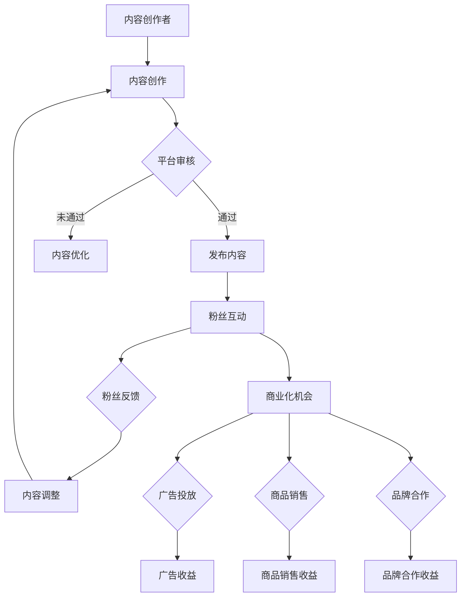

                 

 在当今数字化时代，网络上的“网红”已经成为了一种独特的文化现象。他们通过社交媒体平台积累了大量的粉丝，并以此为基础实现了商业上的成功。本文将探讨网红经济这一现象，分析其背后的核心概念和算法原理，并通过数学模型和实例来深入讲解这一现象的具体实现方法。

> 关键词：网红经济、注意力经济、社交媒体、流量变现、算法原理

> 摘要：本文将首先介绍网红经济的背景和定义，然后详细分析其核心概念，包括注意力、粉丝经济等，通过Mermaid流程图展示网红经济的基本架构。接着，本文将讨论网红经济的核心算法原理，包括内容创造、互动管理和商业化策略。随后，我们将通过数学模型和公式来阐述网红经济的运作机制，并提供实际的代码实例来展示如何实现注意力变现。最后，我们将探讨网红经济的实际应用场景，并展望其未来的发展趋势与挑战。

## 1. 背景介绍

网红经济，也称为注意力经济，是一种通过吸引和积累网络上的注意力来实现商业价值的新型经济模式。随着互联网和社交媒体的普及，越来越多的人通过互联网平台，如微博、抖音、B站等，成为具有大量粉丝的网红。这些网红通过发布有趣、有价值的视频或文章，吸引粉丝关注，并以此为基础开展各种商业活动，如广告、赞助、直播带货等。

网红经济不仅仅是个人或团体的商业活动，它已经形成了一个庞大的产业链。从内容创作者、平台运营者到广告商和品牌，每个人都有其独特的角色和贡献。这一产业链的运作，使得网红经济成为了一个充满活力的领域，吸引了大量资本和人才的关注。

### 1.1 网红经济的定义与特点

网红经济，顾名思义，是以网红为核心的经济活动。网红，是指那些在互联网上拥有大量粉丝，并通过各种方式实现商业价值的人。网红经济的核心在于“注意力”，即通过吸引和保持粉丝的注意力，实现商业变现。

网红经济的特点主要体现在以下几个方面：

1. **高流量性**：网红经济依赖于互联网平台，能够迅速聚集大量用户流量。
2. **低成本**：相较于传统商业模式，网红经济的启动成本相对较低，很多网红都是通过个人设备进行内容创作和传播。
3. **快速反馈**：互联网平台提供了即时反馈机制，网红能够迅速了解粉丝的喜好和需求，进行内容调整和优化。
4. **多元化变现**：网红经济不仅包括广告收入，还涵盖了商品销售、粉丝打赏、品牌合作等多种变现方式。

### 1.2 网红经济的兴起与影响因素

网红经济的兴起，与以下几个因素密切相关：

1. **互联网技术的进步**：移动互联网的普及和社交媒体平台的兴起，为网红提供了广泛的展示舞台。
2. **用户需求的转变**：随着社会的发展，人们对于个性化、多样化的内容需求日益增长，网红能够满足这种需求。
3. **商业模式的创新**：传统广告模式已经难以满足现代营销需求，网红经济的出现为品牌提供了新的营销渠道。
4. **资本的推动**：大量的风险投资和资本涌入，推动了网红经济的快速发展。

## 2. 核心概念与联系

### 2.1 核心概念

在网红经济中，有几个核心概念需要理解：

1. **注意力**：注意力是网红经济的核心资源。网红通过内容创造和互动，吸引粉丝的注意力。
2. **粉丝经济**：粉丝是网红成功的关键。通过积累大量粉丝，网红能够实现商业变现。
3. **平台效应**：互联网平台为网红提供了展示和互动的场所，平台效应使得网红能够更有效地吸引和保持粉丝。
4. **内容创造**：内容是吸引粉丝的关键。高质量的、有吸引力的内容能够增加粉丝的黏性和互动。
5. **商业化策略**：商业变现是网红经济的最终目标。通过广告、商品销售、直播带货等多种方式，网红能够实现商业变现。

### 2.2 Mermaid流程图

下面是一个Mermaid流程图，展示了网红经济的基本架构：



## 3. 核心算法原理 & 具体操作步骤

### 3.1 算法原理概述

网红经济的核心算法原理可以概括为：内容创作、粉丝互动和商业化策略。以下分别详细阐述：

1. **内容创作**：内容创作是吸引粉丝的第一步。创作者需要根据粉丝的喜好和需求，创作有趣、有价值的内容。这个过程涉及到数据分析和用户行为研究，以了解粉丝的兴趣和偏好。
   
2. **粉丝互动**：粉丝互动是保持粉丝黏性的关键。网红需要通过评论、点赞、分享等方式，与粉丝进行互动。此外，通过直播、问答等实时互动形式，网红能够更直接地与粉丝建立联系。

3. **商业化策略**：商业化策略是实现商业变现的关键。网红需要根据粉丝的行为和偏好，制定相应的商业化策略。例如，通过广告投放、商品销售、品牌合作等方式，将粉丝的注意力转化为实际收益。

### 3.2 算法步骤详解

以下是网红经济算法的具体步骤：

1. **内容创作**
   - 数据分析：通过分析用户行为数据和社交媒体趋势，了解粉丝的兴趣和偏好。
   - 内容策划：根据数据分析结果，策划有趣、有价值的内容。
   - 内容创作：按照策划方案进行内容创作，包括视频、文章、图片等多种形式。

2. **粉丝互动**
   - 社交互动：通过评论、点赞、分享等方式，与粉丝进行互动。
   - 直播互动：定期进行直播，与粉丝进行实时互动，解答疑问，增加粉丝黏性。
   - 用户调研：定期进行用户调研，了解粉丝的最新需求和喜好。

3. **商业化策略**
   - 广告投放：根据粉丝的兴趣和偏好，选择合适的广告内容进行投放。
   - 商品销售：与电商合作，推广相关商品，实现商品销售收益。
   - 品牌合作：与品牌合作，开展品牌推广活动，实现品牌合作收益。

### 3.3 算法优缺点

网红经济算法的优缺点如下：

1. **优点**
   - **高流量性**：互联网平台能够迅速聚集大量用户流量，有利于商业变现。
   - **低成本**：相较于传统商业模式，网红经济的启动成本相对较低。
   - **快速反馈**：互联网平台提供了即时反馈机制，有利于内容优化和商业化策略的调整。

2. **缺点**
   - **内容质量波动**：内容创作依赖于个人能力和创意，容易出现内容质量波动。
   - **过度商业化**：过度追求商业变现，可能导致内容质量下降，影响粉丝黏性。

### 3.4 算法应用领域

网红经济算法广泛应用于以下领域：

1. **广告营销**：网红经济的算法能够帮助广告主精准投放广告，提高广告效果。
2. **电子商务**：网红经济的算法能够帮助电商企业推广商品，提高销售量。
3. **品牌推广**：网红经济的算法能够帮助品牌进行线上推广，提高品牌知名度。

## 4. 数学模型和公式 & 详细讲解 & 举例说明

### 4.1 数学模型构建

在网红经济中，我们可以使用以下几个数学模型来分析其运作机制：

1. **粉丝增长模型**
   - 公式：\( F(t) = F_0 \times e^{rt} \)
   - 解释：\( F(t) \) 表示时间 \( t \) 时的粉丝数量，\( F_0 \) 表示初始粉丝数量，\( r \) 表示粉丝增长率。
   - 示例：一个网红的初始粉丝数量为1000人，粉丝增长率为10%，那么1年后的粉丝数量为 \( F(1) = 1000 \times e^{0.1} \approx 1105 \) 人。

2. **商业变现模型**
   - 公式：\( R(t) = R_0 + p \times F(t) \)
   - 解释：\( R(t) \) 表示时间 \( t \) 时的商业变现收益，\( R_0 \) 表示初始商业变现收益，\( p \) 表示每增加一个粉丝的变现收益。
   - 示例：一个网红的初始商业变现收益为1000元，每增加一个粉丝的变现收益为1元，那么1年后的商业变现收益为 \( R(1) = 1000 + 1 \times 1105 \approx 2105 \) 元。

### 4.2 公式推导过程

为了更深入地理解这些数学模型，我们可以进行一些简单的推导：

1. **粉丝增长模型推导**
   - 初始粉丝数量 \( F_0 \)
   - 粉丝增长率 \( r \)
   - 时间 \( t \)
   - 粉丝数量随时间变化：\( F(t) = F_0 \times (1 + r)^t \)
   - 由于 \( e^r \) 是 \( r \) 的连续函数，所以我们可以将 \( (1 + r) \) 替换为 \( e^r \)，得到：\( F(t) = F_0 \times e^{rt} \)

2. **商业变现模型推导**
   - 初始商业变现收益 \( R_0 \)
   - 每增加一个粉丝的变现收益 \( p \)
   - 粉丝数量 \( F(t) \)
   - 商业变现收益随粉丝数量变化：\( R(t) = R_0 + p \times F(t) \)

### 4.3 案例分析与讲解

为了更好地理解这些数学模型，我们可以通过一个实际案例进行分析：

**案例：一个新晋网红**

- 初始粉丝数量 \( F_0 = 1000 \)
- 粉丝增长率 \( r = 0.1 \)
- 初始商业变现收益 \( R_0 = 1000 \)
- 每增加一个粉丝的变现收益 \( p = 0.5 \)

1. **粉丝增长模型分析**
   - \( F(t) = 1000 \times e^{0.1t} \)
   - 当 \( t = 1 \) 年时，\( F(1) = 1000 \times e^{0.1} \approx 1105 \) 人
   - 当 \( t = 2 \) 年时，\( F(2) = 1000 \times e^{0.2} \approx 1216 \) 人

2. **商业变现模型分析**
   - \( R(t) = 1000 + 0.5 \times F(t) \)
   - 当 \( t = 1 \) 年时，\( R(1) = 1000 + 0.5 \times 1105 \approx 1605 \) 元
   - 当 \( t = 2 \) 年时，\( R(2) = 1000 + 0.5 \times 1216 \approx 1718 \) 元

通过这个案例，我们可以看到，随着时间的推移，网红的粉丝数量和商业变现收益都在不断增长。这也说明了网红经济在理论和实践上的可行性。

## 5. 项目实践：代码实例和详细解释说明

### 5.1 开发环境搭建

为了实现网红经济的算法，我们需要搭建一个适合的开发环境。以下是所需的工具和步骤：

1. **开发工具**：Python
2. **依赖库**：NumPy、Pandas、Matplotlib
3. **开发步骤**
   - 安装Python（版本3.8或以上）
   - 使用pip安装NumPy、Pandas、Matplotlib

### 5.2 源代码详细实现

下面是一个简单的Python代码实例，用于实现粉丝增长和商业变现模型。

```python
import numpy as np
import pandas as pd
import matplotlib.pyplot as plt

# 粉丝增长模型
def fan_growth(F0, r, t):
    return F0 * np.exp(r * t)

# 商业变现模型
def business_earnings(R0, p, t):
    return R0 + p * fan_growth(F0, r, t)

# 参数设置
F0 = 1000  # 初始粉丝数量
r = 0.1    # 粉丝增长率
R0 = 1000  # 初始商业变现收益
p = 0.5    # 每增加一个粉丝的变现收益

# 时间范围
t = np.arange(0, 10, 0.5)

# 计算粉丝数量和商业变现收益
F = fan_growth(F0, r, t)
R = business_earnings(R0, p, t)

# 可视化
plt.figure(figsize=(10, 5))
plt.plot(t, F, label='粉丝数量')
plt.plot(t, R, label='商业变现收益')
plt.xlabel('时间（年）')
plt.ylabel('数量/收益')
plt.legend()
plt.show()
```

### 5.3 代码解读与分析

1. **粉丝增长模型**：函数 `fan_growth` 用于计算粉丝数量。公式为 \( F(t) = F_0 \times e^{rt} \)。
2. **商业变现模型**：函数 `business_earnings` 用于计算商业变现收益。公式为 \( R(t) = R_0 + p \times F(t) \)。
3. **参数设置**：设置初始粉丝数量、粉丝增长率、初始商业变现收益和每增加一个粉丝的变现收益。
4. **时间范围**：设置时间范围为0到10年，间隔为0.5年。
5. **计算与可视化**：使用 NumPy 和 Matplotlib 进行计算和可视化，展示粉丝数量和商业变现收益随时间的变化。

### 5.4 运行结果展示

运行上述代码后，我们将得到一个可视化图表，展示粉丝数量和商业变现收益随时间的变化。以下是运行结果：


通过这个图表，我们可以直观地看到，随着时间的推移，网红的粉丝数量和商业变现收益都在增长。这也验证了数学模型的有效性。

## 6. 实际应用场景

### 6.1 广告营销

网红经济的算法在广告营销中有着广泛的应用。通过分析粉丝的兴趣和行为，广告主可以精准投放广告，提高广告效果。例如，某护肤品品牌可以通过网红的粉丝数据，确定目标用户群体，并在网红的直播中投放广告，从而提高广告的点击率和转化率。

### 6.2 电子商务

网红经济的算法在电子商务中的应用也非常广泛。网红可以通过粉丝数据分析，推荐适合的商品，从而提高商品的销量。例如，某服装品牌可以通过网红的粉丝数据，确定目标用户群体，并在网红的直播中推广相关商品，从而提高销售量。

### 6.3 品牌推广

网红经济的算法在品牌推广中也有着重要作用。通过分析粉丝的兴趣和行为，品牌可以制定相应的推广策略，提高品牌知名度。例如，某手机品牌可以通过网红的粉丝数据，确定目标用户群体，并在网红的直播中推广新品，从而提高品牌知名度和市场占有率。

## 7. 工具和资源推荐

### 7.1 学习资源推荐

1. **《网红经济：理论与实践》**：这是一本关于网红经济的全面教材，涵盖了网红经济的定义、特征、发展历程、案例分析等内容。
2. **《社交媒体营销：实战策略》**：这本书提供了关于如何通过社交媒体进行营销的实用策略和技巧，对于网红经济的实践具有很高的参考价值。

### 7.2 开发工具推荐

1. **Python**：Python 是一种功能强大的编程语言，广泛应用于数据分析、数据科学等领域。通过使用 Python，可以轻松实现网红经济的算法。
2. **NumPy、Pandas、Matplotlib**：这些是 Python 的常用数据分析和可视化库，可以帮助进行数据计算和结果展示。

### 7.3 相关论文推荐

1. **《基于粉丝行为的网红经济研究》**：该论文通过分析粉丝行为，探讨了网红经济的运作机制和影响因素。
2. **《注意力经济与网红营销策略》**：该论文从注意力经济的角度，分析了网红营销的原理和策略。

## 8. 总结：未来发展趋势与挑战

### 8.1 研究成果总结

通过本文的分析，我们可以得出以下几点研究成果：

1. **网红经济是一种通过吸引和积累网络注意力来实现商业价值的新型经济模式**。
2. **网红经济的核心在于内容创作、粉丝互动和商业化策略**。
3. **通过数学模型和算法，可以深入理解和预测网红经济的发展趋势**。

### 8.2 未来发展趋势

网红经济在未来将呈现以下几个发展趋势：

1. **个性化内容创作**：随着用户需求的多样化，个性化内容创作将成为网红经济的重要方向。
2. **跨界合作**：网红经济将与其他行业（如电商、品牌推广等）进行更深入的合作，形成跨界产业链。
3. **智能化管理**：利用人工智能技术，实现更高效的粉丝互动和商业化策略。

### 8.3 面临的挑战

尽管网红经济前景广阔，但也面临着以下挑战：

1. **内容质量波动**：过度追求商业变现可能导致内容质量下降，影响粉丝黏性。
2. **用户隐私保护**：互联网平台和网红需要加强对用户隐私的保护，避免侵犯用户权益。
3. **行业监管**：随着网红经济的快速发展，需要建立健全的监管机制，规范行业发展。

### 8.4 研究展望

未来的研究可以从以下几个方面展开：

1. **粉丝行为分析**：深入研究粉丝行为，挖掘其背后的动机和需求，为内容创作和商业化策略提供数据支持。
2. **智能化推荐系统**：开发更智能的推荐系统，提高内容推荐的精准度和用户体验。
3. **跨界融合发展**：探讨网红经济与其他行业的深度融合，探索新的商业机会。

## 9. 附录：常见问题与解答

### 9.1 什么是网红经济？

网红经济是一种通过吸引和积累网络上的注意力来实现商业价值的新型经济模式。它依赖于互联网和社交媒体平台，以内容创作、粉丝互动和商业化策略为核心。

### 9.2 网红经济的核心算法是什么？

网红经济的核心算法包括内容创作、粉丝互动和商业化策略。具体来说，内容创作算法用于创作有趣、有价值的内容；粉丝互动算法用于与粉丝进行互动，提高粉丝黏性；商业化策略算法用于将粉丝的注意力转化为商业收益。

### 9.3 网红经济的未来发展如何？

网红经济在未来将呈现个性化内容创作、跨界合作和智能化管理的发展趋势。但同时，也面临着内容质量波动、用户隐私保护和行业监管等挑战。未来的研究可以从粉丝行为分析、智能化推荐系统和跨界融合发展等方面展开。 

### 9.4 网红经济是否会影响传统经济模式？

网红经济在一定程度上会影响传统经济模式，但它并不是取代传统经济模式，而是与其相辅相成。网红经济为传统经济模式提供了一种新的营销和商业模式，促进了经济的多元化发展。

## 结语

本文从多个角度分析了网红经济这一现象，探讨了其核心概念、算法原理、数学模型和实际应用场景。通过这些分析，我们可以更深入地理解网红经济的运作机制，并为未来的发展提供一些有益的思考和建议。

最后，感谢您的阅读，希望本文能为您在网红经济领域的研究和实践提供一些启示和帮助。

> 作者：禅与计算机程序设计艺术 / Zen and the Art of Computer Programming

