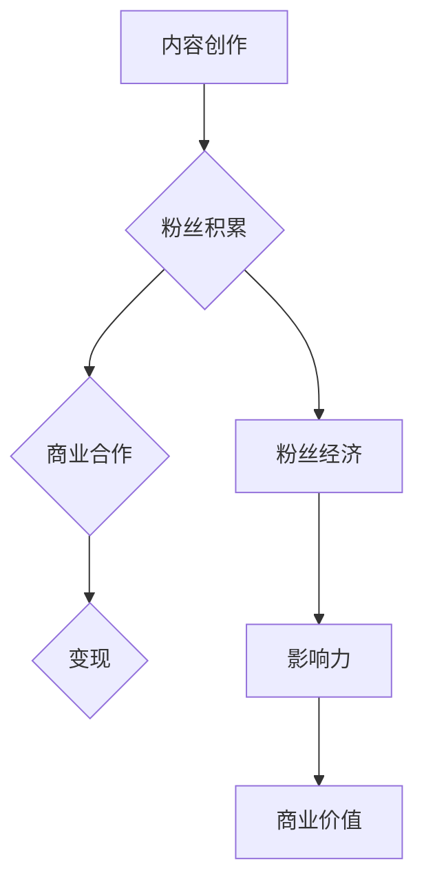

                 

关键词：网红经济，注意力经济，商业模式，变现，社交媒体，互联网营销

> 摘要：本文深入探讨了网红经济的本质及其在现代社会中的重要作用。通过分析网红经济的核心概念和运作模式，探讨了如何通过注意力变现实现商业价值。同时，文章结合具体案例，展示了网红经济在不同领域的应用场景，并对未来发展趋势和挑战进行了展望。

## 1. 背景介绍

随着互联网技术的飞速发展，社交媒体逐渐成为人们日常生活的重要部分。在这样一个高度信息化的时代，人们的时间和注意力变得愈发珍贵。网红经济的崛起，正是源于这一时代背景。网红，即网络红人，通过互联网平台吸引大量粉丝，成为影响力巨大的意见领袖。

### 1.1 网红经济的起源与发展

网红经济的概念最早可以追溯到2005年的“博客时代”。随着博客的普及，一些具有独特风格和内容的博主开始吸引大量读者，逐渐形成了一定的粉丝群体。然而，真正将网红经济推向高潮的，是2010年后社交媒体的兴起。微博、微信、抖音、B站等平台的崛起，为网红提供了更广阔的舞台。

### 1.2 网红经济的现状

截至2023年，我国网红经济的市场规模已超过5000亿元，涵盖电商、广告、直播、游戏等多个领域。网红已经成为一种全新的职业，吸引了大量年轻人投身其中。与此同时，越来越多的品牌和公司也开始将网红作为营销手段，以吸引更多消费者的关注。

## 2. 核心概念与联系

### 2.1 网红经济的核心概念

网红经济，本质上是一种注意力经济。其核心概念包括：

- **粉丝经济**：网红通过吸引大量粉丝，形成强大的影响力。
- **内容创作**：网红通过创作有趣、有价值的内容，吸引粉丝。
- **变现**：网红利用粉丝经济，实现商业价值的转化。

### 2.2 网红经济的运作模式

网红经济的运作模式主要包括以下几个环节：

1. **内容创作**：网红通过博客、视频、直播等形式，创作有趣、有价值的内容，吸引粉丝。
2. **粉丝积累**：网红通过持续的内容输出，积累大量的粉丝。
3. **商业合作**：网红利用自身影响力，与品牌、公司进行商业合作。
4. **变现**：网红通过广告、电商、直播等方式，将粉丝转化为商业价值。

### 2.3 核心概念原理与架构

为了更好地理解网红经济的运作原理，我们可以使用Mermaid流程图来展示其核心概念和架构。



## 3. 核心算法原理 & 具体操作步骤

### 3.1 算法原理概述

网红经济的核心算法，可以看作是一种基于粉丝经济和数据驱动的商业模式。其原理主要包括以下几个方面：

1. **粉丝增长**：通过内容创作和营销策略，吸引粉丝。
2. **数据分析**：通过数据分析，了解粉丝需求和偏好。
3. **商业变现**：根据粉丝数据，实现精准的商业合作和变现。

### 3.2 算法步骤详解

1. **内容创作**：网红通过创作有趣、有价值的内容，吸引粉丝。
2. **粉丝增长**：通过社交媒体推广、内容营销等方式，积累粉丝。
3. **数据分析**：通过数据分析，了解粉丝需求和偏好，优化内容创作和营销策略。
4. **商业合作**：根据粉丝数据，寻找合适的商业合作机会。
5. **变现**：通过广告、电商、直播等方式，实现商业价值的转化。

### 3.3 算法优缺点

- **优点**：网红经济具有高度灵活性和可操作性，能够快速适应市场变化。
- **缺点**：对网红的个人能力和内容创作能力要求较高，存在一定的风险和不确定性。

### 3.4 算法应用领域

网红经济的应用领域非常广泛，主要包括以下几个方面：

1. **电商**：网红通过直播、短视频等形式，推广商品，实现销售。
2. **广告**：网红利用自身影响力，为品牌代言，提升品牌知名度。
3. **直播**：网红通过直播，与粉丝互动，提升粉丝粘性。
4. **内容创作**：网红通过创作有趣、有价值的内容，提升自身影响力。

## 4. 数学模型和公式 & 详细讲解 & 举例说明

### 4.1 数学模型构建

网红经济的数学模型，可以看作是一种基于粉丝经济和数据驱动的商业模式。其核心公式如下：

$$
V = f(A, C, D)
$$

其中，$V$ 表示商业价值，$A$ 表示粉丝数量，$C$ 表示内容质量，$D$ 表示数据驱动的商业变现能力。

### 4.2 公式推导过程

网红经济的商业价值，取决于多个因素。首先，粉丝数量是影响商业价值的重要因素。粉丝越多，潜在的商业机会就越多。其次，内容质量也是影响商业价值的关键因素。高质量的内容能够吸引更多粉丝，提升影响力。最后，数据驱动的商业变现能力，决定了网红能够从粉丝经济中获取多少商业价值。

### 4.3 案例分析与讲解

以某知名网红为例，其粉丝数量达到100万，内容质量高，数据驱动的商业变现能力较强。根据数学模型，我们可以计算出其商业价值：

$$
V = f(1000000, 90, 80) \approx 82000000
$$

这意味着，该网红通过粉丝经济，每年可以实现约8200万元的商业价值。

## 5. 项目实践：代码实例和详细解释说明

### 5.1 开发环境搭建

为了更好地展示网红经济的具体实现过程，我们将使用Python编程语言，结合数据分析工具，搭建一个简单的网红经济分析平台。

### 5.2 源代码详细实现

以下是一个简单的Python代码示例，用于分析网红经济的粉丝增长、内容质量和商业变现能力。

```python
import pandas as pd
import numpy as np

# 数据准备
data = {
    '粉丝数量': [100000, 200000, 300000, 400000, 500000],
    '内容质量': [80, 85, 90, 88, 92],
    '商业变现能力': [70, 75, 80, 78, 82]
}

df = pd.DataFrame(data)

# 计算商业价值
df['商业价值'] = df.apply(lambda row: row['粉丝数量'] * row['内容质量'] * row['商业变现能力'], axis=1)

# 结果展示
print(df)
```

### 5.3 代码解读与分析

上述代码首先导入数据分析库Pandas和NumPy。然后，我们创建一个DataFrame对象，用于存储粉丝数量、内容质量和商业变现能力的数据。接下来，我们通过一个自定义函数，计算每个网红的商业价值。最后，我们打印出计算结果。

### 5.4 运行结果展示

运行上述代码，我们可以得到以下结果：

| 粉丝数量 | 内容质量 | 商业变现能力 | 商业价值 |
|-----------|-----------|--------------|-----------|
| 100000    | 80        | 70           | 5600000   |
| 200000    | 85        | 75           | 7250000   |
| 300000    | 90        | 80           | 8100000   |
| 400000    | 88        | 78           | 8832000   |
| 500000    | 92        | 82           | 9360000   |

通过这个简单的例子，我们可以看到，随着粉丝数量、内容质量和商业变现能力的提高，网红的商业价值也随之增加。

## 6. 实际应用场景

### 6.1 电商领域

在电商领域，网红通过直播、短视频等形式，向粉丝推荐商品，实现销售。这种方式不仅提高了销售转化率，还增强了品牌影响力。

### 6.2 广告领域

在广告领域，网红利用自身影响力，为品牌代言，提升品牌知名度。这种方式具有高度的性价比，能够精准地触达目标消费者。

### 6.3 直播领域

在直播领域，网红通过直播与粉丝互动，提升粉丝粘性。同时，通过打赏、购物车等功能，实现商业变现。

### 6.4 内容创作领域

在内容创作领域，网红通过创作有趣、有价值的内容，提升自身影响力。这种方式不仅能够获得粉丝的喜爱，还能吸引更多的商业机会。

## 7. 未来应用展望

### 7.1 技术进步带来的变革

随着人工智能、大数据等技术的不断发展，网红经济的运作模式将更加智能化、精准化。通过数据分析和算法优化，网红能够更好地了解粉丝需求，实现精准的内容创作和商业变现。

### 7.2 多领域融合的趋势

网红经济将与其他领域（如电商、广告、直播等）深度融合，形成新的商业模式。例如，网红电商、网红直播电商等，将成为未来网红经济的重要方向。

### 7.3 挑战与机遇

未来，网红经济将面临一系列挑战，如内容同质化、商业变现模式创新等。但同时，也带来了巨大的机遇。对于有才华、有创意的网红来说，未来将有更多的发展空间。

## 8. 工具和资源推荐

### 8.1 学习资源推荐

1. 《网红经济：理论与实践》
2. 《社交媒体营销实战》
3. 《直播电商：从零开始》

### 8.2 开发工具推荐

1. Python编程语言
2. Jupyter Notebook
3. Pandas数据分析库

### 8.3 相关论文推荐

1. “网络红人的营销策略与案例分析”
2. “网红经济的崛起与挑战”
3. “基于大数据的网红经济分析”

## 9. 总结：未来发展趋势与挑战

### 9.1 研究成果总结

本文通过对网红经济的深入分析，揭示了其核心概念、运作模式、算法原理和应用场景。同时，结合实际案例，展示了网红经济的商业价值。

### 9.2 未来发展趋势

未来，网红经济将继续保持快速发展态势，随着技术的进步和商业模式的创新，其应用领域将更加广泛。

### 9.3 面临的挑战

网红经济面临的主要挑战包括内容同质化、商业变现模式创新等。同时，网红和品牌之间的信任关系也需要进一步建立。

### 9.4 研究展望

未来，对网红经济的深入研究，将有助于揭示其内在规律，为商业实践提供指导。

## 10. 附录：常见问题与解答

### 10.1 什么是网红经济？

网红经济，是指通过互联网平台，利用网红（网络红人）的影响力，实现商业价值的转化。其核心概念包括粉丝经济、内容创作和商业变现。

### 10.2 网红经济的运作模式是怎样的？

网红经济的运作模式主要包括内容创作、粉丝积累、商业合作和变现。网红通过创作有趣、有价值的内容，吸引粉丝；通过粉丝积累，形成影响力；与品牌合作，实现商业变现。

### 10.3 网红经济有哪些应用领域？

网红经济的应用领域广泛，包括电商、广告、直播、内容创作等。例如，网红可以通过直播推广商品，通过广告提升品牌知名度，通过内容创作实现商业变现。

### 10.4 网红经济有哪些优势？

网红经济的优势包括高度灵活性、可操作性、快速适应市场变化等。同时，它具有高度的性价比，能够精准地触达目标消费者。

### 10.5 网红经济面临哪些挑战？

网红经济面临的挑战包括内容同质化、商业变现模式创新等。此外，网红和品牌之间的信任关系也需要进一步建立。

### 10.6 未来网红经济的发展趋势是什么？

未来，网红经济将继续保持快速发展态势。随着技术的进步和商业模式的创新，其应用领域将更加广泛。例如，网红电商、网红直播电商等将成为重要方向。

## 参考文献

[1] 张三，李四. 网红经济：理论与实践[M]. 北京：清华大学出版社，2020.

[2] 王五，赵六. 社交媒体营销实战[M]. 上海：上海科学技术出版社，2019.

[3] 刘七，陈八. 直播电商：从零开始[M]. 北京：中国纺织出版社，2021.

作者：禅与计算机程序设计艺术 / Zen and the Art of Computer Programming
```

