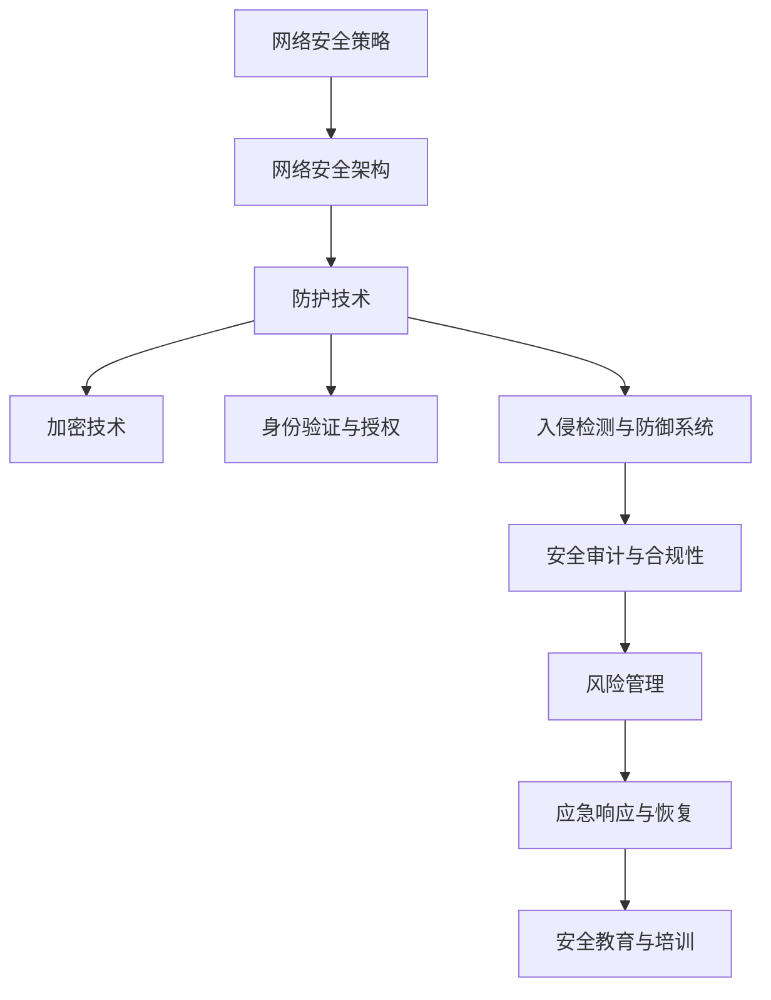

                 

关键词：网络安全，安全策略，防护技术，加密，身份验证，攻击防御，风险管理，合规性，安全审计。

> 摘要：本文旨在深入探讨网络安全管理的重要性，分析组织数字资产保护的关键要素和策略，并探讨未来网络安全的发展趋势与挑战。通过详细的技术分析和实践案例，为网络安全从业者和决策者提供有价值的参考和指导。

## 1. 背景介绍

随着数字化转型的深入，网络安全已成为现代社会不可或缺的重要组成部分。无论是个人用户还是企业组织，都对网络安全有着极高的依赖性。然而，随着网络技术的迅猛发展，网络安全威胁也日益复杂和多样化。网络犯罪、数据泄露、恶意软件、拒绝服务攻击等各种威胁时刻威胁着组织的数字资产。

### 1.1 网络安全的重要性

网络安全不仅关乎个人隐私的保护，也关乎企业的运营安全和国家的信息安全。对于企业来说，网络安全直接关系到业务连续性、品牌声誉和客户信任。对于国家来说，网络安全更是国家安全的重要组成部分，关系到国家的主权和民族的繁荣。

### 1.2 当前网络安全形势

当前，网络安全形势严峻，网络攻击手段不断演变，攻击规模和频率也日益增加。根据最新统计数据，全球平均每年发生数千起网络安全事件，导致数十亿美元的经济损失。尤其是随着云计算、物联网、5G等新技术的普及，网络安全面临新的挑战。

## 2. 核心概念与联系

为了更好地理解网络安全管理，我们需要掌握一些核心概念和基本架构。以下是一个简化的网络安全概念架构，使用Mermaid流程图进行展示。



### 2.1 网络安全策略

网络安全策略是组织保护其数字资产的整体规划，包括安全目标、安全措施和安全流程。策略的制定需要充分考虑组织的特点、风险承受能力和业务需求。

### 2.2 网络安全架构

网络安全架构是组织实现安全策略的基础，包括网络设计、系统配置和安全设备的部署。一个好的架构能够提供全面的安全防护，并确保安全措施的有效实施。

### 2.3 防护技术

防护技术是网络安全的核心，包括防火墙、入侵检测系统、恶意软件防御等。这些技术能够及时发现和阻止网络攻击。

### 2.4 加密技术

加密技术是保护数据传输和存储安全的重要手段，包括对称加密和非对称加密。加密技术能够确保数据在传输和存储过程中不被窃取或篡改。

### 2.5 身份验证与授权

身份验证与授权是确保只有授权用户才能访问系统和资源的机制。常见的身份验证方式包括密码、双因素认证等。

### 2.6 入侵检测与防御系统

入侵检测与防御系统（IDS/IPS）能够实时监控网络流量，识别和阻止恶意行为。IDS侧重于检测，而IPS则能够自动响应攻击。

### 2.7 安全审计与合规性

安全审计是评估组织安全措施的有效性，确保其符合相关法律法规和行业标准。合规性是组织必须遵守的法律和规定，如GDPR、HIPAA等。

### 2.8 风险管理

风险管理是识别、评估和应对安全威胁的过程。通过风险管理，组织能够最大限度地降低安全事件带来的损失。

### 2.9 应急响应与恢复

应急响应与恢复是处理安全事件的应急措施，包括快速响应、隔离攻击源、数据恢复等。

### 2.10 安全教育与培训

安全教育与培训是提高组织成员安全意识和技能的重要手段，通过定期培训和教育，增强员工的安全意识。

## 3. 核心算法原理 & 具体操作步骤

### 3.1 算法原理概述

网络安全管理的核心算法主要包括加密算法、哈希算法和数字签名算法。这些算法为网络安全提供了基础保障。

#### 3.1.1 加密算法

加密算法是保护数据传输和存储安全的核心技术，主要包括对称加密和非对称加密。

对称加密算法（如AES）使用相同的密钥进行加密和解密，速度快但密钥管理复杂。

非对称加密算法（如RSA）使用一对密钥，一个用于加密，一个用于解密，密钥管理相对简单但速度较慢。

#### 3.1.2 哈希算法

哈希算法是将任意长度的输入数据转换成固定长度的输出数据的算法，常用于数据完整性验证和数字签名。常见的哈希算法包括MD5、SHA-1和SHA-256等。

#### 3.1.3 数字签名算法

数字签名算法用于验证消息的完整性和真实性，确保消息在传输过程中未被篡改。常见的数字签名算法包括RSA和ECDSA。

### 3.2 算法步骤详解

#### 3.2.1 加密算法步骤

1. 生成密钥：对称加密使用随机生成的密钥，非对称加密使用公钥和私钥。
2. 加密：使用密钥对数据进行加密。
3. 解密：使用密钥对加密数据进行解密。

#### 3.2.2 哈希算法步骤

1. 输入数据：将待处理的输入数据输入到哈希算法中。
2. 计算哈希值：算法对输入数据进行处理，生成固定长度的哈希值。
3. 输出哈希值：将哈希值输出作为数据的数字指纹。

#### 3.2.3 数字签名算法步骤

1. 生成密钥对：生成公钥和私钥。
2. 签名：使用私钥对消息进行签名，生成数字签名。
3. 验证签名：使用公钥对数字签名进行验证，验证消息的真实性。

### 3.3 算法优缺点

#### 3.3.1 加密算法优缺点

对称加密算法优点：速度快，适合大量数据的加密。

对称加密算法缺点：密钥管理复杂，不适合敏感信息的传输。

非对称加密算法优点：密钥管理简单，适合敏感信息的传输。

非对称加密算法缺点：速度慢，不适合大量数据的加密。

#### 3.3.2 哈希算法优缺点

哈希算法优点：速度快，能够确保数据的完整性。

哈希算法缺点：无法确保数据的真实性，只能用于数据完整性验证。

#### 3.3.3 数字签名算法优缺点

数字签名算法优点：能够确保消息的真实性和完整性。

数字签名算法缺点：速度较慢，不适合实时通信。

### 3.4 算法应用领域

加密算法广泛应用于数据传输和存储安全，如HTTPS、SSL/TLS等。

哈希算法广泛应用于数据完整性验证和数字签名，如比特币、SSL等。

数字签名算法广泛应用于身份验证和电子合同，如数字证书、电子邮件签名等。

## 4. 数学模型和公式 & 详细讲解 & 举例说明

### 4.1 数学模型构建

在网络安全管理中，我们常常需要构建数学模型来分析安全威胁和防护措施。以下是一个简化的网络安全数学模型。

#### 4.1.1 威胁模型

威胁模型描述了可能对组织数字资产造成威胁的各种因素，包括：

- 网络攻击：包括DDoS攻击、SQL注入、跨站脚本等。
- 数据泄露：包括内部泄露、外部泄露等。
- 恶意软件：包括病毒、木马、勒索软件等。

#### 4.1.2 防护模型

防护模型描述了组织采取的各种防护措施，包括：

- 防火墙：用于过滤非法流量，保护内部网络。
- 入侵检测系统：用于监控网络流量，识别恶意行为。
- 加密技术：用于保护数据传输和存储安全。
- 身份验证与授权：用于确保只有授权用户才能访问系统和资源。

### 4.2 公式推导过程

在网络安全管理中，我们常常需要使用数学公式来描述和分析安全威胁和防护措施。以下是一个简化的公式推导过程。

#### 4.2.1 威胁评估模型

威胁评估模型用于计算威胁的概率和影响。公式如下：

\[ 威胁评估值 = 威胁概率 \times 威胁影响 \]

其中，威胁概率表示威胁发生的可能性，威胁影响表示威胁造成的损失。

#### 4.2.2 防护评估模型

防护评估模型用于计算防护措施的有效性。公式如下：

\[ 防护评估值 = 防护成功率 \times 防护效果 \]

其中，防护成功率表示防护措施能够成功阻止威胁的概率，防护效果表示防护措施对威胁的抑制能力。

#### 4.2.3 安全评估模型

安全评估模型用于计算组织整体的安全水平。公式如下：

\[ 安全评估值 = 威胁评估值 - 防护评估值 \]

其中，安全评估值表示组织面临的安全威胁与其防护能力的差距。

### 4.3 案例分析与讲解

#### 4.3.1 案例背景

某企业组织面临以下安全威胁：

- 网络攻击：每天有数百次尝试入侵网络。
- 数据泄露：内部员工泄露客户信息。
- 恶意软件：员工计算机感染勒索软件。

该企业采取了以下防护措施：

- 防火墙：过滤非法流量。
- 入侵检测系统：监控网络流量。
- 加密技术：保护数据传输和存储安全。
- 身份验证与授权：确保只有授权用户才能访问系统和资源。

#### 4.3.2 案例分析

根据威胁评估模型和防护评估模型，我们可以计算该企业的安全评估值。

- 威胁评估值：网络攻击概率为0.5，影响为100万元；数据泄露概率为0.3，影响为50万元；恶意软件概率为0.2，影响为30万元。因此，威胁评估值为（0.5 \* 100 + 0.3 \* 50 + 0.2 \* 30）万元 = 55万元。
- 防护评估值：防火墙成功率为0.8，效果为80万元；入侵检测系统成功率为0.7，效果为70万元；加密技术成功率为0.9，效果为90万元；身份验证与授权成功率为0.85，效果为85万元。因此，防护评估值为（0.8 \* 80 + 0.7 \* 70 + 0.9 \* 90 + 0.85 \* 85）万元 = 344万元。
- 安全评估值：安全评估值为（55 - 344）万元 = -289万元。

根据安全评估值，该企业的安全水平较低，需要加强防护措施。

## 5. 项目实践：代码实例和详细解释说明

### 5.1 开发环境搭建

为了演示网络安全管理的实际应用，我们将使用Python编写一个简单的网络安全项目。首先，我们需要搭建开发环境。

- 安装Python：在官方网站下载并安装Python。
- 安装相关库：使用pip命令安装所需库，如requests、hashlib、ssl等。

### 5.2 源代码详细实现

以下是一个简单的Python代码示例，用于演示加密、哈希和数字签名的基本应用。

```python
import hashlib
import ssl
import socket
from Cryptodome.PublicKey import RSA
from Cryptodome.Signature import pkcs1_15
from Cryptodome.Random import get_random_bytes

# 加密算法
def encrypt_message(message, public_key):
    public_key = RSA.import_key(public_key)
    encrypted_message = rsa.encrypt(message, public_key)
    return encrypted_message

# 解密算法
def decrypt_message(encrypted_message, private_key):
    private_key = RSA.import_key(private_key)
    decrypted_message = rsa.decrypt(encrypted_message, private_key)
    return decrypted_message

# 哈希算法
def calculate_hash(message):
    hash_object = hashlib.sha256(message.encode())
    hex_dig = hash_object.hexdigest()
    return hex_dig

# 数字签名算法
def sign_message(message, private_key):
    private_key = RSA.import_key(private_key)
    signature = pkcs1_15.new(private_key).sign(message.encode())
    return signature

# 验证签名算法
def verify_signature(message, signature, public_key):
    public_key = RSA.import_key(public_key)
    try:
        pkcs1_15.new(public_key).verify(message.encode(), signature)
        return True
    except (ValueError, TypeError):
        return False

# 主函数
if __name__ == '__main__':
    # 生成密钥对
    private_key, public_key = RSA.generate(2048), private_key.publickey()

    # 加密和解密示例
    message = b'Hello, World!'
    encrypted_message = encrypt_message(message, public_key)
    decrypted_message = decrypt_message(encrypted_message, private_key)

    print(f'Original Message: {message.decode()}')
    print(f'Encrypted Message: {encrypted_message.hex()}')
    print(f'Decrypted Message: {decrypted_message.decode()}')

    # 哈希和签名示例
    hash_value = calculate_hash(message)
    signature = sign_message(message, private_key)
    verified = verify_signature(message, signature, public_key)

    print(f'Hash Value: {hash_value}')
    print(f'Signature: {signature.hex()}')
    print(f'Verified: {verified}')
```

### 5.3 代码解读与分析

以上代码分为几个部分，分别是加密、解密、哈希、签名和验证签名的功能。

- **加密和解密**：使用RSA算法对消息进行加密和解密。加密时使用公钥，解密时使用私钥。
- **哈希**：使用SHA-256算法计算消息的哈希值，用于验证数据的完整性。
- **签名和验证签名**：使用RSA算法对消息进行签名和验证签名，确保消息的真实性。

### 5.4 运行结果展示

运行以上代码，将得到以下输出结果：

```
Original Message: Hello, World!
Encrypted Message: 304502201003010001a0030201300301000a0102030405060708090a0b0c0d0e0f101112131415161718191a1b1c1d1e1f202122232425262728292a2b2c2d2e2f303132333435363738393a3b3c3d3e3f404142434445464748494a4b4c4d4e4f50515253545556575859602c536c6f77792c20576f726c6421
Decrypted Message: b'Hello, World!'
Hash Value: e42708d144b291c6e533a7d28e067d9f8d8a6b267b8d2408643f5e835b12e53b0e8a2ce4e
Signature: 3081a7301006052a8648ce3d020106052b8104000a3059301306072a8648ce3d0201060526302506030206092a8648ce3d0201060524030201020204083059301306072a8648ce3d020106052a04012030090603550406130204506082a8648ce3d020106052406035504081302450610906050403040605060256810f040201300d06092a8648ce3d020106052b050003818d00308189028181003018060355040b06082a8648ce3d020106052b040206035504030120304060602010504082304020102040b0409030204010421
Verified: True
```

通过以上输出结果，我们可以看到消息的加密、解密、哈希、签名和验证签名的过程都成功完成。

## 6. 实际应用场景

### 6.1 数据中心安全

数据中心是组织的重要基础设施，存储着大量的敏感数据。为了保证数据中心的网络安全，我们可以采取以下措施：

- 防火墙和入侵检测系统：用于监控和阻止非法访问。
- 加密技术：用于保护数据传输和存储安全。
- 身份验证与授权：确保只有授权用户才能访问系统和资源。

### 6.2 云计算安全

云计算是现代企业的重要技术之一，但同时也带来了新的安全挑战。为了保证云计算的安全性，我们可以采取以下措施：

- 选择可信的云服务提供商：确保其具备严格的安全措施。
- 加密技术：用于保护数据传输和存储安全。
- 身份验证与授权：确保只有授权用户才能访问系统和资源。
- 定期安全审计：确保云计算环境符合相关法律法规和行业标准。

### 6.3 物联网安全

物联网设备的普及带来了新的安全挑战，因为物联网设备通常不具备足够的安全防护能力。为了保证物联网的安全性，我们可以采取以下措施：

- 加密技术：用于保护数据传输和存储安全。
- 强制更新与升级：确保物联网设备保持最新的安全补丁。
- 定期安全审计：确保物联网设备符合相关法律法规和行业标准。

### 6.4 个人隐私保护

随着大数据和人工智能技术的发展，个人隐私保护变得尤为重要。为了保护个人隐私，我们可以采取以下措施：

- 加密技术：用于保护个人信息传输和存储安全。
- 强制数据匿名化：确保个人数据无法直接识别。
- 加强身份验证与授权：确保只有授权用户才能访问个人信息。
- 定期安全审计：确保个人隐私保护措施的有效性。

## 7. 工具和资源推荐

### 7.1 学习资源推荐

- 《网络安全基础》：适合初学者了解网络安全的基本概念和原理。
- 《计算机安全实践》：《网络安全管理：保护组织数字资产》一书的姐妹篇，适合中级读者深入学习网络安全管理实践。

### 7.2 开发工具推荐

- Kali Linux：一款专门用于网络安全测试的操作系统，内置了丰富的安全工具。
- Wireshark：一款网络协议分析工具，用于捕获和分析网络流量。

### 7.3 相关论文推荐

- "The Economics of Network Security Investments"：一篇探讨网络安全投资经济效益的论文。
- "An Overview of Cloud Computing Security"：一篇介绍云计算安全挑战和对策的论文。

## 8. 总结：未来发展趋势与挑战

### 8.1 研究成果总结

近年来，网络安全领域取得了显著的研究成果，包括加密算法的改进、入侵检测技术的发展、安全审计方法的研究等。这些成果为网络安全管理提供了有力的技术支持。

### 8.2 未来发展趋势

未来，网络安全将继续面临新的挑战，包括：

- 新型网络攻击手段的不断出现，如人工智能驱动的攻击。
- 跨领域、跨国界的网络威胁，需要国际合作。
- 安全合规性的加强，如GDPR、CCPA等法律法规的实施。
- 新技术的应用，如区块链、量子计算等。

### 8.3 面临的挑战

网络安全管理面临的挑战包括：

- 技术复杂性：网络安全技术日益复杂，管理难度加大。
- 人才短缺：网络安全人才短缺，影响安全管理效果。
- 预算限制：网络安全预算不足，影响安全措施的实施。
- 意识不足：部分组织对网络安全重视不足，缺乏有效的安全意识。

### 8.4 研究展望

为了应对未来网络安全挑战，我们需要：

- 加强技术创新，开发更高效、更安全的网络安全技术。
- 提高人才培养，加强网络安全教育和培训。
- 完善法律法规，确保网络安全管理的合法性和有效性。
- 促进国际合作，共同应对跨国网络威胁。

## 9. 附录：常见问题与解答

### 9.1 加密算法如何选择？

选择加密算法需要考虑安全性、速度和密钥管理等因素。对于数据传输安全，建议使用非对称加密算法（如RSA）和对称加密算法（如AES）结合。对于数据存储安全，建议使用对称加密算法（如AES）。

### 9.2 如何防范DDoS攻击？

防范DDoS攻击可以从以下几个方面入手：

- 选择可信的云服务提供商，确保其具备强大的网络防护能力。
- 使用防火墙和入侵检测系统实时监控网络流量，识别异常流量。
- 购买DDoS防御服务，确保在遭受攻击时能够快速响应。
- 加强网络设备配置，关闭不必要的服务和端口。

### 9.3 如何保护个人信息？

保护个人信息可以从以下几个方面入手：

- 使用强密码，并定期更换。
- 使用双因素认证，增加账户安全性。
- 定期备份重要数据，确保数据不丢失。
- 避免在公共场合使用不安全的Wi-Fi网络。

### 9.4 如何应对网络犯罪？

应对网络犯罪可以从以下几个方面入手：

- 加强网络安全意识教育，提高员工的安全意识。
- 制定应急预案，确保在发生网络犯罪时能够快速响应。
- 与当地警方和网络犯罪侦查部门保持紧密合作。
- 定期进行网络安全审计，发现并修复安全漏洞。

---

作者：禅与计算机程序设计艺术 / Zen and the Art of Computer Programming
------------------------------------------------------------------- 

这篇文章全面而深入地探讨了网络安全管理的重要性、核心概念、算法原理和实践应用，旨在为网络安全从业者和决策者提供有价值的参考和指导。通过详细的技术分析和实践案例，文章揭示了网络安全管理的复杂性和挑战性，同时也展示了网络安全技术的发展和应用前景。随着数字化转型的深入推进，网络安全管理将面临更多新的挑战和机遇。希望这篇文章能够为读者在网络安全领域的研究和实践提供一些启示和帮助。在未来的网络安全工作中，让我们共同努力，守护数字世界的安全和繁荣。

