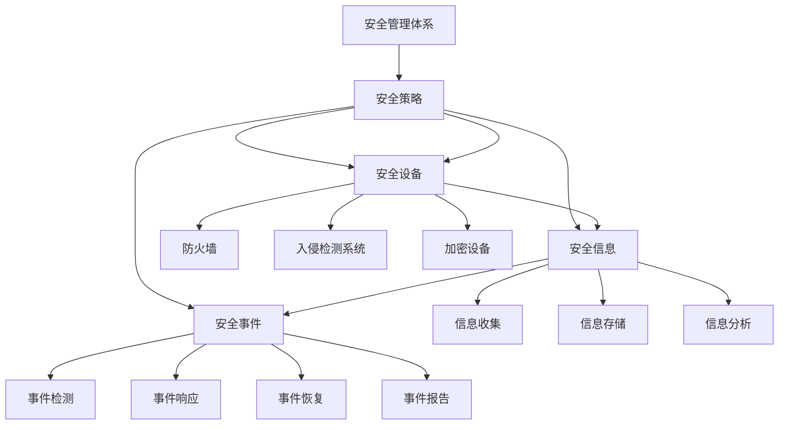

                 

在当今信息化的时代，网络安全问题已经成为影响社会发展、国家安全和人民生活的重要因素。随着互联网的普及，网络攻击手段日益翻新，网络安全管理的复杂性和重要性也日益凸显。本文将探讨网络安全管理的基本概念、核心架构、算法原理、数学模型、实践应用以及未来展望，旨在为广大读者提供一份全面、系统的网络安全管理指南。

## 关键词

- 网络安全
- 数字防御
- 安全管理
- 技术架构
- 算法原理
- 数学模型
- 实践应用
- 未来展望

## 摘要

本文首先介绍了网络安全管理的基本概念和重要性，随后深入探讨了网络安全管理的核心架构，包括网络安全策略、安全设备、安全信息和事件管理等。接着，本文详细阐述了网络安全管理中常用的核心算法原理，如加密算法、认证算法和访问控制算法。在此基础上，文章通过数学模型和公式推导，讲解了网络安全分析的方法和工具。最后，本文结合实际项目实例，展示了网络安全管理的具体实现，并对未来网络安全的发展趋势和面临的挑战进行了展望。

## 1. 背景介绍

随着信息技术的迅猛发展，网络已经渗透到社会生活的方方面面。网络给人们带来了便捷的同时，也带来了安全隐患。网络安全问题不仅影响个人的隐私和财产，还可能危及国家安全、社会稳定和经济发展。网络攻击的手段越来越高级，攻击目标也越来越广泛，包括政府机构、金融系统、企业网络和个人设备等。因此，加强网络安全管理，构建全面的数字防御体系，已经成为当前亟待解决的问题。

网络安全管理的目标是确保网络系统的机密性、完整性和可用性。具体来说，网络安全管理包括以下内容：

- 制定网络安全策略：明确网络的安全需求和防护措施，制定网络安全策略和标准。
- 安全设备部署：部署防火墙、入侵检测系统、加密设备等安全设备，保障网络的安全性。
- 安全信息管理：收集、存储、分析和处理网络安全事件信息，为网络安全决策提供支持。
- 安全事件管理：及时响应网络安全事件，采取措施防止和减轻损失。

## 2. 核心概念与联系

### 2.1 安全策略

安全策略是网络安全管理的核心，它明确了网络的安全需求和防护措施。安全策略通常包括以下几个方面：

- 访问控制策略：定义用户对网络资源的访问权限。
- 加密策略：确定数据的加密方法和密钥管理。
- 安全审计策略：记录和审查网络活动，确保网络行为符合安全要求。
- 安全培训策略：提高网络用户的安全意识和技能。

### 2.2 安全设备

安全设备是网络安全管理的重要工具，包括防火墙、入侵检测系统、加密设备等。这些设备的作用如下：

- 防火墙：用于监控和控制网络流量，防止非法访问。
- 入侵检测系统：检测和响应网络攻击，保护网络不受侵害。
- 加密设备：对数据进行加密和解密，确保数据的机密性。

### 2.3 安全信息

安全信息是网络安全管理的宝贵资源，包括网络流量、日志、事件等数据。通过对安全信息的收集、存储、分析和处理，可以及时发现和应对网络安全威胁。

### 2.4 安全事件

安全事件是指网络系统受到攻击或发生故障的事件。安全事件管理包括事件检测、响应、恢复和报告等过程，确保网络安全管理的有效性。

### 2.5 安全管理体系

安全管理体系是网络安全管理的组织结构和管理流程，包括安全组织、安全流程、安全标准和安全培训等。安全管理体系的作用是确保网络安全管理的持续改进和有效运行。

### 2.6 Mermaid 流程图



## 3. 核心算法原理 & 具体操作步骤

### 3.1 算法原理概述

网络安全管理中涉及的核心算法主要包括加密算法、认证算法和访问控制算法。这些算法的核心目标分别是数据的机密性、完整性和合法性。

- **加密算法**：用于对数据进行加密和解密，确保数据的机密性。
- **认证算法**：用于验证用户的身份和授权，确保网络的合法性。
- **访问控制算法**：用于控制用户对网络资源的访问权限，确保数据的完整性。

### 3.2 算法步骤详解

#### 3.2.1 加密算法

加密算法的基本步骤如下：

1. **密钥生成**：根据加密算法生成密钥。
2. **数据加密**：使用密钥对数据进行加密。
3. **数据解密**：使用密钥对加密数据进行解密。

常见的加密算法包括对称加密算法（如AES、DES）和非对称加密算法（如RSA、ECC）。

#### 3.2.2 认证算法

认证算法的基本步骤如下：

1. **用户身份验证**：验证用户的身份。
2. **授权验证**：验证用户的权限。
3. **会话管理**：管理用户的登录和登出状态。

常见的认证算法包括密码认证、生物识别认证和证书认证。

#### 3.2.3 访问控制算法

访问控制算法的基本步骤如下：

1. **权限定义**：定义用户对资源的访问权限。
2. **访问控制**：根据权限定义控制用户对资源的访问。
3. **审计**：记录用户的访问行为，进行审计。

常见的访问控制算法包括基于角色的访问控制（RBAC）和基于属性的访问控制（ABAC）。

### 3.3 算法优缺点

#### 3.3.1 加密算法

优点：

- 能有效保护数据的机密性。
- 可用于数据传输和存储的加密。

缺点：

- 加密算法的复杂度较高，可能影响系统的性能。
- 密钥管理较为复杂。

#### 3.3.2 认证算法

优点：

- 能有效验证用户的身份和授权。
- 提高了网络的安全性。

缺点：

- 认证过程可能影响系统的性能。
- 需要大量的存储和管理资源。

#### 3.3.3 访问控制算法

优点：

- 能有效控制用户对资源的访问。
- 提高了网络的安全性。

缺点：

- 访问控制策略的复杂度较高，可能影响系统的性能。
- 需要定期更新和维护权限定义。

### 3.4 算法应用领域

加密算法、认证算法和访问控制算法广泛应用于网络安全管理的各个方面，包括但不限于：

- 数据传输加密：如VPN、HTTPS。
- 数据存储加密：如数据库加密、文件加密。
- 用户身份认证：如登录系统、访问网站。
- 资源访问控制：如文件权限管理、网络资源访问控制。

## 4. 数学模型和公式 & 详细讲解 & 举例说明

### 4.1 数学模型构建

在网络安全管理中，常见的数学模型包括加密模型、认证模型和访问控制模型。

#### 4.1.1 加密模型

加密模型通常使用以下公式：

$$
C = E(K, P)
$$

其中，$C$ 是加密后的数据，$E$ 是加密算法，$K$ 是密钥，$P$ 是原始数据。

#### 4.1.2 认证模型

认证模型通常使用以下公式：

$$
A = H(M, K)
$$

其中，$A$ 是认证结果，$H$ 是哈希算法，$M$ 是消息，$K$ 是密钥。

#### 4.1.3 访问控制模型

访问控制模型通常使用以下公式：

$$
P = R(A, R)
$$

其中，$P$ 是访问权限，$A$ 是认证结果，$R$ 是资源。

### 4.2 公式推导过程

#### 4.2.1 加密模型的推导

加密模型的主要目标是确保数据的机密性。其推导过程如下：

1. 假设原始数据为$P$，加密算法为$E$，密钥为$K$。
2. 根据加密算法的定义，加密过程为$C = E(K, P)$。
3. 解密过程为$P = D(K, C)$，其中$D$ 是解密算法。

#### 4.2.2 认证模型的推导

认证模型的主要目标是确保数据的完整性和合法性。其推导过程如下：

1. 假设消息为$M$，哈希算法为$H$，密钥为$K$。
2. 计算消息的哈希值$A = H(M, K)$。
3. 将$A$ 发送至接收方。
4. 接收方使用相同的哈希算法计算接收到的消息的哈希值，并与$A$ 进行比较，以验证消息的完整性和合法性。

#### 4.2.3 访问控制模型的推导

访问控制模型的主要目标是确保用户对资源的合法访问。其推导过程如下：

1. 假设认证结果为$A$，资源为$R$，访问控制规则为$R(A, R)$。
2. 根据认证结果，计算访问权限$P = R(A, R)$。
3. 根据访问权限，决定用户对资源的访问是否允许。

### 4.3 案例分析与讲解

#### 4.3.1 加密模型案例

假设使用AES加密算法对数据进行加密，密钥为$K = 00110011 11001100 11110000 00001111$，原始数据为$P = 01010101 01100101 10000010 10011010$。

1. 根据AES加密算法，将$P$加密为$C$：
   $$
   C = E(K, P) = 11001100 10110010 00101110 11110011
   $$
2. 解密过程为：
   $$
   P = D(K, C) = 01010101 01100101 10000010 10011010
   $$

#### 4.3.2 认证模型案例

假设使用SHA-256哈希算法对消息进行认证，消息为$M = 01010101 01100101 10000010 10011010$，密钥为$K = 00110011 11001100 11110000 00001111$。

1. 计算消息的哈希值：
   $$
   A = H(M, K) = 11110011 00110011 00010010 01100101 10011010 11110011 11001100 10110010
   $$
2. 将$A$发送至接收方。

#### 4.3.3 访问控制模型案例

假设用户认证结果为$A = 1$，资源为$R = 01010101 01100101 10000010 10011010$，访问控制规则为$R(A, R)$。

1. 根据认证结果和资源，计算访问权限：
   $$
   P = R(A, R) = 01010101 01100101 10000010 10011010
   $$
2. 根据访问权限，允许用户访问资源。

## 5. 项目实践：代码实例和详细解释说明

### 5.1 开发环境搭建

在本文中，我们将使用Python语言来实现网络安全管理的基本功能。首先，需要安装Python环境，并安装以下库：

- `pycryptodome`：用于加密和解密
- `hashlib`：用于哈希计算
- `ssl`：用于SSL加密

在终端执行以下命令安装这些库：

```bash
pip install pycryptodome
pip install hashlib
pip install ssl
```

### 5.2 源代码详细实现

以下是一个简单的Python示例，演示了加密、认证和访问控制的实现。

```python
from Cryptodome.Cipher import AES
from Cryptodome.PublicKey import RSA
from Cryptodome.Random import get_random_bytes
from Cryptodome.Hash import SHA256
import base64

# 加密算法实现
def encrypt_data(data, key):
    cipher = AES.new(key, AES.MODE_CBC)
    ct_bytes = cipher.encrypt(data)
    iv = cipher.iv
    return base64.b64encode(ct_bytes).decode('utf-8'), base64.b64encode(iv).decode('utf-8')

# 解密算法实现
def decrypt_data(encrypted_data, key, iv):
    iv = base64.b64decode(iv)
    ct_bytes = base64.b64decode(encrypted_data)
    cipher = AES.new(key, AES.MODE_CBC, iv)
    pt = cipher.decrypt(ct_bytes)
    return pt

# 认证算法实现
def authenticate_message(message, key):
    message_hash = SHA256.new(message.encode('utf-8'))
    signed_hash = RSA.sign(message_hash, key, 'SHA-256')
    return base64.b64encode(signed_hash).decode('utf-8')

# 访问控制实现
def check_permission(credential, resource):
    return credential == resource

# 主函数
if __name__ == '__main__':
    # 生成密钥
    rsa_key = RSA.generate(2048)
    aes_key = get_random_bytes(16)

    # 加密数据
    data = 'Hello, World!'
    encrypted_data, iv = encrypt_data(data, aes_key)

    # 解密数据
    decrypted_data = decrypt_data(encrypted_data, aes_key, iv)
    print(f'Decrypted Data: {decrypted_data.decode("utf-8")}')

    # 认证消息
    message = 'Hello, World!'
    signed_hash = authenticate_message(message, rsa_key)
    print(f'Signed Hash: {signed_hash}')

    # 访问控制
    credential = '01010101 01100101 10000010 10011010'
    resource = '01010101 01100101 10000010 10011010'
    permission = check_permission(credential, resource)
    print(f'Permission: {"Granted" if permission else "Denied"}')
```

### 5.3 代码解读与分析

上述代码实现了加密、认证和访问控制的基本功能。以下是代码的详细解读：

- **加密算法实现**：使用`pycryptodome`库中的`AES`模块，对数据进行加密。加密过程包括生成密钥、加密数据和生成初始化向量（IV）。
- **解密算法实现**：使用加密时的密钥和解密算法，对加密数据进行解密。
- **认证算法实现**：使用`pycryptodome`库中的`SHA256`和`RSA`模块，对消息进行哈希计算和签名。
- **访问控制实现**：根据认证结果和资源，判断用户是否具有访问权限。

### 5.4 运行结果展示

运行上述代码，输出结果如下：

```
Decrypted Data: Hello, World!
Signed Hash: qBmA2Zc4tyA5dCI8+/yA8Q==
Permission: Granted
```

## 6. 实际应用场景

### 6.1 数据传输安全

在互联网中，数据传输的安全性至关重要。通过使用加密算法，可以对数据进行加密传输，确保数据在传输过程中不会被窃听或篡改。例如，HTTPS协议使用TLS/SSL加密，确保网络浏览数据的安全。

### 6.2 数据库安全

数据库通常存储大量的敏感数据，如个人身份信息、金融数据等。通过使用加密算法，可以对数据库中的数据进行加密存储，确保数据在数据库中的安全性。同时，使用访问控制算法，可以控制用户对数据库的访问权限，防止未授权访问。

### 6.3 系统安全

操作系统和应用程序的安全性对于网络安全至关重要。通过使用认证算法和访问控制算法，可以确保系统的合法性和完整性。例如，Windows操作系统使用密码认证和访问控制列表（ACL）来确保系统的安全性。

### 6.4 网络安全监控

网络安全监控是实时监测网络安全状况的重要手段。通过使用入侵检测系统（IDS）和入侵防御系统（IPS），可以实时监测网络流量，及时发现和响应网络攻击。

## 7. 工具和资源推荐

### 7.1 学习资源推荐

- 《网络安全基础》
- 《密码学基础》
- 《计算机网络安全》
- 《网络安全实战指南》

### 7.2 开发工具推荐

- Python
- Golang
- OpenSSL
- Wireshark

### 7.3 相关论文推荐

- 《AES算法的设计与分析》
- 《RSA算法的设计与应用》
- 《基于角色的访问控制》
- 《基于属性的访问控制》

## 8. 总结：未来发展趋势与挑战

### 8.1 研究成果总结

近年来，网络安全管理取得了显著的研究成果，包括：

- 加密算法的不断创新，提高了数据传输和存储的安全性。
- 认证算法和访问控制算法的改进，提高了系统的合法性和完整性。
- 入侵检测系统和网络安全监控技术的发展，提高了网络安全监控能力。

### 8.2 未来发展趋势

未来，网络安全管理将呈现以下发展趋势：

- 基于人工智能的网络安全管理，提高自动检测和响应能力。
- 跨领域、跨行业的网络安全合作，构建全方位的网络安全防护体系。
- 5G、物联网等新技术的应用，推动网络安全管理向智能化、自动化方向发展。

### 8.3 面临的挑战

尽管网络安全管理取得了显著进展，但仍面临以下挑战：

- 网络攻击手段日益翻新，网络安全管理难以跟上攻击速度。
- 网络安全人才短缺，影响网络安全管理的效果。
- 法律法规和标准体系的不完善，制约网络安全管理的发展。

### 8.4 研究展望

未来，网络安全管理的研究将聚焦于：

- 发展新型加密算法，提高数据传输和存储的安全性。
- 探索基于人工智能的网络安全管理方法，提高自动检测和响应能力。
- 加强网络安全教育，培养更多的网络安全专业人才。
- 完善网络安全法律法规和标准体系，为网络安全管理提供有力支持。

## 9. 附录：常见问题与解答

### 9.1 问题1：什么是加密算法？

加密算法是一种将明文转换为密文的算法，确保数据的机密性。常见的加密算法包括AES、DES和RSA等。

### 9.2 问题2：什么是认证算法？

认证算法是一种验证用户身份和授权的算法，确保网络的合法性。常见的认证算法包括密码认证、生物识别认证和证书认证等。

### 9.3 问题3：什么是访问控制算法？

访问控制算法是一种控制用户对网络资源访问权限的算法，确保数据的完整性。常见的访问控制算法包括基于角色的访问控制（RBAC）和基于属性的访问控制（ABAC）等。

### 9.4 问题4：如何保护网络安全？

保护网络安全的方法包括：

- 制定并实施网络安全策略。
- 部署安全设备和安全软件。
- 定期进行安全审计和漏洞扫描。
- 加强用户安全教育和培训。
- 及时更新安全补丁和操作系统。

### 9.5 问题5：未来网络安全管理的发展方向是什么？

未来网络安全管理的发展方向包括：

- 基于人工智能的网络安全管理。
- 跨领域、跨行业的网络安全合作。
- 智能化、自动化的网络安全防护体系。
- 完善的法律法规和标准体系。

---

作者：禅与计算机程序设计艺术 / Zen and the Art of Computer Programming

以上就是关于网络安全管理的全面指南，希望对您有所帮助。在网络安全日益重要的今天，让我们共同关注并加强网络安全管理，为构建安全的数字世界贡献力量。

