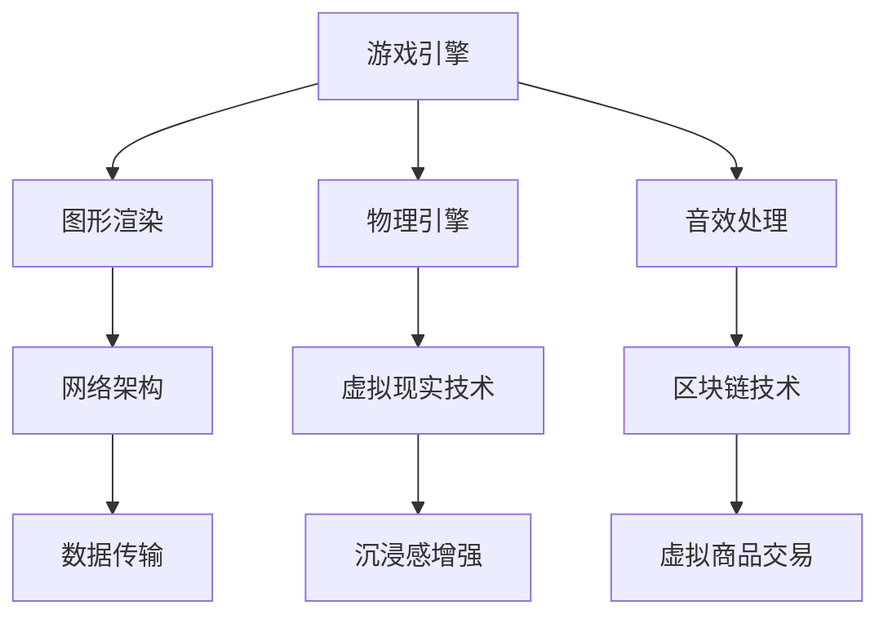

                 

关键词：网络游戏，虚拟世界，商业模式，创业，商业价值，技术架构

> 摘要：本文旨在探讨网络游戏创业在虚拟世界中的商业价值。通过分析虚拟世界的特征、商业模式及技术架构，我们将深入了解网络游戏行业的机遇与挑战，并展望其未来的发展趋势。

## 1. 背景介绍

随着互联网技术的飞速发展，虚拟世界逐渐成为人们生活中不可或缺的一部分。从早期的单机游戏到如今的网络游戏，虚拟世界已经从一个单纯的娱乐工具演变成为一个庞大的商业生态系统。在这个生态系统中，玩家不仅是虚拟世界的参与者，更是商业价值的创造者。

网络游戏创业作为一种新兴的商业形式，吸引了大量的创业者、投资者和从业者。无论是在资本市场上，还是在行业内部，网络游戏都展现出了巨大的潜力。然而，这个领域的竞争也异常激烈，只有具备独特价值主张和创新能力的公司才能在市场中脱颖而出。

本文将重点探讨以下几个方面：

- 虚拟世界的特征和商业模式
- 网络游戏的技术架构
- 创业者在网络游戏领域的机遇与挑战
- 虚拟世界的未来发展趋势

通过这些探讨，我们希望能够为有意在虚拟世界领域创业的人提供一些有价值的参考和启示。

## 2. 核心概念与联系

### 2.1 虚拟世界的特征

虚拟世界是一个由数字技术构建的虚拟空间，它具有以下几个主要特征：

1. **沉浸感**：通过高度逼真的图形、音效和交互设计，使玩家能够沉浸在虚拟世界中，体验到身临其境的感觉。
2. **社交性**：虚拟世界提供了丰富的社交功能，玩家可以与其他玩家互动、组队、交流，建立深厚的社交关系。
3. **可定制性**：玩家可以在虚拟世界中创建和定制自己的角色、物品和空间，这为玩家提供了极大的个性化和创意空间。
4. **持续性**：虚拟世界是持续存在的，玩家即使不在线，他们的角色和所拥有的物品也会保持不变，这为虚拟世界带来了长期的价值。

### 2.2 商业模式

虚拟世界的商业模式多种多样，以下是一些主要的商业模式：

1. **免费增值（Free-to-Play，F2P）**：玩家可以免费进入和游戏，但游戏内会提供付费内容，如道具、装备、游戏币等。
2. **订阅制**：玩家需要支付定期费用才能进入和游戏。
3. **一次性付费**：玩家需要支付一次性的费用才能进入和游戏，后续不再产生费用。
4. **广告支持**：通过在游戏中展示广告来获取收入。
5. **虚拟商品交易**：玩家可以在游戏中购买和交易虚拟商品，如装备、游戏币等。

### 2.3 技术架构

虚拟世界的技术架构复杂而关键，主要包括以下几个方面：

1. **游戏引擎**：游戏引擎是虚拟世界开发的核心工具，它提供了图形渲染、物理引擎、音效处理等基础功能。
2. **网络架构**：虚拟世界需要稳定和高效的网络架构来支持大规模的玩家互动和数据传输。
3. **虚拟现实（VR）技术**：VR技术为玩家提供了更加沉浸式的体验，是虚拟世界的重要组成部分。
4. **区块链技术**：区块链技术为虚拟世界的经济系统提供了去中心化的解决方案，增强了虚拟商品和资产的安全性和透明度。

### 2.4 Mermaid 流程图

以下是虚拟世界技术架构的 Mermaid 流程图：



## 3. 核心算法原理 & 具体操作步骤

### 3.1 算法原理概述

在虚拟世界中，核心算法的原理和具体操作步骤至关重要。以下是几个关键算法的概述：

1. **路径查找算法**：用于计算玩家从当前位置到目标位置的最优路径。
2. **碰撞检测算法**：用于检测玩家与其他物体（如墙壁、怪物等）的碰撞。
3. **网络传输优化算法**：用于优化游戏数据在网络中的传输，提高游戏体验。
4. **虚拟经济模型**：用于模拟虚拟世界中的经济系统，管理虚拟商品和资产。

### 3.2 算法步骤详解

以下是路径查找算法的步骤详解：

1. **输入起点和终点**：玩家输入起点和终点的位置。
2. **建立地图数据结构**：根据地图信息建立数据结构，如图或网格。
3. **计算路径**：使用A*算法或其他路径查找算法计算起点到终点的最优路径。
4. **返回路径**：将计算得到的路径返回给玩家。

### 3.3 算法优缺点

路径查找算法的优点包括：

- **高效性**：能够快速计算出最优路径。
- **灵活性**：适用于各种地图和数据结构。

缺点包括：

- **计算复杂度较高**：特别是在大型地图中，计算量较大。
- **路径稳定性较差**：在动态环境中，路径可能随时发生变化。

### 3.4 算法应用领域

路径查找算法广泛应用于各种虚拟世界，如角色扮演游戏（RPG）、策略游戏等。它在游戏中的主要作用是提高玩家的游戏体验，使玩家能够快速到达目的地，避免不必要的迷路和浪费时间。

### 3.5 算法改进建议

针对路径查找算法的缺点，可以采取以下改进措施：

- **引入实时路径更新**：在动态环境中，实时更新路径，提高路径的稳定性。
- **优化算法复杂度**：通过算法优化，降低计算复杂度，提高计算效率。

## 4. 数学模型和公式 & 详细讲解 & 举例说明

### 4.1 数学模型构建

在虚拟世界中，数学模型的应用非常广泛。以下是一个简单的虚拟经济模型：

- **货币供应量（M）**：虚拟世界中的货币总量。
- **需求（D）**：玩家对虚拟商品的需求量。
- **价格（P）**：虚拟商品的价格。

虚拟经济模型的基本公式为：

\[ P = \frac{M}{D} \]

### 4.2 公式推导过程

虚拟经济模型的推导过程如下：

1. **需求与价格的关系**：假设需求量与价格成反比，即需求量越大，价格越低。
2. **货币供应量的影响**：当货币供应量增加时，价格会下降，因为货币的购买力减弱。
3. **建立模型**：将需求和价格的关系表示为数学公式。

### 4.3 案例分析与讲解

以下是一个具体的案例：

假设一个虚拟世界中，货币供应量为1000，需求量为50。根据虚拟经济模型，我们可以计算出虚拟商品的价格：

\[ P = \frac{1000}{50} = 20 \]

这意味着，在这个虚拟世界中，虚拟商品的价格为20。

现在，如果货币供应量增加到2000，需求量保持不变，价格会降低：

\[ P = \frac{2000}{50} = 40 \]

价格降低了，因为货币供应量增加，货币的购买力减弱。

通过这个案例，我们可以看到数学模型在虚拟世界中的应用，它帮助我们理解和预测虚拟经济的变化。

## 5. 项目实践：代码实例和详细解释说明

### 5.1 开发环境搭建

在进行虚拟世界项目开发之前，我们需要搭建一个合适的开发环境。以下是基本步骤：

1. **安装游戏引擎**：例如Unity、Unreal Engine等。
2. **安装编程语言**：例如C++、C#等。
3. **配置开发工具**：例如Visual Studio、Eclipse等。
4. **安装数据库**：例如MySQL、MongoDB等。
5. **配置版本控制**：例如Git等。

### 5.2 源代码详细实现

以下是一个简单的虚拟世界项目示例代码：

```csharp
// 引入必要的命名空间
using System;
using UnityEngine;

public class VirtualWorld : MonoBehaviour
{
    // 初始化虚拟世界
    void Start()
    {
        // 创建玩家角色
        GameObject player = GameObject.CreatePrimitive(PrimitiveType.Cube);
        player.transform.position = new Vector3(0, 1, 0);
        player.name = "Player";
        
        // 创建地图
        GameObject map = GameObject.CreatePrimitive(PrimitiveType.Cube);
        map.transform.position = new Vector3(0, 0, 0);
        map.transform.localScale = new Vector3(100, 1, 100);
        map.name = "Map";
    }

    // 更新虚拟世界
    void Update()
    {
        // 判断玩家是否移动
        if (Input.GetKeyDown(KeyCode.W))
        {
            // 玩家向上移动
            transform.position += new Vector3(0, 1, 0);
        }
        else if (Input.GetKeyDown(KeyCode.S))
        {
            // 玩家向下移动
            transform.position += new Vector3(0, -1, 0);
        }
    }
}
```

### 5.3 代码解读与分析

该代码实现了一个简单的虚拟世界，其中包含了一个玩家角色和一个地图。以下是代码的详细解读：

- **Start()**：初始化函数，用于创建玩家角色和地图。
- **CreatePrimitive()**：创建一个简单的立方体。
- **transform.position**：设置物体的位置。
- **Update()**：更新函数，用于处理玩家的移动。

通过这个示例，我们可以看到如何使用Unity游戏引擎创建一个基本的虚拟世界。这个示例虽然简单，但展示了虚拟世界项目的核心概念和基本操作。

### 5.4 运行结果展示

在Unity编辑器中运行上述代码，我们可以看到一个简单的三维虚拟世界，玩家角色可以在地面上移动。这只是一个简单的开始，实际的项目会更加复杂，但这个示例为我们提供了一个基本的框架和思路。

## 6. 实际应用场景

虚拟世界在现实生活中的应用越来越广泛，以下是一些实际的应用场景：

1. **虚拟旅游**：通过虚拟世界，用户可以体验到逼真的旅游场景，无需离开家。
2. **在线教育**：虚拟世界为在线教育提供了新的方式，学生可以在虚拟环境中进行互动和学习。
3. **虚拟社交**：虚拟世界为人们提供了一个新的社交平台，用户可以在这个平台上进行交流和互动。
4. **虚拟现实游戏**：虚拟世界为游戏提供了全新的体验，玩家可以在虚拟环境中尽情畅玩。
5. **虚拟经济**：虚拟世界中的虚拟商品和资产具有实际的价值，这为虚拟经济提供了新的机遇。

随着技术的不断进步和应用的不断拓展，虚拟世界的实际应用场景将更加丰富和多样化。

### 6.1 未来应用展望

未来，虚拟世界将在多个领域得到广泛应用，以下是一些展望：

1. **医疗健康**：虚拟世界可以用于医疗训练、心理治疗等，为医疗行业提供新的解决方案。
2. **城市规划**：虚拟世界可以用于城市规划、模拟测试等，提高城市规划的效率和效果。
3. **文化传承**：虚拟世界可以用于文化遗产的保存和展示，让更多人了解和传承传统文化。
4. **虚拟办公**：虚拟世界可以用于远程办公、协作等，提高工作效率和灵活性。
5. **虚拟购物**：虚拟世界可以用于虚拟购物体验，为电子商务提供新的发展方向。

随着虚拟世界技术的不断进步，未来将有更多的应用场景被发掘和实现。

## 7. 工具和资源推荐

### 7.1 学习资源推荐

- **Unity官方文档**：https://docs.unity3d.com/
- **Unreal Engine官方文档**：https://docs.unrealengine.com/
- **游戏开发入门教程**：https://www.gamedev.net/tutorials/

### 7.2 开发工具推荐

- **Visual Studio**：https://visualstudio.microsoft.com/
- **Eclipse**：https://www.eclipse.org/
- **Unity**：https://unity.com/
- **Unreal Engine**：https://www.unrealengine.com/

### 7.3 相关论文推荐

- **“Virtual Worlds and the Future of Business”**：探讨了虚拟世界对商业的影响。
- **“The Economics of Virtual Worlds”**：分析了虚拟世界的经济模型。
- **“Virtual Reality and Its Applications in Education”**：研究了虚拟现实在教育中的应用。

通过这些资源，您可以深入了解虚拟世界的开发和应用。

## 8. 总结：未来发展趋势与挑战

### 8.1 研究成果总结

本文从多个角度对虚拟世界和网络游戏创业进行了深入探讨。我们分析了虚拟世界的特征、商业模式、技术架构，并探讨了核心算法和数学模型。通过实例和实际应用场景，我们展示了虚拟世界的应用价值和开发方法。

### 8.2 未来发展趋势

未来，虚拟世界将继续发展，并在更多领域得到应用。随着技术的进步，虚拟世界的沉浸感、社交性和可定制性将得到进一步提升。虚拟现实（VR）和增强现实（AR）技术的普及，将为虚拟世界带来新的发展机遇。

### 8.3 面临的挑战

尽管虚拟世界具有巨大的潜力，但同时也面临一些挑战。例如，技术门槛较高、开发成本高昂、用户隐私保护等。此外，虚拟世界的商业模式的可持续发展也是一个重要问题。

### 8.4 研究展望

未来，我们需要进一步研究虚拟世界的技术架构、经济模型和商业模式，探索如何更好地利用虚拟世界的商业价值。同时，我们还需要关注虚拟世界中的社会问题，如用户沉迷、虚拟犯罪等，提出有效的解决方案。

## 9. 附录：常见问题与解答

### 9.1 虚拟世界是什么？

虚拟世界是由数字技术构建的虚拟空间，它具有沉浸感、社交性、可定制性和持续性等特征。

### 9.2 虚拟世界的商业模式有哪些？

虚拟世界的商业模式包括免费增值（F2P）、订阅制、一次性付费、广告支持和虚拟商品交易等。

### 9.3 虚拟世界开发需要哪些技术？

虚拟世界开发需要游戏引擎、网络架构、虚拟现实（VR）技术和区块链技术等。

### 9.4 虚拟世界在现实生活中的应用有哪些？

虚拟世界可以用于虚拟旅游、在线教育、虚拟社交、虚拟现实游戏和虚拟经济等。

### 9.5 虚拟世界的未来发展趋势是什么？

未来，虚拟世界将继续发展，并在医疗健康、城市规划、文化传承、虚拟办公和虚拟购物等领域得到应用。

### 9.6 虚拟世界面临的挑战有哪些？

虚拟世界面临的挑战包括技术门槛较高、开发成本高昂、用户隐私保护等。

### 9.7 虚拟世界的商业模式如何可持续发展？

虚拟世界的商业模式需要不断创新和优化，以适应市场的变化和用户的需求。同时，需要关注社会责任，保护用户的权益。

### 9.8 虚拟世界中的社会问题有哪些？

虚拟世界中的社会问题包括用户沉迷、虚拟犯罪、网络暴力等。

### 9.9 如何解决虚拟世界中的社会问题？

解决虚拟世界中的社会问题需要多方面的努力，包括技术手段、法律法规、社会教育等。

通过这些常见问题与解答，我们可以更好地理解和应对虚拟世界中的挑战和问题。

## 10. 作者署名

作者：禅与计算机程序设计艺术 / Zen and the Art of Computer Programming

本文旨在探讨虚拟世界的商业价值和网络游戏创业。通过分析虚拟世界的特征、商业模式和技术架构，我们展示了虚拟世界的巨大潜力。尽管虚拟世界面临着一系列挑战，但未来充满了机遇。随着技术的不断进步，虚拟世界将在更多领域得到应用，为人们带来全新的体验和价值。本文希望为有意在虚拟世界领域创业的人提供一些有价值的参考和启示。禅与计算机程序设计艺术，期待与您一起探索虚拟世界的无限可能。

