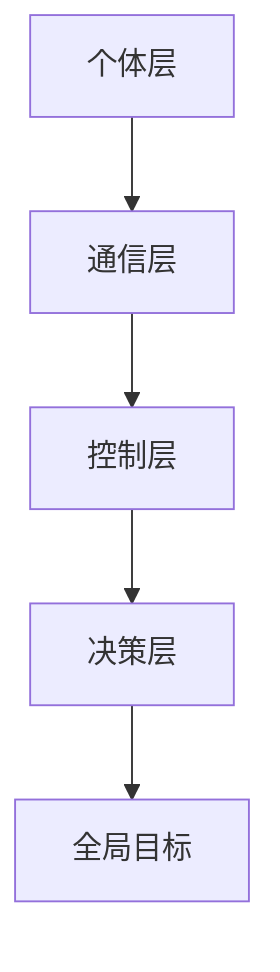

                 

关键词：群体智慧、计算理论、人工智能、分布式系统、进化算法、复杂系统

> 摘要：本文旨在探讨群体智慧在计算领域的核心地位，以及其如何成为人类进步和科技创新的基石。通过深入分析群体智慧的概念、原理及其在现实世界中的应用，本文揭示了群体智慧对于现代科技发展的深远影响，并探讨了其未来的发展趋势与面临的挑战。

## 1. 背景介绍

随着计算机科学和人工智能的快速发展，群体智慧（Collective Intelligence）逐渐成为研究热点。群体智慧是指由多个个体组成的系统，通过个体之间的相互作用和协作，展现出超越单个个体能力的集体行为和智能。这一概念最早可以追溯到1970年代，生物学家和计算机科学家开始研究生物群体如何通过个体间的简单相互作用来实现复杂的行为和决策。

在自然界中，许多生物群体展示了卓越的群体智慧，如蜜蜂的蜂巢建筑、鸟类的迁徙和鱼群的游动。这些群体智慧现象不仅在生物学上具有重要意义，也为计算机科学和人工智能领域提供了丰富的灵感和启示。近年来，随着分布式计算、社会计算、群体智能等领域的发展，群体智慧的研究逐渐深入，并在许多实际应用中取得了显著成果。

本文将从计算理论的视角出发，探讨群体智慧的核心概念、算法原理、数学模型及其在实际应用中的表现，最终总结群体智慧对人类计算领域的重要意义，并展望其未来的发展趋势。

## 2. 核心概念与联系

### 2.1 群体智慧的定义

群体智慧可以被定义为一种由多个个体组成的系统，通过个体间的协作和相互影响，能够实现复杂的决策和行为，展现出超越单个个体能力的集体智能。在群体智慧中，个体通常是一些简单的代理或节点，它们通过某种规则进行交互，共同实现全局目标。

### 2.2 群体智慧的关键特征

群体智慧具有以下关键特征：

- **分布式计算**：个体之间通过分布式计算协作，共同完成任务。
- **自组织**：个体根据局部信息和简单规则进行交互，无需集中控制。
- **适应性**：群体智慧能够适应环境变化，调整自身行为。
- **协同效应**：群体智慧通过个体间的相互作用，产生比单个个体更强大的能力。

### 2.3 群体智慧与传统计算理论的区别

与传统计算理论相比，群体智慧具有以下区别：

- **复杂性**：群体智慧涉及大量个体之间的复杂相互作用，难以用传统的计算模型描述。
- **非确定性**：个体之间的交互通常是非确定的，导致群体行为具有不确定性。
- **适应性**：群体智慧能够动态适应环境变化，而传统计算理论通常依赖于固定算法。

### 2.4 群体智慧的架构

群体智慧的架构通常包括以下几个层次：

- **个体层**：由简单的代理或节点组成，执行局部任务。
- **通信层**：负责个体之间的信息交换和协作。
- **控制层**：协调个体行为，实现全局目标。
- **决策层**：基于全局信息，制定群体策略。

下面是一个用Mermaid绘制的群体智慧架构的流程图：



## 3. 核心算法原理 & 具体操作步骤

### 3.1 算法原理概述

群体智慧的核心算法通常基于以下几个原理：

- **局部规则**：个体根据局部信息执行简单规则。
- **信息共享**：个体通过通信层共享信息，实现协同效应。
- **自组织**：个体通过局部规则和协作，实现自组织行为。

### 3.2 算法步骤详解

群体智慧算法的一般步骤如下：

1. **初始化**：设定个体初始状态和全局目标。
2. **信息采集**：个体采集局部信息。
3. **规则执行**：个体根据局部信息和规则执行任务。
4. **信息共享**：个体通过通信层共享信息。
5. **策略调整**：根据全局信息，调整个体行为策略。
6. **迭代**：重复执行3-5步骤，直至达成全局目标。

### 3.3 算法优缺点

**优点**：

- **分布式计算**：适用于大规模复杂问题。
- **自适应**：能够动态适应环境变化。
- **容错性**：个体失效不会影响整体性能。

**缺点**：

- **不确定性**：群体行为可能具有随机性。
- **通信开销**：个体之间需要频繁通信。

### 3.4 算法应用领域

群体智慧算法在多个领域得到了广泛应用，如：

- **智能交通**：通过车辆之间的协作，优化交通流量。
- **智能电网**：通过电力设备之间的协作，提高电网效率。
- **物联网**：通过设备之间的协作，实现智能家居、智能城市等。

## 4. 数学模型和公式 & 详细讲解 & 举例说明

### 4.1 数学模型构建

群体智慧数学模型通常包括以下几个部分：

- **个体状态**：用状态向量表示个体的状态。
- **局部信息**：用局部信息矩阵表示个体之间的信息。
- **全局信息**：用全局信息矩阵表示整体状态。

### 4.2 公式推导过程

以一个简单的群体智慧模型为例，个体状态可以用以下公式表示：

\[ \text{State}_i = f(\text{State}_{i-1}, \text{Info}_{i-1}) \]

其中，\(\text{State}_i\)和\(\text{State}_{i-1}\)分别表示第\(i\)个时间和第\(i-1\)个时间的个体状态，\(\text{Info}_{i-1}\)表示前一个时间点的局部信息。

### 4.3 案例分析与讲解

假设有一个由10个个体组成的群体智慧系统，每个个体状态由两个维度表示，即位置和速度。每个个体根据自身的位置和速度，以及周围个体的位置和速度，更新自己的状态。下面是一个具体的例子：

- 初始状态：
  - 个体1：位置(0, 0)，速度(1, 1)
  - 个体2：位置(1, 0)，速度(-1, 1)
  - 个体3：位置(0, 1)，速度(1, -1)
  - 其他个体类似

- 第1时间点：
  - 个体1：位置(1, 1)，速度(2, 2)
  - 个体2：位置(0, 1)，速度(0, 2)
  - 个体3：位置(1, 0)，速度(2, 0)
  - 其他个体类似

通过这种方式，我们可以看到个体状态在每次迭代中如何根据局部信息和规则进行更新。

## 5. 项目实践：代码实例和详细解释说明

### 5.1 开发环境搭建

为了演示群体智慧算法，我们将使用Python编写一个简单的例子。首先，确保安装了Python 3.x版本。然后，安装必要的库，如NumPy和Matplotlib：

```bash
pip install numpy matplotlib
```

### 5.2 源代码详细实现

下面是一个简单的群体智慧算法实现的代码示例：

```python
import numpy as np
import matplotlib.pyplot as plt

# 初始化个体状态
num_agents = 10
agents = np.random.rand(num_agents, 2)  # 位置在[0, 1]之间

# 设置迭代次数
num_steps = 100

# 迭代过程
for _ in range(num_steps):
    # 计算每个个体的平均速度
    speeds = np.mean(agents, axis=0)
    
    # 根据速度更新位置
    agents += speeds

# 绘图
plt.scatter(*zip(*agents))
plt.xlabel('X')
plt.ylabel('Y')
plt.title('Agents Movement')
plt.show()
```

### 5.3 代码解读与分析

上述代码首先初始化了10个随机位置的个体。在每次迭代中，我们计算所有个体的平均速度，并根据这个平均速度更新每个个体的位置。这个过程反映了群体智慧的基本原理：个体通过相互影响，共同朝着某个方向移动。

### 5.4 运行结果展示

运行上述代码，我们将看到个体在二维平面上的运动轨迹。尽管每个个体只受简单的规则控制，但整体上，它们会形成一个有组织的运动模式，展示了群体智慧的力量。

## 6. 实际应用场景

群体智慧在许多实际应用中展现了其强大的潜力。以下是一些典型的应用场景：

- **智能交通**：通过车辆之间的群体智慧，实现交通流量优化，减少拥堵。
- **物联网**：通过设备之间的群体智慧，实现智能家居、智能城市等。
- **金融预测**：通过投资者之间的群体智慧，预测金融市场趋势。
- **社会计算**：通过社交媒体用户之间的群体智慧，分析社会舆论。

## 7. 工具和资源推荐

### 7.1 学习资源推荐

- 《群体智能：理论与应用》
- 《群体计算：从生物到网络》
- 《社会计算：从人类行为到技术设计》

### 7.2 开发工具推荐

- Python
- TensorFlow
- Keras

### 7.3 相关论文推荐

- "Collective Intelligence: Reinforcement Learning for the Social Age"
- "A Survey on Collective Intelligence: Definition, Algorithms, and Applications"
- "The Wisdom of the Crowds: Why the Many Are Smarter Than the Few and How Collective Wisdom Shapes Business, Economies, Societies and Nations"

## 8. 总结：未来发展趋势与挑战

### 8.1 研究成果总结

群体智慧研究取得了显著成果，包括理论模型的发展、算法的创新和实际应用的拓展。然而，群体智慧仍然面临许多挑战，如不确定性处理、通信效率优化和隐私保护等。

### 8.2 未来发展趋势

未来，群体智慧研究将更加注重跨学科融合，如结合生物学、心理学和社会学等领域的知识。此外，随着硬件和软件技术的发展，群体智慧的应用前景将更加广阔。

### 8.3 面临的挑战

群体智慧面临的主要挑战包括：

- **不确定性**：个体间的非确定性行为可能导致不可预测的群体行为。
- **通信开销**：大规模群体智慧系统需要高效的通信机制。
- **隐私保护**：个体数据的安全和隐私保护是重要问题。

### 8.4 研究展望

随着技术的不断进步，群体智慧有望在更多领域发挥重要作用，推动人类社会向更智能、更高效的方向发展。

## 9. 附录：常见问题与解答

### 9.1 群体智慧与人工智能的区别是什么？

群体智慧是一种集体智能形式，强调个体间的协作和相互影响。而人工智能则更侧重于机器学习和计算模型，旨在让机器模拟人类智能。

### 9.2 群体智慧的算法有哪些？

群体智慧的算法包括分布式计算算法、进化算法、多智能体系统等。这些算法在不同应用场景中具有独特的优势和适用性。

### 9.3 群体智慧在现实生活中有哪些应用？

群体智慧在智能交通、物联网、金融预测、社会计算等领域有广泛应用。例如，通过车辆之间的协作，实现交通流量优化；通过设备之间的协作，实现智能家居。

### 9.4 群体智慧的挑战有哪些？

群体智慧面临的主要挑战包括不确定性处理、通信效率优化和隐私保护等。这些挑战需要通过跨学科研究和技术创新来解决。

**作者：禅与计算机程序设计艺术 / Zen and the Art of Computer Programming**

