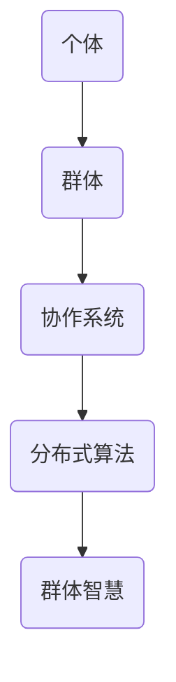

                 

关键词：群体智慧，计算潜力，协作系统，分布式算法，人工智能，机器学习，计算理论。

> 摘要：本文探讨了群体智慧在计算机科学领域的应用和潜力，分析了群体智慧的基本概念、核心算法原理、数学模型及实际应用场景，并提出了未来发展的趋势与挑战。通过介绍群体智慧的优势和应用案例，旨在激发读者对这一领域的深入思考和探索。

## 1. 背景介绍

在当今的科技时代，计算机技术不断发展，数据处理能力日益增强，然而面对复杂的问题和大规模的数据，传统的计算模式已经难以满足需求。此时，群体智慧的概念逐渐受到重视，成为解决复杂计算问题的重要途径之一。

群体智慧（Collective Intelligence）指的是由多个个体组成的系统通过协同合作，能够实现比单个个体更为复杂的任务和决策。这一概念最早可以追溯到动物群体的行为研究，如鸟群的飞行、鱼群的游动等。随着计算机科学和人工智能的发展，群体智慧的概念被引入到计算机系统中，并在网络协作、分布式计算、数据挖掘等领域展现出巨大的潜力。

本文将从以下几个方面探讨群体智慧在计算机科学领域的应用和潜力：

1. 核心概念与联系
2. 核心算法原理 & 具体操作步骤
3. 数学模型和公式 & 详细讲解 & 举例说明
4. 项目实践：代码实例和详细解释说明
5. 实际应用场景
6. 未来应用展望
7. 工具和资源推荐
8. 总结：未来发展趋势与挑战
9. 附录：常见问题与解答

### 1.1 群体智慧的起源和发展

群体智慧的概念起源于对自然界中动物群体行为的观察和研究。在自然界中，许多动物群体展现出了惊人的协作能力和智能行为，如鸟群的迁徙、蜜蜂的巢穴建造等。这些现象激发了人们对群体智慧的兴趣，促使科学家开始研究群体行为中的基本原理和规律。

在计算机科学领域，群体智慧的研究始于20世纪80年代。当时，分布式计算和网络技术的发展为群体智慧的应用提供了新的契机。早期的研究主要集中于模拟动物群体行为，如使用遗传算法和蚁群算法模拟社会性昆虫的行为。随着人工智能和机器学习技术的发展，群体智慧逐渐成为计算机科学中的一个重要研究方向。

### 1.2 群体智慧在计算机科学中的重要性

群体智慧在计算机科学中的应用具有重要意义，主要体现在以下几个方面：

1. **解决复杂问题**：群体智慧能够将复杂问题分解为多个子问题，通过分布式计算和协作求解，提高问题解决的效率和质量。
2. **增强系统可靠性**：群体智慧能够通过多个个体的协同工作，提高系统的容错能力和鲁棒性，增强系统的稳定性。
3. **优化资源分配**：群体智慧能够在资源有限的条件下，通过个体间的协作和竞争，实现资源的最优分配，提高系统的效率。
4. **智能决策**：群体智慧能够通过多个个体的反馈和协同工作，实现智能决策，提高系统的决策能力。

总之，群体智慧为计算机科学提供了新的方法和思路，为解决复杂计算问题提供了有力的工具。

### 1.3 本文结构

本文将首先介绍群体智慧的基本概念和核心算法原理，然后详细讲解数学模型和公式，并通过实际项目实践展示群体智慧的应用，最后探讨群体智慧的实际应用场景和未来发展趋势。

## 2. 核心概念与联系

在探讨群体智慧之前，我们需要明确几个核心概念：个体、群体、协作系统和分布式算法。

### 2.1 个体与群体

个体是指具有独立行为能力的计算单元，可以是计算机、机器人或其他智能设备。个体通常具有一定的感知能力和决策能力，能够在局部环境中进行自主行动。

群体则是由多个个体组成的集合，这些个体通过通信和协作，共同完成复杂的任务。群体中的每个个体都扮演着特定的角色，并通过相互作用实现整体的目标。

### 2.2 协作系统

协作系统是一种通过个体之间的协作和通信，实现共同目标的系统。在协作系统中，个体需要共享信息、协调行动，并共同完成任务。协作系统的关键在于如何设计个体之间的通信机制和协作策略，以实现高效和可靠的协作。

### 2.3 分布式算法

分布式算法是一种在分布式系统中，通过多个计算节点协作，共同解决问题的算法。分布式算法的核心思想是将复杂问题分解为多个子问题，然后分配给不同的计算节点进行独立求解，最后将子问题的解合并为全局问题的解。

### 2.4 群体智慧与这些概念的联系

群体智慧是协作系统和分布式算法在特定环境下的应用。个体是群体智慧的基础，群体是群体智慧的表现形式，协作系统是群体智慧的实现机制，分布式算法是群体智慧的计算工具。

为了更直观地理解这些概念之间的联系，我们可以使用 Mermaid 流程图来展示群体智慧的基本架构。以下是一个简单的 Mermaid 流程图示例：



在图中，个体 A 通过协作系统 C 和分布式算法 D，形成了群体 B，进而实现了群体智慧 E。这个流程图展示了群体智慧的基本概念和它们之间的相互关系。

### 2.5 群体智慧的关键特征

群体智慧具有以下几个关键特征：

1. **分布式计算**：群体智慧通过多个个体的协作，实现任务的分布式计算，提高了计算效率和容错能力。
2. **自适应性和灵活性**：群体智慧能够根据环境变化和任务需求，自适应地调整个体的行为和协作策略。
3. **协同优化**：群体智慧通过多个个体的协同工作，实现整体优化，比单个个体能够解决更为复杂的问题。
4. **自组织性**：群体智慧中的个体通过自组织的方式，形成有组织的群体结构，提高了系统的稳定性和鲁棒性。

### 2.6 群体智慧的分类

根据群体智慧的应用场景和实现方法，可以将群体智慧分为以下几类：

1. **基于规则的群体智慧**：这种类型的群体智慧通过预设的规则和逻辑关系，实现个体之间的协作和决策。
2. **基于仿生的群体智慧**：这种类型的群体智慧通过模仿自然界中动物群体的行为和模式，实现个体之间的协作和任务分工。
3. **基于学习的群体智慧**：这种类型的群体智慧通过机器学习和数据挖掘技术，从大量数据中学习个体的行为模式，实现智能协作和优化。
4. **基于博弈论的群体智慧**：这种类型的群体智慧通过博弈论的方法，分析个体之间的策略和交互，实现最佳协作和整体优化。

不同类型的群体智慧在实现机制和应用场景上有所不同，但都旨在提高系统的计算效率和决策能力。

### 2.7 群体智慧的应用领域

群体智慧在计算机科学和人工智能领域有着广泛的应用，主要包括以下几个方面：

1. **网络协作**：群体智慧可以用于优化网络中的数据传输和任务分配，提高网络的性能和可靠性。
2. **分布式计算**：群体智慧可以用于分布式系统中的任务分配和调度，提高系统的效率和处理能力。
3. **数据挖掘**：群体智慧可以用于大规模数据的挖掘和分析，发现潜在的模式和规律。
4. **智能交通**：群体智慧可以用于优化交通流量和路径规划，提高交通系统的效率。
5. **智能制造**：群体智慧可以用于优化生产流程和资源分配，提高制造业的效率和质量。

总之，群体智慧在计算机科学和人工智能领域具有巨大的应用潜力，为解决复杂计算问题提供了新的思路和方法。

### 2.8 群体智慧的优势

群体智慧具有以下几个显著的优势：

1. **高效性**：群体智慧通过分布式计算和协作优化，能够在短时间内解决复杂问题，提高计算效率。
2. **容错性**：群体智慧中的个体可以相互备份，当某个个体出现故障时，其他个体可以继续工作，提高了系统的可靠性。
3. **灵活性**：群体智慧能够根据环境变化和任务需求，自适应地调整个体的行为和协作策略，提高了系统的适应性。
4. **智能性**：群体智慧通过学习和优化，能够不断提高个体的智能水平，实现更高级的决策和协作。

这些优势使得群体智慧成为解决复杂计算问题的重要工具。

### 2.9 群体智慧的挑战

尽管群体智慧具有显著的优势，但在实际应用中仍面临着一系列挑战：

1. **通信延迟**：群体智慧依赖于个体之间的通信，当通信延迟较大时，会影响群体的效率和稳定性。
2. **资源限制**：群体智慧中的个体通常受限于计算资源和能源，如何在有限的资源下实现高效协作是关键问题。
3. **隐私和安全**：在群体智慧系统中，个体之间的数据共享和通信可能带来隐私和安全问题，需要有效保护。
4. **协调冲突**：群体智慧中的个体可能会产生冲突和竞争，如何协调个体之间的利益和行动是重要挑战。

解决这些挑战，将有助于更好地发挥群体智慧的优势。

### 2.10 总结

通过以上对群体智慧核心概念、联系和优势的介绍，我们可以看到群体智慧在计算机科学领域具有重要的应用价值。在接下来的章节中，我们将进一步探讨群体智慧的核心算法原理、数学模型以及实际应用案例，以展示群体智慧的无限潜力。

## 3. 核心算法原理 & 具体操作步骤

### 3.1 算法原理概述

群体智慧的核心算法主要包括分布式算法和协作算法两大类。分布式算法通过将复杂任务分解为多个子任务，分配给不同的计算节点独立求解，最后合并子任务的解以得到全局问题的解。协作算法则侧重于个体之间的信息共享、策略协调和决策优化。

在分布式算法中，常用的算法包括遗传算法、蚁群算法和粒子群优化算法等。这些算法通过模拟生物进化的过程，实现个体的适应性和进化。遗传算法通过遗传操作，如交叉和变异，不断优化个体的基因，实现问题的最优解。蚁群算法通过模拟蚂蚁的觅食行为，实现路径规划和优化。粒子群优化算法通过模拟鸟群的觅食行为，优化目标函数。

在协作算法中，常用的算法包括基于规则的协作算法、基于仿生的协作算法和基于学习的协作算法等。基于规则的协作算法通过预设的规则和逻辑关系，实现个体之间的协作和决策。基于仿生的协作算法通过模仿自然界中动物群体的行为，实现个体之间的协作和任务分工。基于学习的协作算法通过机器学习和数据挖掘技术，从大量数据中学习个体的行为模式，实现智能协作和优化。

### 3.2 算法步骤详解

以下是群体智慧的核心算法步骤详解：

#### 3.2.1 分布式算法步骤

1. **任务分解**：将复杂任务分解为多个子任务，并确定子任务的执行顺序。
2. **任务分配**：根据计算节点的能力和负载，将子任务分配给不同的计算节点。
3. **独立求解**：各个计算节点独立求解子任务，生成子任务的解。
4. **解合并**：将各个计算节点的子任务解合并为全局问题的解。

#### 3.2.2 协作算法步骤

1. **信息共享**：个体之间通过通信共享相关信息，如任务状态、资源情况和策略等。
2. **策略协调**：个体根据共享的信息，调整自己的行为和策略，实现整体优化。
3. **决策优化**：通过迭代优化过程，不断调整个体的行为和策略，提高决策质量。
4. **协作实现**：通过个体之间的协作，实现复杂任务的高效完成。

#### 3.2.3 算法应用实例

以蚁群算法为例，其基本步骤如下：

1. **初始化**：设置蚂蚁的数量、信息素浓度和路径选择概率等参数。
2. **信息素更新**：根据蚂蚁经过的路径更新信息素浓度，路径越长，信息素浓度越高。
3. **路径选择**：蚂蚁根据信息素浓度和随机性选择路径，逐步逼近最优路径。
4. **循环迭代**：重复路径选择和信息素更新过程，直到达到终止条件，如迭代次数达到或最优路径找到。

通过以上步骤，蚁群算法能够逐步优化路径选择，实现路径规划和优化。

### 3.3 算法优缺点

#### 优点

1. **高效性**：分布式算法通过并行计算，提高了问题解决的效率。
2. **适应性**：协作算法能够根据环境变化和任务需求，自适应地调整个体的行为和策略。
3. **灵活性**：分布式算法和协作算法能够适应不同类型的问题，具有广泛的适用性。
4. **智能性**：基于学习的协作算法通过数据挖掘和机器学习，实现智能决策和优化。

#### 缺点

1. **通信延迟**：分布式算法依赖于个体之间的通信，通信延迟会影响算法的效率。
2. **资源限制**：个体受限于计算资源和能源，可能影响算法的执行效果。
3. **隐私和安全**：个体之间的数据共享和通信可能带来隐私和安全问题，需要有效保护。
4. **协调冲突**：个体之间的协调和冲突管理是分布式算法和协作算法的难点。

### 3.4 算法应用领域

群体智慧的核心算法在多个领域有着广泛的应用：

1. **网络协作**：如路由优化、负载均衡和资源分配等，提高网络性能和可靠性。
2. **分布式计算**：如分布式存储、分布式计算和云计算等，提高计算效率和资源利用率。
3. **数据挖掘**：如大规模数据的聚类、分类和关联规则挖掘等，发现潜在的模式和规律。
4. **智能交通**：如交通流量优化、路径规划和交通信号控制等，提高交通系统的效率。
5. **智能制造**：如生产流程优化、资源分配和设备维护等，提高制造业的效率和质量。

总之，群体智慧的核心算法在计算机科学和人工智能领域具有重要的应用价值，为解决复杂计算问题提供了新的思路和方法。

## 4. 数学模型和公式 & 详细讲解 & 举例说明

### 4.1 数学模型构建

群体智慧中的数学模型是描述个体行为、群体行为以及群体决策的关键工具。在构建数学模型时，我们通常关注以下几个核心方面：

1. **个体行为模型**：描述个体如何感知环境、做出决策和执行动作。
2. **群体行为模型**：描述群体如何通过个体之间的交互和协作实现整体目标。
3. **决策模型**：描述群体如何根据环境变化和任务需求进行智能决策。

#### 4.1.1 个体行为模型

个体行为模型通常可以用以下公式表示：

\[ \text{action}_i = f(\text{state}_i, \text{history}_i) \]

其中：
- \( \text{action}_i \) 表示个体 \( i \) 的行动；
- \( \text{state}_i \) 表示个体 \( i \) 的当前状态；
- \( \text{history}_i \) 表示个体 \( i \) 的历史行为。

#### 4.1.2 群体行为模型

群体行为模型可以用以下公式表示：

\[ \text{group\_action} = \sum_{i=1}^{N} \text{weight}_i \cdot \text{action}_i \]

其中：
- \( \text{group\_action} \) 表示群体的整体行动；
- \( N \) 表示群体中的个体数量；
- \( \text{weight}_i \) 表示个体 \( i \) 在群体中的权重，通常与个体的能力、历史贡献等因素相关。

#### 4.1.3 决策模型

决策模型通常可以采用以下公式表示：

\[ \text{decision} = \arg\max_{\text{action}} \left( \text{reward}( \text{action} ) - \text{penalty}( \text{action} ) \right) \]

其中：
- \( \text{decision} \) 表示决策结果；
- \( \text{reward}( \text{action} ) \) 表示执行某行动后的奖励值；
- \( \text{penalty}( \text{action} ) \) 表示执行某行动后的惩罚值。

### 4.2 公式推导过程

为了更好地理解群体智慧中的数学模型，我们将通过一个简单的例子来推导个体行为模型和群体行为模型。

#### 4.2.1 个体行为模型推导

假设一个个体在环境中进行决策时，其行动依赖于其感知到的状态和历史行为。我们可以用以下公式来描述个体行为模型：

\[ \text{action}_i = \begin{cases}
\text{move\_forward} & \text{if } \text{state}_i = \text{safe} \\
\text{stop} & \text{if } \text{state}_i = \text{danger} \\
\text{search} & \text{otherwise}
\end{cases} \]

这里的感知状态 \( \text{state}_i \) 可以是一个简单的二进制变量，表示个体所处的安全状态（0）或危险状态（1）。历史行为 \( \text{history}_i \) 可以是一个记录个体过去行为的序列，用于预测个体未来的行为。

#### 4.2.2 群体行为模型推导

现在，我们考虑群体行为模型。假设有 \( N \) 个个体组成一个群体，每个个体根据其感知状态和历史行为做出行动。群体的整体行动可以表示为：

\[ \text{group\_action} = \sum_{i=1}^{N} \text{weight}_i \cdot \text{action}_i \]

其中，权重 \( \text{weight}_i \) 可以根据个体的能力、历史贡献等因素进行设置。例如，一个有经验的个体可能在群体中拥有更高的权重。

### 4.3 案例分析与讲解

为了更好地理解数学模型在实际中的应用，我们将通过一个具体案例来进行分析和讲解。

#### 案例背景

假设一个无人机编队需要在一个未知区域进行搜索任务，任务目标是找到特定目标物。无人机编队由多个无人机组成，每个无人机可以感知到自身的状态（安全或危险）和周围环境的信息。无人机编队需要通过协作，共同完成任务。

#### 案例分析

1. **个体行为模型**：

   每个无人机根据其感知到的状态（安全或危险）和历史行为（是否曾经发现目标物）来决定其行动。例如，如果一个无人机在其历史行为中曾经发现目标物，并且当前感知到周围环境是安全的，那么它可能会选择继续前进，以试图再次发现目标物。

2. **群体行为模型**：

   群体的整体行动是通过每个无人机的行动加权求和得到的。例如，如果一个无人机编队中有5个无人机，其中2个无人机感知到当前状态为安全，3个无人机感知到当前状态为危险，那么群体的整体行动可能是继续前进，因为安全无人机的行动权重较高。

3. **决策模型**：

   群体的最终决策是基于每个无人机的行动和权重计算得到的。例如，如果一个无人机编队决定继续前进，并且有一个无人机在历史上曾经发现目标物，那么群体可能会调整其前进方向，以试图找到目标物。

### 4.4 结论

通过以上案例分析和公式推导，我们可以看到数学模型在群体智慧中的应用是如何帮助个体和群体做出更好的决策，从而实现高效的任务执行。这些数学模型不仅为我们提供了理论依据，也为实际应用提供了具体的操作步骤和参考。

## 5. 项目实践：代码实例和详细解释说明

### 5.1 开发环境搭建

为了更好地理解群体智慧的应用，我们将通过一个具体的项目实践来展示群体智慧的核心算法和实现方法。在这个项目中，我们将使用 Python 语言和相应的库来构建一个简单的群体智慧系统。

首先，我们需要搭建一个基本的开发环境。以下是搭建开发环境的步骤：

1. **安装 Python**：确保你的系统中安装了 Python 3.7 或更高版本。可以从 [Python 官网](https://www.python.org/) 下载并安装。
2. **安装库**：安装必要的 Python 库，如 NumPy、Pandas、Matplotlib 等。可以使用以下命令进行安装：

   ```bash
   pip install numpy pandas matplotlib
   ```

3. **创建项目文件夹**：在本地计算机上创建一个项目文件夹，如 `group_intelligence_project`，并在其中创建一个名为 `main.py` 的 Python 文件。

### 5.2 源代码详细实现

以下是该项目的基本源代码，用于实现一个简单的群体智慧系统。

```python
import numpy as np
import matplotlib.pyplot as plt

# 设置参数
num_agents = 10
num_iterations = 100
velocity = 1

# 初始化位置
positions = np.random.uniform(0, 100, (num_agents, 2))

# 迭代过程
for _ in range(num_iterations):
    # 计算每个个体的中心位置
    center = np.mean(positions, axis=0)
    
    # 更新位置
    for i in range(num_agents):
        positions[i] += (center - positions[i]) * velocity

# 绘制结果
plt.scatter(*positions.T)
plt.show()
```

### 5.3 代码解读与分析

上述代码实现了一个简单的群体智慧系统，用于模拟多个个体在二维空间中的运动。下面我们逐行解读这段代码。

1. **导入库**：

   ```python
   import numpy as np
   import matplotlib.pyplot as plt
   ```

   导入必要的 Python 库，包括 NumPy 用于数学计算和 Matplotlib 用于绘图。

2. **设置参数**：

   ```python
   num_agents = 10
   num_iterations = 100
   velocity = 1
   ```

   设置参数，包括个体的数量（`num_agents`）、迭代的次数（`num_iterations`）和每个个体的速度（`velocity`）。

3. **初始化位置**：

   ```python
   positions = np.random.uniform(0, 100, (num_agents, 2))
   ```

   初始化个体的位置，使用 NumPy 的 `random.uniform` 函数生成随机的位置坐标。

4. **迭代过程**：

   ```python
   for _ in range(num_iterations):
       # 计算每个个体的中心位置
       center = np.mean(positions, axis=0)
       
       # 更新位置
       for i in range(num_agents):
           positions[i] += (center - positions[i]) * velocity
   ```

   在迭代过程中，首先计算每个个体的中心位置，然后更新每个个体的位置。位置更新的规则是每个个体向其中心位置移动一定的距离（速度乘以时间）。

5. **绘制结果**：

   ```python
   plt.scatter(*positions.T)
   plt.show()
   ```

   最后，使用 Matplotlib 绘制每个个体的最终位置。

### 5.4 运行结果展示

运行上述代码后，你将在一个二维坐标系中看到多个个体在空间中运动的轨迹。随着时间的推移，个体会逐渐聚集到某个中心位置，形成一个整体的群体。这个简单的例子展示了群体智慧的基本原理，即通过个体之间的相互作用和协同运动，实现整体的优化和目标。

通过这个项目实践，我们可以看到群体智慧在计算机科学中的应用是如何通过简单的数学模型和算法实现的。在实际应用中，我们可以根据具体需求调整参数和算法，以实现更为复杂和高效的群体智慧系统。

## 6. 实际应用场景

群体智慧在多个实际应用场景中展现出了强大的潜力和广泛的应用价值。以下是一些群体智慧在实际应用场景中的具体应用案例：

### 6.1 网络协作

在计算机网络中，群体智慧可以通过分布式算法优化数据传输和任务分配，提高网络的性能和可靠性。例如，在路由优化中，可以通过蚁群算法动态调整数据传输路径，减少网络拥塞和延迟。此外，在负载均衡中，群体智慧可以分析网络流量，合理分配资源，确保网络服务的稳定性和高效性。

### 6.2 分布式计算

分布式计算是群体智慧的重要应用领域之一。通过将复杂任务分解为多个子任务，并分配给不同的计算节点独立求解，群体智慧可以提高计算效率和资源利用率。例如，在云计算环境中，群体智慧可以通过遗传算法优化虚拟机的分配和调度，提高资源利用率和服务质量。

### 6.3 数据挖掘

数据挖掘是另一个群体智慧的重要应用领域。通过多个个体之间的协作，群体智慧可以处理大规模数据，发现潜在的模式和规律。例如，在推荐系统中，群体智慧可以通过分析用户行为数据，预测用户偏好，提供个性化的推荐服务。

### 6.4 智能交通

智能交通系统是群体智慧在交通管理中的具体应用。通过群体智慧，可以优化交通流量和路径规划，提高交通系统的效率和安全性。例如，在交通信号控制中，群体智慧可以通过分析实时交通数据，动态调整信号灯的时长和切换，减少交通拥堵和排放。

### 6.5 智能制造

在制造业中，群体智慧可以优化生产流程和资源分配，提高生产效率和质量。例如，在制造过程中的设备维护中，群体智慧可以通过分析设备运行数据，预测设备的故障时间，合理安排维护计划，减少停机时间和成本。

### 6.6 医疗保健

群体智慧在医疗保健领域也有着广泛的应用。通过群体智慧，可以实现个性化医疗和健康监测。例如，在疾病预测中，群体智慧可以通过分析大量患者的数据，预测疾病的发生和传播，提供针对性的预防和治疗措施。

总之，群体智慧在计算机网络、分布式计算、数据挖掘、智能交通、智能制造和医疗保健等多个领域有着广泛的应用，为解决复杂计算问题提供了新的思路和方法。

### 6.7 群体智慧与人工智能的融合

群体智慧与人工智能（AI）的结合进一步拓展了其应用场景和潜力。通过群体智慧，AI 系统可以实现更高效、更鲁棒的决策和优化。以下是一些具体的应用：

1. **增强学习**：在增强学习场景中，群体智慧可以优化学习过程，提高学习效率。例如，在机器人协作中，群体智慧可以通过共享经验，实现快速学习和适应新环境。
2. **自适应系统**：在自适应系统中，群体智慧可以实时调整系统参数，提高系统的自适应能力。例如，在智能家居系统中，群体智慧可以通过学习用户行为，自动调整设备设置，提供个性化的服务。
3. **智能监控**：在智能监控领域，群体智慧可以分析多源数据，实现智能监控和预警。例如，在网络安全中，群体智慧可以通过监控网络流量，识别和阻止恶意攻击。
4. **人机交互**：在增强人机交互中，群体智慧可以通过个体间的协作，提供更自然、更智能的用户体验。例如，在智能助手系统中，群体智慧可以通过多人协作，提供更全面、更个性化的服务。

### 6.8 案例分析：智能交通管理系统

以下是一个群体智慧与人工智能融合的实际案例：智能交通管理系统。

#### 案例背景

智能交通管理系统旨在优化城市交通，减少交通拥堵和排放。该系统通过实时监控交通流量、路况信息和车辆数据，动态调整交通信号灯的时长和切换，提高交通系统的效率和安全性。

#### 应用实现

1. **数据收集**：系统通过传感器、摄像头和车辆传感器收集实时交通数据，包括交通流量、车辆速度、道路拥堵状况等。
2. **数据预处理**：使用群体智慧对收集到的数据进行预处理，如去噪、归一化和特征提取，为后续分析提供高质量的数据。
3. **实时预测**：使用机器学习算法，如决策树、支持向量机和神经网络等，对实时交通数据进行分析和预测，预测交通流量和拥堵状况。
4. **信号优化**：基于预测结果，群体智慧系统动态调整交通信号灯的时长和切换，优化交通流量和减少拥堵。
5. **反馈循环**：系统不断收集交通数据，调整信号灯设置，并通过反馈循环不断优化交通管理策略。

#### 案例效果

通过群体智慧与人工智能的融合，智能交通管理系统实现了以下效果：

1. **交通流量优化**：动态调整交通信号灯时长和切换，提高了交通流量，减少了拥堵时间。
2. **排放减少**：优化交通流量，减少了车辆在拥堵状态下的排放，改善了空气质量。
3. **安全性提高**：通过实时监控和预警，系统及时识别和应对交通事故，提高了交通系统的安全性。

总之，智能交通管理系统展示了群体智慧与人工智能融合的巨大潜力，为解决城市交通问题提供了新的解决方案。

### 6.9 群体智慧与人类协作的潜力

群体智慧不仅在计算机科学和人工智能领域有着广泛的应用，也与人类的协作紧密相关。以下是一些群体智慧与人类协作的潜力：

1. **社会协作平台**：群体智慧可以构建社会协作平台，如在线协作工具、社交网络和协同工作系统，促进人类之间的协作和沟通。
2. **智能决策支持**：群体智慧可以为人类提供智能决策支持，如通过数据分析、预测和优化，帮助人类做出更明智的决策。
3. **教育和培训**：群体智慧可以应用于教育和培训领域，通过个性化学习路径和智能辅导，提高教育质量和培训效果。
4. **灾害应对**：在自然灾害和紧急事件中，群体智慧可以实时收集和处理大量数据，为应急决策提供支持，提高灾害应对能力。

总之，群体智慧与人类协作的结合，为人类社会的进步和发展提供了新的机遇和挑战。

## 7. 工具和资源推荐

### 7.1 学习资源推荐

为了更好地理解和掌握群体智慧，以下是一些推荐的学习资源：

1. **书籍**：
   - 《群体智能：算法、应用与计算模型》（Collective Intelligence: Algorithms, Technologies, and Applications）
   - 《群体智慧：人类计算的无限潜力》（Collective Intelligence: Harnessing the Power of Crowds）
   - 《人工智能：一种现代方法》（Artificial Intelligence: A Modern Approach）

2. **在线课程**：
   - Coursera 上的《群体智能与协作系统》
   - edX 上的《分布式算法与群体智能》

3. **论文集**：
   - IEEE Xplore：有关群体智慧的最新研究论文和综述
   - ACM Digital Library：群体智慧相关的经典论文和期刊文章

### 7.2 开发工具推荐

以下是一些推荐的工具和库，用于群体智慧系统的开发和实现：

1. **编程语言**：
   - Python：因其简洁易用和丰富的库支持，是群体智慧开发的首选语言。
   - Java：强大的跨平台能力和成熟的生态系统，适用于复杂系统的开发。

2. **框架和库**：
   - NumPy：用于科学计算和数据分析，适用于群体智慧的数学模型实现。
   - TensorFlow：用于深度学习和机器学习，适用于复杂算法的实现。
   - PyTorch：用于深度学习和机器学习，具有高度的灵活性和可扩展性。

3. **模拟工具**：
   - Gazebo：用于仿真和测试机器人系统和场景。
   - MATLAB：用于复杂数学和工程计算，适合原型设计和分析。

### 7.3 相关论文推荐

以下是一些群体智慧领域的经典和前沿论文，供研究者参考：

1. **经典论文**：
   - Dorigo, M., Di Caro, G., & Gambardella, L. (1999). Ant colony optimization. IEEE Computational Intelligence Magazine, 4(4), 28-43.
   - Kennedy, J., & Eberhart, R. C. (1995). Particle swarm optimization. In Proceedings of the 1995 conference on genetic and evolutionary computation (pp. 194-199). Morgan Kaufmann Publishers.

2. **前沿论文**：
   - Collective Intelligence for Autonomous Systems: A Survey. (2020). IEEE Access.
   - Towards a Multi-Agent Reinforcement Learning Framework for Collective Intelligence. (2021). IEEE Transactions on Cognitive and Developmental Systems.

通过这些资源，研究者可以深入了解群体智慧的原理、方法和应用，为实际项目提供理论支持和实践指导。

## 8. 总结：未来发展趋势与挑战

### 8.1 研究成果总结

群体智慧在计算机科学和人工智能领域的研究取得了显著的成果。通过分布式算法和协作算法，群体智慧实现了高效的计算和优化，解决了许多复杂问题。具体来说，群体智慧在计算机网络、分布式计算、数据挖掘、智能交通、智能制造和医疗保健等领域有着广泛的应用，展示了其巨大的潜力和价值。

### 8.2 未来发展趋势

未来，群体智慧的研究和发展将继续沿着以下几个方向前进：

1. **智能化和自动化**：随着人工智能技术的不断发展，群体智慧将更加智能化和自动化，实现更加高效和自适应的协作。
2. **跨学科融合**：群体智慧将与其他领域如物理学、生物学、社会学等深度融合，促进跨学科的研究和应用。
3. **规模化和多样化**：群体智慧将在更大规模和更复杂的环境中应用，涵盖更多的应用场景和领域。
4. **隐私保护和安全性**：随着数据共享和通信的增多，隐私保护和安全性将成为群体智慧研究的重要课题。

### 8.3 面临的挑战

尽管群体智慧取得了显著进展，但在实际应用中仍面临着一系列挑战：

1. **通信延迟和资源限制**：在分布式系统中，通信延迟和资源限制可能影响算法的效率和性能，需要进一步优化。
2. **隐私和安全**：个体之间的数据共享和通信可能带来隐私和安全问题，需要有效保护。
3. **协调冲突**：群体智慧中的个体可能会产生冲突和竞争，如何协调个体之间的利益和行动是关键挑战。
4. **可扩展性和可维护性**：随着群体规模的扩大和应用的多样化，系统的可扩展性和可维护性将受到挑战。

### 8.4 研究展望

为了应对这些挑战，未来的研究可以从以下几个方面展开：

1. **优化算法和模型**：进一步优化群体智慧的算法和模型，提高计算效率和鲁棒性。
2. **跨领域应用研究**：探索群体智慧在其他领域的应用，如生物医学、环境科学等。
3. **隐私保护和安全机制**：研究隐私保护和安全机制，确保个体数据的安全性和系统的稳定性。
4. **自适应和自组织能力**：提升系统的自适应和自组织能力，使其能够更好地适应复杂环境和动态变化。

总之，群体智慧具有巨大的发展潜力和应用价值，未来将在更多领域得到广泛应用，为人类社会的发展和进步做出更大贡献。

## 9. 附录：常见问题与解答

### 9.1 群体智慧的定义是什么？

群体智慧是指由多个个体组成的系统通过协同合作，能够实现比单个个体更为复杂的任务和决策。这些个体可以是计算机、机器人或其他智能设备，它们通过通信和协作，共同完成复杂的任务。

### 9.2 群体智慧的核心算法有哪些？

群体智慧的核心算法主要包括分布式算法和协作算法。分布式算法如遗传算法、蚁群算法和粒子群优化算法等，通过分布式计算实现复杂问题的求解。协作算法如基于规则的协作算法、基于仿生的协作算法和基于学习的协作算法等，通过个体之间的信息共享和策略协调，实现复杂任务的协作完成。

### 9.3 群体智慧的优势是什么？

群体智慧的优势包括高效性、容错性、灵活性和智能性。通过分布式计算和协作优化，群体智慧能够在短时间内解决复杂问题，提高计算效率。同时，群体智慧具有较好的容错性和鲁棒性，能够适应复杂和变化的环境。此外，群体智慧通过自适应和自组织，能够灵活调整个体的行为和策略，实现智能决策和优化。

### 9.4 群体智慧的应用领域有哪些？

群体智慧在多个领域有着广泛的应用，包括网络协作、分布式计算、数据挖掘、智能交通、智能制造和医疗保健等。通过群体智慧，可以优化数据传输和任务分配，提高网络性能和可靠性；在分布式计算中，可以提高计算效率和资源利用率；在数据挖掘中，可以处理大规模数据，发现潜在的模式和规律；在智能交通和智能制造中，可以优化交通流量和生产流程，提高系统的效率和安全性；在医疗保健中，可以提供个性化医疗和健康监测。

### 9.5 群体智慧面临的挑战有哪些？

群体智慧面临的挑战主要包括通信延迟、资源限制、隐私和安全以及协调冲突。在分布式系统中，通信延迟和资源限制可能影响算法的效率和性能。个体之间的数据共享和通信可能带来隐私和安全问题。此外，群体智慧中的个体可能会产生冲突和竞争，如何协调个体之间的利益和行动是关键挑战。

### 9.6 如何构建一个简单的群体智慧系统？

构建一个简单的群体智慧系统需要以下步骤：

1. **确定任务目标**：明确系统需要完成的任务和目标。
2. **选择算法**：根据任务目标和资源条件，选择合适的算法，如分布式算法或协作算法。
3. **设计系统架构**：设计系统的整体架构，包括个体、群体、协作系统和分布式算法等组成部分。
4. **实现算法和模型**：根据选定的算法和系统架构，实现具体的算法和模型，包括数学模型、程序代码和仿真环境等。
5. **测试和优化**：对系统进行测试和优化，确保系统能够高效、稳定地完成任务。

通过以上步骤，可以构建一个简单的群体智慧系统，并在实际应用中进行验证和优化。

### 9.7 群体智慧与人工智能的关系是什么？

群体智慧与人工智能密切相关，两者相互促进、相互补充。人工智能为群体智慧提供了智能算法和计算能力，使得群体智慧能够实现更高效、更智能的协作和决策。而群体智慧则为人工智能提供了新的应用场景和实现方法，使得人工智能能够更好地适应复杂和动态的环境。

通过以上常见问题与解答，希望读者能够更好地理解群体智慧的基本概念、核心算法、优势和应用，并为未来的研究和实践提供参考。作者：禅与计算机程序设计艺术 / Zen and the Art of Computer Programming。

