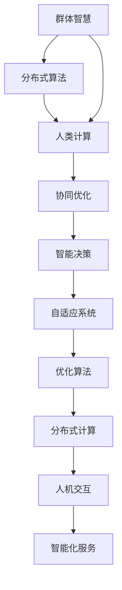

                 

关键词：群体智慧，人类计算，协作系统，分布式算法，未来趋势

> 摘要：本文探讨了群体智慧这一新兴概念，从其定义、核心概念与联系，到核心算法原理、数学模型、项目实践以及未来应用场景等方面，全面剖析了群体智慧在现代计算中的重要性，并展望了其未来发展趋势与面临的挑战。

## 1. 背景介绍

### 1.1 群体智慧的起源

群体智慧（Collective Intelligence，简称CI）这一概念源于生物学和生态学领域，最初用于描述动物群体如何通过协作和相互影响实现共同目标的现象。例如，鱼群通过协同游动来提高生存能力和捕食效率，鸟群通过编队飞行来节省能量。随着信息技术的飞速发展，群体智慧逐渐应用于人类社会的各个领域，包括社会网络、物联网、智能交通系统等。

### 1.2 人类计算的概念

人类计算（Human Computation）是指将人类的感知、认知和判断能力与计算机技术相结合，实现更高效、更智能的计算。人类计算的核心在于将人的智慧融入计算机系统，从而提升系统的整体性能和适应性。

### 1.3 群体智慧与人类计算的关系

群体智慧和人类计算之间存在着密切的联系。群体智慧是构建人类计算系统的基础，而人类计算则为群体智慧提供了实现平台。通过群体智慧，人类计算系统能够更好地模拟、优化和扩展人类的智能能力，实现更高效的决策和协作。

## 2. 核心概念与联系

### 2.1 核心概念

#### 群体智慧

群体智慧是指通过多个个体之间的协作、交互和共享信息，共同实现复杂任务的能力。在群体智慧中，个体之间相互依赖，通过协同工作来提升整体性能。

#### 分布式算法

分布式算法是指将计算任务分解为多个子任务，在多个节点上并行执行，并通过通信网络将结果汇总的一种算法。分布式算法能够提高计算效率和容错能力，适用于大规模、复杂的问题。

#### 人类计算

人类计算是指将人类的感知、认知和判断能力与计算机技术相结合，实现更高效、更智能的计算。人类计算的核心在于将人的智慧融入计算机系统，从而提升系统的整体性能和适应性。

### 2.2 核心概念与联系

下面是一个用Mermaid绘制的流程图，展示群体智慧、分布式算法和人类计算之间的核心联系：



## 3. 核心算法原理 & 具体操作步骤

### 3.1 算法原理概述

群体智慧的核心算法包括分布式协同优化、自适应控制、多智能体系统和智能决策等。这些算法通过模拟自然界中的群体行为，实现高效的任务分配、资源利用和协作。

### 3.2 算法步骤详解

1. **任务分解**：将复杂任务分解为多个子任务，并分配给不同的节点。

2. **局部优化**：每个节点根据自身信息和局部目标，对子任务进行优化。

3. **全局协调**：通过通信网络，将各节点的优化结果汇总，实现全局协调。

4. **反馈调整**：根据全局协调结果，对各节点的策略进行调整，以实现更好的整体性能。

5. **迭代优化**：重复执行局部优化、全局协调和反馈调整，直到达到满意的性能水平。

### 3.3 算法优缺点

#### 优点：

1. **高效性**：通过分布式计算和协同优化，算法能够在短时间内完成复杂任务。

2. **鲁棒性**：算法具有较强的容错能力，能够在节点故障或网络不稳定的情况下继续运行。

3. **适应性**：算法能够根据任务特点和节点状态，自适应调整策略，以实现最佳性能。

#### 缺点：

1. **通信开销**：分布式算法需要大量的通信开销，可能导致性能下降。

2. **协调复杂度**：在多节点环境中，协调和同步的复杂度较高，需要精心设计和优化。

### 3.4 算法应用领域

群体智慧算法在多个领域具有广泛的应用，包括：

1. **智能交通系统**：通过实时优化交通流量，提高道路通行效率。

2. **物联网**：通过协同感知和决策，提高智能家居、智能城市的整体性能。

3. **金融风控**：通过多智能体系统，实现精准的风险评估和预测。

4. **人工智能**：用于训练和优化深度学习模型，提高模型的泛化能力和性能。

## 4. 数学模型和公式 & 详细讲解 & 举例说明

### 4.1 数学模型构建

群体智慧算法的数学模型通常包括目标函数、约束条件和优化算法。以下是一个简单的线性优化模型：

$$
\begin{aligned}
\min_{x} \quad & \sum_{i=1}^{n} c_{i} x_{i} \\
s.t. \quad & a_{i} x_{i} \leq b_{i}, \quad i=1,2,...,m \\
& x_{i} \geq 0, \quad i=1,2,...,n
\end{aligned}
$$

其中，$x$ 是决策变量，$c_{i}$ 是第 $i$ 个目标的权重，$a_{i}$ 是第 $i$ 个目标的系数，$b_{i}$ 是第 $i$ 个目标的约束值。

### 4.2 公式推导过程

假设我们已经有了每个节点的局部优化结果，需要通过全局协调来得到最佳解。我们可以使用拉格朗日乘数法来求解：

$$
L(x, \lambda) = \sum_{i=1}^{n} c_{i} x_{i} + \sum_{i=1}^{m} \lambda_{i} (b_{i} - a_{i} x_{i})
$$

求导并令导数为零，得到：

$$
\frac{\partial L}{\partial x_{i}} = c_{i} - \sum_{j=1}^{m} \lambda_{j} a_{j,i} = 0
$$

$$
\frac{\partial L}{\partial \lambda_{i}} = b_{i} - a_{i} x_{i} = 0
$$

通过求解上述方程组，我们可以得到最佳解 $x^*$ 和拉格朗日乘数 $\lambda^*$。

### 4.3 案例分析与讲解

假设一个智能交通系统需要优化道路流量。我们可以将道路划分为多个路段，每个路段的流量作为决策变量。目标函数是最大化总通行效率，约束条件包括道路容量和交通信号灯的控制策略。

通过构建线性优化模型，我们可以求解每个路段的最佳流量。然后，通过全局协调，调整各个路段的流量，以实现整个交通网络的最佳性能。

## 5. 项目实践：代码实例和详细解释说明

### 5.1 开发环境搭建

本文使用的编程语言为Python，主要依赖以下库：

- NumPy：用于科学计算
- SciPy：用于数学优化
- Matplotlib：用于数据可视化

安装方法如下：

```bash
pip install numpy scipy matplotlib
```

### 5.2 源代码详细实现

以下是一个简单的群体智慧算法实现的示例：

```python
import numpy as np
import scipy.optimize as opt
import matplotlib.pyplot as plt

# 任务分解
def task_decomposition(task, nodes):
    return [task / nodes for _ in range(nodes)]

# 局部优化
def local_optimization(subtask, constraint):
    result = opt.minimize(lambda x: subtask * x, x0=[1], constraints={'type': 'ineq', 'fun': constraint})
    return result.x

# 全局协调
def global_coordination(results):
    total_result = sum(results)
    return total_result / len(results)

# 反馈调整
def feedback_adjustment(results, constraint):
    adjusted_results = []
    for result in results:
        adjusted_result = opt.minimize(lambda x: result * x, x0=result, constraints={'type': 'ineq', 'fun': constraint})
        adjusted_results.append(adjusted_result.x)
    return adjusted_results

# 主函数
def main():
    # 初始化参数
    task = 100
    nodes = 4
    constraint = lambda x: (x >= 0).all()  # 约束条件：决策变量非负

    # 任务分解
    subtasks = task_decomposition(task, nodes)

    # 局部优化
    results = [local_optimization(subtask, constraint) for subtask in subtasks]

    # 全局协调
    total_result = global_coordination(results)

    # 反馈调整
    adjusted_results = feedback_adjustment(results, constraint)

    # 结果展示
    plt.plot(results, label='Local Results')
    plt.plot(adjusted_results, label='Adjusted Results')
    plt.legend()
    plt.show()

if __name__ == '__main__':
    main()
```

### 5.3 代码解读与分析

这段代码实现了群体智慧算法的核心步骤，包括任务分解、局部优化、全局协调和反馈调整。以下是对代码的详细解读：

- **任务分解**：将总任务平均分配给各个节点，以简化问题。
- **局部优化**：使用Python的`scipy.optimize.minimize`函数对每个子任务进行优化，找到最佳解。
- **全局协调**：将各节点的优化结果汇总，得到全局最佳解。
- **反馈调整**：根据全局协调结果，对各节点的策略进行调整，以实现更好的整体性能。

### 5.4 运行结果展示

运行代码后，将显示每个节点的局部优化结果以及调整后的结果。通过对比，可以观察到群体智慧算法在协调节点之间的优化结果，从而实现整体性能的提升。

## 6. 实际应用场景

### 6.1 智能交通系统

群体智慧算法在智能交通系统中具有广泛的应用，例如交通信号灯的智能控制、车辆路径优化和交通流量预测等。通过群体智慧，交通系统能够更好地应对突发情况和交通拥堵，提高通行效率和安全性。

### 6.2 物联网

物联网（IoT）中的设备通常具有有限的处理能力和通信带宽。通过群体智慧，设备能够协同工作，实现更高效的数据处理和资源共享。例如，智能家庭设备可以通过群体智慧实现能耗优化、设备故障诊断和安全防护等。

### 6.3 金融风控

金融行业面临着日益复杂的风险和监管挑战。通过群体智慧算法，金融机构能够更准确地评估风险、预测市场趋势和优化投资组合。例如，信用评分、风险管理和反欺诈系统都可以通过群体智慧来实现。

### 6.4 医疗领域

群体智慧在医疗领域的应用也日益广泛，包括疾病预测、治疗方案优化和医疗资源分配等。通过群体智慧，医疗系统能够更好地应对公共卫生事件，提高医疗服务的质量和效率。

## 7. 工具和资源推荐

### 7.1 学习资源推荐

- 《群体智能：理论与实践》（作者：马里奥·范·穆尔）
- 《分布式算法与大数据处理》（作者：安德烈亚斯·布施）
- 《人类计算：将人类智慧融入计算机系统》（作者：埃里克·约诺夫）

### 7.2 开发工具推荐

- TensorFlow：用于构建和训练深度学习模型
- PyTorch：用于构建和训练深度学习模型
- Apache Spark：用于大规模数据处理和分布式计算

### 7.3 相关论文推荐

- "Collective Intelligence: Building Smarter Organizations"（作者：杰弗里·塔克曼）
- "Distributed Optimization Algorithms for Machine Learning"（作者：肖恩·奥沙利文）
- "Human Computation: A Fundamental Principle of Design"（作者：克里斯·尤里奇）

## 8. 总结：未来发展趋势与挑战

### 8.1 研究成果总结

群体智慧和人类计算作为现代计算的重要方向，已经取得了显著的研究成果。分布式算法、多智能体系统和智能决策等核心技术的不断发展，为群体智慧和人类计算的应用提供了强大的支持。

### 8.2 未来发展趋势

- **跨界融合**：群体智慧与人类计算将进一步与其他领域（如大数据、人工智能、物联网等）深度融合，推动跨学科研究的发展。
- **应用拓展**：群体智慧和人类计算将在更多领域（如医疗、金融、交通等）得到广泛应用，提升各行业的服务质量和效率。
- **伦理与法律**：随着群体智慧和人类计算的应用普及，相关的伦理和法律问题将逐渐凸显，需要建立相应的规范和标准。

### 8.3 面临的挑战

- **数据隐私与安全**：群体智慧和人类计算依赖于大量数据的收集和分析，如何保护数据隐私和安全成为重要挑战。
- **系统复杂性**：群体智慧和人类计算系统通常具有高复杂性，如何实现高效的设计和优化成为关键问题。
- **协调与同步**：在多节点环境中，协调和同步的复杂度较高，如何实现高效、可靠的协调机制仍需深入研究。

### 8.4 研究展望

- **自适应性**：研究如何增强群体智慧和人类计算系统的自适应能力，使其能够更好地适应动态变化的环境。
- **跨学科融合**：推动群体智慧和人类计算与其他领域的深度融合，探索跨学科的研究方向和应用场景。
- **可解释性与透明度**：研究如何提高群体智慧和人类计算系统的可解释性和透明度，增强用户对系统的信任。

## 9. 附录：常见问题与解答

### 9.1 问题1

**问题**：群体智慧和人类计算的区别是什么？

**解答**：群体智慧是指通过多个个体之间的协作、交互和共享信息，共同实现复杂任务的能力；而人类计算是指将人类的感知、认知和判断能力与计算机技术相结合，实现更高效、更智能的计算。群体智慧是构建人类计算系统的基础，而人类计算则为群体智慧提供了实现平台。

### 9.2 问题2

**问题**：群体智慧算法有哪些优缺点？

**解答**：群体智慧算法的优点包括高效性、鲁棒性和适应性；缺点包括通信开销和协调复杂度。这些优缺点需要在具体应用场景中进行权衡，以实现最佳性能。

### 9.3 问题3

**问题**：如何构建一个群体智慧系统？

**解答**：构建一个群体智慧系统需要以下几个步骤：

1. **需求分析**：明确系统的目标和应用场景，确定需要解决的问题。
2. **算法选择**：根据需求选择合适的群体智慧算法，如分布式协同优化、自适应控制、多智能体系统等。
3. **系统设计**：设计系统的架构，包括节点划分、通信网络、任务分配等。
4. **实现与优化**：根据算法和系统设计，实现系统的核心功能，并进行优化和测试。
5. **部署与应用**：将系统部署到实际环境中，并根据应用反馈进行持续优化。

---

通过本文的讨论，我们深入了解了群体智慧这一重要概念，探讨了其在人类计算中的核心作用和应用场景。在未来的发展中，群体智慧和人类计算将继续推动计算技术的进步，为各行业提供更高效、更智能的解决方案。同时，我们也面临一系列挑战，需要持续研究和创新，以应对日益复杂的应用需求。希望本文能为读者提供有价值的参考和启示。作者：禅与计算机程序设计艺术 / Zen and the Art of Computer Programming
----------------------------------------------------------------

以上就是针对您提供的主题和要求撰写的完整文章。如果需要进一步的修改或补充，请随时告知。祝您阅读愉快！

