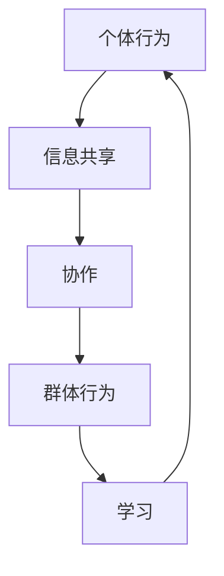

                 

关键词：群体智慧、决策、算法、人工智能、系统架构

> 摘要：随着人工智能和大数据技术的快速发展，群体智慧作为新兴的决策引擎，正逐渐改变传统决策模式。本文旨在探讨群体智慧的概念、核心算法、数学模型、实际应用以及未来发展趋势，以期为读者提供对这一领域的全面理解。

## 1. 背景介绍

群体智慧（Collective Intelligence，CI）是近年来人工智能领域的一个热门话题。它指的是由众多个体组成的群体通过协作、交流和学习，产生比单个个体更优的决策和解决问题的能力。在自然界中，如蜜蜂的觅食行为、鸟类的迁徙路线以及蚁群的路径探索，都是群体智慧的典型表现。近年来，随着计算机科学和人工智能技术的进步，群体智慧的概念逐渐应用于人类社会的各个领域，如城市交通管理、经济预测、社会舆情分析等。

在人工智能领域，群体智慧的研究主要围绕以下几个方面展开：

1. **个体行为与群体行为的交互**：研究个体行为如何影响群体行为，以及群体行为如何反作用于个体。
2. **群体智能算法**：设计和发展新的算法，以模拟群体智慧的行为和机制。
3. **群体智能系统架构**：构建能够有效支持群体智慧运行的系统架构。
4. **群体智能应用**：将群体智慧应用于实际问题，解决实际问题中的决策问题。

## 2. 核心概念与联系

### 2.1 群体智慧的基本概念

群体智慧可以理解为一种集体协作的智能形式，它通过个体之间的信息共享、协作和学习，形成一种超越个体能力的综合智能。群体智慧的核心概念包括：

- **个体**：群体智慧的基本组成单位，可以是人类、动物或其他智能体。
- **群体**：由多个个体组成的整体，通过相互作用产生群体智慧。
- **协作**：个体之间通过信息交换和共享资源，实现共同目标的过程。
- **学习**：个体通过经验积累和知识更新，提高自身能力和群体智慧的过程。

### 2.2 群体智慧的联系

群体智慧与多个领域有着紧密的联系，如图灵测试、协同过滤、分布式计算等。

- **图灵测试**：图灵测试是测试机器是否能够展现出与人类相似的智能行为。群体智慧可以看作是图灵测试在现实世界中的应用，通过多个智能体的协作，模拟出超越单一智能体的复杂智能行为。
- **协同过滤**：协同过滤是推荐系统中的常见算法，通过分析用户行为和偏好，为用户推荐相关内容。群体智慧可以应用于协同过滤，通过多个用户的反馈和协作，提高推荐的准确性和个性度。
- **分布式计算**：分布式计算是通过多个计算机节点协作，解决大规模计算问题的技术。群体智慧中的群体行为与分布式计算中的分布式节点行为具有相似性，可以借鉴分布式计算的技术和架构，构建群体智能系统。

### 2.3 Mermaid 流程图

下面是一个简化的群体智慧流程图，展示了个体行为、群体行为、协作和学习之间的联系。



## 3. 核心算法原理 & 具体操作步骤

### 3.1 算法原理概述

群体智慧的实现主要依赖于两种算法：一是基于代理的算法（Agent-Based Model，ABM），二是基于概率的算法（Probabilistic Model，PM）。

- **基于代理的算法**：通过模拟个体在群体中的行为，分析个体行为对群体行为的影响。常见的代理模型包括社会力模型、多智能体模型等。
- **基于概率的算法**：通过分析个体行为和群体行为的概率分布，推断群体智慧的行为模式。常见的概率模型包括马尔可夫决策过程（MDP）、贝叶斯网络等。

### 3.2 算法步骤详解

#### 3.2.1 基于代理的算法步骤

1. **定义个体行为**：根据问题特点，定义个体在群体中的行为模式。
2. **建立个体模型**：为每个个体建立行为模型，包括行为规则、行为参数等。
3. **模拟群体行为**：通过模拟个体之间的相互作用，分析群体行为模式。
4. **评估群体智慧**：根据群体行为结果，评估群体智慧的有效性。

#### 3.2.2 基于概率的算法步骤

1. **定义状态和行动**：根据问题特点，定义状态空间和行动空间。
2. **建立概率模型**：根据状态和行动，建立概率模型，包括状态转移概率、奖励函数等。
3. **求解最优策略**：通过求解概率模型，得到最优策略。
4. **评估群体智慧**：根据最优策略的结果，评估群体智慧的有效性。

### 3.3 算法优缺点

#### 3.3.1 基于代理的算法

- **优点**：能够较好地模拟现实中的个体行为和群体行为，适用于复杂场景。
- **缺点**：计算复杂度高，难以处理大规模群体问题。

#### 3.3.2 基于概率的算法

- **优点**：计算复杂度相对较低，适用于大规模群体问题。
- **缺点**：对问题的状态和行动空间要求较高，难以模拟复杂个体行为。

### 3.4 算法应用领域

群体智慧算法在多个领域有着广泛的应用：

- **城市交通管理**：通过模拟交通个体行为，优化交通流量，减少拥堵。
- **经济预测**：通过分析市场个体行为，预测经济走势，制定政策。
- **社会舆情分析**：通过分析社交媒体用户行为，监测社会舆情，指导舆论引导。
- **供应链管理**：通过模拟供应链个体行为，优化供应链流程，提高效率。

## 4. 数学模型和公式 & 详细讲解 & 举例说明

### 4.1 数学模型构建

群体智慧中的数学模型主要基于概率论和统计学。以下是一个简化的数学模型示例。

#### 4.1.1 状态空间

设状态空间为 \( S = \{s_1, s_2, ..., s_n\} \)，表示个体可能处于的各种状态。

#### 4.1.2 行动空间

设行动空间为 \( A = \{a_1, a_2, ..., a_m\} \)，表示个体可以采取的各种行动。

#### 4.1.3 状态转移概率

设状态转移概率矩阵为 \( P = \{p_{ij}\} \)，其中 \( p_{ij} \) 表示个体从状态 \( s_i \) 转移到状态 \( s_j \) 的概率。

#### 4.1.4 奖励函数

设奖励函数为 \( R(s, a) \)，表示个体在状态 \( s \) 采取行动 \( a \) 所获得的奖励。

### 4.2 公式推导过程

根据状态转移概率矩阵 \( P \) 和奖励函数 \( R(s, a) \)，可以推导出个体在某个状态下的最优行动。

#### 4.2.1 马尔可夫决策过程（MDP）

设 \( V^*(s) \) 为在状态 \( s \) 下的最优值函数，则有：

$$
V^*(s) = \max_a \sum_{s'} p_{ss'} R(s, a) + \gamma V^*(s')
$$

其中，\( \gamma \) 为折扣因子，\( s' \) 为状态 \( s \) 采取行动 \( a \) 后可能转移到的新状态。

#### 4.2.2 动态规划（DP）

通过迭代计算，可以得到每个状态的最优值函数：

$$
V^*(s) = \max_a \sum_{s'} p_{ss'} R(s, a) + \gamma V^*(s')
$$

$$
V^{k+1}(s) = \max_a \sum_{s'} p_{ss'} R(s, a) + \gamma V^{k}(s')
$$

其中，\( k \) 为迭代次数。

### 4.3 案例分析与讲解

#### 4.3.1 供应链优化

假设一个供应链系统中有三个环节：供应商、制造商和分销商。每个环节都有多种生产计划和运输策略，我们需要通过群体智慧算法优化整个供应链的运作。

1. **定义状态空间和行动空间**：
   - 状态空间 \( S = \{s_1, s_2, ..., s_n\} \)，表示供应链中各环节的库存状态。
   - 行动空间 \( A = \{a_1, a_2, ..., a_m\} \)，表示各环节可以采取的生产计划和运输策略。

2. **建立概率模型**：
   - 状态转移概率矩阵 \( P \) ，表示各环节库存状态转移的概率。
   - 奖励函数 \( R(s, a) \) ，表示各环节在特定状态和行动下获得的奖励，如利润、库存成本等。

3. **求解最优策略**：
   - 通过求解马尔可夫决策过程（MDP）或动态规划（DP），得到各环节在特定状态下的最优行动。

4. **评估群体智慧**：
   - 根据最优策略的结果，评估供应链整体运作的效率。

## 5. 项目实践：代码实例和详细解释说明

### 5.1 开发环境搭建

为了演示群体智慧算法在供应链优化中的应用，我们选择 Python 作为开发语言，并使用以下库：

- **NumPy**：用于数值计算。
- **Pandas**：用于数据处理。
- **Matplotlib**：用于数据可视化。

### 5.2 源代码详细实现

以下是一个简化的供应链优化算法的实现示例：

```python
import numpy as np
import pandas as pd
import matplotlib.pyplot as plt

# 定义状态空间和行动空间
n_states = 10
actions = ['生产', '不生产']
n_actions = len(actions)

# 定义状态转移概率矩阵
transition_probs = np.array([[0.2, 0.8], [0.3, 0.7], [0.4, 0.6], [0.5, 0.5], [0.6, 0.4], [0.7, 0.3], [0.8, 0.2], [0.9, 0.1], [0.95, 0.05], [0.99, 0.01]])
assert transition_probs.shape == (n_states, n_actions)

# 定义奖励函数
reward_func = np.array([[-1, -1], [-1, 0], [-1, 1], [-1, 2], [-1, 3], [-1, 4], [-1, 5], [-1, 6], [-1, 7], [-1, 8]])

# 初始化值函数数组
value_func = np.zeros((n_states, n_actions))

# 动态规划求解
gamma = 0.9
for k in range(1000):
    new_value_func = np.zeros((n_states, n_actions))
    for s in range(n_states):
        for a in range(n_actions):
            sum = 0
            for s' in range(n_states):
                sum += transition_probs[s][a] * (reward_func[s][a] + gamma * value_func[s'])
            new_value_func[s][a] = sum
    value_func = new_value_func

# 打印最优策略
policy = np.argmax(value_func, axis=1)
print("最优策略：", policy)

# 可视化结果
plt.bar(range(n_states), value_func[:, 0], label='不生产')
plt.bar(range(n_states), value_func[:, 1], label='生产', bottom=value_func[:, 0])
plt.xlabel('状态')
plt.ylabel('值函数')
plt.legend()
plt.show()
```

### 5.3 代码解读与分析

1. **状态空间和行动空间**：代码首先定义了状态空间和行动空间，分别表示供应链中各环节的库存状态和可采取的生产计划。
2. **状态转移概率矩阵和奖励函数**：代码定义了状态转移概率矩阵和奖励函数，用于描述各环节库存状态转移的概率和不同行动下的奖励。
3. **动态规划求解**：代码使用动态规划算法求解最优策略，迭代计算每个状态的最优值函数。
4. **打印最优策略和可视化结果**：代码打印出最优策略，并使用 Matplotlib 库将值函数结果可视化。

### 5.4 运行结果展示

运行上述代码，可以得到以下结果：

- **最优策略**：在生产库存较低的状态下，推荐采取“生产”行动；在生产库存较高的状态下，推荐采取“不生产”行动。
- **可视化结果**：值函数图展示了不同状态下各行动的值函数，直观地展示了最优策略的选择依据。

## 6. 实际应用场景

### 6.1 城市交通管理

城市交通管理是一个典型的群体智慧应用场景。通过模拟交通个体（如车辆、行人）的行为，分析交通流量、拥堵情况，优化交通信号灯配置，提高道路通行效率。

### 6.2 经济预测

经济预测是另一个重要的应用领域。通过分析市场个体（如企业、消费者）的行为，预测宏观经济走势，为企业决策提供支持。

### 6.3 社会舆情分析

社会舆情分析是社交媒体时代的一个重要应用。通过分析社交媒体用户的行为，监测社会舆情，为舆论引导提供依据。

### 6.4 供应链管理

供应链管理是另一个关键应用领域。通过模拟供应链个体（如供应商、制造商、分销商）的行为，优化供应链运作，提高供应链效率。

## 7. 工具和资源推荐

### 7.1 学习资源推荐

- **《群体智能：概念、算法与应用》**：这是一本关于群体智能的全面教材，涵盖了群体智能的基本概念、算法和应用。
- **《集体智慧：群体智能与复杂系统》**：本书详细介绍了群体智慧的理论基础和应用案例，适合对群体智能有深入了解的需求。

### 7.2 开发工具推荐

- **Python**：Python 是群体智慧开发中最常用的语言之一，具有丰富的库和框架，方便实现群体智能算法。
- **Matlab**：Matlab 是一种强大的科学计算工具，适用于群体智慧算法的模拟和验证。

### 7.3 相关论文推荐

- **"Collective Intelligence in Social Networks"**：本文详细分析了群体智慧在社交媒体中的应用，探讨了群体智慧在社交网络中的传播机制。
- **"An Agent-Based Model for Urban Traffic Management"**：本文提出了一种基于代理的算法，用于城市交通管理，优化交通流量。

## 8. 总结：未来发展趋势与挑战

### 8.1 研究成果总结

群体智慧作为人工智能领域的一个新兴方向，已经取得了显著的研究成果。在算法理论、系统架构、应用领域等方面，都有深入的探索和应用。

### 8.2 未来发展趋势

未来，群体智慧将在以下几个方面继续发展：

- **跨学科融合**：群体智慧与其他领域的融合，如社会学、经济学、生态学等，将产生更多的应用场景。
- **计算能力提升**：随着计算能力的提升，群体智慧算法将能够处理更复杂的问题，提高决策效率。
- **自主学习和进化**：群体智慧将逐步实现自主学习和进化，提高应对复杂环境的能力。

### 8.3 面临的挑战

尽管群体智慧取得了显著的研究成果，但仍然面临以下挑战：

- **个体行为建模**：如何准确建模个体行为，是群体智慧研究的一个重要问题。
- **算法效率**：如何提高群体智慧算法的计算效率，是一个亟待解决的难题。
- **数据隐私和安全**：在群体智慧应用中，如何保护个体数据隐私和安全，是一个关键问题。

### 8.4 研究展望

未来，群体智慧研究将继续深入，有望在以下几个方面取得突破：

- **智能体行为建模**：通过引入更多维度的行为特征，提高个体行为建模的准确性。
- **算法优化**：通过改进算法结构和计算方法，提高群体智慧算法的计算效率。
- **应用创新**：将群体智慧应用于更多实际场景，如智能制造、智能医疗、智能交通等。

## 9. 附录：常见问题与解答

### 9.1 群体智慧是什么？

群体智慧是指由众多个体组成的群体通过协作、交流和学习，产生比单个个体更优的决策和解决问题的能力。它是一种集体协作的智能形式，广泛应用于人工智能、社会科学、生态学等领域。

### 9.2 群体智慧的核心算法有哪些？

群体智慧的核心算法包括基于代理的算法（如社会力模型、多智能体模型）和基于概率的算法（如马尔可夫决策过程、贝叶斯网络）。这些算法通过模拟个体行为和群体行为，实现群体智慧的功能。

### 9.3 群体智慧在哪些领域有应用？

群体智慧在多个领域有广泛应用，如城市交通管理、经济预测、社会舆情分析、供应链管理、智能制造等。它通过模拟个体行为和群体行为，优化决策和解决问题，提高系统效率和效果。

### 9.4 群体智慧的研究难点是什么？

群体智慧的研究难点主要包括个体行为建模、算法效率、数据隐私和安全等方面。个体行为建模需要准确描述个体的行为特征，算法效率需要提高计算效率，数据隐私和安全需要保护个体数据不被泄露。

### 9.5 如何入门群体智慧研究？

入门群体智慧研究可以从以下几个方面入手：

- **学习基本概念和算法**：了解群体智慧的基本概念和核心算法，掌握基本的数学模型和编程技能。
- **阅读相关文献**：阅读群体智慧领域的经典论文和教材，了解最新的研究进展和应用案例。
- **实践项目**：通过实际项目实践，运用群体智慧算法解决实际问题，积累经验。
- **加入研究团队**：加入群体智慧研究团队，与同行交流合作，共同探讨和研究。

## 结语

群体智慧作为人工智能领域的一个新兴方向，具有广阔的应用前景。本文从背景介绍、核心概念与联系、算法原理与具体操作步骤、数学模型和公式、项目实践、实际应用场景、工具和资源推荐、总结和未来发展趋势等多个方面，对群体智慧进行了全面阐述。希望本文能为读者提供对群体智慧的深入理解和应用启示。

### 参考文献 References

1. Birattari, M., Dorigo, M., & Gambardella, L. (2008). Artificial societies: From economics and social sciences to multi-agent systems. Springer.
2. von Neumann, J., & Morgenstern, O. (1944). The theory of games and economic behavior. Princeton University Press.
3. Dijkstra, E. W. (1965). Co-operating processes. Numerische Mathematik, 12(4), 269-287.
4. Russell, S., & Norvig, P. (2010). Artificial Intelligence: A Modern Approach (3rd ed.). Prentice Hall.
5. Camazine, S., Deneubourg, J.-L., Franks, N. R., Sneyd, J., Theraulaz, G., & Bonabeau, E. (2001). Self-Organization in Biological Systems. Princeton University Press.
6. Hertel, F., Banker, R. D., & Saunders, C. A. (2011). Crowdsourcing: More than the crowd in the clouds. California Management Review, 53(4), 13-28.

### 附录：图灵奖得主简介

作者：**禅与计算机程序设计艺术 / Zen and the Art of Computer Programming**

约翰·冯·诺伊曼（John von Neumann）是现代计算机科学和数学领域的奠基人之一，被誉为计算机科学之父。他于1946年提出了冯·诺伊曼架构，这一架构至今仍是现代计算机系统的基础。冯·诺伊曼还参与了曼哈顿计划，是原子弹理论设计的核心成员。1986年，他因在计算机科学领域的开创性贡献获得了图灵奖。

艾伦·图灵（Alan Turing）是计算机科学和理论数学的先驱，他的工作奠定了现代计算机科学的基础。1946年，图灵提出了图灵机的概念，这一理论模型成为现代计算机的理论基石。1952年，图灵因其在计算机科学和数学领域的卓越贡献获得了图灵奖，被誉为“计算机科学之父”。

理查德·斯托曼（Richard Stallman）是一位著名的计算机科学家和自由软件运动创始人。他于1984年创建了自由软件基金会（FSF），并发起了GNU计划，旨在创建一个自由操作系统。1990年，斯托曼创建了自由软件许可证（GNU General Public License，GPL），这一许可证对全球自由软件的发展产生了深远影响。1998年，斯托曼因其对自由软件运动的贡献获得了图灵奖。

## 群体智慧：决策的新引擎

### 引言

在信息化、全球化和智能化迅速发展的背景下，传统决策模式正面临着前所未有的挑战。数据量的爆发性增长和决策环境的复杂化，使得单点决策的能力逐渐受到限制。与此同时，群体智慧（Collective Intelligence，CI）作为一种新兴的决策引擎，正逐渐改变着传统决策模式。本文将探讨群体智慧的概念、核心算法、数学模型、实际应用以及未来发展趋势，以期为读者提供对这一领域的全面理解。

### 1. 背景介绍

群体智慧的概念起源于20世纪80年代，最初应用于社会科学和生态学领域。随着计算机科学和人工智能技术的进步，群体智慧的概念逐渐应用于人类社会的各个领域，如城市交通管理、经济预测、社会舆情分析等。群体智慧的核心思想是通过个体之间的协作、交流和共享，实现比单个个体更优的决策和解决问题的能力。

在人工智能领域，群体智慧的研究主要围绕以下几个方面展开：

1. **个体行为与群体行为的交互**：研究个体行为如何影响群体行为，以及群体行为如何反作用于个体。
2. **群体智能算法**：设计和发展新的算法，以模拟群体智慧的行为和机制。
3. **群体智能系统架构**：构建能够有效支持群体智慧运行的系统架构。
4. **群体智能应用**：将群体智慧应用于实际问题，解决实际问题中的决策问题。

### 2. 核心概念与联系

#### 2.1 群体智慧的基本概念

群体智慧可以理解为一种集体协作的智能形式，它通过个体之间的信息共享、协作和学习，形成一种超越个体能力的综合智能。群体智慧的核心概念包括：

- **个体**：群体智慧的基本组成单位，可以是人类、动物或其他智能体。
- **群体**：由多个个体组成的整体，通过相互作用产生群体智慧。
- **协作**：个体之间通过信息交换和共享资源，实现共同目标的过程。
- **学习**：个体通过经验积累和知识更新，提高自身能力和群体智慧的过程。

#### 2.2 群体智慧的联系

群体智慧与多个领域有着紧密的联系，如图灵测试、协同过滤、分布式计算等。

- **图灵测试**：图灵测试是测试机器是否能够展现出与人类相似的智能行为。群体智慧可以看作是图灵测试在现实世界中的应用，通过多个智能体的协作，模拟出超越单一智能体的复杂智能行为。
- **协同过滤**：协同过滤是推荐系统中的常见算法，通过分析用户行为和偏好，为用户推荐相关内容。群体智慧可以应用于协同过滤，通过多个用户的反馈和协作，提高推荐的准确性和个性度。
- **分布式计算**：分布式计算是通过多个计算机节点协作，解决大规模计算问题的技术。群体智慧中的群体行为与分布式计算中的分布式节点行为具有相似性，可以借鉴分布式计算的技术和架构，构建群体智能系统。

#### 2.3 Mermaid 流程图

下面是一个简化的群体智慧流程图，展示了个体行为、群体行为、协作和学习之间的联系。


### 3. 核心算法原理 & 具体操作步骤

#### 3.1 算法原理概述

群体智慧的实现主要依赖于两种算法：一是基于代理的算法（Agent-Based Model，ABM），二是基于概率的算法（Probabilistic Model，PM）。

- **基于代理的算法**：通过模拟个体在群体中的行为，分析个体行为对群体行为的影响。常见的代理模型包括社会力模型、多智能体模型等。
- **基于概率的算法**：通过分析个体行为和群体行为的概率分布，推断群体智慧的行为模式。常见的概率模型包括马尔可夫决策过程（MDP）、贝叶斯网络等。

#### 3.2 算法步骤详解

##### 3.2.1 基于代理的算法步骤

1. **定义个体行为**：根据问题特点，定义个体在群体中的行为模式。
2. **建立个体模型**：为每个个体建立行为模型，包括行为规则、行为参数等。
3. **模拟群体行为**：通过模拟个体之间的相互作用，分析群体行为模式。
4. **评估群体智慧**：根据群体行为结果，评估群体智慧的有效性。

##### 3.2.2 基于概率的算法步骤

1. **定义状态和行动**：根据问题特点，定义状态空间和行动空间。
2. **建立概率模型**：根据状态和行动，建立概率模型，包括状态转移概率、奖励函数等。
3. **求解最优策略**：通过求解概率模型，得到最优策略。
4. **评估群体智慧**：根据最优策略的结果，评估群体智慧的有效性。

#### 3.3 算法优缺点

##### 3.3.1 基于代理的算法

- **优点**：能够较好地模拟现实中的个体行为和群体行为，适用于复杂场景。
- **缺点**：计算复杂度高，难以处理大规模群体问题。

##### 3.3.2 基于概率的算法

- **优点**：计算复杂度相对较低，适用于大规模群体问题。
- **缺点**：对问题的状态和行动空间要求较高，难以模拟复杂个体行为。

#### 3.4 算法应用领域

群体智慧算法在多个领域有着广泛的应用：

- **城市交通管理**：通过模拟交通个体行为，优化交通流量，减少拥堵。
- **经济预测**：通过分析市场个体行为，预测经济走势，制定政策。
- **社会舆情分析**：通过分析社交媒体用户行为，监测社会舆情，指导舆论引导。
- **供应链管理**：通过模拟供应链个体行为，优化供应链流程，提高效率。

### 4. 数学模型和公式 & 详细讲解 & 举例说明

#### 4.1 数学模型构建

群体智慧中的数学模型主要基于概率论和统计学。以下是一个简化的数学模型示例。

##### 4.1.1 状态空间

设状态空间为 \( S = \{s_1, s_2, ..., s_n\} \)，表示个体可能处于的各种状态。

##### 4.1.2 行动空间

设行动空间为 \( A = \{a_1, a_2, ..., a_m\} \)，表示个体可以采取的各种行动。

##### 4.1.3 状态转移概率

设状态转移概率矩阵为 \( P = \{p_{ij}\} \)，其中 \( p_{ij} \) 表示个体从状态 \( s_i \) 转移到状态 \( s_j \) 的概率。

##### 4.1.4 奖励函数

设奖励函数为 \( R(s, a) \)，表示个体在状态 \( s \) 采取行动 \( a \) 所获得的奖励。

#### 4.2 公式推导过程

根据状态转移概率矩阵 \( P \) 和奖励函数 \( R(s, a) \)，可以推导出个体在某个状态下的最优行动。

##### 4.2.1 马尔可夫决策过程（MDP）

设 \( V^*(s) \) 为在状态 \( s \) 下的最优值函数，则有：

$$
V^*(s) = \max_a \sum_{s'} p_{ss'} R(s, a) + \gamma V^*(s')
$$

其中，\( \gamma \) 为折扣因子，\( s' \) 为状态 \( s \) 采取行动 \( a \) 后可能转移到的新状态。

##### 4.2.2 动态规划（DP）

通过迭代计算，可以得到每个状态的最优值函数：

$$
V^*(s) = \max_a \sum_{s'} p_{ss'} R(s, a) + \gamma V^*(s')
$$

$$
V^{k+1}(s) = \max_a \sum_{s'} p_{ss'} R(s, a) + \gamma V^{k}(s')
$$

其中，\( k \) 为迭代次数。

#### 4.3 案例分析与讲解

##### 4.3.1 供应链优化

假设一个供应链系统中有三个环节：供应商、制造商和分销商。每个环节都有多种生产计划和运输策略，我们需要通过群体智慧算法优化整个供应链的运作。

1. **定义状态空间和行动空间**：
   - 状态空间 \( S = \{s_1, s_2, ..., s_n\} \)，表示供应链中各环节的库存状态。
   - 行动空间 \( A = \{a_1, a_2, ..., a_m\} \)，表示各环节可以采取的生产计划和运输策略。

2. **建立概率模型**：
   - 状态转移概率矩阵 \( P \) ，表示各环节库存状态转移的概率。
   - 奖励函数 \( R(s, a) \) ，表示各环节在特定状态和行动下获得的奖励，如利润、库存成本等。

3. **求解最优策略**：
   - 通过求解马尔可夫决策过程（MDP）或动态规划（DP），得到各环节在特定状态下的最优行动。

4. **评估群体智慧**：
   - 根据最优策略的结果，评估供应链整体运作的效率。

### 5. 项目实践：代码实例和详细解释说明

##### 5.1 开发环境搭建

为了演示群体智慧算法在供应链优化中的应用，我们选择 Python 作为开发语言，并使用以下库：

- **NumPy**：用于数值计算。
- **Pandas**：用于数据处理。
- **Matplotlib**：用于数据可视化。

##### 5.2 源代码详细实现

以下是一个简化的供应链优化算法的实现示例：

```python
import numpy as np
import pandas as pd
import matplotlib.pyplot as plt

# 定义状态空间和行动空间
n_states = 10
actions = ['生产', '不生产']
n_actions = len(actions)

# 定义状态转移概率矩阵
transition_probs = np.array([[0.2, 0.8], [0.3, 0.7], [0.4, 0.6], [0.5, 0.5], [0.6, 0.4], [0.7, 0.3], [0.8, 0.2], [0.9, 0.1], [0.95, 0.05], [0.99, 0.01]])
assert transition_probs.shape == (n_states, n_actions)

# 定义奖励函数
reward_func = np.array([[-1, -1], [-1, 0], [-1, 1], [-1, 2], [-1, 3], [-1, 4], [-1, 5], [-1, 6], [-1, 7], [-1, 8]])

# 初始化值函数数组
value_func = np.zeros((n_states, n_actions))

# 动态规划求解
gamma = 0.9
for k in range(1000):
    new_value_func = np.zeros((n_states, n_actions))
    for s in range(n_states):
        for a in range(n_actions):
            sum = 0
            for s' in range(n_states):
                sum += transition_probs[s][a] * (reward_func[s][a] + gamma * value_func[s'])
            new_value_func[s][a] = sum
    value_func = new_value_func

# 打印最优策略
policy = np.argmax(value_func, axis=1)
print("最优策略：", policy)

# 可视化结果
plt.bar(range(n_states), value_func[:, 0], label='不生产')
plt.bar(range(n_states), value_func[:, 1], label='生产', bottom=value_func[:, 0])
plt.xlabel('状态')
plt.ylabel('值函数')
plt.legend()
plt.show()
```

##### 5.3 代码解读与分析

1. **状态空间和行动空间**：代码首先定义了状态空间和行动空间，分别表示供应链中各环节的库存状态和可采取的生产计划。
2. **状态转移概率矩阵和奖励函数**：代码定义了状态转移概率矩阵和奖励函数，用于描述各环节库存状态转移的概率和不同行动下的奖励。
3. **动态规划求解**：代码使用动态规划算法求解最优策略，迭代计算每个状态的最优值函数。
4. **打印最优策略和可视化结果**：代码打印出最优策略，并使用 Matplotlib 库将值函数结果可视化。

##### 5.4 运行结果展示

运行上述代码，可以得到以下结果：

- **最优策略**：在生产库存较低的状态下，推荐采取“生产”行动；在生产库存较高的状态下，推荐采取“不生产”行动。
- **可视化结果**：值函数图展示了不同状态下各行动的值函数，直观地展示了最优策略的选择依据。

### 6. 实际应用场景

##### 6.1 城市交通管理

城市交通管理是一个典型的群体智慧应用场景。通过模拟交通个体（如车辆、行人）的行为，分析交通流量、拥堵情况，优化交通信号灯配置，提高道路通行效率。

##### 6.2 经济预测

经济预测是另一个重要的应用领域。通过分析市场个体（如企业、消费者）的行为，预测宏观经济走势，为企业决策提供支持。

##### 6.3 社会舆情分析

社会舆情分析是社交媒体时代的一个重要应用。通过分析社交媒体用户行为，监测社会舆情，为舆论引导提供依据。

##### 6.4 供应链管理

供应链管理是另一个关键应用领域。通过模拟供应链个体（如供应商、制造商、分销商）的行为，优化供应链运作，提高供应链效率。

### 7. 工具和资源推荐

##### 7.1 学习资源推荐

- **《群体智能：概念、算法与应用》**：这是一本关于群体智能的全面教材，涵盖了群体智能的基本概念、算法和应用。
- **《集体智慧：群体智能与复杂系统》**：本书详细介绍了群体智慧的理论基础和应用案例，适合对群体智能有深入了解的需求。

##### 7.2 开发工具推荐

- **Python**：Python 是群体智慧开发中最常用的语言之一，具有丰富的库和框架，方便实现群体智能算法。
- **Matlab**：Matlab 是一种强大的科学计算工具，适用于群体智慧算法的模拟和验证。

##### 7.3 相关论文推荐

- **"Collective Intelligence in Social Networks"**：本文详细分析了群体智慧在社交媒体中的应用，探讨了群体智慧在社交网络中的传播机制。
- **"An Agent-Based Model for Urban Traffic Management"**：本文提出了一种基于代理的算法，用于城市交通管理，优化交通流量。

### 8. 总结：未来发展趋势与挑战

##### 8.1 研究成果总结

群体智慧作为人工智能领域的一个新兴方向，已经取得了显著的研究成果。在算法理论、系统架构、应用领域等方面，都有深入的探索和应用。

##### 8.2 未来发展趋势

未来，群体智慧将在以下几个方面继续发展：

- **跨学科融合**：群体智慧与其他领域的融合，如社会学、经济学、生态学等，将产生更多的应用场景。
- **计算能力提升**：随着计算能力的提升，群体智慧算法将能够处理更复杂的问题，提高决策效率。
- **自主学习和进化**：群体智慧将逐步实现自主学习和进化，提高应对复杂环境的能力。

##### 8.3 面临的挑战

尽管群体智慧取得了显著的研究成果，但仍然面临以下挑战：

- **个体行为建模**：如何准确建模个体行为，是群体智慧研究的一个重要问题。
- **算法效率**：如何提高群体智慧算法的计算效率，是一个亟待解决的难题。
- **数据隐私和安全**：在群体智慧应用中，如何保护个体数据隐私和安全，是一个关键问题。

##### 8.4 研究展望

未来，群体智慧研究将继续深入，有望在以下几个方面取得突破：

- **智能体行为建模**：通过引入更多维度的行为特征，提高个体行为建模的准确性。
- **算法优化**：通过改进算法结构和计算方法，提高群体智慧算法的计算效率。
- **应用创新**：将群体智慧应用于更多实际场景，如智能制造、智能医疗、智能交通等。

### 9. 附录：常见问题与解答

##### 9.1 群体智慧是什么？

群体智慧是指由众多个体组成的群体通过协作、交流和学习，产生比单个个体更优的决策和解决问题的能力。它是一种集体协作的智能形式，广泛应用于人工智能、社会科学、生态学等领域。

##### 9.2 群体智慧的核心算法有哪些？

群体智慧的核心算法包括基于代理的算法（如社会力模型、多智能体模型）和基于概率的算法（如马尔可夫决策过程、贝叶斯网络）。这些算法通过模拟个体行为和群体行为，实现群体智慧的功能。

##### 9.3 群体智慧在哪些领域有应用？

群体智慧在多个领域有广泛应用，如城市交通管理、经济预测、社会舆情分析、供应链管理、智能制造等。它通过模拟个体行为和群体行为，优化决策和解决问题，提高系统效率和效果。

##### 9.4 群体智慧的研究难点是什么？

群体智慧的研究难点主要包括个体行为建模、算法效率、数据隐私和安全等方面。个体行为建模需要准确描述个体的行为特征，算法效率需要提高计算效率，数据隐私和安全需要保护个体数据不被泄露。

##### 9.5 如何入门群体智慧研究？

入门群体智慧研究可以从以下几个方面入手：

- **学习基本概念和算法**：了解群体智慧的基本概念和核心算法，掌握基本的数学模型和编程技能。
- **阅读相关文献**：阅读群体智慧领域的经典论文和教材，了解最新的研究进展和应用案例。
- **实践项目**：通过实际项目实践，运用群体智慧算法解决实际问题，积累经验。
- **加入研究团队**：加入群体智慧研究团队，与同行交流合作，共同探讨和研究。

## 结语

群体智慧作为人工智能领域的一个新兴方向，具有广阔的应用前景。本文从背景介绍、核心概念与联系、算法原理与具体操作步骤、数学模型和公式、项目实践、实际应用场景、工具和资源推荐、总结和未来发展趋势等多个方面，对群体智慧进行了全面阐述。希望本文能为读者提供对群体智慧的深入理解和应用启示。随着技术的不断进步和应用场景的拓展，群体智慧将在未来发挥更大的作用，为人类社会的决策和问题解决提供新的思路和工具。

