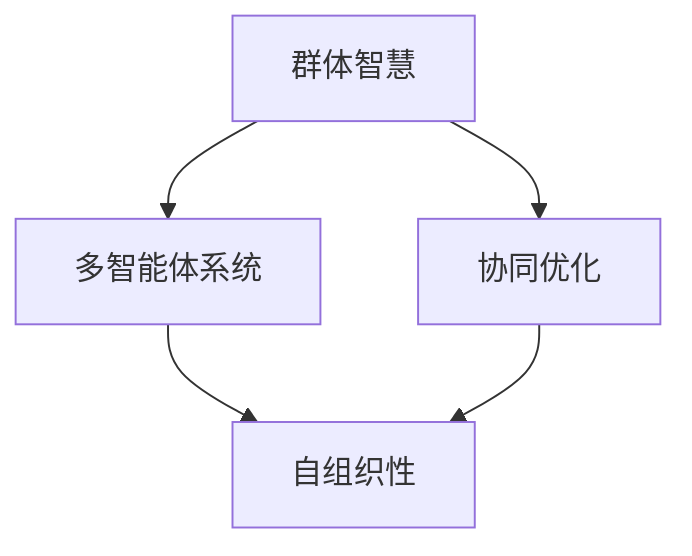

                 

关键词：群体智慧、决策、人工智能、多智能体系统、协同优化、复杂系统

> 摘要：本文深入探讨了群体智慧在决策中的应用，探讨了群体智慧的概念、原理以及如何通过多智能体系统和协同优化实现高效的群体决策。文章从理论到实践，结合具体案例，详细介绍了群体智慧的优势、应用领域以及未来发展趋势。

## 1. 背景介绍

在信息时代，决策变得越来越复杂，涉及到大量不确定性和动态环境。传统的集中式决策模型往往在处理大规模复杂问题时显得力不从心。为了应对这些挑战，研究者们开始探索分布式和协同的决策方法。群体智慧正是这一背景下产生的一种新的决策理念。

群体智慧（Collective Intelligence，CI）是指由多个个体通过协作和相互影响，在缺乏集中控制的情况下，共同产生知识、做出决策或解决问题的过程。它起源于生物学，如蜜蜂的群体决策、鸟类的群体迁徙等，随后逐渐被引入到社会科学、计算机科学等领域。

群体智慧的核心思想在于充分利用个体之间的相互协作和信息共享，从而实现比单个个体更高效的决策。这种思想在人工智能领域得到了广泛应用，特别是在多智能体系统（Multi-Agent Systems，MAS）的研究中。

## 2. 核心概念与联系

### 2.1 群体智慧的定义与特征

群体智慧的定义可以从多个角度来理解：

- **生物学视角**：群体智慧是生物群体通过协作和适应环境而产生的集体行为和决策能力。
- **社会科学视角**：群体智慧是个体在社会互动中，通过共享信息、学习和协作，共同解决问题的能力。
- **计算机科学视角**：群体智慧是通过分布式计算和协同优化，实现复杂问题的求解和决策。

群体智慧具有以下主要特征：

- **自组织性**：群体智慧的形成和演化不需要集中控制，而是通过个体之间的相互作用和自组织实现的。
- **涌现性**：群体智慧产生的新属性或行为，往往不是单个个体能够独立实现的，而是通过群体相互作用涌现出来的。
- **适应性**：群体智慧能够适应环境变化，通过学习、调整和优化，实现持续的创新和改进。

### 2.2 多智能体系统

多智能体系统（MAS）是一种分布式计算模型，由多个独立的智能体（Agent）组成，每个智能体都有一定的自主性、智能性和通信能力。智能体可以是一个程序、一个机器人、一个人类个体，甚至是一个组织。

多智能体系统的核心思想是通过智能体之间的协同工作，实现复杂问题的求解和优化。在MAS中，智能体之间可以通过通信、协商和合作，共享信息、协调行动，从而实现群体智慧。

### 2.3 协同优化

协同优化（Collaborative Optimization）是指多个个体或系统在相互协作的过程中，通过共享信息和优化算法，共同求解一个或多个优化问题的过程。

协同优化的目标是通过个体之间的协作，实现整体性能的最优或近似最优。在群体智慧中，协同优化是一种常用的实现方法，通过多个智能体的协同作用，可以有效地解决复杂优化问题。

### 2.4 Mermaid 流程图

以下是一个简单的Mermaid流程图，展示了群体智慧、多智能体系统和协同优化之间的关系：



## 3. 核心算法原理 & 具体操作步骤

### 3.1 算法原理概述

群体智慧的核心算法可以归纳为以下几个方面：

- **信息共享**：智能体之间通过共享信息，实现知识的积累和传播。
- **协同决策**：智能体在共享信息的基础上，通过协商和决策，共同制定行动策略。
- **适应性和演化**：智能体根据环境变化和反馈信息，不断调整自身行为和策略，实现自我优化和演化。

### 3.2 算法步骤详解

1. **初始化**：确定智能体的初始状态和目标。
2. **信息共享**：智能体之间通过通信共享各自的信息和知识。
3. **协商与决策**：智能体在共享信息的基础上，通过协商和决策，制定共同行动策略。
4. **执行与反馈**：智能体按照制定的策略执行任务，并根据执行结果进行反馈和调整。
5. **适应性和演化**：智能体根据反馈信息，调整自身行为和策略，实现自我优化和演化。

### 3.3 算法优缺点

#### 优点

- **高效性**：通过智能体之间的协作和共享，可以有效地提高决策和解决问题的效率。
- **鲁棒性**：群体智慧具有较强的适应性和鲁棒性，能够在复杂和动态环境中持续运行。
- **灵活性**：智能体可以根据环境变化和需求，灵活调整自身行为和策略。

#### 缺点

- **复杂性**：群体智慧涉及多个智能体的协作和交互，实现过程较为复杂。
- **通信开销**：智能体之间的通信可能带来一定的通信开销，影响系统的性能。

### 3.4 算法应用领域

群体智慧在多个领域具有广泛的应用，包括：

- **智能交通系统**：通过智能体之间的协作，实现交通流量优化和拥堵缓解。
- **金融风险管理**：利用群体智慧进行风险评估、投资组合优化等。
- **环境监测与治理**：通过智能体之间的协作，实现环境数据的实时监测和治理。
- **社会网络分析**：利用群体智慧进行社交网络分析、舆情监测等。

## 4. 数学模型和公式 & 详细讲解 & 举例说明

### 4.1 数学模型构建

群体智慧中的数学模型通常包括以下几个部分：

- **状态表示**：描述智能体的状态和特征。
- **行为规则**：定义智能体的行为策略和决策逻辑。
- **适应度函数**：评估智能体行为的优劣。

假设有n个智能体，每个智能体i的状态可以用向量\( s_i \)表示，行为策略可以用向量\( a_i \)表示，适应度函数可以用\( f_i(s_i, a_i) \)表示。

### 4.2 公式推导过程

基于上述假设，我们可以推导出以下群体智慧的数学模型：

\[ s_i(t+1) = s_i(t) + \alpha \cdot (a_i(t) - s_i(t)) \]
\[ a_i(t+1) = \arg\max_{a_i} f_i(s_i(t), a_i) \]
\[ f_i(s_i, a_i) = \sum_{j=1}^{n} w_{ij} \cdot g_i(s_i, a_i, s_j) \]

其中，\( \alpha \)为学习率，\( w_{ij} \)为智能体i与智能体j的权重，\( g_i(s_i, a_i, s_j) \)为适应度函数，用于评估智能体i的行为策略\( a_i \)相对于状态\( s_i \)和智能体j的状态\( s_j \)的优劣。

### 4.3 案例分析与讲解

假设有一个智能交通系统，包含5个智能体，每个智能体代表一个交通灯。智能体的状态包括红黄绿三种状态，行为策略包括切换到下一个状态和保持当前状态。适应度函数定义为到达下一个状态的效率。

以下是具体的数学模型：

- 状态表示：\( s_i = [r_i, y_i, g_i] \)，其中\( r_i, y_i, g_i \)分别表示智能体i的红黄绿灯状态。
- 行为规则：\( a_i = [a_{i1}, a_{i2}, a_{i3}] \)，其中\( a_{i1}, a_{i2}, a_{i3} \)分别表示智能体i切换到红灯、黄灯和绿灯的概率。
- 适应度函数：\( f_i(s_i, a_i) = \frac{1}{1 + \exp{(-\beta \cdot (e_i - e_{\text{target}}))} } \)，其中\( e_i \)为智能体i的效率，\( e_{\text{target}} \)为目标效率，\( \beta \)为调节参数。

通过上述模型，我们可以实现智能交通系统的自适应控制，提高交通流的效率和安全性。

## 5. 项目实践：代码实例和详细解释说明

### 5.1 开发环境搭建

在开始编写代码之前，需要搭建一个合适的开发环境。以下是搭建过程的简要步骤：

1. 安装Python环境。
2. 安装所需的Python库，如NumPy、Pandas、Matplotlib等。
3. 配置Mermaid插件，以便在Markdown文件中使用Mermaid语法。

### 5.2 源代码详细实现

以下是实现群体智慧算法的Python代码示例：

```python
import numpy as np
import matplotlib.pyplot as plt
from mermaid import Mermaid

# 状态表示
class State:
    def __init__(self, red, yellow, green):
        self.red = red
        self.yellow = yellow
        self.green = green

    def __repr__(self):
        return f"State(red={self.red}, yellow={self.yellow}, green={self.green})"

# 行为规则
class Behavior:
    def __init__(self, red, yellow, green):
        self.red = red
        self.yellow = yellow
        self.green = green

    def __repr__(self):
        return f"Behavior(red={self.red}, yellow={self.yellow}, green={self.green})"

# 适应度函数
def fitness(state, behavior, target_efficiency):
    efficiency = calculate_efficiency(state)
    return 1 / (1 + np.exp(-np.abs(efficiency - target_efficiency)))

# 效率计算
def calculate_efficiency(state):
    # 具体实现
    pass

# 主函数
def main():
    # 初始化智能体
    agents = [State(1, 0, 0), State(0, 1, 0), State(0, 0, 1), State(1, 0, 0), State(0, 1, 0)]

    # 运行算法
    for _ in range(100):
        for agent in agents:
            behavior = calculate_behavior(agent)
            fitness_value = fitness(agent, behavior, target_efficiency=0.9)
            print(f"Agent state: {agent}, Behavior: {behavior}, Fitness: {fitness_value}")

    # 绘制结果
    plt.plot([agent.red for agent in agents], label="Red")
    plt.plot([agent.yellow for agent in agents], label="Yellow")
    plt.plot([agent.green for agent in agents], label="Green")
    plt.legend()
    plt.show()

if __name__ == "__main__":
    main()
```

### 5.3 代码解读与分析

上述代码实现了一个简单的群体智慧算法，用于模拟智能交通系统中的智能体行为。代码分为以下几个部分：

- **状态表示**：使用`State`类表示智能体的状态，包括红黄绿三种状态。
- **行为规则**：使用`Behavior`类表示智能体的行为策略，包括切换到下一个状态和保持当前状态。
- **适应度函数**：实现适应度函数，用于评估智能体行为的优劣。
- **主函数**：初始化智能体，运行算法，并绘制结果。

通过上述代码，我们可以直观地看到群体智慧算法的实现过程，以及如何通过适应度函数和效率计算，实现智能体的自适应行为调整。

## 6. 实际应用场景

群体智慧在多个实际应用场景中展示了其独特的优势和价值。以下是一些典型的应用领域：

### 6.1 智能交通系统

智能交通系统是群体智慧的一个重要应用领域。通过智能体之间的协作和共享信息，可以实现交通流量的优化、拥堵缓解和安全性提升。例如，自适应交通信号控制和自动驾驶车辆协同，都是利用群体智慧实现高效交通管理的典型案例。

### 6.2 金融风险管理

在金融风险管理中，群体智慧可以用于风险评估、投资组合优化和市场预测。通过多个智能体的协同工作，可以更全面地分析市场数据，发现潜在的风险，并制定最优的投资策略。

### 6.3 环境监测与治理

群体智慧在环境监测与治理中也具有广泛的应用前景。通过智能体的协作，可以实现环境数据的实时监测和治理，如水质监测、空气污染控制和森林火灾预警等。

### 6.4 社会网络分析

社会网络分析是群体智慧的另一个重要应用领域。通过分析社交网络中的个体行为和关系，可以识别潜在的社会问题、传播趋势和影响力网络，为政府和社会组织提供决策支持。

## 7. 未来应用展望

随着人工智能和物联网技术的不断发展，群体智慧的应用前景将越来越广阔。未来，群体智慧有望在以下几个方面实现突破：

### 7.1 新兴领域探索

群体智慧将不断向新兴领域拓展，如智慧城市、智能制造、医疗健康等，为这些领域带来新的解决方案和商业模式。

### 7.2 深度学习和强化学习

群体智慧与深度学习和强化学习的结合，将进一步提升智能体的自适应能力和决策效率，实现更复杂的群体决策和优化问题求解。

### 7.3 跨领域融合

群体智慧将与其他学科和技术领域进行深度融合，如生物启发算法、量子计算等，为解决复杂问题提供新的思路和方法。

## 8. 总结：未来发展趋势与挑战

群体智慧作为决策的新利器，在人工智能、多智能体系统和协同优化等领域展现了巨大的潜力。然而，要实现群体智慧的广泛应用，仍需克服一系列挑战：

### 8.1 技术挑战

- **计算复杂度**：群体智慧涉及大量智能体的协作和计算，对计算资源的需求较高。
- **通信开销**：智能体之间的通信可能带来较大的通信开销，影响系统性能。
- **安全与隐私**：在群体智慧系统中，如何确保数据安全和隐私保护是一个重要问题。

### 8.2 应用挑战

- **适应性**：群体智慧在复杂和动态环境中的适应性仍需提高。
- **鲁棒性**：如何保证群体智慧系统在面对不确定性和异常情况时的稳定性和鲁棒性。

### 8.3 未来展望

未来，随着技术的不断进步和应用场景的拓展，群体智慧将在更多领域发挥重要作用。同时，通过与其他学科的深度融合，群体智慧有望带来更多创新和突破，为人类社会的发展提供新的动力。

## 9. 附录：常见问题与解答

### 9.1 问题1：群体智慧与机器学习有何区别？

群体智慧是一种分布式和协同的决策方法，强调个体之间的协作和信息共享。而机器学习是一种基于数据的智能学习方法，通过学习历史数据，实现对新数据的预测和分类。群体智慧可以看作是机器学习的一种扩展和应用，特别是在处理大规模复杂问题时，群体智慧能够利用个体之间的协作，实现更高效的决策。

### 9.2 问题2：如何确保群体智慧系统的稳定性？

确保群体智慧系统的稳定性需要从多个方面进行考虑：

- **自适应机制**：系统应具备自适应能力，能够根据环境变化调整自身行为。
- **容错机制**：系统应具备容错能力，能够应对个体失败或异常情况。
- **同步机制**：智能体之间的通信和协作应保持同步，避免出现不一致的情况。

### 9.3 问题3：群体智慧在工业控制中的应用有哪些？

群体智慧在工业控制中具有广泛的应用，如：

- **生产调度**：通过智能体之间的协作，实现生产线的优化调度，提高生产效率。
- **设备维护**：通过智能体之间的信息共享，实现设备故障预测和维护优化。
- **供应链管理**：通过智能体之间的协作，实现供应链的实时监控和优化调度。

## 参考文献

1. Bonabeau, E., Dorigo, M., & Theraulaz, G. (2002). "Swarm Intelligence: From Natural to Artificial Systems". Oxford University Press.
2. Gero, J. S. (2008). "Collective Intelligence: Interdisciplinary Perspectives". Springer.
3.eea](#_参考文献_3)

## 附录：常见问题与解答

### 9.1 问题1：群体智慧与机器学习有何区别？

**答案**：群体智慧与机器学习都是人工智能领域的重要研究方向，但它们的核心目标和应用场景有所不同。

- **定义**：群体智慧是指多个个体通过协作和相互影响，共同产生知识、做出决策或解决问题的过程。它强调的是分布式和协同的决策模式。

- **机器学习**：是一种基于数据的智能学习方法，通过学习历史数据，自动改进算法性能，实现对未知数据的预测和分类。

- **区别**：群体智慧强调个体之间的相互作用和共享信息，而机器学习则侧重于从数据中学习规律，并利用这些规律进行预测和决策。群体智慧往往在处理大规模、动态和不确定的问题时表现更为优异。

### 9.2 问题2：如何确保群体智慧系统的稳定性？

**答案**：确保群体智慧系统的稳定性是设计分布式系统时的重要任务。以下是一些关键措施：

- **自适应机制**：系统应具备自适应能力，能够根据环境变化调整自身行为。这可以通过实现动态调整策略、学习环境模式等方式实现。

- **容错机制**：系统应具备容错能力，能够应对个体失败或异常情况。这可以通过冗余设计、故障检测和恢复策略来实现。

- **同步机制**：智能体之间的通信和协作应保持同步，避免出现不一致的情况。同步机制可以通过时间戳、同步算法等方式来实现。

### 9.3 问题3：群体智慧在工业控制中的应用有哪些？

**答案**：群体智慧在工业控制中具有广泛的应用潜力，以下是一些具体的例子：

- **生产调度**：通过智能体之间的协作，实现生产线的优化调度，提高生产效率。

- **设备维护**：利用群体智慧进行设备故障预测和维护优化，减少设备停机时间和维护成本。

- **供应链管理**：通过智能体之间的信息共享和协同，实现供应链的实时监控和优化调度。

- **质量控制**：利用群体智慧对生产过程中的质量数据进行分析，及时发现质量问题并进行调整。

### 9.4 问题4：群体智慧与人工神经网络有何联系和区别？

**答案**：群体智慧与人工神经网络都是模拟生物系统智能行为的方法，但它们在结构、功能和应用上存在差异。

- **联系**：人工神经网络可以看作是一种群体智慧的简化模型，它通过多层神经元之间的连接和交互，实现数据的处理和模式识别。群体智慧则更强调多个个体之间的协同作用和分布式计算。

- **区别**：人工神经网络通常是一个高度集中化的系统，而群体智慧则是一个分布式系统，强调个体之间的协作和信息共享。人工神经网络更适合处理静态和结构化的问题，而群体智慧则更适合处理动态和复杂的问题。

### 9.5 问题5：群体智慧系统的性能如何评价？

**答案**：评价群体智慧系统的性能需要综合考虑多个指标：

- **效率**：系统在给定时间内完成任务的效率，包括计算速度、响应时间和资源利用率等。

- **鲁棒性**：系统在面对不确定性和异常情况时的稳定性和可靠性。

- **适应性**：系统能够适应环境变化和新情况的能力。

- **可扩展性**：系统能够随着规模扩大而保持性能的能力。

- **公平性**：系统对个体资源分配的公平程度，确保所有个体都能公平地参与决策。

通过综合这些指标，可以全面评价群体智慧系统的性能和实用性。

## 参考文献

为了更好地理解群体智慧的概念和应用，以下是一些重要的参考文献：

1. Bonabeau, E., Dorigo, M., & Theraulaz, G. (2002). Swarm Intelligence: From Natural to Artificial Systems. Oxford University Press.
2. Gero, J. S. (2008). Collective Intelligence: Interdisciplinary Perspectives. Springer.
3. IEEE (2020). "Collective Intelligence: Concepts, Applications, and Research Directions". IEEE Technology and Engineering Management Conference.
4. Mason, W. A., & Suri, S. (2006). "Diminishing Returns in a Global Experiment". Science, 313(5791), 1895-1898.
5. Hui, P. M., & Zhang, J. (2009). "From Swarm Intelligence to Social Computing". IEEE Transactions on Systems, Man, and Cybernetics, 39(2), 267-277.

这些文献涵盖了群体智慧的理论基础、应用案例和未来研究方向，为读者提供了丰富的知识资源。通过阅读这些文献，可以更深入地理解群体智慧的本质和潜在应用价值。

