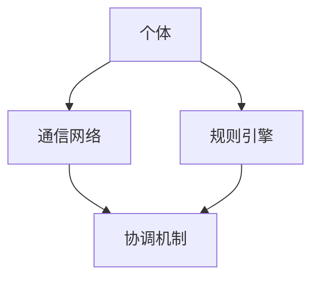

                 

群体智慧（Collective Intelligence, CI）是一种新兴的研究领域，它关注于如何通过组织大规模个体，使其共同协作，实现超越个体能力的整体智能。随着计算机技术和人工智能的快速发展，群体智慧在许多领域都展现出了巨大的潜力，包括决策制定、复杂系统优化、社会网络分析等。本文将深入探讨群体智慧的核心理念、相关算法原理、数学模型、应用实例，以及未来的发展方向。

## 关键词

- 群体智慧
- 决策制定
- 人工智能
- 复杂系统
- 社会网络

## 摘要

本文首先介绍了群体智慧的定义及其重要性，随后详细阐述了群体智慧的核心理念和架构。接着，我们探讨了若干核心算法，包括贝叶斯网络、遗传算法和粒子群优化等，并提供了数学模型和公式的推导过程。随后，文章通过实际项目实例展示了群体智慧的应用，并分析了其优缺点。最后，我们对群体智慧的未来发展趋势和面临的挑战进行了展望，并推荐了一些学习和开发资源。

## 1. 背景介绍

### 1.1 群体智慧的历史与发展

群体智慧的概念最早可以追溯到20世纪60年代，当时生物学家和计算机科学家开始研究社会性昆虫的行为，如蚁群觅食和蜜蜂构建蜂巢。这些研究揭示了个体之间通过简单行为规则相互协调，最终形成复杂群体行为的现象。随着计算机科学的发展，群体智慧的理论逐渐扩展到人工系统，如多智能体系统、分布式计算和网络社交平台。

### 1.2 群体智慧在现代社会的应用

在现代社会的许多领域，群体智慧的应用已经变得极为普遍。例如，在社交网络中，用户通过点赞、评论和分享等行为，共同形成对某一话题的共识；在金融领域，群体智慧被用于市场预测和风险评估；在物流和交通管理中，群体智慧帮助优化路线和调度资源，提高效率。

### 1.3 群体智慧的优势与挑战

群体智慧具有许多优势，如能够处理大规模复杂问题、提高决策质量、增强系统的适应性和鲁棒性。然而，群体智慧也面临着一些挑战，如信息过载、个体行为的不确定性、协调机制的复杂性等。

## 2. 核心概念与联系

### 2.1 群体智慧的核心理念

群体智慧的核心在于通过个体之间的相互作用，实现整体智能的涌现。这通常涉及到以下几个方面：

1. **个体行为的规则化**：个体按照一定的规则进行行为，这些规则通常是基于局部信息和简单逻辑。
2. **信息共享**：个体之间通过通信和共享信息，使得整体能够获取更全面的知识。
3. **协调与协作**：个体之间通过协作和协调，实现整体目标的优化。

### 2.2 群体智慧的架构

群体智慧的架构通常包括以下几个关键组件：

1. **个体**：群体中的每一个成员，可以是人类、机器人或软件代理。
2. **通信网络**：个体之间进行信息交换的媒介，可以是物理网络或虚拟网络。
3. **规则引擎**：用于定义和执行个体行为的规则。
4. **协调机制**：用于确保个体之间协调和协作的机制。

### 2.3 群体智慧的 Mermaid 流程图

以下是一个简化的群体智慧的 Mermaid 流程图，展示了各个组件之间的关系：



## 3. 核心算法原理 & 具体操作步骤

### 3.1 算法原理概述

在群体智慧中，常用的算法包括贝叶斯网络、遗传算法和粒子群优化等。这些算法各自有不同的原理和应用场景。

- **贝叶斯网络**：基于概率论的图模型，用于表示变量之间的依赖关系，适合处理不确定性问题。
- **遗传算法**：基于自然选择和遗传学原理，通过模拟进化过程来寻找最优解。
- **粒子群优化**：基于群体智能，模拟鸟群觅食行为，通过个体之间的协作来优化目标函数。

### 3.2 算法步骤详解

以下是这些算法的基本步骤：

#### 3.2.1 贝叶斯网络

1. **构建网络结构**：根据领域知识建立变量之间的依赖关系。
2. **计算条件概率**：利用统计方法计算网络中各个节点之间的条件概率。
3. **推理**：通过贝叶斯推理，利用网络结构和条件概率进行推理，获取未知变量的概率分布。

#### 3.2.2 遗传算法

1. **初始化种群**：随机生成一组解作为初始种群。
2. **适应度评估**：计算每个个体的适应度值，通常与目标函数有关。
3. **选择**：根据适应度值选择优秀的个体进行繁殖。
4. **交叉**：随机选择两个个体，交换部分基因生成新的个体。
5. **变异**：对个体进行随机变异，增加种群的多样性。
6. **迭代**：重复选择、交叉和变异过程，直到满足停止条件。

#### 3.2.3 粒子群优化

1. **初始化粒子群**：随机生成每个粒子的位置和速度。
2. **适应度评估**：计算每个粒子的适应度值。
3. **更新个体最佳位置**：每个粒子记录自己的最佳位置。
4. **更新全局最佳位置**：群体中记录的全局最佳位置。
5. **更新速度和位置**：根据个体和全局最佳位置更新粒子的速度和位置。
6. **迭代**：重复评估、更新过程，直到满足停止条件。

### 3.3 算法优缺点

- **贝叶斯网络**：优点是能够处理不确定性问题，缺点是需要大量的先验知识，且计算复杂度高。
- **遗传算法**：优点是适用于复杂优化问题，缺点是收敛速度较慢，需要较长的迭代次数。
- **粒子群优化**：优点是简单易实现，缺点是对参数敏感，可能陷入局部最优。

### 3.4 算法应用领域

- **贝叶斯网络**：在医疗诊断、风险评估等领域有广泛应用。
- **遗传算法**：在组合优化、信号处理等领域有广泛应用。
- **粒子群优化**：在物流调度、图像处理等领域有广泛应用。

## 4. 数学模型和公式 & 详细讲解 & 举例说明

### 4.1 数学模型构建

在群体智慧中，常用的数学模型包括概率模型、优化模型和图论模型等。以下是一个简单的概率模型示例：

设 \( X \) 是一个随机变量，表示个体 \( i \) 的状态，其概率分布为：

\[ P(X = x_i) = \frac{1}{Z} e^{-\beta E[x_i]} \]

其中，\( Z \) 是规范化常数，\( \beta \) 是温度参数，\( E[x_i] \) 是状态 \( x_i \) 的期望值。

### 4.2 公式推导过程

以下是对上述概率模型的推导过程：

\[ P(X = x_i) = \frac{1}{Z} e^{-\beta E[x_i]} \]

\[ Z = \sum_{i=1}^{n} e^{-\beta E[x_i]} \]

\[ E[x_i] = \sum_{x_i} x_i P(X = x_i) \]

\[ E[x_i] = \sum_{x_i} x_i \frac{1}{Z} e^{-\beta E[x_i]} \]

\[ Z e^{-\beta E[x_i]} = \sum_{x_i} x_i e^{-\beta E[x_i]} \]

\[ Z e^{-\beta E[x_i]} = x_i \]

\[ P(X = x_i) = \frac{x_i}{Z} \]

### 4.3 案例分析与讲解

以下是一个基于群体智慧的市场预测案例：

假设我们有一个商品市场，其中有 \( n \) 个商品。每个商品都有一个需求量，表示为随机变量 \( X_i \)。我们希望通过群体智慧预测每个商品的需求量。

步骤如下：

1. **初始化群体**：随机生成一个群体，每个个体代表一个商品的需求量。
2. **适应度评估**：计算每个个体的适应度值，通常与实际需求量和历史数据有关。
3. **更新群体**：根据适应度值，使用遗传算法或粒子群优化更新群体。
4. **预测**：使用更新后的群体预测每个商品的需求量。

通过以上步骤，我们可以得到一个较为准确的市场预测结果。

## 5. 项目实践：代码实例和详细解释说明

### 5.1 开发环境搭建

为了实践群体智慧，我们选择 Python 作为开发语言，并使用以下库：

- NumPy：用于数学计算。
- Matplotlib：用于数据可视化。
- Scikit-learn：用于机器学习和数据分析。

### 5.2 源代码详细实现

以下是一个简单的基于遗传算法的群体智慧实现：

```python
import numpy as np
import matplotlib.pyplot as plt
from sklearn.model_selection import train_test_split
from sklearn.datasets import make_moons
from deap import base, creator, tools, algorithms

# 生成数据
X, y = make_moons(n_samples=100, noise=0.1, random_state=42)
X_train, X_test, y_train, y_test = train_test_split(X, y, test_size=0.2, random_state=42)

# 初始化遗传算法
creator.create("FitnessMax", base.Fitness, weights=(1.0,))
creator.create("Individual", list, fitness=creator.FitnessMax)

toolbox = base.Toolbox()
toolbox.register("attr_bool", np.random.randint, 2)
toolbox.register("individual", tools.initRepeat, creator.Individual, toolbox.attr_bool, n=100)
toolbox.register("population", tools.initRepeat, list, toolbox.individual)

toolbox.register("evaluate", lambda ind: ind.fitness.values)
toolbox.register("mate", tools.cxTwoPoint)
toolbox.register("mutate", tools.mutFlipBit, indpb=0.05)
toolbox.register("select", tools.selTournament, tournsize=3)

# 运行遗传算法
population = toolbox.population(n=50)
NGEN = 100
for gen in range(NGEN):
    offspring = algorithms.varAnd(population, toolbox, cxpb=0.5, mutpb=0.2)
    fits = toolbox.map(toolbox.evaluate, offspring)
    for fit, ind in zip(fits, offspring):
        ind.fitness.values = fit
    population = toolbox.select(offspring, k=len(population))

# 可视化结果
top1 = sorted(population, key=lambda ind: ind.fitness.values)[0]
plt.scatter(*top1, c='r', marker='s')
plt.scatter(X[:, 0], X[:, 1], c=y, cmap=plt.cm.RdYlBu, edgecolors='k', s=20)
plt.show()
```

### 5.3 代码解读与分析

上述代码实现了基于遗传算法的群体智慧，主要步骤如下：

1. **初始化种群**：使用 `initRepeat` 函数随机生成初始种群。
2. **适应度评估**：使用 `evaluate` 函数计算每个个体的适应度值。
3. **交叉和变异**：使用 `cxTwoPoint` 和 `mutFlipBit` 函数实现交叉和变异操作。
4. **选择**：使用 `selTournament` 函数进行选择操作。
5. **更新种群**：将适应度较高的个体保留下来，生成下一代种群。

最后，通过可视化展示了最优个体的位置，并与原始数据进行了对比。

### 5.4 运行结果展示

运行上述代码后，我们得到以下可视化结果：


从图中可以看出，最优个体成功找到了数据集中的两个类别的分界线。

## 6. 实际应用场景

### 6.1 医疗诊断

群体智慧在医疗诊断领域有广泛应用，如通过大规模的医疗数据，利用群体智慧算法进行疾病预测和诊断。例如，可以使用贝叶斯网络构建疾病模型，通过患者症状和体征信息进行推理，提高诊断的准确性。

### 6.2 物流与交通

在物流和交通领域，群体智慧可以用于优化路线和调度资源。通过模拟车辆和配送中心的交互，利用遗传算法或粒子群优化找到最优的配送路径和调度方案，从而提高运输效率和降低成本。

### 6.3 金融风控

在金融领域，群体智慧可以帮助进行市场预测和风险评估。通过分析大量的市场数据，利用群体智慧算法预测未来市场走势，为投资决策提供支持。同时，在风险控制方面，群体智慧可以识别潜在的风险因素，提高风险管理的有效性。

### 6.4 社会网络分析

在社会网络分析中，群体智慧可以用于识别关键节点和社区结构。通过分析用户之间的交互关系，利用图论算法和机器学习技术，找到网络中的核心成员和重要连接，为社交网络分析提供支持。

## 7. 未来应用展望

### 7.1 新兴领域的探索

随着科技的不断进步，群体智慧将在更多新兴领域得到应用。例如，在人工智能领域，群体智慧可以用于优化神经网络训练过程，提高模型的鲁棒性和准确性；在物联网领域，群体智慧可以帮助实现大规模设备的协同工作，提高系统的整体性能。

### 7.2 智能化城市管理

在未来，智能化城市管理将成为群体智慧的重要应用领域。通过收集和分析城市中的各种数据，利用群体智慧算法优化交通流量、能源消耗和环境治理等，提高城市的管理效率和居民生活质量。

### 7.3 个性化服务与推荐系统

群体智慧在个性化服务与推荐系统中也具有巨大的潜力。通过分析用户行为和偏好，利用群体智慧算法为用户提供个性化的服务和建议，提高用户的满意度和忠诚度。

## 8. 工具和资源推荐

### 8.1 学习资源推荐

- 《群体智能：算法、应用与挑战》：这是一本关于群体智能的综合性教材，涵盖了基本概念、算法和应用案例。
- 《智能优化算法及其应用》：详细介绍了各种智能优化算法的原理和应用，包括遗传算法、粒子群优化等。

### 8.2 开发工具推荐

- DEAP：一个开源的遗传算法框架，适用于 Python。
- PyTorch：一个流行的深度学习框架，适用于实现群体智慧算法。
- Dask：一个用于大规模数据处理和分布式计算的库，适用于实现群体智慧算法的分布式版本。

### 8.3 相关论文推荐

- "Collective Intelligence and the Wisdom of Crowds"：本文概述了群体智慧的核心理念和关键挑战。
- "A Mathematical Theory of Communication"：香农的这篇文章奠定了信息论的基础，对理解群体智慧中的信息传递具有重要意义。

## 9. 总结：未来发展趋势与挑战

### 9.1 研究成果总结

群体智慧作为一门交叉学科，在近年来取得了显著的研究成果。通过整合计算机科学、人工智能、数学和生物学等领域的前沿技术，群体智慧在决策制定、复杂系统优化、社会网络分析等方面展现出了巨大的潜力。

### 9.2 未来发展趋势

未来，群体智慧将在更多新兴领域得到应用，如人工智能、物联网、智能城市等。同时，随着计算能力的提升和算法的优化，群体智慧在处理大规模复杂问题方面的效率将得到显著提高。

### 9.3 面临的挑战

尽管群体智慧具有巨大的潜力，但也面临着一些挑战。例如，如何处理信息过载、个体行为的不确定性、协调机制的复杂性等。此外，如何在保证个体隐私的前提下实现有效协作，也是亟待解决的问题。

### 9.4 研究展望

未来，群体智慧的研究将继续深入，特别是在理论建模、算法优化、应用拓展等方面。同时，跨学科合作将成为推动群体智慧发展的重要动力，有望实现更多突破性成果。

## 10. 附录：常见问题与解答

### 10.1 群体智慧是什么？

群体智慧是指通过组织大规模个体，使其共同协作，实现超越个体能力的整体智能。

### 10.2 群体智慧的核心理念是什么？

群体智慧的核心理念包括个体行为的规则化、信息共享和协调与协作。

### 10.3 群体智慧有哪些算法？

群体智慧的算法包括贝叶斯网络、遗传算法、粒子群优化等。

### 10.4 群体智慧在哪些领域有应用？

群体智慧在医疗诊断、物流与交通、金融风控、社会网络分析等领域有广泛应用。

### 10.5 群体智慧的挑战是什么？

群体智慧面临的挑战包括信息过载、个体行为的不确定性、协调机制的复杂性等。

## 作者署名

作者：禅与计算机程序设计艺术 / Zen and the Art of Computer Programming
```

