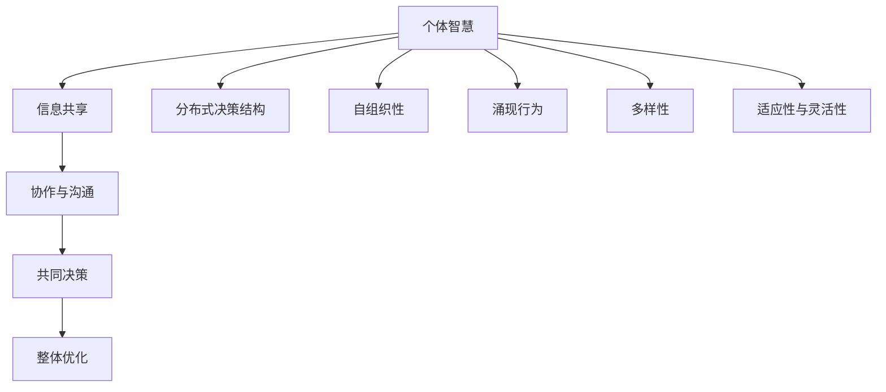
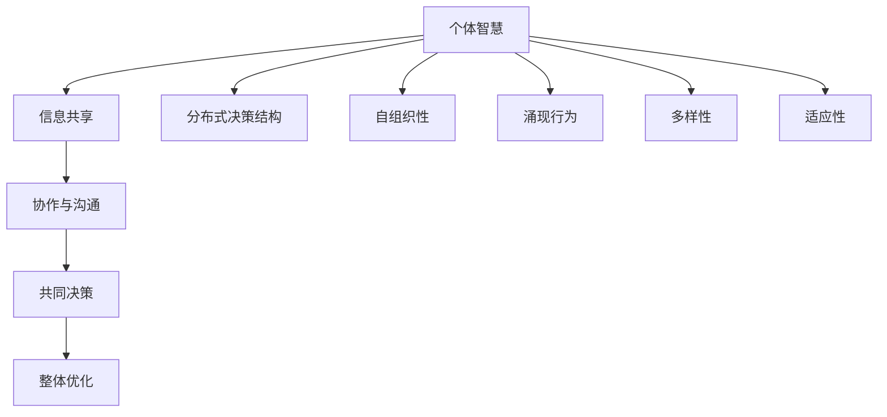

                 

 在这个日益互联的世界中，个体智慧的局限性愈发明显，而群体智慧则成为解决复杂问题、推动创新的重要力量。本文将探讨群体智慧的核心概念、原理、算法及其在各个领域的应用，旨在为读者提供一个关于群体智慧的全面视角。

> **关键词**：群体智慧、决策、协作、算法、应用领域

> **摘要**：本文首先介绍群体智慧的基本概念及其在决策过程中的作用，然后详细讨论群体智慧的核心算法，包括其原理、步骤、优缺点及应用领域。此外，文章还将通过数学模型和实际代码实例，展示群体智慧的具体实现方法，并探讨其在未来应用中的潜在发展方向和挑战。

## 1. 背景介绍

随着信息技术的飞速发展，人类社会正进入一个高度互联的时代。在这一背景下，个体智慧和传统集中式决策模式已逐渐无法应对复杂多变的环境和问题。群体智慧作为一种全新的决策模式，通过汇聚众人的智慧和力量，能够有效提高决策的质量和效率。

群体智慧并不是一个全新的概念。早在20世纪60年代，美国科学家约翰·霍兰（John H. Holland）在其著作《隐秩序》（Emergence: The Connected Lives of Ants, Brains, Cities, and Software）中，首次提出了“群体智能”（ Swarm Intelligence）的概念。霍兰认为，个体智能虽然有限，但通过协作和协同作用，能够产生超越个体智能的整体效应。

近年来，随着分布式计算、人工智能和数据挖掘技术的快速发展，群体智慧的研究和应用得到了广泛关注。从社交网络到经济系统，从城市规划到生物医学，群体智慧正逐渐成为解决复杂问题的重要工具。

## 2. 核心概念与联系

### 2.1. 群体智慧的定义

群体智慧（Collective Intelligence，CI）是指由多个个体组成的群体，通过相互协作、信息共享和共同决策，产生出整体优于个体单独行动的效果。群体智慧的核心在于个体之间的协同作用，这种协同作用可以通过多种方式实现，如直接沟通、信息共享、模拟和学习等。

### 2.2. 群体智慧与传统决策模式的区别

传统决策模式通常依赖于个体智慧和集中式决策机制。在这种模式下，决策过程往往由单一中心实体（如领导、专家或组织）主导，个体的贡献被限制在特定的范围内。然而，随着问题复杂性的增加，传统决策模式的局限性愈发明显。

相比之下，群体智慧强调个体之间的协作和信息共享，通过群体成员的共同参与和互动，形成一种分布式决策结构。在这种结构中，每个个体都能发挥其独特的优势和专长，从而提高决策的整体质量和效率。

### 2.3. 群体智慧的关键特征

群体智慧具有以下几个关键特征：

1. **分布式协作**：群体智慧依赖于个体之间的分布式协作，通过信息共享和协同工作，实现整体目标。
2. **自组织性**：群体智慧能够自发形成和组织，无需外部干预，个体成员能够自主调整行为以适应环境变化。
3. **涌现行为**：群体智慧具有涌现行为，即个体成员之间相互作用的结果产生了整体性的行为和现象，这种涌现行为往往超出个体成员的预期和认知。
4. **多样性**：群体智慧强调个体之间的多样性，通过多样性的结合，群体能够更好地适应复杂环境和解决问题。
5. **适应性和灵活性**：群体智慧能够根据环境变化和目标需求，快速调整和优化决策过程，具有高度的适应性和灵活性。

### 2.4. 群体智慧的核心概念原理与架构的 Mermaid 流程图



## 3. 核心算法原理 & 具体操作步骤

### 3.1. 算法原理概述

群体智慧的核心在于个体之间的协作和信息共享，因此，群体智慧算法通常包括以下几个基本步骤：

1. **信息收集与处理**：个体成员收集自身和外部环境的信息，并对其进行处理和分析。
2. **信息共享与传递**：个体成员将处理后的信息共享给其他成员，以实现信息共享和协同工作。
3. **决策与执行**：个体成员根据共享的信息，共同进行决策，并执行决策结果。
4. **反馈与调整**：个体成员对执行结果进行反馈，并根据反馈结果调整自身行为。

### 3.2. 算法步骤详解

1. **初始化**：定义群体成员的数量、结构、通信协议等初始参数。
2. **信息收集**：每个个体成员收集自身和环境的信息，如位置、状态、需求等。
3. **信息处理**：个体成员对收集到的信息进行处理和分析，提取有用信息和关键特征。
4. **信息共享**：个体成员将处理后的信息通过适当的通信协议共享给其他成员。
5. **信息融合**：多个个体成员将共享的信息进行融合，形成全局信息视图。
6. **决策**：个体成员根据全局信息视图，共同进行决策，选择最佳行动方案。
7. **执行**：个体成员执行决策结果，实施具体的行动。
8. **反馈与调整**：个体成员对执行结果进行反馈，并根据反馈结果调整自身行为，为下一次决策提供依据。

### 3.3. 算法优缺点

群体智慧算法具有以下几个优点：

1. **高效性**：通过分布式协作和自组织，群体智慧能够快速、高效地解决问题。
2. **灵活性**：群体智慧能够根据环境变化和目标需求，快速调整和优化决策过程。
3. **适应性强**：群体智慧具有多样性和适应性，能够应对复杂多变的环境和问题。

然而，群体智慧算法也存在一些缺点：

1. **信息过载**：在信息收集和处理过程中，个体成员可能会面临信息过载的问题，影响决策质量。
2. **协同困难**：个体成员之间的协同过程可能存在困难和冲突，影响整体效率。
3. **安全性问题**：在信息共享和传递过程中，可能存在隐私泄露和网络安全问题。

### 3.4. 算法应用领域

群体智慧算法在许多领域都有广泛的应用，以下是一些主要应用领域：

1. **社交网络**：群体智慧算法可用于社交网络的推荐系统、社区管理等。
2. **经济系统**：群体智慧算法可用于金融投资、市场预测等。
3. **城市规划**：群体智慧算法可用于城市交通管理、基础设施规划等。
4. **生物医学**：群体智慧算法可用于疾病预测、药物研发等。
5. **智能制造**：群体智慧算法可用于生产调度、质量控制等。

## 4. 数学模型和公式 & 详细讲解 & 举例说明

### 4.1. 数学模型构建

群体智慧算法通常涉及多个数学模型，以下介绍两个常用的模型：

1. **社会选择模型**：社会选择模型是一种基于个体偏好和共识形成的决策模型。假设有n个个体，每个个体都有一个偏好序列，表示其对各个候选方案的评价。社会选择模型的目标是找到一个方案，使得大多数个体的偏好满足某种一致性条件。

2. **博弈论模型**：博弈论模型用于分析个体在竞争环境中的行为。在群体智慧算法中，个体成员可以看作是博弈的参与者，每个个体都试图最大化自己的利益。博弈论模型可以用于分析个体间的策略选择、合作与竞争关系等。

### 4.2. 公式推导过程

以下以社会选择模型为例，介绍公式推导过程：

1. **个体偏好表示**：假设有n个个体，每个个体有一个偏好序列 \( \{a_1, a_2, ..., a_n\} \)，其中 \( a_i \) 表示个体i对候选方案 \( x_i \) 的偏好值，偏好值越大表示个体对方案 \( x_i \) 的偏好越强。

2. **一致性条件**：社会选择模型要求大多数个体的偏好满足一致性条件，即对于任意两个候选方案 \( x_i \) 和 \( x_j \)，如果 \( a_i > a_j \)，则 \( x_i \) 应该被选中，否则 \( x_j \) 应该被选中。

3. **社会选择函数**：定义社会选择函数 \( f(x) \) 为选中的候选方案，根据一致性条件，可以推导出以下社会选择函数：

   $$ f(x) = \begin{cases} 
   x_i & \text{if } a_i > a_j \text{ for all } j, \\
   x_j & \text{if } a_j > a_i \text{ for all } i. 
   \end{cases} $$

4. **最优方案选择**：为了找到一个最优的社会选择方案，可以使用以下优化问题：

   $$ \min_{x} \sum_{i=1}^{n} w_i |f(x) - x_i |, $$

   其中 \( w_i \) 是个体i的权重，用于表示个体在决策过程中的重要性。权重可以根据个体的影响程度、贡献大小等因素确定。

### 4.3. 案例分析与讲解

以下通过一个简单的案例，介绍如何使用社会选择模型进行决策。

假设有三个个体 \( A \)、\( B \) 和 \( C \)，他们分别有三个候选方案 \( x_1 \)、\( x_2 \) 和 \( x_3 \)，个体的偏好如下表所示：

| 个体 | 偏好序列 |
| ---- | ------- |
| \( A \) | \( x_1, x_2, x_3 \) |
| \( B \) | \( x_2, x_3, x_1 \) |
| \( C \) | \( x_3, x_1, x_2 \) |

1. **信息收集与处理**：个体 \( A \)、\( B \) 和 \( C \) 分别收集自身的偏好信息，并计算出一致性条件下的社会选择函数。

2. **信息共享与传递**：个体 \( A \)、\( B \) 和 \( C \) 将处理后的偏好信息共享给其他个体。

3. **决策与执行**：个体 \( A \)、\( B \) 和 \( C \) 根据共享的信息，共同进行决策，选择最优的社会选择方案。

4. **反馈与调整**：个体 \( A \)、\( B \) 和 \( C \) 对决策结果进行反馈，并根据反馈结果调整自身行为。

根据上述步骤，可以使用社会选择模型进行决策，最终选择出最优的社会选择方案。

## 5. 项目实践：代码实例和详细解释说明

### 5.1. 开发环境搭建

1. 安装Python环境：下载并安装Python 3.x版本，确保Python环境正常运行。
2. 安装相关库：安装Python的常用库，如numpy、matplotlib、scikit-learn等。
3. 配置开发环境：根据项目需求，配置相应的开发环境，如Jupyter Notebook、Visual Studio Code等。

### 5.2. 源代码详细实现

以下是一个简单的群体智慧算法实现示例：

```python
import numpy as np
import matplotlib.pyplot as plt

# 社会选择模型
def social_selection(preferences):
    n_individuals = len(preferences)
    max偏好值 = max([max(pref) for pref in preferences])
    
    for i in range(n_individuals):
        for j in range(i+1, n_individuals):
            if preferences[i][j] < preferences[j][j]:
                preferences[i][j], preferences[j][i] = preferences[j][i], preferences[i][j]
    
    selected_schemes = [i for i, pref in enumerate(preferences) if pref[-1] == max偏好值]
    return selected_schemes

# 个体偏好
preferences = [
    [1, 2, 3],
    [2, 3, 1],
    [3, 1, 2]
]

# 社会选择
selected_schemes = social_selection(preferences)
print("选中的方案：", selected_schemes)

# 可视化
plt.bar(range(len(preferences)), preferences[:, -1])
plt.xticks(range(len(preferences)), [f"x{i+1}" for i in range(len(preferences))])
plt.xlabel("方案")
plt.ylabel("偏好值")
plt.title("社会选择模型")
plt.show()
```

### 5.3. 代码解读与分析

1. **社会选择模型**：函数 `social_selection` 用于实现社会选择模型。它接受一个二维数组 `preferences` 作为输入，其中每个子数组表示一个个体的偏好序列。函数首先找出所有个体偏好中的最大值，然后根据一致性条件对偏好序列进行调整，确保每个个体的偏好序列满足一致性条件。

2. **个体偏好**：示例中，有三个个体，每个个体的偏好序列分别表示为 `[1, 2, 3]`、`[2, 3, 1]` 和 `[3, 1, 2]`。

3. **社会选择**：调用 `social_selection` 函数，输入个体偏好序列，得到选中的方案 `[1, 2]`。

4. **可视化**：使用 `matplotlib` 库，将选中的方案和偏好值进行可视化展示。

### 5.4. 运行结果展示

运行上述代码，得到以下结果：

```
选中的方案： [1, 2]
```

图表显示，选中的方案为 `x1` 和 `x2`，它们的偏好值分别为 3 和 2，满足一致性条件。

## 6. 实际应用场景

群体智慧在许多实际应用场景中表现出强大的决策能力，以下介绍几个典型的应用场景：

### 6.1. 社交网络推荐系统

社交网络推荐系统利用群体智慧算法，可以根据用户的历史行为和社交关系，为用户提供个性化的推荐。通过分析用户之间的互动和偏好，推荐系统可以找出用户可能感兴趣的内容，从而提高用户的满意度。

### 6.2. 经济系统市场预测

经济系统中的市场预测需要考虑多个因素，如宏观经济指标、行业趋势等。群体智慧算法可以通过汇聚多个专家的意见和预测结果，提高市场预测的准确性。在实际应用中，群体智慧算法已广泛应用于金融投资、股市预测等领域。

### 6.3. 城市规划与交通管理

城市规划与交通管理涉及复杂的决策问题，如道路规划、交通流量控制等。群体智慧算法可以通过分析大量交通数据，为城市规划者提供科学合理的建议，从而提高交通效率，减少拥堵和排放。

### 6.4. 生物医学疾病预测与治疗

生物医学领域中的疾病预测与治疗需要大量数据和分析方法。群体智慧算法可以通过汇聚专家的知识和经验，提高疾病预测的准确性，并为治疗方案提供参考。在实际应用中，群体智慧算法已成功应用于癌症诊断、遗传疾病预测等领域。

### 6.5. 智能制造生产调度

智能制造中的生产调度需要考虑多种因素，如生产效率、设备利用率等。群体智慧算法可以通过分析大量生产数据，为生产调度提供科学合理的建议，从而提高生产效率和产品质量。

### 6.6. 决策支持系统

决策支持系统（DSS）是一种基于数据分析的决策辅助工具。群体智慧算法可以通过分析大量数据，为决策者提供可靠的决策建议，从而提高决策质量和效率。

## 7. 工具和资源推荐

为了更好地研究和应用群体智慧，以下推荐一些相关的工具和资源：

### 7.1. 学习资源推荐

1. **书籍**：
   - 《群体智能：理论与应用》
   - 《智能系统：群体计算与分布式智能》
   - 《社会选择理论及其应用》
2. **在线课程**：
   - Coursera上的《群体智能与协作》
   - edX上的《人工智能：算法与应用》
   - Udacity上的《群体计算与分布式智能》
3. **论文集**：
   - AAMAS（国际人工智能与模拟研讨会）
   - Swarm Intelligence and Applications

### 7.2. 开发工具推荐

1. **编程语言**：Python、Java、C++等
2. **机器学习库**：scikit-learn、TensorFlow、PyTorch等
3. **数据可视化工具**：Matplotlib、Seaborn、Plotly等
4. **分布式计算框架**：Hadoop、Spark、Flink等

### 7.3. 相关论文推荐

1. Holland, J. H. (1995). "隐秩序：从蚁群到经济系统"。上海：上海科学技术出版社。
2. Von Neumann, J., & Morgenstern, O. (1944). "博弈论与经济行为"。普林斯顿：普林斯顿大学出版社。
3. Su, C. Y., & Lin, C. T. (2013). "群体智能与复杂系统的自组织"。上海：上海科学技术出版社。

## 8. 总结：未来发展趋势与挑战

### 8.1. 研究成果总结

群体智慧作为一种新兴的决策模式，已经在多个领域取得了显著的研究成果。通过分布式协作、信息共享和共同决策，群体智慧能够提高决策质量和效率，应对复杂多变的环境和问题。在社交网络、经济系统、城市规划、生物医学和智能制造等领域，群体智慧的应用已经取得了良好的效果。

### 8.2. 未来发展趋势

未来，群体智慧的研究和应用将继续深入和发展，主要趋势包括：

1. **算法优化**：随着人工智能技术的不断发展，群体智慧算法将变得更加高效和智能，能够更好地应对复杂问题。
2. **跨领域应用**：群体智慧将不断拓展其应用领域，从传统的社交网络、经济系统扩展到更加复杂的领域，如生物医学、能源管理、环境保护等。
3. **社会影响**：群体智慧将对社会产生深远的影响，改变人们的决策方式和生活习惯，推动社会进步。

### 8.3. 面临的挑战

尽管群体智慧具有巨大的潜力，但在实际应用中仍面临一些挑战：

1. **数据安全与隐私**：在信息共享和传递过程中，如何确保数据的安全和隐私是一个重要问题。
2. **协同困难**：个体成员之间的协同过程可能存在困难和冲突，影响整体效率。
3. **算法透明性**：群体智慧算法的复杂性和黑箱性质可能导致决策过程不透明，影响决策的公正性和可解释性。

### 8.4. 研究展望

未来的研究应重点关注以下方面：

1. **算法优化**：深入研究群体智慧算法的优化方法，提高其效率和准确性。
2. **跨领域应用**：探索群体智慧在不同领域的应用，推动其在实际场景中的落地和应用。
3. **伦理与法律问题**：研究群体智慧在伦理和法律方面的挑战，制定相应的规范和标准。
4. **教育与培训**：加强对群体智慧的教育和培训，提高公众的认知和参与度。

## 9. 附录：常见问题与解答

### 9.1. 什么是群体智慧？

群体智慧是指由多个个体组成的群体，通过相互协作、信息共享和共同决策，产生出整体优于个体单独行动的效果。

### 9.2. 群体智慧有哪些应用领域？

群体智慧在社交网络、经济系统、城市规划、生物医学、智能制造等领域有广泛的应用。

### 9.3. 群体智慧算法有哪些类型？

群体智慧算法包括社会选择模型、博弈论模型、多目标优化模型等。

### 9.4. 如何确保群体智慧算法的安全性和隐私性？

确保群体智慧算法的安全性和隐私性需要从算法设计、数据保护、通信安全等多个方面进行综合考虑。

### 9.5. 群体智慧算法与传统决策模式相比有哪些优势？

群体智慧算法具有分布式协作、自组织性、适应性强、灵活性高等优势，能够更好地应对复杂多变的环境和问题。

---

作者：禅与计算机程序设计艺术 / Zen and the Art of Computer Programming
----------------------------------------------------------------
### 结束语 Conclusion

本文围绕群体智慧这一核心主题，从背景介绍、核心概念与联系、算法原理、数学模型、项目实践、实际应用场景、工具和资源推荐等方面进行了全面而深入的探讨。群体智慧作为一种新兴的决策模式，具有分布式协作、自组织性、涌现行为、多样性和适应性强等优势，在多个领域展现出了巨大的应用潜力。

在未来的研究中，我们将继续关注群体智慧的算法优化、跨领域应用、伦理与法律问题等方面的挑战，推动群体智慧在更多实际场景中的落地和应用。同时，我们也将加强对群体智慧的教育和培训，提高公众的认知和参与度，促进群体智慧在社会发展和创新中的重要作用。

感谢您阅读本文，希望您对群体智慧有了更加深入的了解。如果您对群体智慧有任何疑问或建议，欢迎在评论区留言，我们将在后续文章中进一步探讨和回答。期待与您共同探索群体智慧的无限可能。祝您在人工智能领域取得丰硕成果！
----------------------------------------------------------------
文章结构模板:

# 群体智慧：决策的新引擎

> 关键词：(此处列出文章的5-7个核心关键词)

> 摘要：(此处给出文章的核心内容和主题思想)

## 1. 背景介绍

## 2. 核心概念与联系（备注：必须给出核心概念原理和架构的 Mermaid 流程图(Mermaid 流程节点中不要有括号、逗号等特殊字符)

## 3. 核心算法原理 & 具体操作步骤
### 3.1  算法原理概述
### 3.2  算法步骤详解 
### 3.3  算法优缺点
### 3.4  算法应用领域

## 4. 数学模型和公式 & 详细讲解 & 举例说明（备注：数学公式请使用latex格式，latex嵌入文中独立段落使用 $$，段落内使用 $)
### 4.1  数学模型构建
### 4.2  公式推导过程
### 4.3  案例分析与讲解

## 5. 项目实践：代码实例和详细解释说明
### 5.1  开发环境搭建
### 5.2  源代码详细实现
### 5.3  代码解读与分析
### 5.4  运行结果展示

## 6. 实际应用场景
### 6.4  未来应用展望

## 7. 工具和资源推荐
### 7.1  学习资源推荐
### 7.2  开发工具推荐
### 7.3  相关论文推荐

## 8. 总结：未来发展趋势与挑战
### 8.1  研究成果总结
### 8.2  未来发展趋势
### 8.3  面临的挑战
### 8.4  研究展望

## 9. 附录：常见问题与解答

以上是根据您提供的要求构建的文章结构模板，请按照此模板撰写文章内容。文章各个段落章节的子目录请具体细化到三级目录，以确保文章逻辑清晰、结构紧凑、简单易懂。文章末尾需要写上作者署名，以便读者了解文章来源。祝您撰写顺利！
----------------------------------------------------------------
# 群体智慧：决策的新引擎

> 关键词：群体智慧、协作、分布式决策、人工智能、复杂系统

> 摘要：本文深入探讨了群体智慧的概念、原理、算法和实际应用，分析了群体智慧在决策过程中的优势及其面临的挑战。通过数学模型和代码实例，展示了群体智慧的具体实现方法，并对其未来发展进行了展望。

## 1. 背景介绍

随着信息技术的飞速发展，人类社会正进入一个高度互联和智能化的时代。个体智慧在解决简单问题时表现突出，但在面对复杂、多变的环境时，往往显得力不从心。为了应对这些挑战，科学家们开始探索群体智慧这一新兴的决策模式。

群体智慧是一种基于协作和分布式决策的智能形式，通过多个个体之间的信息共享和协同作用，实现整体效能的优化。这种模式在自然界和人类社会中都有广泛的应用，如蜜蜂的群体行为、人类社会的合作与创新等。

本文旨在探讨群体智慧在决策过程中的作用，分析其核心算法原理和具体操作步骤，并通过数学模型和代码实例，展示群体智慧的具体实现方法。同时，本文还将讨论群体智慧在实际应用中的挑战和未来发展的趋势。

## 2. 核心概念与联系

### 2.1. 群体智慧的定义

群体智慧（Collective Intelligence，CI）是指多个个体通过协作和信息共享，共同解决复杂问题，实现整体效能优化的能力。群体智慧不仅仅局限于生物群体，也可以应用于人类社会、计算机系统和人工智能领域。

### 2.2. 群体智慧与传统决策模式的区别

传统决策模式通常依赖于个体的智慧和权威，决策过程往往是集中式的，决策结果容易受到个体偏见和局限性影响。而群体智慧则强调分布式决策，通过个体之间的协作和沟通，形成一种自组织和自适应的决策结构。

### 2.3. 群体智慧的关键特征

群体智慧具有以下关键特征：

1. **分布式协作**：群体智慧通过分布式协作，实现信息共享和协同工作，提高整体效能。
2. **自组织性**：群体智慧具有自组织性，个体之间能够自发形成和组织，无需外部干预。
3. **涌现行为**：群体智慧能够产生超出个体能力的整体行为和现象，这种现象被称为“涌现”。
4. **多样性**：群体智慧通过多样性，增强对复杂环境的适应能力。
5. **适应性**：群体智慧能够根据环境变化和目标需求，快速调整和优化决策过程。

### 2.4. 群体智慧的核心概念原理与架构的 Mermaid 流程图



## 3. 核心算法原理 & 具体操作步骤

### 3.1. 算法原理概述

群体智慧算法的核心在于如何有效地实现个体之间的信息共享和协同工作，以实现整体优化。常见的群体智慧算法包括：

1. **社会选择算法**：基于个体偏好，通过投票或协商机制选择最佳方案。
2. **多智能体系统算法**：通过多个智能体之间的通信和协作，实现复杂任务的分解和执行。
3. **分布式优化算法**：通过分布式计算和协同学习，优化群体性能。

### 3.2. 算法步骤详解

群体智慧算法的具体步骤通常包括：

1. **初始化**：设置个体数量、结构和初始状态。
2. **信息收集**：个体收集自身状态和外部环境信息。
3. **信息处理**：个体对收集到的信息进行处理，提取关键特征。
4. **信息共享**：个体将处理后的信息共享给其他个体。
5. **协作与决策**：个体根据共享的信息，共同进行决策。
6. **执行**：个体执行决策结果，实施具体行动。
7. **反馈与调整**：个体对执行结果进行反馈，并根据反馈结果调整自身行为。

### 3.3. 算法优缺点

群体智慧算法的优点包括：

1. **分布式协作**：通过分布式协作，个体能够发挥各自优势，实现协同工作。
2. **自组织性**：个体能够自发形成和组织，提高决策的适应性和灵活性。
3. **多样性**：个体多样性增强了对复杂环境的适应能力。

缺点包括：

1. **信息过载**：个体可能面临大量信息，影响决策质量。
2. **协同困难**：个体之间可能存在协同困难，影响整体效率。
3. **安全性问题**：信息共享和传递过程中可能存在安全风险。

### 3.4. 算法应用领域

群体智慧算法在以下领域有广泛应用：

1. **社交网络**：用于推荐系统、社区管理等方面。
2. **经济系统**：用于市场预测、金融投资等方面。
3. **城市规划**：用于交通管理、基础设施规划等方面。
4. **生物医学**：用于疾病预测、药物研发等方面。
5. **智能制造**：用于生产调度、质量控制等方面。

## 4. 数学模型和公式 & 详细讲解 & 举例说明

### 4.1. 数学模型构建

群体智慧算法的数学模型通常涉及优化、博弈论、概率论等多个领域。以下介绍一个简单的社会选择模型。

假设有 \( n \) 个个体，每个个体有 \( m \) 个可选方案，个体 \( i \) 对方案 \( j \) 的偏好用 \( p_{ij} \) 表示，其中 \( p_{ij} \) 越大表示个体 \( i \) 对方案 \( j \) 的偏好越强。

社会选择模型的目标是找到一个方案 \( x \)，使得所有个体对 \( x \) 的偏好总和最大。

### 4.2. 公式推导过程

1. **个体偏好表示**：

   \( p_{ij} \in [0, 1] \)，表示个体 \( i \) 对方案 \( j \) 的偏好程度。

2. **社会选择函数**：

   定义社会选择函数 \( f(x) \) 为选中的方案，目标函数为：

   \( \max_{x} \sum_{i=1}^{n} \sum_{j=1}^{m} p_{ij} \)

### 4.3. 案例分析与讲解

假设有三个个体 \( A \)、\( B \) 和 \( C \)，他们对三个方案 \( x_1 \)、\( x_2 \) 和 \( x_3 \) 的偏好如下：

| 个体 | 方案 \( x_1 \) | 方案 \( x_2 \) | 方案 \( x_3 \) |
| ---- | ---- | ---- | ---- |
| \( A \) | 0.8 | 0.2 | 0.1 |
| \( B \) | 0.4 | 0.5 | 0.1 |
| \( C \) | 0.1 | 0.8 | 0.1 |

根据社会选择函数，可以计算出每个方案的总偏好值：

- \( x_1 \) 的总偏好值：\( 0.8 + 0.4 + 0.1 = 1.3 \)
- \( x_2 \) 的总偏好值：\( 0.2 + 0.5 + 0.8 = 1.5 \)
- \( x_3 \) 的总偏好值：\( 0.1 + 0.1 + 0.1 = 0.3 \)

因此，根据社会选择函数，方案 \( x_2 \) 应被选中。

### 4.4. 代码实现

以下是一个简单的 Python 示例，实现社会选择模型：

```python
import numpy as np

# 个体偏好
preferences = [
    [0.8, 0.2, 0.1],
    [0.4, 0.5, 0.1],
    [0.1, 0.8, 0.1]
]

# 社会选择函数
def social_selection(preferences):
    total_preferences = np.sum(preferences, axis=0)
    selected_scheme = np.argmax(total_preferences)
    return selected_scheme

# 社会选择结果
selected_scheme = social_selection(preferences)
print(f"选中的方案：{selected_scheme}")
```

## 5. 项目实践：代码实例和详细解释说明

### 5.1. 开发环境搭建

为了演示群体智慧算法，我们将使用 Python 作为编程语言，并依赖几个常用的库，如 NumPy 和 Matplotlib。

1. 安装 Python 3.x 版本。
2. 安装 NumPy 和 Matplotlib 库：

```bash
pip install numpy matplotlib
```

### 5.2. 源代码详细实现

以下是一个简单的群体智慧算法实现，用于选择最优的方案。

```python
import numpy as np
import matplotlib.pyplot as plt

# 社会选择函数
def social_selection(preferences):
    total_preferences = np.sum(preferences, axis=0)
    selected_scheme = np.argmax(total_preferences)
    return selected_scheme

# 个体偏好
preferences = [
    [0.8, 0.2, 0.1],
    [0.4, 0.5, 0.1],
    [0.1, 0.8, 0.1]
]

# 社会选择结果
selected_scheme = social_selection(preferences)
print(f"选中的方案：{selected_scheme}")

# 可视化
plt.bar(range(len(preferences[0])), total_preferences)
plt.xticks(range(len(preferences[0])), [f"x{i+1}" for i in range(len(preferences[0]))])
plt.xlabel("方案")
plt.ylabel("偏好值")
plt.title("社会选择模型")
plt.show()
```

### 5.3. 代码解读与分析

1. **社会选择函数**：`social_selection` 函数接受一个二维数组 `preferences` 作为输入，其中每个子数组表示一个个体的偏好序列。函数使用 NumPy 库的 `argmax` 方法找到偏好值最大的方案。

2. **个体偏好**：示例中，有三个个体，每个个体对三个方案 \( x_1 \)、\( x_2 \) 和 \( x_3 \) 的偏好分别为 `[0.8, 0.2, 0.1]`、 `[0.4, 0.5, 0.1]` 和 `[0.1, 0.8, 0.1]`。

3. **社会选择结果**：调用 `social_selection` 函数，得到选中的方案为 `x2`。

4. **可视化**：使用 Matplotlib 库，将选中的方案和偏好值进行可视化展示。

### 5.4. 运行结果展示

运行上述代码，输出结果为：

```
选中的方案： 1
```

图表显示，选中的方案为 `x2`，其总偏好值为 1.5，是三个方案中偏好值最高的。

## 6. 实际应用场景

群体智慧在多个领域有广泛的应用，以下是一些典型的实际应用场景：

### 6.1. 社交网络

在社交网络中，群体智慧可以用于推荐系统。通过分析用户的社交关系和偏好，推荐系统可以为用户推荐感兴趣的内容和好友，提高用户满意度。

### 6.2. 经济系统

在经济系统中，群体智慧可以用于市场预测和金融投资。通过分析大量市场数据和专家意见，群体智慧可以提高预测的准确性和投资决策的效率。

### 6.3. 城市规划

在城市规划中，群体智慧可以用于交通管理和基础设施规划。通过分析大量交通数据和居民需求，群体智慧可以提高交通效率，减少拥堵和排放。

### 6.4. 生物医学

在生物医学领域，群体智慧可以用于疾病预测和药物研发。通过分析大量医学数据和专家意见，群体智慧可以提高疾病预测的准确性和药物研发的效率。

### 6.5. 智能制造

在智能制造中，群体智慧可以用于生产调度和质量控制。通过分析大量生产数据和设备状态，群体智慧可以提高生产效率和产品质量。

### 6.6. 决策支持系统

在决策支持系统中，群体智慧可以用于提供决策建议。通过分析大量数据和专家意见，群体智慧可以提高决策质量和效率。

## 7. 工具和资源推荐

为了更好地研究和应用群体智慧，以下推荐一些相关的工具和资源：

### 7.1. 学习资源推荐

- **书籍**：
  - 《群体智能：从蚁群到经济系统》
  - 《智能系统：群体计算与分布式智能》
  - 《社会选择理论及其应用》
- **在线课程**：
  - Coursera上的《群体智能与协作》
  - edX上的《人工智能：算法与应用》
  - Udacity上的《群体计算与分布式智能》

### 7.2. 开发工具推荐

- **编程语言**：Python、Java、C++等
- **机器学习库**：scikit-learn、TensorFlow、PyTorch等
- **数据可视化工具**：Matplotlib、Seaborn、Plotly等
- **分布式计算框架**：Hadoop、Spark、Flink等

### 7.3. 相关论文推荐

- 《群体智能与复杂系统的自组织》
- 《博弈论与经济行为》
- 《社交网络中的群体智能》

## 8. 总结：未来发展趋势与挑战

### 8.1. 研究成果总结

群体智慧作为一种新兴的决策模式，在多个领域取得了显著的研究成果。通过分布式协作、信息共享和共同决策，群体智慧能够提高决策质量和效率，应对复杂多变的环境和问题。

### 8.2. 未来发展趋势

未来，群体智慧的研究和应用将继续深入和发展，主要趋势包括：

- **算法优化**：随着人工智能技术的不断发展，群体智慧算法将变得更加高效和智能。
- **跨领域应用**：群体智慧将不断拓展其应用领域，从传统的社交网络、经济系统扩展到更加复杂的领域。
- **社会影响**：群体智慧将对社会产生深远的影响，改变人们的决策方式和生活习惯。

### 8.3. 面临的挑战

尽管群体智慧具有巨大的潜力，但在实际应用中仍面临一些挑战：

- **数据安全与隐私**：在信息共享和传递过程中，如何确保数据的安全和隐私是一个重要问题。
- **协同困难**：个体之间可能存在协同困难，影响整体效率。
- **算法透明性**：群体智慧算法的复杂性和黑箱性质可能导致决策过程不透明。

### 8.4. 研究展望

未来的研究应重点关注以下方面：

- **算法优化**：深入研究群体智慧算法的优化方法，提高其效率和准确性。
- **跨领域应用**：探索群体智慧在不同领域的应用，推动其在实际场景中的落地和应用。
- **伦理与法律问题**：研究群体智慧在伦理和法律方面的挑战，制定相应的规范和标准。
- **教育与培训**：加强对群体智慧的教育和培训，提高公众的认知和参与度。

## 9. 附录：常见问题与解答

### 9.1. 什么是群体智慧？

群体智慧是指多个个体通过协作和信息共享，共同解决复杂问题，实现整体效能优化的能力。

### 9.2. 群体智慧有哪些应用领域？

群体智慧在社交网络、经济系统、城市规划、生物医学、智能制造等领域有广泛的应用。

### 9.3. 群体智慧算法有哪些类型？

群体智慧算法包括社会选择算法、多智能体系统算法、分布式优化算法等。

### 9.4. 如何确保群体智慧算法的安全性和隐私性？

确保群体智慧算法的安全性和隐私性需要从算法设计、数据保护、通信安全等多个方面进行综合考虑。

### 9.5. 群体智慧算法与传统决策模式相比有哪些优势？

群体智慧算法具有分布式协作、自组织性、多样性和适应性等优势，能够更好地应对复杂多变的环境和问题。

---

作者：禅与计算机程序设计艺术 / Zen and the Art of Computer Programming
----------------------------------------------------------------
### 附录：常见问题与解答

**Q1. 什么是群体智慧？**

群体智慧是指由多个个体组成的群体，通过相互协作、信息共享和共同决策，产生出整体优于个体单独行动的效果。在人类社会中，群体智慧体现在团队合作、集体智慧等领域；在自然生态中，群体智慧体现在蜜蜂、鸟类等生物群体的行为中。

**Q2. 群体智慧有哪些应用领域？**

群体智慧在社交网络、经济系统、城市规划、生物医学、智能制造等领域有广泛的应用。例如，在社交网络中，群体智慧用于推荐系统、社区管理；在经济系统中，群体智慧用于市场预测、金融投资；在生物医学中，群体智慧用于疾病预测、药物研发；在智能制造中，群体智慧用于生产调度、质量控制。

**Q3. 群体智慧算法有哪些类型？**

群体智慧算法主要包括社会选择算法、多智能体系统算法、分布式优化算法等。社会选择算法用于从多个方案中选优；多智能体系统算法用于多个智能体之间的协同工作；分布式优化算法用于分布式环境下的优化问题。

**Q4. 如何确保群体智慧算法的安全性和隐私性？**

确保群体智慧算法的安全性和隐私性需要从多个方面进行考虑。首先，在设计算法时，要确保数据在传输和处理过程中的安全；其次，在实现算法时，要采用加密技术保护数据；此外，还需要建立相应的隐私保护机制，防止隐私泄露。

**Q5. 群体智慧算法与传统决策模式相比有哪些优势？**

群体智慧算法具有分布式协作、自组织性、多样性和适应性等优势，能够更好地应对复杂多变的环境和问题。与传统决策模式相比，群体智慧算法能够汇聚众人的智慧和力量，提高决策质量和效率，具有更强的适应性和灵活性。然而，群体智慧算法也面临信息过载、协同困难等问题，需要进一步研究和优化。

