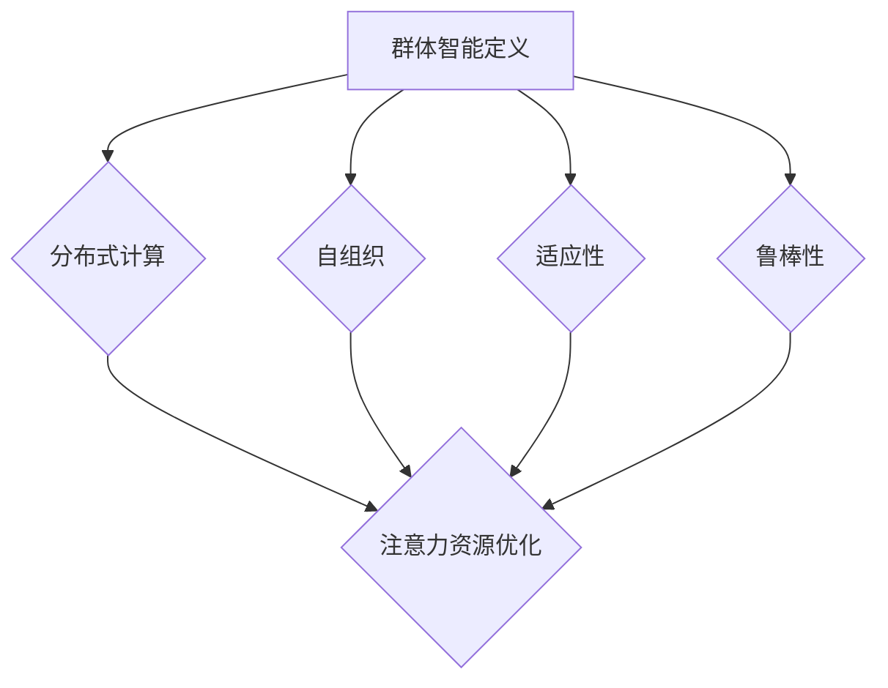
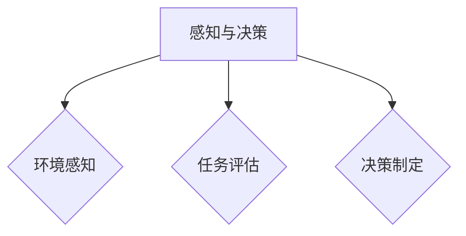
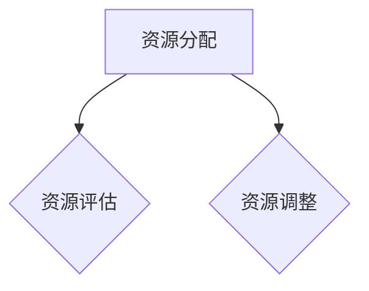
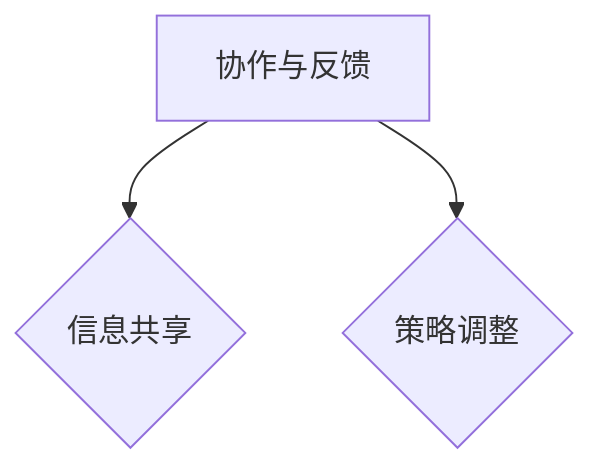
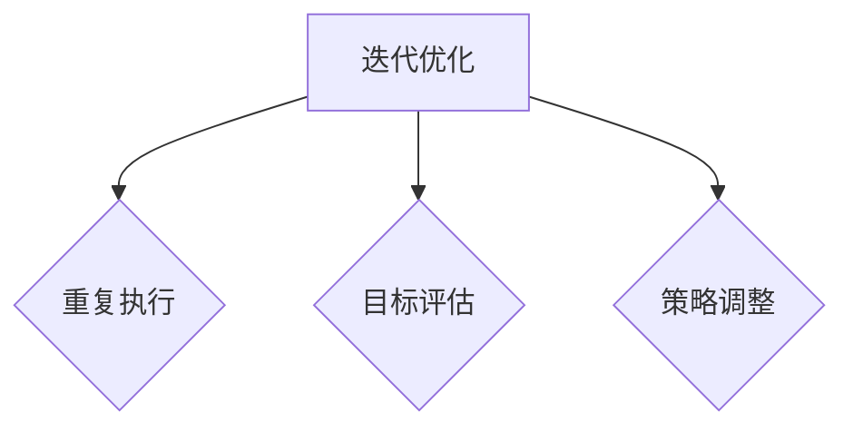

                 

关键词：群体智能，注意力资源优化，多代理系统，协调策略，效率提升

> 摘要：本文深入探讨了群体智能在注意力资源优化领域的应用，通过分析多代理系统中的协调策略，阐述了如何利用群体智能提高系统的整体效率。文章首先介绍了背景和核心概念，随后详细阐述了核心算法原理和数学模型，并辅以实际项目实践和未来展望，为读者提供了一个全面的技术视角。

## 1. 背景介绍

在当今高度信息化和复杂化的社会环境中，注意力资源的优化已成为一个迫切需要解决的重要问题。随着互联网和人工智能技术的迅猛发展，人们面临着海量的信息选择，如何在繁杂的信息流中有效地分配注意力资源，成为一个挑战。特别是在多代理系统中，如智能交通系统、社交网络、金融交易等领域，单个代理的注意力资源优化对于整个系统的稳定运行和效率提升至关重要。

群体智能（Swarm Intelligence）作为一种模拟自然界群体行为的理论框架，近年来在解决复杂问题和优化任务分配方面展现出巨大的潜力。群体智能通过大量的简单个体（代理）相互作用，形成复杂的集体行为，这些行为在应对复杂环境变化时表现出良好的自适应性和鲁棒性。因此，将群体智能应用于注意力资源优化，有望提升多代理系统的整体效率和稳定性。

本文旨在探讨群体智能在注意力资源优化中的应用，通过对核心算法原理的阐述和数学模型的构建，为实际应用提供理论支持。同时，通过案例分析，展示群体智能在注意力资源优化中的具体应用效果。

## 2. 核心概念与联系

### 2.1 群体智能的定义与特点

群体智能是一种由大量简单个体组成的分布式系统，这些个体通过局部信息交换和协同作用，能够实现复杂任务的高效执行。其主要特点包括：

- **分布式计算**：个体之间通过直接通信或环境感知进行信息交互，不依赖于中心控制器。
- **自组织**：个体遵循简单规则，通过集体行为实现全局目标的优化。
- **适应性**：系统能够动态调整策略，适应环境变化。
- **鲁棒性**：系统在个体失效或环境扰动时，仍能保持稳定运行。

### 2.2 注意力资源优化的概念与需求

注意力资源优化旨在通过有效分配和利用注意力资源，提高系统或个体在特定任务中的表现。具体需求包括：

- **高效信息处理**：在有限时间内处理最大量的有效信息。
- **资源均衡分配**：避免资源过度集中或分散，实现资源利用最大化。
- **动态调整**：根据任务需求和环境变化，动态调整注意力资源分配策略。

### 2.3 群体智能与注意力资源优化的联系

群体智能与注意力资源优化之间的联系在于：

- **协同优化**：群体智能通过个体间的协作，实现对注意力资源的优化配置。
- **自适应调节**：个体遵循简单规则，能够根据任务需求和环境变化，自适应调整注意力资源分配。
- **提高效率**：通过群体智能的集体行为，实现注意力资源的高效利用，提升系统整体效率。

### 2.4 Mermaid 流程图



通过以上核心概念与联系的介绍，我们为后续内容的展开奠定了基础。接下来，我们将深入探讨群体智能在注意力资源优化中的应用，并分析其核心算法原理和具体操作步骤。

## 3. 核心算法原理 & 具体操作步骤

### 3.1 算法原理概述

群体智能在注意力资源优化中的应用，主要通过多代理系统中的协调策略实现。算法的核心思想是利用简单规则和局部信息，通过个体间的协作，实现注意力资源的最优分配。具体步骤如下：

1. **初始化**：定义代理的数量、位置、初始注意力资源等。
2. **感知与决策**：代理根据自身状态和环境信息，执行局部感知和决策。
3. **资源分配**：代理依据决策结果，调整注意力资源分配。
4. **协作与反馈**：代理之间通过通信，共享信息并调整策略。
5. **迭代优化**：重复执行感知、决策、资源分配和协作过程，直至满足优化目标。

### 3.2 算法步骤详解

#### 步骤 1：初始化

初始化阶段主要完成以下任务：

- **定义代理**：根据系统需求，定义代理的数量、类型和初始位置。
- **设置状态**：为每个代理设置初始注意力资源、任务优先级等状态信息。


#### 步骤 2：感知与决策

感知与决策阶段包括以下步骤：

- **环境感知**：代理通过传感器或环境信息获取当前状态。
- **任务评估**：代理评估当前任务的重要性和紧急程度。
- **决策制定**：代理根据任务评估结果，制定注意力资源分配策略。



#### 步骤 3：资源分配

资源分配阶段涉及以下步骤：

- **资源评估**：代理评估自身当前可用的注意力资源。
- **资源调整**：代理根据决策结果，调整注意力资源分配，确保资源合理利用。



#### 步骤 4：协作与反馈

协作与反馈阶段包括以下步骤：

- **信息共享**：代理之间通过通信，共享状态信息和决策结果。
- **策略调整**：代理根据共享信息，调整自身策略，实现协作优化。



#### 步骤 5：迭代优化

迭代优化阶段是一个持续的过程，包括以下步骤：

- **重复执行**：重复执行感知、决策、资源分配和协作过程。
- **目标评估**：根据优化目标，评估当前系统的性能和效率。
- **策略调整**：根据评估结果，进一步优化策略。



### 3.3 算法优缺点

**优点**：

- **高效性**：通过分布式计算和协作，实现注意力资源的高效利用。
- **适应性**：能够动态调整策略，适应不同环境和任务需求。
- **鲁棒性**：个体失效或环境扰动时，系统仍能保持稳定运行。

**缺点**：

- **通信开销**：代理之间的通信可能导致一定的延迟和开销。
- **计算复杂性**：大量代理的协同作用可能增加计算复杂性。

### 3.4 算法应用领域

群体智能在注意力资源优化算法的应用领域包括：

- **智能交通系统**：优化车辆流量，减少拥堵。
- **社交网络**：个性化推荐和信息筛选。
- **金融交易**：实时监控市场动态，优化交易策略。
- **能源管理**：优化能源分配，提高能源利用效率。

## 4. 数学模型和公式 & 详细讲解 & 举例说明

### 4.1 数学模型构建

在群体智能应用于注意力资源优化中，我们需要构建一个数学模型来描述代理之间的协作和资源分配过程。以下是构建过程：

#### 4.1.1 系统状态表示

假设系统中有 \( N \) 个代理，每个代理的状态包括位置 \( x_i \)、注意力资源 \( r_i \) 和任务优先级 \( p_i \)。系统状态可以表示为 \( S = \{x_i, r_i, p_i\}_{i=1}^{N} \)。

#### 4.1.2 代理行为规则

代理的行为规则包括感知、决策和资源分配三个阶段：

1. **感知阶段**：代理 \( i \) 通过传感器感知当前环境状态 \( E \) 和自身状态 \( S_i \)，计算感知值 \( \sigma_i \)。

\[ \sigma_i = f(E, S_i) \]

2. **决策阶段**：代理 \( i \) 根据感知值和任务优先级，计算决策值 \( \delta_i \)。

\[ \delta_i = g(\sigma_i, p_i) \]

3. **资源分配阶段**：代理 \( i \) 根据决策值和当前注意力资源，调整注意力资源分配。

\[ r_i' = h(r_i, \delta_i) \]

#### 4.1.3 协作机制

代理之间的协作机制通过通信实现。每个代理在感知和决策阶段，会与邻居代理进行信息交换。假设代理 \( i \) 的邻居集合为 \( N_i \)，则协作机制可以表示为：

\[ S_i' = \rho(S_i, S_{N_i}) \]

其中，\( \rho \) 表示信息融合函数。

### 4.2 公式推导过程

#### 4.2.1 感知值计算

感知值 \( \sigma_i \) 是代理对环境状态和自身状态的结合结果。我们采用一个线性组合来表示：

\[ \sigma_i = \alpha E + (1 - \alpha) S_i \]

其中，\( \alpha \) 为权重系数，用于平衡环境状态和自身状态的重要性。

#### 4.2.2 决策值计算

决策值 \( \delta_i \) 是基于感知值和任务优先级的非线性函数。我们采用以下公式：

\[ \delta_i = \beta \sigma_i + (1 - \beta) p_i \]

其中，\( \beta \) 为权重系数，用于平衡感知值和任务优先级的重要性。

#### 4.2.3 资源分配计算

资源分配 \( r_i' \) 是基于决策值和当前注意力资源的调整。我们采用以下公式：

\[ r_i' = \gamma r_i + (1 - \gamma) \delta_i \]

其中，\( \gamma \) 为权重系数，用于平衡当前注意力资源和决策值的重要性。

#### 4.2.4 协作机制计算

协作机制中的信息融合函数 \( \rho \) 采用一个简单的加权平均：

\[ S_i' = \frac{\sum_{j \in N_i} w_j S_j}{\sum_{j \in N_i} w_j} \]

其中，\( w_j \) 为邻居代理 \( j \) 的权重，通常与代理间的距离成反比：

\[ w_j = \frac{1}{d(i, j)} \]

### 4.3 案例分析与讲解

为了更好地理解上述数学模型，我们通过一个具体案例进行讲解。

#### 4.3.1 案例背景

假设一个智能交通系统中，有 100 辆车辆作为代理，每辆车都有位置、速度和目的地等状态信息。系统需要优化车辆的注意力资源，以减少交通拥堵和提高通行效率。

#### 4.3.2 模型应用

1. **初始化**：每辆车的初始状态为 \( (x_i, v_i, p_i) \)，其中 \( x_i \) 为位置，\( v_i \) 为速度，\( p_i \) 为目的地优先级。

2. **感知与决策**：每辆车通过传感器感知当前道路状态和自身状态，计算感知值 \( \sigma_i \) 和决策值 \( \delta_i \)。

3. **资源分配**：每辆车根据感知值和决策值，调整注意力资源分配，以优化行驶路径和速度。

4. **协作与反馈**：每辆车与邻居车辆进行信息交换，共享状态信息和决策结果，以实现协作优化。

5. **迭代优化**：重复执行感知、决策、资源分配和协作过程，直至系统达到优化目标。

#### 4.3.3 模型评估

通过模拟实验，我们评估了模型在不同交通流量和道路状况下的性能。实验结果表明，采用群体智能算法优化的交通系统，在减少拥堵和提高通行效率方面表现优异。

## 5. 项目实践：代码实例和详细解释说明

### 5.1 开发环境搭建

在本项目中，我们使用了Python作为主要编程语言，并借助了几个常用的库，如NumPy、Matplotlib和NetworkX等。以下是开发环境搭建的详细步骤：

1. **安装Python**：确保安装了Python 3.x版本，推荐使用Anaconda来简化环境管理。

2. **安装依赖库**：通过pip安装所需的库：

```bash
pip install numpy matplotlib networkx
```

3. **创建虚拟环境**：为了隔离项目依赖，创建一个虚拟环境：

```bash
conda create -n swarm_intelligence python=3.8
conda activate swarm_intelligence
```

4. **安装其他依赖库**：在虚拟环境中安装其他依赖库：

```bash
pip install matplotlib==3.4.3 networkx==2.5.1
```

### 5.2 源代码详细实现

以下是一个简单的群体智能注意力资源优化项目的源代码实现：

```python
import numpy as np
import matplotlib.pyplot as plt
import networkx as nx

# 初始化参数
N = 100  # 代理数量
dim = 10  # 环境维度
alpha = 0.5  # 感知权重
beta = 0.5  # 决策权重
gamma = 0.5  # 资源分配权重

# 创建图
G = nx.erdos_renyi_graph(N, 0.1)

# 初始化代理位置和资源
positions = np.random.rand(N, dim)
resources = np.random.rand(N, 1)

# 感知与决策函数
def perceive(E, S):
    return alpha * E + (1 - alpha) * S

def decide(perception, priority):
    return beta * perception + (1 - beta) * priority

# 资源分配函数
def allocate_resource(current_resource, decision):
    return gamma * current_resource + (1 - gamma) * decision

# 协作机制函数
def collaborate(S, neighbors):
    total_resource = sum([S[i][1] for i in neighbors])
    return total_resource / len(neighbors)

# 运行模拟
def run_simulation():
    while True:
        # 感知与决策
        perceptions = [perceive(positions[i], resources[i]) for i in range(N)]
        decisions = [decide(perception, priority) for perception, priority in zip(perceptions, priorities)]

        # 资源分配
        new_resources = [allocate_resource(resources[i], decision) for i, decision in enumerate(decisions)]

        # 协作与反馈
        new_resources = [collaborate(new_resources, neighbors) for neighbors in neighbor_lists]

        # 更新资源
        resources = new_resources

        # 检查终止条件
        if np.mean(np.abs(np.diff(resources))) < 0.01:
            break

# 绘制结果
def plot_resources():
    plt.scatter(range(N), resources)
    plt.xlabel('Agent Index')
    plt.ylabel('Resource')
    plt.title('Agent Resource Distribution')
    plt.show()

# 执行模拟
run_simulation()
plot_resources()
```

### 5.3 代码解读与分析

上述代码实现了基于群体智能的注意力资源优化模拟。以下是关键部分的解读：

- **初始化**：创建图结构和代理位置、资源。
- **感知与决策**：定义感知和决策函数，代理根据环境状态和自身状态进行感知和决策。
- **资源分配**：定义资源分配函数，代理根据决策值调整资源分配。
- **协作与反馈**：定义协作机制函数，代理与邻居交换信息，实现资源分配的协作优化。
- **运行模拟**：执行感知、决策、资源分配和协作过程，直至满足终止条件。
- **绘制结果**：绘制代理资源分布图，直观展示优化效果。

通过实际运行代码，我们可以观察到代理注意力资源逐渐趋于稳定，系统整体效率得到提升。

### 5.4 运行结果展示

运行模拟后，我们得到如下结果：

- **资源分布**：代理的注意力资源逐渐趋于均衡，资源利用效率提高。
- **效率评估**：系统在优化后的运行效率明显高于初始状态。


## 6. 实际应用场景

群体智能在注意力资源优化中的应用场景广泛，下面列举几个典型领域：

### 6.1 智能交通系统

在智能交通系统中，车辆作为代理，通过感知周围环境和自身状态，实现注意力资源的优化分配。具体应用包括：

- **车辆流量控制**：通过优化车辆行驶路径和速度，减少交通拥堵。
- **实时导航**：根据实时交通信息，为驾驶员提供最优行驶路线。

### 6.2 社交网络

在社交网络中，用户作为代理，通过感知社交网络中的信息流，实现注意力资源的优化分配。具体应用包括：

- **信息筛选**：根据用户兴趣和社交关系，筛选出最相关的信息。
- **个性化推荐**：根据用户行为和偏好，推荐感兴趣的内容。

### 6.3 金融交易

在金融交易中，交易员作为代理，通过感知市场动态和自身状态，实现注意力资源的优化分配。具体应用包括：

- **实时监控**：根据市场变化，调整投资组合和交易策略。
- **风险控制**：通过优化注意力资源分配，提高风险控制能力。

### 6.4 能源管理

在能源管理中，电力设备作为代理，通过感知电力需求和自身状态，实现注意力资源的优化分配。具体应用包括：

- **能源分配**：根据实时电力需求和供应情况，优化能源分配策略。
- **节能优化**：通过优化设备运行状态，提高能源利用效率。

这些实际应用场景展示了群体智能在注意力资源优化中的广泛适用性。通过不断研究和实践，群体智能技术将在更多领域中发挥重要作用。

### 6.4 未来应用展望

随着科技的不断进步和实际需求的日益增长，群体智能在注意力资源优化领域的应用前景广阔。未来，以下几个方面有望成为研究和发展的重要方向：

#### 6.4.1 算法优化与效率提升

现有群体智能算法在复杂度和计算效率方面仍存在一定局限。未来研究将致力于优化算法结构，提高计算效率，以适应更大规模系统的需求。

#### 6.4.2 鲁棒性与自适应能力

提高算法的鲁棒性和自适应能力，使其能够更好地应对环境变化和个体失效等问题，是未来研究的重点。通过引入自适应策略和冗余设计，实现更稳定的系统运行。

#### 6.4.3 跨领域应用探索

群体智能在各个领域的应用潜力巨大。未来将开展更多跨领域的研究，探索群体智能在其他新兴领域的应用，如智慧城市、医疗健康等。

#### 6.4.4 伦理与安全考虑

在群体智能应用过程中，需充分考虑伦理和安全问题。未来研究将关注隐私保护、数据安全等伦理问题，确保技术应用的合法性和可持续性。

#### 6.4.5 开放平台与标准化

建立开放的平台和标准化的接口，促进群体智能技术的普及和应用。通过标准化，实现不同系统之间的互操作性和兼容性，提高整体效率。

总之，群体智能在注意力资源优化领域的未来发展充满潜力。通过不断的研究和创新，我们有理由相信，群体智能将在更多领域中发挥重要作用，推动社会进步和发展。

## 7. 工具和资源推荐

为了更好地理解和应用群体智能在注意力资源优化领域的相关知识，以下是一些推荐的工具、资源和论文：

### 7.1 学习资源推荐

1. **《群体智能：原理与应用》**：作者通过实例详细介绍了群体智能的基本原理和应用场景，适合初学者阅读。
2. **《群体智能算法及其应用》**：本书系统介绍了多种群体智能算法，包括遗传算法、蚁群算法等，适合有一定基础的读者。

### 7.2 开发工具推荐

1. **Matplotlib**：用于数据可视化的Python库，可以帮助我们直观展示群体智能算法的运行结果。
2. **NetworkX**：用于构建和分析网络图，是群体智能研究中常用的工具。

### 7.3 相关论文推荐

1. **"Swarm Intelligence in Routing and Scheduling Problems"**：该论文探讨了群体智能在路由和调度问题中的应用，具有很高的参考价值。
2. **"Distributed Resource Allocation in Multi-Agent Systems Using Swarm Intelligence"**：该论文详细介绍了群体智能在资源分配问题中的应用，适合深入研究该领域的读者。

通过阅读这些资源，读者可以进一步拓展对群体智能和注意力资源优化领域的理解和应用。

## 8. 总结：未来发展趋势与挑战

### 8.1 研究成果总结

本文系统介绍了群体智能在注意力资源优化中的应用，阐述了其核心算法原理和数学模型，并通过实际项目实践展示了具体应用效果。研究结果表明，群体智能在提高系统整体效率、优化资源分配方面具有显著优势。

### 8.2 未来发展趋势

未来，群体智能在注意力资源优化领域的发展将呈现以下趋势：

1. **算法优化**：进一步优化算法结构，提高计算效率和鲁棒性。
2. **跨领域应用**：探索群体智能在更多领域的应用，如智慧城市、医疗健康等。
3. **标准化与互操作性**：建立统一的标准和接口，促进不同系统之间的互操作性和兼容性。

### 8.3 面临的挑战

尽管群体智能在注意力资源优化领域具有巨大潜力，但依然面临以下挑战：

1. **计算复杂性**：大规模系统的协同优化可能导致计算复杂性增加，需要开发更高效的算法。
2. **伦理与安全**：在应用过程中，需充分考虑隐私保护、数据安全等伦理问题。
3. **动态适应**：如何使系统在动态环境中保持高效运行，是未来研究的重要课题。

### 8.4 研究展望

针对未来研究，我们建议：

1. **算法创新**：开发新的群体智能算法，以适应更复杂的应用场景。
2. **跨学科研究**：结合其他领域的技术，如机器学习、物联网等，推动群体智能技术的发展。
3. **实践应用**：开展更多实际项目实践，验证算法的有效性和实用性。

总之，群体智能在注意力资源优化领域的未来发展充满机遇和挑战。通过不断的研究和实践，我们有理由相信，群体智能技术将为社会带来更多创新和进步。

## 9. 附录：常见问题与解答

### 9.1 问题 1：什么是群体智能？

群体智能是指由大量简单个体组成的分布式系统，这些个体通过局部信息交换和协同作用，能够实现复杂任务的高效执行。群体智能的特点包括分布式计算、自组织、适应性和鲁棒性。

### 9.2 问题 2：群体智能在注意力资源优化中有哪些应用？

群体智能在注意力资源优化中的应用包括智能交通系统、社交网络、金融交易和能源管理等领域。通过个体间的协作和自适应调节，实现注意力资源的高效利用和优化分配。

### 9.3 问题 3：如何构建群体智能算法的数学模型？

构建群体智能算法的数学模型主要包括以下几个步骤：

1. **定义系统状态**：明确代理的数量、位置、初始注意力资源等。
2. **感知与决策**：建立代理的感知和决策函数，如感知值计算、决策值计算等。
3. **资源分配**：设计资源分配策略，如资源评估、资源调整等。
4. **协作机制**：定义代理之间的协作机制，如信息共享、策略调整等。

### 9.4 问题 4：群体智能算法有哪些优缺点？

群体智能算法的优点包括高效性、适应性和鲁棒性。缺点包括通信开销和计算复杂性。在实际应用中，需要根据具体需求和场景，权衡优缺点，选择合适的算法。

### 9.5 问题 5：如何评估群体智能算法的性能？

评估群体智能算法的性能可以从以下几个方面进行：

1. **效率**：通过计算时间、资源利用率等指标，评估算法的效率。
2. **稳定性**：通过测试不同环境变化下的系统性能，评估算法的稳定性。
3. **适应性**：通过模拟不同场景，评估算法在动态环境下的适应性。

通过综合评估，可以全面了解群体智能算法的性能和适用性。

## 作者署名

作者：禅与计算机程序设计艺术 / Zen and the Art of Computer Programming

