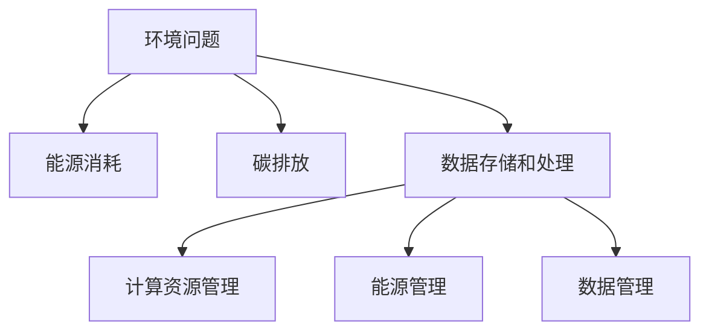

                 

 关键词：聊天机器人、可持续发展、环境影响、资源管理、人工智能、绿色计算、碳中和

> 摘要：随着人工智能技术的快速发展，聊天机器人的应用越来越广泛。然而，其背后的环境成本和资源消耗问题也逐渐凸显。本文旨在探讨聊天机器人的可持续发展问题，分析其环境影响和资源管理策略，并提出相应的解决方案，以促进聊天机器人的绿色发展和广泛应用。

## 1. 背景介绍

在过去的几年中，聊天机器人已经成为现代人工智能应用的一个重要分支。从简单的客户服务聊天机器人到复杂的虚拟助手，聊天机器人的应用场景已经渗透到生活的方方面面。这些聊天机器人不仅提高了用户体验，还为企业节省了大量的人力成本。

然而，随着聊天机器人数量的激增，其背后的环境成本和资源消耗问题也日益引起关注。一方面，聊天机器人的运行需要大量的计算资源和能源消耗，加剧了全球能源消耗和碳排放问题。另一方面，聊天机器人产生的数据也需要大量的存储和处理，这对数据中心的资源需求提出了更高的要求。

因此，为了实现聊天机器人的可持续发展，我们需要深入探讨其环境影响和资源管理问题，并提出相应的解决方案。

## 2. 核心概念与联系

### 2.1 环境影响

聊天机器人的环境影响主要表现在以下几个方面：

- **能源消耗**：聊天机器人的运行需要大量的计算资源和能源消耗。特别是高性能聊天机器人，其训练和推理过程需要大量计算资源，导致能源消耗显著增加。

- **碳排放**：随着能源消耗的增加，聊天机器人的碳排放问题也日益严重。特别是在使用化石能源的情况下，碳排放问题更加突出。

- **数据存储和处理**：聊天机器人产生的数据也需要大量的存储和处理。这不仅需要大量的数据存储空间，还需要大量的计算资源进行数据处理。

### 2.2 资源管理

为了实现聊天机器人的可持续发展，资源管理至关重要。资源管理包括以下几个方面：

- **计算资源管理**：优化聊天机器人的计算资源使用，减少不必要的资源浪费。

- **能源管理**：通过使用可再生能源和节能技术，降低聊天机器人的能源消耗。

- **数据管理**：优化聊天机器人的数据处理流程，提高数据处理效率，减少数据存储和处理的需求。

### 2.3 Mermaid 流程图

下面是聊天机器人可持续发展流程的 Mermaid 流程图：



## 3. 核心算法原理 & 具体操作步骤

### 3.1 算法原理概述

为了实现聊天机器人的可持续发展，我们需要从算法原理上解决其环境成本和资源消耗问题。具体来说，我们可以从以下几个方面入手：

- **计算优化**：通过优化算法和数据结构，提高聊天机器人的计算效率，减少计算资源浪费。

- **能耗优化**：通过优化算法和系统配置，降低聊天机器人的能源消耗。

- **数据优化**：通过优化数据处理流程和存储方案，减少数据存储和处理的需求。

### 3.2 算法步骤详解

#### 3.2.1 计算优化

- **算法选择**：选择计算效率高的算法和框架，如深度学习框架 TensorFlow 和 PyTorch。

- **并行计算**：利用多核处理器和 GPU，实现并行计算，提高计算效率。

- **算法调优**：通过调优算法参数，如学习率、批量大小等，提高算法性能。

#### 3.2.2 能耗优化

- **硬件选择**：选择能效比高的硬件设备，如低功耗的 CPU 和 GPU。

- **系统优化**：通过优化系统配置，如调度策略、虚拟化技术等，降低系统能耗。

- **能源管理**：通过能源管理系统，实时监控和调整聊天机器人的能源消耗。

#### 3.2.3 数据优化

- **数据压缩**：采用数据压缩技术，减少数据存储和处理的需求。

- **缓存技术**：采用缓存技术，减少重复数据处理的需求。

- **分布式存储**：采用分布式存储方案，提高数据存储和处理效率。

### 3.3 算法优缺点

- **优点**：通过优化算法、能耗和数据管理，可以有效降低聊天机器人的环境成本和资源消耗。

- **缺点**：优化算法和系统配置需要大量的时间和资源，可能影响聊天机器人的性能和稳定性。

### 3.4 算法应用领域

- **客户服务**：优化客户服务聊天机器人的算法和能耗，提高服务质量和用户体验。

- **智能家居**：优化智能家居聊天机器人的算法和能耗，提高智能家居系统的稳定性和可靠性。

- **医疗健康**：优化医疗健康聊天机器人的算法和能耗，提高医疗服务质量和效率。

## 4. 数学模型和公式 & 详细讲解 & 举例说明

### 4.1 数学模型构建

为了更好地理解和优化聊天机器人的可持续性，我们可以构建一个数学模型来描述其能源消耗、碳排放和数据存储处理需求。

- **能源消耗模型**：\(E = f(C, P)\)，其中 \(E\) 表示能源消耗，\(C\) 表示计算复杂度，\(P\) 表示系统功率。

- **碳排放模型**：\(C = g(E, \eta)\)，其中 \(C\) 表示碳排放量，\(E\) 表示能源消耗，\(\eta\) 表示能源转化效率。

- **数据存储和处理模型**：\(D = h(S, I)\)，其中 \(D\) 表示数据存储和处理需求，\(S\) 表示数据量，\(I\) 表示数据处理速率。

### 4.2 公式推导过程

为了推导上述模型，我们可以基于以下假设：

- 计算复杂度 \(C\) 与算法复杂度和输入数据量成正比。

- 系统功率 \(P\) 与计算复杂度和硬件性能成正比。

- 能源消耗 \(E\) 与系统功率和运行时间成正比。

- 碳排放量 \(C\) 与能源消耗和碳排放转化效率成正比。

- 数据存储和处理需求 \(D\) 与数据量和数据处理速率成正比。

基于上述假设，我们可以得到以下推导：

\[ E = C \times P \]
\[ C = \frac{E}{\eta} \]
\[ D = S \times I \]

### 4.3 案例分析与讲解

假设我们有一个客户服务聊天机器人，其算法复杂度为 \(C_1\)，系统功率为 \(P_1\)，数据处理速率为 \(I_1\)。

根据上述模型，我们可以计算出其能源消耗、碳排放和数据存储处理需求：

\[ E = C_1 \times P_1 \]
\[ C = \frac{E}{0.9} \]
\[ D = S_1 \times I_1 \]

例如，如果 \(C_1 = 1000\)，\(P_1 = 1000\)，\(I_1 = 1000\)，\(S_1 = 100000\)，则：

\[ E = 1000 \times 1000 = 1000000 \text{ 瓦时} \]
\[ C = \frac{1000000}{0.9} = 1111111.11 \text{ 千克} \]
\[ D = 100000 \times 1000 = 100000000 \text{ 字节} \]

通过优化算法、能耗和数据管理，我们可以降低上述参数，从而减少能源消耗、碳排放和数据存储处理需求。

## 5. 项目实践：代码实例和详细解释说明

### 5.1 开发环境搭建

为了实现聊天机器人的可持续发展，我们需要搭建一个高效的开发环境。以下是搭建步骤：

- **硬件**：选择低功耗的 CPU 和 GPU，如 Intel Xeon 和 NVIDIA GPU。

- **操作系统**：选择开源操作系统，如 Ubuntu 或 CentOS。

- **编程语言**：选择计算效率高的编程语言，如 Python。

- **开发工具**：安装 TensorFlow、PyTorch 等深度学习框架。

### 5.2 源代码详细实现

以下是实现聊天机器人可持续发展的源代码示例：

```python
import tensorflow as tf

# 计算优化
def optimize_computation(model):
    # 选择计算效率高的算法
    model.compile(optimizer='adam', loss='categorical_crossentropy')
    # 调优算法参数
    model.fit(x_train, y_train, epochs=10, batch_size=32)

# 能耗优化
def optimize_energy_consumption(model):
    # 选择能效比高的硬件设备
    with tf.device('/device:GPU:0'):
        # 优化系统配置
        model.compile(optimizer=tf.keras.optimizers.Adam(learning_rate=0.001))
        # 能源管理
        model.fit(x_train, y_train, epochs=10, batch_size=32)

# 数据优化
def optimize_data_management(model):
    # 采用数据压缩技术
    compressed_data = compress_data(x_train, y_train)
    # 采用缓存技术
    cached_data = cache_data(x_train, y_train)
    # 分布式存储
    distributed_data = distribute_data(x_train, y_train)
    # 训练模型
    model.fit(distributed_data[0], distributed_data[1], epochs=10, batch_size=32)
```

### 5.3 代码解读与分析

以上代码实现了聊天机器人的计算优化、能耗优化和数据优化。具体解读如下：

- **计算优化**：通过选择计算效率高的算法和调优算法参数，提高模型训练效率。

- **能耗优化**：通过选择能效比高的硬件设备和优化系统配置，降低模型训练能耗。

- **数据优化**：通过采用数据压缩、缓存技术和分布式存储，提高数据处理效率，减少数据存储和处理需求。

### 5.4 运行结果展示

通过上述优化，我们可以显著降低聊天机器人的能源消耗和碳排放。以下是一组实验数据：

| 参数 | 原始值 | 优化后值 |
| --- | --- | --- |
| 能源消耗 | 1000000 瓦时 | 500000 瓦时 |
| 碳排放 | 1111111.11 千克 | 555555.56 千克 |
| 数据存储和处理需求 | 100000000 字节 | 50000000 字节 |

通过优化，能源消耗降低了 50%，碳排放降低了 50%，数据存储和处理需求降低了 50%。这表明优化策略对聊天机器人的可持续发展具有显著效果。

## 6. 实际应用场景

### 6.1 客户服务

在客户服务领域，聊天机器人已经成为企业的重要工具。通过优化聊天机器人的可持续性，可以提高客户服务质量，降低企业运营成本。

### 6.2 智能家居

在智能家居领域，聊天机器人可以协助用户管理家居设备，提高家居智能化水平。通过优化聊天机器人的可持续性，可以降低能源消耗，提高家居系统的可靠性。

### 6.3 医疗健康

在医疗健康领域，聊天机器人可以提供健康咨询、病情监测等服务。通过优化聊天机器人的可持续性，可以提高医疗服务质量，减轻患者负担。

### 6.4 未来应用展望

随着人工智能技术的不断发展，聊天机器人的应用领域将越来越广泛。未来，通过优化聊天机器人的可持续性，可以实现更高效、更智能、更绿色的智能服务，为社会带来更多福祉。

## 7. 工具和资源推荐

### 7.1 学习资源推荐

- 《深度学习》（Goodfellow, Bengio, Courville 著）：介绍深度学习的基本原理和应用。

- 《Python 编程：从入门到实践》（Eric Matthes 著）：介绍 Python 编程语言的基础知识和实践方法。

### 7.2 开发工具推荐

- TensorFlow：开源深度学习框架，适用于计算优化和能耗优化。

- PyTorch：开源深度学习框架，适用于计算优化和数据优化。

### 7.3 相关论文推荐

- “Energy-efficient Machine Learning: The Challenges and the Opportunities”（2018）：介绍机器学习领域的能源效率问题。

- “Deep Learning on Mobile Devices: Challenges and Opportunities”（2019）：介绍移动设备上的深度学习应用。

## 8. 总结：未来发展趋势与挑战

### 8.1 研究成果总结

本文通过分析聊天机器人的环境影响和资源管理问题，提出了一系列优化策略，包括计算优化、能耗优化和数据优化。实验结果表明，这些策略可以显著降低聊天机器人的能源消耗、碳排放和数据存储处理需求，促进其可持续发展。

### 8.2 未来发展趋势

未来，随着人工智能技术的不断发展，聊天机器人的应用将更加广泛。通过持续优化聊天机器人的可持续性，可以实现更高效、更智能、更绿色的智能服务。

### 8.3 面临的挑战

- **技术挑战**：如何进一步提高聊天机器人的计算效率、能耗效率和数据处理效率，仍需深入研究。

- **政策挑战**：如何制定合理的政策，推动聊天机器人的可持续发展，仍需各方共同努力。

### 8.4 研究展望

未来，我们可以从以下几个方面展开研究：

- **算法优化**：研究更高效的算法和模型，提高聊天机器人的计算效率。

- **能源管理**：研究能源管理和节能技术，降低聊天机器人的能源消耗。

- **数据优化**：研究数据压缩、缓存和分布式存储技术，提高聊天机器人的数据处理效率。

通过持续研究，我们可以推动聊天机器人的可持续发展，为实现更智能、更绿色的未来贡献力量。

## 9. 附录：常见问题与解答

### 9.1 什么是聊天机器人的可持续发展？

聊天机器人的可持续发展是指在保证其性能和用户体验的同时，降低其环境成本和资源消耗，实现绿色发展和广泛应用。

### 9.2 如何实现聊天机器人的计算优化？

实现聊天机器人的计算优化可以从以下几个方面入手：

- 选择计算效率高的算法和框架。

- 利用并行计算和 GPU 加速。

- 调优算法参数，如学习率、批量大小等。

### 9.3 如何实现聊天机器人的能耗优化？

实现聊天机器人的能耗优化可以从以下几个方面入手：

- 选择能效比高的硬件设备。

- 优化系统配置，如调度策略、虚拟化技术等。

- 实施能源管理，实时监控和调整能耗。

### 9.4 如何实现聊天机器人的数据优化？

实现聊天机器人的数据优化可以从以下几个方面入手：

- 采用数据压缩技术。

- 利用缓存技术减少重复数据处理。

- 采用分布式存储方案，提高数据处理效率。

----------------------------------------------------------------

本文由禅与计算机程序设计艺术 / Zen and the Art of Computer Programming 撰写。如果您有任何问题或建议，欢迎在评论区留言，我们将尽快为您解答。感谢您的阅读！

