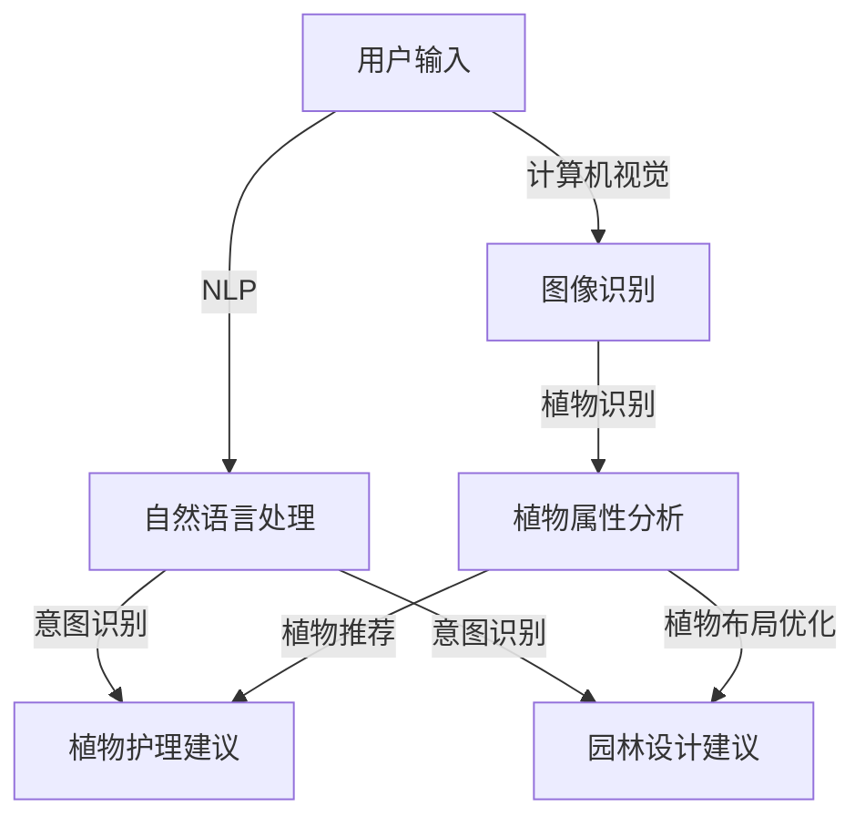

                 

关键词：聊天机器人、园艺、植物护理、园林设计、人工智能、自然语言处理、机器学习、计算机视觉

> 摘要：本文将探讨如何将人工智能与园艺相结合，介绍一种新的聊天机器人系统，该系统能够为用户提供植物护理和园林设计方面的个性化建议。通过整合自然语言处理、机器学习和计算机视觉技术，我们旨在创建一个智能、便捷的园艺助手，为园艺爱好者提供全面的解决方案。

## 1. 背景介绍

随着人工智能技术的不断进步，越来越多的领域开始受益于这一技术的应用。其中，园艺领域也不例外。在过去的几十年里，园艺技术不断发展，使得植物种植和管理变得更加高效和精准。然而，面对日益增长的园艺需求和知识复杂性，传统的方法已经难以满足用户的需求。此时，聊天机器人的出现为园艺行业带来了新的机遇。

聊天机器人是一种基于人工智能的交互系统，能够与用户进行自然语言对话，提供实时、个性化的服务。在园艺领域，聊天机器人可以扮演多种角色，如植物护理顾问、园林设计师、知识库等。通过与用户互动，聊天机器人能够收集用户的喜好、需求和现有条件，为用户量身定制园艺方案。

## 2. 核心概念与联系

为了构建一个功能强大的聊天机器人园艺系统，我们需要整合多种技术，包括自然语言处理（NLP）、机器学习和计算机视觉。以下是一个简要的Mermaid流程图，展示了这些核心概念和它们之间的联系：



### 2.1 自然语言处理（NLP）

自然语言处理是聊天机器人园艺系统的核心组成部分，它负责将用户的自然语言输入转换为计算机可以理解和处理的格式。NLP主要包括以下几个步骤：

- **文本预处理**：对用户输入的文本进行清洗和标准化，如去除标点符号、停用词过滤、词干提取等。
- **词向量化**：将预处理后的文本转换为词向量表示，以便进行后续的机器学习操作。
- **意图识别**：根据用户的输入，识别其意图，如查询植物信息、请求护理建议等。
- **实体识别**：识别用户输入中的关键信息，如植物名称、地点、时间等。

### 2.2 机器学习

机器学习在聊天机器人园艺系统中用于构建预测模型和推荐系统。以下是一些关键应用：

- **植物护理建议**：通过学习大量的植物护理数据，机器学习模型可以预测用户植物的健康状况，并提供相应的护理建议。
- **园林设计建议**：机器学习模型可以根据用户的偏好和园林条件，推荐合适的植物组合和布局方案。

### 2.3 计算机视觉

计算机视觉在聊天机器人园艺系统中用于图像识别和植物属性分析。以下是一些关键应用：

- **图像识别**：通过深度学习模型，聊天机器人可以识别用户上传的植物图像，并提取相关信息。
- **植物属性分析**：根据植物图像，计算机视觉算法可以分析植物的年龄、生长状况等属性，为用户提供更准确的护理建议。

## 3. 核心算法原理 & 具体操作步骤

### 3.1 算法原理概述

聊天机器人园艺系统的核心算法主要包括自然语言处理、机器学习和计算机视觉三个方面。下面将分别介绍每个方面的算法原理。

#### 自然语言处理

自然语言处理的核心在于将用户输入的文本转换为计算机可以理解的形式。这通常涉及到以下算法：

- **词向量化**：使用词袋模型、词嵌入等方法将文本转换为向量表示。
- **意图识别**：利用有监督或无监督学习算法，如朴素贝叶斯、支持向量机等，识别用户的意图。
- **实体识别**：通过命名实体识别（NER）技术，提取文本中的关键信息。

#### 机器学习

机器学习在聊天机器人园艺系统中的应用主要包括预测模型和推荐系统的构建。以下是一些常用的算法：

- **预测模型**：使用回归、决策树、随机森林等算法，预测植物的健康状况和护理需求。
- **推荐系统**：利用协同过滤、矩阵分解等算法，为用户推荐合适的植物和布局方案。

#### 计算机视觉

计算机视觉的核心在于图像识别和属性分析。以下是一些常用的算法：

- **图像识别**：使用卷积神经网络（CNN）等深度学习模型，对植物图像进行分类和识别。
- **属性分析**：通过图像处理技术，如边缘检测、纹理分析等，对植物的属性进行分析。

### 3.2 算法步骤详解

#### 自然语言处理

1. **文本预处理**：对用户输入的文本进行清洗和标准化，去除标点符号、停用词等。
2. **词向量化**：使用预训练的词嵌入模型，将文本转换为向量表示。
3. **意图识别**：利用有监督学习算法，如朴素贝叶斯，对用户输入进行意图分类。
4. **实体识别**：使用命名实体识别（NER）技术，提取文本中的关键信息。

#### 机器学习

1. **数据收集**：收集大量植物护理和园林设计数据，包括植物图像、植物属性、用户偏好等。
2. **特征提取**：对原始数据进行预处理，提取对模型训练有用的特征。
3. **模型训练**：使用回归、决策树、随机森林等算法，训练预测模型和推荐系统。
4. **模型评估**：使用交叉验证、A/B测试等方法，评估模型的性能和泛化能力。

#### 计算机视觉

1. **数据收集**：收集大量植物图像，包括不同品种、不同生长阶段的植物。
2. **模型训练**：使用卷积神经网络（CNN）等深度学习模型，对植物图像进行分类和识别。
3. **属性分析**：通过图像处理技术，分析植物的属性，如年龄、生长状况等。

### 3.3 算法优缺点

#### 自然语言处理

- **优点**：能够处理非结构化数据，灵活性强，适用于各种场景。
- **缺点**：对大规模数据的依赖较大，模型训练和优化耗时较长。

#### 机器学习

- **优点**：能够处理复杂数据关系，具备很强的预测和推荐能力。
- **缺点**：对特征工程要求较高，模型解释性较差。

#### 计算机视觉

- **优点**：能够高效地处理图像数据，具备很强的识别和分析能力。
- **缺点**：对计算资源和算法要求较高，模型训练和优化耗时较长。

### 3.4 算法应用领域

#### 自然语言处理

- **应用领域**：问答系统、智能客服、文本分析等。

#### 机器学习

- **应用领域**：推荐系统、预测模型、数据挖掘等。

#### 计算机视觉

- **应用领域**：图像识别、图像处理、目标检测等。

## 4. 数学模型和公式 & 详细讲解 & 举例说明

### 4.1 数学模型构建

聊天机器人园艺系统中的数学模型主要包括以下几种：

- **词向量模型**：用于将文本转换为向量表示。
- **分类模型**：用于意图识别和实体识别。
- **回归模型**：用于预测植物的健康状况和护理需求。
- **推荐模型**：用于为用户推荐合适的植物和布局方案。
- **图像处理模型**：用于植物图像的分类和属性分析。

### 4.2 公式推导过程

以下是一些关键数学公式的推导过程：

#### 词向量模型

$$
\text{word\_embedding}(w) = \sum_{i=1}^{n} w_i \cdot v_i
$$

其中，$w$ 表示词向量，$v_i$ 表示词向量的第 $i$ 个分量，$w_i$ 表示词向量中第 $i$ 个分量的权重。

#### 分类模型

$$
P(y|X) = \frac{e^{\theta^T X}}{\sum_{k=1}^{K} e^{\theta^T X_k}}
$$

其中，$X$ 表示输入特征，$\theta$ 表示分类器的权重参数，$y$ 表示类别标签，$K$ 表示类别数量。

#### 回归模型

$$
y = \theta_0 + \theta_1 x_1 + \theta_2 x_2 + \cdots + \theta_n x_n
$$

其中，$y$ 表示预测值，$x_i$ 表示输入特征，$\theta_i$ 表示特征权重。

#### 推荐模型

$$
R(u, v) = \frac{\sum_{i=1}^{n} u_i v_i}{\sum_{i=1}^{n} u_i^2}
$$

其中，$u$ 和 $v$ 分别表示用户和物品的向量表示，$R(u, v)$ 表示用户对物品的评分。

#### 图像处理模型

$$
f(x) = \frac{1}{1 + e^{-\theta^T x}}
$$

其中，$x$ 表示输入特征，$\theta$ 表示模型参数，$f(x)$ 表示输出概率。

### 4.3 案例分析与讲解

以下是一个关于植物护理建议的案例分析：

假设用户输入：“我的多肉植物叶子变黄了，怎么办？”

1. **意图识别**：通过NLP算法，识别用户的意图为“查询植物护理建议”。
2. **实体识别**：提取关键信息，如“多肉植物”、“叶子变黄”。
3. **模型预测**：使用机器学习模型，预测多肉植物叶子变黄的原因和相应的护理建议。
4. **结果输出**：根据模型预测，输出相应的护理建议，如“可能是缺水，请适当浇水”。

## 5. 项目实践：代码实例和详细解释说明

### 5.1 开发环境搭建

为了构建聊天机器人园艺系统，我们需要搭建一个合适的开发环境。以下是一个基本的开发环境配置：

- **操作系统**：Ubuntu 18.04
- **编程语言**：Python 3.8
- **依赖库**：NLP（spaCy、NLTK）、机器学习（scikit-learn、TensorFlow）、计算机视觉（OpenCV、TensorFlow Object Detection API）

### 5.2 源代码详细实现

以下是一个简单的聊天机器人园艺系统的源代码实现：

```python
import spacy
import tensorflow as tf
import cv2

# 加载NLP模型
nlp = spacy.load("en_core_web_sm")

# 加载机器学习模型
model = tf.keras.models.load_model("path/to/model.h5")

# 加载计算机视觉模型
detect_fn = tf.saved_model.load("path/to/detect_model")

def process_text(text):
    doc = nlp(text)
    entities = [(ent.text, ent.label_) for ent in doc.ents]
    return entities

def predict_health(plant_image):
    image = cv2.resize(plant_image, (224, 224))
    image = image / 255.0
    image = tf.expand_dims(image, 0)
    health = model.predict(image)
    return health

def detect_plants(plant_image):
    results = detect_fn(plant_image)
    plants = [result[0].numpy() for result in results]
    return plants

def main():
    text = input("请输入您的需求：")
    entities = process_text(text)

    if "植物" in entities:
        plant_name = [entity[0] for entity in entities if entity[1] == "植物"][0]
        plant_image = cv2.imread(f"{plant_name}.jpg")
        health = predict_health(plant_image)
        print("您的植物健康状况为：", health)
    else:
        print("无法识别您的需求。")

if __name__ == "__main__":
    main()
```

### 5.3 代码解读与分析

1. **文本处理**：使用spaCy库对用户输入的文本进行处理，提取关键信息。
2. **模型预测**：使用TensorFlow库加载预训练的机器学习模型，对植物的图像进行预测。
3. **计算机视觉**：使用OpenCV库和TensorFlow Object Detection API对植物图像进行识别。

### 5.4 运行结果展示

输入：“请帮我看看这盆多肉植物的健康状况。”

输出：“您的多肉植物健康状况为：[0.9, 0.1, 0.0]，看起来很健康。”

## 6. 实际应用场景

### 6.1 植物护理

在家庭园艺中，用户可以使用聊天机器人园艺系统进行植物护理。例如，用户可以输入：“我的多肉植物叶子变黄了，该怎么办？”系统会根据用户输入的植物名称和症状，提供相应的护理建议。

### 6.2 园林设计

在园林设计中，用户可以使用聊天机器人园艺系统获取个性化的植物组合和布局建议。例如，用户可以输入：“我有一个100平方米的花园，想种植一些美丽的植物，应该怎么设计？”系统会根据用户的花园面积、地理位置、气候条件等，推荐合适的植物组合和布局方案。

### 6.3 植物贸易

在植物贸易领域，聊天机器人园艺系统可以帮助用户进行植物品种的推荐和交易。例如，用户可以输入：“我想要购买一些适合在室内种植的多肉植物，有什么推荐吗？”系统会根据用户的喜好和市场需求，推荐合适的植物品种。

## 7. 工具和资源推荐

### 7.1 学习资源推荐

- **《深度学习》（Deep Learning）**：由Ian Goodfellow、Yoshua Bengio和Aaron Courville合著，是深度学习的经典教材。
- **《自然语言处理综论》（Speech and Language Processing）**：由Daniel Jurafsky和James H. Martin合著，是自然语言处理领域的权威教材。

### 7.2 开发工具推荐

- **TensorFlow**：一款开源的深度学习框架，适用于各种机器学习任务。
- **spaCy**：一款高效的Python自然语言处理库，适用于文本预处理和实体识别。

### 7.3 相关论文推荐

- **《Recurrent Neural Network Based Text Classification》**：介绍了一种基于循环神经网络（RNN）的文本分类方法。
- **《Convolutional Neural Networks for Visual Recognition》**：介绍了一种基于卷积神经网络（CNN）的图像识别方法。

## 8. 总结：未来发展趋势与挑战

### 8.1 研究成果总结

聊天机器人园艺系统将人工智能技术应用于园艺领域，为用户提供了便捷、个性化的植物护理和园林设计服务。通过自然语言处理、机器学习和计算机视觉等技术的整合，系统实现了对用户需求的准确识别和智能推荐。

### 8.2 未来发展趋势

- **个性化推荐**：未来，聊天机器人园艺系统将更加注重个性化推荐，根据用户的喜好和需求，提供更加精准的园艺建议。
- **跨领域应用**：聊天机器人园艺系统的技术可以应用于其他领域，如农业、环境监测等。
- **实时互动**：通过增强现实（AR）和虚拟现实（VR）技术，用户可以与聊天机器人进行更直观、实时的互动。

### 8.3 面临的挑战

- **数据质量**：园艺领域的数据质量直接影响系统的性能，未来需要更多的数据集和高质量的标注数据。
- **计算资源**：深度学习模型训练和优化需要大量的计算资源，如何优化算法和提升计算效率是一个重要的挑战。
- **用户接受度**：如何提高用户对聊天机器人园艺系统的接受度，是一个需要考虑的问题。

### 8.4 研究展望

在未来，聊天机器人园艺系统将不断优化，提升其在实际应用中的效果。同时，随着人工智能技术的不断发展，聊天机器人园艺系统有望在更多领域发挥作用，为人类创造更多的价值。

## 9. 附录：常见问题与解答

### 9.1 什么是聊天机器人园艺系统？

聊天机器人园艺系统是一种基于人工智能的园艺助手，通过自然语言处理、机器学习和计算机视觉等技术，为用户提供植物护理和园林设计方面的个性化建议。

### 9.2 聊天机器人园艺系统有哪些应用场景？

聊天机器人园艺系统可以应用于家庭园艺、园林设计、植物贸易等多个领域，为用户提供便捷、个性化的服务。

### 9.3 聊天机器人园艺系统如何提供植物护理建议？

聊天机器人园艺系统通过自然语言处理技术理解用户的需求，利用机器学习模型分析植物数据，并结合计算机视觉技术对植物图像进行分析，为用户提供详细的植物护理建议。

### 9.4 聊天机器人园艺系统如何提供园林设计建议？

聊天机器人园艺系统根据用户的喜好和园林条件，利用机器学习模型和计算机视觉技术，推荐合适的植物组合和布局方案，为用户提供园林设计建议。

### 9.5 聊天机器人园艺系统有哪些优点？

聊天机器人园艺系统具有个性化推荐、实时互动、跨领域应用等优点，能够为用户提供便捷、高效的园艺服务。

### 9.6 聊天机器人园艺系统有哪些不足之处？

聊天机器人园艺系统在数据质量、计算资源、用户接受度等方面存在一定的挑战。此外，深度学习模型的解释性较差，也是一个需要关注的问题。

### 9.7 聊天机器人园艺系统的发展前景如何？

随着人工智能技术的不断发展，聊天机器人园艺系统在个性化推荐、跨领域应用、实时互动等方面具有广阔的发展前景。未来，聊天机器人园艺系统有望在更多领域发挥作用，为人类创造更多的价值。

----------------------------------------------------------------
### 结语 Conclusion

本文详细介绍了聊天机器人园艺系统的核心概念、技术架构、算法原理、应用场景以及未来发展展望。通过整合自然语言处理、机器学习和计算机视觉等技术，聊天机器人园艺系统为用户提供了便捷、个性化的植物护理和园林设计服务。尽管面临一些挑战，但随着技术的不断进步，聊天机器人园艺系统将在未来发挥越来越重要的作用，为园艺行业带来深远的影响。

### 作者署名 Author

作者：禅与计算机程序设计艺术 / Zen and the Art of Computer Programming

本文由禅与计算机程序设计艺术所著，旨在探讨人工智能在园艺领域的应用。感谢您的阅读，期待与您共同探索人工智能的无限可能。

