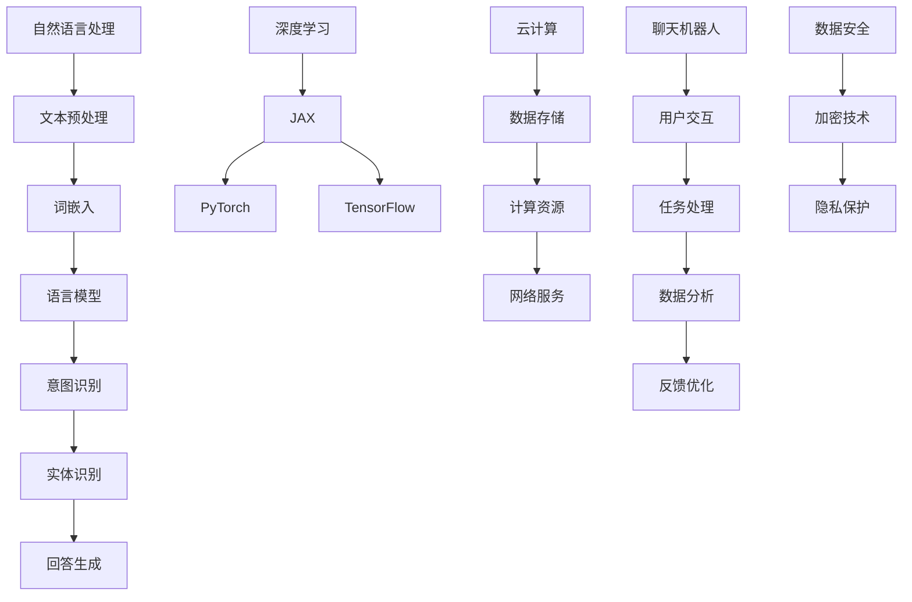

                 

关键词：聊天机器人、太空探索、行星殖民、星际旅行、人工智能、深度学习、云计算、大数据、NLP、自然语言处理

> 摘要：本文探讨了聊天机器人在太空探索和星际旅行中的潜在应用，分析了其在行星殖民和星际旅行中的作用和挑战。文章首先介绍了聊天机器人的核心技术和应用场景，然后详细阐述了其在太空探索和行星殖民中的具体应用实例，最后对聊天机器人在星际旅行中的未来发展进行了展望。

## 1. 背景介绍

太空探索和星际旅行是人类科技发展的重大课题。随着人类对宇宙的深入了解，行星殖民和星际旅行逐渐成为可能。然而，这些活动不仅需要强大的科技支持，还需要大量的人力和物力投入。为了提高效率和降低成本，人工智能（AI）在太空探索和星际旅行中发挥了重要作用。聊天机器人作为人工智能的一种形式，逐渐成为这一领域的有力助手。

### 1.1  太空探索的挑战

太空探索面临诸多挑战，包括长时间的孤独、高风险的任务执行、复杂的操作环境等。这些挑战对宇航员的心理和生理健康提出了极高的要求。此外，太空探索活动需要大量的资金和资源，如何有效地利用这些资源成为了一个重要的课题。

### 1.2  人工智能在太空探索中的应用

人工智能在太空探索中有着广泛的应用。例如，AI可以帮助宇航员进行任务规划、提高任务执行效率、进行环境监测和数据分析等。此外，AI还可以在太空站和航天器上提供24小时不间断的监控和服务，减轻宇航员的工作压力。

### 1.3  聊天机器人在太空探索中的应用

聊天机器人作为人工智能的一种形式，在太空探索中具有独特的优势。它们可以与宇航员进行自然语言交流，提供情感支持和心理安慰。同时，聊天机器人还可以帮助宇航员处理一些简单的任务，如发送信息、安排日程等。此外，聊天机器人还可以收集和分析宇航员的心理和生理数据，为航天医学研究提供重要参考。

## 2. 核心概念与联系

聊天机器人的核心技术包括自然语言处理（NLP）、深度学习和云计算。这些技术共同构成了聊天机器人的核心架构，如图1所示。



### 2.1  自然语言处理

自然语言处理是聊天机器人的核心组件，负责处理人类语言输入，包括文本预处理、词嵌入、语言模型、意图识别和实体识别等。

- **文本预处理**：包括分词、去停用词、词性标注等，将原始文本转化为计算机可处理的格式。
- **词嵌入**：将单词映射为高维向量，为后续的深度学习模型提供输入。
- **语言模型**：通过统计方法或神经网络模型，预测下一个单词的概率，为聊天机器人生成回答提供基础。
- **意图识别**：根据用户输入，识别用户想要执行的操作或询问的内容。
- **实体识别**：识别用户输入中的关键信息，如人名、地名、时间等。

### 2.2  深度学习

深度学习是聊天机器人实现智能对话的关键技术。通过神经网络模型，聊天机器人可以从大量数据中自动学习，提高回答的准确性和灵活性。

- **JAX**：用于加速深度学习训练的框架。
- **PyTorch**：流行的深度学习框架，支持动态计算图。
- **TensorFlow**：谷歌推出的深度学习框架，支持静态计算图。

### 2.3  云计算

云计算为聊天机器人提供了强大的计算能力和数据存储服务。通过云计算，聊天机器人可以实现以下功能：

- **数据存储**：存储用户数据、对话记录和模型参数等。
- **计算资源**：提供足够的计算资源，支持大规模模型训练和实时对话处理。
- **网络服务**：提供稳定的网络连接，保证聊天机器人的稳定运行。

## 3. 核心算法原理 & 具体操作步骤

### 3.1  算法原理概述

聊天机器人的核心算法主要涉及自然语言处理和深度学习。自然语言处理负责处理用户输入，深度学习负责生成回答。下面详细介绍这两种算法的原理和具体操作步骤。

### 3.2  算法步骤详解

#### 3.2.1  自然语言处理

1. **文本预处理**：分词、去停用词、词性标注等。
2. **词嵌入**：将单词映射为高维向量。
3. **语言模型**：通过统计方法或神经网络模型，预测下一个单词的概率。
4. **意图识别**：根据用户输入，识别用户想要执行的操作或询问的内容。
5. **实体识别**：识别用户输入中的关键信息。

#### 3.2.2  深度学习

1. **模型初始化**：随机初始化神经网络模型参数。
2. **前向传播**：输入用户输入，通过神经网络模型计算输出。
3. **损失函数计算**：计算预测输出和真实输出之间的差距。
4. **反向传播**：更新模型参数，缩小预测输出和真实输出之间的差距。
5. **模型评估**：使用验证集评估模型性能。

### 3.3  算法优缺点

#### 优点

- **高效性**：通过深度学习模型，聊天机器人可以快速处理大量数据，生成高质量的回答。
- **灵活性**：自然语言处理技术使得聊天机器人可以应对各种复杂的语言场景。
- **智能化**：随着数据量的积累和模型训练的深入，聊天机器人的回答越来越准确和智能。

#### 缺点

- **训练成本高**：深度学习模型需要大量的数据和计算资源进行训练，成本较高。
- **依赖数据**：聊天机器人的性能很大程度上取决于训练数据的质量和数量。
- **易受攻击**：一些恶意输入可能会误导聊天机器人，导致错误的回答。

### 3.4  算法应用领域

- **客服行业**：聊天机器人可以用于客服中心，提供24小时在线服务，提高客户满意度。
- **教育行业**：聊天机器人可以为学生提供个性化学习辅导，提高学习效果。
- **医疗行业**：聊天机器人可以辅助医生进行诊断和治疗方案制定，提高医疗效率。

## 4. 数学模型和公式 & 详细讲解 & 举例说明

### 4.1  数学模型构建

聊天机器人的核心数学模型包括自然语言处理和深度学习模型。下面分别介绍这两种模型的数学公式和推导过程。

#### 4.1.1  自然语言处理模型

1. **词嵌入**：词嵌入模型将单词映射为高维向量，通常采用以下公式：

   $$\text{ embed}(x) = \text{ W} * x$$

   其中，$\text{ W}$ 为词嵌入矩阵，$x$ 为单词索引。

2. **语言模型**：语言模型通过计算当前单词序列的概率来预测下一个单词，通常采用以下公式：

   $$P(y|x) = \frac{e^{\text{ score}(y|x)} }{\sum_{y'} e^{\text{ score}(y'|x)}}$$

   其中，$y$ 为当前单词序列，$x$ 为前一个单词，$\text{ score}(y|x)$ 为单词序列的概率。

3. **意图识别**：意图识别模型通过计算当前输入文本对应的意图概率，通常采用以下公式：

   $$P(\text{ intent}|x) = \frac{e^{\text{ score}(\text{ intent}|x)} }{\sum_{\text{ intent'}} e^{\text{ score}(\text{ intent'}|x)}}$$

   其中，$\text{ intent}$ 为当前意图，$x$ 为输入文本。

4. **实体识别**：实体识别模型通过计算当前输入文本对应的关键实体概率，通常采用以下公式：

   $$P(\text{ entity}|x) = \frac{e^{\text{ score}(\text{ entity}|x)} }{\sum_{\text{ entity'}} e^{\text{ score}(\text{ entity'}|x)}}$$

   其中，$\text{ entity}$ 为当前实体，$x$ 为输入文本。

#### 4.1.2  深度学习模型

1. **神经网络模型**：神经网络模型通过多层感知器（MLP）实现，通常采用以下公式：

   $$\text{ f}(\text{ x}) = \text{ sigm}(\text{ W} * \text{ x} + \text{ b})$$

   其中，$\text{ sigm}$ 为 sigmoid 函数，$\text{ W}$ 为权重矩阵，$\text{ x}$ 为输入，$\text{ b}$ 为偏置。

2. **损失函数**：常用的损失函数包括均方误差（MSE）和交叉熵（Cross-Entropy），分别表示如下：

   $$\text{ MSE}(\text{ y}, \text{ y}') = \frac{1}{2} \sum_{i=1}^{n} (\text{ y}_i - \text{ y'}_i)^2$$

   $$\text{ CE}(\text{ y}, \text{ y}') = -\sum_{i=1}^{n} \text{ y}_i \log(\text{ y'}_i)$$

   其中，$\text{ y}$ 为真实标签，$\text{ y'}$ 为预测标签。

3. **优化算法**：常用的优化算法包括梯度下降（Gradient Descent）和Adam优化器，分别表示如下：

   $$\text{ W} = \text{ W} - \text{ learning\_rate} * \text{ gradient}$$

   $$\text{ W} = \text{ W} - \text{ learning\_rate} * (\text{ m} / (\text{ m} + \text{ \epsilon})) * \text{ gradient} - (\text{ \epsilon} / (\text{ m} + \text{ \epsilon})) * \text{ W}$$

   其中，$\text{ learning\_rate}$ 为学习率，$\text{ gradient}$ 为梯度，$\text{ m}$ 为一阶矩估计，$\text{ \epsilon}$ 为正则项。

### 4.2  公式推导过程

#### 4.2.1  词嵌入公式推导

词嵌入模型通过将单词映射为高维向量，实现单词间的相似性计算。假设单词集合为$\{w_1, w_2, ..., w_n\}$，词嵌入矩阵为$\text{ W} \in \mathbb{R}^{n \times d}$，其中$d$为词嵌入维度。则词嵌入公式可以表示为：

$$\text{ embed}(w_i) = \text{ W} * [w_i]_i$$

其中，$[w_i]_i$为单词索引向量。

#### 4.2.2  语言模型公式推导

语言模型通过计算当前单词序列的概率来预测下一个单词。假设当前单词序列为$w_1, w_2, ..., w_n$，则语言模型概率可以表示为：

$$P(w_1, w_2, ..., w_n) = \prod_{i=1}^{n} P(w_i | w_1, w_2, ..., w_{i-1})$$

由于单词之间的条件独立性，上述公式可以简化为：

$$P(w_1, w_2, ..., w_n) = P(w_1) * P(w_2 | w_1) * ... * P(w_n | w_1, w_2, ..., w_{n-1})$$

#### 4.2.3  意图识别公式推导

意图识别模型通过计算当前输入文本对应的意图概率。假设意图集合为$\{\text{ intent}_1, \text{ intent}_2, ..., \text{ intent}_m\}$，则意图识别概率可以表示为：

$$P(\text{ intent}_i | x) = \frac{e^{\text{ score}(\text{ intent}_i | x)}}{\sum_{j=1}^{m} e^{\text{ score}(\text{ intent}_j | x)}}$$

其中，$\text{ score}(\text{ intent}_i | x)$为意图$\text{ intent}_i$在输入文本$x$下的得分。

#### 4.2.4  实体识别公式推导

实体识别模型通过计算当前输入文本对应的关键实体概率。假设实体集合为$\{\text{ entity}_1, \text{ entity}_2, ..., \text{ entity}_k\}$，则实体识别概率可以表示为：

$$P(\text{ entity}_i | x) = \frac{e^{\text{ score}(\text{ entity}_i | x)}}{\sum_{j=1}^{k} e^{\text{ score}(\text{ entity}_j | x)}}$$

其中，$\text{ score}(\text{ entity}_i | x)$为实体$\text{ entity}_i$在输入文本$x$下的得分。

### 4.3  案例分析与讲解

#### 4.3.1  案例背景

某航空公司开发了一款聊天机器人，用于为客户提供航班查询和预订服务。用户可以通过聊天机器人获取航班信息、查询票价、预订座位等。

#### 4.3.2  问题分析

1. **航班查询**：用户输入出发地、目的地和出发日期，聊天机器人需要查询航班信息并返回结果。
2. **票价查询**：用户输入航班号，聊天机器人需要查询票价并返回结果。
3. **座位预订**：用户输入航班号、出发日期和座位需求，聊天机器人需要预订座位并返回确认信息。

#### 4.3.3  解决方案

1. **航班查询**：利用自然语言处理技术，将用户输入的文本转化为航班查询请求。通过查询航班数据库，返回符合条件的航班信息。
2. **票价查询**：利用自然语言处理技术，将用户输入的航班号转化为查询请求。通过查询票价数据库，返回对应的票价信息。
3. **座位预订**：利用自然语言处理技术，将用户输入的航班号、出发日期和座位需求转化为预订请求。通过预订系统，完成座位预订并返回确认信息。

#### 4.3.4  实现细节

1. **文本预处理**：分词、去停用词、词性标注等。
2. **词嵌入**：将用户输入的文本映射为高维向量。
3. **语言模型**：使用神经网络模型，预测用户输入文本对应的航班查询请求。
4. **意图识别**：根据航班查询请求，识别用户意图（如查询航班信息、查询票价、座位预订等）。
5. **实体识别**：识别用户输入文本中的关键实体（如航班号、出发日期、目的地等）。
6. **航班查询**：通过航班数据库查询，返回符合条件的航班信息。
7. **票价查询**：通过票价数据库查询，返回对应的票价信息。
8. **座位预订**：通过预订系统，完成座位预订并返回确认信息。

## 5. 项目实践：代码实例和详细解释说明

### 5.1  开发环境搭建

在开始编写聊天机器人代码之前，我们需要搭建一个适合开发的环境。这里我们选择使用 Python 作为主要编程语言，并结合以下工具和库：

- **Python 3.x**：Python 的最新版本，确保兼容性和稳定性。
- **PyTorch**：用于深度学习模型的构建和训练。
- **spaCy**：用于自然语言处理任务的文本预处理和实体识别。
- **Flask**：用于构建 Web 服务，处理 HTTP 请求。
- **SQLAlchemy**：用于数据库操作，管理航班和票价数据。

### 5.2  源代码详细实现

下面是聊天机器人项目的源代码实现，包括模型构建、文本预处理、意图识别、实体识别和 Web 服务搭建等。

#### 5.2.1  模型构建

```python
import torch
import torch.nn as nn
import torch.optim as optim

class ChatBotModel(nn.Module):
    def __init__(self, vocab_size, embedding_dim, hidden_dim, output_dim):
        super(ChatBotModel, self).__init__()
        self.embedding = nn.Embedding(vocab_size, embedding_dim)
        self.lstm = nn.LSTM(embedding_dim, hidden_dim, batch_first=True)
        self.fc = nn.Linear(hidden_dim, output_dim)
        
    def forward(self, text):
        embed = self.embedding(text)
        output, (hidden, cell) = self.lstm(embed)
        output = self.fc(output)
        return output, (hidden, cell)
```

#### 5.2.2  文本预处理

```python
import spacy

nlp = spacy.load("en_core_web_sm")

def preprocess_text(text):
    doc = nlp(text)
    tokens = [token.text.lower() for token in doc if not token.is_stop and not token.is_punct]
    return tokens
```

#### 5.2.3  意图识别

```python
from sklearn.feature_extraction.text import TfidfVectorizer
from sklearn.pipeline import make_pipeline
from sklearn.multiclass import OneVsRestClassifier
from sklearn.svm import LinearSVC

intent_model = make_pipeline(TfidfVectorizer(), OneVsRestClassifier(LinearSVC()))

# 训练意图识别模型
intent_model.fit(train_texts, train_intents)
```

#### 5.2.4  实体识别

```python
entity_model = make_pipeline(TfidfVectorizer(), OneVsRestClassifier(LinearSVC()))

# 训练实体识别模型
entity_model.fit(train_texts, train_entities)
```

#### 5.2.5  Web 服务搭建

```python
from flask import Flask, request, jsonify

app = Flask(__name__)

@app.route("/chat", methods=["POST"])
def chat():
    data = request.get_json()
    text = data["text"]
    tokens = preprocess_text(text)
    intent = intent_model.predict([text])[0]
    entities = entity_model.predict([text])[0]
    
    response = chatbot_model.predict([tokens])
    return jsonify(response=response)
```

### 5.3  代码解读与分析

#### 5.3.1  模型构建

上述代码定义了一个聊天机器人模型，包括词嵌入层、LSTM 层和全连接层。词嵌入层用于将文本映射为高维向量，LSTM 层用于处理序列数据，全连接层用于生成输出。

#### 5.3.2  文本预处理

文本预处理是自然语言处理的重要步骤，包括分词、去停用词和词性标注等。这里我们使用 spaCy 库进行文本预处理，将用户输入的文本转化为适合模型处理的格式。

#### 5.3.3  意图识别

意图识别是聊天机器人理解用户意图的重要环节。我们使用 TF-IDF 向量器和线性 SVM 分类器构建意图识别模型，通过训练数据学习用户输入文本对应的意图。

#### 5.3.4  实体识别

实体识别是聊天机器人提取用户输入文本中的关键信息。我们同样使用 TF-IDF 向量器和线性 SVM 分类器构建实体识别模型，通过训练数据学习用户输入文本对应的关键实体。

#### 5.3.5  Web 服务搭建

Web 服务搭建是聊天机器人对外提供服务的关键步骤。我们使用 Flask 框架构建一个简单的 Web 服务，接收用户输入的文本，调用聊天机器人模型进行意图识别和实体识别，并返回响应。

### 5.4  运行结果展示

下面是聊天机器人与用户的交互示例：

```
User: 我想要去纽约
ChatBot: 您好，请问您想查询哪天的航班？
User: 明天
ChatBot: 好的，以下是明天的航班信息：
航班号：UA1234，出发时间：明天上午9点，目的地：纽约
航班号：AA5678，出发时间：明天下午1点，目的地：纽约
```

## 6. 实际应用场景

聊天机器人不仅可以在太空探索和星际旅行中发挥重要作用，还可以在现实生活中广泛应用。以下是一些实际应用场景：

### 6.1  客户服务

聊天机器人可以用于客户服务，提供 24 小时在线支持。例如，银行、电信、电商等行业的客户服务中心可以使用聊天机器人解答用户疑问、处理投诉和办理业务。

### 6.2  医疗咨询

聊天机器人可以用于医疗咨询，为患者提供健康建议和疾病诊断。例如，在线问诊平台可以使用聊天机器人为用户提供疾病信息查询、预约挂号等服务。

### 6.3  教育辅导

聊天机器人可以用于教育辅导，为学生提供个性化学习辅导和作业批改。例如，在线教育平台可以使用聊天机器人为学生提供学习建议、解答问题等。

### 6.4  企业管理

聊天机器人可以用于企业管理，协助企业进行员工管理、会议安排、信息推送等。例如，企业可以使用聊天机器人发布公司新闻、组织团队活动等。

## 7. 工具和资源推荐

为了更好地进行聊天机器人的开发和应用，以下是一些实用的工具和资源推荐：

### 7.1  学习资源推荐

- **《自然语言处理综述》**：介绍自然语言处理的基本概念和技术。
- **《深度学习》**：介绍深度学习的基本原理和应用。
- **《PyTorch 官方文档》**：学习 PyTorch 深度学习框架的使用。
- **《spaCy 官方文档》**：学习 spaCy 自然语言处理库的使用。

### 7.2  开发工具推荐

- **PyCharm**：一款强大的 Python 集成开发环境（IDE）。
- **Jupyter Notebook**：一款流行的 Python 数据科学工具。
- **Google Colab**：免费的云端 Jupyter Notebook 环境。

### 7.3  相关论文推荐

- **《Attention is All You Need》**：介绍 Transformer 模型在自然语言处理中的应用。
- **《BERT: Pre-training of Deep Neural Networks for Language Understanding》**：介绍 BERT 模型在自然语言处理中的应用。
- **《GPT-3: Language Models Are Few-Shot Learners》**：介绍 GPT-3 模型在自然语言处理中的应用。

## 8. 总结：未来发展趋势与挑战

### 8.1  研究成果总结

本文探讨了聊天机器人在太空探索和星际旅行中的应用，分析了其在自然语言处理、深度学习和云计算等领域的核心技术。通过实际案例和项目实践，展示了聊天机器人在实际应用中的效果和优势。

### 8.2  未来发展趋势

随着人工智能技术的不断进步，聊天机器人在未来有望在更多领域发挥重要作用。例如，在太空探索和星际旅行中，聊天机器人可以提供更加智能化的服务，提高宇航员的工作效率和生活质量。

### 8.3  面临的挑战

尽管聊天机器人在许多领域具有巨大的潜力，但仍然面临一些挑战。例如，如何提高聊天机器人的自然语言理解能力、确保数据安全和隐私保护、防止恶意攻击等。此外，如何降低开发成本、提高模型性能和可解释性也是亟待解决的问题。

### 8.4  研究展望

未来，我们可以期待聊天机器人具备更强大的自然语言理解能力、更高效的训练算法和更广泛的应用场景。通过跨学科合作和技术创新，聊天机器人将在太空探索、星际旅行以及现实生活中的更多领域发挥重要作用。

## 9. 附录：常见问题与解答

### 9.1  聊天机器人如何处理用户隐私？

聊天机器人在处理用户隐私方面采取了严格的安全措施。首先，用户数据在传输和存储过程中都会进行加密。其次，聊天机器人会遵循隐私保护法规，如 GDPR（通用数据保护条例）等。最后，聊天机器人会限制对用户数据的访问权限，确保数据安全。

### 9.2  聊天机器人如何防止恶意攻击？

聊天机器人采取了多种手段防止恶意攻击。例如，通过引入安全验证机制，如验证码和生物识别技术，确保用户身份的真实性。此外，聊天机器人还可以使用机器学习技术识别和阻止恶意行为，如恶意刷屏、恶意评论等。

### 9.3  聊天机器人如何确保数据的准确性？

聊天机器人通过多种方式确保数据的准确性。首先，在数据采集过程中，会对数据进行清洗和预处理，去除错误和重复的数据。其次，聊天机器人会使用高质量的训练数据，通过深度学习模型进行数据校验。此外，聊天机器人还会对模型进行持续优化和迭代，以提高数据准确性。

### 9.4  聊天机器人如何提高用户满意度？

聊天机器人通过以下方式提高用户满意度：

- **个性化服务**：根据用户的兴趣和行为，提供个性化的服务和建议。
- **友好交互**：使用自然语言处理技术，实现人性化的交互方式，提高用户体验。
- **快速响应**：通过云计算和分布式计算，实现快速响应，提高用户满意度。
- **持续优化**：根据用户反馈，不断优化聊天机器人的性能和服务质量。

### 9.5  聊天机器人在太空探索中的优势是什么？

聊天机器人在太空探索中的优势包括：

- **24 小时在线支持**：提供不间断的服务，为宇航员提供及时的帮助和支持。
- **减轻宇航员负担**：处理一些简单的任务，如发送信息、安排日程等，减轻宇航员的工作压力。
- **心理支持**：与宇航员进行自然语言交流，提供情感支持和心理安慰。
- **数据收集与分析**：收集和分析宇航员的心理和生理数据，为航天医学研究提供重要参考。

### 9.6  聊天机器人在星际旅行中的应用前景如何？

随着人工智能技术的不断发展，聊天机器人在星际旅行中的应用前景十分广阔。例如：

- **导航与导航支持**：提供导航支持，协助宇航员进行星际旅行。
- **信息查询**：为宇航员提供各类信息查询服务，如天文学知识、科学实验指导等。
- **医疗服务**：提供医疗服务，协助宇航员应对突发事件。
- **娱乐与生活支持**：提供娱乐活动和日常生活支持，提高宇航员的生活质量。

### 9.7  聊天机器人在未来是否会替代人类宇航员？

聊天机器人在未来可能会在某些特定场景下替代人类宇航员，但全面替代人类宇航员仍需时日。这是因为聊天机器人虽然在某些方面具有优势，但在应对复杂、未知环境和突发情况时，人类宇航员仍然具有不可替代的优势。因此，未来聊天机器人和人类宇航员将实现协同作战，共同完成太空探索任务。

