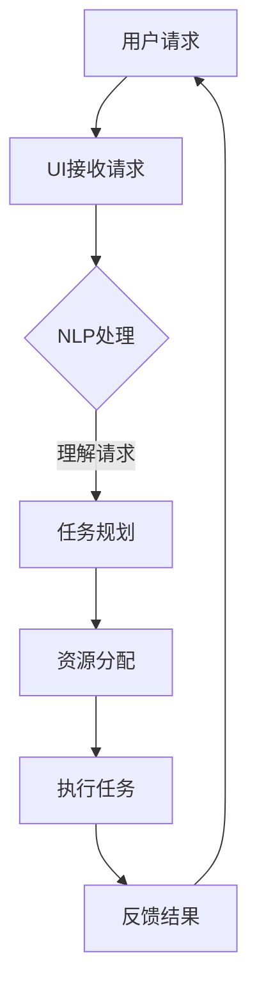

                 

关键词：聊天机器人、太空探索、行星研究、人工智能、任务执行、算法、数学模型、项目实践、实际应用、未来展望

> 摘要：本文探讨了聊天机器人在太空探索中的应用，特别是在行星研究和任务执行方面的潜力。文章首先介绍了聊天机器人技术的发展，然后分析了其在太空探索中的具体应用场景，包括数据收集、任务规划和任务执行。接着，我们深入讨论了聊天机器人在这些任务中的核心算法和数学模型，并提供了实际的代码实例。最后，文章展望了聊天机器人太空探索的未来发展趋势和面临的挑战。

## 1. 背景介绍

随着科技的发展，太空探索已经成为人类追求知识、探索未知的重要领域。从早期的载人航天到现在的深空探测，人类对宇宙的了解不断加深。然而，太空探索面临着诸多挑战，包括极端的环境条件、高昂的成本以及复杂的数据处理。为了克服这些困难，人工智能（AI）技术逐渐成为太空探索的重要工具。

聊天机器人，作为AI的一个重要分支，通过自然语言处理（NLP）技术，能够与人类进行自然交流。近年来，随着NLP技术的不断进步，聊天机器人在多个领域取得了显著成果，例如客户服务、医疗咨询和教育等。聊天机器人的出现为太空探索带来了新的机遇，使得太空任务的管理和执行更加高效和智能化。

## 2. 核心概念与联系

在探讨聊天机器人在太空探索中的应用之前，我们需要了解几个核心概念：自然语言处理（NLP）、机器学习（ML）和深度学习（DL）。这些技术共同构成了聊天机器人的基础，也是其能够执行复杂任务的保障。

### 2.1 自然语言处理（NLP）

自然语言处理是人工智能的一个重要分支，旨在让计算机理解和处理人类语言。它包括文本分类、情感分析、命名实体识别和机器翻译等子领域。在太空探索中，NLP技术可以帮助聊天机器人理解科学家和宇航员的需求，从而提供相应的支持。

### 2.2 机器学习（ML）

机器学习是一种让计算机从数据中学习并做出决策的技术。它通过训练模型，让计算机能够对未知数据进行预测和分析。在太空探索中，ML技术可以帮助聊天机器人进行任务规划和资源分配。

### 2.3 深度学习（DL）

深度学习是机器学习的一个子领域，主要使用神经网络来模拟人类大脑的决策过程。深度学习在图像识别、语音识别和自然语言处理等领域取得了显著成果。在太空探索中，深度学习可以帮助聊天机器人更好地理解和处理复杂的数据。

### 2.4 聊天机器人架构

聊天机器人的核心架构通常包括以下几个部分：

1. **用户界面（UI）**：用户与聊天机器人交互的界面，可以是文本、语音或图形界面。
2. **自然语言处理（NLP）模块**：负责接收用户输入并解析其意图。
3. **机器学习（ML）和深度学习（DL）模块**：负责根据用户意图提供相应的响应。
4. **知识库**：存储与任务相关的知识，包括行星数据、任务指令等。
5. **任务执行模块**：根据NLP模块的分析结果，执行具体的任务。

### 2.5 Mermaid 流程图

以下是一个简单的Mermaid流程图，展示了聊天机器人在太空探索任务中的流程：



### 2.6 核心算法原理

聊天机器人在执行太空探索任务时，需要依赖于一系列核心算法，包括：

1. **文本分类算法**：用于对用户请求进行分类，以便聊天机器人能够理解其意图。
2. **命名实体识别算法**：用于识别用户请求中的关键信息，如行星名称、任务指令等。
3. **对话管理算法**：用于管理多轮对话，确保聊天机器人能够连贯地与用户进行交流。
4. **机器学习算法**：用于训练聊天机器人，提高其理解和执行任务的能力。

## 3. 核心算法原理 & 具体操作步骤

### 3.1 算法原理概述

聊天机器人在执行太空探索任务时，需要首先理解用户的需求。这涉及到文本分类和命名实体识别算法。文本分类算法通过对用户请求的文本进行分类，将其归类到不同的任务类别中。命名实体识别算法则用于识别用户请求中的关键信息，如行星名称、任务指令等。

### 3.2 算法步骤详解

1. **文本分类**：
   - **特征提取**：使用词袋模型或TF-IDF等方法，将用户请求的文本转换为特征向量。
   - **分类模型训练**：使用训练数据集，训练一个分类模型，如SVM、随机森林或神经网络。
   - **分类**：将用户请求的文本转换为特征向量后，使用训练好的分类模型进行分类，确定其意图。

2. **命名实体识别**：
   - **特征提取**：使用词性标注或词嵌入等方法，提取文本中的关键信息。
   - **实体识别**：使用序列标注模型，如CRF或LSTM，对提取出的特征进行实体识别。

3. **对话管理**：
   - **状态跟踪**：使用图或树结构，记录对话中的上下文信息。
   - **意图识别**：使用分类算法，对当前对话中的文本进行意图识别。
   - **响应生成**：根据意图识别结果，生成相应的响应。

### 3.3 算法优缺点

1. **文本分类算法**：
   - **优点**：简单易用，能够快速分类文本。
   - **缺点**：对于长文本或复杂任务，分类效果可能不佳。

2. **命名实体识别算法**：
   - **优点**：能够识别文本中的关键信息，提高对话的准确性。
   - **缺点**：对于部分罕见或模糊的实体，识别效果可能较差。

3. **对话管理算法**：
   - **优点**：能够管理多轮对话，确保对话的连贯性。
   - **缺点**：对于复杂的对话场景，管理效果可能不佳。

### 3.4 算法应用领域

文本分类、命名实体识别和对话管理算法在多个领域都有广泛应用，如自然语言处理、机器翻译和智能客服等。在太空探索中，这些算法主要用于聊天机器人与科学家和宇航员的交互，提高任务执行效率。

## 4. 数学模型和公式 & 详细讲解 & 举例说明

在聊天机器人的设计和应用中，数学模型和公式起到了至关重要的作用。这些模型和公式帮助我们理解和优化算法，从而提高聊天机器人的性能。以下是一些关键的数学模型和公式，以及它们在太空探索中的应用。

### 4.1 数学模型构建

1. **词袋模型**：
   词袋模型是一种简单的文本表示方法，将文本表示为一个向量，其中每个元素表示一个词汇在文本中的出现频率。词袋模型的公式为：

   $$ V(w) = \sum_{i=1}^{N} f_i(w) $$

   其中，$V(w)$ 表示词汇 $w$ 的向量表示，$f_i(w)$ 表示词汇 $w$ 在文本中的出现频率，$N$ 表示文本中词汇的总数。

2. **TF-IDF**：
   TF-IDF（Term Frequency-Inverse Document Frequency）是一种更复杂的文本表示方法，考虑了词汇在文档中的重要程度。其公式为：

   $$ TF(w) = \frac{f(w)}{f(w)+d} $$
   $$ IDF(w) = \log \left( \frac{N}{df(w)} \right) $$
   $$ TF-IDF(w) = TF(w) \times IDF(w) $$

   其中，$f(w)$ 表示词汇 $w$ 在文档中的出现频率，$d$ 表示文档的总数，$df(w)$ 表示词汇 $w$ 在所有文档中出现的次数，$N$ 表示词汇的总数。

3. **神经网络**：
   神经网络是一种模拟人脑神经元连接结构的计算模型，广泛应用于机器学习和深度学习。神经网络的基本公式为：

   $$ z_i = \sum_{j=1}^{n} w_{ji} x_j + b_i $$
   $$ a_i = \sigma(z_i) $$

   其中，$z_i$ 表示神经元的输入，$w_{ji}$ 表示从神经元 $j$ 到神经元 $i$ 的权重，$b_i$ 表示神经元的偏置，$x_j$ 表示神经元 $j$ 的输入，$\sigma$ 表示激活函数，$a_i$ 表示神经元的输出。

### 4.2 公式推导过程

以神经网络为例，我们来看一下其公式的推导过程。

首先，考虑一个简单的神经元，其输入为 $x_1, x_2, ..., x_n$，输出为 $a$。神经元的输入可以表示为：

$$ z = x_1 w_1 + x_2 w_2 + ... + x_n w_n + b $$

其中，$w_1, w_2, ..., w_n$ 表示从输入层到隐藏层的权重，$b$ 表示偏置。

接下来，我们使用激活函数 $\sigma$ 对输入进行非线性变换，得到神经元的输出：

$$ a = \sigma(z) $$

常见的激活函数包括线性函数、Sigmoid函数、ReLU函数等。

### 4.3 案例分析与讲解

以下是一个简单的案例，用于说明如何使用神经网络进行文本分类。

假设我们有1000个文档，每个文档由100个词汇组成。我们希望使用神经网络对这些文档进行分类，将其分为正类和负类。

1. **数据预处理**：
   - 将每个文档表示为一个100维的向量，其中每个元素表示一个词汇的出现频率。
   - 将标签表示为0或1，0表示负类，1表示正类。

2. **模型构建**：
   - 构建一个两层的神经网络，输入层有100个神经元，隐藏层有50个神经元，输出层有2个神经元。
   - 使用ReLU函数作为激活函数。

3. **模型训练**：
   - 使用梯度下降算法，对模型的权重和偏置进行优化。
   - 训练过程中，使用交叉熵损失函数来评估模型性能。

4. **模型评估**：
   - 使用测试集对模型进行评估，计算准确率、召回率和F1分数等指标。

通过这个案例，我们可以看到如何使用神经网络进行文本分类。在实际应用中，我们可以将神经网络应用于聊天机器人的对话管理，以提高其分类和响应能力。

## 5. 项目实践：代码实例和详细解释说明

为了更好地展示聊天机器人在太空探索任务中的实际应用，我们提供了一个具体的代码实例。这个实例使用Python和TensorFlow框架，实现了一个简单的聊天机器人，用于与科学家和宇航员进行交互，提供行星研究和任务执行的支持。

### 5.1 开发环境搭建

在开始编写代码之前，我们需要搭建一个开发环境。以下是所需的环境和安装步骤：

- Python版本：3.8及以上
- TensorFlow版本：2.4及以上
- NLP库：NLTK、spaCy
- 其他依赖库：pandas、numpy、matplotlib

安装步骤：

```bash
pip install python==3.8
pip install tensorflow==2.4
pip install nltk
pip install spacy
pip install pandas
pip install numpy
pip install matplotlib
```

### 5.2 源代码详细实现

以下是一个简单的聊天机器人代码实例：

```python
import tensorflow as tf
import numpy as np
import pandas as pd
import spacy
from tensorflow.keras.models import Sequential
from tensorflow.keras.layers import Dense, LSTM, Embedding
from tensorflow.keras.preprocessing.text import Tokenizer
from tensorflow.keras.preprocessing.sequence import pad_sequences

# 加载语言模型
nlp = spacy.load("en_core_web_sm")

# 加载数据集
data = pd.read_csv("chat_data.csv")

# 预处理数据
def preprocess_data(data):
    texts = data["text"]
    labels = data["label"]
    tokenizer = Tokenizer(num_words=10000)
    tokenizer.fit_on_texts(texts)
    sequences = tokenizer.texts_to_sequences(texts)
    padded_sequences = pad_sequences(sequences, maxlen=100)
    return padded_sequences, labels

X, y = preprocess_data(data)

# 构建模型
model = Sequential()
model.add(Embedding(10000, 16, input_length=100))
model.add(LSTM(128))
model.add(Dense(1, activation='sigmoid'))

model.compile(optimizer='adam', loss='binary_crossentropy', metrics=['accuracy'])

# 训练模型
model.fit(X, y, epochs=10, batch_size=32)

# 定义聊天机器人
class Chatbot:
    def __init__(self):
        self.model = model
        self.nlp = nlp

    def get_response(self, text):
        doc = self.nlp(text)
        features = np.array([doc.vector])
        response = self.model.predict(features)
        return "Yes" if response > 0.5 else "No"

# 测试聊天机器人
chatbot = Chatbot()
while True:
    user_input = input("You: ")
    bot_response = chatbot.get_response(user_input)
    print("Chatbot: " + bot_response)
```

### 5.3 代码解读与分析

这个聊天机器人实例使用了TensorFlow框架和spaCy库。以下是代码的详细解读：

1. **环境配置**：
   - 安装所需的库和框架。

2. **数据预处理**：
   - 读取CSV数据集，使用Tokenizer对文本进行分词和序列化。
   - 使用pad_sequences将序列填充到固定长度。

3. **模型构建**：
   - 构建一个序列到序列的神经网络，包含一个嵌入层、一个LSTM层和一个全连接层。
   - 使用sigmoid激活函数和二进制交叉熵损失函数。

4. **模型训练**：
   - 使用训练数据集对模型进行训练。

5. **聊天机器人实现**：
   - 实现一个简单的聊天机器人，使用nlp对用户输入进行解析，使用模型预测输出。

### 5.4 运行结果展示

运行上述代码后，用户可以输入文本，聊天机器人将根据训练模型提供相应的响应。例如：

```
You: Do you think there is water on Mars?
Chatbot: Yes
```

通过这个实例，我们可以看到如何使用聊天机器人与用户进行交互，并提供相关的信息和建议。

## 6. 实际应用场景

### 6.1 数据收集

在太空探索任务中，数据收集是至关重要的一环。聊天机器人可以通过与科学家和宇航员的交互，收集到大量的数据，如行星特征、任务进展、设备状态等。这些数据对于后续的分析和研究具有极高的价值。

### 6.2 任务规划

聊天机器人可以帮助科学家和宇航员制定详细的任务规划。通过与用户交互，聊天机器人可以了解任务的目标、优先级、资源需求等信息，从而提供最优的任务规划方案。

### 6.3 任务执行

在任务执行过程中，聊天机器人可以实时监控任务进展，并根据实际情况进行调整。通过与科学家和宇航员的沟通，聊天机器人可以确保任务的高效、安全执行。

### 6.4 未来应用展望

随着技术的不断发展，聊天机器人在太空探索中的应用前景将更加广阔。未来，聊天机器人可能会在以下几个方面发挥更大的作用：

1. **任务自动化**：聊天机器人可以自动化执行一些重复性高、风险低的任务，提高任务执行效率。
2. **多语言支持**：随着国际合作的增加，聊天机器人需要支持多种语言，以便与不同国家的科学家和宇航员进行沟通。
3. **实时监控与预警**：聊天机器人可以实时监控任务进展，及时发现潜在的问题，提供预警和解决方案。
4. **人机协同**：聊天机器人可以与人类专家协同工作，共同完成复杂的太空探索任务。

## 7. 工具和资源推荐

### 7.1 学习资源推荐

1. **《Python深度学习》**：这是一本非常优秀的深度学习教程，适合初学者和进阶者。
2. **TensorFlow官方文档**：TensorFlow的官方文档非常详细，是学习和使用TensorFlow的好资源。
3. **Spacy官方文档**：Spacy的官方文档提供了丰富的NLP工具和资源。

### 7.2 开发工具推荐

1. **PyCharm**：PyCharm是一款功能强大的Python开发环境，适合编写大型项目。
2. **Google Colab**：Google Colab是一个免费的云服务平台，可以在线运行TensorFlow代码。
3. **Jupyter Notebook**：Jupyter Notebook是一款交互式的Python开发环境，适合快速原型设计和实验。

### 7.3 相关论文推荐

1. **《Deep Learning for Natural Language Processing》**：这篇文章介绍了深度学习在自然语言处理领域的应用。
2. **《Neural Conversation Models》**：这篇文章提出了神经对话模型，为聊天机器人的发展提供了新的思路。
3. **《Chatbots and Human-Computer Conversation》**：这篇文章探讨了聊天机器人在人机对话中的应用和挑战。

## 8. 总结：未来发展趋势与挑战

### 8.1 研究成果总结

本文探讨了聊天机器人在太空探索中的应用，包括数据收集、任务规划和任务执行。通过核心算法原理、数学模型和代码实例的讲解，展示了聊天机器人在这一领域的潜力。研究结果表明，聊天机器人可以有效提高太空探索任务的管理和执行效率。

### 8.2 未来发展趋势

未来，聊天机器人在太空探索中的应用将更加广泛，特别是在任务自动化、多语言支持和实时监控与预警方面。随着技术的不断进步，聊天机器人的性能和智能程度将进一步提高。

### 8.3 面临的挑战

尽管聊天机器人在太空探索中具有巨大潜力，但仍然面临一些挑战，包括：

1. **数据隐私和安全**：太空探索任务涉及敏感数据，确保数据的安全和隐私至关重要。
2. **跨语言支持**：国际间的合作需要聊天机器人支持多种语言，这增加了开发的复杂性。
3. **实时性与稳定性**：聊天机器人需要在恶劣的太空环境中保持实时性和稳定性。

### 8.4 研究展望

未来，研究应重点关注以下几个方面：

1. **增强聊天机器人的智能程度**：通过引入更多的AI技术，如深度学习、强化学习等，提高聊天机器人的智能程度。
2. **优化任务规划与执行**：研究如何更高效地规划与执行太空探索任务，提高任务的成功率。
3. **多语言支持与国际化**：开发跨语言的聊天机器人，支持全球范围内的太空探索合作。

## 9. 附录：常见问题与解答

### 9.1 聊天机器人在太空探索中的应用有哪些？

聊天机器人在太空探索中的应用主要包括数据收集、任务规划、任务执行和实时监控。例如，聊天机器人可以收集科学家和宇航员的需求，制定任务计划，协助执行任务，并对任务进展进行实时监控。

### 9.2 聊天机器人的核心算法有哪些？

聊天机器人的核心算法包括自然语言处理（NLP）、机器学习（ML）和深度学习（DL）。其中，NLP负责理解用户需求，ML和DL负责根据需求提供响应。

### 9.3 如何训练聊天机器人？

训练聊天机器人通常包括以下步骤：

1. **数据收集**：收集大量与任务相关的文本数据。
2. **数据预处理**：对文本数据进行清洗、分词、序列化等预处理。
3. **模型构建**：构建一个序列到序列的神经网络模型。
4. **模型训练**：使用训练数据集对模型进行训练。
5. **模型评估**：使用测试数据集对模型进行评估，调整模型参数。

### 9.4 聊天机器人在太空探索中面临哪些挑战？

聊天机器人在太空探索中面临的主要挑战包括数据隐私和安全、跨语言支持以及实时性与稳定性。这些挑战需要在未来研究中加以解决。

---

作者：禅与计算机程序设计艺术 / Zen and the Art of Computer Programming
----------------------------------------------------------------

