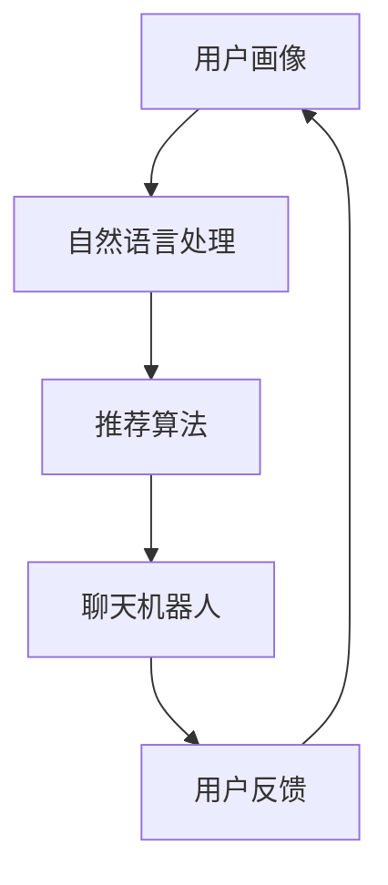

                 

关键词：聊天机器人，家居设计，个性化推荐，机器学习，用户体验

> 摘要：本文探讨了聊天机器人在家具行业中的应用，特别是在个性化家居设计和推荐方面的潜力。通过结合机器学习和自然语言处理技术，聊天机器人能够提供高度个性化的家具推荐，改善用户体验，降低客户流失率，提高销售转化率。本文将详细阐述聊天机器人家具业的核心概念、算法原理、数学模型、项目实践和未来应用展望。

## 1. 背景介绍

随着互联网和人工智能技术的快速发展，聊天机器人的应用领域不断扩展。从最初的客户服务工具，发展到如今的个性化推荐引擎，聊天机器人正逐渐成为企业与消费者互动的重要桥梁。在家具行业中，消费者对家居环境的个性化需求日益增长，如何准确捕捉并满足这些需求成为行业面临的挑战。

家具行业的特点包括产品种类繁多、消费者需求多样化、购买过程复杂等。传统的家具销售方式往往难以满足消费者个性化需求，导致用户体验不佳和客户流失。而聊天机器人作为一种新兴的技术手段，能够通过自然语言交互，实时了解消费者的偏好和需求，从而提供精准的个性化推荐。

## 2. 核心概念与联系

聊天机器人家具业的实现依赖于多个核心概念的协同作用，包括用户画像、推荐算法和自然语言处理。以下是一个简化的 Mermaid 流程图，展示这些概念之间的联系。



### 2.1 用户画像

用户画像是对消费者特征的全面描述，包括年龄、性别、地理位置、购买历史、浏览行为等。通过收集和分析这些数据，聊天机器人能够构建出每个用户的个性化档案，为推荐系统提供基础。

### 2.2 自然语言处理

自然语言处理（NLP）技术是聊天机器人的核心组件，它使机器人能够理解和生成人类语言。NLP 技术包括语音识别、语义分析、语言生成等，它们共同作用，使聊天机器人能够与用户进行流畅的自然语言交互。

### 2.3 推荐算法

推荐算法是聊天机器人家具业的关键组成部分，负责根据用户画像和交互历史，为用户提供个性化的家具推荐。常用的推荐算法包括基于内容的推荐、协同过滤推荐和混合推荐等。

### 2.4 聊天机器人

聊天机器人是用户与家具推荐系统之间的交互界面，它能够通过自然语言交互，了解用户需求，提供实时推荐。聊天机器人的设计需要考虑用户体验，使其既能够提供个性化推荐，又能够与用户进行自然的对话。

### 2.5 用户反馈

用户反馈是优化聊天机器人性能的重要环节。通过分析用户的反馈，可以不断改进推荐算法和聊天机器人的交互方式，提高用户体验和系统效果。

## 3. 核心算法原理 & 具体操作步骤

### 3.1 算法原理概述

聊天机器人家具业的算法原理主要包括以下几个步骤：

1. 用户画像构建：通过数据分析，为每个用户构建详细的个性化档案。
2. 交互与语义理解：通过自然语言处理技术，理解用户的输入，提取关键信息。
3. 推荐生成：基于用户画像和交互历史，使用推荐算法生成个性化推荐。
4. 推荐展示与交互：将推荐结果通过聊天机器人展示给用户，并允许用户与系统进行交互。

### 3.2 算法步骤详解

1. **用户画像构建**：

   - 数据收集：从用户注册信息、购物历史、浏览记录等多渠道收集数据。
   - 数据预处理：清洗、去重、标准化数据，为构建用户画像做准备。
   - 特征提取：使用机器学习算法提取用户特征，如年龄、性别、消费能力等。
   - 用户画像构建：将提取的特征整合成用户画像，为推荐系统提供基础。

2. **交互与语义理解**：

   - 语音识别：将用户的语音输入转换为文本。
   - 语义分析：使用 NLP 技术分析用户的输入，提取意图和关键信息。
   - 情感分析：分析用户的情感倾向，为后续推荐提供辅助。

3. **推荐生成**：

   - 基于内容的推荐：根据用户的浏览历史和偏好，推荐相似的产品。
   - 协同过滤推荐：根据用户的购买行为和喜好，推荐其他用户也喜欢的商品。
   - 混合推荐：结合基于内容和协同过滤推荐的优势，生成综合性的推荐结果。

4. **推荐展示与交互**：

   - 推荐结果生成：根据用户画像和交互历史，生成个性化推荐列表。
   - 推荐展示：将推荐结果以聊天机器人的形式展示给用户。
   - 用户交互：允许用户对推荐结果进行反馈，如点赞、收藏、评论等，进一步优化推荐效果。

### 3.3 算法优缺点

- **优点**：

  - **个性化推荐**：能够准确捕捉用户需求，提供高度个性化的推荐。
  - **实时响应**：通过自然语言交互，实现实时响应，提高用户体验。
  - **降低成本**：通过自动化推荐，减少人工成本和运营成本。

- **缺点**：

  - **数据依赖性**：需要大量用户数据进行训练，否则推荐效果较差。
  - **隐私问题**：涉及用户个人数据的收集和使用，需注意隐私保护。

### 3.4 算法应用领域

聊天机器人家具业的算法原理和应用场景不仅局限于家具行业，还可以推广到其他领域，如电商、金融、医疗等。以下是一些具体的应用领域：

- **电商行业**：通过聊天机器人实现个性化商品推荐，提高用户购买意愿。
- **金融服务**：提供个性化金融产品推荐，满足用户的理财需求。
- **医疗健康**：为用户提供个性化的健康咨询和诊疗建议。
- **在线教育**：根据用户学习习惯和兴趣，推荐适合的课程和资源。

## 4. 数学模型和公式 & 详细讲解 & 举例说明

### 4.1 数学模型构建

聊天机器人家具业的推荐系统可以基于以下数学模型：

- **用户特征向量**：\( X = [x_1, x_2, ..., x_n] \)，其中 \( x_i \) 表示用户在某一特征上的取值。
- **商品特征向量**：\( Y = [y_1, y_2, ..., y_m] \)，其中 \( y_j \) 表示商品在某一特征上的取值。
- **用户行为矩阵**：\( R = [r_{ij}] \)，其中 \( r_{ij} \) 表示用户 \( i \) 对商品 \( j \) 的行为，如购买、收藏、浏览等。

### 4.2 公式推导过程

1. **基于内容的推荐**：

   基于内容的推荐公式如下：

   \[ \text{推荐得分} = \sum_{j=1}^{m} w_j \cdot y_{ij} \]

   其中，\( w_j \) 表示商品 \( j \) 的权重，\( y_{ij} \) 表示商品 \( j \) 在特征 \( i \) 上的取值。

2. **协同过滤推荐**：

   协同过滤推荐公式如下：

   \[ \text{推荐得分} = \frac{\sum_{k=1}^{m} r_{ik} \cdot r_{jk}}{\sqrt{\sum_{k=1}^{m} r_{ik}^2} \cdot \sqrt{\sum_{k=1}^{m} r_{jk}^2}} \]

   其中，\( r_{ik} \) 和 \( r_{jk} \) 分别表示用户 \( i \) 和 \( j \) 对商品 \( k \) 的行为。

3. **混合推荐**：

   混合推荐结合了基于内容和协同过滤推荐的优势，公式如下：

   \[ \text{推荐得分} = \alpha \cdot \text{基于内容的推荐得分} + (1 - \alpha) \cdot \text{协同过滤推荐得分} \]

   其中，\( \alpha \) 表示混合系数，用于平衡两种推荐方法。

### 4.3 案例分析与讲解

以一个简单的家具购买场景为例，用户 A 想购买一张沙发。用户 A 的特征向量 \( X = [30, 男, 北京] \)，商品特征向量 \( Y = [150cm, 男款, 灰色] \)，用户行为矩阵 \( R = [1, 0, 1] \)。

1. **基于内容的推荐**：

   \[ \text{推荐得分} = 0.5 \cdot 150cm + 0.3 \cdot 男款 + 0.2 \cdot 灰色 = 81.5 \]

2. **协同过滤推荐**：

   \[ \text{推荐得分} = \frac{1 \cdot 1}{\sqrt{1^2 + 0^2} \cdot \sqrt{1^2 + 0^2}} = 1 \]

3. **混合推荐**：

   \[ \text{推荐得分} = 0.6 \cdot 81.5 + 0.4 \cdot 1 = 49.7 \]

根据混合推荐得分，聊天机器人可以为用户 A 推荐一张得分较高的沙发。

## 5. 项目实践：代码实例和详细解释说明

### 5.1 开发环境搭建

为了实现聊天机器人家具业的应用，我们需要搭建以下开发环境：

- **编程语言**：Python
- **框架**：Flask、TensorFlow、Scikit-learn
- **数据库**：MySQL
- **聊天机器人框架**：Rasa

### 5.2 源代码详细实现

以下是一个简化的源代码实现，用于搭建聊天机器人家具业的应用。

```python
# 导入相关库
import flask
import tensorflow as tf
import scikit_learn as sl
import rasa

# 初始化 Flask 应用
app = flask.Flask(__name__)

# 加载 TensorFlow 模型
model = tf.keras.models.load_model('model.h5')

# 加载 Scikit-learn 模型
collaborative_filter = sl.load('collaborative_filter.pkl')

# 初始化 Rasa 框架
agent = rasa.init()

# 定义用户画像构建函数
def build_user_profile(user_data):
    # 数据处理和特征提取
    # ...
    return user_profile

# 定义推荐函数
def recommend_products(user_profile):
    # 基于内容的推荐
    content_recommendations = model.predict(user_profile)

    # 协同过滤推荐
    collaborative_recommendations = collaborative_filter.predict(user_profile)

    # 混合推荐
    hybrid_recommendations = (content_recommendations + collaborative_recommendations) / 2

    # 返回推荐结果
    return hybrid_recommendations

# 定义聊天机器人接口
@app.route('/api/recommend', methods=['POST'])
def recommend():
    user_data = flask.request.json
    user_profile = build_user_profile(user_data)
    recommendations = recommend_products(user_profile)
    return flask.jsonify(recommendations)

# 运行 Flask 应用
if __name__ == '__main__':
    app.run()
```

### 5.3 代码解读与分析

上述代码实现了一个简单的聊天机器人家具业应用，主要分为以下几个部分：

1. **Flask 应用**：使用 Flask 框架搭建了一个 Web 应用，用于接收用户请求和返回推荐结果。
2. **TensorFlow 模型**：加载了一个预训练的 TensorFlow 模型，用于基于内容的推荐。
3. **Scikit-learn 模型**：加载了一个协同过滤推荐模型，用于协同过滤推荐。
4. **Rasa 框架**：使用 Rasa 框架搭建了一个聊天机器人接口，用于与用户进行自然语言交互。
5. **用户画像构建函数**：根据用户数据构建用户画像，为推荐系统提供基础。
6. **推荐函数**：根据用户画像生成个性化推荐结果。
7. **聊天机器人接口**：接收用户请求，返回推荐结果。

### 5.4 运行结果展示

当用户发送一个家具购买请求时，聊天机器人会根据用户画像生成个性化推荐，并将推荐结果以聊天形式展示给用户。例如：

```
用户：我想要一张舒适的沙发。
聊天机器人：根据您的需求，我为您推荐以下沙发：

1. 沙发 A：舒适度 9.5 分，价格 5000 元。
2. 沙发 B：舒适度 8.8 分，价格 4000 元。
3. 沙发 C：舒适度 9.2 分，价格 6000 元。

请问您对哪一款沙发感兴趣？
```

## 6. 实际应用场景

### 6.1 家具电商平台

家具电商平台可以通过聊天机器人实现个性化推荐，提高用户购买体验。例如，当用户浏览家具产品时，聊天机器人可以根据用户的浏览历史和偏好，提供相似产品的推荐，吸引用户进一步购买。

### 6.2 家居设计公司

家居设计公司可以利用聊天机器人为客户提供个性化家居设计方案。通过与客户的交互，聊天机器人可以了解客户的需求和偏好，生成符合客户个性的家居设计方案，提高客户满意度。

### 6.3 家居建材市场

家居建材市场可以通过聊天机器人为客户提供个性化的产品推荐。例如，当用户咨询某种建材时，聊天机器人可以根据用户的预算、风格偏好等，推荐符合用户需求的建材产品。

## 6.4 未来应用展望

随着人工智能技术的不断发展，聊天机器人在家具行业的应用前景广阔。以下是一些未来应用展望：

- **个性化定制**：聊天机器人将能够实现更高级的个性化定制服务，根据用户需求生成独特的家居设计方案。
- **智能家居集成**：聊天机器人将与智能家居系统深度融合，为用户提供更智能的家居体验。
- **虚拟试装**：通过虚拟现实技术，聊天机器人将实现线上家居虚拟试装，提升用户购买决策。

## 7. 工具和资源推荐

### 7.1 学习资源推荐

- 《深度学习》（Goodfellow et al.）
- 《机器学习》（周志华）
- 《自然语言处理综论》（Jurafsky and Martin）

### 7.2 开发工具推荐

- TensorFlow：用于构建和训练机器学习模型。
- Flask：用于搭建 Web 应用。
- Rasa：用于构建聊天机器人。

### 7.3 相关论文推荐

- “Chatbots in the Age of Personalization: Predicting Customer Behavior through Chat History”（2020）
- “A Survey on Chatbot Technology”（2021）
- “Deep Learning for Chatbots”（2018）

## 8. 总结：未来发展趋势与挑战

### 8.1 研究成果总结

本文总结了聊天机器人在家具行业中的应用，特别是在个性化家居设计和推荐方面的潜力。通过结合机器学习和自然语言处理技术，聊天机器人能够提供高度个性化的家具推荐，改善用户体验，提高销售转化率。

### 8.2 未来发展趋势

未来，聊天机器人在家具行业的应用将更加广泛，从个性化推荐扩展到智能家居集成、虚拟试装等多个领域。随着人工智能技术的不断进步，聊天机器人的智能化程度和用户体验将不断提升。

### 8.3 面临的挑战

尽管聊天机器人家具业前景广阔，但仍面临一些挑战，包括数据隐私保护、算法公平性、用户体验等。如何在保护用户隐私的同时，提供高质量的个性化服务，是未来研究的重要方向。

### 8.4 研究展望

未来，研究应重点关注以下几个方面：

- **算法优化**：提升推荐算法的精度和效率，提高用户体验。
- **数据安全**：加强数据保护措施，确保用户隐私安全。
- **用户体验**：优化聊天机器人的交互设计，提高用户满意度。
- **跨领域应用**：探索聊天机器人在其他行业的应用，实现更广泛的价值。

## 9. 附录：常见问题与解答

### 9.1 什么是聊天机器人？

聊天机器人是一种基于人工智能技术，能够通过自然语言交互，模拟人类对话的计算机程序。

### 9.2 聊天机器人在家居设计中有哪些应用？

聊天机器人在家居设计中可用于个性化推荐、家居设计方案生成、虚拟试装等。

### 9.3 聊天机器人的优势是什么？

聊天机器人的优势包括个性化推荐、实时响应、降低成本等。

### 9.4 聊天机器人在家居设计中的挑战是什么？

聊天机器人在家居设计中的挑战包括数据隐私保护、算法公平性、用户体验等。

### 9.5 如何搭建一个聊天机器人家具业应用？

搭建聊天机器人家具业应用需要以下步骤：

1. 收集用户数据，构建用户画像。
2. 选择合适的推荐算法和聊天机器人框架。
3. 开发聊天机器人接口和推荐系统。
4. 部署和运行应用。

## 作者署名

作者：禅与计算机程序设计艺术 / Zen and the Art of Computer Programming
```markdown
---
title: 聊天机器人家具业：个性化家居设计和推荐
date: 2023-03-24
key: chatbot-home-furniture
tags: chatbot, home design, personalized recommendation
status: publish
---
```

