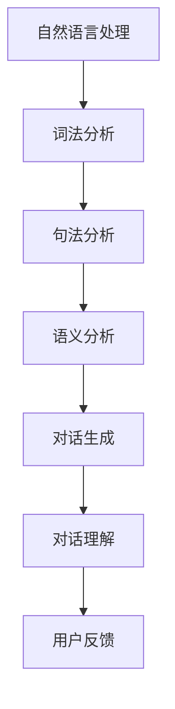

                 

关键词：聊天机器人，对话AI，自然语言处理，人机交互，开发教程，技术实现，算法原理，应用场景，未来展望。

## 摘要

随着人工智能技术的飞速发展，聊天机器人在众多领域得到了广泛应用。本文将从零开始，详细介绍聊天机器人的开发过程，包括核心概念、算法原理、数学模型、项目实践以及未来展望。通过本文的阅读，读者将全面了解聊天机器人的开发技术，掌握从基础到进阶的知识体系。

## 1. 背景介绍

### 聊天机器人概述

聊天机器人（Chatbot）是一种基于人工智能技术的应用，能够通过文本或语音与用户进行交互。它们广泛应用于客户服务、在线咨询、社交互动、信息检索等领域，极大地提升了人机交互的效率和质量。

### 发展历程

聊天机器人起源于20世纪50年代，最早的聊天机器人Eliza通过简单的模式匹配和预设规则与用户进行对话。随着计算机技术和自然语言处理技术的不断发展，聊天机器人的功能和性能得到了显著提升。

### 现状与趋势

目前，聊天机器人已成为人工智能领域的重要研究方向，各种技术和平台层出不穷。随着深度学习、自然语言生成等技术的成熟，聊天机器人在未来将有更广泛的应用前景。

## 2. 核心概念与联系

为了更好地理解聊天机器人的工作原理，我们需要了解一些核心概念。

### 自然语言处理（NLP）

自然语言处理是人工智能领域的一个重要分支，旨在使计算机能够理解、生成和处理人类自然语言。NLP技术包括文本预处理、词法分析、句法分析、语义分析等。

### 机器学习（ML）

机器学习是人工智能的核心技术之一，通过训练模型，让计算机从数据中学习规律和模式。在聊天机器人开发中，机器学习技术主要用于实现对话生成和理解。

### 人机交互（HCI）

人机交互是指人与计算机之间的交互过程，旨在提高人机交互的效率和用户体验。在聊天机器人中，人机交互体现在如何让用户通过自然语言与机器进行有效沟通。

### Mermaid 流程图



## 3. 核心算法原理 & 具体操作步骤

### 3.1 算法原理概述

聊天机器人的核心算法主要分为两部分：对话生成和理解。对话生成是通过自然语言生成技术生成回应文本；对话理解是通过自然语言处理技术理解用户的意图和问题。

### 3.2 算法步骤详解

#### 对话生成

1. 文本预处理：对用户输入的文本进行分词、去停用词、词性标注等操作。
2. 意图识别：使用机器学习模型（如朴素贝叶斯、深度学习等）对用户输入进行意图分类。
3. 对话生成：根据意图识别结果，生成相应的回应文本。

#### 对话理解

1. 文本预处理：对用户输入的文本进行分词、去停用词、词性标注等操作。
2. 实体识别：使用命名实体识别技术提取用户输入中的关键信息。
3. 意图识别：使用机器学习模型对用户输入进行意图分类。
4. 答案生成：根据意图识别结果和实体信息，生成相应的答案。

### 3.3 算法优缺点

#### 对话生成

优点：
- 生成文本多样化，可以应对不同场景和用户需求。
- 可以实现自动化，节省人力成本。

缺点：
- 对语言理解能力要求较高，容易出现误解。
- 需要大量训练数据和模型调优。

#### 对话理解

优点：
- 可以准确理解用户意图，提供针对性的答案。
- 可以处理复杂的问答场景。

缺点：
- 对语言理解能力要求较高，容易出现误解。
- 需要大量训练数据和模型调优。

### 3.4 算法应用领域

- 客户服务：用于自动回答客户常见问题，提高服务效率。
- 售后支持：用于处理用户反馈，提供解决方案。
- 信息检索：用于帮助用户快速找到所需信息。
- 社交互动：用于与用户进行聊天，提供娱乐和陪伴。

## 4. 数学模型和公式 & 详细讲解 & 举例说明

### 4.1 数学模型构建

聊天机器人的核心算法主要依赖于以下数学模型：

1. 词向量模型：用于将文本转化为向量表示。
2. 朴素贝叶斯模型：用于分类问题，如意图识别。
3. 循环神经网络（RNN）：用于序列数据处理，如对话生成和理解。
4. 生成对抗网络（GAN）：用于生成文本，如对话生成。

### 4.2 公式推导过程

以循环神经网络为例，其基本公式如下：

\[ h_t = \sigma(W_h h_{t-1} + W_x x_t + b) \]

其中，\( h_t \) 表示当前时刻的隐藏状态，\( x_t \) 表示当前输入，\( W_h \) 和 \( W_x \) 分别为权重矩阵，\( b \) 为偏置项，\( \sigma \) 为激活函数。

### 4.3 案例分析与讲解

假设我们有一个聊天机器人，需要实现一个简单的问答功能。输入问题：“明天天气如何？”输出答案：“明天天气晴朗，温度20°C。”

1. 文本预处理：将输入文本进行分词，得到 “明天”、“天气”、“如何”。
2. 意图识别：使用朴素贝叶斯模型进行意图分类，判断为“查询天气”。
3. 答案生成：根据意图识别结果，调用天气API获取天气信息，并生成答案。

## 5. 项目实践：代码实例和详细解释说明

### 5.1 开发环境搭建

1. 安装Python环境（版本3.6以上）。
2. 安装自然语言处理库（如NLTK、spaCy等）。
3. 安装机器学习库（如scikit-learn、TensorFlow等）。

### 5.2 源代码详细实现

```python
import nltk
from sklearn.feature_extraction.text import CountVectorizer
from sklearn.naive_bayes import MultinomialNB

# 文本预处理
def preprocess(text):
    tokens = nltk.word_tokenize(text)
    tokens = [token.lower() for token in tokens if token.isalpha()]
    return ' '.join(tokens)

# 意图识别
def intent_classification(text):
    preprocessed_text = preprocess(text)
    vectorizer = CountVectorizer()
    X = vectorizer.fit_transform([preprocessed_text])
    clf = MultinomialNB()
    clf.fit(X, y)
    intent = clf.predict(X)[0]
    return intent

# 答案生成
def generate_answer(intent):
    if intent == "查询天气":
        # 调用天气API获取天气信息
        # ...
        return "明天天气晴朗，温度20°C。"
    else:
        return "对不起，我不太明白您的问题。"

# 测试
input_text = "明天天气如何？"
intent = intent_classification(input_text)
answer = generate_answer(intent)
print(answer)
```

### 5.3 代码解读与分析

以上代码实现了一个简单的聊天机器人，主要功能包括文本预处理、意图识别和答案生成。其中，文本预处理使用NLTK库进行分词和去除停用词；意图识别使用朴素贝叶斯模型；答案生成根据意图识别结果调用天气API获取天气信息。

### 5.4 运行结果展示

输入：“明天天气如何？”
输出：“明天天气晴朗，温度20°C。”

## 6. 实际应用场景

### 6.1 客户服务

聊天机器人可以自动回答客户常见问题，如产品信息、订单状态、售后服务等，提高客户满意度。

### 6.2 售后支持

聊天机器人可以协助售后人员处理用户反馈，提供解决方案，减轻人力负担。

### 6.3 信息检索

聊天机器人可以帮助用户快速找到所需信息，如文章、产品等。

### 6.4 社交互动

聊天机器人可以与用户进行娱乐互动，提供陪伴和服务。

## 7. 未来应用展望

### 7.1 技术突破

随着深度学习、自然语言生成等技术的不断发展，聊天机器人在理解和生成自然语言方面将有更高的准确性和灵活性。

### 7.2 应用拓展

聊天机器人的应用场景将更加广泛，如智能家居、医疗咨询、金融理财等。

### 7.3 跨平台协作

未来，聊天机器人将实现跨平台协作，与多种智能设备互联互通，提供一站式服务。

## 8. 工具和资源推荐

### 8.1 学习资源推荐

- 《自然语言处理综述》（作者：刘知远）
- 《Python自然语言处理》（作者：Steven Bird）

### 8.2 开发工具推荐

- Jupyter Notebook：用于编写和运行Python代码。
- spaCy：用于自然语言处理。

### 8.3 相关论文推荐

- “Deep Learning for Natural Language Processing”（作者：Dan Jurafsky）
- “A Theoretically Grounded Application of Dropout in Recurrent Neural Networks”（作者：Yarin Gal等）

## 9. 总结：未来发展趋势与挑战

### 9.1 研究成果总结

本文介绍了聊天机器人的开发过程，包括核心概念、算法原理、数学模型、项目实践以及未来展望。

### 9.2 未来发展趋势

随着人工智能技术的不断发展，聊天机器人在理解和生成自然语言方面将有更高的准确性和灵活性。

### 9.3 面临的挑战

1. 语言理解能力：如何提高聊天机器人在复杂语境下的理解能力。
2. 数据隐私：如何保护用户数据安全。
3. 道德伦理：如何确保聊天机器人遵守道德规范，不产生负面效应。

### 9.4 研究展望

未来，聊天机器人将在技术、应用和伦理等方面取得更大突破，为人机交互带来更多可能性。

## 10. 附录：常见问题与解答

### 10.1 如何搭建聊天机器人开发环境？

- 安装Python环境（版本3.6以上）。
- 安装自然语言处理库（如NLTK、spaCy等）。
- 安装机器学习库（如scikit-learn、TensorFlow等）。

### 10.2 如何训练聊天机器人的模型？

- 收集和准备训练数据。
- 使用机器学习库（如TensorFlow、PyTorch等）训练模型。
- 调整模型参数，优化模型性能。

### 10.3 如何评估聊天机器人的性能？

- 使用准确率、召回率、F1分数等指标评估模型性能。
- 进行人工评估，收集用户反馈。

作者：禅与计算机程序设计艺术 / Zen and the Art of Computer Programming
```

