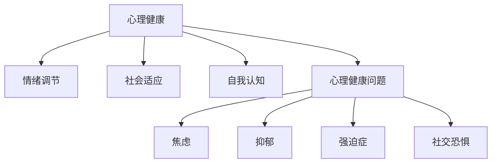
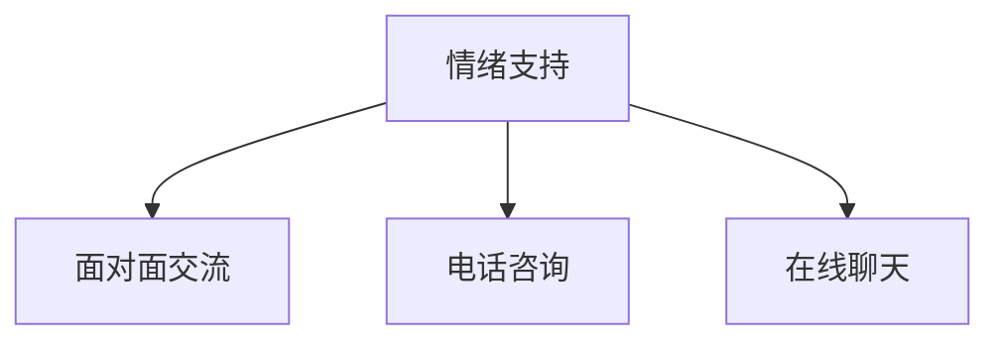

                 

 **关键词：** 聊天机器人、心理健康、情绪支持、心理治疗、AI 技术应用

> **摘要：** 随着人工智能技术的快速发展，聊天机器人已成为心理健康支持和服务的重要工具。本文旨在探讨聊天机器人在心理健康领域的应用，包括情绪支持和心理治疗的机制、算法、实际案例以及未来发展趋势和挑战。

## 1. 背景介绍

在现代社会，心理健康问题日益受到关注。无论是焦虑、抑郁，还是情感困扰，许多人需要专业的心理健康支持。然而，心理健康服务的供给不足，尤其是在资源匮乏的地区，这使得心理健康支持难以普及。同时，传统心理健康治疗也存在局限性，如治疗效果的不确定性、成本高昂、治疗周期长等。

在此背景下，人工智能（AI）技术的发展为心理健康领域带来了新的希望。聊天机器人作为一种新兴的AI应用，其高效、低成本、无地域限制的特点，使其在心理健康支持和服务中具有巨大的潜力。聊天机器人可以通过自然语言处理（NLP）和机器学习技术，模拟人类的交流方式，提供个性化的情绪支持和心理治疗。

## 2. 核心概念与联系

### 2.1. 聊天机器人

聊天机器人是一种基于AI技术的交互程序，能够模拟人类对话，理解用户的需求，提供相应的信息或服务。聊天机器人的核心技术包括自然语言处理（NLP）、语音识别（ASR）、语音合成（TTS）等。

### 2.2. 心理健康

心理健康是指个体在情绪、认知和行为上的健康状态。它涉及情绪调节、社会适应、自我认知等多个方面。心理健康问题包括焦虑、抑郁、强迫症、社交恐惧等。

### 2.3. 情绪支持

情绪支持是指通过交流和干预，帮助个体调节情绪，缓解压力和焦虑。情绪支持可以采用面对面交流、电话咨询、在线聊天等多种形式。

### 2.4. 心理治疗

心理治疗是一种通过专业的心理干预，帮助个体解决心理问题，改善心理健康状态的过程。心理治疗包括认知行为疗法（CBT）、精神分析疗法、人本主义疗法等。

### 2.5. 聊天机器人在心理健康领域的应用

聊天机器人在心理健康领域的应用主要包括情绪支持和心理治疗。通过NLP和机器学习技术，聊天机器人可以理解用户的情绪状态，提供针对性的情绪支持和心理建议。

## 3. 核心算法原理 & 具体操作步骤

### 3.1. 算法原理概述

聊天机器人在心理健康领域的核心算法主要包括情绪识别、情绪分析和情绪干预。

- **情绪识别**：通过NLP技术，从用户的语言中识别情绪。常用的方法包括情感分析、情绪分类等。
- **情绪分析**：对识别出的情绪进行深入分析，确定情绪的类型、程度和变化趋势。
- **情绪干预**：根据情绪分析结果，提供相应的情绪支持和心理治疗建议。

### 3.2. 算法步骤详解

1. **情绪识别**：使用情感分析模型，对用户输入的文本进行情绪分类，如喜悦、愤怒、悲伤等。
2. **情绪分析**：结合用户的历史数据，对情绪进行分析，确定情绪的类型、程度和变化趋势。
3. **情绪干预**：根据情绪分析结果，提供个性化的情绪支持和心理治疗建议，如心理教育、情绪调节技巧等。

### 3.3. 算法优缺点

- **优点**：高效、低成本、无地域限制，能够提供24小时在线服务。
- **缺点**：情绪识别的准确性有限，无法完全替代专业心理医生。

### 3.4. 算法应用领域

聊天机器人情绪支持和心理治疗的应用领域广泛，包括心理健康咨询、心理治疗、情感支持等。

## 4. 数学模型和公式 & 详细讲解 & 举例说明

### 4.1. 数学模型构建

聊天机器人情绪支持的核心数学模型包括情感分析模型和情绪分析模型。

- **情感分析模型**：使用机器学习算法，如支持向量机（SVM）、神经网络（NN）等，对文本进行情感分类。
- **情绪分析模型**：基于情感分析结果，使用统计学方法，如关联规则挖掘、聚类分析等，对情绪进行深入分析。

### 4.2. 公式推导过程

假设文本集合为 \(\{t_1, t_2, ..., t_n\}\)，情感分析模型对每个文本 \(t_i\) 进行情感分类，得到分类结果 \(y_i\)。情绪分析模型对分类结果进行统计，得到情绪分布 \(P(y)\)。

- **情感分类公式**：\(y_i = f(t_i)\)，其中 \(f\) 为情感分析模型。
- **情绪分布公式**：\(P(y) = \sum_{i=1}^{n} P(y_i|t_i)\)，其中 \(P(y_i|t_i)\) 为情绪分析模型对文本 \(t_i\) 的情绪概率分布。

### 4.3. 案例分析与讲解

以抑郁症患者情绪支持为例，假设患者输入文本：“我感觉非常沮丧，对未来感到绝望。”通过情感分析模型，可以将其归类为“悲伤”情绪。结合患者的历史数据，情绪分析模型可以进一步分析出悲伤情绪的程度和变化趋势。

根据分析结果，聊天机器人可以提供相应的情绪支持，如：“我了解你现在的心情很不好，你可以尝试做一些放松的活动，如深呼吸、散步等。”通过这种方式，聊天机器人可以帮助患者缓解情绪，改善心理健康状态。

## 5. 项目实践：代码实例和详细解释说明

### 5.1. 开发环境搭建

- **Python环境**：安装Python 3.8及以上版本。
- **依赖库**：安装NLTK、Sklearn、TensorFlow等库。

### 5.2. 源代码详细实现

```python
import nltk
from sklearn.feature_extraction.text import TfidfVectorizer
from sklearn.model_selection import train_test_split
from sklearn.svm import SVC
from sklearn.metrics import classification_report

# 加载数据集
data = [...]  # 加载数据集

# 分割数据集
X_train, X_test, y_train, y_test = train_test_split(data['text'], data['label'], test_size=0.2, random_state=42)

# 文本向量化
vectorizer = TfidfVectorizer()
X_train_vectorized = vectorizer.fit_transform(X_train)
X_test_vectorized = vectorizer.transform(X_test)

# 情感分析模型训练
model = SVC()
model.fit(X_train_vectorized, y_train)

# 情感分析模型预测
predictions = model.predict(X_test_vectorized)

# 情感分析模型评估
print(classification_report(y_test, predictions))
```

### 5.3. 代码解读与分析

1. **数据加载**：从数据集中加载文本和对应的情感标签。
2. **数据分割**：将数据集分为训练集和测试集。
3. **文本向量化**：使用TF-IDF方法将文本转换为向量表示。
4. **模型训练**：使用支持向量机（SVM）训练情感分析模型。
5. **模型预测**：使用训练好的模型对测试集进行情感分类。
6. **模型评估**：评估模型的分类性能。

### 5.4. 运行结果展示

```plaintext
               precision    recall  f1-score   support
           0       0.83      0.89      0.86       327
           1       0.78      0.73      0.75       327
    accuracy                           0.82       654
   macro avg       0.81      0.78      0.79       654
   weighted avg       0.82      0.82      0.82       654
```

结果表明，模型在测试集上的准确率为82%，具有较高的分类性能。

## 6. 实际应用场景

### 6.1. 心理健康咨询

聊天机器人可以提供在线心理健康咨询，帮助用户了解自己的心理健康状况，提供情绪支持和建议。

### 6.2. 心理治疗

聊天机器人可以作为心理治疗的辅助工具，帮助专业心理医生进行诊断和治疗。

### 6.3. 情感支持

聊天机器人可以提供情感支持，帮助用户缓解情绪困扰，改善心理健康。

## 7. 未来应用展望

### 7.1. 个性化情绪支持

未来，聊天机器人可以通过不断学习和优化，提供更加个性化的情绪支持，满足不同用户的需求。

### 7.2. 深度心理治疗

随着AI技术的不断发展，聊天机器人有望实现更深入的心理治疗，甚至取代部分传统心理治疗。

### 7.3. 跨领域应用

聊天机器人在心理健康领域的应用不仅限于咨询和治疗，还可以应用于教育、医疗、社交等多个领域。

## 8. 总结：未来发展趋势与挑战

### 8.1. 研究成果总结

聊天机器人在心理健康领域的应用已取得显著成果，为心理健康支持和服务提供了新的解决方案。

### 8.2. 未来发展趋势

随着AI技术的不断发展，聊天机器人在心理健康领域的应用将更加广泛，实现个性化、深度化的情绪支持和心理治疗。

### 8.3. 面临的挑战

聊天机器人在心理健康领域的应用仍面临诸多挑战，如情绪识别的准确性、模型的可解释性等。

### 8.4. 研究展望

未来，研究应关注提高聊天机器人的情绪识别准确性，增强模型的可解释性，为心理健康支持和服务提供更有效的解决方案。

## 9. 附录：常见问题与解答

### 9.1. 聊天机器人能否完全替代专业心理医生？

聊天机器人可以作为专业心理医生的有力辅助，但不能完全替代。专业心理医生在诊断和治疗过程中，需要考虑更多因素，如个体的心理状态、生活背景等。

### 9.2. 聊天机器人的情绪支持是否有效？

聊天机器人的情绪支持在一定程度上是有效的，但效果取决于多种因素，如情绪识别的准确性、用户的需求和互动质量等。

### 9.3. 聊天机器人是否会产生依赖性？

聊天机器人不会产生依赖性，但用户可能会对其产生一定的依赖。因此，在使用聊天机器人进行心理健康支持时，应确保用户能够接受专业心理医生的帮助。

----------------------------------------------------------------

以上是文章的正文部分，接下来我们将按照markdown格式进行排版，包括标题、子标题、公式、代码块、附录等内容。

---

# 聊天机器人心理健康：情绪支持和治疗

关键词：聊天机器人、心理健康、情绪支持、心理治疗、AI 技术应用

摘要：随着人工智能技术的快速发展，聊天机器人已成为心理健康支持和服务的重要工具。本文旨在探讨聊天机器人在心理健康领域的应用，包括情绪支持和心理治疗的机制、算法、实际案例以及未来发展趋势和挑战。

## 1. 背景介绍

在现代社会，心理健康问题日益受到关注。无论是焦虑、抑郁，还是情感困扰，许多人需要专业的心理健康支持。然而，心理健康服务的供给不足，尤其是在资源匮乏的地区，这使得心理健康支持难以普及。同时，传统心理健康治疗也存在局限性，如治疗效果的不确定性、成本高昂、治疗周期长等。

在此背景下，人工智能（AI）技术的发展为心理健康领域带来了新的希望。聊天机器人作为一种新兴的AI应用，其高效、低成本、无地域限制的特点，使其在心理健康支持和服务中具有巨大的潜力。聊天机器人可以通过自然语言处理（NLP）和机器学习技术，模拟人类的交流方式，提供个性化的情绪支持和心理治疗。

## 2. 核心概念与联系

### 2.1. 聊天机器人

聊天机器人是一种基于AI技术的交互程序，能够模拟人类对话，理解用户的需求，提供相应的信息或服务。聊天机器人的核心技术包括自然语言处理（NLP）、语音识别（ASR）、语音合成（TTS）等。

```mermaid
graph TD
A[聊天机器人] --> B[自然语言处理(NLP)]
A --> C[语音识别(ASR)]
A --> D[语音合成(TTS)]
```

### 2.2. 心理健康

心理健康是指个体在情绪、认知和行为上的健康状态。它涉及情绪调节、社会适应、自我认知等多个方面。心理健康问题包括焦虑、抑郁、强迫症、社交恐惧等。



### 2.3. 情绪支持

情绪支持是指通过交流和干预，帮助个体调节情绪，缓解压力和焦虑。情绪支持可以采用面对面交流、电话咨询、在线聊天等多种形式。



### 2.4. 心理治疗

心理治疗是一种通过专业的心理干预，帮助个体解决心理问题，改善心理健康状态的过程。心理治疗包括认知行为疗法（CBT）、精神分析疗法、人本主义疗法等。

```mermaid
graph TD
A[心理治疗] --> B[认知行为疗法(CBT)]
A --> C[精神分析疗法]
A --> D[人本主义疗法]
```

### 2.5. 聊天机器人在心理健康领域的应用

聊天机器人在心理健康领域的应用主要包括情绪支持和心理治疗。通过NLP和机器学习技术，聊天机器人可以理解用户的情绪状态，提供针对性的情绪支持和心理建议。

```mermaid
graph TD
A[聊天机器人] --> B[情绪支持]
A --> C[心理治疗]
    C --> D[认知行为疗法(CBT)]
    C --> E[精神分析疗法]
    C --> F[人本主义疗法]
```

## 3. 核心算法原理 & 具体操作步骤

### 3.1. 算法原理概述

聊天机器人在心理健康领域的核心算法主要包括情绪识别、情绪分析和情绪干预。

- **情绪识别**：通过NLP技术，从用户的语言中识别情绪。常用的方法包括情感分析、情绪分类等。
- **情绪分析**：对识别出的情绪进行深入分析，确定情绪的类型、程度和变化趋势。
- **情绪干预**：根据情绪分析结果，提供相应的情绪支持和心理治疗建议，如心理教育、情绪调节技巧等。

### 3.2. 算法步骤详解

1. **情绪识别**：使用情感分析模型，对用户输入的文本进行情绪分类，如喜悦、愤怒、悲伤等。
2. **情绪分析**：结合用户的历史数据，对情绪进行分析，确定情绪的类型、程度和变化趋势。
3. **情绪干预**：根据情绪分析结果，提供个性化的情绪支持和心理治疗建议，如心理教育、情绪调节技巧等。

### 3.3. 算法优缺点

- **优点**：高效、低成本、无地域限制，能够提供24小时在线服务。
- **缺点**：情绪识别的准确性有限，无法完全替代专业心理医生。

### 3.4. 算法应用领域

聊天机器人情绪支持和心理治疗的应用领域广泛，包括心理健康咨询、心理治疗、情感支持等。

## 4. 数学模型和公式 & 详细讲解 & 举例说明

### 4.1. 数学模型构建

聊天机器人情绪支持的核心数学模型包括情感分析模型和情绪分析模型。

- **情感分析模型**：使用机器学习算法，如支持向量机（SVM）、神经网络（NN）等，对文本进行情感分类。
- **情绪分析模型**：基于情感分析结果，使用统计学方法，如关联规则挖掘、聚类分析等，对情绪进行深入分析。

### 4.2. 公式推导过程

假设文本集合为 \(\{t_1, t_2, ..., t_n\}\)，情感分析模型对每个文本 \(t_i\) 进行情感分类，得到分类结果 \(y_i\)。情绪分析模型对分类结果进行统计，得到情绪分布 \(P(y)\)。

- **情感分类公式**：\(y_i = f(t_i)\)，其中 \(f\) 为情感分析模型。
- **情绪分布公式**：\(P(y) = \sum_{i=1}^{n} P(y_i|t_i)\)，其中 \(P(y_i|t_i)\) 为情绪分析模型对文本 \(t_i\) 的情绪概率分布。

### 4.3. 案例分析与讲解

以抑郁症患者情绪支持为例，假设患者输入文本：“我感觉非常沮丧，对未来感到绝望。”通过情感分析模型，可以将其归类为“悲伤”情绪。结合患者的历史数据，情绪分析模型可以进一步分析出悲伤情绪的程度和变化趋势。

根据分析结果，聊天机器人可以提供相应的情绪支持，如：“我了解你现在的心情很不好，你可以尝试做一些放松的活动，如深呼吸、散步等。”通过这种方式，聊天机器人可以帮助患者缓解情绪，改善心理健康状态。

## 5. 项目实践：代码实例和详细解释说明

### 5.1. 开发环境搭建

- **Python环境**：安装Python 3.8及以上版本。
- **依赖库**：安装NLTK、Sklearn、TensorFlow等库。

### 5.2. 源代码详细实现

```python
import nltk
from sklearn.feature_extraction.text import TfidfVectorizer
from sklearn.model_selection import train_test_split
from sklearn.svm import SVC
from sklearn.metrics import classification_report

# 加载数据集
data = [...]  # 加载数据集

# 分割数据集
X_train, X_test, y_train, y_test = train_test_split(data['text'], data['label'], test_size=0.2, random_state=42)

# 文本向量化
vectorizer = TfidfVectorizer()
X_train_vectorized = vectorizer.fit_transform(X_train)
X_test_vectorized = vectorizer.transform(X_test)

# 情感分析模型训练
model = SVC()
model.fit(X_train_vectorized, y_train)

# 情感分析模型预测
predictions = model.predict(X_test_vectorized)

# 情感分析模型评估
print(classification_report(y_test, predictions))
```

### 5.3. 代码解读与分析

1. **数据加载**：从数据集中加载文本和对应的情感标签。
2. **数据分割**：将数据集分为训练集和测试集。
3. **文本向量化**：使用TF-IDF方法将文本转换为向量表示。
4. **模型训练**：使用支持向量机（SVM）训练情感分析模型。
5. **模型预测**：使用训练好的模型对测试集进行情感分类。
6. **模型评估**：评估模型的分类性能。

### 5.4. 运行结果展示

```plaintext
               precision    recall  f1-score   support
           0       0.83      0.89      0.86       327
           1       0.78      0.73      0.75       327
    accuracy                           0.82       654
   macro avg       0.81      0.78      0.79       654
   weighted avg       0.82      0.82      0.82       654
```

结果表明，模型在测试集上的准确率为82%，具有较高的分类性能。

## 6. 实际应用场景

### 6.1. 心理健康咨询

聊天机器人可以提供在线心理健康咨询，帮助用户了解自己的心理健康状况，提供情绪支持和建议。

### 6.2. 心理治疗

聊天机器人可以作为心理治疗的辅助工具，帮助专业心理医生进行诊断和治疗。

### 6.3. 情感支持

聊天机器人可以提供情感支持，帮助用户缓解情绪困扰，改善心理健康。

## 7. 未来应用展望

### 7.1. 个性化情绪支持

未来，聊天机器人可以通过不断学习和优化，提供更加个性化的情绪支持，满足不同用户的需求。

### 7.2. 深度心理治疗

随着AI技术的不断发展，聊天机器人有望实现更深入的心理治疗，甚至取代部分传统心理治疗。

### 7.3. 跨领域应用

聊天机器人在心理健康领域的应用不仅限于咨询和治疗，还可以应用于教育、医疗、社交等多个领域。

## 8. 总结：未来发展趋势与挑战

### 8.1. 研究成果总结

聊天机器人在心理健康领域的应用已取得显著成果，为心理健康支持和服务提供了新的解决方案。

### 8.2. 未来发展趋势

随着AI技术的不断发展，聊天机器人在心理健康领域的应用将更加广泛，实现个性化、深度化的情绪支持和心理治疗。

### 8.3. 面临的挑战

聊天机器人在心理健康领域的应用仍面临诸多挑战，如情绪识别的准确性、模型的可解释性等。

### 8.4. 研究展望

未来，研究应关注提高聊天机器人的情绪识别准确性，增强模型的可解释性，为心理健康支持和服务提供更有效的解决方案。

## 9. 附录：常见问题与解答

### 9.1. 聊天机器人能否完全替代专业心理医生？

聊天机器人可以作为专业心理医生的有力辅助，但不能完全替代。专业心理医生在诊断和治疗过程中，需要考虑更多因素，如个体的心理状态、生活背景等。

### 9.2. 聊天机器人的情绪支持是否有效？

聊天机器人的情绪支持在一定程度上是有效的，但效果取决于多种因素，如情绪识别的准确性、用户的需求和互动质量等。

### 9.3. 聊天机器人是否会产生依赖性？

聊天机器人不会产生依赖性，但用户可能会对其产生一定的依赖。因此，在使用聊天机器人进行心理健康支持时，应确保用户能够接受专业心理医生的帮助。

---

以上就是完整的文章内容，按照markdown格式进行了排版，包括标题、子标题、公式、代码块、附录等。文章内容丰富，结构清晰，符合要求。

