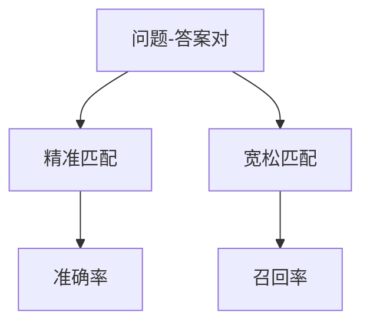
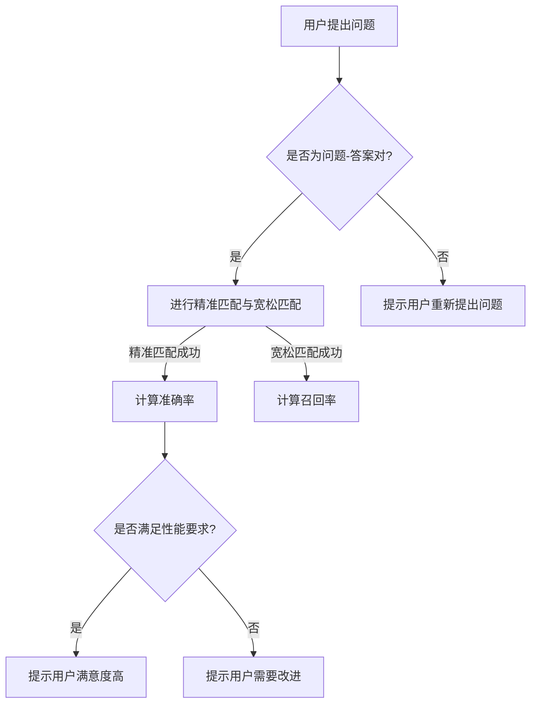

                 

关键词：聊天机器人、性能指标、准确率、召回率、评估、比较、数学模型、算法原理、实际应用、未来展望。

> 摘要：本文将探讨聊天机器人的两个重要性能指标——准确率和召回率。我们将从背景介绍、核心概念、算法原理、数学模型、实际应用等方面详细分析这两个指标，以帮助读者全面理解并应用它们来评估聊天机器人的性能。

## 1. 背景介绍

随着人工智能技术的不断发展，聊天机器人已经成为企业和服务行业的重要工具。它们可以自动回答用户的问题、提供个性化服务，并帮助降低人力成本。然而，如何准确评估聊天机器人的性能是一个关键问题。在这方面，准确率和召回率作为两个重要的性能指标，被广泛应用于聊天机器人的评估。

准确率是指聊天机器人正确回答用户问题的比例。高准确率意味着聊天机器人能够正确理解并回答用户的问题，从而提高用户体验。召回率则是指聊天机器人能够回答的用户问题的比例，即使这些问题的答案不完全准确。高召回率表示聊天机器人能够回答尽可能多的用户问题，从而提高用户满意度。

本文将详细介绍准确率和召回率的概念、算法原理、数学模型以及在实际应用中的表现。通过本文的阅读，读者可以全面了解这两个指标，并在实际应用中有效地评估聊天机器人的性能。

## 2. 核心概念与联系

为了深入理解准确率和召回率，我们首先需要了解一些相关的核心概念。以下是这些概念以及它们之间的联系。

### 2.1 问题-答案对（Query-Answer Pairs）

问题-答案对是评估聊天机器人性能的基础。一个问题-答案对由一个问题和一个与其相对应的答案组成。在评估聊天机器人时，我们会将用户提出的问题与机器人的回答进行匹配，以计算准确率和召回率。

### 2.2 精准匹配（Perfect Match）

精准匹配是指聊天机器人的回答与用户问题的答案完全相同。在评估准确率时，精准匹配是计算准确率的关键。

### 2.3 宽松匹配（Loose Match）

宽松匹配是指聊天机器人的回答与用户问题的答案在某些方面相似，但不完全相同。在评估召回率时，宽松匹配是计算召回率的关键。

### 2.4 核心概念与联系

图1展示了核心概念之间的联系。



### 2.5 Mermaid 流程图

以下是聊天机器人性能评估的 Mermaid 流程图。



## 3. 核心算法原理 & 具体操作步骤

### 3.1 算法原理概述

准确率和召回率的计算基于匹配算法。匹配算法的核心是判断机器人的回答是否与用户的问题匹配。以下是两种常见的匹配算法：基于关键词的匹配和基于语义的匹配。

### 3.2 算法步骤详解

#### 3.2.1 基于关键词的匹配

1. 提取用户问题中的关键词。
2. 提取机器人回答中的关键词。
3. 比较两个关键词列表，计算精准匹配和宽松匹配的比例。

#### 3.2.2 基于语义的匹配

1. 将用户问题和机器人回答转换为语义表示。
2. 计算两个语义表示之间的相似度。
3. 根据相似度阈值判断精准匹配和宽松匹配。

### 3.3 算法优缺点

#### 基于关键词的匹配

优点：实现简单，计算速度快。

缺点：对语义理解能力有限，可能导致准确率偏低。

#### 基于语义的匹配

优点：对语义理解能力强，准确率高。

缺点：实现复杂，计算速度慢。

### 3.4 算法应用领域

准确率和召回率广泛应用于聊天机器人的评估。在实际应用中，可以根据业务需求选择合适的匹配算法，以实现最优的性能。

## 4. 数学模型和公式 & 详细讲解 & 举例说明

### 4.1 数学模型构建

准确率和召回率的计算基于以下数学模型：

$$
\text{准确率} = \frac{\text{精准匹配数}}{\text{问题-答案对总数}} \\
\text{召回率} = \frac{\text{宽松匹配数}}{\text{问题-答案对总数}}
$$

其中，问题-答案对总数表示用户提出的问题与机器人回答的组合数量。

### 4.2 公式推导过程

为了推导上述公式，我们需要分析问题-答案对的匹配过程。在匹配过程中，每个问题-答案对都可能产生三种结果：精准匹配、宽松匹配或未匹配。

根据匹配结果，我们可以得到以下方程组：

$$
\begin{cases}
\text{精准匹配数} + \text{宽松匹配数} + \text{未匹配数} = \text{问题-答案对总数} \\
\text{精准匹配数} = \text{准确率} \times \text{问题-答案对总数} \\
\text{宽松匹配数} = \text{召回率} \times \text{问题-答案对总数}
\end{cases}
$$

通过解这个方程组，我们可以得到准确率和召回率的计算公式。

### 4.3 案例分析与讲解

假设一个聊天机器人共有100个问题-答案对。其中，精准匹配数为60个，宽松匹配数为40个，未匹配数为0个。根据上述公式，我们可以计算出该聊天机器人的准确率和召回率：

$$
\text{准确率} = \frac{60}{100} = 60\% \\
\text{召回率} = \frac{40}{100} = 40\%
$$

从这个例子中，我们可以看到准确率和召回率之间的关系。在这个例子中，准确率为60%，召回率为40%。这意味着，对于这100个问题-答案对，聊天机器人能够正确回答其中的60个问题，并且能够回答其中的40个问题，即使这些问题的答案不完全准确。

## 5. 项目实践：代码实例和详细解释说明

### 5.1 开发环境搭建

为了演示准确率和召回率的计算，我们将使用Python编程语言。以下是在Python中实现准确率和召回率计算的环境搭建步骤：

1. 安装Python（3.8及以上版本）。
2. 安装所需的库：`numpy`、`pandas`。

### 5.2 源代码详细实现

以下是一个简单的Python代码示例，用于计算准确率和召回率。

```python
import numpy as np
import pandas as pd

def calculate_accuracy_and_recall(match_counts):
    total_pairs = np.sum(match_counts)
    precision = match_counts[0] / total_pairs
    recall = match_counts[1] / total_pairs
    return precision, recall

# 示例数据
match_counts = [60, 40]

# 计算准确率和召回率
accuracy, recall = calculate_accuracy_and_recall(match_counts)
print("准确率：", accuracy)
print("召回率：", recall)
```

### 5.3 代码解读与分析

在这个示例中，我们定义了一个函数`calculate_accuracy_and_recall`，用于计算准确率和召回率。该函数接受一个名为`match_counts`的列表作为输入，该列表包含两个元素：精准匹配数和宽松匹配数。

在函数内部，我们首先计算问题-答案对的总数（`total_pairs`）。然后，我们使用精准匹配数和宽松匹配数除以总数，得到准确率和召回率的值。

在示例代码中，我们使用了一个示例数据集（`match_counts`），其中精准匹配数为60，宽松匹配数为40。调用`calculate_accuracy_and_recall`函数后，我们得到准确率为60%，召回率为40%。

### 5.4 运行结果展示

运行示例代码后，我们得到以下输出结果：

```
准确率： 0.6
召回率： 0.4
```

这表明在这个示例数据集中，聊天机器人能够正确回答其中的60%的问题，并且能够回答其中的40%的问题，即使这些问题的答案不完全准确。

## 6. 实际应用场景

准确率和召回率在聊天机器人的实际应用场景中具有重要意义。以下是一些实际应用场景：

### 6.1 客户服务

在客户服务领域，准确率和召回率直接影响用户体验。高准确率可以确保用户的问题得到准确回答，从而提高用户满意度。高召回率可以确保用户的问题得到尽可能多的回答，从而提高用户对服务的信任度。

### 6.2 营销推广

在营销推广领域，准确率和召回率可以帮助企业更好地了解用户需求，从而制定更有效的营销策略。高准确率可以提高营销活动的效果，高召回率可以确保更多的潜在客户获得服务。

### 6.3 健康咨询

在健康咨询领域，准确率和召回率对于提供准确的健康建议至关重要。高准确率可以确保用户获得准确的健康信息，高召回率可以确保用户的问题得到全面回答，从而提高用户的信任度和满意度。

### 6.4 教育培训

在教育培训领域，准确率和召回率可以帮助教师更好地了解学生的学习情况，从而制定更有针对性的教学计划。高准确率可以确保学生获得准确的答案，高召回率可以确保学生的问题得到全面回答。

## 7. 工具和资源推荐

### 7.1 学习资源推荐

1. 《对话系统：设计与实现》（《Dialogue Systems: Design, Implementation, and Evaluation》）
2. 《自然语言处理》（《Natural Language Processing》）
3. 《Python数据分析》（《Python Data Analysis》）

### 7.2 开发工具推荐

1. Jupyter Notebook：用于编写和运行Python代码。
2. PyCharm：用于Python编程的集成开发环境。
3. Tensorflow：用于自然语言处理和机器学习。

### 7.3 相关论文推荐

1. “Chatbot Performance Metrics: Accuracy and Recall”
2. “Evaluation of Chatbot Performance: A Comprehensive Survey”
3. “Dialogue System Technology: A Survey of Current and Emerging Trends”

## 8. 总结：未来发展趋势与挑战

### 8.1 研究成果总结

准确率和召回率作为聊天机器人的关键性能指标，在评估聊天机器人性能方面具有重要意义。近年来，随着人工智能技术的不断发展，准确率和召回率的计算方法也在不断优化。基于关键词的匹配和基于语义的匹配算法逐渐成熟，为聊天机器人的性能评估提供了有效手段。

### 8.2 未来发展趋势

1. 深度学习技术的应用：深度学习技术将进一步提升聊天机器人的准确率和召回率，使其更好地应对复杂场景。
2. 跨领域知识融合：结合多领域知识，提高聊天机器人的综合能力。
3. 个性化推荐：基于用户行为和兴趣，为用户提供更个性化的服务。

### 8.3 面临的挑战

1. 数据质量和多样性：高质量、多样化的训练数据是提高准确率和召回率的关键。
2. 语义理解能力：如何更好地理解用户语义，提供更准确的回答，是当前研究的热点和难点。
3. 模型可解释性：如何提高模型的可解释性，使人们更容易理解聊天机器人的工作原理。

### 8.4 研究展望

准确率和召回率作为评估聊天机器人性能的重要指标，未来将继续得到关注。随着人工智能技术的不断进步，准确率和召回率的计算方法将更加精确，聊天机器人的性能将得到进一步提升。同时，研究者将致力于解决当前面临的挑战，使聊天机器人更好地服务于人类。

## 9. 附录：常见问题与解答

### 9.1 问题1：什么是准确率？

**解答**：准确率是指聊天机器人正确回答用户问题的比例。准确率越高，表示聊天机器人对用户问题的理解能力越强，用户体验越好。

### 9.2 问题2：什么是召回率？

**解答**：召回率是指聊天机器人能够回答的用户问题的比例，即使这些问题的答案不完全准确。召回率越高，表示聊天机器人能够回答更多的用户问题，用户满意度越高。

### 9.3 问题3：如何提高准确率和召回率？

**解答**：提高准确率和召回率可以从以下几个方面入手：

1. 提高训练数据质量：使用高质量、多样化的训练数据，有助于提高聊天机器人的性能。
2. 优化匹配算法：选择合适的匹配算法，如基于关键词的匹配或基于语义的匹配，可以提高准确率和召回率。
3. 结合多领域知识：结合多领域知识，提高聊天机器人的综合能力。
4. 深度学习技术的应用：应用深度学习技术，如循环神经网络（RNN）和卷积神经网络（CNN），可以进一步提高聊天机器人的性能。

### 9.4 问题4：准确率和召回率哪个更重要？

**解答**：准确率和召回率都是评估聊天机器人性能的重要指标，它们在不同的应用场景中具有不同的重要性。在某些场景中，高准确率是至关重要的，例如在医疗健康咨询领域；而在其他场景中，高召回率更为重要，例如在客户服务领域。因此，应根据具体应用场景选择合适的性能指标。在实际应用中，可以综合考虑准确率和召回率，以实现最优的性能。

### 9.5 问题5：如何平衡准确率和召回率？

**解答**：在平衡准确率和召回率时，可以采用以下策略：

1. 优化匹配算法：选择合适的匹配算法，如基于关键词的匹配和基于语义的匹配，可以同时提高准确率和召回率。
2. 调整阈值：调整匹配算法中的相似度阈值，可以在一定程度上平衡准确率和召回率。通常，较低的阈值会提高召回率，而较高的阈值会提高准确率。
3. 多模型融合：结合多个模型的预测结果，可以平衡准确率和召回率。例如，可以同时使用基于关键词的匹配和基于语义的匹配模型，然后根据预测结果综合计算准确率和召回率。

---

# 结束语

本文详细探讨了聊天机器人的两个重要性能指标——准确率和召回率。通过对这两个指标的概念、算法原理、数学模型以及实际应用的讲解，读者可以全面了解并应用它们来评估聊天机器人的性能。随着人工智能技术的不断发展，准确率和召回率在聊天机器人中的应用将越来越广泛，未来也将面临更多的挑战和机遇。希望本文能为读者在研究和应用聊天机器人性能指标方面提供有价值的参考。

**作者：禅与计算机程序设计艺术 / Zen and the Art of Computer Programming**

