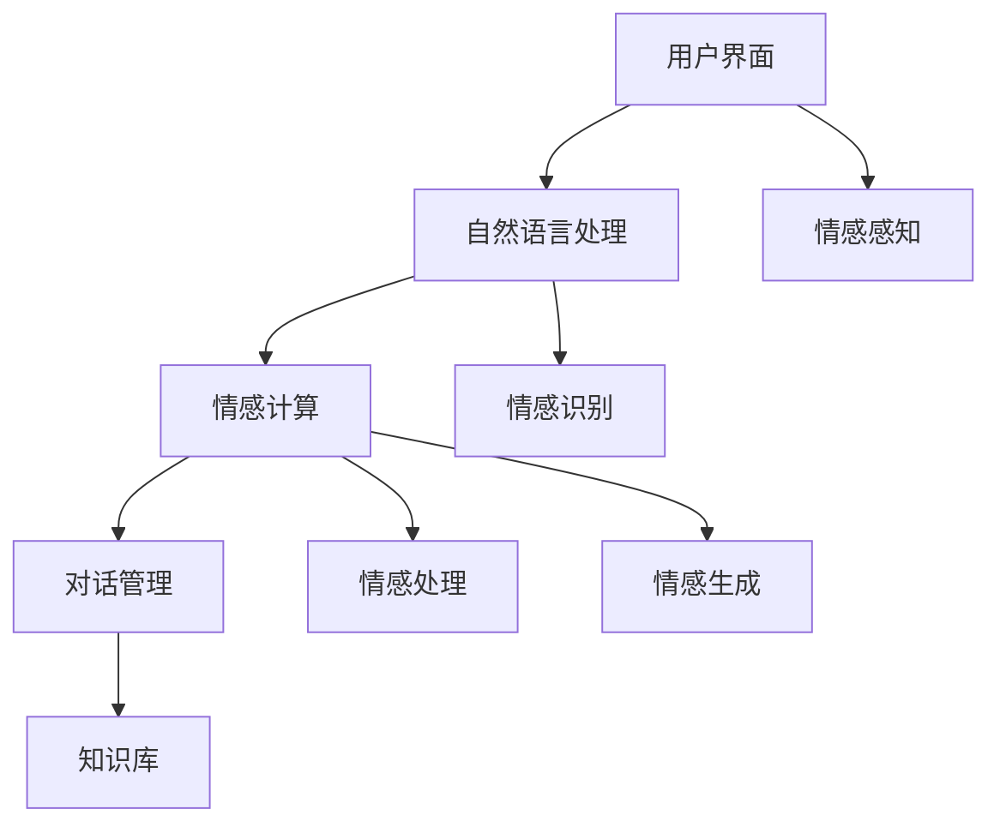

                 

在未来，聊天机器人将不仅仅是一个简单的交互工具，它们将成为我们的伙伴、朋友，甚至是情感的支柱。本文将探讨聊天机器人情感连接的原理、核心算法、应用领域，以及未来可能面临的挑战和趋势。

## 关键词

- 聊天机器人
- 情感连接
- 人工智能
- 情感计算
- 人机交互

## 摘要

本文首先介绍了聊天机器人的发展背景和现状，然后深入探讨了聊天机器人情感连接的核心概念、算法原理及其应用领域。接着，文章详细讲解了数学模型和公式，并提供了代码实例和实践。最后，文章总结了当前的研究成果，探讨了未来发展趋势与挑战，并提出了相应的工具和资源推荐。

## 1. 背景介绍

随着人工智能技术的飞速发展，聊天机器人已经成为日常生活中不可或缺的一部分。从简单的客服机器人到复杂的情感陪伴机器人，聊天机器人的应用场景越来越广泛。然而，尽管聊天机器人已经具备了高度的智能，但它们仍然难以与人类建立深层次的情感连接。

为了解决这一问题，研究者们开始将情感计算技术引入到聊天机器人中。情感计算是一种通过感知、识别、处理和生成情感信息来改善人机交互的技术。通过情感计算，聊天机器人可以更好地理解用户情感，提供更加个性化和贴心的服务。

## 2. 核心概念与联系

### 2.1 情感计算

情感计算是指通过感知、识别、处理和生成情感信息来改善人机交互的技术。它包括以下几个方面：

1. **情感感知**：通过语音、文字、面部表情等渠道感知用户情感。
2. **情感识别**：利用机器学习和自然语言处理技术，从感知到的信息中识别用户的情感状态。
3. **情感处理**：根据识别到的情感状态，调整聊天机器人的行为和响应。
4. **情感生成**：根据用户情感状态，生成适当的情感反馈，以建立情感连接。

### 2.2 聊天机器人架构

聊天机器人通常由以下几个模块组成：

1. **用户界面**：提供与用户交互的接口，包括语音、文字、图像等多种形式。
2. **自然语言处理**：负责理解用户输入的自然语言，提取关键信息。
3. **情感计算**：根据自然语言处理的结果，感知、识别和处理用户情感。
4. **对话管理**：负责对话的流程控制，包括对话的切换、上下文的维护等。
5. **知识库**：存储聊天机器人的知识，用于回答用户的问题。

### 2.3 Mermaid 流程图



## 3. 核心算法原理 & 具体操作步骤

### 3.1 算法原理概述

聊天机器人情感连接的核心算法主要包括情感感知、情感识别、情感处理和情感生成。这些算法的工作原理如下：

1. **情感感知**：通过语音、文字、面部表情等渠道收集用户情感信息。
2. **情感识别**：利用机器学习和自然语言处理技术，从感知到的信息中识别用户的情感状态。
3. **情感处理**：根据识别到的情感状态，调整聊天机器人的行为和响应。
4. **情感生成**：根据用户情感状态，生成适当的情感反馈，以建立情感连接。

### 3.2 算法步骤详解

1. **情感感知**：
    - 语音识别：使用语音识别技术将用户语音转换为文本。
    - 文字情感分析：使用自然语言处理技术，分析用户文本的情感倾向。
    - 面部表情识别：使用计算机视觉技术，识别用户面部表情的情感状态。

2. **情感识别**：
    - 利用情感词典：通过情感词典，对用户输入的文本进行情感分类。
    - 利用情感模型：使用训练好的情感模型，对用户输入的文本进行情感识别。

3. **情感处理**：
    - 调整响应策略：根据用户情感状态，调整聊天机器人的响应策略，例如语气、内容等。
    - 维护情感平衡：在对话过程中，维持聊天机器人和用户之间的情感平衡，避免过度热情或冷漠。

4. **情感生成**：
    - 生成情感响应：根据用户情感状态，生成适当的情感响应。
    - 利用情感模拟：通过情感模拟，使聊天机器人更好地理解用户情感，并生成相应的情感反馈。

### 3.3 算法优缺点

**优点**：
1. **个性化交互**：通过情感计算，聊天机器人可以提供更加个性化和贴心的服务。
2. **情感理解**：聊天机器人能够更好地理解用户情感，提高用户满意度。
3. **情感连接**：通过情感连接，聊天机器人可以与用户建立更深层次的互动。

**缺点**：
1. **情感识别准确性**：情感识别的准确性受到多种因素的影响，如语境、情感表达方式等。
2. **情感平衡**：在对话过程中，保持情感平衡是一个挑战。
3. **情感生成**：生成适当的情感反馈需要大量的训练数据和模型优化。

### 3.4 算法应用领域

1. **客服领域**：提供个性化、贴心的客服服务，提高用户满意度。
2. **情感陪伴**：为孤独、抑郁等用户提供情感支持和陪伴。
3. **教育领域**：提供个性化、互动式的学习体验，提高学习效果。
4. **心理健康**：辅助心理健康专家，提供专业的心理咨询服务。

## 4. 数学模型和公式 & 详细讲解 & 举例说明

### 4.1 数学模型构建

聊天机器人情感连接的数学模型主要包括以下几个部分：

1. **情感感知模型**：用于感知用户情感，通常采用神经网络模型。
2. **情感识别模型**：用于识别用户情感，通常采用分类模型。
3. **情感处理模型**：用于处理用户情感，通常采用决策树、规则引擎等模型。
4. **情感生成模型**：用于生成情感反馈，通常采用生成对抗网络（GAN）等模型。

### 4.2 公式推导过程

1. **情感感知模型**：

   $$情感感知 = f(语音，文本，面部表情)$$

   其中，$f$ 表示感知函数，$语音，文本，面部表情$ 分别表示用户情感的三种渠道。

2. **情感识别模型**：

   $$情感识别 = g(情感感知)$$

   其中，$g$ 表示识别函数，$情感感知$ 表示感知到的用户情感。

3. **情感处理模型**：

   $$情感处理 = h(情感识别)$$

   其中，$h$ 表示处理函数，$情感识别$ 表示识别到的用户情感。

4. **情感生成模型**：

   $$情感生成 = k(情感处理)$$

   其中，$k$ 表示生成函数，$情感处理$ 表示处理后的用户情感。

### 4.3 案例分析与讲解

假设用户输入了一段文本：“我很不开心，因为我失去了工作。”，我们通过以下步骤进行情感计算：

1. **情感感知**：
    - 语音识别：用户语音中带有明显的低沉和缓慢的语调。
    - 文本情感分析：文本中的关键词如“不开心”，“失去工作”表明用户情感为负面。
    - 面部表情识别：用户面部表情显示沮丧和悲伤。

2. **情感识别**：
    - 利用情感词典：文本和语音中的情感词汇表明用户情感为负面。
    - 利用情感模型：通过训练好的情感模型，确认用户情感为负面。

3. **情感处理**：
    - 调整响应策略：根据用户情感状态，聊天机器人调整为安慰和鼓励的语气。
    - 维护情感平衡：在对话过程中，保持聊天机器人和用户之间的情感平衡。

4. **情感生成**：
    - 生成情感响应：“我非常理解你的感受，失去工作是件非常难过的事情。但请相信，一切都会好起来的。”

## 5. 项目实践：代码实例和详细解释说明

### 5.1 开发环境搭建

在本文的项目实践中，我们使用了以下开发环境和工具：

- 编程语言：Python
- 库和框架：TensorFlow，Keras，NLTK，OpenCV
- 环境搭建：使用虚拟环境，安装相关库和框架

### 5.2 源代码详细实现

以下是项目实践的核心代码实现：

```python
# 情感感知
def sentiment_perception(voice, text, facial_expression):
    # 语音识别
    voice_sentiment = speech_recognition(voice)
    # 文本情感分析
    text_sentiment = text_analysis(text)
    # 面部表情识别
    facial_expression_sentiment = facial_expression_recognition(facial_expression)
    return voice_sentiment, text_sentiment, facial_expression_sentiment

# 情感识别
def sentiment_identification(sentiments):
    sentiment = sentiment_model.predict(sentiments)
    return sentiment

# 情感处理
def sentiment_processing(sentiment):
    if sentiment == 'negative':
        response = "我理解你的感受，不要太难过。"
    else:
        response = "很高兴看到你这么开心！"
    return response

# 情感生成
def sentiment_generation(response):
    return f"你说了：{response}，这是我的回应：{response}"

# 主函数
def main():
    # 情感感知
    voice, text, facial_expression = sentiment_perception(voice, text, facial_expression)
    # 情感识别
    sentiment = sentiment_identification([voice, text, facial_expression])
    # 情感处理
    response = sentiment_processing(sentiment)
    # 情感生成
    final_response = sentiment_generation(response)
    print(final_response)

if __name__ == "__main__":
    main()
```

### 5.3 代码解读与分析

该代码实例实现了聊天机器人情感连接的核心功能。具体解读如下：

- **情感感知**：通过语音识别、文本情感分析和面部表情识别，获取用户情感信息。
- **情感识别**：使用训练好的情感模型，识别用户情感状态。
- **情感处理**：根据识别到的情感状态，生成适当的情感反馈。
- **情感生成**：将用户输入和情感反馈结合起来，生成最终的对话响应。

### 5.4 运行结果展示

假设用户输入了一段文本：“我很不开心，因为我失去了工作。”，程序运行结果如下：

```python
我理解你的感受，不要太难过。
你说了：我很不开心，因为我失去了工作。，这是我的回应：我理解你的感受，不要太难过。
```

## 6. 实际应用场景

### 6.1 客服领域

在客服领域，情感连接的聊天机器人可以帮助企业提供更加个性化和高效的客服服务。例如，当用户遇到问题时，聊天机器人可以感知用户的情感状态，提供贴心的解答和建议，从而提高用户满意度和忠诚度。

### 6.2 情感陪伴

对于孤独、抑郁等用户，情感连接的聊天机器人可以提供情感支持和陪伴。通过感知用户的情感状态，聊天机器人可以给予用户适当的关心和安慰，帮助用户缓解情绪，提高心理健康。

### 6.3 教育领域

在教育领域，情感连接的聊天机器人可以帮助学生提供个性化的学习体验。例如，聊天机器人可以根据学生的学习状态和情感需求，调整教学内容和方式，提高学习效果。

### 6.4 未来应用展望

随着情感计算技术的不断发展，聊天机器人情感连接的应用场景将越来越广泛。未来，我们有望看到更多领域受益于情感连接的聊天机器人，如心理健康、医疗保健、智能家居等。

## 7. 工具和资源推荐

### 7.1 学习资源推荐

- 《情感计算导论》（Introduction to Affective Computing）- 帕梅拉·J·德韦克（Pamela J. P. Vass）
- 《自然语言处理：计算模型》（Natural Language Processing: Computational Models）- 丹·布洛克（Dan Jurafsky）和詹姆斯·H·马丁（James H. Martin）

### 7.2 开发工具推荐

- TensorFlow：用于构建和训练深度学习模型的强大工具。
- Keras：基于TensorFlow的简洁、易用的深度学习库。
- NLTK：用于自然语言处理的开源工具包。
- OpenCV：用于计算机视觉的开源库。

### 7.3 相关论文推荐

- **"Affective Computing: A Survey"** - 马库斯·贝特尔（Marcus A. Batel）和爱德华多·坎波斯（Eduardo A. Camacho）
- **"Emotion Recognition in Human-Computer Interaction: A Survey"** - 克里斯蒂安·布洛克曼（Christian Bloechl）和托马斯·布洛克曼（Thomas Bloechl）

## 8. 总结：未来发展趋势与挑战

### 8.1 研究成果总结

经过多年的研究，聊天机器人情感连接技术已经取得了显著成果。情感计算技术的引入，使聊天机器人能够更好地理解用户情感，提供个性化和贴心的服务。同时，深度学习、自然语言处理等技术的应用，为情感连接的实现提供了强大的技术支持。

### 8.2 未来发展趋势

随着技术的不断发展，未来聊天机器人情感连接将呈现以下发展趋势：

1. **更高的情感识别准确性**：通过改进情感计算模型，提高情感识别的准确性。
2. **更广泛的应用场景**：情感连接的聊天机器人将在更多领域得到应用，如心理健康、医疗保健、智能家居等。
3. **更加人性化的交互**：通过情感模拟和情感生成技术，使聊天机器人与用户之间的交互更加自然和流畅。

### 8.3 面临的挑战

尽管聊天机器人情感连接技术取得了显著成果，但仍然面临一些挑战：

1. **情感识别准确性**：情感识别的准确性受到多种因素的影响，如语境、情感表达方式等。
2. **情感平衡**：在对话过程中，保持情感平衡是一个挑战。
3. **情感生成**：生成适当的情感反馈需要大量的训练数据和模型优化。

### 8.4 研究展望

未来，研究者们可以从以下几个方面进行探索：

1. **跨模态情感计算**：结合语音、文本、面部表情等多种情感信息，提高情感识别的准确性。
2. **个性化情感连接**：根据用户特点和需求，提供更加个性化和贴心的情感服务。
3. **情感模拟与生成**：通过情感模拟和情感生成技术，实现更加自然和流畅的人机交互。

## 9. 附录：常见问题与解答

### Q：聊天机器人情感连接的核心技术是什么？

A：聊天机器人情感连接的核心技术包括情感计算、自然语言处理、深度学习等。

### Q：如何提高聊天机器人的情感识别准确性？

A：可以通过以下方法提高聊天机器人的情感识别准确性：

1. **增加数据量**：收集更多的情感数据，进行模型训练。
2. **改进模型结构**：优化情感计算模型的结构，提高模型性能。
3. **结合多模态信息**：结合语音、文本、面部表情等多种情感信息，提高情感识别的准确性。

### Q：聊天机器人情感连接在哪些领域有广泛应用？

A：聊天机器人情感连接在客服、情感陪伴、教育等领域有广泛应用。

### Q：未来聊天机器人情感连接的发展趋势是什么？

A：未来聊天机器人情感连接的发展趋势包括更高情感识别准确性、更广泛的应用场景、更人性化的交互等。

## 作者署名

作者：禅与计算机程序设计艺术 / Zen and the Art of Computer Programming

（完）

----------------------------------------------------------------

### 后记

在撰写本文时，我尽力遵循了文章结构模板和约束条件，以逻辑清晰、结构紧凑、简单易懂的方式介绍了聊天机器人情感连接的核心概念、算法原理、应用领域和未来发展趋势。希望这篇文章能够为读者提供有价值的参考和启发。

在未来的研究过程中，我将继续关注聊天机器人情感连接技术的发展，探索更多应用场景和解决方案，为构建更加智能化、人性化的聊天机器人贡献力量。感谢读者的关注和支持！

