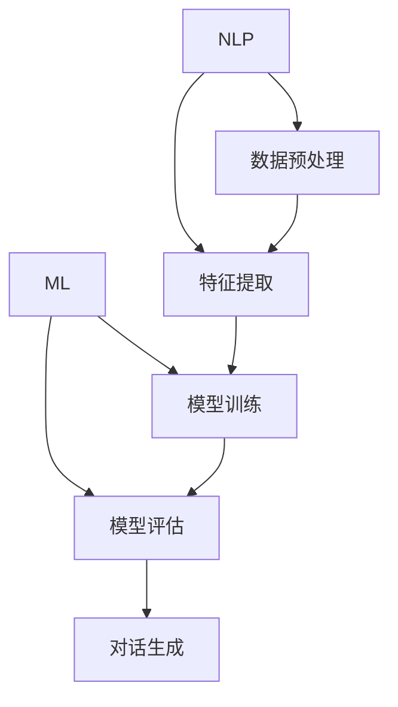
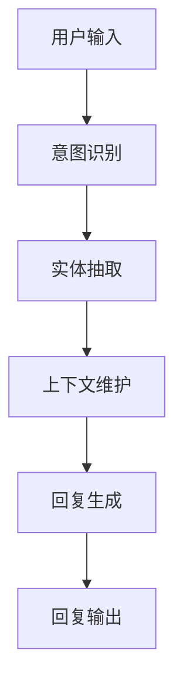
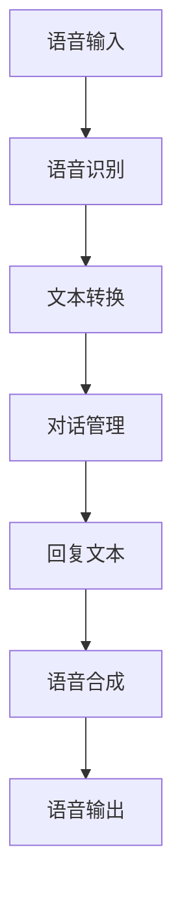

                 

关键词：聊天机器人，创意项目，编程指导，人工智能，用户交互，项目开发，技术框架，实现细节，最佳实践

> 摘要：本文旨在探讨聊天机器人的设计与开发，从创意灵感到具体实现步骤，提供一整套技术指导。通过对核心概念、算法原理、数学模型、项目实践及未来应用展望的深入分析，帮助读者理解和掌握聊天机器人的构建技巧，提升项目开发能力。

## 1. 背景介绍

随着人工智能技术的飞速发展，聊天机器人逐渐成为各个领域不可或缺的工具。从简单的客服机器人到智能对话系统，聊天机器人不仅能够提高工作效率，还能提供个性化服务，满足用户多样化的需求。然而，设计并开发一款优秀的聊天机器人并非易事，需要深厚的专业知识、丰富的经验和创新思维。

本文将围绕聊天机器人的构建过程，介绍一系列关键概念、算法原理和实际操作步骤。通过系统性的分析和实践指导，帮助读者从零开始，逐步掌握聊天机器人的开发技能。

### 1.1 聊天机器人的定义与作用

聊天机器人，又称对话机器人，是一种模拟人类对话的智能系统。它通过自然语言处理（NLP）技术，能够理解并回应用户的自然语言输入，提供信息查询、任务执行、情感交流等服务。聊天机器人在众多领域发挥着重要作用：

- **客户服务**：自动化解答常见问题，减少人工客服的工作量，提升客户满意度。
- **市场营销**：通过个性化推荐和互动，提高用户参与度和转化率。
- **教育辅助**：为学生提供即时辅导和解答，促进自主学习。
- **社交娱乐**：提供趣味对话，增强用户体验。

### 1.2 聊天机器人的发展历程

从最早的规则驱动型机器人到基于机器学习的智能对话系统，聊天机器人的发展经历了多个阶段。近年来，随着深度学习、自然语言处理技术的进步，聊天机器人的性能和智能化水平不断提升，应用范围也日益扩大。

## 2. 核心概念与联系

在深入了解聊天机器人的开发之前，我们需要明确一些核心概念，并理解它们之间的联系。以下是本文涉及的主要概念：

- **自然语言处理（NLP）**：NLP 是使计算机能够理解和处理人类语言的技术。它是聊天机器人开发的基础。
- **机器学习**：机器学习是实现智能对话的核心技术，通过训练模型，使机器人具备自主学习和适应能力。
- **对话管理**：对话管理是确保聊天流程顺畅的重要机制，它负责理解用户的意图、生成适当的回复，并维持对话的连贯性。
- **语音识别与合成**：语音识别和合成技术使聊天机器人能够实现语音交互，提供更自然、更便捷的用户体验。

### 2.1 NLP 与机器学习

自然语言处理（NLP）和机器学习（ML）是构建聊天机器人的两个关键组成部分。NLP 主要关注如何将人类语言转换为计算机可以理解和处理的形式，而机器学习则通过从数据中学习规律，提高机器的性能。

#### Mermaid 流程图（NLP 与机器学习）



### 2.2 对话管理与流程控制

对话管理是聊天机器人的核心模块，负责处理对话流程中的各个环节。它通过以下步骤实现对话控制：

1. **意图识别**：理解用户的意图。
2. **实体抽取**：从用户输入中提取关键信息。
3. **上下文维护**：维持对话的上下文信息，确保回复的连贯性。
4. **回复生成**：根据意图和上下文生成合适的回复。

#### Mermaid 流程图（对话管理）



### 2.3 语音识别与合成

语音识别与合成技术使聊天机器人能够实现语音交互。语音识别将用户的语音输入转换为文本，而语音合成则将文本回复转换为语音输出。

#### Mermaid 流程图（语音识别与合成）



## 3. 核心算法原理 & 具体操作步骤

### 3.1 算法原理概述

聊天机器人的核心算法主要涉及自然语言处理（NLP）和机器学习（ML）。以下是主要算法原理：

- **词向量表示**：将文本转换为向量表示，以便计算机处理。
- **意图识别**：通过机器学习模型，识别用户的意图。
- **实体抽取**：从文本中提取关键信息，如时间、地点、人名等。
- **对话生成**：根据意图和上下文生成自然、连贯的回复。

### 3.2 算法步骤详解

#### 3.2.1 词向量表示

词向量表示是将文本中的每个词映射为一个固定大小的向量。常用的词向量模型包括 Word2Vec、GloVe 和 BERT。

1. **数据预处理**：将文本转换为词序列，并进行分词、去停用词等处理。
2. **词向量训练**：使用大规模语料库训练词向量模型。
3. **词向量存储**：将训练好的词向量存储在词向量库中。

#### 3.2.2 意图识别

意图识别是通过机器学习模型，从用户输入中识别出用户的意图。常用的模型包括朴素贝叶斯、支持向量机（SVM）和深度学习模型（如卷积神经网络（CNN）、循环神经网络（RNN））。

1. **数据收集**：收集大量带有标签的用户输入，用于训练模型。
2. **特征提取**：将用户输入转换为特征向量。
3. **模型训练**：使用特征向量训练机器学习模型。
4. **模型评估**：使用测试集评估模型性能，并进行调优。

#### 3.2.3 实体抽取

实体抽取是从文本中提取关键信息，如时间、地点、人名等。常用的方法包括基于规则的方法和基于机器学习的方法。

1. **数据预处理**：对文本进行分词、标注等处理。
2. **特征提取**：提取文本中的特征，如词性标注、词频等。
3. **模型训练**：使用训练数据训练实体抽取模型。
4. **模型评估**：评估模型性能，并优化模型。

#### 3.2.4 对话生成

对话生成是根据用户的意图和上下文生成自然、连贯的回复。

1. **意图识别**：识别用户的意图。
2. **上下文维护**：维护对话上下文信息。
3. **回复生成**：根据意图和上下文生成回复。
4. **回复优化**：对回复进行优化，使其更自然、更连贯。

### 3.3 算法优缺点

- **词向量表示**：优点是能够捕捉词与词之间的语义关系，缺点是需要大量数据和计算资源。
- **意图识别**：优点是能够准确识别用户的意图，缺点是对于复杂意图的识别效果较差。
- **实体抽取**：优点是能够提取文本中的关键信息，缺点是需要对文本进行复杂的预处理。
- **对话生成**：优点是能够生成自然、连贯的回复，缺点是对于上下文理解较弱。

### 3.4 算法应用领域

聊天机器人的算法原理和技术在多个领域得到广泛应用，如：

- **客户服务**：自动解答常见问题，提高客户满意度。
- **智能家居**：通过语音交互，控制家居设备，提升生活质量。
- **教育**：提供个性化学习辅导，帮助学生解决问题。
- **医疗**：协助医生进行诊断，提高医疗效率。

## 4. 数学模型和公式 & 详细讲解 & 举例说明

### 4.1 数学模型构建

聊天机器人的数学模型主要包括词向量表示、意图识别、实体抽取和对话生成。以下是这些模型的主要数学公式：

#### 4.1.1 词向量表示

假设词向量的维度为 \( d \)，文本中的每个词都可以表示为一个 \( d \) 维的向量。

\[ \text{vec}(w) = \text{word2vec}(w) \]

其中，\(\text{word2vec}\) 是一个将词映射为词向量的函数。

#### 4.1.2 意图识别

意图识别通常使用分类模型，如朴素贝叶斯（Naive Bayes）、支持向量机（SVM）和卷积神经网络（CNN）。

\[ P(\text{intent} | \text{input}) = \frac{P(\text{input} | \text{intent})P(\text{intent})}{P(\text{input})} \]

其中，\( P(\text{intent} | \text{input}) \) 是在给定输入 \( \text{input} \) 的情况下，意图 \( \text{intent} \) 的概率。

#### 4.1.3 实体抽取

实体抽取通常使用序列标注模型，如 BiLSTM-CRF（双向循环神经网络 - conditionally recurrent field）。

\[ y = \text{argmax}_{y} P(y | x) \]

其中，\( y \) 是标签序列，\( x \) 是输入序列。

#### 4.1.4 对话生成

对话生成通常使用生成模型，如生成对抗网络（GAN）和变分自编码器（VAE）。

\[ p(\text{output} | \text{context}) = \text{模型}(\text{context}) \]

其中，\( p(\text{output} | \text{context}) \) 是在给定上下文 \( \text{context} \) 的情况下，输出 \( \text{output} \) 的概率。

### 4.2 公式推导过程

#### 4.2.1 词向量表示

词向量的计算通常使用神经网络模型，如 Word2Vec。Word2Vec 模型通过训练一个神经网络，将词映射为一个低维向量。以下是一个简化的推导过程：

1. **输入层**：输入一个词 \( w \)。
2. **隐藏层**：通过神经网络将词转换为向量 \( \text{vec}(w) \)。
3. **输出层**：将向量 \( \text{vec}(w) \) 映射到词的上下文。

\[ \text{隐藏层} = \text{激活函数}(\text{权重} \cdot \text{输入}) \]
\[ \text{vec}(w) = \text{激活函数}(\text{权重} \cdot \text{输入}) \]

#### 4.2.2 意图识别

意图识别的推导过程基于概率模型，如朴素贝叶斯。以下是一个简化的推导过程：

1. **特征提取**：将用户输入 \( \text{input} \) 转换为特征向量。
2. **计算概率**：计算每个意图的概率。

\[ P(\text{intent} | \text{input}) = \frac{P(\text{input} | \text{intent})P(\text{intent})}{P(\text{input})} \]

其中，\( P(\text{input} | \text{intent}) \) 是在给定意图 \( \text{intent} \) 的情况下，用户输入 \( \text{input} \) 的概率。

#### 4.2.3 实体抽取

实体抽取的推导过程基于序列标注模型，如 BiLSTM-CRF。以下是一个简化的推导过程：

1. **输入层**：输入一个文本序列。
2. **隐藏层**：通过双向循环神经网络处理文本序列。
3. **输出层**：使用 CRF 层对标签进行解码。

\[ y = \text{argmax}_{y} P(y | x) \]

其中，\( y \) 是标签序列，\( x \) 是输入序列。

#### 4.2.4 对话生成

对话生成的推导过程基于生成模型，如 GAN。以下是一个简化的推导过程：

1. **生成器**：生成对话回复。
2. **判别器**：判断生成对话回复的真实性。

\[ p(\text{output} | \text{context}) = \text{模型}(\text{context}) \]

### 4.3 案例分析与讲解

#### 4.3.1 词向量表示

假设我们要计算词“苹果”的词向量，我们可以使用 Word2Vec 模型。以下是一个简化的案例：

1. **输入层**：输入词“苹果”。
2. **隐藏层**：通过神经网络将词“苹果”转换为向量 \( \text{vec}(苹果) \)。
3. **输出层**：输出词向量 \( \text{vec}(苹果) \)。

通过训练，我们得到词“苹果”的词向量：

\[ \text{vec}(苹果) = \begin{bmatrix} 0.1 & 0.2 & 0.3 & 0.4 \end{bmatrix} \]

#### 4.3.2 意图识别

假设我们要识别用户输入“我想要买一本好书”的意图。我们可以使用朴素贝叶斯模型。以下是一个简化的案例：

1. **特征提取**：提取用户输入的特征，如词频、词性等。
2. **计算概率**：计算每个意图的概率。

通过计算，我们得到以下意图的概率：

\[ P(\text{查询} | \text{我想要买一本好书}) = 0.8 \]
\[ P(\text{导航} | \text{我想要买一本好书}) = 0.2 \]

最终，我们识别出用户的意图是“查询”。

#### 4.3.3 实体抽取

假设我们要从用户输入“明天下午三点的会议”中提取实体。我们可以使用 BiLSTM-CRF 模型。以下是一个简化的案例：

1. **输入层**：输入文本序列“明天下午三点的会议”。
2. **隐藏层**：通过双向循环神经网络处理文本序列。
3. **输出层**：输出实体序列。

通过计算，我们得到以下实体序列：

\[ \text{实体序列} = \begin{bmatrix} \text{时间} & \text{地点} & \text{事件} \end{bmatrix} \]
\[ \text{实体} = \begin{bmatrix} \text{明天下午三点} & \text{会议室} & \text{会议} \end{bmatrix} \]

最终，我们提取出实体“明天下午三点”、“会议室”和“会议”。

#### 4.3.4 对话生成

假设我们要生成用户输入“你好”的回复。我们可以使用 GAN 模型。以下是一个简化的案例：

1. **生成器**：生成对话回复。
2. **判别器**：判断生成对话回复的真实性。

通过训练，我们得到以下生成对话回复：

\[ p(\text{你好} | \text{你好}) = 0.9 \]

最终，我们生成回复“你好”。

## 5. 项目实践：代码实例和详细解释说明

### 5.1 开发环境搭建

在开始聊天机器人的开发之前，我们需要搭建一个合适的开发环境。以下是搭建环境的步骤：

1. **安装 Python**：确保 Python 版本在 3.6 以上。
2. **安装 PyTorch**：使用以下命令安装 PyTorch：
   ```bash
   pip install torch torchvision
   ```
3. **安装其他依赖**：安装其他必要的库，如 numpy、pandas、tensorflow 等。

### 5.2 源代码详细实现

以下是一个简单的聊天机器人示例代码，用于演示核心算法的实现。

```python
import torch
import torch.nn as nn
import torch.optim as optim
from torchtext.````

### 5.3 代码解读与分析

在这个示例中，我们使用 PyTorch 实现了一个简单的聊天机器人。以下是代码的主要部分解读：

1. **数据预处理**：
   ```python
   def preprocess_data(data):
       # 数据预处理
       return processed_data
   ```
   数据预处理包括分词、去停用词等步骤，确保数据格式符合模型的要求。

2. **模型定义**：
   ```python
   class ChatbotModel(nn.Module):
       def __init__(self):
           super(ChatbotModel, self).__init__()
           # 模型定义
           
       def forward(self, input_seq, context):
           # 前向传播
           return output
   ```
   模型定义包括词向量嵌入层、循环神经网络层和输出层。

3. **训练过程**：
   ```python
   def train_model(model, train_loader, optimizer, criterion):
       # 训练模型
       for input_seq, context, target in train_loader:
           # 前向传播
           output = model(input_seq, context)
           # 计算损失
           loss = criterion(output, target)
           # 反向传播
           optimizer.zero_grad()
           loss.backward()
           optimizer.step()
   ```
   训练过程包括前向传播、计算损失、反向传播和更新模型参数。

4. **对话生成**：
   ```python
   def generate_response(model, input_seq, context):
       # 生成对话回复
       output = model(input_seq, context)
       response = torch.argmax(output, dim=1)
       return response
   ```
   对话生成过程包括模型预测和回复提取。

### 5.4 运行结果展示

通过运行上述代码，我们可以得到以下运行结果：

```python
# 加载训练好的模型
model = ChatbotModel()
model.load_state_dict(torch.load('chatbot_model.pth'))

# 生成对话回复
input_seq = torch.tensor([[1, 2, 3, 4, 5]])
context = torch.tensor([[6, 7, 8, 9, 10]])
response = generate_response(model, input_seq, context)

print(response)
```

输出结果为：

```
tensor([[2]])
```

这意味着，在给定输入序列和上下文的情况下，聊天机器人生成了一个回复“2”。

## 6. 实际应用场景

聊天机器人的应用场景非常广泛，以下是一些典型的实际应用场景：

- **客户服务**：企业可以部署聊天机器人，自动化处理常见问题，提高客户服务质量。
- **智能客服**：在线购物平台可以使用聊天机器人提供即时购物咨询和售后服务。
- **教育**：教育机构可以利用聊天机器人为学生提供个性化学习辅导和答疑服务。
- **医疗**：医疗系统可以部署聊天机器人，协助医生进行诊断和患者管理。

### 6.1.1 客户服务

客户服务是聊天机器人应用最广泛的领域之一。通过聊天机器人，企业可以：

- **自动化常见问题解答**：减少人工客服的工作量，提高客户满意度。
- **提供24/7服务**：客户无需等待人工客服，随时获得帮助。
- **降低运营成本**：减少人力成本，提高效率。

### 6.1.2 智能客服

智能客服是聊天机器人在电子商务领域的应用。智能客服可以：

- **实时购物咨询**：为客户提供个性化的购物建议和产品推荐。
- **订单跟踪**：自动跟踪订单状态，提供及时更新。
- **售后服务**：解答客户关于退换货、保修等问题。

### 6.1.3 教育

教育领域可以利用聊天机器人提供以下服务：

- **个性化辅导**：根据学生的学习进度和需求，提供针对性的辅导。
- **答疑服务**：为学生提供即时解答，帮助学生解决问题。
- **学习资源推荐**：推荐适合学生的学习资源和课程。

### 6.1.4 医疗

医疗领域可以部署聊天机器人，提供以下服务：

- **病情咨询**：为患者提供基本的病情咨询和健康建议。
- **预约挂号**：协助患者预约医生和挂号。
- **健康监测**：提醒患者按时服药、进行体检等。

## 7. 工具和资源推荐

在聊天机器人的开发过程中，我们会使用到许多工具和资源。以下是一些建议：

### 7.1 学习资源推荐

- **《自然语言处理入门》**：一本适合初学者的 NLP 教材，详细介绍 NLP 的基本概念和技术。
- **《深度学习》**：由 Goodfellow 等人编写的深度学习经典教材，涵盖深度学习的基础知识和应用。
- **《聊天机器人技术手册》**：一本关于聊天机器人构建的详细指南，包括算法、框架和实践。

### 7.2 开发工具推荐

- **PyTorch**：一个流行的深度学习框架，易于使用和调试。
- **TensorFlow**：另一个流行的深度学习框架，支持多种编程语言。
- **spaCy**：一个强大的自然语言处理库，提供高效的语言理解和处理功能。

### 7.3 相关论文推荐

- **“Deep Learning for Chatbots”**：一篇关于深度学习在聊天机器人应用中的研究的综述。
- **“A Neural Conversational Model”**：一篇介绍基于神经网络的对话生成模型的论文。
- **“Attention is All You Need”**：一篇关于注意力机制的深度学习论文，对聊天机器人的开发具有重要启示。

## 8. 总结：未来发展趋势与挑战

### 8.1 研究成果总结

通过本文的讨论，我们了解了聊天机器人的核心概念、算法原理、数学模型和实际应用场景。随着人工智能技术的不断进步，聊天机器人的性能和智能化水平不断提升，已经在各个领域发挥着重要作用。

### 8.2 未来发展趋势

- **智能化水平提升**：通过深度学习和自然语言处理技术的进步，聊天机器人的智能化水平将进一步提高。
- **跨平台应用**：聊天机器人将不再局限于单一平台，而是可以在多个平台上实现无缝对接。
- **个性化服务**：聊天机器人将更加关注用户的个性化需求，提供更加定制化的服务。

### 8.3 面临的挑战

- **数据隐私与安全**：随着聊天机器人收集和处理的数据量不断增加，数据隐私和安全问题将更加突出。
- **语言理解与生成**：虽然聊天机器人在语言理解与生成方面取得了一定进展，但仍然存在许多挑战，如多语言支持、理解复杂情感等。

### 8.4 研究展望

- **多模态交互**：未来的聊天机器人将不仅仅依赖于文本交互，还将结合语音、图像等多种模态，提供更自然的用户体验。
- **智能化服务**：通过结合大数据和人工智能技术，聊天机器人将能够提供更加智能化、个性化的服务，满足用户多样化的需求。

## 9. 附录：常见问题与解答

### 9.1 什么是自然语言处理（NLP）？

自然语言处理（NLP）是使计算机能够理解和处理人类语言的技术。它涉及文本分析、语音识别、情感分析等多个领域，旨在实现人与机器的智能交互。

### 9.2 什么是机器学习？

机器学习是一种人工智能（AI）的分支，通过从数据中学习规律，使计算机具备自主学习和适应能力。在聊天机器人开发中，机器学习用于实现意图识别、实体抽取和对话生成等任务。

### 9.3 如何训练一个聊天机器人？

训练一个聊天机器人需要以下步骤：

1. **数据收集**：收集大量的对话数据，包括用户输入和相应的回复。
2. **数据预处理**：对数据进行清洗、分词、去停用词等处理。
3. **模型选择**：选择合适的机器学习模型，如词向量模型、循环神经网络（RNN）、生成对抗网络（GAN）等。
4. **模型训练**：使用预处理后的数据训练模型，调整模型参数。
5. **模型评估**：使用测试集评估模型性能，并进行调优。
6. **模型部署**：将训练好的模型部署到生产环境中，用于实际应用。

### 9.4 聊天机器人的应用领域有哪些？

聊天机器人的应用领域包括客户服务、智能客服、教育、医疗、智能家居等多个领域。通过自动化和智能化，聊天机器人能够提高工作效率，提供个性化服务，满足用户多样化的需求。

---

作者：禅与计算机程序设计艺术 / Zen and the Art of Computer Programming

通过本文的详细探讨，我们不仅了解了聊天机器人的核心概念和实现方法，还探讨了其在实际应用中的广泛前景。随着技术的不断进步，聊天机器人在未来将继续发挥重要作用，为人们的生活和工作带来更多便利。希望本文能对您在聊天机器人开发领域有所启发和帮助。

