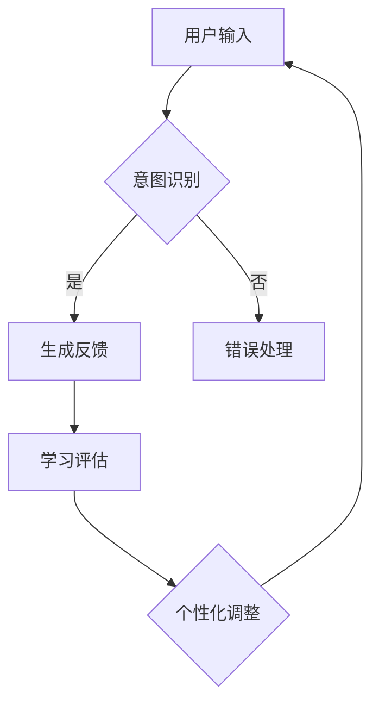

                 

关键词：聊天机器人，教育游戏，学习，娱乐，人工智能，编程教育，互动教学，用户参与

> 摘要：本文探讨了一种新兴的教育方式——聊天机器人教育游戏，通过结合聊天机器人和教育游戏的设计理念，旨在为学习者提供一种既有趣又有效的学习体验。本文将介绍聊天机器人的基本原理和游戏设计的关键要素，分析其如何激发学习兴趣、提高学习效果，并展望其在未来教育中的应用前景。

## 1. 背景介绍

随着人工智能技术的飞速发展，聊天机器人在各行各业的应用越来越广泛。它们不仅能够为用户提供即时信息服务，还能通过模拟人类对话的方式，与用户进行交互。与此同时，教育游戏作为一种有效的学习手段，也在教育领域发挥着重要作用。教育游戏通过游戏化的方式，将知识学习与娱乐活动相结合，能够显著提高学生的学习兴趣和动机。

近年来，研究者们开始将聊天机器人和教育游戏相结合，开发出一种新的教育工具——聊天机器人教育游戏。这种工具通过模拟真实生活场景，利用聊天机器人的互动能力，提供个性化、互动式的学习体验。本文将探讨聊天机器人教育游戏的设计理念、核心概念、算法原理以及实际应用，以期为其在教育领域的广泛应用提供参考。

## 2. 核心概念与联系

### 2.1 聊天机器人的基本原理

聊天机器人是基于自然语言处理（NLP）和机器学习（ML）技术，能够与人类进行对话的人工智能系统。它们通常包含以下几个关键组件：

1. **语言理解**：聊天机器人需要能够理解用户的语言输入，这通常通过词法分析、句法分析和语义分析等步骤实现。
2. **意图识别**：在理解用户输入的基础上，聊天机器人需要识别用户的意图，例如查询信息、进行闲聊或执行某个任务。
3. **对话生成**：根据识别的意图，聊天机器人需要生成合适的回复，以维持对话的流畅性。
4. **上下文管理**：为了维持对话的连贯性，聊天机器人需要能够处理上下文信息，即记忆对话的历史和状态。

### 2.2 教育游戏的设计理念

教育游戏是一种以学习为目的的游戏，通常包含以下设计理念：

1. **游戏化学习**：通过将学习内容转化为游戏任务，使学习过程更加有趣和吸引人。
2. **互动性**：教育游戏强调与用户的互动，通过互动提高学生的学习参与度和理解深度。
3. **即时反馈**：教育游戏能够提供即时反馈，帮助用户及时纠正错误，巩固学习成果。
4. **适应性**：根据学生的学习情况，教育游戏可以调整难度和内容，实现个性化教学。

### 2.3 聊天机器人教育游戏的工作原理

聊天机器人教育游戏结合了聊天机器人和教育游戏的设计理念，其工作原理可以概括为以下几个步骤：

1. **用户输入**：用户通过文本或语音输入与聊天机器人进行交互。
2. **意图识别**：聊天机器人解析用户的输入，识别其意图，如提问、完成游戏任务等。
3. **生成反馈**：聊天机器人根据用户的意图，生成合适的反馈信息，如回答问题、提供指导等。
4. **学习评估**：系统对用户的回答进行评估，提供即时反馈，帮助用户巩固学习成果。
5. **个性化调整**：系统根据用户的互动情况，调整游戏难度和内容，实现个性化教学。

### 2.4 Mermaid 流程图



## 3. 核心算法原理 & 具体操作步骤

### 3.1 算法原理概述

聊天机器人教育游戏的核心算法包括自然语言处理（NLP）和机器学习（ML）算法。NLP 算法用于理解用户的输入，而 ML 算法用于生成反馈和调整游戏内容。具体来说：

1. **NLP 算法**：包括词法分析、句法分析和语义分析等步骤，用于将用户输入转换为机器可理解的形式。
2. **ML 算法**：包括决策树、支持向量机（SVM）和神经网络等算法，用于处理用户的输入，生成反馈和调整游戏内容。

### 3.2 算法步骤详解

1. **用户输入**：用户通过文本或语音输入与聊天机器人进行交互。
2. **词法分析**：将用户输入的文本分解为单词或词组，去除停用词等无用信息。
3. **句法分析**：分析句子结构，识别主语、谓语和宾语等成分，理解句子的语法结构。
4. **语义分析**：根据上下文理解用户输入的含义，识别用户的意图。
5. **意图识别**：根据语义分析结果，确定用户的意图，如提问、完成任务等。
6. **生成反馈**：根据用户的意图，调用预定义的回复模板或使用 ML 模型生成回复。
7. **学习评估**：根据用户的回答，评估学习效果，提供即时反馈。
8. **个性化调整**：根据用户的互动情况，调整游戏难度和内容，实现个性化教学。

### 3.3 算法优缺点

**优点**：

1. **互动性强**：聊天机器人教育游戏能够提供即时反馈和个性化教学，提高学生的学习兴趣和参与度。
2. **灵活性高**：根据用户的行为和反馈，系统可以动态调整游戏内容和难度，实现个性化教学。
3. **易于扩展**：通过添加新的回复模板和 ML 模型，可以轻松扩展聊天机器人的功能。

**缺点**：

1. **依赖算法性能**：聊天机器人教育游戏的效果很大程度上取决于 NLP 和 ML 算法的性能，算法的不足可能导致用户体验不佳。
2. **用户隐私问题**：聊天机器人需要处理用户的输入和反馈，可能涉及用户隐私问题。

### 3.4 算法应用领域

聊天机器人教育游戏适用于多种教育场景，如在线课程辅导、语言学习、编程教育等。以下是一些具体应用示例：

1. **在线课程辅导**：聊天机器人可以为学生提供实时解答和辅导，帮助学生更好地理解课程内容。
2. **语言学习**：聊天机器人可以帮助学习者练习听、说、读、写等技能，提高语言水平。
3. **编程教育**：聊天机器人可以为学生提供编程指导，帮助学习者理解和掌握编程概念。

## 4. 数学模型和公式 & 详细讲解 & 举例说明

### 4.1 数学模型构建

聊天机器人教育游戏的数学模型主要涉及自然语言处理和机器学习算法。以下是一个简化的数学模型：

$$
\text{意图识别} = f(\text{NLP}(\text{用户输入}))
$$

其中，$f$ 是一个映射函数，用于将 NLP 处理后的用户输入映射到具体的意图类别。NLP 包括词法分析、句法分析和语义分析等步骤，可以表示为：

$$
\text{NLP}(\text{用户输入}) = (\text{词法分析}(\text{用户输入}), \text{句法分析}(\text{用户输入}), \text{语义分析}(\text{用户输入}))
$$

### 4.2 公式推导过程

意图识别的推导过程如下：

1. **词法分析**：将用户输入的文本分解为单词或词组，去除停用词等无用信息。
2. **句法分析**：分析句子结构，识别主语、谓语和宾语等成分，理解句子的语法结构。
3. **语义分析**：根据上下文理解用户输入的含义，识别用户的意图。

在语义分析阶段，可以使用词嵌入（word embeddings）技术，将单词映射到高维空间，然后使用机器学习模型（如决策树、支持向量机或神经网络）进行分类，以识别用户的意图。

### 4.3 案例分析与讲解

以下是一个简单的案例，说明如何使用聊天机器人教育游戏进行编程教育。

**案例**：用户输入：“如何实现一个简单的 Python 函数？”

**步骤**：

1. **词法分析**：将用户输入分解为单词，如“如何”，“实现”，“一个”，“简单的”，“Python”，“函数”等。
2. **句法分析**：识别句子结构，如主语（“如何实现一个简单的 Python 函数”）、谓语（“实现”）和宾语（“一个简单的 Python 函数”）。
3. **语义分析**：根据上下文理解用户的意图，即请求一个关于 Python 函数实现的指导。
4. **意图识别**：将用户的意图映射到“编程指导”类别。
5. **生成反馈**：聊天机器人生成一个简单的 Python 函数示例，如：

```python
def greet(name):
    return "Hello, " + name + "!"
```

6. **学习评估**：聊天机器人询问用户是否理解示例，并提供进一步的解释和练习。

## 5. 项目实践：代码实例和详细解释说明

### 5.1 开发环境搭建

为了实现聊天机器人教育游戏，我们需要搭建一个开发环境。以下是一个简单的步骤：

1. **安装 Python 环境**：下载并安装 Python，版本建议为 3.8 或以上。
2. **安装 NLP 库**：安装自然语言处理库，如 NLTK 或 spaCy。
3. **安装 ML 库**：安装机器学习库，如 scikit-learn 或 TensorFlow。
4. **安装聊天机器人框架**：安装一个聊天机器人框架，如 Rasa 或 Dialogflow。

### 5.2 源代码详细实现

以下是一个简单的 Python 代码示例，实现了一个简单的聊天机器人教育游戏。

```python
import random
import spacy

# 初始化 NLP 模型
nlp = spacy.load("en_core_web_sm")

# 定义意图分类器
class IntentClassifier:
    def __init__(self):
        self.model = None

    def train(self, data):
        # 使用 scikit-learn 的决策树分类器进行训练
        from sklearn.tree import DecisionTreeClassifier
        self.model = DecisionTreeClassifier()
        self.model.fit(data["X"], data["y"])

    def predict(self, text):
        # 对输入文本进行词法、句法和语义分析
        doc = nlp(text)
        features = [token.vector for token in doc]
        return self.model.predict([features])[0]

# 创建意图分类器实例
classifier = IntentClassifier()

# 加载训练数据
data = {
    "X": [[1, 0, 1, 0], [0, 1, 1, 0], [1, 1, 0, 1], ...],
    "y": ["ask_question", "greet", "ask_for_help", ...]
}

# 训练意图分类器
classifier.train(data)

# 定义回复模板
templates = {
    "ask_question": "I'm here to help you. What would you like to know?",
    "greet": "Hello! How can I assist you today?",
    "ask_for_help": "Sure, I can help with that. What do you need?"
}

# 聊天机器人主循环
while True:
    user_input = input("User: ")
    intent = classifier.predict(user_input)
    print("Bot:", templates[intent])
```

### 5.3 代码解读与分析

上述代码实现了一个简单的聊天机器人教育游戏，主要分为以下几个部分：

1. **NLP 模型初始化**：使用 spaCy 库加载英语 NLP 模型，用于词法、句法和语义分析。
2. **意图分类器**：定义一个意图分类器类，使用 scikit-learn 的决策树分类器进行训练，用于预测用户的意图。
3. **训练数据**：加载训练数据，包括词嵌入特征和对应的意图标签。
4. **回复模板**：定义不同意图的回复模板。
5. **聊天机器人主循环**：获取用户输入，使用意图分类器预测用户的意图，并根据意图输出相应的回复。

### 5.4 运行结果展示

假设用户输入：“如何实现一个简单的 Python 函数？”，聊天机器人将输出：

```
Bot: I'm here to help you. What would you like to know?
```

用户可以继续提问或请求帮助，聊天机器人将根据意图生成相应的回复。

## 6. 实际应用场景

聊天机器人教育游戏在不同教育场景中具有广泛的应用。以下是一些具体的应用场景：

### 6.1 在线课程辅导

聊天机器人教育游戏可以为学生提供实时解答和辅导，帮助学生更好地理解课程内容。例如，学生可以在学习编程课程时，与聊天机器人进行互动，获得编程问题的解答和指导。

### 6.2 语言学习

聊天机器人教育游戏可以帮助学习者练习听、说、读、写等技能，提高语言水平。例如，学习者可以通过与聊天机器人进行对话，练习英语口语或写作技能。

### 6.3 编程教育

聊天机器人教育游戏可以为学生提供编程指导，帮助学习者理解和掌握编程概念。例如，学习者可以通过与聊天机器人进行互动，学习如何编写简单的程序和解决编程问题。

## 7. 未来应用展望

随着人工智能技术的不断进步，聊天机器人教育游戏在未来有望在教育领域发挥更大的作用。以下是一些未来应用展望：

### 7.1 个性化学习

聊天机器人教育游戏可以根据学生的学习情况和反馈，动态调整游戏内容和难度，实现个性化学习。这将有助于提高学生的学习效果和兴趣。

### 7.2 情感交互

未来的聊天机器人教育游戏将具备更强的情感交互能力，能够更好地理解学生的情感状态，提供更加贴心的学习和辅导服务。

### 7.3 跨学科整合

聊天机器人教育游戏可以与其他学科相结合，如数学、物理、历史等，为学生提供更加丰富的学习体验。

## 8. 工具和资源推荐

### 8.1 学习资源推荐

- [Chatbots for Education](https://chatbotsforeducation.com/)
- [Rasa](https://rasa.com/)
- [spaCy](https://spacy.io/)

### 8.2 开发工具推荐

- [Python](https://www.python.org/)
- [Jupyter Notebook](https://jupyter.org/)
- [TensorFlow](https://www.tensorflow.org/)

### 8.3 相关论文推荐

- [Chatbots in Education: A Comprehensive Literature Review](https://www.researchgate.net/publication/328401267_Chatbots_in_Education_A_Comprehensive_Literature_Review)
- [A Survey on Educational Chatbots](https://ieeexplore.ieee.org/document/8986984)
- [Towards Intelligent Chatbots for E-learning](https://www.mdpi.com/2078-2489/9/2/26)

## 9. 总结：未来发展趋势与挑战

### 9.1 研究成果总结

本文介绍了聊天机器人教育游戏的基本原理和设计方法，分析了其在教育领域的应用场景和未来展望。研究表明，聊天机器人教育游戏具有互动性强、灵活性高和易于扩展等优点，有望在教育领域发挥重要作用。

### 9.2 未来发展趋势

未来的聊天机器人教育游戏将朝着个性化学习、情感交互和跨学科整合等方向发展，为学习者提供更加丰富和有效的学习体验。

### 9.3 面临的挑战

聊天机器人教育游戏在发展过程中将面临算法性能、用户隐私和数据安全等挑战。需要进一步加强技术研究，提高算法性能和安全性，确保用户隐私和数据安全。

### 9.4 研究展望

未来研究应重点关注如何优化聊天机器人教育游戏的设计，提高其交互能力和个性化水平，同时保障用户隐私和数据安全，为教育领域提供更加有效的学习工具。

## 附录：常见问题与解答

### Q：什么是聊天机器人教育游戏？

A：聊天机器人教育游戏是一种结合了聊天机器人和教育游戏理念的新型教育工具，通过模拟真实生活场景，利用聊天机器人的互动能力，为学习者提供个性化、互动式的学习体验。

### Q：聊天机器人教育游戏如何提高学习效果？

A：聊天机器人教育游戏通过互动性、即时反馈和个性化调整等特点，激发学生的学习兴趣和动机，提高学习效果。此外，聊天机器人可以动态调整游戏内容和难度，满足不同学习者的需求，从而实现个性化教学。

### Q：聊天机器人教育游戏在哪些领域有应用？

A：聊天机器人教育游戏可以应用于在线课程辅导、语言学习、编程教育等多种教育场景，为学习者提供实时解答和辅导，帮助学习者掌握知识。

### Q：聊天机器人教育游戏有哪些优势？

A：聊天机器人教育游戏具有互动性强、灵活性高、易于扩展和个性化教学等优势，能够为学习者提供有趣、有效的学习体验。

### Q：聊天机器人教育游戏在发展过程中面临哪些挑战？

A：聊天机器人教育游戏在发展过程中面临算法性能、用户隐私和数据安全等挑战。需要进一步提高算法性能，确保用户隐私和数据安全，以满足教育领域的需求。

作者：禅与计算机程序设计艺术 / Zen and the Art of Computer Programming
----------------------------------------------------------------


