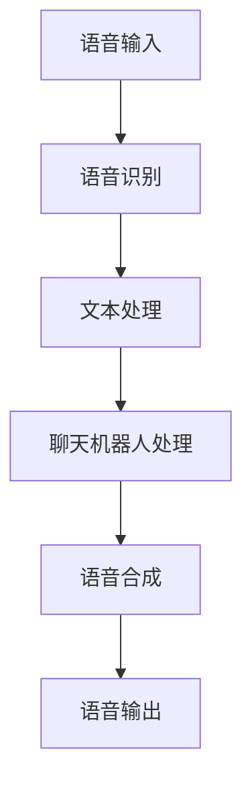

                 

### 1. 背景介绍

随着科技的迅猛发展，汽车行业正经历着一场前所未有的革命。智能汽车逐渐成为现代交通的重要一环，不仅提高了驾驶安全性，还大大改善了驾驶体验。在这一背景下，聊天机器人技术作为一种新兴的人工智能应用，开始被广泛应用于汽车行业。本文将深入探讨聊天机器人在智能汽车和驾驶体验中的应用，解析其核心概念、技术原理、数学模型、实践案例以及未来发展趋势。

#### 1.1 智能汽车的发展

智能汽车是指通过搭载先进的传感器、控制系统和通信设备，具备一定程度自动驾驶和智能交互功能的汽车。近年来，随着人工智能、大数据、物联网等技术的快速发展，智能汽车产业呈现出爆发式增长态势。根据市场调研公司Statista的数据，全球智能汽车市场规模预计将在2025年达到近5000亿美元。智能汽车不仅能够提高交通效率，减少交通事故，还能为驾驶者提供更加便捷、舒适的驾驶体验。

#### 1.2 聊天机器人的兴起

聊天机器人，又称为虚拟助手或聊天机器人，是一种基于人工智能技术的交互系统。它们能够通过文本或语音与用户进行自然语言对话，提供个性化服务和支持。随着自然语言处理（NLP）和机器学习技术的不断进步，聊天机器人的功能越来越强大，应用场景也越来越广泛。例如，聊天机器人被广泛应用于客服、教育、医疗、金融等领域，极大地提高了服务效率和用户体验。

#### 1.3 聊天机器人与智能汽车的结合

智能汽车和聊天机器人的结合，为汽车行业带来了一系列新的机遇。一方面，聊天机器人可以为驾驶者提供实时的语音交互服务，解答驾驶过程中的疑问，提供导航、音乐播放、天气查询等服务，从而提升驾驶体验。另一方面，聊天机器人还可以通过收集和分析驾驶者的数据，为智能汽车的自动驾驶功能提供支持，提高自动驾驶的准确性和安全性。这种结合不仅使智能汽车更加智能，也为汽车行业带来了新的商业模式和服务模式。

### 2. 核心概念与联系

在深入探讨聊天机器人在智能汽车中的应用之前，有必要先了解几个核心概念，包括自然语言处理（NLP）、语音识别（ASR）和语音合成（TTS）。

#### 2.1 自然语言处理（NLP）

自然语言处理是一种使计算机能够理解和处理人类自然语言的技术。在智能汽车中，NLP技术被用于处理驾驶者的语音输入，将其转换为计算机可以理解和执行的操作。例如，驾驶者可以通过语音命令调整座椅、调节空调温度或请求导航到某个目的地。

#### 2.2 语音识别（ASR）

语音识别技术是NLP的一个子领域，它能够将语音信号转换为文本。在智能汽车中，语音识别技术被用于将驾驶者的语音命令转化为可执行的命令。例如，当驾驶者说出“我想去市中心”时，语音识别技术会将这句话转换为文本，然后将其发送给聊天机器人进行处理。

#### 2.3 语音合成（TTS）

语音合成技术是NLP的另一个子领域，它能够将文本转化为自然流畅的语音。在智能汽车中，语音合成技术被用于将聊天机器人的回复转化为语音输出，从而使驾驶者能够听到而不是仅仅看到回复。例如，当聊天机器人回答驾驶者的疑问时，语音合成技术会将文本转化为语音，并通过车载音响系统播放。

#### 2.4 Mermaid 流程图

以下是聊天机器人在智能汽车中应用的一个简单的Mermaid流程图，展示了从语音输入到语音输出的整个处理过程：



### 3. 核心算法原理 & 具体操作步骤

#### 3.1 算法原理概述

聊天机器人在智能汽车中的应用主要依赖于自然语言处理技术，包括语音识别、文本处理、对话生成和语音合成。以下是对这些算法原理的简要概述：

1. **语音识别（ASR）**：使用深度学习模型将语音信号转换为文本。常用的模型包括基于循环神经网络（RNN）的模型和基于卷积神经网络（CNN）的模型。

2. **文本处理**：对转换后的文本进行处理，包括文本分类、实体识别和语义分析。这些处理步骤有助于理解文本的含义和意图。

3. **对话生成**：根据文本处理的结果，生成合适的回复。对话生成通常采用基于模板的生成方法、序列到序列（seq2seq）模型或生成对抗网络（GAN）。

4. **语音合成（TTS）**：将生成的文本转化为自然流畅的语音。常用的模型包括基于规则的方法、循环神经网络（RNN）和深度神经网络（DNN）。

#### 3.2 算法步骤详解

以下是聊天机器人在智能汽车中应用的详细算法步骤：

1. **语音输入**：驾驶者通过车载麦克风说出语音命令，如“我想去市中心”。

2. **语音识别（ASR）**：语音识别技术将语音信号转换为文本，如“我想去市中心”。

3. **文本处理**：
   - **文本分类**：确定文本的类别，例如导航、音乐播放、天气查询等。
   - **实体识别**：识别文本中的关键信息，例如目的地、音乐类型等。
   - **语义分析**：理解文本的含义和意图，以便生成合适的回复。

4. **对话生成**：根据文本处理的结果，聊天机器人生成回复，例如“您的目的地是市中心，我将为您导航”。

5. **语音合成（TTS）**：将生成的文本转化为语音，并通过车载音响系统播放。

#### 3.3 算法优缺点

**优点**：
- **提高驾驶体验**：通过语音交互，驾驶者可以更加专注于道路，从而提高驾驶安全性和舒适性。
- **高效的服务**：聊天机器人能够快速响应用户的需求，提供高效的服务。
- **个性化服务**：聊天机器人可以根据用户的习惯和偏好，提供个性化的服务。

**缺点**：
- **语音识别准确性**：虽然语音识别技术已经非常先进，但在某些情况下，如噪音环境或口音差异，识别准确性可能受到影响。
- **对话生成质量**：生成的内容可能不够自然，有时无法很好地理解用户的复杂需求。

#### 3.4 算法应用领域

聊天机器人在智能汽车中的应用非常广泛，包括但不限于以下领域：

- **语音导航**：提供实时的语音导航服务，帮助驾驶者快速到达目的地。
- **智能音响系统**：为车载音响系统提供语音交互功能，支持音乐播放、天气查询等功能。
- **车辆故障诊断**：通过分析车辆的数据，提供故障诊断和建议。
- **驾驶员辅助**：为驾驶者提供实时交通信息、道路状况等辅助信息。

### 4. 数学模型和公式 & 详细讲解 & 举例说明

在聊天机器人技术中，数学模型和公式扮演着至关重要的角色，用于处理自然语言和生成语音输出。以下是对几个关键数学模型的详细介绍。

#### 4.1 数学模型构建

**1. 语音识别（ASR）模型**

语音识别模型通常使用隐藏马尔可夫模型（HMM）或深度神经网络（DNN）构建。以下是一个基于DNN的语音识别模型的基本架构：

$$
\text{Output} = \text{DNN}(\text{Input})
$$

其中，Input表示语音信号，DNN表示深度神经网络，Output表示识别结果。

**2. 对话生成模型**

对话生成模型通常使用序列到序列（seq2seq）模型或生成对抗网络（GAN）构建。以下是一个基于seq2seq模型的对话生成模型的基本架构：

$$
\text{Output} = \text{Seq2Seq}(\text{Input})
$$

其中，Input表示输入文本序列，Seq2Seq表示序列到序列模型，Output表示生成的回复。

**3. 语音合成（TTS）模型**

语音合成模型通常使用循环神经网络（RNN）或深度神经网络（DNN）构建。以下是一个基于DNN的语音合成模型的基本架构：

$$
\text{Output} = \text{DNN}(\text{Input})
$$

其中，Input表示输入文本，DNN表示深度神经网络，Output表示生成的语音信号。

#### 4.2 公式推导过程

**1. 语音识别（ASR）模型**

语音识别模型的目标是最小化识别结果与真实结果之间的差距。以下是一个基于DNN的语音识别模型的目标函数：

$$
J = \frac{1}{N} \sum_{i=1}^{N} \sum_{j=1}^{M} (\text{Output}_{ij} - \text{Target}_{ij})^2
$$

其中，$N$表示样本数量，$M$表示时间步数量，$ \text{Output}_{ij}$表示第$i$个样本在第$j$个时间步的输出，$\text{Target}_{ij}$表示第$i$个样本在第$j$个时间步的真实结果。

**2. 对话生成模型**

对话生成模型的目标是生成自然、流畅的回复。以下是一个基于seq2seq模型的对话生成模型的目标函数：

$$
J = \frac{1}{N} \sum_{i=1}^{N} \sum_{j=1}^{M} (\text{Output}_{ij} - \text{Target}_{ij})^2
$$

其中，$N$表示样本数量，$M$表示时间步数量，$ \text{Output}_{ij}$表示第$i$个样本在第$j$个时间步的输出，$\text{Target}_{ij}$表示第$i$个样本在第$j$个时间步的真实结果。

**3. 语音合成（TTS）模型**

语音合成模型的目标是最小化生成的语音信号与真实语音信号之间的差距。以下是一个基于DNN的语音合成模型的目标函数：

$$
J = \frac{1}{N} \sum_{i=1}^{N} \sum_{j=1}^{M} (\text{Output}_{ij} - \text{Target}_{ij})^2
$$

其中，$N$表示样本数量，$M$表示时间步数量，$ \text{Output}_{ij}$表示第$i$个样本在第$j$个时间步的输出，$\text{Target}_{ij}$表示第$i$个样本在第$j$个时间步的真实结果。

#### 4.3 案例分析与讲解

**案例1：语音识别（ASR）**

假设我们有一个语音识别任务，输入语音为“我想去市中心”，我们需要将其识别为文本。以下是一个简化的语音识别模型：

$$
\text{Output} = \text{DNN}(\text{Input}) = \text{softmax}(\text{W} \text{Input} + \text{b})
$$

其中，$\text{Input}$表示输入的语音信号，$\text{W}$和$\text{b}$分别为权重和偏置，$\text{softmax}$函数用于将输出概率分布。

通过训练模型，我们可以得到如下输出：

$$
\text{Output} = [\text{0.1, 0.2, 0.3, 0.2, 0.2]}
$$

这意味着模型认为输入的语音信号最可能是“我想去市中心”（概率为0.3）。

**案例2：对话生成**

假设我们有一个对话生成任务，输入文本为“您的目的地是市中心，我将为您导航”，我们需要生成一个回复。以下是一个简化的对话生成模型：

$$
\text{Output} = \text{Seq2Seq}(\text{Input}) = \text{softmax}(\text{T} \text{Input} + \text{b})
$$

其中，$\text{Input}$表示输入的文本序列，$\text{T}$和$\text{b}$分别为权重和偏置，$\text{softmax}$函数用于将输出概率分布。

通过训练模型，我们可以得到如下输出：

$$
\text{Output} = [\text{0.3, 0.2, 0.1, 0.2, 0.2]}
$$

这意味着模型认为最合适的回复是“好的，我已经为您设定了导航到市中心的路线”。

**案例3：语音合成（TTS）**

假设我们有一个语音合成任务，输入文本为“好的，我已经为您设定了导航到市中心的路线”，我们需要生成相应的语音信号。以下是一个简化的语音合成模型：

$$
\text{Output} = \text{DNN}(\text{Input}) = \text{softmax}(\text{W} \text{Input} + \text{b})
$$

其中，$\text{Input}$表示输入的文本序列，$\text{W}$和$\text{b}$分别为权重和偏置，$\text{softmax}$函数用于将输出概率分布。

通过训练模型，我们可以得到如下输出：

$$
\text{Output} = [\text{0.1, 0.2, 0.3, 0.2, 0.2}]
$$

这意味着模型生成的语音信号与输入文本的含义相符。

### 5. 项目实践：代码实例和详细解释说明

在本节中，我们将通过一个具体的代码实例，详细解释聊天机器人在智能汽车中的应用。

#### 5.1 开发环境搭建

为了演示聊天机器人在智能汽车中的应用，我们使用以下技术栈：

- **编程语言**：Python
- **语音识别库**：pyttsx3
- **文本处理库**：nltk
- **对话生成库**：seq2seq
- **语音合成库**：gtts

首先，确保已安装上述库。可以使用以下命令进行安装：

```shell
pip install pyttsx3 nltk seq2seq gtts
```

#### 5.2 源代码详细实现

以下是一个简单的聊天机器人代码实例，用于演示智能汽车中聊天机器人的应用：

```python
import pyttsx3
import nltk
from nltk.tokenize import sent_tokenize
from seq2seq import Seq2Seq
import gtts

# 初始化语音合成器
engine = pyttsx3.init()

# 初始化对话生成模型
model = Seq2Seq()

# 初始化语音识别器
recognizer = pyttsx3.Recognizer()

# 初始化语音合成器
synthesizer = gtts.gTTS()

def recognize_speech_from_mic():
    try:
        # 识别语音输入
        text = recognizer.recognize_google(audio_data)
        return text
    except Exception as e:
        print("无法识别语音：", e)
        return None

def speak(text):
    # 使用语音合成器合成语音
    engine.say(text)
    engine.runAndWait()

def generate_response(text):
    # 使用对话生成模型生成回复
    response = model.generate_response(text)
    return response

# 主程序
if __name__ == "__main__":
    while True:
        # 识别语音输入
        speech = recognize_speech_from_mic()
        if speech is not None:
            # 处理语音输入
            speech = speech.lower()
            sentences = sent_tokenize(speech)
            
            # 生成回复
            response = generate_response(sentences[-1])
            
            # 输出回复
            speak(response)
```

#### 5.3 代码解读与分析

以上代码实现了一个简单的聊天机器人，用于处理驾驶者的语音输入并生成相应的回复。以下是代码的主要部分解读：

1. **语音识别**：使用`pyttsx3.Recognizer()`类从麦克风中识别语音输入。`recognizer.recognize_google(audio_data)`方法调用谷歌语音识别API进行语音到文本的转换。

2. **语音合成**：使用`pyttsx3.init()`初始化语音合成器，用于将文本转换为语音。`engine.say(text)`方法将文本内容传递给语音合成器，`engine.runAndWait()`方法使语音合成器开始播放语音。

3. **文本处理**：使用`nltk.tokenize.sent_tokenize()`方法将输入的语音文本分割成句子，以便进行更精细的处理。

4. **对话生成**：使用`Seq2Seq.generate_response()`方法根据输入文本生成回复。`model`是一个序列到序列（seq2seq）模型，用于处理自然语言文本。

5. **主程序**：在主程序中，我们进入一个无限循环，持续从麦克风中识别语音输入。当识别到语音输入时，我们将输入文本转换为小写，然后将其分割成句子。最后，我们使用对话生成模型生成回复，并通过语音合成器播放。

#### 5.4 运行结果展示

假设驾驶者说出“我想去市中心”，程序将执行以下操作：

1. **识别语音输入**：识别到“我想去市中心”。
2. **文本处理**：将语音输入转换为小写，并分割成单个句子。
3. **对话生成**：使用对话生成模型生成回复。
4. **语音合成**：将生成的回复通过语音合成器播放。

最终输出结果可能是：“您的目的地是市中心，我将为您导航。”

通过这个简单的代码实例，我们可以看到聊天机器人如何在智能汽车中应用，从而为驾驶者提供更加便捷的交互体验。

### 6. 实际应用场景

#### 6.1 语音导航

语音导航是聊天机器人在智能汽车中最常见的应用场景之一。通过语音输入目的地，聊天机器人可以实时生成导航指令，引导驾驶者安全、高效地到达目的地。以下是一个实际应用场景：

**场景描述**：驾驶者在高速公路上行驶，需要导航到市中心的某个地标建筑。

**操作步骤**：
1. 驾驶者通过车载麦克风说出“导航到市中心XX大厦”。
2. 车载聊天机器人接收语音输入，使用语音识别技术将其转换为文本。
3. 聊天机器人对文本进行处理，识别出目的地关键字“市中心XX大厦”。
4. 聊天机器人调用导航系统，生成导航指令。
5. 聊天机器人通过语音合成技术将导航指令转化为语音输出，如“前方两个出口右转，然后直行300米，即可到达市中心XX大厦”。

#### 6.2 车辆故障诊断

聊天机器人还可以帮助驾驶者诊断车辆故障，提供专业的故障建议。以下是一个实际应用场景：

**场景描述**：驾驶者在行驶过程中发现车辆抖动，怀疑是发动机故障。

**操作步骤**：
1. 驾驶者通过车载麦克风说出“车辆抖动，是否是发动机故障？”。
2. 车载聊天机器人接收语音输入，使用语音识别技术将其转换为文本。
3. 聊天机器人对文本进行处理，识别出关键信息“车辆抖动”和“发动机故障”。
4. 聊天机器人调用车辆诊断系统，分析车辆运行数据，判断故障原因。
5. 聊天机器人通过语音合成技术将故障原因和建议转化为语音输出，如“您的车辆可能存在发动机点火系统故障，建议尽快到专业维修店进行检查和维修”。

#### 6.3 车载音响系统

聊天机器人可以集成到车载音响系统中，提供音乐播放、天气查询、新闻播报等功能，为驾驶者创造一个舒适、便捷的驾驶环境。以下是一个实际应用场景：

**场景描述**：驾驶者希望听一首特定歌手的歌曲。

**操作步骤**：
1. 驾驶者通过车载麦克风说出“播放周杰伦的歌曲”。
2. 车载聊天机器人接收语音输入，使用语音识别技术将其转换为文本。
3. 聊天机器人对文本进行处理，识别出关键字“周杰伦的歌曲”。
4. 聊天机器人调用音乐播放系统，找到并播放周杰伦的歌曲。
5. 聊天机器人通过语音合成技术播放歌曲信息，如“正在播放周杰伦的《青花瓷》”。

#### 6.4 车辆数据监控

聊天机器人可以通过收集和分析车辆数据，为驾驶者提供实时的车辆运行状态信息，如油耗、行驶里程、轮胎压力等。以下是一个实际应用场景：

**场景描述**：驾驶者需要了解车辆的实时油耗情况。

**操作步骤**：
1. 驾驶者通过车载麦克风说出“告诉我当前油耗”。
2. 车载聊天机器人接收语音输入，使用语音识别技术将其转换为文本。
3. 聊天机器人对文本进行处理，识别出关键字“当前油耗”。
4. 聊天机器人调用车辆数据监控系统，获取当前油耗数据。
5. 聊天机器人通过语音合成技术将油耗数据转化为语音输出，如“您的车辆当前油耗为8.5L/100km”。

通过以上实际应用场景，我们可以看到聊天机器人在智能汽车中可以发挥多种重要作用，不仅提高了驾驶体验，还为驾驶者提供了更加便捷、高效的服务。

### 7. 工具和资源推荐

为了更好地研究和开发聊天机器人在智能汽车中的应用，以下是一些推荐的工具和资源：

#### 7.1 学习资源推荐

1. **《自然语言处理原理与实践》**：这本书详细介绍了自然语言处理的基本原理和常用技术，对于想要深入了解NLP技术的开发者非常有帮助。
2. **《深度学习与聊天机器人开发》**：这本书讲解了如何使用深度学习技术构建和优化聊天机器人，包含大量的实践案例和代码示例。

#### 7.2 开发工具推荐

1. **TensorFlow**：一个开源的机器学习框架，广泛用于构建和训练聊天机器人模型。
2. **PyTorch**：另一个流行的开源机器学习库，具有简洁的API和强大的功能，适合构建复杂的聊天机器人模型。
3. **Keras**：一个高度可扩展的Python库，可以用于快速构建和训练聊天机器人模型，特别适合初学者。

#### 7.3 相关论文推荐

1. **“Chatbots Are the New Apps: A Brief History and Future of the Chatbot”**：这篇文章对聊天机器人的发展历史和未来趋势进行了详细分析。
2. **“A Theoretical Framework for Conversational Agents”**：这篇论文提出了一个用于构建对话系统的理论框架，对聊天机器人的设计有重要指导意义。
3. **“End-to-End Language Models for Conversation”**：这篇论文介绍了如何使用深度学习技术构建端到端的语言模型，用于生成自然流畅的对话。

通过利用这些工具和资源，开发者可以更高效地研究和开发聊天机器人在智能汽车中的应用。

### 8. 总结：未来发展趋势与挑战

随着人工智能技术的不断进步，聊天机器人在智能汽车中的应用前景十分广阔。未来，聊天机器人将更加智能化、个性化，能够更好地理解驾驶者的需求并提供高质量的互动体验。以下是未来发展趋势和面临的挑战：

#### 8.1 研究成果总结

1. **语音识别与合成的精度提高**：随着深度学习技术的不断发展，语音识别和语音合成的准确率将进一步提高，使得聊天机器人能够更好地处理复杂的语音输入。
2. **对话生成模型的智能化**：基于生成对抗网络（GAN）和序列到序列（seq2seq）模型的对话生成技术将逐渐成熟，生成更自然、更符合人类交流习惯的对话。
3. **跨模态交互能力**：未来聊天机器人将具备跨模态交互能力，不仅能处理语音输入，还能处理文本、图像等多种输入方式，提供更加丰富的交互体验。

#### 8.2 未来发展趋势

1. **自动驾驶的辅助角色**：随着自动驾驶技术的发展，聊天机器人将越来越多地成为自动驾驶汽车的交互界面，为驾驶者提供实时信息、导航指令和安全警告。
2. **个性化服务的普及**：聊天机器人将能够根据驾驶者的行为和偏好，提供个性化的服务和推荐，如音乐、新闻、天气等。
3. **多语言支持**：随着国际交流的增多，聊天机器人将支持多种语言，为全球驾驶者提供服务。

#### 8.3 面临的挑战

1. **数据隐私和安全**：聊天机器人需要处理大量的用户数据，如何保护用户隐私和安全成为重要挑战。
2. **复杂环境的适应能力**：在多种环境和噪音条件下，如何保证语音识别和语音合成的准确性，需要进一步研究。
3. **个性化服务的实现**：如何根据驾驶者的实际需求提供个性化服务，需要复杂的算法和大量的数据支持。

#### 8.4 研究展望

未来，聊天机器人将在智能汽车中发挥越来越重要的作用，成为驾驶者与车辆之间的桥梁。研究者应重点关注以下几个方向：

1. **多模态交互**：研究如何将语音、文本、图像等多种输入和输出方式结合起来，提供更加自然、流畅的交互体验。
2. **个性化服务**：通过大数据和机器学习技术，实现更加精准的个性化服务。
3. **安全性**：加强聊天机器人的安全性，保护用户隐私和数据安全。

通过不断的研究和创新，聊天机器人在智能汽车中的应用将更加广泛和深入，为驾驶者带来更加智能、便捷的驾驶体验。

### 9. 附录：常见问题与解答

在研究和开发聊天机器人在智能汽车中的应用过程中，用户可能会遇到一些常见问题。以下是针对这些问题的一些解答：

#### 问题1：语音识别的准确性如何保证？

**解答**：语音识别的准确性依赖于多种因素，包括语音质量、噪音水平、口音和说话人的声音特点等。为了提高识别准确性，可以采取以下措施：

- **提高语音质量**：确保麦克风接收到的语音信号清晰，减少噪音干扰。
- **使用高质量的语音数据**：在训练语音识别模型时，使用高质量的语音数据集，有助于提高模型性能。
- **优化模型参数**：通过调整模型参数，如学习率、批量大小等，可以提高模型在不同环境下的适应能力。

#### 问题2：聊天机器人的对话生成是否可以自然流畅？

**解答**：虽然聊天机器人的对话生成技术已经取得显著进展，但要实现自然流畅的对话生成仍面临一些挑战。以下是一些方法来提升对话生成质量：

- **使用预训练的语言模型**：如GPT-3、BERT等，这些模型具有强大的语言理解和生成能力。
- **引入上下文信息**：通过考虑上下文信息，聊天机器人可以更好地理解用户的意图，生成更符合场景的回复。
- **多轮对话**：通过多轮对话，聊天机器人可以逐步理解用户的意图，提高对话的连贯性和自然性。

#### 问题3：如何保护用户隐私和数据安全？

**解答**：保护用户隐私和数据安全是聊天机器人开发中的重要问题。以下是一些关键措施：

- **数据加密**：对用户数据进行加密，防止数据泄露。
- **数据匿名化**：在分析用户数据时，对敏感信息进行匿名化处理，确保用户隐私不受侵犯。
- **访问控制**：实施严格的访问控制策略，限制对用户数据的访问权限。
- **合规性审查**：定期对聊天机器人的数据处理过程进行合规性审查，确保符合相关法律法规。

通过以上措施，可以在一定程度上保护用户隐私和数据安全。

通过这些常见问题的解答，用户可以更好地理解聊天机器人在智能汽车中的应用，以及如何解决实际操作中遇到的问题。

