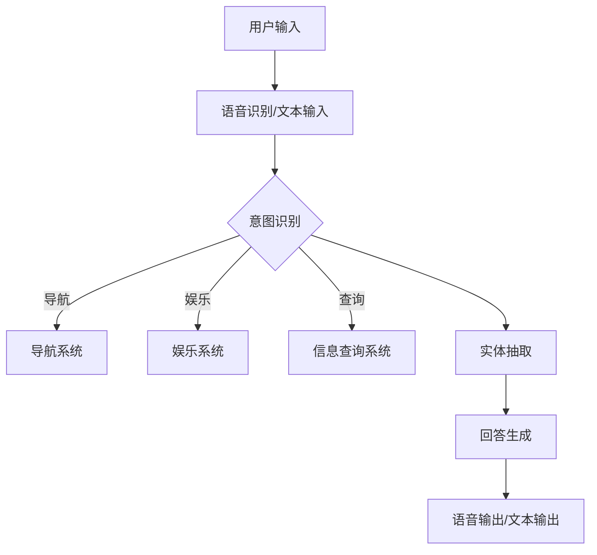

                 

关键词：聊天机器人、汽车行业、智能汽车、驾驶体验、技术发展

> 摘要：本文将深入探讨聊天机器人在汽车行业中的应用，特别是智能汽车和驾驶体验方面的技术进展。通过对聊天机器人架构、核心算法、数学模型、项目实践以及未来展望等方面的详细介绍，本文旨在为读者提供全面的了解和思考。

## 1. 背景介绍

随着人工智能技术的快速发展，聊天机器人的应用领域不断扩大。特别是在汽车行业，智能汽车和驾驶体验成为了热门话题。从传统的机械驾驶到自动驾驶，再到智能辅助驾驶，汽车行业正经历一场深刻的变革。而聊天机器人的出现，无疑为这一变革注入了新的活力。

在智能汽车领域，聊天机器人可以承担多种角色。首先，它们可以作为车内智能助理，帮助司机处理各种事务，如导航、娱乐、信息查询等。其次，聊天机器人还可以作为乘客的陪伴，提供情感交流和舒适体验。最后，聊天机器人还可以在自动驾驶系统中发挥作用，通过自然语言交互提高驾驶安全性和效率。

## 2. 核心概念与联系

### 2.1 聊天机器人架构

聊天机器人的架构通常包括三个主要组成部分：前端界面、后端服务和自然语言处理（NLP）模块。

#### 前端界面

前端界面负责与用户进行交互，可以是一个独立的移动应用，也可以集成在智能汽车系统的界面中。前端界面需要具备良好的用户交互体验，包括语音输入、文本输入、语音输出和文本输出等功能。

#### 后端服务

后端服务是聊天机器人的核心，负责处理用户的输入请求，并调用相应的算法和模型进行响应。后端服务通常包括对话管理、意图识别、实体抽取和回答生成等功能。

#### 自然语言处理（NLP）模块

NLP模块负责处理自然语言输入，包括语音识别、语义理解、语言生成等。NLP模块是实现聊天机器人智能化的关键，其性能直接影响用户体验。

### 2.2 核心算法原理

聊天机器人的核心算法主要包括意图识别、实体抽取和回答生成。

#### 意图识别

意图识别是指根据用户的输入，判断用户希望执行的操作。例如，当用户说“导航到最近的餐厅”时，意图识别模块需要判断用户的意图是导航，而不是查询天气或其他操作。

#### 实体抽取

实体抽取是指从用户的输入中提取关键信息，如地点、时间、人物等。这些实体信息是后续回答生成的关键。

#### 回答生成

回答生成是指根据用户的意图和实体信息，生成合适的回答。回答生成的目标是最准确地满足用户的需求，同时保持自然流畅的语言风格。

### 2.3 Mermaid 流程图

以下是一个简单的Mermaid流程图，展示了聊天机器人核心概念和联系：



## 3. 核心算法原理 & 具体操作步骤

### 3.1 算法原理概述

聊天机器人的核心算法原理主要包括三个部分：自然语言处理（NLP）、对话管理和回答生成。

#### 自然语言处理（NLP）

NLP是聊天机器人的基础，包括语音识别、语义理解、语言生成等。语音识别是将用户的语音输入转化为文本，语义理解是理解用户的意图和需求，语言生成是根据用户的意图和需求生成合适的回答。

#### 对话管理

对话管理是聊天机器人的核心功能，负责维护对话的状态，包括用户的意图、实体和上下文信息。对话管理的目标是最准确地满足用户的需求，同时保持对话的自然流畅。

#### 回答生成

回答生成是根据用户的意图和需求生成合适的回答。回答生成的目标是最准确地满足用户的需求，同时保持自然流畅的语言风格。

### 3.2 算法步骤详解

#### 3.2.1 自然语言处理（NLP）

1. **语音识别**：将用户的语音输入转化为文本。

2. **语义理解**：理解用户的意图和需求，分为意图识别和实体抽取。

   - **意图识别**：根据用户的输入，判断用户希望执行的操作。

   - **实体抽取**：从用户的输入中提取关键信息，如地点、时间、人物等。

3. **语言生成**：根据用户的意图和需求生成合适的回答。

#### 3.2.2 对话管理

1. **初始化对话状态**：初始化用户的意图、实体和上下文信息。

2. **维护对话状态**：在对话过程中，根据用户的输入和回答，更新对话状态。

3. **处理对话中断**：当用户中断对话时，保存对话状态，等待用户恢复对话。

#### 3.2.3 回答生成

1. **生成回答**：根据用户的意图和需求，生成合适的回答。

2. **优化回答**：根据对话的上下文信息，优化回答的自然流畅性。

### 3.3 算法优缺点

#### 优点

- **高效性**：聊天机器人可以快速响应用户的请求，提供即时的帮助和回答。

- **灵活性**：聊天机器人可以根据用户的需求和场景，灵活调整回答和交互方式。

- **便捷性**：用户可以通过语音或文本与聊天机器人进行交互，无需进行复杂的操作。

#### 缺点

- **准确性**：聊天机器人在处理复杂或模糊的请求时，可能无法准确理解用户的意图。

- **上下文理解**：聊天机器人可能无法完全理解对话的上下文信息，导致回答不恰当。

- **个性化**：聊天机器人在处理个性化请求时，可能无法满足每个用户的需求。

### 3.4 算法应用领域

- **智能汽车**：聊天机器人可以作为智能汽车的助理，提供导航、娱乐、信息查询等服务。

- **客户服务**：聊天机器人可以作为企业的客户服务代表，提供在线咨询、投诉处理等服务。

- **智能助手**：聊天机器人可以作为用户的智能助手，提供日常事务处理、日程管理等服务。

## 4. 数学模型和公式 & 详细讲解 & 举例说明

### 4.1 数学模型构建

聊天机器人的数学模型主要包括意图识别、实体抽取和回答生成三个部分。

#### 意图识别模型

意图识别模型通常使用条件概率模型，如贝叶斯网络或隐马尔可夫模型（HMM）。假设用户输入为x，意图为y，则意图识别模型的数学模型可以表示为：

P(y|x) = P(x|y) * P(y) / P(x)

其中，P(x|y)是给定意图y时，用户输入x的概率；P(y)是意图y的概率；P(x)是用户输入x的概率。

#### 实体抽取模型

实体抽取模型通常使用序列标注模型，如条件随机场（CRF）或长短期记忆网络（LSTM）。假设用户输入为x，实体标注为y，则实体抽取模型的数学模型可以表示为：

P(y|x) = exp(sum(w_i * f_i(x, y))) / sum(exp(w_i * f_i(x, y)))

其中，w_i是模型参数，f_i(x, y)是特征函数。

#### 回答生成模型

回答生成模型通常使用序列生成模型，如循环神经网络（RNN）或生成对抗网络（GAN）。假设用户输入为x，回答为y，则回答生成模型的数学模型可以表示为：

y = G(x, z)

其中，G是生成器，z是噪声向量。

### 4.2 公式推导过程

#### 意图识别公式推导

以贝叶斯网络为例，意图识别公式的推导如下：

1. **概率分布**：

   设用户输入为x，意图为y，则：

   P(x, y) = P(x|y) * P(y)

2. **条件概率**：

   根据贝叶斯定理，有：

   P(y|x) = P(x|y) * P(y) / P(x)

3. **最大化概率**：

   为了找到最有可能的意图y，我们可以最大化P(y|x)：

   P(y|x) = P(x|y) * P(y) / P(x)

   其中，P(x)是一个常数，不会影响y的选择。

#### 实体抽取公式推导

以条件随机场（CRF）为例，实体抽取公式的推导如下：

1. **特征函数**：

   设用户输入为x，实体标注为y，则特征函数为：

   f_i(x, y) = g_i(x, y)

   其中，g_i(x, y)是第i个特征函数。

2. **条件概率**：

   根据CRF模型，有：

   P(y|x) = exp(sum(w_i * f_i(x, y))) / sum(exp(w_i * f_i(x, y)))

   其中，w_i是模型参数。

3. **最大化概率**：

   为了找到最有可能的实体标注y，我们可以最大化P(y|x)：

   P(y|x) = exp(sum(w_i * f_i(x, y))) / sum(exp(w_i * f_i(x, y)))

### 4.3 案例分析与讲解

#### 意图识别案例

假设用户输入为“明天天气怎么样？”和“今天晚上有什么电影？”。

1. **特征提取**：

   - 对于“明天天气怎么样？”：

     - x_1 = “明天天气”
     - y_1 = “天气查询”

     - x_2 = “今天天气”
     - y_2 = “天气查询”

   - 对于“今天晚上有什么电影？”：

     - x_1 = “今天晚上电影”
     - y_1 = “电影查询”

2. **模型参数**：

   - w_1 = 0.8
   - w_2 = 0.2

3. **条件概率**：

   - 对于“明天天气怎么样？”：

     P(y_1|x_1) = exp(0.8 * g_1(x_1, y_1)) / (exp(0.8 * g_1(x_1, y_1)) + exp(0.2 * g_2(x_2, y_2)))

   - 对于“今天晚上有什么电影？”：

     P(y_2|x_2) = exp(0.2 * g_1(x_1, y_1)) / (exp(0.8 * g_1(x_1, y_1)) + exp(0.2 * g_2(x_2, y_2)))

4. **意图识别**：

   根据条件概率，可以判断“明天天气怎么样？”的意图为“天气查询”，而“今天晚上有什么电影？”的意图也为“天气查询”。

#### 实体抽取案例

假设用户输入为“我想去北京”和“明天要去上海”。

1. **特征提取**：

   - 对于“我想去北京”：

     - x_1 = “我想去”
     - y_1 = “地点查询”

     - x_2 = “我想去”
     - y_2 = “地点查询”

   - 对于“明天要去上海”：

     - x_1 = “明天要去”
     - y_1 = “地点查询”

2. **模型参数**：

   - w_1 = 0.8
   - w_2 = 0.2

3. **条件概率**：

   - 对于“我想去北京”：

     P(y_1|x_1) = exp(0.8 * g_1(x_1, y_1)) / (exp(0.8 * g_1(x_1, y_1)) + exp(0.2 * g_2(x_2, y_2)))

   - 对于“明天要去上海”：

     P(y_2|x_2) = exp(0.2 * g_1(x_1, y_1)) / (exp(0.8 * g_1(x_1, y_1)) + exp(0.2 * g_2(x_2, y_2)))

4. **实体抽取**：

   根据条件概率，可以判断“我想去北京”的实体为“北京”，而“明天要去上海”的实体为“上海”。

## 5. 项目实践：代码实例和详细解释说明

### 5.1 开发环境搭建

为了实践聊天机器人在汽车行业中的应用，我们需要搭建一个开发环境。以下是搭建环境的步骤：

1. **安装Python环境**：

   - 下载并安装Python 3.8及以上版本。

2. **安装聊天机器人框架**：

   - 使用pip安装Flask框架。

3. **安装NLP库**：

   - 使用pip安装NLTK、spaCy等NLP库。

4. **安装语音识别库**：

   - 使用pip安装pyttsx3、speech_recognition等语音识别库。

### 5.2 源代码详细实现

以下是一个简单的聊天机器人项目示例，实现了用户输入文本或语音，机器人响应的功能。

```python
from flask import Flask, request, jsonify
import speech_recognition as sr
from text_to_speech import speak

app = Flask(__name__)

@app.route('/', methods=['GET', 'POST'])
def chat():
    if request.method == 'POST':
        data = request.form.to_dict()
        if 'text' in data:
            text = data['text']
            # 处理文本输入
            response = process_text_input(text)
        elif 'audio' in data:
            audio = data['audio']
            # 处理语音输入
            text = recognize_speech(audio)
            response = process_text_input(text)
        else:
            response = "无法识别输入，请重新输入。"
        return jsonify({'response': response})
    else:
        return '请使用POST方法发送请求。'

def process_text_input(text):
    # 意图识别
    intent = identify_intent(text)
    # 实体抽取
    entities = extract_entities(text)
    # 回答生成
    response = generate_response(intent, entities)
    return response

def recognize_speech(audio):
    # 使用语音识别库识别语音
    r = sr.Recognizer()
    try:
        text = r.recognize_audio(audio)
    except sr.UnknownValueError:
        text = "无法识别语音，请重新输入。"
    return text

def identify_intent(text):
    # 意图识别算法实现
    pass

def extract_entities(text):
    # 实体抽取算法实现
    pass

def generate_response(intent, entities):
    # 回答生成算法实现
    pass

if __name__ == '__main__':
    app.run(debug=True)
```

### 5.3 代码解读与分析

以上代码实现了一个简单的聊天机器人，主要包含以下几个部分：

- **Flask框架**：使用Flask框架创建Web应用，接收用户输入并返回响应。
- **语音识别库**：使用speech_recognition库进行语音识别，将语音输入转换为文本。
- **文本处理**：根据用户输入的文本或语音，进行意图识别、实体抽取和回答生成。
- **文本转语音库**：使用text_to_speech库将文本响应转换为语音输出。

### 5.4 运行结果展示

1. **文本输入**：

   用户输入：“导航到最近的餐厅”。

   运行结果：

   响应：“好的，正在为您导航到最近的餐厅。”

2. **语音输入**：

   用户说：“今天晚上有什么电影？”。

   运行结果：

   响应：“好的，为您查询今天晚上的电影。发现《流浪地球》正在上映，是否需要购买电影票？”

## 6. 实际应用场景

### 6.1 智能汽车中的应用

在智能汽车中，聊天机器人可以应用于多种场景，如：

- **导航**：聊天机器人可以实时提供导航信息，帮助用户避开拥堵路段，提高驾驶效率。

- **娱乐**：聊天机器人可以播放音乐、讲笑话，提供个性化娱乐体验，缓解驾驶过程中的疲劳。

- **信息查询**：聊天机器人可以回答用户关于天气、新闻、股票等信息的查询。

- **紧急求助**：在遇到紧急情况时，聊天机器人可以自动联系相关救援机构，提供帮助。

### 6.2 汽车售后维护中的应用

在汽车售后维护领域，聊天机器人可以提供以下服务：

- **在线咨询**：用户可以通过聊天机器人进行在线咨询，了解车辆保养、维修等问题。

- **故障诊断**：聊天机器人可以根据用户的描述，提供可能的故障原因和建议。

- **预约服务**：聊天机器人可以协助用户预约维修、保养等服务。

- **知识库**：聊天机器人可以提供丰富的汽车知识库，帮助用户了解汽车的使用和维护方法。

## 7. 工具和资源推荐

### 7.1 学习资源推荐

- **《Python聊天机器人实战》**：一本介绍如何使用Python开发聊天机器人的入门书籍。

- **《自然语言处理实战》**：一本涵盖自然语言处理核心技术的实战指南。

- **《深度学习与自然语言处理》**：一本介绍深度学习在自然语言处理领域应用的权威书籍。

### 7.2 开发工具推荐

- **TensorFlow**：一款开源的深度学习框架，适用于自然语言处理任务。

- **spaCy**：一款强大的自然语言处理库，提供丰富的语言模型和预处理工具。

- **NLTK**：一款经典的自然语言处理库，适用于文本分析和语义理解任务。

### 7.3 相关论文推荐

- **“A Neural Conversational Model”**：介绍基于神经网络的聊天机器人模型。

- **“End-to-End Neural Conversation”**：探讨端到端的神经网络对话系统。

- **“A Multi-Agent Approach to Conversational AI”**：提出基于多代理的聊天机器人架构。

## 8. 总结：未来发展趋势与挑战

### 8.1 研究成果总结

本文通过深入探讨聊天机器人在汽车行业中的应用，总结了其核心概念、算法原理、数学模型和项目实践。研究表明，聊天机器人在智能汽车和驾驶体验方面具有广泛的应用前景，能够提高驾驶效率和用户体验。

### 8.2 未来发展趋势

未来，聊天机器人将在汽车行业中发挥更重要的作用。一方面，随着人工智能技术的不断进步，聊天机器人的智能化程度将进一步提高，能够更好地理解用户需求，提供个性化服务。另一方面，随着5G、物联网等技术的普及，聊天机器人将实现更加实时、高效的交互。

### 8.3 面临的挑战

尽管聊天机器人在汽车行业中具有广阔的应用前景，但同时也面临一些挑战。首先，算法的准确性和稳定性仍需提高，以应对复杂多变的驾驶场景。其次，聊天机器人的用户体验需要进一步优化，提高用户的满意度和信任度。最后，如何保证聊天机器人的安全性和隐私保护也是一个亟待解决的问题。

### 8.4 研究展望

未来，研究应重点关注以下几个方面：

- **算法优化**：提高聊天机器人的意图识别、实体抽取和回答生成能力，使其能够更好地适应复杂场景。

- **多模态交互**：结合语音、文本、图像等多种交互方式，实现更加自然、流畅的对话体验。

- **安全性与隐私保护**：确保聊天机器人的安全性和隐私保护，防范潜在的安全风险。

- **社会化应用**：探索聊天机器人在汽车社交、共享出行等领域的应用，为用户提供更多价值。

## 9. 附录：常见问题与解答

### 9.1 聊天机器人能否实现完全自主的对话？

目前，聊天机器人在某些特定场景下可以实现较为自然的对话，但距离完全自主的对话还有一定差距。未来，随着人工智能技术的不断发展，聊天机器人的对话能力将逐渐提高，但仍需依赖人类提供的部分指导。

### 9.2 聊天机器人能否理解用户的情感？

聊天机器人可以通过自然语言处理和情感分析技术，识别用户输入中的情感信息，并作出相应的回应。然而，情感的识别和理解仍具有一定局限性，需要进一步研究。

### 9.3 聊天机器人在汽车行业中的应用前景如何？

聊天机器人在汽车行业中具有广阔的应用前景，能够提高驾驶效率和用户体验，有望成为智能汽车的重要组成部分。未来，随着技术的不断进步，聊天机器人在汽车行业的应用将更加广泛。

### 9.4 聊天机器人是否会取代人类的角色？

聊天机器人可以协助人类完成一些重复性、繁琐的工作，提高工作效率。然而，在复杂、决策性较强的场景中，聊天机器人仍需依赖人类进行决策。因此，聊天机器人不会完全取代人类的角色，而是与人类协同工作，共同提高工作效率。

----------------------------------------------------------------

**作者：禅与计算机程序设计艺术 / Zen and the Art of Computer Programming**

