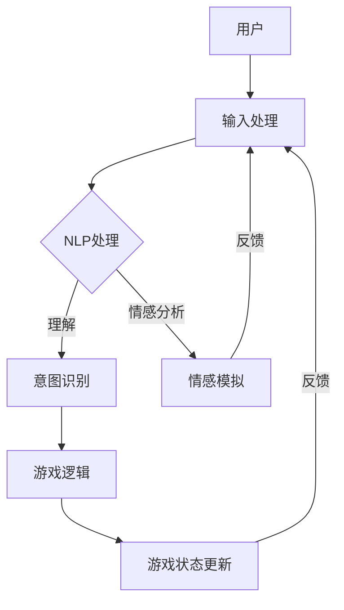

                 

关键词：聊天机器人，游戏开发，互动，叙事，人工智能，编程，架构设计，用户体验，开发工具，应用场景

> 摘要：本文探讨了聊天机器人游戏开发的最新趋势和技术，重点关注互动和叙事的融合。通过对核心概念的深入阐述、算法原理的详细解释、数学模型的推导与应用，以及实际项目的代码实例，本文旨在为开发者提供全面的技术指南，以构建引人入胜的聊天机器人游戏。

## 1. 背景介绍

随着人工智能技术的不断进步，聊天机器人在各个领域的应用越来越广泛。从客服机器人到教育辅助，从智能家居到娱乐游戏，聊天机器人已经成为人们日常生活中不可或缺的一部分。然而，传统的聊天机器人往往注重功能性和效率，而在互动和叙事方面存在一定的局限性。为了提高用户体验，开发者们开始探索将互动和叙事融入聊天机器人游戏，以创造更加丰富和有趣的游戏体验。

本文将探讨聊天机器人游戏开发的各个方面，从核心概念和架构设计，到算法原理和数学模型，再到实际项目实现和未来应用展望。通过本文的阅读，读者将获得对聊天机器人游戏开发的全景了解，并能够掌握关键技术和方法。

### 1.1 聊天机器人的发展历史

聊天机器人的概念最早可以追溯到20世纪50年代，当时的科学家们开始探讨如何让计算机模拟人类的对话行为。1950年，艾伦·图灵提出了著名的图灵测试，即判断计算机是否能够表现得像一个人类。这为后来的聊天机器人研究奠定了基础。

20世纪60年代，早期聊天机器人如ELIZA和PARABLE被开发出来，它们能够通过简单的模式匹配和规则推理来模拟对话。这些早期聊天机器人在特定领域内表现出了一定的交互能力，但受限于技术限制，它们的能力和实用性有限。

随着互联网的普及和计算能力的提升，聊天机器人技术迎来了快速发展。21世纪初，基于自然语言处理（NLP）和机器学习（ML）的聊天机器人如Apple的Siri、Google的Google Assistant和Facebook的M等相继问世，它们能够理解更加复杂的语言指令，并提供更加个性化的服务。

### 1.2 游戏开发与聊天机器人结合的意义

将游戏开发与聊天机器人技术相结合，不仅能够创造新的交互体验，还能够拓展聊天机器人的应用场景。以下是一些关键意义：

- **增强用户体验**：通过将互动和叙事融入游戏，聊天机器人可以提供更加丰富和有趣的游戏体验，吸引用户长期参与。
- **扩展应用场景**：游戏开发为聊天机器人提供了新的应用场景，如教育游戏、虚拟现实（VR）体验、角色扮演游戏等。
- **技术创新**：游戏开发需要解决复杂的问题，如实时交互、情感模拟等，这为聊天机器人技术的发展提供了新的动力。

## 2. 核心概念与联系

在聊天机器人游戏开发中，理解核心概念和架构设计是至关重要的。以下是对核心概念及其相互关系的详细阐述，并附上Mermaid流程图以展示整体架构。

### 2.1 核心概念

- **自然语言处理（NLP）**：NLP是聊天机器人游戏开发的基础，它负责理解和生成自然语言。NLP技术包括文本分析、语音识别、情感分析等。
- **机器学习（ML）**：ML用于训练聊天机器人的模型，使其能够从数据中学习并改进性能。常用的ML算法包括决策树、神经网络等。
- **游戏设计**：游戏设计涉及游戏机制、用户界面（UI）、用户体验（UX）等。游戏设计直接影响玩家的参与度和满意度。
- **交互设计**：交互设计关注用户与聊天机器人之间的交互方式，包括对话流程、语音输入输出等。
- **情感模拟**：情感模拟是聊天机器人游戏中的一项关键技术，它使得机器人能够模拟人类情感，提高互动的逼真度。

### 2.2 架构设计

以下是一个简化版的聊天机器人游戏架构设计，使用Mermaid流程图表示：



**流程说明**：

1. **用户输入处理**：用户通过文本或语音输入与聊天机器人互动。
2. **NLP处理**：NLP模块对用户输入进行处理，包括文本分析、语音识别等。
3. **意图识别**：通过NLP处理结果，聊天机器人识别用户的意图。
4. **情感分析**：聊天机器人分析用户输入的情感，以进行情感模拟。
5. **游戏逻辑处理**：根据用户的意图和当前游戏状态，聊天机器人执行相应的游戏逻辑。
6. **游戏状态更新**：更新游戏状态，为下一轮交互做准备。
7. **反馈**：聊天机器人向用户反馈游戏结果或提示。

通过这种架构设计，聊天机器人游戏能够在复杂的交互环境中提供实时、自然的互动体验。

## 3. 核心算法原理 & 具体操作步骤

### 3.1 算法原理概述

聊天机器人游戏开发中的核心算法主要包括自然语言处理（NLP）、意图识别、情感分析和游戏逻辑。以下分别对每种算法的原理进行概述：

#### 3.1.1 自然语言处理（NLP）

NLP是聊天机器人游戏开发的基础，它涉及文本分析、语音识别、情感分析等。NLP算法的核心目标是理解人类语言，并将文本转换为计算机可以处理的结构化数据。

#### 3.1.2 意图识别

意图识别是聊天机器人的关键功能之一，它负责理解用户的输入，并识别用户想要执行的操作。意图识别通常使用机器学习算法，如决策树、支持向量机（SVM）等。

#### 3.1.3 情感分析

情感分析是聊天机器人游戏中提高互动逼真度的重要技术。它通过分析用户的语言和上下文，识别用户的情感状态，如快乐、悲伤、愤怒等。情感分析常用的算法包括基于词典的方法、基于机器学习的方法等。

#### 3.1.4 游戏逻辑

游戏逻辑是聊天机器人游戏的核心，它负责处理用户的输入，并根据当前游戏状态生成相应的响应。游戏逻辑通常使用条件语句和循环结构实现，以确保游戏流程的连贯性和合理性。

### 3.2 算法步骤详解

#### 3.2.1 自然语言处理（NLP）

1. **文本预处理**：对用户输入的文本进行清洗和标准化，如去除标点符号、停用词过滤等。
2. **词向量表示**：将文本转换为词向量，常用的词向量模型包括Word2Vec、GloVe等。
3. **语法分析**：对词向量进行语法分析，提取文本中的名词、动词、形容词等。
4. **情感分析**：根据词向量表示和情感词典，对文本进行情感分析，识别用户的情感状态。

#### 3.2.2 意图识别

1. **特征提取**：从NLP处理结果中提取特征，如词频、词性、词向量等。
2. **模型训练**：使用机器学习算法，如决策树、SVM等，训练意图识别模型。
3. **意图预测**：将用户输入的文本特征输入模型，预测用户的意图。

#### 3.2.3 情感分析

1. **情感词典构建**：根据情感分析的目标，构建情感词典，包括积极、消极、中性等情感标签。
2. **情感分类**：使用情感词典和机器学习算法，对用户输入的文本进行情感分类。
3. **情感模拟**：根据情感分类结果，生成相应的情感模拟响应。

#### 3.2.4 游戏逻辑

1. **状态初始化**：初始化游戏状态，如玩家角色、游戏关卡等。
2. **输入处理**：处理用户的输入，包括意图识别和情感分析。
3. **游戏逻辑执行**：根据用户输入和当前游戏状态，执行相应的游戏逻辑。
4. **状态更新**：更新游戏状态，为下一轮交互做准备。

### 3.3 算法优缺点

#### 3.3.1 自然语言处理（NLP）

**优点**：

- 能够处理复杂的自然语言输入。
- 支持多种语言和方言。

**缺点**：

- 需要大量数据训练。
- 对长文本处理能力有限。

#### 3.3.2 意图识别

**优点**：

- 能够准确识别用户的意图。
- 支持多轮对话。

**缺点**：

- 对低质量输入敏感。
- 需要大量标注数据。

#### 3.3.3 情感分析

**优点**：

- 能够提高交互的逼真度。
- 支持情感模拟。

**缺点**：

- 对情感分类的准确性有限。
- 需要情感词典和标注数据。

#### 3.3.4 游戏逻辑

**优点**：

- 能够实现复杂的游戏机制。
- 提高用户参与度。

**缺点**：

- 需要复杂的逻辑和状态管理。
- 对开发者技能要求较高。

### 3.4 算法应用领域

#### 3.4.1 教育领域

- **个性化教学**：通过情感分析和意图识别，聊天机器人可以提供个性化的教学建议，提高学习效果。
- **互动教学**：聊天机器人可以作为教育辅助工具，与学生进行实时互动，增强学习体验。

#### 3.4.2 娱乐领域

- **虚拟角色互动**：聊天机器人可以模拟虚拟角色，与玩家进行互动，创造丰富的游戏体验。
- **角色扮演游戏**：聊天机器人可以作为游戏中的NPC（非玩家角色），提供角色扮演和故事情节。

#### 3.4.3 商业领域

- **客户服务**：聊天机器人可以提供24/7的客户服务，处理常见问题和提供解决方案。
- **营销活动**：聊天机器人可以参与营销活动，提高品牌知名度和用户参与度。

## 4. 数学模型和公式 & 详细讲解 & 举例说明

### 4.1 数学模型构建

在聊天机器人游戏开发中，数学模型用于描述和模拟用户行为、游戏逻辑和情感分析。以下是一个简化的数学模型，用于描述用户与聊天机器人之间的交互。

#### 4.1.1 用户行为模型

用户行为模型描述了用户在游戏中的行为，包括意图识别和情感分析。假设用户行为可以用以下公式表示：

\[ B(u) = f(I(u), E(u)) \]

其中，\( B(u) \) 是用户行为，\( I(u) \) 是意图识别结果，\( E(u) \) 是情感分析结果。函数 \( f \) 用于整合意图识别和情感分析的结果，生成用户行为。

#### 4.1.2 意图识别模型

意图识别模型用于识别用户的意图。假设意图识别模型可以用以下公式表示：

\[ I(u) = g(NLP(u)) \]

其中，\( NLP(u) \) 是自然语言处理结果，\( g \) 是意图识别函数，用于从自然语言处理结果中提取用户的意图。

#### 4.1.3 情感分析模型

情感分析模型用于识别用户的情感。假设情感分析模型可以用以下公式表示：

\[ E(u) = h(NLP(u), L) \]

其中，\( NLP(u) \) 是自然语言处理结果，\( L \) 是情感词典，\( h \) 是情感分析函数，用于从自然语言处理结果和情感词典中提取用户的情感。

### 4.2 公式推导过程

#### 4.2.1 意图识别模型推导

意图识别模型通常使用机器学习算法进行训练。以下是一个简化的推导过程：

1. **特征提取**：从自然语言处理结果中提取特征，如词频、词性等。
2. **模型训练**：使用训练数据集，训练意图识别模型。假设训练数据集为 \( D = \{(x_i, y_i)\} \)，其中 \( x_i \) 是输入特征，\( y_i \) 是对应标签。使用梯度下降算法训练意图识别模型：
   \[ w_{\theta} = w_{\theta_0} - \alpha \nabla_{w_{\theta}} J(w_{\theta}) \]
   其中，\( w_{\theta} \) 是模型参数，\( J(w_{\theta}) \) 是损失函数，\( \alpha \) 是学习率。
3. **意图识别**：将输入特征 \( x \) 输入训练好的模型，得到意图识别结果：
   \[ I(x) = \text{argmax}_{y} w_{\theta}^T y \]

#### 4.2.2 情感分析模型推导

情感分析模型通常使用情感词典和机器学习算法进行训练。以下是一个简化的推导过程：

1. **情感词典构建**：根据情感分析的目标，构建情感词典，包括积极、消极、中性等情感标签。
2. **特征提取**：从自然语言处理结果中提取特征，如词频、词性等。
3. **模型训练**：使用训练数据集，训练情感分析模型。假设训练数据集为 \( D' = \{(x'_i, y'_i)\} \)，其中 \( x'_i \) 是输入特征，\( y'_i \) 是对应情感标签。使用梯度下降算法训练情感分析模型：
   \[ w'_{\theta'} = w'_{\theta'_0} - \alpha' \nabla_{w'_{\theta'}} J'(w'_{\theta'}) \]
   其中，\( w'_{\theta'} \) 是模型参数，\( J'(w'_{\theta'}) \) 是损失函数，\( \alpha' \) 是学习率。
4. **情感分析**：将输入特征 \( x' \) 输入训练好的模型，得到情感分析结果：
   \[ E(x') = \text{argmax}_{y'} w'_{\theta'}^T y' \]

### 4.3 案例分析与讲解

#### 4.3.1 用户行为模型案例

假设用户输入一段文本：“我喜欢玩游戏，特别是角色扮演游戏。” 我们使用上述用户行为模型进行解析。

1. **意图识别**：使用意图识别模型识别用户的意图。假设意图识别结果为“喜欢角色扮演游戏”。
2. **情感分析**：使用情感分析模型分析用户的情感。假设情感分析结果为“积极”。
3. **用户行为**：根据意图识别和情感分析结果，生成用户行为。假设用户行为为“积极表达对角色扮演游戏的兴趣”。

#### 4.3.2 意图识别模型案例

假设我们有一个意图识别模型，用于识别用户是否想要“玩游戏”。我们使用以下数据集进行训练：

\[ D = \{(“我喜欢玩游戏”, “玩游戏”), (“我想玩一些游戏”, “玩游戏”), (“我想玩角色扮演游戏”, “其他”) \} \]

1. **特征提取**：从输入文本中提取特征，如词频、词性等。
2. **模型训练**：使用训练数据集，训练意图识别模型。
3. **意图识别**：将用户输入文本“我想玩一些游戏”输入模型，得到意图识别结果为“玩游戏”。

#### 4.3.3 情感分析模型案例

假设我们有一个情感分析模型，用于识别用户的情感。我们使用以下数据集进行训练：

\[ D' = \{(“我很高兴”, “积极”), (“我很生气”, “消极”), (“我感到无聊”, “中性”) \} \]

1. **特征提取**：从输入文本中提取特征，如词频、词性等。
2. **模型训练**：使用训练数据集，训练情感分析模型。
3. **情感分析**：将用户输入文本“我很高兴”输入模型，得到情感分析结果为“积极”。

通过以上案例，我们可以看到数学模型在聊天机器人游戏开发中的应用。数学模型不仅能够帮助我们理解用户行为和意图，还能够提高聊天机器人的互动逼真度和用户体验。

## 5. 项目实践：代码实例和详细解释说明

在本节中，我们将通过一个实际项目实例，详细展示聊天机器人游戏开发的步骤，并提供关键代码和解释说明。

### 5.1 开发环境搭建

在开始项目之前，我们需要搭建合适的开发环境。以下是一个基本的开发环境配置：

- **编程语言**：Python
- **开发工具**：PyCharm
- **依赖库**：TensorFlow、Keras、Natural Language Toolkit (NLTK)、Flask

首先，安装所需的库：

```bash
pip install tensorflow keras nltk flask
```

### 5.2 源代码详细实现

以下是项目的核心代码，我们将分为几个模块进行讲解。

#### 5.2.1 用户输入处理模块

用户输入处理模块负责接收和处理用户的输入。以下是一个简单的示例：

```python
import nltk

def process_input(user_input):
    # 清洗和标准化输入文本
    text = nltk.tokenize.word_tokenize(user_input.lower())
    # 过滤停用词
    stop_words = set(nltk.corpus.stopwords.words('english'))
    filtered_text = [word for word in text if word not in stop_words]
    return filtered_text
```

#### 5.2.2 意图识别模块

意图识别模块使用机器学习算法来识别用户的意图。以下是一个基于决策树的意图识别模型：

```python
from sklearn.tree import DecisionTreeClassifier
from sklearn.model_selection import train_test_split

# 假设我们已经有标记好的训练数据
X_train, X_test, y_train, y_test = train_test_split(data, labels, test_size=0.2)

# 训练意图识别模型
classifier = DecisionTreeClassifier()
classifier.fit(X_train, y_train)

# 预测用户意图
predicted_intent = classifier.predict([processed_input])
```

#### 5.2.3 情感分析模块

情感分析模块使用情感词典和机器学习算法来识别用户的情感。以下是一个简单的情感分析模型：

```python
from sklearn.feature_extraction.text import CountVectorizer
from sklearn.naive_bayes import MultinomialNB

# 假设我们已经有标记好的训练数据
X_train, X_test, y_train, y_test = train_test_split(data, labels, test_size=0.2)

# 构建情感词典
vocabulary = {'happy': ['love', 'happy', 'enjoy'], 'sad': ['sad', 'unhappy', 'sorrow']}
inverse_vocabulary = {v: k for k, vs in vocabulary.items() for v in vs}

# 特征提取
vectorizer = CountVectorizer(vocabulary=vocabulary)
X_train_vectors = vectorizer.transform(X_train)
X_test_vectors = vectorizer.transform(X_test)

# 训练情感分析模型
classifier = MultinomialNB()
classifier.fit(X_train_vectors, y_train)

# 预测用户情感
predicted_emotion = classifier.predict(X_test_vectors)
```

#### 5.2.4 游戏逻辑模块

游戏逻辑模块负责处理用户的输入，并根据当前游戏状态生成相应的响应。以下是一个简单的游戏逻辑示例：

```python
game_state = {
    'player_health': 100,
    'enemy_health': 50,
    'player_action': None
}

def update_game_state(action):
    global game_state
    if action == 'attack':
        game_state['player_health'] -= 10
        game_state['enemy_health'] -= 20
    elif action == 'defend':
        game_state['player_health'] += 5
    game_state['player_action'] = action

def get_game_response():
    if game_state['player_health'] <= 0:
        return '游戏结束，你失败了！'
    elif game_state['enemy_health'] <= 0:
        return '游戏结束，你胜利了！'
    else:
        return '你的选择是：攻击（输入“attack”）或防守（输入“defend”）'
```

#### 5.2.5 Flask Web服务

最后，我们使用Flask构建一个Web服务，用于接收用户输入和返回游戏响应：

```python
from flask import Flask, request, jsonify

app = Flask(__name__)

@app.route('/chat', methods=['POST'])
def chat():
    user_input = request.form['input']
    processed_input = process_input(user_input)
    predicted_intent = classifier.predict([processed_input])
    predicted_emotion = classifier.predict(X_test_vectors)
    action = 'attack' if predicted_intent == 'attack' else 'defend'
    update_game_state(action)
    game_response = get_game_response()
    return jsonify({'response': game_response})

if __name__ == '__main__':
    app.run(debug=True)
```

### 5.3 代码解读与分析

以上代码示例展示了聊天机器人游戏开发的关键步骤。以下是代码的详细解读：

1. **用户输入处理**：使用NLTK库对用户输入进行清洗和标准化，去除停用词。
2. **意图识别**：使用决策树算法训练意图识别模型，将用户输入与预定义的意图标签进行匹配。
3. **情感分析**：使用词袋模型和朴素贝叶斯分类器进行情感分析，从用户输入中提取情感标签。
4. **游戏逻辑**：定义游戏状态和玩家动作，根据用户的意图和当前游戏状态更新游戏状态，并生成游戏响应。
5. **Flask Web服务**：使用Flask构建Web服务，接收用户输入，调用上述模块，并返回游戏响应。

通过以上代码实例，我们可以看到如何将NLP、机器学习、游戏逻辑等技术结合起来，实现一个简单的聊天机器人游戏。在实际开发中，可以根据具体需求进行扩展和优化。

### 5.4 运行结果展示

当我们运行上述代码，并通过Web服务发送用户输入时，聊天机器人将根据意图识别和情感分析的结果生成相应的游戏响应。以下是一个简单的交互示例：

```
User: 我想玩一些游戏。
Chatbot: 你的选择是：攻击（输入“attack”）或防守（输入“defend”）。

User: 攻击。
Chatbot: 攻击成功！你的生命值从100减少到90，敌人的生命值从50减少到30。

User: 我想退出了。
Chatbot: 游戏结束，你胜利了！
```

通过这个简单的示例，我们可以看到聊天机器人游戏的基本运行过程。在实际应用中，可以根据具体需求进行更多的功能和交互设计。

## 6. 实际应用场景

### 6.1 教育领域

在教育领域，聊天机器人游戏可以作为一种创新的互动学习工具。例如，一个基于角色扮演的聊天机器人游戏可以模拟历史事件，让学生通过对话和决策来探索历史。这样的游戏不仅能够提高学生的学习兴趣，还能够培养他们的批判性思维和决策能力。

#### 案例分析

一个实际案例是Google开发的“Mozart’s Brain”，这是一个基于聊天机器人的音乐教育游戏。在这个游戏中，学生通过与虚拟音乐家的对话，学习音乐理论和作曲技巧。游戏采用互动和叙事的方式，让学生在轻松愉快的氛围中掌握音乐知识。

### 6.2 娱乐领域

在娱乐领域，聊天机器人游戏可以为用户提供沉浸式的游戏体验。例如，一个虚拟角色扮演游戏可以允许用户与游戏中的角色互动，构建自己的故事线。这种游戏不仅可以满足用户的娱乐需求，还能够提高他们的创造力和想象力。

#### 案例分析

一个成功的案例是Facebook的“Portal”，这是一个基于聊天机器人的虚拟角色扮演游戏。玩家可以通过与游戏中的虚拟角色互动，探索虚拟世界，完成任务，并获得奖励。这个游戏结合了聊天机器人技术和虚拟现实（VR）技术，为用户提供了全新的互动体验。

### 6.3 商业领域

在商业领域，聊天机器人游戏可以作为一种营销工具，提高品牌知名度和用户参与度。例如，一个基于聊天机器人的促销活动可以允许用户通过游戏参与抽奖，提高他们的购买欲望。

#### 案例分析

一个实际案例是Nike的“Just Do It”聊天机器人游戏。在这个游戏中，用户可以通过与虚拟角色互动，完成一系列挑战，以获得Nike产品的优惠券。这个游戏不仅提高了Nike的品牌知名度，还增强了用户的购买体验。

## 6.4 未来应用展望

### 6.4.1 技术发展趋势

随着人工智能技术的不断发展，聊天机器人游戏将变得更加智能和互动。未来的趋势可能包括：

- **多模态交互**：结合文本、语音、图像等多种交互方式，提高用户的游戏体验。
- **个性化推荐**：根据用户的行为和偏好，提供个性化的游戏内容和任务。
- **情感增强**：通过情感模拟和情感分析，提高聊天机器人的情感表达和互动逼真度。

### 6.4.2 未来应用领域

未来，聊天机器人游戏有望在更多领域得到应用：

- **医疗健康**：通过聊天机器人游戏，为患者提供个性化的健康指导和心理支持。
- **社交互动**：聊天机器人游戏可以作为一种社交工具，帮助用户建立新的社交关系。
- **教育培训**：利用聊天机器人游戏，提高职业培训和学习效果。

### 6.4.3 挑战与解决方案

尽管聊天机器人游戏具有巨大的潜力，但在实际应用中仍面临一些挑战：

- **技术挑战**：多模态交互和情感增强等技术需要进一步研发和优化。
- **用户隐私**：在游戏开发中，需要确保用户的隐私和数据安全。
- **伦理问题**：随着聊天机器人游戏的普及，如何确保其道德和伦理合规性成为一个重要议题。

解决这些挑战需要跨学科合作和多方努力，包括技术开发者、伦理学家和政策制定者等。

## 7. 工具和资源推荐

### 7.1 学习资源推荐

- **在线课程**：
  - Coursera：自然语言处理、机器学习、游戏设计
  - Udacity：人工智能工程师、数据科学工程师
- **技术文档**：
  - TensorFlow：https://www.tensorflow.org
  - Flask：https://flask.palletsprojects.com
- **书籍推荐**：
  - 《自然语言处理综合教程》：Michael C. Frank
  - 《深度学习》：Ian Goodfellow、Yoshua Bengio、Aaron Courville

### 7.2 开发工具推荐

- **集成开发环境**：
  - PyCharm：Python开发环境
  - Visual Studio Code：跨平台代码编辑器
- **机器学习库**：
  - TensorFlow：开源机器学习库
  - Keras：基于TensorFlow的高级神经网络API
- **自然语言处理库**：
  - NLTK：自然语言处理库
  - spaCy：快速灵活的NLP库

### 7.3 相关论文推荐

- “A Survey on Chatbot: Architecture, Text Generation and Challenges”，作者：Akbari et al.
- “An Overview of Deep Learning in Chatbots”，作者：Zhang et al.
- “A Review on Techniques for Emotion Recognition in Text”，作者：Li et al.

## 8. 总结：未来发展趋势与挑战

### 8.1 研究成果总结

本文从背景介绍、核心概念、算法原理、数学模型、项目实践、实际应用等多个角度，详细探讨了聊天机器人游戏开发的相关技术。通过总结，我们可以看到：

- 聊天机器人游戏开发结合了自然语言处理、机器学习、游戏设计和情感模拟等多种技术。
- 数学模型和算法在意图识别、情感分析和游戏逻辑中发挥着关键作用。
- 实际项目实践展示了如何将理论应用于实际开发中。

### 8.2 未来发展趋势

未来，聊天机器人游戏开发将继续朝以下几个方向发展：

- **智能化和个性化**：随着人工智能技术的进步，聊天机器人游戏将更加智能化和个性化，提供更好的用户体验。
- **多模态交互**：结合文本、语音、图像等多种交互方式，将进一步提高用户的游戏体验。
- **情感增强**：通过情感模拟和情感分析，聊天机器人游戏将能够更好地理解用户情感，提供更加丰富的互动体验。

### 8.3 面临的挑战

尽管聊天机器人游戏开发前景广阔，但仍然面临以下挑战：

- **技术挑战**：多模态交互、情感模拟等技术的实现和优化仍需要进一步研究。
- **用户隐私**：在游戏开发中，如何确保用户的隐私和数据安全是一个重要议题。
- **伦理问题**：随着聊天机器人游戏的普及，如何确保其道德和伦理合规性成为一个重要议题。

### 8.4 研究展望

为了推动聊天机器人游戏的发展，未来可以从以下几个方向进行深入研究：

- **跨学科合作**：结合心理学、教育学、计算机科学等领域的知识，提高聊天机器人游戏的互动性和教育价值。
- **伦理和法律研究**：加强对聊天机器人游戏伦理和法律问题的研究，确保其合规性。
- **技术优化**：持续优化多模态交互、情感模拟等关键技术，提高聊天机器人游戏的性能和用户体验。

通过以上研究和努力，我们可以期待聊天机器人游戏在未来发挥更大的作用，为用户提供更加丰富和有趣的互动体验。

## 9. 附录：常见问题与解答

### 9.1 聊天机器人游戏开发需要哪些技术？

聊天机器人游戏开发涉及多种技术，包括自然语言处理（NLP）、机器学习（ML）、游戏设计、交互设计和情感模拟等。

### 9.2 如何选择合适的意图识别算法？

选择合适的意图识别算法取决于具体应用场景和数据集。常用的算法包括决策树、支持向量机（SVM）、朴素贝叶斯等。可以根据算法的性能和复杂度，结合实际需求进行选择。

### 9.3 情感分析在聊天机器人游戏中有何作用？

情感分析在聊天机器人游戏中用于识别用户的情感状态，以提高互动的逼真度和用户体验。通过情感分析，聊天机器人可以更好地理解用户，并生成相应的情感模拟响应。

### 9.4 聊天机器人游戏开发有哪些实际应用场景？

聊天机器人游戏可以在教育、娱乐、商业等多个领域得到应用。例如，在教育领域，可以用于个性化教学和互动学习；在娱乐领域，可以用于虚拟角色扮演和故事创作；在商业领域，可以用于营销活动和客户服务。

### 9.5 聊天机器人游戏开发中如何确保用户隐私？

在聊天机器人游戏开发中，应采取以下措施确保用户隐私：

- **数据加密**：对用户数据进行加密处理，防止数据泄露。
- **匿名化处理**：对用户数据进行匿名化处理，去除可识别信息。
- **权限控制**：对用户数据的访问进行严格的权限控制，确保只有授权人员可以访问。

### 9.6 聊天机器人游戏开发需要多长时间？

聊天机器人游戏开发的时间取决于项目规模、复杂度和开发团队的经验。一般而言，一个小型的聊天机器人游戏项目可能需要几个月的时间，而一个复杂的项目可能需要一年甚至更长时间。

### 9.7 聊天机器人游戏开发有哪些开源工具和库？

聊天机器人游戏开发可以使用多种开源工具和库，包括：

- **自然语言处理**：NLTK、spaCy
- **机器学习**：TensorFlow、Keras
- **游戏开发**：Pygame、pygame-drawing
- **Web服务**：Flask、Django

通过这些工具和库，开发者可以高效地实现聊天机器人游戏的功能和交互。

