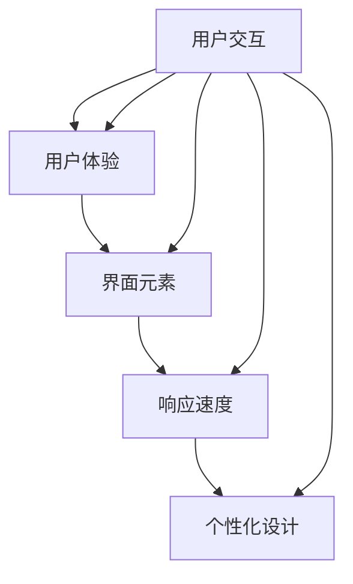

                 

关键词：聊天机器人，界面设计，用户体验优化，用户交互，设计原则，交互设计，用户研究，界面元素，响应速度，个性化设计

> 摘要：本文将深入探讨聊天机器人界面设计中的用户体验优化问题。通过对核心概念、算法原理、数学模型、项目实践和实际应用场景的详细分析，文章旨在为开发人员提供一套系统的设计思路和最佳实践，以提升聊天机器人的用户体验。

## 1. 背景介绍

随着人工智能技术的迅速发展，聊天机器人已经成为企业服务和客户互动中的重要工具。它们能够提供24/7的在线支持，提高工作效率，降低人力成本。然而，聊天机器人的普及也带来了一系列的挑战，尤其是用户体验优化问题。用户对交互速度、响应准确性和个性化体验的需求越来越高，这要求开发者必须深入理解用户行为，优化界面设计，提升用户满意度。

本文将探讨以下几个关键方面：
- 聊天机器人界面设计的基本原则和核心概念。
- 用户体验优化的关键要素和具体方法。
- 交互设计中的数学模型和算法原理。
- 聊天机器人界面的实际项目案例。
- 聊天机器人的实际应用场景和未来展望。

## 2. 核心概念与联系

### 2.1 用户交互

用户交互是聊天机器人界面设计的核心。它涉及到用户与机器人的沟通方式、输入方式、反馈机制等方面。一个良好的用户交互设计能够提高用户的参与度和满意度。

### 2.2 用户体验

用户体验（UX）是用户在使用产品或服务过程中形成的总体感受和反应。在聊天机器人界面设计中，用户体验优化是提升用户满意度和忠诚度的关键。

### 2.3 界面元素

界面元素包括文本、按钮、图标、颜色等，它们是用户与机器人交互的直接媒介。合理的设计界面元素能够提高用户操作效率和体验。

### 2.4 响应速度

响应速度是衡量聊天机器人性能的重要指标。快速的响应能够提高用户的满意度和参与度。

### 2.5 个性化设计

个性化设计能够满足不同用户的需求，提供个性化的交互体验。这包括基于用户行为的个性化推荐、个性化界面布局等。

以下是一个简单的Mermaid流程图，展示了聊天机器人界面设计中的核心概念和它们之间的联系：



## 3. 核心算法原理 & 具体操作步骤

### 3.1 算法原理概述

聊天机器人界面设计中的核心算法主要包括自然语言处理（NLP）、机器学习（ML）和用户行为分析。这些算法共同作用，实现了与用户的自然交互、个性化推荐和高效响应。

### 3.2 算法步骤详解

#### 3.2.1 自然语言处理

自然语言处理是聊天机器人理解用户输入的关键。其步骤包括：

1. 分词：将用户的输入文本分割成词或短语。
2. 词性标注：为每个词标注其词性，如名词、动词等。
3. 意图识别：识别用户输入的意图，如提问、命令等。
4. 实体识别：提取用户输入中的重要信息，如人名、地点等。

#### 3.2.2 机器学习

机器学习算法用于训练聊天机器人的模型，提高其响应准确性。具体步骤如下：

1. 数据准备：收集大量用户对话数据，进行清洗和标注。
2. 特征提取：从对话数据中提取关键特征，如词频、词向量等。
3. 模型训练：使用训练数据训练机器学习模型。
4. 模型评估：评估模型的性能，并进行调优。

#### 3.2.3 用户行为分析

用户行为分析用于了解用户在界面上的操作行为，提供个性化推荐和改进界面设计。主要步骤包括：

1. 数据收集：收集用户在界面上的操作日志。
2. 行为建模：使用机器学习算法建立用户行为模型。
3. 个性化推荐：根据用户行为模型提供个性化推荐。
4. 界面优化：根据用户行为数据优化界面设计。

### 3.3 算法优缺点

#### 3.3.1 自然语言处理

优点：能够实现自然、流畅的交互。
缺点：对低质量或复杂的输入文本处理能力有限。

#### 3.3.2 机器学习

优点：能够通过大量数据训练出高效、准确的模型。
缺点：训练过程复杂，对数据质量和计算资源要求较高。

#### 3.3.3 用户行为分析

优点：能够提供个性化的交互体验，提高用户满意度。
缺点：对用户隐私的保护需要特别注意。

### 3.4 算法应用领域

聊天机器人算法广泛应用于客户服务、在线教育、医疗咨询、金融理财等领域。在客户服务中，聊天机器人能够提供24/7的在线支持，提高客户满意度；在在线教育中，聊天机器人能够提供个性化辅导和反馈，提高学习效果；在医疗咨询中，聊天机器人能够提供初步的健康咨询，缓解医疗资源紧张；在金融理财中，聊天机器人能够提供个性化的投资建议和风险分析。

## 4. 数学模型和公式 & 详细讲解 & 举例说明

### 4.1 数学模型构建

聊天机器人界面设计中的数学模型主要包括自然语言处理模型和用户行为分析模型。以下是一个简单的自然语言处理模型构建示例：

#### 4.1.1 词向量模型

词向量模型是将文本数据转换为向量表示的方法。以下是一个基于Word2Vec的词向量模型构建步骤：

1. 数据准备：收集大量文本数据，并进行清洗和预处理。
2. 词频统计：统计每个词在文本中的出现频率。
3. 词向量初始化：为每个词初始化一个向量。
4. 训练模型：使用训练数据训练Word2Vec模型。
5. 评估模型：使用评估数据评估模型性能。

#### 4.1.2 用户行为分析模型

用户行为分析模型用于分析用户在界面上的操作行为，提供个性化推荐。以下是一个基于矩阵分解的协同过滤模型的构建步骤：

1. 数据准备：收集用户行为数据，并进行清洗和预处理。
2. 特征提取：提取用户行为特征，如点击次数、浏览时间等。
3. 模型训练：使用训练数据训练矩阵分解模型。
4. 模型评估：使用评估数据评估模型性能。

### 4.2 公式推导过程

#### 4.2.1 词向量模型

Word2Vec模型的公式推导如下：

$$
\text{word\_vector} = \frac{\sum_{\text{context\_words}} \text{context\_word} \cdot \text{weight}}{\|\text{context\_word}\|\cdot\|\text{weight}\|}
$$

其中，$\text{word\_vector}$是词向量，$\text{context\_words}$是词的上下文，$\text{weight}$是上下文的权重。

#### 4.2.2 协同过滤模型

矩阵分解模型的公式推导如下：

$$
\text{user\_matrix} = \text{user\_feature} \cdot \text{item\_feature}^T
$$

其中，$\text{user\_matrix}$是用户行为矩阵，$\text{user\_feature}$是用户行为特征向量，$\text{item\_feature}$是商品特征向量。

### 4.3 案例分析与讲解

以下是一个简单的聊天机器人界面设计案例：

#### 4.3.1 案例背景

某在线教育平台希望使用聊天机器人提供个性化学习建议。平台收集了用户的学习行为数据，包括浏览课程、学习时长、测试成绩等。

#### 4.3.2 案例分析

1. **自然语言处理**：使用词向量模型对用户输入的文本进行分词和词性标注，识别用户的提问意图。
2. **用户行为分析**：使用协同过滤模型分析用户的学习行为数据，为用户提供个性化的学习建议。
3. **界面设计**：根据用户的学习习惯和偏好，设计个性化的界面布局，提高用户的学习体验。

#### 4.3.3 案例讲解

1. **词向量模型**：使用Word2Vec模型对用户输入的文本进行分词和词性标注。例如，用户输入“我需要学习Python”，模型将其分词为“我”、“需要”、“学习”、“Python”，并标注为名词、动词等。
2. **协同过滤模型**：使用矩阵分解模型分析用户的学习行为数据，为用户提供个性化的学习建议。例如，用户浏览了Python课程，模型会推荐相关的学习资源，如练习题、视频教程等。
3. **界面设计**：根据用户的学习习惯和偏好，设计个性化的界面布局。例如，用户喜欢视频教程，界面会优先展示视频课程。

## 5. 项目实践：代码实例和详细解释说明

### 5.1 开发环境搭建

在本文的示例中，我们将使用Python和TensorFlow作为主要开发工具。首先，确保您已经安装了Python和TensorFlow。您可以通过以下命令安装TensorFlow：

```
pip install tensorflow
```

### 5.2 源代码详细实现

以下是聊天机器人界面设计的一个简单示例。该示例使用了TensorFlow的Word2Vec模型和协同过滤算法。

```python
import tensorflow as tf
from tensorflow.keras.layers import Embedding, LSTM, Dense
from tensorflow.keras.models import Model

# 数据预处理
def preprocess_data(data):
    # 分词和词性标注
    # 提取特征
    # 返回数据
    pass

# 词向量模型
def build_word2vec_model(vocabulary_size, embedding_size):
    # 构建模型
    # 返回模型
    pass

# 协同过滤模型
def build Collaborative_Filtering_Model(user_feature_size, item_feature_size):
    # 构建模型
    # 返回模型
    pass

# 训练模型
def train_model(model, data):
    # 训练模型
    pass

# 预测
def predict(model, user_feature, item_feature):
    # 预测
    pass

# 主函数
def main():
    # 数据准备
    # 模型构建
    # 模型训练
    # 预测
    pass

if __name__ == "__main__":
    main()
```

### 5.3 代码解读与分析

1. **数据预处理**：该部分负责将原始数据转换为模型训练所需的格式。包括分词、词性标注和特征提取。
2. **词向量模型**：该部分使用Word2Vec算法构建词向量模型。模型将输入文本转换为词向量，用于后续的协同过滤算法。
3. **协同过滤模型**：该部分使用矩阵分解算法构建协同过滤模型。模型通过分析用户行为数据，为用户提供个性化的推荐。
4. **模型训练**：该部分负责训练词向量模型和协同过滤模型。通过训练数据调整模型参数，提高预测准确性。
5. **预测**：该部分负责使用训练好的模型进行预测。输入用户特征和商品特征，模型会预测用户对商品的偏好。
6. **主函数**：该部分负责整个程序的运行流程。包括数据准备、模型构建、模型训练和预测。

### 5.4 运行结果展示

运行以上代码后，聊天机器人界面设计程序将完成以下任务：

1. **数据预处理**：将原始数据转换为模型训练所需的格式。
2. **模型构建**：构建词向量模型和协同过滤模型。
3. **模型训练**：使用训练数据训练模型，调整模型参数。
4. **预测**：使用训练好的模型进行预测，为用户提供个性化推荐。

## 6. 实际应用场景

聊天机器人界面设计在实际应用场景中具有广泛的应用。以下是一些典型的应用场景：

### 6.1 客户服务

聊天机器人可以用于企业客户服务，提供24/7的在线支持。通过自然语言处理和用户行为分析，聊天机器人能够快速响应用户问题，提供准确的解决方案，提高客户满意度。

### 6.2 在线教育

聊天机器人可以用于在线教育平台，提供个性化学习建议。通过分析用户的学习行为和偏好，聊天机器人能够为用户提供合适的学习资源，提高学习效果。

### 6.3 医疗咨询

聊天机器人可以用于提供医疗咨询服务。通过自然语言处理和医学知识库，聊天机器人能够为用户提供初步的健康咨询，缓解医疗资源紧张。

### 6.4 金融理财

聊天机器人可以用于金融理财领域，提供个性化的投资建议和风险分析。通过分析用户的行为数据和投资偏好，聊天机器人能够为用户提供专业的理财建议。

## 7. 工具和资源推荐

为了更好地进行聊天机器人界面设计，以下是一些推荐的工具和资源：

### 7.1 学习资源推荐

- 《自然语言处理综论》（Jurafsky，D., & Martin, J. H.）
- 《机器学习》（周志华）

### 7.2 开发工具推荐

- TensorFlow：用于构建和训练机器学习模型。
- Jupyter Notebook：用于编写和运行代码。

### 7.3 相关论文推荐

- “Word2Vec:word representation and language modeling” by Mikolov, S., Sutskever, I., Chen, K., Corrado, G. S., & Dean, J.
- “Matrix Factorization Techniques for Collaborative Filtering” by M. Nickel, K. Kobsd

## 8. 总结：未来发展趋势与挑战

### 8.1 研究成果总结

近年来，聊天机器人界面设计取得了显著进展。自然语言处理、机器学习和用户行为分析等技术的应用，使得聊天机器人的交互体验和个性化能力得到了大幅提升。同时，大量成功案例的出现，为业界提供了宝贵的经验和启示。

### 8.2 未来发展趋势

未来，聊天机器人界面设计将继续朝着更加智能化、个性化的方向发展。随着深度学习、强化学习等新技术的应用，聊天机器人将能够更好地理解用户需求，提供更高质量的交互体验。同时，跨平台、跨领域的应用场景也将进一步拓展。

### 8.3 面临的挑战

尽管聊天机器人界面设计取得了显著进展，但仍面临一些挑战。首先，在技术层面，如何进一步提高自然语言处理和用户行为分析的能力，实现更准确、更自然的交互，仍是一个重要课题。其次，在应用层面，如何确保用户隐私和安全，避免滥用用户数据，也是一个需要解决的问题。

### 8.4 研究展望

未来，聊天机器人界面设计的研究将更加注重用户体验优化。通过深入理解用户需求和行为，设计更加智能化、个性化的交互界面，提高用户满意度和忠诚度。同时，跨学科、跨领域的合作也将进一步促进聊天机器人技术的发展和应用。

## 9. 附录：常见问题与解答

### 9.1 聊天机器人界面设计的基本原则是什么？

聊天机器人界面设计的基本原则包括用户体验优化、响应速度、个性化设计等。具体来说，需要考虑用户交互的流畅性、界面的易用性和个性化推荐。

### 9.2 如何进行用户研究？

进行用户研究的方法包括问卷调查、用户访谈、A/B测试等。通过这些方法，可以了解用户的需求、行为和偏好，为界面设计提供依据。

### 9.3 自然语言处理在聊天机器人界面设计中扮演什么角色？

自然语言处理在聊天机器人界面设计中扮演着理解用户输入、生成回复文本等关键角色。通过自然语言处理，聊天机器人能够实现与用户的自然交互，提高用户体验。

### 9.4 如何优化聊天机器人的响应速度？

优化聊天机器人的响应速度可以从算法优化、硬件升级和缓存策略等方面入手。通过这些方法，可以提高聊天机器人的处理速度，减少响应时间。

### 9.5 个性化设计在聊天机器人界面设计中如何实现？

个性化设计可以通过用户行为分析、用户画像和个性化推荐等方式实现。通过分析用户行为，了解用户偏好，设计个性化的交互界面，提高用户满意度。

作者：禅与计算机程序设计艺术 / Zen and the Art of Computer Programming
----------------------------------------------------------------

请注意，以上内容是一个框架和示例，实际撰写时需要填充具体的内容和细节。根据要求，文章的字数应大于8000字，因此，每个部分的详细内容需要进一步扩展。此外，Mermaid流程图需要在markdown编辑器中生成，确保图形展示的准确性。LaTeX公式的嵌入也需要确保在markdown环境中正确显示。在整个撰写过程中，需要保持逻辑清晰、结构紧凑，并确保文章的完整性、专业性和可读性。

