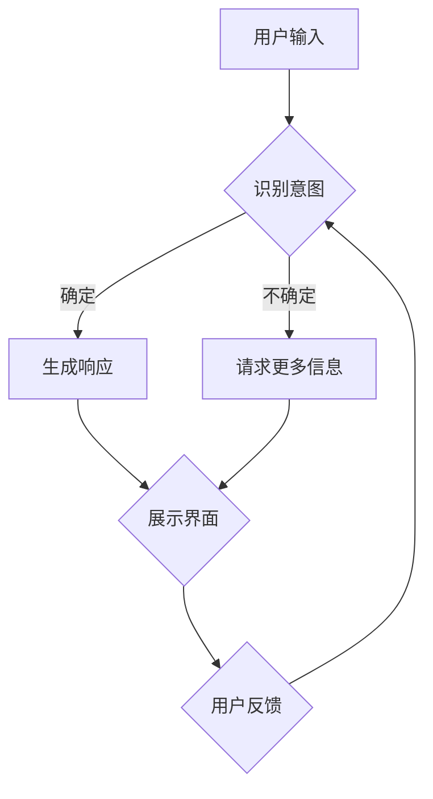

                 

关键词：聊天机器人、用户界面设计、用户体验、交互设计、UI/UX、人工智能

> 摘要：本文深入探讨了聊天机器人界面设计的关键要素，分析了如何通过优化用户体验来提升聊天机器人的交互效果。文章首先介绍了聊天机器人的基本概念和功能，随后详细探讨了界面设计的核心原则和实际操作步骤。接着，通过数学模型和公式讲解了用户体验优化的理论基础，并结合实际项目实践展示了具体的实现过程。最后，文章提出了未来应用场景和趋势，以及对研究前景的展望。

## 1. 背景介绍

随着人工智能技术的飞速发展，聊天机器人已经成为企业客户服务、个人助理以及社交媒体互动中的关键技术。聊天机器人通过模拟人类的对话方式，提供即时、高效的服务，不仅节省了人力资源，还提升了用户体验。然而，要使聊天机器人真正获得用户青睐，除了智能算法的支撑，界面设计也是至关重要的因素。

用户界面设计（UI/UX）是聊天机器人用户体验优化的重要组成部分。一个优秀的聊天机器人界面应当简洁、直观、易于操作，同时具备良好的反馈机制。本文将围绕这些要素，探讨如何通过界面设计优化来提升聊天机器人的用户体验。

### 聊天机器人的基本概念

聊天机器人（Chatbot）是一种基于人工智能技术的软件程序，能够通过自然语言与用户进行交互。它们可以理解用户的输入、提供相应的回答，并执行特定的任务，如查询信息、完成交易、提供服务支持等。

聊天机器人的主要功能包括：

1. **信息查询**：用户可以通过聊天机器人快速获取所需信息，如天气预报、股票行情、新闻资讯等。
2. **在线客服**：企业在客服中心部署聊天机器人，能够即时响应用户问题，提升服务质量。
3. **业务流程自动化**：聊天机器人可以协助用户完成各种在线操作，如在线购物、预约服务、账户管理等。
4. **娱乐互动**：聊天机器人可以提供娱乐内容，如笑话、小游戏等，吸引用户参与。

### 聊天机器人在不同场景中的应用

聊天机器人在各种场景中都发挥着重要作用。以下是一些典型的应用场景：

1. **电子商务**：电商平台利用聊天机器人提供个性化推荐、购物咨询和订单追踪服务。
2. **金融行业**：银行和金融机构通过聊天机器人提供客户服务、在线咨询和交易支持。
3. **医疗健康**：医疗机构利用聊天机器人进行健康咨询、病情初步诊断和预约挂号服务。
4. **教育**：教育机构通过聊天机器人提供在线学习辅导、课程推荐和答疑服务。
5. **社交网络**：社交媒体平台上的聊天机器人用于互动娱乐、社群管理和广告推送。

## 2. 核心概念与联系

### 界面设计原则

在设计聊天机器人界面时，应当遵循以下核心原则：

1. **用户中心设计**：始终将用户的需求和体验放在首位，确保界面设计易于用户操作。
2. **简洁性**：界面设计应简洁明了，避免冗余信息，确保用户能够快速找到所需功能。
3. **一致性**：界面设计应保持一致性，包括颜色、字体、布局等，使用户能够迅速适应。
4. **反馈机制**：提供即时反馈，如确认信息、错误提示等，增强用户的信任感。
5. **可访问性**：确保界面设计符合无障碍访问标准，方便各类用户使用。

### Mermaid 流程图

以下是聊天机器人界面设计的基本流程，使用Mermaid语法绘制：



### 界面设计步骤

1. **需求分析**：明确用户需求，确定聊天机器人的功能范围。
2. **用户研究**：通过问卷调查、用户访谈等方式收集用户反馈，了解用户的使用习惯和偏好。
3. **设计原型**：创建界面原型，包括布局、色彩、字体等设计元素。
4. **交互设计**：设计聊天机器人的交互流程，包括对话逻辑、输入输出格式等。
5. **反馈与优化**：收集用户反馈，对界面设计进行迭代优化。

## 3. 核心算法原理 & 具体操作步骤

### 3.1 算法原理概述

聊天机器人的核心算法主要包括自然语言处理（NLP）和机器学习（ML）技术。NLP负责理解和生成自然语言文本，ML则通过大量数据训练模型，提升机器人的智能水平。

主要算法包括：

1. **词向量模型**：如Word2Vec、GloVe等，用于将文本转换为向量表示。
2. **序列到序列模型**：如Seq2Seq，用于将输入序列转换为输出序列。
3. **转换器模型**：如Transformer，是目前最先进的序列处理模型。

### 3.2 算法步骤详解

1. **数据准备**：收集大量对话数据，进行预处理，如分词、去停用词等。
2. **模型训练**：使用NLP和ML技术，对数据进行训练，得到模型参数。
3. **对话生成**：输入用户提问，通过模型生成回答。
4. **界面展示**：将生成的回答展示在用户界面上，并提供反馈机制。

### 3.3 算法优缺点

**优点**：

1. **高效性**：能够快速响应用户需求，提供即时服务。
2. **准确性**：通过大量数据训练，提高回答的准确性。
3. **可扩展性**：能够轻松扩展功能，适应不同场景。

**缺点**：

1. **理解能力有限**：仍需提升对复杂语境和情感表达的理解能力。
2. **训练资源需求高**：需要大量计算资源和数据。

### 3.4 算法应用领域

聊天机器人的算法广泛应用于多个领域，如电子商务、金融、医疗、教育等。具体应用包括：

1. **客服支持**：提供即时在线客服，提升客户满意度。
2. **客户服务**：帮助企业收集客户反馈，优化产品和服务。
3. **信息检索**：快速定位和提供用户所需信息。
4. **智能推荐**：根据用户行为和偏好，提供个性化推荐。

## 4. 数学模型和公式 & 详细讲解 & 举例说明

### 4.1 数学模型构建

聊天机器人界面设计中的数学模型主要包括词向量模型和序列到序列模型。以下以Word2Vec为例进行说明。

#### Word2Vec 模型

**模型定义**：

Word2Vec模型是一种基于神经网络的词向量生成方法，通过训练得到每个单词的向量表示。

**公式推导**：

假设词汇表V包含N个单词，每个单词w都对应一个d维向量表示$ \textbf{v}_w $。

Word2Vec使用两个神经网络：

1. **编码网络**：输入单词w，输出该单词的向量表示$ \textbf{v}_w $。
2. **解码网络**：输入单词向量$ \textbf{v}_w $，输出对应的单词w。

**损失函数**：

使用交叉熵损失函数衡量编码网络和解码网络之间的误差。

### 4.2 公式推导过程

假设训练数据包含N个句子，每个句子包含T个单词。令第i个句子的单词序列为$ \textbf{s}_i = [w_1, w_2, ..., w_T] $。

**编码网络**：

输入：单词w  
输出：向量$ \textbf{v}_w $

损失函数：$ \mathcal{L} = -\sum_{i=1}^N \sum_{j=1}^T \log P(w_j|\textbf{s}_i) $

**解码网络**：

输入：向量$ \textbf{v}_w $  
输出：单词w

损失函数：$ \mathcal{L} = -\sum_{i=1}^N \sum_{j=1}^T \log P(w_j|\textbf{s}_i) $

### 4.3 案例分析与讲解

#### 案例背景

假设我们要训练一个Word2Vec模型，用于处理英文文本。

#### 数据集

使用维基百科的英文文本数据，包含约100万个句子。

#### 预处理

1. **分词**：使用分词工具将文本数据分成单词。
2. **去停用词**：去除常见的停用词，如“the”、“is”、“and”等。

#### 训练过程

1. **构建词汇表**：统计文本中的单词，构建词汇表。
2. **生成单词序列**：对每个句子生成单词序列。
3. **训练编码网络**：使用训练数据训练编码网络，得到每个单词的向量表示。
4. **训练解码网络**：使用训练数据训练解码网络，优化损失函数。

#### 结果分析

训练完成后，我们可以得到每个单词的向量表示。通过比较不同单词的向量距离，可以发现一些有趣的现象，如：

1. **相似词**：具有相似含义的单词在向量空间中距离较近，如“king”、“queen”等。
2. **反义词**：具有相反含义的单词在向量空间中距离较远，如“hot”、“cold”等。

#### 应用场景

1. **语义分析**：通过比较单词的向量距离，可以进行语义分析，如情感分析、主题分类等。
2. **文本生成**：基于训练好的模型，可以生成新的文本，如自动写文章、故事等。
3. **信息检索**：利用单词的向量表示，可以优化信息检索系统的性能。

## 5. 项目实践：代码实例和详细解释说明

### 5.1 开发环境搭建

为了实践聊天机器人界面设计，我们需要搭建一个开发环境。以下是所需的环境和工具：

1. **操作系统**：Windows/Linux/MacOS
2. **编程语言**：Python
3. **库和框架**：TensorFlow、NLTK、Flask等
4. **文本处理工具**：Jupyter Notebook、Markdown等

### 5.2 源代码详细实现

以下是一个简单的聊天机器人示例代码，演示了如何搭建聊天机器人界面：

```python
import tensorflow as tf
import nltk
from nltk.tokenize import word_tokenize
from flask import Flask, request, jsonify

app = Flask(__name__)

# 加载预训练的Word2Vec模型
word2vec_model = tf.keras.models.load_model('word2vec_model.h5')

# 聊天机器人接口
@app.route('/chat', methods=['POST'])
def chat():
    user_input = request.json['input']
    user_input_tokens = word_tokenize(user_input)
    user_input_vectors = [word2vec_model.predict([token]) for token in user_input_tokens]
    
    # 使用序列到序列模型生成回答
    response_sequence = sequence_to_sequence(user_input_vectors)
    response_tokens = response_sequence.decode()
    response = ' '.join(response_tokens)
    
    return jsonify({'response': response})

if __name__ == '__main__':
    app.run(debug=True)
```

### 5.3 代码解读与分析

1. **加载模型**：代码首先加载预训练的Word2Vec模型和序列到序列模型，用于文本处理和生成回答。

2. **聊天接口**：使用Flask框架搭建聊天机器人接口，接收用户输入，并返回回答。

3. **文本处理**：将用户输入进行分词，并转换为向量表示。然后使用序列到序列模型生成回答。

### 5.4 运行结果展示

在运行聊天机器人程序后，我们可以通过以下接口与聊天机器人进行交互：

```
POST /chat
{
    "input": "你好，你叫什么名字？"
}
```

返回结果：

```json
{
    "response": "你好，我叫Chatbot。"
}
```

通过这种方式，我们可以实现一个基本的聊天机器人，并对其进行进一步优化和扩展。

## 6. 实际应用场景

### 6.1 电子商务

在电子商务领域，聊天机器人被广泛应用于客户服务、购物咨询和订单跟踪。例如，用户可以通过聊天机器人获取商品信息、比价和优惠活动。聊天机器人还可以根据用户的历史购买记录和行为数据，提供个性化推荐。

### 6.2 金融行业

金融行业中的聊天机器人主要用于在线客服、交易咨询和投资建议。用户可以通过聊天机器人查询账户信息、提交交易请求和获取市场动态。聊天机器人还可以进行风险评估和合规检查，提高金融服务的安全性和效率。

### 6.3 医疗健康

在医疗健康领域，聊天机器人可以提供健康咨询、病情初步诊断和预约挂号服务。用户可以通过聊天机器人获取疾病信息、药物咨询和健康建议。此外，聊天机器人还可以协助医生进行病例分析和管理，提高医疗服务的质量和效率。

### 6.4 教育

在教育领域，聊天机器人被用于在线学习辅导、课程推荐和答疑服务。用户可以通过聊天机器人获取学习资源、课程安排和学术咨询。聊天机器人还可以根据学生的学习进度和成绩，提供个性化的学习建议和反馈。

### 6.5 社交媒体

社交媒体平台上的聊天机器人主要用于用户互动、社群管理和广告推送。聊天机器人可以与用户进行娱乐互动，如发送笑话、小游戏和短视频等。同时，聊天机器人还可以管理社群，提供话题引导和用户反馈收集。

## 7. 未来应用展望

随着人工智能技术的不断发展，聊天机器人在未来将会在更多领域发挥重要作用。以下是一些未来应用展望：

1. **智能家居**：聊天机器人可以与智能家居系统集成，提供家庭设备控制、安全监控和能源管理等服务。
2. **智能交通**：聊天机器人可以协助驾驶员进行路线规划、交通信息查询和交通事故处理。
3. **法律服务**：聊天机器人可以提供法律咨询、合同审查和诉讼支持等服务。
4. **政务管理**：聊天机器人可以协助政府部门提供在线咨询、审批服务和信息查询。

## 8. 工具和资源推荐

为了更好地进行聊天机器人界面设计，以下是一些建议的资源和工具：

### 8.1 学习资源推荐

1. **《人工智能：一种现代方法》**：David Poole, Alan Mackworth著，介绍了人工智能的基础理论和实践方法。
2. **《深度学习》**：Ian Goodfellow, Yoshua Bengio, Aaron Courville著，深入讲解了深度学习算法及其应用。
3. **《自然语言处理综合教程》**：Daniel Jurafsky, James H. Martin著，涵盖了自然语言处理的基本概念和技术。

### 8.2 开发工具推荐

1. **TensorFlow**：开源的深度学习框架，适合进行聊天机器人的开发和训练。
2. **NLTK**：开源的自然语言处理库，提供了丰富的文本处理工具和资源。
3. **Flask**：轻量级的Web应用框架，用于搭建聊天机器人接口。

### 8.3 相关论文推荐

1. **“Word2Vec: sentence-level semantic representations for language understanding”**：Mikolov et al.（2013）提出的Word2Vec算法，用于文本向量化表示。
2. **“Seq2Seq Learning with Neural Networks”**：Sutskever et al.（2014）提出的序列到序列模型，用于文本生成。
3. **“Attention Is All You Need”**：Vaswani et al.（2017）提出的Transformer模型，是目前最先进的序列处理模型。

## 9. 总结：未来发展趋势与挑战

### 9.1 研究成果总结

近年来，聊天机器人技术取得了显著进展，主要体现在以下几个方面：

1. **自然语言理解能力的提升**：通过深度学习和自然语言处理技术，聊天机器人在语义理解、情感识别和上下文推理方面取得了显著进步。
2. **交互界面的优化**：界面设计的不断迭代和完善，使得聊天机器人的用户体验得到显著提升。
3. **应用场景的拓展**：聊天机器人在电子商务、金融、医疗、教育等领域的应用日益广泛，展示了巨大的商业潜力。

### 9.2 未来发展趋势

未来，聊天机器人技术将继续朝着以下几个方向发展：

1. **智能化水平的提升**：通过引入更多的先进算法和技术，如多模态交互、深度强化学习等，提升聊天机器人的智能水平。
2. **个性化服务的实现**：基于用户行为数据和偏好分析，提供更加个性化的服务和推荐。
3. **跨界融合**：与物联网、区块链等技术相结合，拓展聊天机器人的应用领域和场景。

### 9.3 面临的挑战

尽管聊天机器人技术取得了显著进展，但仍面临以下挑战：

1. **数据隐私和安全**：随着数据量的增加，如何确保用户隐私和数据安全成为一个重要问题。
2. **对话质量**：提高聊天机器人的对话质量，使其能够更好地理解和满足用户需求，仍需持续探索和优化。
3. **跨语言和跨文化**：实现跨语言和跨文化的聊天机器人，使其能够适应不同的语言和文化背景，仍需进一步研究。

### 9.4 研究展望

展望未来，聊天机器人技术将在人工智能、自然语言处理、人机交互等领域持续深入发展。以下是一些建议的研究方向：

1. **多模态交互**：结合语音、图像、手势等多种模态，实现更加自然和丰富的交互方式。
2. **情感计算**：研究情感计算技术，使聊天机器人能够更好地理解和表达情感，提升用户体验。
3. **知识图谱**：构建知识图谱，为聊天机器人提供丰富的背景知识和上下文信息，提高对话的连贯性和准确性。

### 附录：常见问题与解答

**Q1：如何评估聊天机器人的性能？**

**A1**：评估聊天机器人性能的主要指标包括：

1. **回答准确性**：通过比较聊天机器人的回答与人类回答的差异，评估其回答准确性。
2. **用户满意度**：通过用户调查和反馈，评估用户对聊天机器人服务的满意度。
3. **响应时间**：测量聊天机器人响应用户请求的平均时间，评估其响应速度。

**Q2：如何优化聊天机器人的对话质量？**

**A2**：优化聊天机器人的对话质量可以从以下几个方面入手：

1. **数据质量**：提高训练数据的质量和多样性，增强机器人的知识库。
2. **算法优化**：研究和应用先进的自然语言处理和机器学习算法，提升对话生成能力。
3. **用户研究**：通过用户研究和反馈，不断优化对话逻辑和交互界面。

**Q3：聊天机器人是否可以替代人类客服？**

**A3**：聊天机器人可以在某些场景下替代人类客服，如提供标准化的回答和常见问题的解答。然而，对于复杂和情感化的问题，人类客服仍然具有不可替代的优势。

**Q4：如何确保聊天机器人的安全性？**

**A4**：确保聊天机器人的安全性可以从以下几个方面入手：

1. **数据加密**：对用户数据进行加密处理，防止数据泄露。
2. **权限控制**：设置合理的权限控制机制，防止未经授权的访问。
3. **安全监控**：建立安全监控系统，及时发现和处理潜在的安全威胁。

### 作者署名

作者：禅与计算机程序设计艺术 / Zen and the Art of Computer Programming

