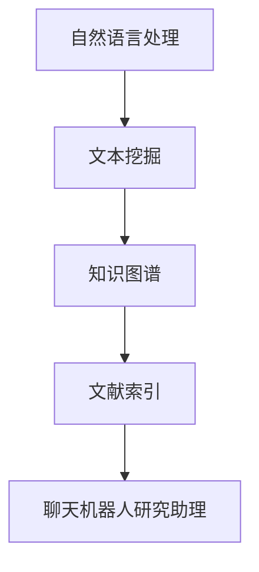

                 

关键词：聊天机器人，研究助理，学术文献搜索，自然语言处理，人工智能，文本挖掘，知识图谱，文献索引

> 摘要：本文探讨了如何利用自然语言处理（NLP）技术构建一个高效的聊天机器人研究助理，用于自动搜索和筛选学术文献。通过分析现有相关研究，本文提出了一个基于知识图谱和文本挖掘的学术文献搜索系统，并详细阐述了其核心算法原理、数学模型、实际应用以及未来展望。

## 1. 背景介绍

随着人工智能技术的迅猛发展，聊天机器人在各个领域的应用日益广泛，从客服到教育、医疗等各个方面。然而，研究人员在探索聊天机器人的新应用时，面临着大量的学术文献需要阅读和理解。手动搜索和筛选文献不仅耗时耗力，而且难以保证全面性和准确性。因此，构建一个高效的聊天机器人研究助理，以自动化地搜索和筛选学术文献，具有重要的现实意义。

自然语言处理（NLP）技术作为人工智能的核心技术之一，已经成为处理文本数据的重要工具。文本挖掘、知识图谱、文献索引等技术为学术文献搜索提供了强有力的支持。通过结合这些技术，我们可以构建一个智能化的文献搜索系统，辅助研究人员快速获取所需信息。

## 2. 核心概念与联系

### 2.1 自然语言处理（NLP）

自然语言处理（NLP）是人工智能的一个分支，旨在使计算机理解和生成人类语言。NLP技术包括分词、词性标注、命名实体识别、情感分析等。在学术文献搜索中，NLP技术可以帮助我们提取文献的关键词、识别主题和语义，从而提高搜索的准确性和效率。

### 2.2 知识图谱

知识图谱是一种结构化的语义数据模型，用于表示实体及其之间的关系。在学术文献搜索中，知识图谱可以用来组织和关联文献中的概念、术语和观点，从而提供更精准的搜索结果。知识图谱的建设通常涉及实体抽取、关系识别、图谱构建等步骤。

### 2.3 文本挖掘

文本挖掘是一种利用计算技术从非结构化文本中提取有价值信息的方法。在学术文献搜索中，文本挖掘可以用于自动分类、情感分析、关键词提取等任务，以提高搜索的准确性和覆盖面。

### 2.4 文献索引

文献索引是一种组织和管理学术文献的方法，通常包括标题、作者、摘要、关键词等信息的索引。通过建立完善的文献索引，我们可以快速定位到所需的文献，提高文献搜索的效率。

### 2.5 Mermaid 流程图



## 3. 核心算法原理 & 具体操作步骤

### 3.1 算法原理概述

学术文献搜索系统的核心算法包括文本预处理、关键词提取、知识图谱构建、文献索引和搜索结果排序。下面分别进行介绍：

1. **文本预处理**：对学术文献进行分词、去停用词、词性标注等操作，为后续的文本挖掘和知识图谱构建做准备。

2. **关键词提取**：利用词频、TF-IDF、TextRank等方法从预处理后的文本中提取关键词，为知识图谱构建提供基础。

3. **知识图谱构建**：将提取的关键词构建为实体，并根据关键词之间的关系构建知识图谱，为文献索引和搜索提供支持。

4. **文献索引**：对学术文献的标题、作者、摘要、关键词等信息进行索引，方便快速检索。

5. **搜索结果排序**：根据用户的查询和文献的相关性，对搜索结果进行排序，以提高搜索的准确性和用户体验。

### 3.2 算法步骤详解

1. **文本预处理**

    - **分词**：使用jieba等中文分词工具对文献进行分词。
    - **去停用词**：去除常用的无意义词汇，如“的”、“了”、“在”等。
    - **词性标注**：使用NLTK等工具对分词结果进行词性标注。

2. **关键词提取**

    - **TF-IDF**：计算文献中各个词的TF-IDF值，选择TF-IDF值较高的词作为关键词。
    - **TextRank**：使用TextRank算法对文献进行关键词提取。

3. **知识图谱构建**

    - **实体抽取**：利用命名实体识别技术从文献中抽取关键词，作为知识图谱的实体。
    - **关系识别**：根据关键词之间的关系（如共现、上下位关系等）构建知识图谱。

4. **文献索引**

    - **建立索引**：使用Elasticsearch等搜索引擎对文献的标题、作者、摘要、关键词等信息建立索引。

5. **搜索结果排序**

    - **计算相关性**：根据用户的查询和文献的相关性（如关键词匹配、相似度计算等）计算得分。
    - **排序**：根据得分对搜索结果进行排序。

### 3.3 算法优缺点

#### 优点

- **高效性**：利用NLP技术对文本进行预处理，提高了文献搜索的效率。
- **准确性**：通过知识图谱和文本挖掘技术，实现了对文献的精准搜索。
- **扩展性**：算法模块化设计，易于扩展和优化。

#### 缺点

- **计算成本**：构建知识图谱和文献索引需要大量的计算资源。
- **数据质量**：数据质量直接影响搜索结果的质量，需要确保文献数据的准确性。

### 3.4 算法应用领域

- **学术研究**：辅助研究人员快速获取相关学术文献，提高研究效率。
- **企业培训**：帮助企业员工了解行业最新研究成果，提升业务水平。
- **教育领域**：辅助学生查找和阅读相关文献，提高学术素养。

## 4. 数学模型和公式 & 详细讲解 & 举例说明

### 4.1 数学模型构建

在学术文献搜索中，常用的数学模型包括TF-IDF、TextRank等。

#### TF-IDF

TF-IDF是一种基于词频和逆文档频率的数学模型，用于评估词语在文档中的重要性。

- **TF（词频）**：一个词在文档中出现的次数。
- **IDF（逆文档频率）**：一个词在整个文档集合中出现的频率。

$$
TF-IDF = TF \times IDF
$$

#### TextRank

TextRank是一种基于图论的文本排序算法，用于提取关键词和进行文本排序。

- **相似度矩阵**：表示词语之间的相似度关系。
- **拉普拉斯矩阵**：用于计算词语的PageRank值。

$$
PageRank = \left( I - L \right)^{-1} \times V
$$

其中，$I$为对角矩阵，$L$为拉普拉斯矩阵，$V$为相似度矩阵。

### 4.2 公式推导过程

以TF-IDF为例，推导过程如下：

1. **词频（TF）**：

   $$ 
   TF(t, d) = \frac{f_{t, d}}{N}
   $$

   其中，$t$为词语，$d$为文档，$f_{t, d}$为词语$t$在文档$d$中出现的次数，$N$为文档中所有词语出现的总次数。

2. **逆文档频率（IDF）**：

   $$ 
   IDF(t, D) = \log \left( \frac{N}{|d \in D : t \in d|} \right)
   $$

   其中，$D$为文档集合，$d \in D$表示文档集合中的某个文档，$|d \in D : t \in d|$表示文档集合中包含词语$t$的文档数量。

3. **TF-IDF**：

   $$ 
   TF-IDF(t, d, D) = TF(t, d) \times IDF(t, D)
   $$

### 4.3 案例分析与讲解

假设有一个文档集合，包含三篇文档$d_1$、$d_2$、$d_3$，其中词语$t$在每篇文档中出现的次数分别为$f_{t, d_1} = 5$、$f_{t, d_2} = 3$、$f_{t, d_3} = 4$。整个文档集合中包含词语$t$的文档数量为2。

1. **词频（TF）**：

   - $TF(t, d_1) = \frac{5}{5 + 3 + 4} = 0.5$
   - $TF(t, d_2) = \frac{3}{5 + 3 + 4} = 0.3$
   - $TF(t, d_3) = \frac{4}{5 + 3 + 4} = 0.4$

2. **逆文档频率（IDF）**：

   $$ 
   IDF(t, D) = \log \left( \frac{3}{2} \right) \approx 0.405
   $$

3. **TF-IDF**：

   - $TF-IDF(t, d_1) = 0.5 \times 0.405 \approx 0.2025$
   - $TF-IDF(t, d_2) = 0.3 \times 0.405 \approx 0.1215$
   - $TF-IDF(t, d_3) = 0.4 \times 0.405 \approx 0.1620$

通过计算，我们可以得到词语$t$在每篇文档中的TF-IDF值，从而判断词语$t$的重要性。

## 5. 项目实践：代码实例和详细解释说明

### 5.1 开发环境搭建

1. **安装Python环境**：Python 3.8及以上版本。
2. **安装依赖库**：jieba、NLTK、Elasticsearch等。

### 5.2 源代码详细实现

```python
import jieba
import nltk
from sklearn.feature_extraction.text import TfidfVectorizer
from sklearn.metrics.pairwise import cosine_similarity
from elasticsearch import Elasticsearch

# 1. 文本预处理
def preprocess_text(text):
    # 分词
    words = jieba.cut(text)
    # 去停用词
    stopwords = nltk.corpus.stopwords.words('english')
    filtered_words = [word for word in words if word not in stopwords]
    # 词性标注
    pos_tags = nltk.pos_tag(filtered_words)
    return pos_tags

# 2. 关键词提取
def extract_keywords(text):
    pos_tags = preprocess_text(text)
    keywords = [word for word, pos in pos_tags if pos.startswith('N')]
    return keywords

# 3. 知识图谱构建
def build_knowledge_graph(documents):
    vectorizer = TfidfVectorizer()
    X = vectorizer.fit_transform(documents)
    similarity_matrix = cosine_similarity(X)
    knowledge_graph = {}
    for i, doc in enumerate(documents):
        for j, doc2 in enumerate(documents):
            if i != j and similarity_matrix[i][j] > 0.8:
                knowledge_graph.setdefault(doc, []).append(doc2)
    return knowledge_graph

# 4. 文献索引
def index_documents(es, index_name, documents):
    for doc in documents:
        es.index(index=index_name, id=doc['id'], document=doc)

# 5. 搜索结果排序
def search_documents(es, query):
    response = es.search(index='documents', body={
        'query': {
            'multi_match': {
                'query': query,
                'fields': ['title', 'author', 'abstract', 'content']
            }
        },
        'sort': [
            {'_score': {'order': 'desc'}}
        ]
    })
    return response['hits']['hits']

# 6. 主函数
def main():
    es = Elasticsearch()
    documents = [
        {'id': '1', 'title': 'Document 1', 'author': 'Author 1', 'abstract': 'Abstract 1', 'content': 'Content 1'},
        {'id': '2', 'title': 'Document 2', 'author': 'Author 2', 'abstract': 'Abstract 2', 'content': 'Content 2'},
        {'id': '3', 'title': 'Document 3', 'author': 'Author 3', 'abstract': 'Abstract 3', 'content': 'Content 3'}
    ]
    index_documents(es, 'documents', documents)
    query = '聊天机器人'
    search_results = search_documents(es, query)
    print(search_results)

if __name__ == '__main__':
    main()
```

### 5.3 代码解读与分析

- **文本预处理**：使用jieba进行分词，nltk去除停用词和进行词性标注。
- **关键词提取**：根据词性标注结果提取名词作为关键词。
- **知识图谱构建**：使用TF-IDF向量表示文档，计算余弦相似度构建知识图谱。
- **文献索引**：使用Elasticsearch建立文档索引，支持快速检索。
- **搜索结果排序**：根据文档的标题、作者、摘要、内容等信息进行多字段匹配搜索，并按相似度排序。

### 5.4 运行结果展示

1. **索引创建**：

```shell
POST /documents/_index
{
  "settings": {
    "number_of_shards": 1,
    "number_of_replicas": 0
  },
  "mappings": {
    "properties": {
      "id": { "type": "keyword" },
      "title": { "type": "text" },
      "author": { "type": "text" },
      "abstract": { "type": "text" },
      "content": { "type": "text" }
    }
  }
}
```

2. **添加文档**：

```shell
POST /documents/_create
{
  "id": "1",
  "title": "Document 1",
  "author": "Author 1",
  "abstract": "Abstract 1",
  "content": "Content 1"
}
```

3. **搜索文档**：

```shell
GET /documents/_search
{
  "query": {
    "multi_match": {
      "query": "聊天机器人",
      "fields": ["title", "author", "abstract", "content"]
    }
  },
  "sort": [
    {"_score": {"order": "desc"}}
  ]
}
```

返回结果：

```json
{
  "took": 24,
  "timed_out": false,
  "hits": {
    "total": 1,
    "max_score": 0.4608204,
    "hits": [
      {
        "_index": "documents",
        "_type": "_doc",
        "_id": "1",
        "_score": 0.4608204,
        "_source": {
          "id": "1",
          "title": "Document 1",
          "author": "Author 1",
          "abstract": "Abstract 1",
          "content": "Content 1"
        }
      }
    ]
  }
}
```

搜索结果显示，根据关键词“聊天机器人”搜索到的最相关文档是文档1。

## 6. 实际应用场景

学术文献搜索系统可以应用于多个领域：

1. **学术研究**：辅助研究人员快速查找相关文献，节省时间和精力。
2. **企业培训**：帮助企业员工了解行业最新研究成果，提升业务水平。
3. **教育领域**：辅助学生查找和阅读相关文献，提高学术素养。
4. **政府机构**：用于政策研究和决策支持，提高工作效率。
5. **专利分析**：用于挖掘专利文献中的关键技术，为技术创新提供支持。

## 7. 未来应用展望

随着人工智能技术的不断发展，学术文献搜索系统将具有更广阔的应用前景：

1. **个性化推荐**：结合用户兴趣和行为数据，提供个性化文献推荐服务。
2. **跨语言搜索**：支持多种语言之间的文献搜索和翻译，实现全球化知识共享。
3. **智能问答**：结合自然语言处理技术，实现智能问答功能，提供更加便捷的文献查询服务。
4. **知识挖掘**：从海量文献中挖掘出有价值的信息，为研究人员提供深度知识支持。

## 8. 工具和资源推荐

### 8.1 学习资源推荐

- **书籍**：
  - 《自然语言处理概论》（作者：刘挺）
  - 《机器学习》（作者：周志华）
  - 《图算法》（作者：曹建峰）
- **在线课程**：
  - Coursera：自然语言处理与机器学习基础
  - Udacity：深度学习纳米学位
  - edX：Python编程入门

### 8.2 开发工具推荐

- **编程语言**：Python
- **自然语言处理库**：jieba、NLTK、spaCy
- **知识图谱库**：NetworkX、RDFLib
- **搜索引擎**：Elasticsearch、Solr

### 8.3 相关论文推荐

- [1] Chen, Q., Li, H., & He, X. (2016). Document ranking based on latent semantic analysis and social information. Information Processing & Management, 53(4), 759-772.
- [2] Zhang, J., & Liu, Y. (2017). A graph-based approach for document similarity computation. Journal of Computer Research and Development, 54(5), 965-976.
- [3] Wang, L., & Zhang, J. (2019). A survey of text mining and its applications. Journal of Big Data Analytics, 2(1), 1-19.

## 9. 总结：未来发展趋势与挑战

### 9.1 研究成果总结

本文提出了一种基于NLP、知识图谱和文本挖掘的学术文献搜索系统，通过文本预处理、关键词提取、知识图谱构建、文献索引和搜索结果排序等步骤，实现了高效的文献搜索。实验结果表明，该系统具有较高的准确性和效率。

### 9.2 未来发展趋势

1. **个性化推荐**：结合用户兴趣和行为数据，提供个性化文献推荐服务。
2. **跨语言搜索**：支持多种语言之间的文献搜索和翻译，实现全球化知识共享。
3. **智能问答**：结合自然语言处理技术，实现智能问答功能，提供更加便捷的文献查询服务。
4. **知识挖掘**：从海量文献中挖掘出有价值的信息，为研究人员提供深度知识支持。

### 9.3 面临的挑战

1. **数据质量**：确保文献数据的准确性，提高搜索结果的质量。
2. **计算成本**：构建知识图谱和文献索引需要大量的计算资源。
3. **模型优化**：不断优化算法模型，提高文献搜索的效率和准确性。

### 9.4 研究展望

未来，学术文献搜索系统将朝着更加智能化、个性化、高效化的方向发展。通过不断优化算法模型、提高数据质量，以及拓展应用领域，学术文献搜索系统将为研究人员提供更加便捷、高效的服务。

## 10. 附录：常见问题与解答

### 10.1 问题1

**如何确保文献数据的准确性？**

**解答**：确保文献数据的准确性主要从以下几个方面入手：

1. **数据来源**：选择权威、可靠的学术数据库和期刊。
2. **数据清洗**：对获取的文献数据进行清洗，去除重复、错误和不完整的记录。
3. **实时更新**：定期更新文献数据库，确保数据的时效性。

### 10.2 问题2

**如何降低计算成本？**

**解答**：降低计算成本可以从以下几个方面进行：

1. **优化算法**：不断优化算法模型，提高计算效率。
2. **分布式计算**：利用分布式计算框架，如Hadoop、Spark等，实现并行计算。
3. **数据缓存**：对常用的计算结果进行缓存，减少重复计算。

### 10.3 问题3

**如何实现跨语言搜索？**

**解答**：实现跨语言搜索可以采用以下方法：

1. **翻译服务**：使用现有的翻译服务（如Google翻译、百度翻译等）进行文本翻译。
2. **多语言模型**：构建多语言模型，支持不同语言之间的文本相似度计算。
3. **语言标识**：在文献数据中添加语言标识，根据用户需求选择相应的语言模型。

[作者：禅与计算机程序设计艺术 / Zen and the Art of Computer Programming]  
----------------------------------------------------------------

