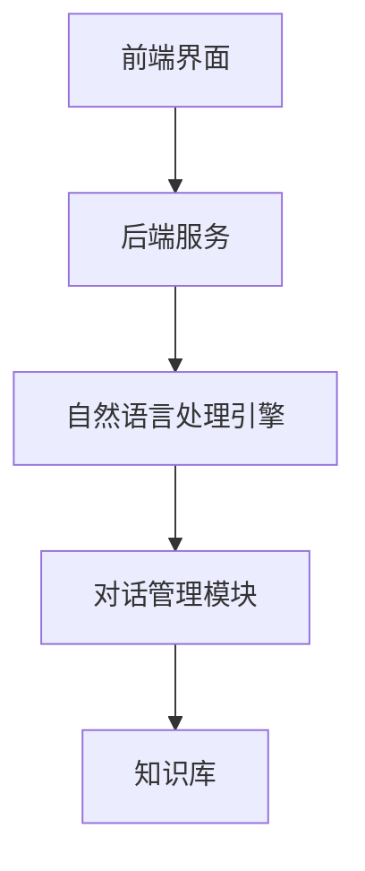

                 

 作为人工智能领域的前沿科技，聊天机器人已经成为我们日常生活中不可或缺的一部分。从商业服务到个人助理，聊天机器人的广泛应用极大地提升了用户体验和效率。然而，随着技术的发展，聊天机器人对社会的影响也愈发显著，尤其是其道德和责任问题。本文将深入探讨聊天机器人的社会影响，包括其道德责任、伦理挑战以及未来的发展路径。

## 关键词
- 聊天机器人
- 社会影响
- 道德责任
- 伦理挑战
- 人工智能

## 摘要
本文首先介绍了聊天机器人的背景和发展现状，随后探讨了其对社会产生的积极和消极影响。重点分析了聊天机器人在道德和责任方面的挑战，包括隐私保护、信息真实性、用户行为引导等问题。最后，本文提出了针对这些挑战的解决方案和未来发展的展望，为聊天机器人的健康发展提供指导。

## 1. 背景介绍
### 1.1 聊天机器人的定义和分类
聊天机器人是一种基于人工智能技术，能够与人类用户进行自然语言交互的计算机程序。根据交互方式，聊天机器人可以分为文本聊天机器人和语音聊天机器人。文本聊天机器人主要通过即时通讯应用、社交媒体平台和网站进行沟通，而语音聊天机器人则主要应用于智能手机和智能音箱等设备。

### 1.2 聊天机器人技术的发展历程
从最初的规则驱动型聊天机器人到基于机器学习和自然语言处理（NLP）的聊天机器人，技术发展经历了巨大的变革。早期的聊天机器人功能有限，主要依靠预定义的规则和模板与用户交互。随着深度学习和大数据技术的进步，聊天机器人逐渐具备了更复杂的对话能力和自适应学习能力。

### 1.3 聊天机器人的应用领域
当前，聊天机器人的应用已经渗透到各个行业，包括但不限于客服、金融、医疗、教育、娱乐等领域。例如，许多公司和品牌利用聊天机器人提供24/7的客户服务，提高了服务效率和用户满意度。同时，医疗领域的聊天机器人可以帮助患者进行健康管理、提供心理支持，并在一定程度上辅助医生进行诊断。

## 2. 核心概念与联系
### 2.1 聊天机器人的核心技术
聊天机器人的核心技术主要包括自然语言处理（NLP）、机器学习（ML）和深度学习（DL）。NLP技术用于理解和生成自然语言，包括词义消歧、情感分析、命名实体识别等。ML和DL技术则用于训练聊天机器人，使其能够从大量数据中学习并优化对话策略。

### 2.2 聊天机器人的架构
聊天机器人的架构通常包括以下几个关键组件：前端界面、后端服务、自然语言处理引擎、对话管理模块和知识库。前端界面负责与用户交互，后端服务处理业务逻辑和数据存储，自然语言处理引擎负责理解和生成对话内容，对话管理模块协调对话流程，知识库提供聊天机器人所需的信息和知识。

### 2.3 Mermaid 流程图
以下是一个简化的聊天机器人架构的 Mermaid 流程图：



## 3. 核心算法原理 & 具体操作步骤
### 3.1 算法原理概述
聊天机器人的核心算法主要依赖于自然语言处理和机器学习技术。自然语言处理包括词法分析、句法分析和语义分析等步骤，用于理解和生成语言。机器学习则通过训练模型，使聊天机器人能够从交互中不断学习和优化对话策略。

### 3.2 算法步骤详解
1. **词法分析**：将用户输入的文本分割成单词、短语等基本单位。
2. **句法分析**：分析句子的结构，理解主谓宾等成分的关系。
3. **语义分析**：理解句子的含义，包括情感分析、实体识别等。
4. **生成回复**：基于对话管理模块和知识库，生成合适的回复文本。
5. **反馈学习**：记录用户反馈，用于后续模型的优化。

### 3.3 算法优缺点
**优点**：
- 提高效率：聊天机器人可以24/7提供服务，提高业务处理效率。
- 降低成本：聊天机器人可以替代部分人工客服，减少人力成本。

**缺点**：
- 交互体验有限：当前聊天机器人的交互体验仍然无法完全替代人类。
- 道德和责任问题：聊天机器人的道德和责任边界尚不明确。

### 3.4 算法应用领域
聊天机器人广泛应用于客服、金融、医疗、教育等领域。例如，在客服领域，聊天机器人可以提供即时响应，解答用户问题；在金融领域，聊天机器人可以帮助用户进行投资咨询和风险管理。

## 4. 数学模型和公式 & 详细讲解 & 举例说明
### 4.1 数学模型构建
聊天机器人的数学模型通常基于统计模型、机器学习模型和深度学习模型。以下是一个简单的统计模型示例：

$$
P(\text{回复}|s) = \frac{P(s|\text{回复})P(\text{回复})}{P(s)}
$$

其中，$P(\text{回复}|s)$ 是给定用户输入$s$时生成回复的概率，$P(s|\text{回复})$ 是在给定回复时用户输入$s$的概率，$P(\text{回复})$ 是回复的概率，$P(s)$ 是用户输入$s$的概率。

### 4.2 公式推导过程
假设我们有一个聊天机器人，它有一个回复集$R$，用户输入集$S$。我们希望计算给定用户输入$s$时，机器人生成某个回复$r$的概率。根据贝叶斯定理，我们有：

$$
P(\text{回复}|s) = \frac{P(s|\text{回复})P(\text{回复})}{P(s)}
$$

其中，$P(s|\text{回复})$ 是在给定回复$r$时用户输入$s$的条件概率，$P(\text{回复})$ 是生成回复的概率，$P(s)$ 是用户输入$s$的概率。

### 4.3 案例分析与讲解
假设我们有一个聊天机器人，它有两个回复：“是的”和“不”，以及两个用户输入：“你好”和“再见”。我们希望计算用户输入“你好”时，机器人回复“是的”的概率。

根据我们的假设，我们有以下概率：

$$
P(\text{你好}|\text{是的}) = 0.5, \quad P(\text{你好}|\text{不}) = 0.5
$$

$$
P(\text{是的}) = 0.6, \quad P(\text{不}) = 0.4
$$

根据贝叶斯定理，我们有：

$$
P(\text{是的}|\text{你好}) = \frac{P(\text{你好}|\text{是的})P(\text{是的})}{P(\text{你好})}
$$

$$
= \frac{0.5 \times 0.6}{0.5 \times 0.6 + 0.5 \times 0.4}
$$

$$
= \frac{0.3}{0.5}
$$

$$
= 0.6
$$

因此，用户输入“你好”时，机器人回复“是的”的概率为0.6。

## 5. 项目实践：代码实例和详细解释说明
### 5.1 开发环境搭建
为了搭建一个简单的聊天机器人项目，我们需要以下开发环境：

- Python 3.8 或以上版本
- 自然语言处理库（如NLTK、spaCy）
- 机器学习库（如scikit-learn、TensorFlow、PyTorch）

### 5.2 源代码详细实现
以下是一个简单的文本聊天机器人示例，使用Python和scikit-learn实现：

```python
import nltk
from sklearn.feature_extraction.text import CountVectorizer
from sklearn.naive_bayes import MultinomialNB
from sklearn.pipeline import make_pipeline

# 训练数据
train_data = [
    ("你好", "你好，我是聊天机器人。"),
    ("再见", "好的，祝你有美好的一天。"),
    ("天气怎么样", "现在天气很好，阳光明媚。")
]

# 训练模型
model = make_pipeline(CountVectorizer(), MultinomialNB())
model.fit([text for text, _ in train_data], [response for _, response in train_data])

# 回复用户
def reply(text):
    return model.predict([text])[0]

# 测试
print(reply("你好"))  # 输出：你好，我是聊天机器人。
print(reply("再见"))  # 输出：好的，祝你有美好的一天。
print(reply("天气怎么样"))  # 输出：现在天气很好，阳光明媚。
```

### 5.3 代码解读与分析
这段代码首先导入所需的库，然后定义了一组训练数据。训练数据由用户输入和对应的机器人生成回复组成。接下来，我们使用scikit-learn的`make_pipeline`函数构建一个包含文本向量化器和朴素贝叶斯分类器的流水线模型。`fit`函数用于训练模型，`predict`函数用于生成回复。最后，我们定义了一个`reply`函数，用于接收用户输入并返回机器人生成的回复。

### 5.4 运行结果展示
运行代码后，我们可以看到聊天机器人能够根据用户输入生成相应的回复。

## 6. 实际应用场景
### 6.1 客服领域
在客服领域，聊天机器人可以提供24/7的客户服务，解答常见问题，提高客户满意度。例如，许多电商网站使用聊天机器人帮助用户进行购物咨询、订单查询等操作。

### 6.2 金融领域
在金融领域，聊天机器人可以帮助用户进行投资咨询、风险管理等操作。例如，一些银行和金融机构提供聊天机器人服务，帮助用户了解理财产品、查询账户余额等。

### 6.3 医疗领域
在医疗领域，聊天机器人可以提供健康管理、心理支持等服务。例如，一些医疗机构使用聊天机器人帮助患者了解病情、提供心理健康建议等。

## 7. 工具和资源推荐
### 7.1 学习资源推荐
- 《Python聊天机器人开发实战》
- 《自然语言处理实战》
- 《机器学习实战》

### 7.2 开发工具推荐
- Jupyter Notebook：用于编写和运行Python代码。
- Anaconda：Python环境和包管理器。

### 7.3 相关论文推荐
- "A Neural Conversational Model"（2018）—— Facebook AI Research
- "BERT: Pre-training of Deep Bidirectional Transformers for Language Understanding"（2018）—— Google AI

## 8. 总结：未来发展趋势与挑战
### 8.1 研究成果总结
聊天机器人技术在自然语言处理、机器学习和深度学习领域取得了显著进展。随着技术的不断成熟，聊天机器人在各行业的应用前景更加广阔。

### 8.2 未来发展趋势
- 交互体验的提升：通过更先进的算法和更丰富的数据，聊天机器人的交互体验将逐步提升。
- 多模态交互：结合文本、语音、图像等多种交互方式，实现更自然的用户交互。
- 智能化：通过深度学习和强化学习等技术，聊天机器人的智能水平将不断提高。

### 8.3 面临的挑战
- 道德和责任：明确聊天机器人的道德和责任边界，确保其合法合规运行。
- 用户隐私保护：保护用户隐私，防止数据泄露。
- 交互真实性：确保聊天机器人的回复真实可信，避免误导用户。

### 8.4 研究展望
未来，聊天机器人技术将在医疗、教育、金融等领域发挥更大的作用。同时，如何确保其道德和责任，以及保护用户隐私，将是研究的重点。

## 9. 附录：常见问题与解答
### 9.1 如何训练聊天机器人？
训练聊天机器人通常需要以下步骤：
1. 收集大量对话数据。
2. 进行数据预处理，包括文本清洗、分词等。
3. 使用自然语言处理技术提取特征。
4. 选择合适的机器学习算法进行训练。
5. 评估模型性能，并进行调优。

### 9.2 聊天机器人的交互体验如何提升？
提升聊天机器人的交互体验可以从以下几个方面入手：
1. 采用更先进的自然语言处理技术。
2. 增加多模态交互，结合文本、语音、图像等。
3. 优化对话流程，提高交互的自然性和流畅性。
4. 集成上下文信息，实现更智能的对话。

### 9.3 聊天机器人的道德责任如何保障？
保障聊天机器人的道德责任需要从以下几个方面入手：
1. 制定明确的道德规范和责任边界。
2. 加强对聊天机器人算法和数据的监管。
3. 提高开发者和使用者的道德素养。
4. 建立完善的隐私保护机制，确保用户数据安全。

---

本文从聊天机器人的背景和发展现状出发，深入探讨了其在社会中的影响，特别是道德和责任问题。通过数学模型和实际代码实例，我们展示了聊天机器人的工作原理和应用场景。未来，随着技术的不断进步，聊天机器人将在更多领域发挥重要作用，同时也需要我们共同关注和解决其道德和责任问题。

### 附录：常见问题与解答

#### 9.1 如何训练聊天机器人？

训练聊天机器人是一个涉及多个步骤的复杂过程，以下是基本的步骤：

1. **数据收集**：首先，需要收集大量的对话数据。这些数据可以是真实的用户对话，也可以是模拟对话。高质量的数据对于训练一个有效的聊天机器人至关重要。

2. **数据预处理**：收集到的数据需要进行清洗和格式化。这通常包括去除停用词、标点符号，将文本转换为小写，以及进行词干提取或词形还原等。

3. **特征提取**：将预处理后的文本转换为机器可以处理的特征表示。常用的方法包括词袋模型（Bag of Words, BoW）、TF-IDF（Term Frequency-Inverse Document Frequency）和Word2Vec等。

4. **模型选择**：根据应用场景选择合适的模型。常见的模型有朴素贝叶斯、支持向量机（SVM）、递归神经网络（RNN）、长短期记忆网络（LSTM）和Transformer等。

5. **训练模型**：使用训练数据集来训练模型。这通常涉及调整模型参数，以最小化预测误差。

6. **评估模型**：使用验证数据集来评估模型的性能。这可以帮助确定模型是否过拟合或欠拟合。

7. **调优**：根据评估结果对模型进行调整，以提高性能。

8. **部署**：将训练好的模型部署到实际应用环境中。

#### 9.2 聊天机器人的交互体验如何提升？

提升聊天机器人的交互体验是一个多方面的任务，以下是一些关键点：

1. **自然语言理解**：使用更先进的自然语言处理技术，如深度学习和上下文感知模型，以更好地理解用户的意图和情感。

2. **上下文感知**：确保聊天机器人能够理解对话的上下文，并能够根据上下文生成相关的回复。

3. **个性化**：通过分析用户的交互历史和偏好，为用户提供个性化的服务。

4. **多模态交互**：结合文本、语音、图像和视频等多种交互方式，以提供更加丰富和自然的交互体验。

5. **用户界面设计**：优化用户界面设计，使其直观易用，减少用户的学习成本。

6. **实时反馈**：允许用户实时反馈聊天机器人的回复，并根据反馈进行迭代优化。

7. **连续对话**：实现能够维持连续对话的能力，避免中断和混淆。

#### 9.3 聊天机器人的道德责任如何保障？

保障聊天机器人的道德责任涉及多个层面：

1. **明确的道德规范**：制定并遵守明确的道德准则，包括保护用户隐私、避免歧视和不公正行为等。

2. **透明性和解释性**：确保聊天机器人的决策过程是透明的，并提供解释机制，使用户了解其工作原理。

3. **监管和审计**：对聊天机器人的行为进行持续的监管和审计，确保其遵守道德规范。

4. **用户教育和培训**：提高用户的隐私意识和数字素养，教育用户如何安全地与聊天机器人交互。

5. **责任归属**：明确在出现问题时，责任应由谁承担，包括开发者、服务提供商或用户。

6. **安全性和隐私保护**：采取严格的安全措施，保护用户数据的安全和隐私。

7. **持续的迭代和改进**：定期评估和改进聊天机器人的道德和责任行为，以适应不断变化的法律和道德标准。

---

通过上述的常见问题与解答，我们可以更好地理解聊天机器人在技术、用户体验和道德责任方面的挑战。随着技术的不断进步，这些挑战将变得更加复杂，需要我们持续关注和解决。

