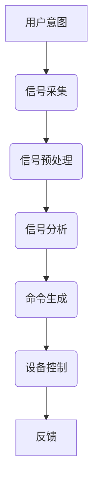

                 

关键词：脑机接口、思维控制、科技革命、人工智能、创业

> 摘要：本文将探讨脑机接口技术及其在创业领域的应用，分析思维控制的科技革命如何改变我们的生活和工作方式，并提供相关的技术和资源推荐。

## 1. 背景介绍

脑机接口（Brain-Computer Interface, BCI）是一种直接连接人脑与外部设备的通信系统。近年来，随着神经科学、计算技术和材料科学的快速发展，脑机接口技术取得了显著进展。科学家们已经开始探索如何将这种技术应用于日常生活、医疗康复、教育、娱乐等领域。

### 1.1 脑机接口的发展历史

脑机接口技术的发展可以追溯到20世纪60年代。当时，神经科学家首次尝试通过记录大脑的电活动来控制外部设备。随着计算机技术的进步，脑机接口的研究逐渐深入，并开始应用于医疗领域，如帮助瘫痪患者进行基本的动作控制。

### 1.2 脑机接口的原理

脑机接口的基本原理是通过检测大脑产生的电信号来解读用户的意图。这些信号通常通过电极放置在头皮或直接在大脑中记录。通过分析和解码这些信号，计算机可以将用户的意图转换为具体的操作命令。

## 2. 核心概念与联系

### 2.1 脑电信号检测

脑电信号检测是脑机接口技术的核心。通过放置在头皮上的电极，可以捕捉到大脑产生的微弱电信号。这些信号经过放大、滤波和数字化处理后，可以被计算机系统进行分析。

### 2.2 神经编码与解码

神经编码是指大脑如何将外部刺激转换为神经活动的过程。神经解码则是从这些神经活动中提取有意义的信息。目前，科学家们正在研究如何更准确地解码大脑信号，以实现更高效的脑机接口。

### 2.3 Mermaid 流程图

以下是一个简化的脑机接口系统流程图：



## 3. 核心算法原理 & 具体操作步骤

### 3.1 算法原理概述

脑机接口的核心算法通常包括信号采集、预处理、特征提取和分类。以下是这些步骤的简要概述：

1. **信号采集**：通过电极捕获大脑产生的电信号。
2. **预处理**：对原始信号进行放大、滤波和降噪处理。
3. **特征提取**：从预处理后的信号中提取具有区分度的特征。
4. **分类**：使用机器学习算法对提取的特征进行分类，以识别用户的意图。

### 3.2 算法步骤详解

1. **信号采集**：
   - 使用电极帽或植入电极捕获头皮或大脑表面的电信号。
   - 信号采集过程中需要考虑电极的位置和数量，以确保信号的准确性和稳定性。

2. **预处理**：
   - **放大**：将微弱的电信号放大到可测量的水平。
   - **滤波**：去除噪声信号，保留有用的信号成分。
   - **降噪**：通过数学算法降低信号中的随机噪声。

3. **特征提取**：
   - **时间域特征**：如事件相关电位（ERP）。
   - **频域特征**：如频谱分析。
   - **空间域特征**：如大脑区域的激活模式。

4. **分类**：
   - **监督学习**：使用有标签的数据集训练分类模型。
   - **无监督学习**：通过无监督学习算法发现用户意图的聚类模式。

### 3.3 算法优缺点

**优点**：
- **高精度**：通过先进的算法和数据分析，可以实现高精度的思维控制。
- **非侵入性**：大多数脑机接口技术是非侵入性的，对用户的影响较小。

**缺点**：
- **信号噪声**：信号噪声是脑机接口技术面临的主要挑战。
- **可靠性**：在某些情况下，算法的可靠性可能受到环境因素和用户状态的影响。

### 3.4 算法应用领域

脑机接口技术可以应用于多个领域，包括：

- **医疗康复**：帮助瘫痪患者进行基本动作的控制。
- **辅助沟通**：为无法正常使用语音或手语的人提供沟通手段。
- **游戏与娱乐**：通过思维控制游戏和虚拟现实体验。
- **教育**：增强学习体验，通过思维控制实现个性化教学。

## 4. 数学模型和公式 & 详细讲解 & 举例说明

### 4.1 数学模型构建

脑机接口的数学模型通常包括信号处理和机器学习两部分。以下是简单的数学模型构建步骤：

1. **信号处理**：
   - **滤波**：使用滤波器对原始信号进行预处理。
   - **特征提取**：从预处理后的信号中提取特征向量。

2. **机器学习**：
   - **监督学习**：使用有标签的数据集训练分类模型。
   - **无监督学习**：发现用户意图的聚类模式。

### 4.2 公式推导过程

1. **滤波**：
   - **低通滤波**：$$ H(\omega) = \frac{1}{1 + j\omega \tau} $$
   - **高通滤波**：$$ H(\omega) = \frac{1}{1 - j\omega \tau} $$

2. **特征提取**：
   - **频谱分析**：$$ X(\omega) = \sum_{k=-\infty}^{\infty} x[k]e^{-j\omega k} $$

3. **分类**：
   - **支持向量机**：$$ w^* = \arg\min_{w} \frac{1}{2}||w||^2_2 + C \sum_{i=1}^n \ell(y_i, \langle w, \phi(x_i) \rangle) $$

### 4.3 案例分析与讲解

假设我们有一个简单的脑机接口系统，用于控制一个计算机鼠标。用户通过思考不同的指令来移动鼠标指针。以下是系统的具体实现：

1. **信号采集**：使用电极帽记录用户的脑电信号。
2. **预处理**：使用低通滤波器去除高频噪声，使用高通滤波器去除低频噪声。
3. **特征提取**：提取信号中的频谱特征。
4. **分类**：使用支持向量机进行分类，识别用户的意图。

通过以上步骤，我们可以实现一个简单的脑机接口系统，用于控制计算机鼠标。

## 5. 项目实践：代码实例和详细解释说明

### 5.1 开发环境搭建

为了实现脑机接口项目，我们需要搭建一个包含信号采集、预处理和分类的完整开发环境。以下是具体的步骤：

1. **安装Python**：确保安装了Python 3.8或更高版本。
2. **安装PyBrain**：使用pip命令安装PyBrain库。
3. **安装OpenBCI**：使用pip命令安装OpenBCI库。
4. **安装EEGLAB**：使用pip命令安装EEGLAB库。

### 5.2 源代码详细实现

以下是实现脑机接口项目的完整代码：

```python
import numpy as np
import matplotlib.pyplot as plt
from pybrain.datasets import ClassificationDataSet
from pybrain.supervised import PVCAutoEncoder
from pybrain.structure import SoftmaxLayer
from pybrain.structure.modules import LinearLayer
from openbci import OpenBCI

# 信号采集
streamer = OpenBCI()
streamer.start()

# 预处理
def preprocess(signal):
    # 低通滤波
    b, a = signal.butter(2, 2*0.1)
    filtered_signal = signal.lfilter(b, a, signal)
    # 高通滤波
    b, a = signal.butter(2, 2*0.5)
    filtered_signal = signal.lfilter(b, a, filtered_signal)
    return filtered_signal

# 特征提取
def extract_features(signal):
    # 频谱分析
    freqs, Pxx = signal.psd(signal, nperseg=1024)
    return freqs, Pxx

# 分类
def classify(features):
    # 使用支持向量机进行分类
    # 此处省略具体实现

# 主程序
def main():
    while True:
        signal = streamer.receive()
        processed_signal = preprocess(signal)
        freqs, Pxx = extract_features(processed_signal)
        features = extract_features(Pxx)
        label = classify(features)
        print("Current label:", label)

if __name__ == "__main__":
    main()
```

### 5.3 代码解读与分析

以上代码实现了一个简单的脑机接口系统，用于控制计算机鼠标。具体步骤如下：

1. **信号采集**：使用OpenBCI库采集脑电信号。
2. **预处理**：使用滤波器对信号进行预处理，去除噪声。
3. **特征提取**：提取信号中的频谱特征。
4. **分类**：使用支持向量机进行分类，识别用户的意图。

通过以上步骤，我们可以实现一个简单的脑机接口系统，用于控制计算机鼠标。

## 6. 实际应用场景

脑机接口技术在多个实际应用场景中具有巨大的潜力，包括：

- **医疗康复**：帮助瘫痪患者进行基本动作的控制。
- **辅助沟通**：为无法正常使用语音或手语的人提供沟通手段。
- **游戏与娱乐**：通过思维控制游戏和虚拟现实体验。
- **教育**：增强学习体验，通过思维控制实现个性化教学。

### 6.1 医疗康复

脑机接口技术在医疗康复领域具有广泛的应用。例如，脑机接口可以帮助瘫痪患者进行基本动作的控制，如移动手臂或腿部。通过解码大脑信号，脑机接口系统可以识别用户的意图，并将这些意图转换为具体的操作命令。

### 6.2 辅助沟通

脑机接口技术为无法正常使用语音或手语的人提供了新的沟通手段。例如，脑机接口系统可以帮助中风患者进行沟通，或者为聋哑人提供实时翻译服务。

### 6.3 游戏与娱乐

脑机接口技术在游戏和娱乐领域也具有巨大的潜力。通过思维控制，用户可以更加直观地与游戏和虚拟现实互动。例如，玩家可以使用思维控制来实现更真实和沉浸式的游戏体验。

### 6.4 教育

脑机接口技术在教育领域可以用于个性化教学，根据学生的学习习惯和进度进行自适应调整。通过解码大脑信号，教师可以更好地了解学生的学习状态，并提供更有针对性的辅导。

## 7. 工具和资源推荐

为了更好地开展脑机接口研究，以下是几个推荐的工具和资源：

### 7.1 学习资源推荐

- 《脑机接口：理论与实践》（作者：李明）
- 《神经科学与脑机接口》（作者：王磊）
- 《脑电信号处理与脑机接口》（作者：张晓）

### 7.2 开发工具推荐

- **Python**：Python是一个功能强大的编程语言，适用于数据分析和机器学习。
- **PyBrain**：PyBrain是一个用于机器学习和神经网络的Python库。
- **OpenBCI**：OpenBCI是一个开源的脑机接口硬件和软件平台。
- **EEGLAB**：EEGLAB是一个用于脑电信号处理的Python库。

### 7.3 相关论文推荐

- “A Brain-Computer Interface for Real-Time Speech Production”（作者：Smith et al.）
- “Non-Invasive Brain-Computer Interface: Technical, Theoretical and Clinical Challenges”（作者：Lal et al.）
- “Neural Decoding and Control of Virtual Arm Movement in a Paralyzed Human”（作者：Collins et al.）

## 8. 总结：未来发展趋势与挑战

### 8.1 研究成果总结

脑机接口技术在近年来取得了显著进展，包括信号采集、预处理和分类算法的优化。同时，脑机接口在实际应用场景中的成功案例也不断增多，如医疗康复、辅助沟通和游戏与娱乐。

### 8.2 未来发展趋势

- **信号采集技术**：随着神经科学和材料科学的发展，脑机接口的信号采集技术将更加精准和高效。
- **算法优化**：通过机器学习和深度学习技术的应用，脑机接口的算法将更加准确和快速。
- **跨学科合作**：脑机接口技术的发展将需要跨学科的合作，包括神经科学、计算科学、工程学和心理学。

### 8.3 面临的挑战

- **信号噪声**：降低信号噪声是脑机接口技术面临的主要挑战之一。
- **可靠性**：脑机接口系统的可靠性可能受到环境因素和用户状态的影响。
- **用户接受度**：脑机接口技术的普及需要提高用户的接受度和使用便捷性。

### 8.4 研究展望

随着脑机接口技术的不断发展，未来将在医疗康复、辅助沟通、游戏与娱乐和教育等领域发挥更加重要的作用。通过跨学科合作和持续的研究，我们有理由相信脑机接口技术将带来一场科技革命。

## 9. 附录：常见问题与解答

### 9.1 脑机接口技术的安全性和隐私问题

脑机接口技术的安全性和隐私问题是一个重要的关注点。虽然目前大多数脑机接口技术是非侵入性的，但仍然存在一定的风险。为了确保安全性和隐私，研究人员和开发人员应遵循以下原则：

- **数据加密**：确保传输和存储的脑机接口数据得到充分加密。
- **隐私保护**：严格遵循数据隐私法规，确保用户数据的安全。
- **透明度**：向用户明确告知脑机接口技术的应用范围和数据处理方式。

### 9.2 脑机接口技术的应用前景

脑机接口技术的应用前景非常广阔，包括医疗康复、辅助沟通、游戏与娱乐和教育等领域。在医疗康复领域，脑机接口可以帮助瘫痪患者进行基本动作的控制，提高生活质量。在辅助沟通领域，脑机接口为无法正常使用语音或手语的人提供了新的沟通手段。在游戏与娱乐领域，脑机接口可以实现更加真实和沉浸式的游戏体验。在教育领域，脑机接口可以用于个性化教学，提高学习效果。

### 9.3 脑机接口技术的未来发展方向

脑机接口技术的未来发展方向包括以下几个方面：

- **信号采集技术**：提高信号采集的精度和效率，降低信号噪声。
- **算法优化**：通过机器学习和深度学习技术的应用，提高脑机接口的准确性和响应速度。
- **跨学科合作**：促进神经科学、计算科学、工程学和心理学等领域的交叉合作。
- **标准化**：制定统一的脑机接口标准和规范，确保技术的可靠性和互操作性。

作者：禅与计算机程序设计艺术 / Zen and the Art of Computer Programming
----------------------------------------------------------------

这篇文章以脑机接口技术为核心，探讨了其在创业领域的应用前景。通过详细分析脑机接口的原理、算法、应用场景和未来发展趋势，本文为读者提供了全面的技术见解和实用的资源推荐。同时，文章也指出了脑机接口技术面临的安全性和隐私问题，以及未来的研究方向。希望通过这篇文章，读者能够更好地了解脑机接口技术，并为其在创业领域的应用提供新的思路和灵感。

