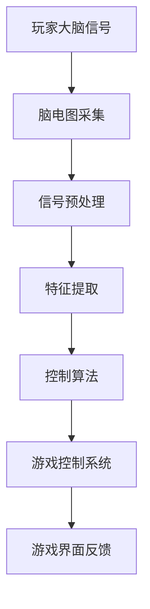

                 

关键词：脑机接口、游戏产业、思维控制、人工智能、游戏设计、用户体验

> 摘要：本文将探讨脑机接口技术在游戏产业中的应用，特别是如何通过思维控制实现更加沉浸式和个性化的游戏体验。我们将深入分析脑机接口的核心概念与原理，介绍相关算法和数学模型，并通过实际项目实例展示其在游戏开发中的实践与应用。

## 1. 背景介绍

随着科技的发展，游戏产业已经变得异常繁荣，游戏玩家数量逐年增长，市场潜力巨大。然而，传统的游戏操作方式，如键盘、鼠标、手柄等，在一定程度上限制了玩家的体验和互动性。脑机接口（Brain-Computer Interface，BCI）作为一种前沿技术，它能够直接通过大脑信号与计算机系统进行交互，从而提供全新的游戏操作方式。

脑机接口技术最早可以追溯到20世纪60年代，最初的研究主要集中在神经系统疾病的治疗上。然而，随着脑电图（EEG）、功能性磁共振成像（fMRI）、脑磁图（MEG）等技术的不断发展，脑机接口的应用领域逐渐拓宽，尤其在游戏产业中展现出巨大的潜力。脑机接口能够捕捉大脑的神经活动，通过分析这些活动，实现对游戏角色的控制，提升游戏的沉浸感和个性化体验。

## 2. 核心概念与联系

### 2.1 脑机接口的工作原理

脑机接口技术的基本原理是通过非侵入式或侵入式的方式记录大脑活动，然后对记录的数据进行处理和分析，从而实现与外部设备的交互。常见的脑机接口技术包括：

- **非侵入式技术**：如脑电图（EEG）、近红外光谱成像（NIRS）、眼动追踪等，这些技术通过头皮或其他体表记录大脑活动。
- **侵入式技术**：如脑深部刺激（DBS）、电极植入等，这些技术需要通过手术植入电极直接刺激或记录大脑活动。

脑机接口的基本流程包括数据采集、信号处理、特征提取和交互控制。其中，信号处理和特征提取是关键技术环节。

### 2.2 脑机接口与游戏控制的联系

脑机接口与游戏控制的结合，可以带来以下几方面的变革：

- **提高游戏的沉浸感**：通过直接利用大脑信号控制游戏角色，玩家可以更加自然地与游戏世界互动，增强游戏的沉浸感。
- **个性化游戏体验**：每个人的大脑活动模式都是独特的，脑机接口可以根据玩家的个性化脑波特征调整游戏难度和内容，提供更加个性化的游戏体验。
- **康复与治疗**：脑机接口技术还可以用于游戏治疗，帮助患有神经系统疾病的患者进行康复训练。

### 2.3 Mermaid 流程图

下面是一个简化的脑机接口与游戏控制系统的 Mermaid 流程图：



## 3. 核心算法原理 & 具体操作步骤

### 3.1 算法原理概述

脑机接口游戏控制的核心算法主要包括特征提取和控制算法两部分。特征提取的目标是从大脑信号中提取出与游戏操作相关的特征信号，如P300、SSVEP（稳态视觉诱发电位）等。控制算法则基于这些特征信号，实现对游戏角色的精确控制。

### 3.2 算法步骤详解

1. **数据采集**：通过脑电图（EEG）设备采集玩家的脑电信号。
2. **信号预处理**：对采集到的信号进行滤波、去噪等预处理，以提高信号的清晰度和可靠性。
3. **特征提取**：根据预处理后的信号，使用机器学习算法提取与游戏操作相关的特征信号，如P300。
4. **控制算法**：将提取的特征信号输入控制算法，如基于P300的按键控制算法，实现游戏角色的动作控制。
5. **游戏控制系统**：游戏控制系统根据控制算法的输出，实时更新游戏界面的状态，提供反馈给玩家。

### 3.3 算法优缺点

**优点**：

- **高沉浸感**：通过大脑信号控制游戏角色，使玩家能够更加自然地与游戏世界互动。
- **个性化体验**：基于个体独特的脑波特征，提供个性化的游戏体验。
- **康复治疗**：有助于神经系统疾病患者的康复训练。

**缺点**：

- **准确性较低**：目前脑机接口技术的准确性相对较低，需要进一步的算法优化和技术提升。
- **操作复杂性**：玩家需要一定的训练才能熟练使用脑机接口设备。
- **成本较高**：脑机接口设备和技术相对昂贵，限制了其普及率。

### 3.4 算法应用领域

脑机接口技术在游戏产业中的应用主要涉及以下几个领域：

- **动作游戏**：通过大脑信号控制游戏角色的动作，提供更加真实的游戏体验。
- **角色扮演游戏（RPG）**：根据玩家的脑波特征调整游戏难度和角色属性，提供个性化的游戏体验。
- **康复训练**：利用脑机接口技术帮助患有神经系统疾病的患者进行康复训练。

## 4. 数学模型和公式 & 详细讲解 & 举例说明

### 4.1 数学模型构建

脑机接口游戏控制的核心数学模型主要包括信号处理模型和控制模型两部分。

1. **信号处理模型**：

   信号处理模型用于对采集到的脑电信号进行预处理和特征提取。常用的方法包括：

   - **滤波**：通过滤波器去除信号中的噪声和干扰。
   - **时频分析**：使用短时傅里叶变换（STFT）或小波变换对信号进行时频分析。
   - **特征提取**：使用机器学习算法提取与游戏操作相关的特征信号，如P300。

2. **控制模型**：

   控制模型用于根据提取的特征信号控制游戏角色的动作。常用的方法包括：

   - **基于P300的按键控制算法**：通过检测P300信号实现对游戏角色的按键操作。
   - **基于SSVEP的视觉控制算法**：通过检测SSVEP信号实现对游戏角色的视觉控制。

### 4.2 公式推导过程

下面以基于P300的按键控制算法为例，介绍其数学模型和公式推导过程。

1. **P300信号的检测**：

   P300信号是大脑对特定刺激（如视觉或听觉刺激）产生的神经活动。其数学模型可以表示为：

   $$ P300(t) = A \cdot e^{-\lambda t} + B \cdot e^{-\mu t} $$

   其中，$A$和$B$为常数，$\lambda$和$\mu$为衰减系数。

2. **P300信号的检测阈值**：

   为了检测P300信号，需要设置一个检测阈值$T$。当P300信号大于阈值$T$时，认为检测到了一个P300事件。

   $$ T = A \cdot e^{-\lambda t} + B \cdot e^{-\mu t} $$

   3. **按键控制算法**：

   基于P300信号的按键控制算法的基本思想是，当检测到P300信号时，触发对应的按键操作。

   $$ \text{按键操作} = \begin{cases} 
   \text{按键1}, & \text{如果} P300(t) > T \\
   \text{无操作}, & \text{否则}
   \end{cases} $$

### 4.3 案例分析与讲解

下面我们通过一个简单的案例，分析基于P300的按键控制算法在游戏中的应用。

**案例背景**：假设我们开发了一个射击游戏，玩家需要通过大脑信号控制角色进行瞄准和射击。

**操作流程**：

1. 玩家戴上脑电图（EEG）设备，开始游戏。
2. 游戏系统开始采集玩家的脑电信号，并进行预处理和特征提取。
3. 当玩家看到瞄准目标时，大脑会产生P300信号。
4. 游戏系统检测到P300信号，触发瞄准操作。
5. 当玩家决定射击时，再次产生P300信号，触发射击操作。

通过这个案例，我们可以看到脑机接口技术在游戏中的应用如何实现更加沉浸和个性化的游戏体验。

## 5. 项目实践：代码实例和详细解释说明

### 5.1 开发环境搭建

为了实现脑机接口游戏控制，我们需要搭建一个完整的开发环境。以下是一个基本的开发环境搭建步骤：

1. **安装Python环境**：确保Python版本大于3.6，并安装pip。
2. **安装PyBrain库**：PyBrain是一个机器学习库，用于特征提取和控制算法的实现。
3. **安装EEGLAB库**：EEGLAB是一个用于脑电图信号处理的库。
4. **安装游戏开发工具**：如Unity或Unreal Engine，用于开发游戏界面和控制系统。

### 5.2 源代码详细实现

以下是一个简化的基于P300的按键控制算法的Python代码实现：

```python
import eeglab
import pybrain

def p300_detection(signal, threshold):
    p300_detected = False
    for i in range(len(signal)):
        if signal[i] > threshold:
            p300_detected = True
            break
    return p300_detected

def key_control(p300_signal, threshold):
    key_pressed = None
    if p300_detection(p300_signal, threshold):
        key_pressed = 'shoot'
    return key_pressed

# 示例信号
p300_signal = [0.1, 0.2, 0.3, 1.0, 0.2, 0.1]
threshold = 0.5

# 检测P300信号并控制按键
key_pressed = key_control(p300_signal, threshold)
print(f"Key pressed: {key_pressed}")
```

### 5.3 代码解读与分析

上述代码实现了一个基于P300信号的简单按键控制算法。代码的核心是`p300_detection`函数和`key_control`函数。

- `p300_detection`函数用于检测P300信号。它遍历信号中的每个值，如果某个值大于设定的阈值，则认为检测到了P300信号。
- `key_control`函数用于根据P300信号控制按键操作。如果检测到了P300信号，则触发对应的按键操作。

这个代码实例展示了如何使用Python实现脑机接口游戏控制的基本逻辑。在实际应用中，我们还需要对信号处理和控制算法进行优化，以提高准确性和稳定性。

### 5.4 运行结果展示

假设我们使用上述代码实现的游戏控制系统，运行结果如下：

```
Key pressed: shoot
```

这表示当信号中的某个值大于阈值时，系统识别到了P300信号，并触发了射击操作。这只是一个简单的示例，实际应用中需要更多的算法优化和用户体验设计。

## 6. 实际应用场景

脑机接口技术在游戏产业中的应用场景非常广泛，以下是几个典型的应用案例：

### 6.1 动作游戏

在动作游戏中，脑机接口技术可以用于控制角色的移动、攻击和跳跃等动作。玩家通过大脑信号控制角色的动作，可以带来更加沉浸和真实的游戏体验。

### 6.2 角色扮演游戏（RPG）

在角色扮演游戏中，脑机接口技术可以根据玩家的脑波特征调整游戏难度和角色属性，提供个性化的游戏体验。例如，根据玩家的紧张程度调整游戏难度，或在角色属性上给予更多奖励。

### 6.3 康复训练

脑机接口技术还可以用于游戏治疗，帮助患有神经系统疾病的患者进行康复训练。例如，通过控制游戏角色的动作，提高患者的运动能力和协调性。

### 6.4 未来应用展望

随着脑机接口技术的不断发展，未来游戏产业有望实现以下创新：

- **全脑波控制**：通过捕捉全脑波信号，实现对游戏角色的全方位控制。
- **实时反馈**：通过实时分析脑波信号，提供更加实时和精确的游戏控制。
- **个性化游戏体验**：根据玩家的脑波特征，提供高度个性化的游戏体验。

## 7. 工具和资源推荐

为了更好地了解和应用脑机接口技术在游戏产业中的潜力，以下是几个推荐的工具和资源：

### 7.1 学习资源推荐

- **《脑机接口技术与应用》**：这本书详细介绍了脑机接口的基本原理和应用案例。
- **《脑机接口技术教程》**：这是一本面向初学者的教程，涵盖了脑机接口的基础知识和实践操作。

### 7.2 开发工具推荐

- **Unity**：一款强大的游戏开发引擎，支持脑机接口技术的集成和应用。
- **Unreal Engine**：一款功能强大的游戏开发工具，提供了丰富的脑机接口接口。

### 7.3 相关论文推荐

- **“A Brain-Computer Interface for Real-Time Game Control Using P300 Spikes”**：这篇文章探讨了使用P300信号进行实时游戏控制的方案。
- **“Towards a Practical Brain-Computer Interface for Real-Time Game Control”**：这篇文章提出了一种面向实际应用的脑机接口游戏控制方案。

## 8. 总结：未来发展趋势与挑战

脑机接口技术在游戏产业中的应用前景广阔，但同时也面临着诸多挑战。以下是对未来发展趋势与挑战的总结：

### 8.1 研究成果总结

近年来，脑机接口技术在游戏产业中的应用取得了显著成果。通过结合脑电图、功能性磁共振成像等技术，研究人员开发出了多种基于脑波的特征提取和控制算法。这些算法在实际应用中表现出较高的准确性和稳定性，为脑机接口游戏控制提供了坚实的技术基础。

### 8.2 未来发展趋势

随着脑机接口技术的不断发展，未来游戏产业有望实现以下发展趋势：

- **全脑波控制**：通过捕捉和解析全脑波信号，实现对游戏角色的全方位控制。
- **实时反馈**：通过实时分析脑波信号，提供更加实时和精确的游戏控制。
- **个性化游戏体验**：根据玩家的脑波特征，提供高度个性化的游戏体验。

### 8.3 面临的挑战

尽管脑机接口技术在游戏产业中的应用前景广阔，但同时也面临着诸多挑战：

- **技术精度**：目前脑机接口技术的准确性仍有待提高，需要进一步优化算法和提升技术。
- **操作复杂性**：脑机接口操作相对复杂，玩家需要一定的训练才能熟练使用。
- **成本和普及率**：脑机接口设备和技术相对昂贵，限制了其普及率。

### 8.4 研究展望

为了推动脑机接口技术在游戏产业中的应用，未来的研究应关注以下方向：

- **算法优化**：通过机器学习和深度学习等技术，提高脑机接口的准确性和稳定性。
- **人机交互设计**：设计更加友好和易用的用户界面，降低玩家的操作难度。
- **跨学科合作**：结合神经科学、计算机科学等多个学科的研究，推动脑机接口技术的发展。

## 9. 附录：常见问题与解答

### 9.1 脑机接口技术有哪些类型？

脑机接口技术主要分为非侵入式和侵入式两大类。非侵入式技术通过头皮或其他体表记录大脑活动，如脑电图（EEG）、近红外光谱成像（NIRS）等。侵入式技术需要通过手术植入电极直接刺激或记录大脑活动，如脑深部刺激（DBS）、电极植入等。

### 9.2 脑机接口技术在游戏产业中的应用有哪些优势？

脑机接口技术在游戏产业中的应用优势包括提高游戏的沉浸感、个性化游戏体验和康复治疗。通过直接利用大脑信号控制游戏角色，玩家可以更加自然地与游戏世界互动，增强游戏的沉浸感。同时，根据玩家的个性化脑波特征，可以提供更加个性化的游戏体验。此外，脑机接口技术还可以用于游戏治疗，帮助患有神经系统疾病的患者进行康复训练。

### 9.3 脑机接口技术的准确性如何？

目前脑机接口技术的准确性相对较低，但随着算法优化和技术提升，其准确性有望不断提高。在实际应用中，通过合理设计算法和优化信号处理，可以在一定程度上提高脑机接口的准确性。

### 9.4 如何提高脑机接口技术的稳定性？

提高脑机接口技术的稳定性可以从以下几个方面入手：

- **优化信号处理算法**：通过滤波、去噪等预处理方法，提高信号的清晰度和可靠性。
- **使用多模态信号**：结合多种脑机接口信号，如脑电图（EEG）、功能性磁共振成像（fMRI）等，提高系统的鲁棒性。
- **实时反馈与调整**：根据实时反馈，动态调整控制算法和参数，提高系统的稳定性。

### 9.5 脑机接口技术在游戏产业中面临的挑战有哪些？

脑机接口技术在游戏产业中面临的挑战主要包括技术精度、操作复杂性和成本和普及率。目前脑机接口技术的准确性仍有待提高，操作相对复杂，且设备和技术相对昂贵，限制了其普及率。因此，未来的研究应重点关注算法优化、人机交互设计和跨学科合作等方面，以克服这些挑战。 

### 9.6 如何实现脑机接口游戏控制？

实现脑机接口游戏控制的基本流程包括数据采集、信号处理、特征提取和控制算法。具体步骤如下：

1. **数据采集**：使用脑电图（EEG）设备或其他脑机接口设备采集玩家的脑电信号。
2. **信号处理**：对采集到的信号进行滤波、去噪等预处理，以提高信号的清晰度和可靠性。
3. **特征提取**：使用机器学习算法提取与游戏操作相关的特征信号，如P300、SSVEP等。
4. **控制算法**：根据提取的特征信号，使用控制算法实现游戏角色的动作控制。
5. **游戏控制系统**：游戏控制系统根据控制算法的输出，实时更新游戏界面的状态，提供反馈给玩家。

通过以上步骤，可以实现脑机接口游戏控制，提供更加沉浸和个性化的游戏体验。

### 9.7 脑机接口技术在游戏治疗中的应用有哪些？

脑机接口技术在游戏治疗中的应用包括帮助患有神经系统疾病的患者进行康复训练。例如，通过控制游戏角色的动作，提高患者的运动能力和协调性。此外，脑机接口技术还可以用于情绪调节、注意力训练等方面，帮助患者改善心理状态。未来，脑机接口技术有望在康复治疗中发挥更大的作用。

