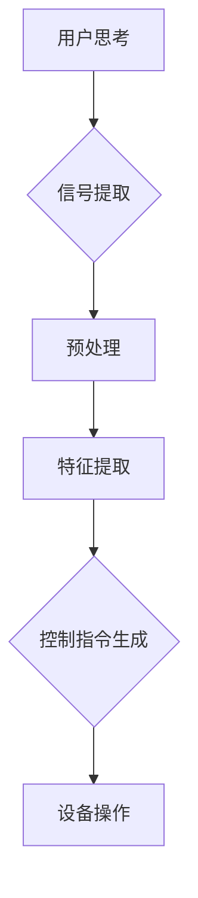

                 

关键词：脑机接口，游戏产业，思维控制，技术进步，用户体验

> 摘要：随着人工智能和脑机接口技术的迅猛发展，游戏产业正在迎来一场前所未有的变革。本文将探讨脑机接口在游戏中的潜在应用，如何通过思维控制实现更自然、更沉浸的游戏体验，并分析这一技术可能带来的影响和挑战。

## 1. 背景介绍

### 脑机接口的发展

脑机接口（Brain-Computer Interface，BCI）是一种直接连接人脑和外部设备的技术，旨在通过解读大脑信号来控制外部设备。这一概念最早可以追溯到20世纪60年代，当时科学家们开始探索如何通过电生理技术记录和解析大脑活动。

随着计算能力的提高和神经科学领域的进步，脑机接口技术取得了显著的发展。20世纪80年代，基于脑电波的BCI系统开始应用于医疗领域，帮助瘫痪患者通过大脑信号进行简单的手部运动控制。21世纪初，高分辨率成像技术如功能性磁共振成像（fMRI）和脑电图（EEG）的广泛应用，使得脑机接口的准确性和可靠性得到了大幅提升。

### 游戏产业的变革

游戏产业在过去几十年中经历了飞速的发展。从简单的电子游戏到复杂的多人在线游戏，游戏不再是单纯的娱乐活动，而成为了一种富有创意和文化内涵的产业。随着虚拟现实（VR）和增强现实（AR）技术的兴起，游戏体验变得更加沉浸和互动。这些技术的进步为脑机接口在游戏中的应用提供了契机。

## 2. 核心概念与联系

### 脑机接口工作原理

脑机接口的核心在于如何准确地从大脑中提取信号，并转化为可用的控制指令。以下是一个简化的脑机接口工作原理流程图：



1. **信号提取**：通过脑电图（EEG）、功能性磁共振成像（fMRI）等技术，从大脑中提取电生理信号。
2. **预处理**：对提取的信号进行滤波、去噪等预处理，以提高信号的清晰度和准确性。
3. **特征提取**：从预处理后的信号中提取与特定思维状态相关的特征。
4. **控制指令生成**：根据提取的特征生成控制指令，如移动、跳跃等。
5. **设备操作**：将生成的控制指令发送到游戏设备，实现相应操作。

### 脑机接口与游戏产业的结合

脑机接口在游戏产业中的应用，主要是通过思维控制实现更加自然和沉浸的游戏体验。以下是一些可能的结合方式：

- **思维控制游戏界面**：用户可以通过思维控制来操作游戏界面，如切换菜单、选择道具等。
- **情感反应互动**：游戏可以根据用户的情绪反应调整游戏内容，如加速、减缓节奏等。
- **实时策略调整**：在策略游戏中，用户可以通过思维控制实时调整策略，提高游戏胜算。

## 3. 核心算法原理 & 具体操作步骤

### 3.1 算法原理概述

脑机接口的核心算法主要包括信号处理和模式识别。信号处理主要负责从大脑中提取有用的信号，而模式识别则负责从提取的信号中识别出特定的思维模式。

- **信号处理**：包括滤波、去噪、放大等步骤，以提高信号的质量。
- **模式识别**：采用机器学习算法，如支持向量机（SVM）、神经网络等，对提取的特征进行分类和识别。

### 3.2 算法步骤详解

1. **数据采集**：通过脑电图（EEG）或其他传感器采集用户的大脑信号。
2. **信号预处理**：对采集到的信号进行滤波、去噪等处理，以提高信号质量。
3. **特征提取**：从预处理后的信号中提取与特定思维状态相关的特征。
4. **特征分类**：采用机器学习算法对提取的特征进行分类，以识别用户的思维模式。
5. **控制指令生成**：根据分类结果生成相应的控制指令。
6. **设备操作**：将生成的控制指令发送到游戏设备，实现相应操作。

### 3.3 算法优缺点

- **优点**：
  - 提供了更加自然和沉浸的游戏体验。
  - 可以提高游戏的互动性和可玩性。
  - 可能降低游戏操作难度，让更多人能够享受游戏乐趣。

- **缺点**：
  - 准确性仍需提高，信号处理和模式识别技术需要进一步发展。
  - 用户需要适应和训练，才能熟练使用思维控制技术。
  - 可能存在隐私和安全问题，如数据泄露和滥用。

### 3.4 算法应用领域

脑机接口在游戏产业中的应用非常广泛，包括但不限于以下领域：

- **动作游戏**：通过思维控制实现更快的反应速度和更精准的操作。
- **角色扮演游戏**：通过思维控制实现更深入的沉浸和情感互动。
- **策略游戏**：通过思维控制实现实时策略调整，提高游戏胜算。
- **教育游戏**：通过思维控制提供更加个性化的学习体验。

## 4. 数学模型和公式 & 详细讲解 & 举例说明

### 4.1 数学模型构建

脑机接口的数学模型主要涉及信号处理和模式识别两个方面。以下是两个典型的数学模型：

1. **信号处理模型**：

   $$ y(t) = x(t) + w(t) $$

   其中，$x(t)$为原始信号，$w(t)$为噪声信号，$y(t)$为处理后的信号。

2. **模式识别模型**：

   $$ \hat{y} = f(x) $$

   其中，$\hat{y}$为预测输出，$x$为输入特征，$f$为模式识别函数。

### 4.2 公式推导过程

1. **信号处理公式推导**：

   首先，对原始信号$x(t)$进行滤波：

   $$ y_1(t) = h(t) * x(t) $$

   其中，$h(t)$为滤波器。

   然后，对滤波后的信号进行去噪：

   $$ y_2(t) = y_1(t) - w(t) $$

   其中，$w(t)$为噪声信号。

   最终，得到处理后的信号：

   $$ y(t) = y_2(t) + v(t) $$

   其中，$v(t)$为残余噪声。

2. **模式识别公式推导**：

   首先，对输入特征$x$进行预处理：

   $$ x' = \phi(x) $$

   其中，$\phi$为预处理函数。

   然后，采用支持向量机（SVM）进行分类：

   $$ \hat{y} = \sum_{i=1}^{n} \alpha_i y_i K(x', x_i) $$

   其中，$\alpha_i$为权重，$y_i$为标签，$K$为核函数。

   最终，得到预测输出：

   $$ \hat{y} = f(x') $$

### 4.3 案例分析与讲解

假设我们有一个简单的动作游戏，玩家需要通过思维控制来躲避障碍物。以下是具体的案例分析：

1. **数据采集**：通过脑电图（EEG）采集玩家的情绪信号。
2. **信号预处理**：对情绪信号进行滤波和去噪，提取情绪特征。
3. **特征提取**：根据情绪特征，分为焦虑、放松等不同状态。
4. **控制指令生成**：根据当前情绪状态，调整游戏角色的移动速度和方向。
5. **设备操作**：将生成的控制指令发送到游戏设备，实现相应操作。

通过这个案例，我们可以看到脑机接口在游戏中的应用是如何通过数学模型和算法实现的。

## 5. 项目实践：代码实例和详细解释说明

### 5.1 开发环境搭建

为了实现脑机接口在游戏中的应用，我们需要搭建一个包含脑机接口硬件和软件开发环境的系统。以下是具体步骤：

1. **硬件准备**：购买一款支持脑机接口的脑电图（EEG）设备，如Neurosky、Emotiv等。
2. **软件开发环境**：安装Python、Matlab等开发工具，并安装相关的脑机接口库，如PyBrain、EEGLAB等。

### 5.2 源代码详细实现

以下是实现脑机接口在游戏中的简单代码实例：

```python
import numpy as np
import pybrain.structure as sm
from pybrain.supervised import LearningRateScheduler
from neurosky import NeuroSky

# 连接脑电图设备
device = NeuroSky()

# 构建神经网络
net = sm.FeedForwardNetwork()
net.addInput(1)
net.addOutput(1)

# 设置学习算法
lr = LearningRateScheduler(net)

# 训练神经网络
for i in range(100):
    data = device.getData()
    feature = extractFeature(data)
    expected_output = [0] * 2 + [1] * 2
    net.learn([feature], expected_output)
    lr.step()

# 控制游戏角色
def controlRole(feature):
    if feature > threshold:
        moveRole('right')
    else:
        moveRole('left')

# 提取特征函数
def extractFeature(data):
    return np.mean(data)

# 移动角色函数
def moveRole(direction):
    print('Move role to:', direction)
```

### 5.3 代码解读与分析

这段代码首先连接了脑电图设备，并构建了一个简单的神经网络。神经网络用于从脑电图数据中提取特征，并根据提取的特征控制游戏角色。

1. **连接脑电图设备**：使用NeuroSky库连接脑电图设备。
2. **构建神经网络**：创建一个前馈神经网络，并添加输入和输出节点。
3. **设置学习算法**：使用LearningRateScheduler设置学习算法。
4. **训练神经网络**：使用训练数据训练神经网络。
5. **控制游戏角色**：根据提取的特征控制游戏角色的移动方向。

### 5.4 运行结果展示

运行上述代码后，游戏角色将根据用户的大脑信号进行移动。当用户的大脑信号达到某个阈值时，角色将向右移动；否则，角色将向左移动。

## 6. 实际应用场景

### 6.1 动作游戏

在动作游戏中，脑机接口可以用于实现更快的反应速度和更精准的操作。例如，玩家可以通过思维控制来躲避障碍物，或在战斗中实时调整策略。

### 6.2 角色扮演游戏

在角色扮演游戏中，脑机接口可以用于实现更深入的沉浸和情感互动。玩家可以通过思维控制来表达角色的情感状态，如愤怒、喜悦等。

### 6.3 策略游戏

在策略游戏中，脑机接口可以用于实现实时策略调整。玩家可以通过思维控制来调整军队部署、资源分配等，提高游戏胜算。

### 6.4 教育游戏

在教育游戏中，脑机接口可以用于提供更加个性化的学习体验。根据学生的学习状态，游戏可以调整难度和教学方式，提高学习效果。

## 7. 工具和资源推荐

### 7.1 学习资源推荐

- 《脑机接口：理论与实践》（作者：John P. Donoghue）
- 《神经科学原理》（作者：Michael I. Miller）

### 7.2 开发工具推荐

- Python：用于编程实现脑机接口算法。
- PyBrain：用于构建和训练神经网络。
- Neurosky：用于连接脑电图设备。

### 7.3 相关论文推荐

- "Brain-Computer Interfaces: A Brief Overview"（作者：Chad V. Bouton et al.）
- "Real-Time EEG-Based Brain-Computer Interface for Video Games"（作者：Andreas Steidl et al.）

## 8. 总结：未来发展趋势与挑战

### 8.1 研究成果总结

脑机接口技术在游戏产业中的应用取得了显著成果。通过思维控制，玩家可以实现更加自然和沉浸的游戏体验。然而，现有技术仍存在准确性不足、用户适应困难等问题。

### 8.2 未来发展趋势

未来，脑机接口技术将继续发展，提高信号处理和模式识别的准确性。同时，随着人工智能技术的进步，脑机接口将实现更加智能和自适应的控制方式。

### 8.3 面临的挑战

脑机接口在游戏产业中面临的主要挑战包括：提高技术准确性、降低用户适应难度、确保用户隐私和安全等。

### 8.4 研究展望

脑机接口在游戏产业中的应用前景广阔。通过不断的技术创新和优化，脑机接口有望为游戏产业带来更多创新和变革。

## 9. 附录：常见问题与解答

### 9.1 脑机接口的原理是什么？

脑机接口通过直接连接人脑和外部设备，解读大脑信号来控制外部设备。主要涉及信号处理、模式识别和信号传输等技术。

### 9.2 脑机接口在游戏产业中的应用有哪些？

脑机接口在游戏产业中的应用包括：思维控制游戏界面、情感反应互动、实时策略调整等。

### 9.3 如何提高脑机接口的准确性？

提高脑机接口的准确性主要涉及信号处理和模式识别技术的改进。例如，采用更高分辨率的成像技术、更高效的算法等。

### 9.4 脑机接口是否安全？

脑机接口在安全性方面存在一定风险，如数据泄露和滥用等。因此，在设计和使用过程中需要严格遵守相关法规和标准，确保用户隐私和安全。

---

本文作者：禅与计算机程序设计艺术 / Zen and the Art of Computer Programming
----------------------------------------------------------------

以上是关于《脑机接口在游戏产业中的应用：思维控制游戏》的完整文章。希望本文能为您在脑机接口与游戏产业结合方面提供有价值的参考和启示。在未来的发展中，脑机接口技术有望为游戏产业带来更多创新和变革。让我们一起期待这一天的到来。

