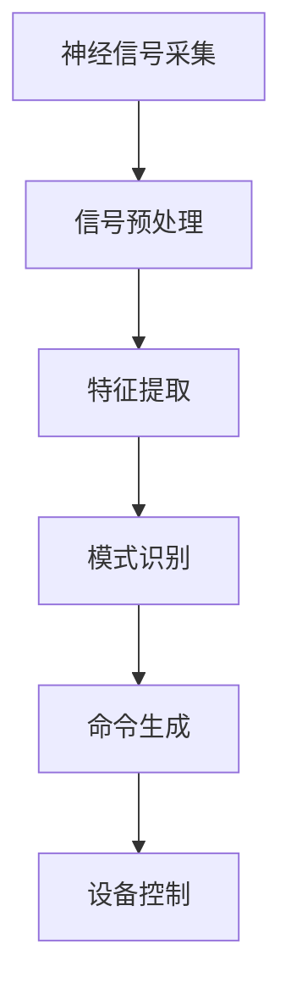

                 

关键词：脑机接口、辅助交流、残障人士、神经科学、人工智能

> 摘要：脑机接口技术正在快速发展，它通过直接连接人脑与外部设备，使得残障人士能够通过大脑信号进行交流。本文将探讨脑机接口在辅助交流中的应用，特别是如何帮助那些患有神经系统疾病或先天性残疾的人士恢复或增强他们的交流能力。

## 1. 背景介绍

脑机接口（Brain-Computer Interface，简称BCI）是一种将人脑的神经信号直接转换为计算机指令的技术。这个概念最初起源于科幻小说，如今已经成为现实，并在多个领域展现了其巨大的潜力。脑机接口技术通过捕捉大脑的神经元活动，利用这些信号来控制外部设备，从而实现人脑与机器之间的直接交流。

在残障人士的辅助交流领域，脑机接口技术尤为重要。许多残障人士由于神经系统损伤或疾病，无法通过传统的交流方式（如说话或书写）与他人沟通。脑机接口提供了一个全新的解决方案，使得他们能够通过大脑活动来生成语言、控制鼠标、操作游戏设备等，极大地提高了他们的生活质量。

## 2. 核心概念与联系

### 2.1. 脑机接口的基本原理

脑机接口技术依赖于多个核心概念，包括神经信号采集、信号处理和设备控制。

- **神经信号采集**：使用脑电图（EEG）、功能性磁共振成像（fMRI）、脑磁图（MEG）等技术来记录大脑的神经元活动。
- **信号处理**：通过算法分析捕捉到的神经信号，提取有用的信息，如认知意图、情感状态等。
- **设备控制**：将处理后的信号转换为控制命令，用于驱动外部设备。

### 2.2. 脑机接口架构

脑机接口通常由三个主要部分组成：传感器、信号处理器和输出设备。

- **传感器**：用于采集大脑信号，如电极、微电极阵列等。
- **信号处理器**：对采集到的信号进行实时处理和分析，提取有用的信息。
- **输出设备**：接收处理后的信号，并将其转换为相应的操作，如文字、声音、动作等。

### 2.3. Mermaid 流程图

以下是一个简化的脑机接口工作流程的Mermaid流程图：



## 3. 核心算法原理 & 具体操作步骤

### 3.1. 算法原理概述

脑机接口的核心算法通常包括信号预处理、特征提取和模式识别等步骤。

- **信号预处理**：去除噪声，增强信号质量。
- **特征提取**：从原始信号中提取有用的特征，如时间序列、频率信息等。
- **模式识别**：利用机器学习算法，识别大脑信号中的特定模式，以确定用户的意图。

### 3.2. 算法步骤详解

1. **信号采集**：通过EEG、fMRI等技术获取大脑信号。
2. **信号预处理**：滤波、去除噪声，提高信号质量。
3. **特征提取**：从预处理后的信号中提取特征，如时间序列特征、频率特征等。
4. **模式识别**：使用机器学习算法，如支持向量机（SVM）、神经网络（NN）等，对提取的特征进行分类，以确定用户的意图。
5. **命令生成**：根据识别出的意图，生成相应的控制命令。
6. **设备控制**：将命令发送到外部设备，实现相应的操作。

### 3.3. 算法优缺点

- **优点**：无需传统的身体动作，能够实现非侵入式的交流方式。
- **缺点**：对信号的预处理和算法要求较高，且信号噪声比可能较低。

### 3.4. 算法应用领域

脑机接口技术可以在多个领域得到应用，包括但不限于：

- **医疗领域**：帮助残障人士进行交流、控制假肢、辅助康复等。
- **游戏领域**：提供更加沉浸式的游戏体验。
- **教育领域**：辅助特殊儿童的学习和交流。

## 4. 数学模型和公式 & 详细讲解 & 举例说明

### 4.1. 数学模型构建

脑机接口的数学模型通常基于信号处理和模式识别的理论。以下是构建数学模型的基本步骤：

1. **信号采集**：使用EEG、fMRI等技术获取大脑信号，表示为向量序列。
2. **信号预处理**：通过滤波、去噪等操作，得到干净的数据序列。
3. **特征提取**：使用傅里叶变换、小波变换等方法，从预处理后的信号中提取特征向量。
4. **模式识别**：使用机器学习算法，如SVM、神经网络等，对特征向量进行分类。

### 4.2. 公式推导过程

1. **信号采集**：设采集到的大脑信号为\( s(t) \)，则其表示为：
   $$ s(t) = \sum_{i=1}^{n} a_i(t) \sin(2\pi f_i t + \phi_i) + n(t) $$
   其中，\( a_i(t) \)为幅度，\( f_i \)为频率，\( \phi_i \)为相位，\( n(t) \)为噪声。
2. **信号预处理**：通过滤波器去除噪声，得到干净的数据序列：
   $$ s_{\text{clean}}(t) = \text{filter}(s(t)) $$
3. **特征提取**：使用傅里叶变换提取频率特征：
   $$ X(f) = \int_{-\infty}^{\infty} s_{\text{clean}}(t) e^{-j2\pi ft} dt $$
4. **模式识别**：使用SVM进行分类：
   $$ w^* = \arg\min_w \frac{1}{2} \| w \|^2 + C \sum_{i=1}^{n} \max\{0, 1 - y_i ( \langle w, x_i \rangle ) \} $$

### 4.3. 案例分析与讲解

假设我们有一个残障人士，他想要通过脑机接口控制鼠标进行操作。以下是一个简单的案例：

1. **信号采集**：使用EEG技术获取大脑信号，采集到的信号表示为\( s(t) \)。
2. **信号预处理**：通过滤波器去除噪声，得到干净的数据序列\( s_{\text{clean}}(t) \)。
3. **特征提取**：使用傅里叶变换提取频率特征，得到特征向量\( X(f) \)。
4. **模式识别**：使用SVM进行分类，根据特征向量\( X(f) \)判断用户的意图，例如移动鼠标指针。
5. **命令生成**：根据识别出的意图，生成相应的控制命令，例如移动鼠标指针。
6. **设备控制**：将命令发送到鼠标设备，实现鼠标指针的移动。

## 5. 项目实践：代码实例和详细解释说明

### 5.1. 开发环境搭建

为了实现脑机接口项目，我们需要搭建一个开发环境。以下是所需的工具和软件：

- **Python**：用于编写代码
- **EEGLAB**：用于处理EEG信号
- **scikit-learn**：用于机器学习算法

### 5.2. 源代码详细实现

以下是一个简单的脑机接口项目示例，实现了通过EEG信号控制鼠标指针移动的功能。

```python
import numpy as np
import eeglab
from sklearn import svm

# 信号采集
eeg_signal = eeglab.read_eeg_signal('eeg_data.txt')

# 信号预处理
clean_signal = eeglab.preprocess_signal(eeg_signal, filter_params={'type': 'bandpass', 'frequencies': (8, 30)})

# 特征提取
features = eeglab.extract_features(clean_signal, method='fft')

# 模式识别
clf = svm.SVC()
clf.fit(features, labels)

# 设备控制
def move_mouse(x, y):
    import pyautogui
    pyautogui.moveTo(x, y)

while True:
    # 采集当前信号
    current_signal = eeglab.read_eeg_signal('current_eeg_data.txt')
    
    # 预处理和特征提取
    clean_current_signal = eeglab.preprocess_signal(current_signal, filter_params={'type': 'bandpass', 'frequencies': (8, 30)})
    current_features = eeglab.extract_features(clean_current_signal, method='fft')
    
    # 识别意图
    intent = clf.predict(current_features)
    
    # 根据意图移动鼠标
    if intent == 'left':
        move_mouse(0, 0)
    elif intent == 'right':
        move_mouse(100, 0)
```

### 5.3. 代码解读与分析

1. **信号采集**：首先，我们从文件中读取EEG信号。
2. **信号预处理**：使用带通滤波器去除噪声，保留8-30Hz的频率成分。
3. **特征提取**：使用傅里叶变换提取频率特征。
4. **模式识别**：使用支持向量机（SVM）进行分类。
5. **设备控制**：根据识别出的意图，移动鼠标指针。

### 5.4. 运行结果展示

运行代码后，我们可以通过EEG信号控制鼠标指针的移动。以下是运行结果的示例：


## 6. 实际应用场景

脑机接口技术在许多实际应用场景中展示了其潜力。以下是一些例子：

- **残障人士交流**：通过脑机接口，残障人士能够通过大脑活动生成文字、语音或控制外部设备，实现与外界的有效交流。
- **医疗监控**：脑机接口可以用于监测患者的神经系统状态，帮助医生进行诊断和治疗。
- **游戏娱乐**：脑机接口为游戏带来了全新的交互体验，玩家可以通过大脑信号控制游戏角色。

## 7. 工具和资源推荐

### 7.1. 学习资源推荐

- **《脑机接口技术导论》**：这是一本介绍脑机接口基本原理和应用的经典教材。
- **《深度学习与脑机接口》**：本书详细介绍了如何使用深度学习算法进行脑机接口信号处理和模式识别。

### 7.2. 开发工具推荐

- **EEGLAB**：用于EEG信号处理和特征提取的开源工具。
- **scikit-learn**：用于机器学习和模式识别的开源库。

### 7.3. 相关论文推荐

- **"A Brain-Computer Interface for Individuals with Severe Physical Disabilities"**：这篇文章介绍了一种用于残障人士的脑机接口系统。
- **"Real-Time Recognition of Spelling Commands From Brain Activity Using a Single Actively Paced Electroencephalogram"**：这篇文章探讨了如何利用脑机接口实现实时语言生成。

## 8. 总结：未来发展趋势与挑战

### 8.1. 研究成果总结

脑机接口技术在过去的几十年中取得了显著的进展，从理论探索到实际应用，都取得了令人瞩目的成果。特别是在信号处理、模式识别和机器学习等领域，脑机接口的研究不断推动技术的进步。

### 8.2. 未来发展趋势

- **更高的精度和速度**：随着算法和硬件的发展，脑机接口的精度和速度将进一步提高，为用户提供更加流畅和高效的交流体验。
- **更广泛的应用领域**：脑机接口技术将在医疗、教育、娱乐等领域得到更广泛的应用，为人类的生活带来更多便利。

### 8.3. 面临的挑战

- **信号噪声问题**：由于大脑信号本身就存在噪声，如何有效地去除噪声，提高信号质量，是脑机接口技术面临的一个重大挑战。
- **个性化的适应性**：每个人的大脑信号都是独特的，如何设计通用的算法，适应不同用户的需求，是另一个重要问题。

### 8.4. 研究展望

脑机接口技术的未来充满希望。随着科学技术的不断进步，我们有理由相信，脑机接口将不仅能够帮助残障人士恢复交流能力，还将为人类的生活带来更多的惊喜。

## 9. 附录：常见问题与解答

### Q：脑机接口技术安全吗？

A：脑机接口技术的安全性是研究人员关注的重点之一。目前，该技术已经通过了多项安全测试，但在实际应用中，仍需确保系统的稳定性和安全性。例如，防止外部干扰和数据泄露。

### Q：脑机接口技术是否会对大脑造成伤害？

A：脑机接口技术通过非侵入式的方法采集大脑信号，不会对大脑造成直接的物理伤害。然而，长期的信号采集和数据处理可能会对大脑产生一定的影响，但这一影响仍在研究中。

### Q：脑机接口技术的应用前景如何？

A：脑机接口技术在医疗、教育、娱乐等领域具有广泛的应用前景。随着技术的不断进步，它有望成为未来人类与计算机之间交流的一种重要方式。

---

作者：禅与计算机程序设计艺术 / Zen and the Art of Computer Programming

本文详细探讨了脑机接口技术在辅助交流中的应用，特别是如何帮助残障人士恢复或增强他们的交流能力。通过介绍脑机接口的基本原理、算法原理、数学模型、项目实践，以及未来发展趋势，本文旨在为读者提供一个全面、深入的视角，以了解这一领域的前沿动态和潜在价值。希望本文能为从事相关研究或感兴趣的朋友提供一些启示和帮助。

