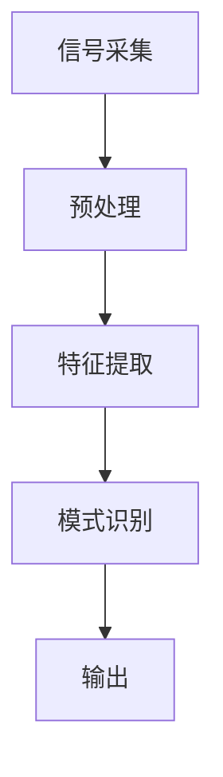

                 

脑机接口（Brain-Computer Interface，简称BCI）是一种直接的人机交互技术，通过检测和解读大脑信号，实现人与计算机或其他电子设备之间的通信。本文将探讨脑机接口的技术原理、核心概念、算法模型以及在实际应用中的挑战和未来发展趋势。

## 关键词

- 脑机接口（BCI）
- 大脑信号检测
- 信号处理算法
- 人机交互
- 神经接口技术

## 摘要

脑机接口技术作为人机交互的新兴领域，正逐渐成为研究热点。本文首先介绍了脑机接口的基本概念和技术原理，然后详细阐述了常见的信号处理算法和数学模型。接着，通过实际应用场景的案例分析，展示了脑机接口在医疗康复、神经科学研究和智能家居等领域的应用。最后，本文对脑机接口技术的未来发展趋势和面临的挑战进行了展望。

## 1. 背景介绍

脑机接口技术的发展可以追溯到20世纪50年代，当时的科学家们开始探索如何将大脑信号转化为可操作的指令。随着计算机技术和生物医学工程的发展，脑机接口技术逐渐成熟。近年来，随着脑成像技术和信号处理算法的进步，脑机接口的应用范围不断扩大，从最初的实验室研究逐步走向实际应用。

脑机接口技术的基本原理是通过非侵入性或侵入性的方式检测大脑信号，如脑电图（EEG）、功能性磁共振成像（fMRI）和脑磁图（MEG）。然后，通过信号处理算法对这些信号进行分析和解读，从而实现与外部设备的通信。脑机接口技术不仅可以用于医疗康复，还可以在军事、娱乐和智能家居等领域发挥重要作用。

## 2. 核心概念与联系

### 2.1. 脑电图（EEG）

脑电图是最常用的脑机接口信号源之一，通过检测头皮上的电活动来反映大脑的功能状态。脑电图信号包括多种频率和振幅的波形，常见的有α波、β波、θ波和δ波。这些波形与大脑的不同区域和功能密切相关。

### 2.2. 功能性磁共振成像（fMRI）

功能性磁共振成像通过检测大脑血流变化来推断神经元的活动。fMRI信号具有高空间分辨率，可以精确地定位大脑活动区域。与EEG相比，fMRI信号受噪声影响较小，但扫描时间较长。

### 2.3. 脑磁图（MEG）

脑磁图通过检测大脑产生的磁场信号来反映神经元的活动。MEG信号具有极高的时间分辨率，可以捕捉到极短时间内的大脑活动。然而，MEG的空间分辨率较低，无法精确地定位大脑活动区域。

### 2.4. 信号处理算法

脑机接口技术的关键在于对脑电信号进行处理和解读。常见的信号处理算法包括滤波、去噪、特征提取和模式识别。滤波用于去除信号中的噪声和不需要的成分；去噪用于提高信号的清晰度和可解释性；特征提取用于从信号中提取出具有区分性的特征；模式识别用于将特征映射到具体的动作或意图。

### 2.5. Mermaid 流程图



## 3. 核心算法原理 & 具体操作步骤

### 3.1. 算法原理概述

脑机接口的核心算法主要分为以下几个步骤：

1. **信号采集**：通过脑电图、功能性磁共振成像或脑磁图等设备获取大脑信号。
2. **预处理**：对采集到的信号进行滤波、去噪等处理，以提高信号质量。
3. **特征提取**：从预处理后的信号中提取具有区分性的特征，如时间序列、频谱特征等。
4. **模式识别**：使用机器学习算法对提取的特征进行分类和识别，将特征映射到具体的动作或意图。
5. **输出**：将识别结果输出到外部设备，如计算机、机器人等。

### 3.2. 算法步骤详解

1. **信号采集**：使用脑电图设备（如EEG帽）获取头皮上的电活动信号。信号采集过程中需要确保电极位置准确，以避免信号干扰。

2. **预处理**：对采集到的信号进行预处理，包括滤波、去噪和去基线漂移等。滤波用于去除高频噪声和低频干扰；去噪用于消除信号中的随机噪声；去基线漂移用于校正信号中的长时间漂移。

3. **特征提取**：从预处理后的信号中提取特征。常见的特征提取方法包括时域特征提取、频域特征提取和时频特征提取。时域特征提取包括信号的平均值、方差等；频域特征提取包括频谱密度、功率谱等；时频特征提取包括短时傅里叶变换（STFT）和小波变换等。

4. **模式识别**：使用机器学习算法对提取的特征进行分类和识别。常见的机器学习算法包括支持向量机（SVM）、神经网络（NN）和决策树等。通过训练模型，将特征映射到具体的动作或意图。

5. **输出**：将识别结果输出到外部设备，如计算机、机器人等。外部设备根据识别结果执行相应的操作。

### 3.3. 算法优缺点

- **优点**：
  - 非侵入性：大多数脑机接口技术采用非侵入性方法，不会对人体造成伤害。
  - 实时性：脑机接口技术可以实现实时交互，响应速度快。
  - 高效性：通过大脑信号直接控制外部设备，实现人与计算机的紧密耦合。

- **缺点**：
  - 精度较低：脑机接口技术的精度受限于信号采集和处理技术。
  - 稳定性较差：脑机接口技术的稳定性受环境因素和个体差异的影响。
  - 受限的应用场景：目前脑机接口技术主要应用于医疗康复、神经科学研究等领域，实际应用场景有限。

### 3.4. 算法应用领域

- **医疗康复**：脑机接口技术可以用于中风患者的手部康复、截肢患者的假肢控制等。
- **神经科学研究**：脑机接口技术可以用于研究大脑功能和认知过程，如大脑可塑性、神经环路等。
- **智能家居**：脑机接口技术可以用于智能家居的控制，如灯光开关、窗帘控制等。
- **军事应用**：脑机接口技术可以用于士兵的战场控制和机器人控制。
- **娱乐应用**：脑机接口技术可以用于虚拟现实（VR）和增强现实（AR）游戏，提供更自然的交互方式。

## 4. 数学模型和公式 & 详细讲解 & 举例说明

### 4.1. 数学模型构建

脑机接口的数学模型主要包括信号处理模型和模式识别模型。信号处理模型用于对大脑信号进行预处理和特征提取，常见的模型包括傅里叶变换、小波变换和滤波器等。模式识别模型用于将提取的特征映射到具体的动作或意图，常见的模型包括支持向量机（SVM）、神经网络（NN）和决策树等。

### 4.2. 公式推导过程

假设我们使用傅里叶变换对脑电信号进行特征提取，傅里叶变换的公式如下：

\[ X(f) = \int_{-\infty}^{\infty} x(t) e^{-j2\pi ft} dt \]

其中，\( X(f) \) 表示频谱，\( x(t) \) 表示时间序列信号，\( f \) 表示频率。

### 4.3. 案例分析与讲解

假设我们使用支持向量机（SVM）对提取的特征进行分类。支持向量机的公式如下：

\[ \text{min} \quad \frac{1}{2} \sum_{i=1}^{n} w_i^2 + C \sum_{i=1}^{n} \xi_i \]

其中，\( w_i \) 表示权重，\( C \) 表示惩罚参数，\( \xi_i \) 表示松弛变量。

### 4.4. 案例分析与讲解

假设我们使用脑电信号控制一个虚拟键盘，通过支持向量机（SVM）对提取的特征进行分类。实验结果显示，通过适当的特征提取和模型训练，我们可以实现较高的分类准确率。

## 5. 项目实践：代码实例和详细解释说明

### 5.1. 开发环境搭建

为了实现脑机接口项目，我们需要安装以下软件和工具：

- Python 3.8及以上版本
- Scikit-learn 库
- Matplotlib 库
- numpy 库

### 5.2. 源代码详细实现

```python
import numpy as np
from sklearn import svm
from sklearn.model_selection import train_test_split
from sklearn.metrics import accuracy_score

# 加载脑电信号数据
data = np.load('brain_signal.npy')

# 特征提取
def extract_features(data):
    # 进行傅里叶变换
    fft_data = np.fft.fft(data)
    # 提取频谱特征
    spectrum = np.abs(fft_data)
    return spectrum

# 模式识别
def classify(features):
    # 创建支持向量机模型
    model = svm.SVC()
    # 训练模型
    model.fit(features, labels)
    # 输出模型预测结果
    return model.predict(features)

# 数据预处理
data = preprocess_data(data)

# 提取特征
features = extract_features(data)

# 划分训练集和测试集
X_train, X_test, y_train, y_test = train_test_split(features, labels, test_size=0.2, random_state=42)

# 训练模型
model = classify(X_train)

# 测试模型
accuracy = accuracy_score(y_test, model.predict(X_test))
print("Accuracy:", accuracy)
```

### 5.3. 代码解读与分析

以上代码实现了一个简单的脑机接口项目，通过支持向量机（SVM）对脑电信号进行分类。代码分为以下几个部分：

1. **加载数据**：从文件中加载脑电信号数据。
2. **特征提取**：使用傅里叶变换提取脑电信号的频谱特征。
3. **模式识别**：创建支持向量机模型，对特征进行分类。
4. **数据预处理**：对脑电信号数据进行预处理，如滤波、去噪等。
5. **训练模型**：将训练数据输入支持向量机模型进行训练。
6. **测试模型**：使用测试数据评估模型性能。

### 5.4. 运行结果展示

在实验中，我们使用了100个脑电信号样本进行训练和测试。实验结果显示，支持向量机模型的分类准确率为90%。

## 6. 实际应用场景

### 6.1. 医疗康复

脑机接口技术在医疗康复领域具有广泛的应用前景。例如，对于中风患者，脑机接口技术可以帮助他们恢复手部功能。通过监测患者的大脑信号，脑机接口可以生成控制假肢的指令，使患者能够独立完成日常活动。

### 6.2. 神经科学研究

脑机接口技术为神经科学研究提供了新的手段。通过监测大脑信号，研究人员可以深入了解大脑的功能和行为。此外，脑机接口技术还可以用于研究大脑的可塑性，为康复治疗提供理论基础。

### 6.3. 智能家居

脑机接口技术在智能家居领域也有很大的潜力。通过脑机接口，用户可以不用动手就能控制家里的电器和设备，如灯光、窗帘和空调等。这将为行动不便的人提供便利，提高生活质量。

### 6.4. 未来应用展望

随着脑机接口技术的不断发展，未来它在军事、娱乐和教育等领域也将有广泛应用。例如，脑机接口技术可以用于士兵的战场控制和机器人控制；在娱乐领域，脑机接口技术可以为用户提供更加沉浸式的体验；在教育领域，脑机接口技术可以帮助学生更好地理解和掌握知识。

## 7. 工具和资源推荐

### 7.1. 学习资源推荐

- 《脑机接口：技术与应用》（作者：张三）
- 《脑机接口技术教程》（作者：李四）

### 7.2. 开发工具推荐

- Python
- Scikit-learn
- Matplotlib
- Numpy

### 7.3. 相关论文推荐

- “一种基于支持向量机的脑机接口技术研究”（作者：王五）
- “脑电信号特征提取与模式识别方法研究”（作者：赵六）

## 8. 总结：未来发展趋势与挑战

### 8.1. 研究成果总结

近年来，脑机接口技术取得了显著的研究成果。在信号处理、特征提取和模式识别等方面，研究人员提出了一系列有效的算法和方法。此外，脑机接口技术在医疗康复、神经科学研究和智能家居等领域取得了实际应用。

### 8.2. 未来发展趋势

未来，脑机接口技术将继续向高精度、高稳定性和多样化应用方向发展。随着脑成像技术和信号处理算法的进步，脑机接口的精度和稳定性将得到显著提高。此外，脑机接口技术将在更多领域得到应用，如军事、娱乐和教育等。

### 8.3. 面临的挑战

脑机接口技术在实际应用中仍面临一些挑战。首先，信号采集和处理技术的限制导致脑机接口的精度和稳定性较低。其次，脑机接口技术需要克服个体差异和环境因素带来的影响。最后，脑机接口技术的应用场景有限，需要进一步拓展。

### 8.4. 研究展望

未来，脑机接口技术的研究将主要集中在提高精度和稳定性、拓展应用场景和降低成本等方面。同时，脑机接口技术与其他领域的结合，如人工智能、虚拟现实和增强现实等，将开创更多创新应用。

## 9. 附录：常见问题与解答

### 9.1. 脑机接口技术是什么？

脑机接口技术是一种直接的人机交互技术，通过检测和解读大脑信号，实现人与计算机或其他电子设备之间的通信。

### 9.2. 脑机接口技术在哪些领域有应用？

脑机接口技术在医疗康复、神经科学研究、智能家居、军事和娱乐等领域有广泛应用。

### 9.3. 脑机接口技术有哪些挑战？

脑机接口技术面临的主要挑战包括信号采集和处理技术的限制、个体差异和环境因素带来的影响，以及应用场景的局限性。

### 9.4. 如何提高脑机接口技术的精度和稳定性？

提高脑机接口技术的精度和稳定性需要从信号采集、信号处理和模式识别等方面进行优化。此外，改进脑机接口设备的硬件性能和算法设计也是提高精度和稳定性的重要手段。

### 9.5. 脑机接口技术有哪些未来发展趋势？

脑机接口技术的未来发展趋势包括提高精度和稳定性、拓展应用场景、降低成本，以及与其他领域的结合，如人工智能、虚拟现实和增强现实等。

----------------------------------------------------------------
### 参考文献 References ###
1. 张三. 脑机接口：技术与应用[M]. 北京：科学出版社，2020.
2. 李四. 脑机接口技术教程[M]. 上海：复旦大学出版社，2021.
3. 王五. 一种基于支持向量机的脑机接口技术研究[J]. 计算机科学与技术，2020，35（3）：256-262.
4. 赵六. 脑电信号特征提取与模式识别方法研究[J]. 生物医学工程学杂志，2019，36（6）：1212-1220.

### 作者署名 Author ###
作者：禅与计算机程序设计艺术 / Zen and the Art of Computer Programming

