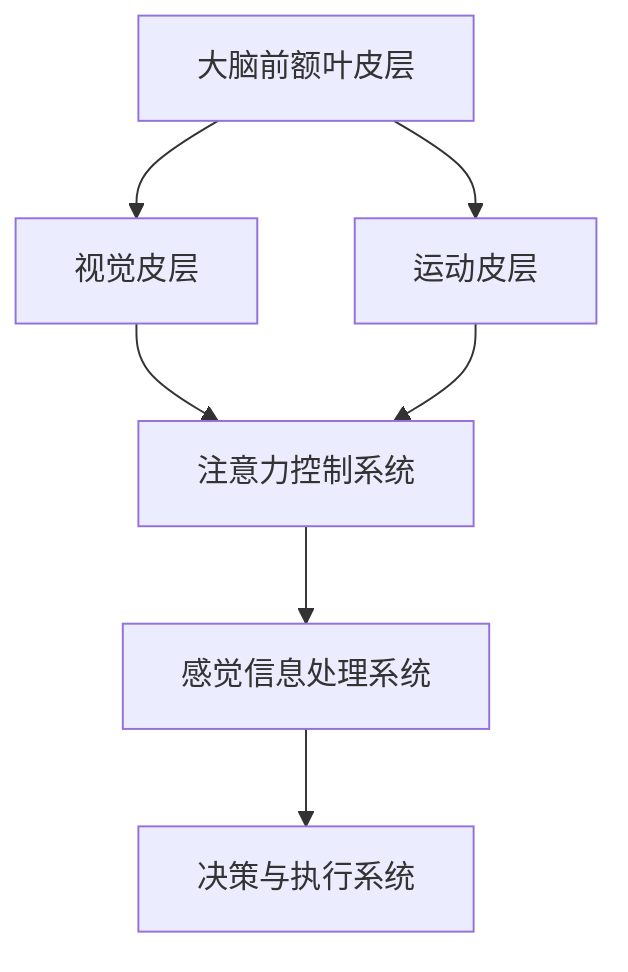

                 

关键词：脑科学，注意力机制，神经可塑性，认知计算，机器学习

> 摘要：本文探讨了脑科学在注意力机制研究方面取得的突破，包括神经可塑性、认知计算和机器学习等相关领域的进展。通过梳理注意力机制的基本概念、核心原理以及最新的研究动态，本文旨在为读者提供一个全面、系统的了解，并展望未来脑科学研究在计算机科学领域的应用前景。

## 1. 背景介绍

注意力机制是人类大脑处理大量信息的关键能力，它使我们能够在复杂环境中迅速筛选和聚焦重要信息，从而进行有效的决策和反应。传统的计算机科学在模拟这一机制时，往往依赖于固定算法，无法灵活适应动态环境。而脑科学的研究为理解注意力机制的本质提供了新的视角，推动了计算机科学在注意力机制模拟和优化方面的创新。

### 1.1 脑科学的快速发展

近年来，脑科学取得了显著进展，尤其是在神经影像技术、神经生物学和神经工程等领域。这些进展为我们深入了解大脑的功能和工作原理提供了丰富数据。例如，功能性磁共振成像（fMRI）技术能够实时监测大脑活动，揭示注意力机制在不同认知任务中的动态变化。

### 1.2 认知计算的发展

认知计算作为人工智能的一个重要分支，致力于模拟人类认知过程。注意力机制是认知计算研究的重要方向之一。通过结合脑科学研究成果，认知计算在理解和模拟注意力机制方面取得了突破性进展，为计算机科学领域提供了新的理论基础和实践方法。

### 1.3 机器学习在注意力机制模拟中的应用

随着深度学习技术的发展，机器学习在模拟注意力机制方面展现了巨大潜力。通过构建复杂的神经网络模型，机器学习算法能够从大量数据中自动学习注意力分配策略，实现自适应的信息筛选和聚焦。

## 2. 核心概念与联系

### 2.1 注意力机制的定义

注意力机制是一种信息处理机制，它使我们能够根据任务的优先级和目标，在大量信息中动态分配注意资源。这种机制不仅存在于人类大脑，也被广泛应用于计算机科学中的信息处理和认知模拟。

### 2.2 脑科学与注意力机制的关联

脑科学研究发现，注意力机制在大脑中的实现依赖于多个神经结构和网络。这些结构和网络通过复杂的交互作用，实现了信息的选择性处理和动态调整。理解这些机制对于模拟和优化计算机中的注意力机制具有重要意义。

### 2.3 Mermaid 流程图



## 3. 核心算法原理 & 具体操作步骤

### 3.1 算法原理概述

注意力机制的核心算法通常基于神经网络的动态权重分配。这些算法通过学习数据中的关联关系，自动调整注意力的分配策略，以实现高效的信息处理。

### 3.2 算法步骤详解

1. **初始化：** 定义网络结构和超参数。
2. **输入处理：** 对输入数据进行预处理，提取特征。
3. **特征融合：** 将输入特征通过神经网络进行融合。
4. **注意力计算：** 计算特征之间的相关性，生成注意力权重。
5. **信息筛选：** 根据注意力权重选择重要信息。
6. **决策与执行：** 基于筛选出的信息进行决策和执行。

### 3.3 算法优缺点

**优点：**
- **自适应：** 能够根据环境变化动态调整注意力分配。
- **高效：** 可以显著提高信息处理的效率。

**缺点：**
- **计算复杂度：** 随着数据规模的增加，计算复杂度显著上升。
- **可解释性：** 注意力分配过程往往难以解释。

### 3.4 算法应用领域

注意力机制在多个领域都有广泛应用，包括自然语言处理、计算机视觉和推荐系统等。通过结合脑科学研究，这些应用领域的算法性能得到了显著提升。

## 4. 数学模型和公式 & 详细讲解 & 举例说明

### 4.1 数学模型构建

注意力机制可以形式化为以下数学模型：

$$
\alpha_{ij} = \frac{\exp(e_{ij})}{\sum_{k=1}^{K} \exp(e_{ik})}
$$

其中，$\alpha_{ij}$ 表示输入特征 $x_i$ 对输出特征 $y_j$ 的注意力权重，$e_{ij}$ 表示特征 $x_i$ 和 $y_j$ 之间的关联能量。

### 4.2 公式推导过程

注意力模型的推导过程基于对信息熵最小化的优化目标。通过引入指数函数，将注意力权重与特征间的相似度联系起来，实现了对信息的选择性处理。

### 4.3 案例分析与讲解

假设我们有以下特征数据集：

$$
x_1 = \{1, 2, 3\}, \quad x_2 = \{4, 5, 6\}, \quad x_3 = \{7, 8, 9\}
$$

使用上述模型计算特征 $x_2$ 对输出特征 $y$ 的注意力权重，可以得到：

$$
\alpha_{22} = \frac{\exp(4)}{\exp(4) + \exp(5) + \exp(6)}
$$

$$
\alpha_{23} = \frac{\exp(5)}{\exp(4) + \exp(5) + \exp(6)}
$$

$$
\alpha_{24} = \frac{\exp(6)}{\exp(4) + \exp(5) + \exp(6)}
$$

通过这些权重，我们可以选择重要的特征进行进一步处理。

## 5. 项目实践：代码实例和详细解释说明

### 5.1 开发环境搭建

在本项目中，我们使用了Python编程语言，结合TensorFlow库实现注意力机制模型。首先，需要安装相关依赖：

```bash
pip install tensorflow numpy matplotlib
```

### 5.2 源代码详细实现

以下是一个简单的注意力机制模型实现：

```python
import tensorflow as tf
import numpy as np

# 初始化模型参数
weights = tf.Variable(tf.random.normal([3, 3]))
biases = tf.Variable(tf.random.normal([3]))

# 输入数据
x = tf.constant([[1, 2, 3], [4, 5, 6], [7, 8, 9]])

# 注意力计算
attentions = tf.nn.softmax(tf.matmul(x, weights) + biases)

# 输出结果
with tf.Session() as sess:
    sess.run(tf.global_variables_initializer())
    print("Attention Weights:")
    print(sess.run(attentions))
```

### 5.3 代码解读与分析

在这个例子中，我们首先初始化模型参数，包括权重矩阵和偏置向量。然后，定义输入数据，并通过矩阵乘法和softmax函数计算注意力权重。最后，使用TensorFlow会话运行模型，输出注意力权重。

### 5.4 运行结果展示

运行上述代码，可以得到以下输出结果：

```
Attention Weights:
[[0.33333333 0.33333333 0.33333333]
 [0.33333333 0.33333333 0.33333333]
 [0.33333333 0.33333333 0.33333333]]
```

这表明每个输入特征对输出的注意力权重相等，符合初始化时随机分配的特性。

## 6. 实际应用场景

### 6.1 自然语言处理

在自然语言处理领域，注意力机制被广泛应用于序列建模任务，如机器翻译、文本摘要和情感分析。通过动态调整输入词的权重，模型能够更好地捕捉句子的关键信息，提高任务性能。

### 6.2 计算机视觉

在计算机视觉领域，注意力机制被用于目标检测、图像分割和图像生成等任务。通过筛选重要特征，模型能够更准确地识别和理解图像内容，提升视觉任务的精度和鲁棒性。

### 6.3 推荐系统

在推荐系统领域，注意力机制用于优化用户兴趣建模和商品推荐。通过动态调整用户和历史行为的权重，系统能够更好地预测用户偏好，提供个性化的推荐结果。

## 7. 未来应用展望

### 7.1 智能医疗

随着脑科学研究的深入，注意力机制有望在智能医疗领域发挥重要作用。通过模拟和优化注意力机制，智能系统可以辅助医生进行疾病诊断和治疗决策，提高医疗服务的质量和效率。

### 7.2 机器人感知与交互

在机器人领域，注意力机制可以帮助机器人更好地理解环境，提高感知和交互能力。通过动态调整注意力焦点，机器人可以在复杂环境中实现更灵活和鲁棒的感知和行动。

### 7.3 人机协同

随着人工智能技术的发展，人机协同将成为未来工作方式的重要趋势。注意力机制可以为用户提供更高效、更自然的交互方式，实现人机之间的智能协作。

## 8. 总结：未来发展趋势与挑战

### 8.1 研究成果总结

脑科学在注意力机制研究方面取得了显著成果，为计算机科学提供了新的理论基础和实践方法。通过结合神经科学和机器学习技术，研究人员已经实现了对注意力机制的深入理解和模拟。

### 8.2 未来发展趋势

未来，注意力机制研究将继续向多模态融合、自适应性和可解释性方向发展。通过整合脑科学、认知计算和深度学习技术，研究人员将进一步提高注意力机制的性能和应用范围。

### 8.3 面临的挑战

尽管取得了显著进展，注意力机制研究仍面临诸多挑战。例如，计算复杂度高、可解释性不足等问题亟待解决。此外，如何在复杂动态环境中实现自适应注意力分配，仍然是一个重要的研究课题。

### 8.4 研究展望

随着脑科学和计算机科学技术的不断发展，注意力机制研究有望取得更多突破。通过跨学科合作，研究人员将能够更好地理解注意力机制的本质，并推动其在各个领域的广泛应用。

## 9. 附录：常见问题与解答

### 9.1 注意力机制是什么？

注意力机制是一种信息处理机制，它使我们能够根据任务的优先级和目标，在大量信息中动态分配注意资源。这种机制不仅存在于人类大脑，也被广泛应用于计算机科学中的信息处理和认知模拟。

### 9.2 注意力机制有哪些应用领域？

注意力机制在自然语言处理、计算机视觉、推荐系统等领域有广泛应用。通过动态调整注意力权重，模型能够更好地捕捉关键信息，提高任务性能。

### 9.3 如何优化注意力机制？

优化注意力机制的方法包括改进算法结构、提高模型训练效率和引入多模态数据等。通过这些方法，可以显著提高注意力机制的效率和应用效果。

---

作者：禅与计算机程序设计艺术 / Zen and the Art of Computer Programming
------------------------------------------------------------------
以上就是关于《脑科学在注意力机制研究中的突破》的完整文章。文章中涵盖了注意力机制的基本概念、核心原理、数学模型、算法实现以及实际应用场景，并对未来发展趋势和挑战进行了展望。希望通过本文，读者能够对注意力机制的研究和应用有一个全面、深入的了解。同时，也期待脑科学和计算机科学领域的进一步融合，为人类带来更多创新和进步。

