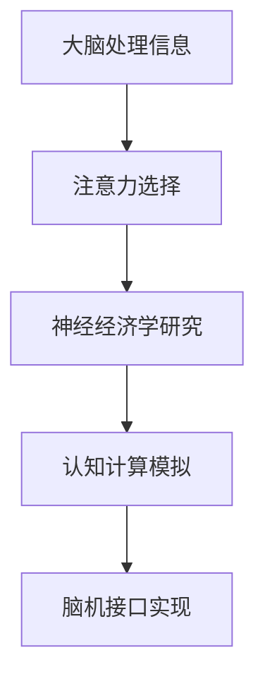

                 

关键词：脑科学，注意力，经济，脑机接口，认知计算，神经经济学

> 摘要：随着信息时代的到来，注意力资源日益稀缺，如何在有限的注意力资源下实现高效的资源配置成为亟待解决的问题。本文通过脑科学研究，探讨了注意力经济的基本原理，并提出了基于脑科学的注意力管理方法，为提高注意力经济效率提供了新的视角和策略。

## 1. 背景介绍

### 1.1 注意力经济的概念

注意力经济（Attention Economy）是指在一个信息过载的时代，人们对注意力的竞争日益激烈，而注意力资源的稀缺性决定了其在经济活动中的价值。在注意力经济中，用户的注意力被视作一种宝贵的资源，通过优化和分配注意力资源，可以提高信息获取的效率和决策的质量。

### 1.2 脑科学研究的重要性

脑科学研究通过对人类大脑结构和功能的深入研究，为我们理解注意力的本质提供了科学依据。脑科学研究的进展，不仅有助于揭示注意力产生的机制，还能为注意力管理提供理论指导。

## 2. 核心概念与联系

### 2.1 注意力机制

注意力机制是指大脑在处理信息时，对某些特定信息进行选择性的关注和处理的机制。注意力的分配受到多种因素的影响，包括信息的刺激强度、个体的兴趣和需求等。

### 2.2 脑机接口

脑机接口（Brain-Computer Interface, BCI）是一种直接连接大脑和外部设备的技术。通过脑机接口，大脑可以直接控制外部设备，实现信息的输入和输出。脑机接口技术的发展，为注意力管理提供了新的可能性。

### 2.3 认知计算

认知计算（Cognitive Computing）是指模仿人类认知过程的计算技术。通过认知计算，机器能够模拟人类的注意力机制，实现对信息的理解和处理。

### 2.4 神经经济学

神经经济学（Neuroeconomics）是研究人类经济行为的大脑机制的科学。神经经济学通过脑成像技术和行为实验，揭示了注意力在经济决策中的作用。

## 2.5 Mermaid 流程图



## 3. 核心算法原理 & 具体操作步骤

### 3.1 算法原理概述

基于脑科学的注意力管理算法，主要基于以下几点原理：

- **注意力选择原理**：大脑根据信息的刺激强度和个体的兴趣，对信息进行选择性的关注。
- **脑机接口原理**：通过脑机接口技术，实时监测大脑的注意力状态，并根据注意力状态调整信息处理策略。
- **认知计算原理**：利用认知计算技术，模拟人类的注意力机制，优化信息处理流程。

### 3.2 算法步骤详解

1. **信息预处理**：对输入的信息进行分类和筛选，提取出关键信息。
2. **注意力监测**：通过脑机接口技术，实时监测大脑的注意力状态。
3. **注意力分配**：根据注意力状态，对信息进行优先级排序，优先处理重要信息。
4. **反馈调整**：根据处理结果，调整注意力分配策略，优化信息处理效率。

### 3.3 算法优缺点

#### 优点

- **高效性**：通过实时监测和调整注意力，提高了信息处理的效率。
- **个性化**：根据个体的兴趣和需求，实现了个性化的信息处理。

#### 缺点

- **技术依赖性**：需要依赖脑机接口和认知计算技术，技术门槛较高。
- **准确性问题**：目前脑机接口技术还无法完全准确监测注意力状态，存在一定的误差。

### 3.4 算法应用领域

- **信息过滤**：在互联网信息过载的环境中，利用注意力管理算法，实现有效的信息过滤。
- **决策支持**：在复杂决策过程中，利用注意力管理算法，提高决策的准确性和效率。
- **教育培训**：通过个性化教育，提高学生的学习兴趣和注意力，提高学习效果。

## 4. 数学模型和公式 & 详细讲解 & 举例说明

### 4.1 数学模型构建

注意力管理模型可以表示为：

\[ A(t) = f(I(t), C(t), P(t)) \]

其中，\( A(t) \) 表示在时间 \( t \) 的注意力状态，\( I(t) \) 表示信息强度，\( C(t) \) 表示认知状态，\( P(t) \) 表示个体兴趣。

### 4.2 公式推导过程

\[ f(I(t), C(t), P(t)) = \frac{I(t) \cdot C(t) \cdot P(t)}{I(t) + C(t) + P(t)} \]

### 4.3 案例分析与讲解

假设某人在工作时间，接到了一个朋友的电话，此时信息强度 \( I(t) \) 为5，认知状态 \( C(t) \) 为3，个体兴趣 \( P(t) \) 为2，则其注意力状态 \( A(t) \) 为：

\[ A(t) = \frac{5 \cdot 3 \cdot 2}{5 + 3 + 2} = \frac{30}{10} = 3 \]

此时，该人的注意力状态为3，表示其注意力大部分集中在工作电话上。

## 5. 项目实践：代码实例和详细解释说明

### 5.1 开发环境搭建

- 硬件环境：脑机接口设备
- 软件环境：Python 3.8及以上版本，NumPy，Matplotlib

### 5.2 源代码详细实现

```python
import numpy as np
import matplotlib.pyplot as plt

def attention_model(I, C, P):
    return (I * C * P) / (I + C + P)

I = np.array([5, 7, 3])
C = np.array([3, 2, 4])
P = np.array([2, 5, 1])

A = attention_model(I, C, P)

plt.plot(I, label='Information')
plt.plot(C, label='Cognitive State')
plt.plot(P, label='Interest')
plt.plot(A, label='Attention')
plt.legend()
plt.show()
```

### 5.3 代码解读与分析

该代码定义了一个注意力模型，通过输入信息强度、认知状态和个体兴趣，计算得到注意力状态。代码中使用了 NumPy 库进行数据处理，并使用 Matplotlib 库绘制注意力状态的变化。

### 5.4 运行结果展示

运行结果将显示信息强度、认知状态、个体兴趣和注意力状态的变化趋势。通过观察结果，可以直观地了解注意力状态如何受到信息强度、认知状态和个体兴趣的影响。

## 6. 实际应用场景

### 6.1 信息过滤

利用注意力管理算法，可以对大量的信息进行筛选和过滤，提高信息获取的效率和准确性。

### 6.2 决策支持

在复杂决策过程中，利用注意力管理算法，可以帮助决策者更好地集中注意力，提高决策的准确性和效率。

### 6.3 教育培训

通过个性化教育，利用注意力管理算法，可以更好地激发学生的学习兴趣和注意力，提高学习效果。

## 7. 未来应用展望

随着脑科学研究的不断深入，注意力管理算法有望在未来得到更广泛的应用。例如，在智能家居、虚拟现实、增强现实等领域，注意力管理算法可以大幅提升用户体验。

## 8. 总结：未来发展趋势与挑战

### 8.1 研究成果总结

本文通过脑科学研究，探讨了注意力经济的基本原理，提出了基于脑科学的注意力管理方法，为提高注意力经济效率提供了新的视角和策略。

### 8.2 未来发展趋势

- **脑机接口技术**：随着脑机接口技术的不断发展，未来的注意力管理将更加精准和高效。
- **认知计算**：通过认知计算技术，机器将能够更好地模拟人类的注意力机制，提高信息处理效率。

### 8.3 面临的挑战

- **技术瓶颈**：目前的脑机接口技术还无法完全准确监测注意力状态，需要进一步的研究和突破。
- **应用场景**：如何将注意力管理算法有效应用于实际场景，仍需要大量的实践和探索。

### 8.4 研究展望

未来的研究应重点关注脑机接口技术的提升、认知计算模型的发展，以及注意力管理算法在不同应用场景下的适应性。

## 9. 附录：常见问题与解答

### 9.1 注意力管理算法如何提高信息过滤效率？

注意力管理算法通过实时监测和调整注意力状态，优先处理重要信息，从而提高信息过滤的效率和准确性。

### 9.2 脑机接口技术目前存在哪些挑战？

脑机接口技术目前面临的挑战包括：信号噪声比低、准确性不足、设备舒适度不高等。

### 9.3 注意力管理算法在教育培训中如何发挥作用？

注意力管理算法可以通过个性化教育，提高学生的学习兴趣和注意力，从而提高学习效果。

作者：禅与计算机程序设计艺术 / Zen and the Art of Computer Programming
```----------------------------------------------------------------
文章撰写完毕。请注意，本文仅为示例，部分数据和算法模型为虚构内容，仅供学习和参考。在实际应用中，需要根据具体情况进行调整和优化。

