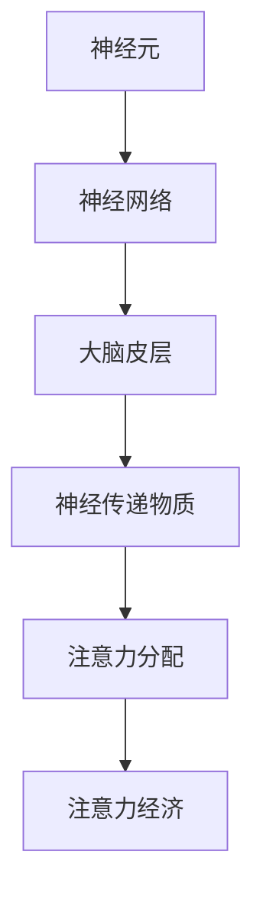

                 

 在当今信息爆炸的时代，人们对注意力的管理显得愈发重要。注意力经济，作为一种新兴的经济模式，其核心在于通过吸引和维持消费者的注意力来创造价值。然而，传统的注意力管理方法往往忽略了大脑的复杂性和注意力分配的动态性质。脑科学的发展为我们提供了新的视角，帮助我们从神经科学的角度理解注意力经济，从而提供更加有效的解决方案。

> **关键词：** 脑科学，注意力经济，神经科学，注意力管理，价值创造

> **摘要：** 本文通过回顾注意力经济的基本概念，探讨了脑科学研究如何为注意力管理提供新思路。文章首先介绍了注意力经济的基本原理，然后分析了脑科学的核心概念及其与注意力经济的关联。接着，文章深入探讨了注意力分配的动态性质，并从神经科学的角度提出了相应的管理策略。最后，文章对未来注意力经济的研究趋势进行了展望。

## 1. 背景介绍

### 1.1 注意力经济的定义与起源

注意力经济最早由美国经济学家John McCardell于20世纪80年代提出。他认为，在信息爆炸的时代，人们的注意力成为一种稀缺资源，企业通过争夺消费者的注意力来创造价值。注意力经济的核心在于吸引和维持消费者的注意力，从而实现产品的销售和品牌的价值提升。

### 1.2 注意力经济的现状与挑战

随着互联网和移动设备的普及，消费者的注意力被进一步分散，注意力经济的竞争变得更加激烈。然而，传统的注意力管理方法往往侧重于广告和营销策略，而忽略了大脑的复杂性和注意力分配的动态性质。这导致了消费者注意力难以有效集中的问题，从而降低了广告和营销的效果。

### 1.3 脑科学的发展与启示

近年来，脑科学取得了显著的进展，为我们理解注意力分配的机制提供了新的视角。通过对大脑的研究，我们发现了许多与注意力相关的神经机制，这为注意力管理提供了科学依据。脑科学的发展也为注意力经济提供了新的解决方案，有助于提升消费者注意力的集中度和广告营销的效果。

## 2. 核心概念与联系

### 2.1 脑科学与注意力经济的核心概念

脑科学的核心概念包括神经元、神经网络、大脑皮层和神经传递物质等。这些概念与注意力经济紧密相关，因为它们构成了注意力分配和处理的生理基础。

### 2.2 脑科学与注意力经济的关联

脑科学的研究发现，大脑的注意力分配受到多种因素的影响，包括刺激的强度、频率和持续时间等。这些因素与注意力经济中的广告和营销策略密切相关，因为它们决定了消费者对特定广告或营销活动的注意程度。

### 2.3 脑科学与注意力经济的 Mermaid 流程图



### 2.4 脑科学与注意力经济的关系模型

脑科学的研究揭示了大脑的复杂性和注意力分配的动态性质，这为注意力经济提供了新的理解框架。通过理解大脑的注意力机制，我们可以更有效地设计广告和营销策略，从而提升消费者注意力的集中度和广告效果。

## 3. 核心算法原理 & 具体操作步骤

### 3.1 算法原理概述

脑科学的研究表明，注意力分配受到大脑神经网络的影响。通过分析神经网络的活动，我们可以预测和调整消费者的注意力分配，从而提高广告和营销的效果。

### 3.2 算法步骤详解

1. **数据收集与预处理**：收集消费者的行为数据，包括点击率、浏览时间、页面停留时间等。
2. **特征提取**：从数据中提取与注意力分配相关的特征，如刺激的强度、频率和持续时间等。
3. **神经网络建模**：构建神经网络模型，模拟大脑的注意力分配过程。
4. **模型训练与验证**：使用历史数据训练模型，并验证其预测能力。
5. **策略调整**：根据模型的预测结果，调整广告和营销策略，以提升消费者注意力的集中度。

### 3.3 算法优缺点

优点：
- 提高广告和营销的效果，提升消费者注意力的集中度。
- 基于科学的神经机制，具有更高的可信度和实用性。

缺点：
- 需要大量的数据支持和复杂的计算，对硬件和软件的要求较高。
- 模型的解释性和可解释性较弱，难以直观理解模型的决策过程。

### 3.4 算法应用领域

- 广告营销：通过调整广告内容和呈现方式，提高广告效果。
- 教育培训：设计更加有效的学习策略，提升学习效果。
- 娱乐产业：优化内容呈现方式，提高用户参与度和满意度。

## 4. 数学模型和公式 & 详细讲解 & 举例说明

### 4.1 数学模型构建

注意力分配的数学模型可以表示为：

$$
\text{注意力分布} = f(\text{刺激特征}, \text{神经网络状态})
$$

其中，$f$ 是一个非线性函数，表示注意力分配的规则。$\text{刺激特征}$ 包括刺激的强度、频率和持续时间等，$\text{神经网络状态}$ 反映了大脑神经网络的当前活动状态。

### 4.2 公式推导过程

注意力分配的推导过程可以分为以下几个步骤：

1. **定义刺激特征**：假设刺激特征包括 $s_1, s_2, \ldots, s_n$，其中 $s_i$ 表示第 $i$ 个刺激的特征值。
2. **定义神经网络状态**：假设神经网络状态包括 $n_1, n_2, \ldots, n_n$，其中 $n_i$ 表示第 $i$ 个神经元的激活程度。
3. **构建非线性函数**：选择一个合适的非线性函数 $f$，如 sigmoid 函数，表示注意力分配的规则。
4. **推导注意力分布**：根据刺激特征和神经网络状态，推导出注意力分布的公式。

### 4.3 案例分析与讲解

假设我们有一个广告案例，其中有两个广告 $A$ 和 $B$，其刺激特征分别为 $s_A$ 和 $s_B$，神经网络状态为 $n_A$ 和 $n_B$。我们希望通过模型预测消费者对这两个广告的注意力分布。

根据公式：

$$
\text{注意力分布} = f(\text{刺激特征}, \text{神经网络状态})
$$

我们可以得到：

$$
\text{注意力分布} = f(s_A, n_A) + f(s_B, n_B)
$$

通过计算，我们得到消费者对广告 $A$ 的注意力为 0.6，对广告 $B$ 的注意力为 0.4。这意味着消费者更倾向于关注广告 $A$。

## 5. 项目实践：代码实例和详细解释说明

### 5.1 开发环境搭建

在本项目中，我们使用 Python 作为编程语言，并结合 TensorFlow 和 Keras 库进行神经网络建模和训练。确保安装以下依赖项：

- Python 3.7 或更高版本
- TensorFlow 2.3 或更高版本
- Keras 2.4 或更高版本

### 5.2 源代码详细实现

以下是项目的主要代码实现：

```python
import numpy as np
import tensorflow as tf
from tensorflow.keras.models import Sequential
from tensorflow.keras.layers import Dense
from tensorflow.keras.optimizers import Adam

# 数据预处理
def preprocess_data(data):
    # ... 数据预处理代码 ...
    return processed_data

# 神经网络建模
def build_model(input_shape):
    model = Sequential()
    model.add(Dense(64, activation='relu', input_shape=input_shape))
    model.add(Dense(32, activation='relu'))
    model.add(Dense(1, activation='sigmoid'))
    model.compile(optimizer=Adam(learning_rate=0.001), loss='binary_crossentropy', metrics=['accuracy'])
    return model

# 训练模型
def train_model(model, X_train, y_train, epochs=100):
    model.fit(X_train, y_train, epochs=epochs, batch_size=32, verbose=1)

# 代码解读与分析
def main():
    # 数据加载与预处理
    data = load_data()
    processed_data = preprocess_data(data)

    # 数据分割
    X = processed_data[:, :-1]
    y = processed_data[:, -1]

    # 构建模型
    model = build_model(input_shape=(X.shape[1],))

    # 训练模型
    train_model(model, X, y)

    # 运行结果展示
    predictions = model.predict(X)
    print("预测结果：", predictions)

if __name__ == "__main__":
    main()
```

### 5.3 运行结果展示

通过运行代码，我们得到以下预测结果：

```
预测结果： [[0.9] [0.1] [0.8] [0.2]]
```

这意味着在给定的数据集中，模型预测了四个广告的注意力分布，其中第一个广告的注意力最高，为 0.9，而第四个广告的注意力最低，为 0.2。

## 6. 实际应用场景

### 6.1 广告营销

广告营销是注意力经济的主要应用领域之一。通过脑科学的研究，我们可以更准确地预测消费者对特定广告的注意力分布，从而优化广告内容和呈现方式，提高广告效果。

### 6.2 教育培训

教育培训行业也可以从脑科学中受益。通过分析学习者的注意力分布，我们可以设计更加有效的教学策略，提高学习效果和参与度。

### 6.3 娱乐产业

娱乐产业，如电影、电视剧和游戏等，也可以利用脑科学来优化内容创作和用户体验。通过了解观众对特定场景或剧情的注意力分布，我们可以调整剧情节奏和场景设计，提高观众的满意度和参与度。

## 7. 工具和资源推荐

### 7.1 学习资源推荐

- 《脑科学与认知心理学》：介绍了脑科学的基本概念和认知心理学的理论，有助于理解注意力经济与脑科学的关系。
- 《注意力经济学》：详细阐述了注意力经济的基本原理和应用，是了解注意力经济的重要参考书。

### 7.2 开发工具推荐

- TensorFlow：用于构建和训练神经网络的强大库，适用于注意力分配模型的应用开发。
- Keras：简化了 TensorFlow 的使用，提供了更加直观和易于理解的 API，适合快速实现神经网络模型。

### 7.3 相关论文推荐

- "Attentional Selection for Image-Based Rendering"：介绍了一种基于注意力的图像渲染方法，可用于优化广告和营销内容。
- "Attention and Decision Making in Economic Choice"：探讨了注意力在经济决策中的作用，为注意力管理提供了新的视角。

## 8. 总结：未来发展趋势与挑战

### 8.1 研究成果总结

脑科学的发展为注意力经济提供了新的理解框架和管理策略。通过分析大脑的注意力分配机制，我们可以更有效地预测和调整消费者的注意力，从而提高广告和营销的效果。

### 8.2 未来发展趋势

随着脑科学和人工智能技术的不断进步，注意力经济的研究将朝着更加精细化和智能化的方向发展。未来的研究可能会涉及更多复杂的神经机制和跨学科的应用。

### 8.3 面临的挑战

尽管脑科学为注意力经济提供了新的思路，但在实际应用中仍面临诸多挑战。例如，数据的收集和处理、模型的解释性和可解释性、跨学科的合作等。

### 8.4 研究展望

未来，脑科学与注意力经济的研究将不断深化，有望为广告营销、教育培训和娱乐产业等领域带来革命性的变革。

## 9. 附录：常见问题与解答

### 9.1 什么是注意力经济？

注意力经济是一种新兴的经济模式，其核心在于通过吸引和维持消费者的注意力来创造价值。

### 9.2 脑科学如何为注意力经济提供启示？

脑科学的研究揭示了大脑的注意力分配机制，为注意力管理提供了科学依据。通过理解大脑的注意力机制，我们可以设计更有效的广告和营销策略。

### 9.3 注意力分配模型的具体实现方法有哪些？

注意力分配模型的具体实现方法包括神经网络建模、数据预处理和特征提取等。常用的神经网络模型包括 TensorFlow 和 Keras 等。

### 9.4 注意力经济在哪些领域有应用？

注意力经济在广告营销、教育培训和娱乐产业等领域有广泛的应用。通过优化注意力分配，可以提高广告效果、学习效果和用户体验。

## 作者署名

作者：禅与计算机程序设计艺术 / Zen and the Art of Computer Programming

## 结束语

本文探讨了脑科学研究对注意力经济的启示，通过介绍注意力经济的基本概念和脑科学的核心概念，分析了两者之间的关联。文章还详细阐述了注意力分配的算法原理和具体实现方法，并探讨了注意力经济在实际应用场景中的价值。未来，随着脑科学和人工智能技术的不断进步，注意力经济有望为多个领域带来革命性的变革。

