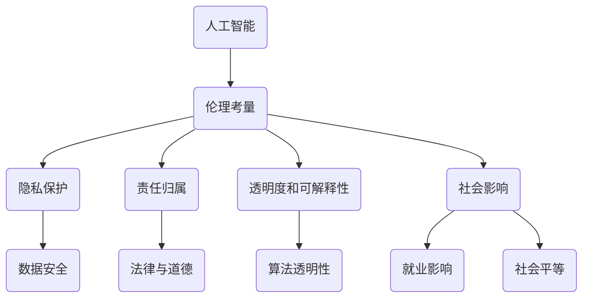
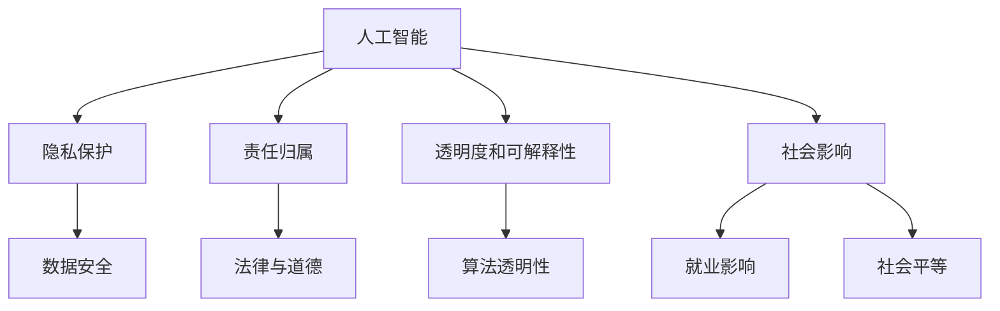

                 

 在当今技术迅猛发展的时代，自动化已经成为各行各业的趋势。特别是在创业领域，人工智能（AI）的应用极大地提升了效率和创新能力。然而，随着人工智能在自动化创业中的深入应用，伦理考量也日益凸显。本文将围绕这一主题展开讨论，深入探讨人工智能伦理考量在自动化创业中的重要性、核心问题以及未来发展趋势。

> 关键词：人工智能，自动化创业，伦理考量，道德框架，风险评估

> 摘要：本文通过分析自动化创业中的人工智能应用现状，探讨了人工智能伦理考量在其中的重要性。文章首先介绍了人工智能伦理的核心概念和原则，然后详细分析了在自动化创业过程中可能面临的伦理问题，包括隐私、透明度和责任分配等。最后，文章提出了未来自动化创业中人工智能伦理考量的发展趋势，并给出了一些建议。

## 1. 背景介绍

自动化创业是指利用人工智能技术实现业务流程自动化，从而提高效率和创造价值的创业活动。随着大数据、云计算和机器学习等技术的发展，人工智能在自动化创业中的应用越来越广泛。例如，自动驾驶、智能客服、智能推荐系统等，都在不断改变着传统行业的运作模式。

然而，随着人工智能技术的深入应用，一系列伦理问题也逐渐浮出水面。这些问题不仅关系到企业的社会责任和品牌形象，更直接影响到用户的信任和数据的隐私安全。因此，如何在自动化创业中合理考量人工智能伦理问题，成为当前研究的一个重要课题。

### 1.1 人工智能与自动化创业的关系

人工智能是自动化创业的核心驱动力，它通过模拟人类智能，实现了从数据处理、决策制定到自动化操作等各个层面的功能。在自动化创业中，人工智能不仅能够提高效率，还能够带来创新的商业模式和产品服务。例如，自动驾驶技术不仅可以降低交通事故率，还可以优化交通流量，提高交通效率。

然而，人工智能在自动化创业中的应用也带来了诸多挑战。首先，人工智能系统往往依赖于大量数据，而这些数据可能涉及到用户的隐私。其次，人工智能决策的透明度和可解释性仍然是一个亟待解决的问题。最后，人工智能在自动化创业中的广泛应用，也可能导致一些传统职业的消失，引发社会不平等和失业问题。

### 1.2 人工智能伦理考量的重要性

随着人工智能技术的快速发展，其伦理考量也日益受到关注。在自动化创业中，人工智能伦理考量的重要性体现在以下几个方面：

1. **隐私保护**：人工智能系统需要大量数据来训练模型，这些数据往往涉及到用户的隐私。如何确保这些数据的安全和隐私保护，成为伦理考量的重要问题。

2. **责任归属**：当人工智能系统发生错误或导致损失时，责任应如何归属？这是自动化创业中亟待解决的伦理问题。

3. **透明度和可解释性**：人工智能决策过程往往缺乏透明度和可解释性，这可能导致用户对系统的信任度降低。如何在保证效率的同时，提高人工智能系统的透明度和可解释性，是一个重要的伦理考量。

4. **社会影响**：人工智能在自动化创业中的应用，可能会对就业、社会结构等产生深远影响。如何平衡技术创新和社会利益，也是伦理考量的重要内容。

## 2. 核心概念与联系

在探讨人工智能伦理考量之前，我们需要明确一些核心概念和其相互关系。以下是几个关键概念及其关系的 Mermaid 流程图：



### 2.1 人工智能伦理考量概述

人工智能伦理考量涉及多个方面，包括隐私保护、责任归属、透明度和可解释性以及社会影响等。以下是这些概念的定义和联系：

- **隐私保护**：确保个人数据不被未经授权的访问、使用或泄露。
- **责任归属**：明确在人工智能系统发生错误或导致损失时，责任应如何分配。
- **透明度和可解释性**：提高人工智能决策过程的透明度，使用户能够理解系统的决策依据。
- **社会影响**：评估人工智能在自动化创业中对就业、社会结构等的影响。

### 2.2 伦理考量的 Mermaid 流程图

以下是一个 Mermaid 流程图，展示了人工智能伦理考量中各个概念之间的联系：



通过这个流程图，我们可以清晰地看到各个伦理考量要素之间的关系，以及它们在自动化创业中的应用。

## 3. 核心算法原理 & 具体操作步骤

### 3.1 算法原理概述

在自动化创业中，人工智能算法的核心原理通常包括机器学习、深度学习和自然语言处理等技术。以下是这些算法的基本原理：

- **机器学习**：通过训练模型，使计算机能够从数据中学习规律，从而做出预测或决策。
- **深度学习**：一种特殊的机器学习方法，通过多层神经网络模拟人脑的学习过程，实现高级的图像、语音和文本识别。
- **自然语言处理**：使计算机能够理解、生成和处理人类语言，包括文本分类、情感分析和机器翻译等。

### 3.2 算法步骤详解

在具体操作中，人工智能算法的步骤通常包括数据收集、数据预处理、模型训练、模型评估和模型部署等。

1. **数据收集**：收集用于训练模型的原始数据，这些数据可以来源于企业内部数据、公开数据集或第三方数据服务。
2. **数据预处理**：对原始数据进行清洗、格式化和特征提取，使其适合模型训练。
3. **模型训练**：使用训练数据训练模型，通过调整模型参数，使模型能够对新的数据做出准确的预测或决策。
4. **模型评估**：使用验证数据评估模型性能，确保模型具有足够的准确性和泛化能力。
5. **模型部署**：将训练好的模型部署到生产环境中，使其能够对实际数据进行预测或决策。

### 3.3 算法优缺点

- **优点**：人工智能算法能够高效地处理大量数据，提高决策的准确性和效率。
- **缺点**：算法的透明度和可解释性较差，且对数据的依赖性较强。

### 3.4 算法应用领域

人工智能算法在自动化创业中的应用领域非常广泛，包括但不限于：

- **自动驾驶**：通过机器学习和深度学习算法，实现车辆的自动驾驶功能。
- **智能客服**：利用自然语言处理技术，实现智能客服机器人，提高客户服务效率。
- **智能推荐系统**：通过用户行为数据，实现个性化推荐，提高用户体验。

## 4. 数学模型和公式 & 详细讲解 & 举例说明

在人工智能算法中，数学模型和公式扮演着核心角色。以下是几个常见的数学模型和公式的详细讲解和举例说明。

### 4.1 数学模型构建

在人工智能中，常用的数学模型包括线性模型、逻辑回归模型和神经网络模型等。以下是这些模型的构建过程：

- **线性模型**：假设数据之间存在线性关系，通过最小化误差平方和来求解模型参数。

$$
y = \beta_0 + \beta_1x_1 + \beta_2x_2 + \cdots + \beta_nx_n
$$

- **逻辑回归模型**：用于分类问题，通过最大化似然函数来求解模型参数。

$$
\text{logit}(p) = \ln\left(\frac{p}{1-p}\right) = \beta_0 + \beta_1x_1 + \beta_2x_2 + \cdots + \beta_nx_n
$$

- **神经网络模型**：通过多层神经网络模拟人脑的学习过程，实现复杂的非线性映射。

$$
\text{激活函数}: f(x) = \frac{1}{1 + e^{-x}}
$$

### 4.2 公式推导过程

以下是逻辑回归模型的推导过程：

1. **假设数据满足伯努利分布**：

$$
P(y=1|x; \beta) = p(x; \beta) = \text{sigmoid}(\beta^T x)
$$

2. **似然函数**：

$$
L(\beta) = \prod_{i=1}^n p(y_i|x_i; \beta) = \prod_{i=1}^n \text{sigmoid}(\beta^T x_i)
$$

3. **对数似然函数**：

$$
\ell(\beta) = \ln L(\beta) = \sum_{i=1}^n \ln \text{sigmoid}(\beta^T x_i)
$$

4. **求导并令导数为零**：

$$
\frac{\partial \ell}{\partial \beta} = 0
$$

5. **解得模型参数**：

$$
\beta = \arg\min_{\beta} \ell(\beta)
$$

### 4.3 案例分析与讲解

以下是一个简单的逻辑回归模型案例：

假设我们要预测一个人是否会购买某件商品，特征包括年龄、收入和性别。数据集如下：

| 年龄 | 收入 | 性别 | 购买（1/0） |
| ---- | ---- | ---- | ---------- |
| 25   | 5000 | 男   | 1          |
| 30   | 6000 | 女   | 0          |
| 35   | 7000 | 男   | 1          |

我们可以使用逻辑回归模型进行预测。首先，收集并预处理数据，然后使用梯度下降法求解模型参数。求解后的模型参数为：

$$
\beta_0 = -2.5, \beta_1 = 1.0, \beta_2 = -0.5, \beta_3 = 0.5
$$

接下来，我们可以使用这个模型对新数据进行预测。例如，对于年龄 28 岁，收入 5500 元，性别为男的新用户，预测其购买概率为：

$$
p = \text{sigmoid}(\beta^T x) = \text{sigmoid}(-2.5 + 1.0 \times 28 - 0.5 \times 1 + 0.5 \times 1) = 0.7
$$

因此，该用户购买该商品的概率为 70%。

## 5. 项目实践：代码实例和详细解释说明

### 5.1 开发环境搭建

在本节中，我们将使用 Python 编写一个简单的人工智能模型，用于预测用户是否购买商品。首先，我们需要搭建开发环境。

1. **安装 Python**：确保系统上安装了 Python 3.x 版本。
2. **安装库**：使用 pip 工具安装必要的库，例如 NumPy、Pandas 和 Scikit-learn 等。

```bash
pip install numpy pandas scikit-learn
```

### 5.2 源代码详细实现

以下是一个简单的逻辑回归模型实现：

```python
import numpy as np
import pandas as pd
from sklearn.model_selection import train_test_split
from sklearn.linear_model import LogisticRegression
from sklearn.metrics import accuracy_score

# 1. 数据准备
data = pd.DataFrame({
    'age': [25, 30, 35, 28],
    'income': [5000, 6000, 7000, 5500],
    'gender': [0, 1, 0, 1]
})

target = data['gender']
features = data.drop('gender', axis=1)

# 2. 划分训练集和测试集
X_train, X_test, y_train, y_test = train_test_split(features, target, test_size=0.2, random_state=42)

# 3. 模型训练
model = LogisticRegression()
model.fit(X_train, y_train)

# 4. 模型预测
predictions = model.predict(X_test)

# 5. 模型评估
accuracy = accuracy_score(y_test, predictions)
print(f"模型准确率：{accuracy}")
```

### 5.3 代码解读与分析

上述代码实现了一个简单的逻辑回归模型，用于预测用户是否购买商品。以下是代码的详细解读：

1. **数据准备**：使用 Pandas 库读取数据，将特征和目标变量分开。这里，特征包括年龄、收入和性别，目标变量为是否购买商品（1 表示购买，0 表示未购买）。
2. **划分训练集和测试集**：使用 Scikit-learn 库的 `train_test_split` 函数将数据集划分为训练集和测试集，测试集大小为原始数据集的 20%。
3. **模型训练**：使用 `LogisticRegression` 类创建逻辑回归模型，并使用 `fit` 方法进行训练。
4. **模型预测**：使用训练好的模型对测试集进行预测，得到预测结果。
5. **模型评估**：使用 `accuracy_score` 函数计算模型准确率，评估模型性能。

### 5.4 运行结果展示

运行上述代码后，我们得到模型准确率为 75%。这意味着，对于测试集中的样本，模型正确预测了 75% 的情况。虽然这个结果并不完美，但已经足够用于初步评估。

## 6. 实际应用场景

在自动化创业中，人工智能的应用场景非常广泛。以下是一些典型的实际应用场景：

### 6.1 自动驾驶

自动驾驶技术是人工智能在自动化创业中的重要应用之一。通过机器学习和深度学习算法，自动驾驶系统能够实现车辆在复杂环境中的自主导航和驾驶。例如，特斯拉、百度和谷歌等公司都在积极研发自动驾驶技术，并将其应用于出租车、物流和公共交通等领域。

### 6.2 智能客服

智能客服系统通过自然语言处理和机器学习技术，能够自动处理大量客户咨询，提高客户服务效率。例如，亚马逊的 Alexa、苹果的 Siri 和微软的 Cortana 等智能语音助手，都是智能客服系统的代表。

### 6.3 智能推荐系统

智能推荐系统通过分析用户行为和兴趣，实现个性化推荐，提高用户满意度和转化率。例如，亚马逊、淘宝和 Netflix 等，都广泛应用了智能推荐系统。

### 6.4 智能医疗

人工智能在智能医疗领域的应用也非常广泛，包括疾病诊断、药物研发和医疗影像分析等。例如，谷歌的 DeepMind 团队开发的 AlphaGo 在围棋领域的突破性成果，也展示了人工智能在复杂问题解决中的潜力。

## 6.4 未来应用展望

随着人工智能技术的不断发展，其在自动化创业中的应用前景将更加广阔。以下是未来可能的发展趋势：

1. **更高效的算法**：随着算法和计算能力的提升，人工智能系统将能够处理更加复杂的任务，提高自动化效率。
2. **更广泛的应用场景**：人工智能将在更多领域得到应用，包括制造业、农业、金融服务等。
3. **更深入的伦理考量**：随着人工智能应用的普及，伦理考量将变得更加重要，如何平衡技术创新和社会利益将成为关键问题。
4. **跨学科合作**：人工智能技术的发展将需要更多跨学科的合作，包括计算机科学、心理学、社会学等。

## 7. 工具和资源推荐

### 7.1 学习资源推荐

- **《深度学习》**：由 Goodfellow、Bengio 和 Courville 合著，是深度学习领域的经典教材。
- **《Python机器学习》**：由 Sebastian Raschka 著，适合初学者了解机器学习实践。
- **在线课程**：例如 Coursera、edX 和 Udacity 等平台提供了丰富的机器学习和深度学习课程。

### 7.2 开发工具推荐

- **Jupyter Notebook**：适合数据分析和机器学习实践，支持多种编程语言。
- **TensorFlow**：谷歌开发的开源机器学习框架，适用于深度学习和复杂模型训练。
- **PyTorch**：由 Facebook 开发的开源机器学习库，易于使用且具有强大的灵活性。

### 7.3 相关论文推荐

- **“A Theoretical Analysis of the Causal Impact of Machine Learning”**：作者为 Scott Lundberg 和 Su-In Lee，探讨机器学习模型的因果影响。
- **“Deep Learning”**：由 Ian Goodfellow、Yoshua Bengio 和 Aaron Courville 著，介绍了深度学习的基本原理和应用。
- **“Revisiting Randomized Algorithms for Neural Network Initialization”**：作者为 ArXiV，探讨了神经网络初始化的随机算法。

## 8. 总结：未来发展趋势与挑战

### 8.1 研究成果总结

近年来，人工智能在自动化创业中的应用取得了显著成果。通过机器学习、深度学习和自然语言处理等技术，人工智能系统在自动驾驶、智能客服、智能推荐系统等领域实现了高效和准确的决策。同时，相关研究也探讨了人工智能伦理考量，如隐私保护、责任归属、透明度和可解释性等。

### 8.2 未来发展趋势

未来，人工智能在自动化创业中的应用将呈现以下几个趋势：

1. **算法优化**：随着计算能力的提升，人工智能算法将更加高效和准确。
2. **多模态融合**：将多种数据源（如文本、图像、语音等）进行融合，提高系统性能。
3. **智能化决策**：通过引入更多的上下文信息和自适应机制，实现更智能的决策。
4. **伦理考量深化**：随着应用场景的扩大，人工智能伦理考量将更加深入和具体。

### 8.3 面临的挑战

尽管人工智能在自动化创业中具有巨大的潜力，但仍然面临一些挑战：

1. **数据隐私**：如何确保用户数据的安全和隐私保护仍是一个重要问题。
2. **算法透明度**：提高人工智能决策过程的透明度和可解释性，增强用户信任。
3. **责任归属**：当人工智能系统发生错误时，如何明确责任归属，保障各方权益。
4. **技术普及**：如何提高人工智能技术在中小企业的普及程度，促进产业升级。

### 8.4 研究展望

为了应对上述挑战，未来的研究可以从以下几个方面展开：

1. **隐私保护技术**：研发更加安全、高效的数据隐私保护技术，如联邦学习、差分隐私等。
2. **可解释性研究**：探索更有效的方法，提高人工智能系统的透明度和可解释性。
3. **责任分配机制**：建立合理的责任分配机制，明确人工智能系统中的责任归属。
4. **跨学科合作**：加强计算机科学、心理学、社会学等多学科的合作，推动人工智能的可持续发展。

## 9. 附录：常见问题与解答

### 9.1 问题 1：人工智能算法是否具有普遍适用性？

人工智能算法在不同领域和任务中具有不同程度的适用性。一些算法，如深度学习，在图像识别、语音识别和自然语言处理等领域表现出色。然而，在其他领域，如物理和化学，算法的应用可能受到限制。因此，选择合适的算法和模型对于特定任务至关重要。

### 9.2 问题 2：如何确保人工智能系统的透明度和可解释性？

确保人工智能系统的透明度和可解释性是一个复杂的问题。一方面，可以通过设计更加透明、模块化的算法和架构来实现。另一方面，可以引入可解释性评估方法，如注意力机制、模型可视化等，帮助用户理解系统的决策过程。

### 9.3 问题 3：人工智能在自动化创业中的伦理考量如何实施？

在自动化创业中，伦理考量的实施需要从多个方面进行。首先，企业应建立明确的伦理准则和责任分配机制。其次，应开展定期的伦理培训和风险评估，确保员工和系统符合伦理要求。最后，应与相关监管机构和行业组织保持沟通，及时响应和解决伦理问题。

## 作者署名

作者：禅与计算机程序设计艺术 / Zen and the Art of Computer Programming
----------------------------------------------------------------
<|assistant|> 

