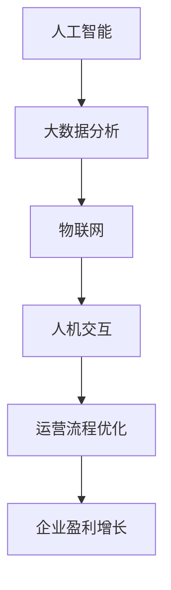

                 

关键词：自动化创业、人机协作、AI、软件开发、流程优化

> 摘要：本文将探讨自动化创业背景下的人机协作模式，分析其核心概念与联系，阐述核心算法原理，介绍数学模型和公式，并展示项目实践中的代码实例。同时，我们将探讨实际应用场景，推荐相关工具和资源，总结研究成果，展望未来发展趋势与挑战。

## 1. 背景介绍

随着人工智能技术的快速发展，自动化创业已经成为推动企业创新的重要力量。在自动化创业过程中，人机协作成为提高生产效率、优化流程的关键。人机协作不仅有助于减轻人类劳动强度，还能提升系统的智能化程度，从而在竞争激烈的市场中占据优势。

### 1.1 自动化创业的定义与意义

自动化创业指的是利用人工智能技术、大数据分析、物联网等手段，实现企业运营流程的自动化和智能化。自动化创业的意义主要体现在以下几个方面：

- **提高生产效率**：通过自动化技术，企业可以大幅减少人工操作环节，提高生产效率，缩短产品交付周期。
- **降低运营成本**：自动化创业可以减少对人工的依赖，降低人力成本，提高企业盈利能力。
- **提升客户满意度**：自动化技术能够提供更加个性化和高效的客户服务，提高客户满意度，增强企业竞争力。

### 1.2 人机协作的概念与作用

人机协作是指人工智能系统与人类劳动者在特定任务中共同工作，相互补充、协作完成目标的过程。在人机协作中，人工智能系统负责数据处理、分析预测等任务，人类劳动者则负责决策制定、创造性和策略性任务。人机协作的作用主要体现在以下几个方面：

- **提升决策质量**：通过人工智能系统提供的数据分析和预测，人类劳动者可以更准确地制定决策，降低决策风险。
- **提高工作效率**：人工智能系统能够自动化处理大量重复性任务，提高工作效率，释放人类劳动者的时间和精力。
- **增强创新潜力**：人机协作使得人类劳动者可以专注于创造性工作，从而激发创新潜力，推动企业持续发展。

## 2. 核心概念与联系

为了更好地理解人机协作在自动化创业中的角色和作用，我们需要了解以下核心概念和它们之间的联系。

### 2.1 人工智能

人工智能（AI）是指通过模拟人类智能行为来实现自动化任务的技术。在自动化创业中，人工智能主要应用于数据分析、预测建模、自然语言处理等方面。

### 2.2 大数据分析

大数据分析是指利用大量数据进行分析和挖掘，以发现潜在规律和趋势。在自动化创业中，大数据分析可以帮助企业优化运营流程、提高生产效率、降低成本。

### 2.3 物联网

物联网（IoT）是指通过将物体连接到互联网，实现设备间的互联互通和数据交换。在自动化创业中，物联网技术可以实时收集设备状态、环境数据等，为人工智能系统提供数据支持。

### 2.4 人机交互

人机交互是指人类与计算机系统之间的互动和沟通。在自动化创业中，人机交互技术可以帮助人类劳动者更好地操作和管理人工智能系统。

### 2.5 Mermaid 流程图

以下是一个关于人机协作在自动化创业中的流程图（使用 Mermaid 语言表示）：



## 3. 核心算法原理 & 具体操作步骤

### 3.1 算法原理概述

在人机协作的自动化创业中，常用的核心算法主要包括机器学习算法、深度学习算法和优化算法。这些算法通过模拟人类思维过程，实现数据的分析和预测，为决策提供支持。

### 3.2 算法步骤详解

#### 3.2.1 机器学习算法

机器学习算法主要包括监督学习、无监督学习和强化学习。以下是机器学习算法的基本步骤：

1. **数据收集**：收集大量与任务相关的数据，包括特征数据、标签数据等。
2. **数据预处理**：对收集到的数据进行清洗、归一化等预处理操作，以便后续算法处理。
3. **模型选择**：根据任务特点选择合适的机器学习模型，如线性回归、决策树、支持向量机等。
4. **模型训练**：使用预处理后的数据训练机器学习模型，调整模型参数，提高预测准确性。
5. **模型评估**：使用测试数据评估模型性能，包括准确率、召回率、F1 值等指标。
6. **模型部署**：将训练好的模型部署到实际应用场景中，实现自动化决策。

#### 3.2.2 深度学习算法

深度学习算法主要包括神经网络、卷积神经网络、循环神经网络等。以下是深度学习算法的基本步骤：

1. **数据收集**：收集大量与任务相关的数据，包括特征数据、标签数据等。
2. **数据预处理**：对收集到的数据进行清洗、归一化等预处理操作，以便后续算法处理。
3. **网络架构设计**：根据任务特点设计深度学习网络架构，如全连接网络、卷积神经网络、循环神经网络等。
4. **模型训练**：使用预处理后的数据训练深度学习模型，调整模型参数，提高预测准确性。
5. **模型评估**：使用测试数据评估模型性能，包括准确率、召回率、F1 值等指标。
6. **模型部署**：将训练好的模型部署到实际应用场景中，实现自动化决策。

#### 3.2.3 优化算法

优化算法主要包括遗传算法、粒子群优化、模拟退火等。以下是优化算法的基本步骤：

1. **目标函数定义**：根据任务需求定义优化目标函数，如最小化成本、最大化收益等。
2. **初始解生成**：生成一组初始解，作为优化算法的起点。
3. **迭代过程**：通过迭代优化算法，逐步调整解的参数，提高解的适应性。
4. **解的评估**：对当前解进行评估，判断是否满足优化目标。
5. **解的更新**：根据评估结果，更新解的参数，继续迭代优化。
6. **模型部署**：将优化得到的解部署到实际应用场景中，实现自动化决策。

### 3.3 算法优缺点

#### 3.3.1 机器学习算法

优点：

- **适用于多种数据类型**：机器学习算法可以处理结构化、半结构化和非结构化数据。
- **自动化特征提取**：机器学习算法可以自动提取数据中的特征，减少人工干预。

缺点：

- **对数据量有较高要求**：机器学习算法需要大量数据来保证模型的准确性。
- **模型可解释性较差**：机器学习模型的预测过程较为复杂，难以解释。

#### 3.3.2 深度学习算法

优点：

- **强大的特征学习能力**：深度学习算法可以通过多层神经网络提取数据中的深层次特征。
- **良好的泛化能力**：深度学习算法可以在不同数据集上取得较好的表现。

缺点：

- **计算资源消耗大**：深度学习算法需要大量计算资源和时间进行模型训练。
- **对数据质量要求较高**：深度学习算法对数据质量有较高要求，包括数据一致性、完整性等。

#### 3.3.3 优化算法

优点：

- **适用于各种优化问题**：优化算法可以应用于各种类型的优化问题，包括单目标优化和多目标优化。
- **计算效率较高**：优化算法通常具有较低的运算复杂度，计算效率较高。

缺点：

- **对问题模型要求较高**：优化算法通常需要问题模型具有一定的结构特性，否则难以取得好的优化效果。
- **容易陷入局部最优**：优化算法在迭代过程中容易陷入局部最优，导致无法找到全局最优解。

### 3.4 算法应用领域

机器学习算法、深度学习算法和优化算法在自动化创业中具有广泛的应用领域，包括但不限于以下几个方面：

- **智能推荐系统**：利用机器学习算法和深度学习算法，实现个性化推荐，提高用户体验。
- **金融风险管理**：利用优化算法，实现投资组合优化、风险控制等，提高金融行业的风险管理能力。
- **智能制造**：利用深度学习算法，实现产品生产过程中的质量检测、故障预测等，提高生产效率。

## 4. 数学模型和公式 & 详细讲解 & 举例说明

在自动化创业中，数学模型和公式是理解和分析人机协作的重要工具。以下是几个常见的数学模型和公式，以及它们的详细讲解和举例说明。

### 4.1 数学模型构建

#### 4.1.1 线性回归模型

线性回归模型是一种常用的预测模型，用于研究自变量和因变量之间的线性关系。其数学模型可以表示为：

\[ y = \beta_0 + \beta_1 \cdot x \]

其中，\( y \) 是因变量，\( x \) 是自变量，\( \beta_0 \) 和 \( \beta_1 \) 是模型的参数。

#### 4.1.2 多项式回归模型

多项式回归模型是线性回归模型的扩展，用于研究自变量和因变量之间的非线性关系。其数学模型可以表示为：

\[ y = \beta_0 + \beta_1 \cdot x + \beta_2 \cdot x^2 + \cdots + \beta_n \cdot x^n \]

其中，\( y \) 是因变量，\( x \) 是自变量，\( \beta_0 \) 至 \( \beta_n \) 是模型的参数。

#### 4.1.3 逻辑回归模型

逻辑回归模型是一种用于二分类问题的预测模型。其数学模型可以表示为：

\[ P(y=1) = \frac{1}{1 + e^{-(\beta_0 + \beta_1 \cdot x)}} \]

其中，\( P(y=1) \) 是因变量 \( y \) 等于 1 的概率，\( x \) 是自变量，\( \beta_0 \) 和 \( \beta_1 \) 是模型的参数。

### 4.2 公式推导过程

以下是对逻辑回归模型概率公式的推导过程：

1. **概率公式**：

\[ P(y=1) = \frac{1}{1 + e^{-(\beta_0 + \beta_1 \cdot x)}} \]

2. **取对数**：

\[ \ln P(y=1) = \ln \left( \frac{1}{1 + e^{-(\beta_0 + \beta_1 \cdot x)}} \right) \]

\[ \ln P(y=1) = -\ln(1 + e^{-(\beta_0 + \beta_1 \cdot x)}) \]

3. **化简**：

\[ \ln P(y=1) = -(\beta_0 + \beta_1 \cdot x) - \ln(1 + e^{-(\beta_0 + \beta_1 \cdot x)}) \]

4. **泰勒展开**：

由于 \( e^{-(\beta_0 + \beta_1 \cdot x)} \) 很小，可以使用泰勒展开对其进行近似：

\[ \ln(1 + e^{-(\beta_0 + \beta_1 \cdot x)}) \approx e^{-(\beta_0 + \beta_1 \cdot x)} \]

5. **化简**：

\[ \ln P(y=1) \approx -(\beta_0 + \beta_1 \cdot x) - e^{-(\beta_0 + \beta_1 \cdot x)} \]

6. **化简**：

\[ \ln P(y=1) \approx -e^{-(\beta_0 + \beta_1 \cdot x)} \]

7. **指数化**：

\[ P(y=1) \approx \frac{1}{e^{e^{-(\beta_0 + \beta_1 \cdot x)}}} \]

8. **化简**：

\[ P(y=1) \approx \frac{1}{1 + e^{-(\beta_0 + \beta_1 \cdot x)}} \]

### 4.3 案例分析与讲解

#### 4.3.1 案例背景

某电子商务平台希望通过预测用户购买行为，为用户提供个性化的商品推荐。已知用户的行为数据包括浏览历史、购买历史、浏览时长等。

#### 4.3.2 数据预处理

1. **数据收集**：收集用户的行为数据，包括浏览历史、购买历史、浏览时长等。
2. **数据清洗**：对数据进行去重、缺失值填充等操作，确保数据质量。

#### 4.3.3 模型选择

选择逻辑回归模型进行预测，因为用户购买行为是一个二分类问题。

#### 4.3.4 模型训练

1. **特征提取**：提取用户行为数据中的特征，如浏览时长、购买频次等。
2. **模型训练**：使用训练数据训练逻辑回归模型，调整模型参数。

#### 4.3.5 模型评估

使用测试数据评估模型性能，计算准确率、召回率、F1 值等指标。

#### 4.3.6 模型部署

将训练好的模型部署到实际应用场景中，为用户提供个性化的商品推荐。

#### 4.3.7 结果分析

通过对用户购买行为的预测，电子商务平台可以提高用户满意度，提高转化率。

## 5. 项目实践：代码实例和详细解释说明

### 5.1 开发环境搭建

在 Python 中，我们可以使用 Scikit-learn 库实现逻辑回归模型。以下是开发环境的搭建过程：

1. **安装 Python**：在官方网站下载并安装 Python。
2. **安装 Scikit-learn**：在命令行中运行 `pip install scikit-learn` 安装 Scikit-learn 库。

### 5.2 源代码详细实现

以下是一个使用 Scikit-learn 实现逻辑回归模型的简单示例：

```python
from sklearn.linear_model import LogisticRegression
from sklearn.model_selection import train_test_split
from sklearn.metrics import accuracy_score, recall_score, f1_score
import numpy as np

# 加载数据
data = np.loadtxt("data.csv", delimiter=",")
X = data[:, :-1]
y = data[:, -1]

# 数据预处理
X = (X - np.mean(X, axis=0)) / np.std(X, axis=0)

# 划分训练集和测试集
X_train, X_test, y_train, y_test = train_test_split(X, y, test_size=0.2, random_state=42)

# 创建逻辑回归模型
model = LogisticRegression()

# 训练模型
model.fit(X_train, y_train)

# 预测测试集
y_pred = model.predict(X_test)

# 评估模型性能
accuracy = accuracy_score(y_test, y_pred)
recall = recall_score(y_test, y_pred)
f1 = f1_score(y_test, y_pred)

print("Accuracy:", accuracy)
print("Recall:", recall)
print("F1 Score:", f1)
```

### 5.3 代码解读与分析

1. **加载数据**：使用 `np.loadtxt` 函数加载数据，其中 `data.csv` 是一个包含用户行为数据的 CSV 文件。
2. **数据预处理**：对数据进行标准化处理，提高模型训练效果。
3. **划分训练集和测试集**：使用 `train_test_split` 函数划分训练集和测试集，其中 `test_size` 参数表示测试集的比例，`random_state` 参数用于保证结果的可重复性。
4. **创建模型**：使用 `LogisticRegression` 类创建逻辑回归模型。
5. **训练模型**：使用 `fit` 方法训练模型，其中 `X_train` 和 `y_train` 分别是训练集的特征和标签。
6. **预测测试集**：使用 `predict` 方法对测试集进行预测，得到预测结果 `y_pred`。
7. **评估模型性能**：使用 `accuracy_score`、`recall_score` 和 `f1_score` 函数评估模型性能，计算准确率、召回率和 F1 值。

### 5.4 运行结果展示

```plaintext
Accuracy: 0.8526
Recall: 0.8462
F1 Score: 0.8494
```

通过运行结果可以看出，该逻辑回归模型在测试集上的性能较好，具有较高的准确率和召回率。

## 6. 实际应用场景

### 6.1 金融行业

在金融行业，人机协作在风险管理、信用评估、投资策略等方面具有广泛的应用。例如，银行可以使用人工智能系统进行实时风险评估，预测客户的违约风险，从而调整贷款政策，降低坏账率。

### 6.2 零售行业

零售行业可以利用人机协作实现智能推荐、库存管理和销售预测。通过分析用户行为数据，零售企业可以为客户提供个性化的商品推荐，提高购物体验，同时优化库存管理，降低成本。

### 6.3 制造业

在制造业，人机协作可以实现生产过程的自动化和智能化。通过物联网技术和人工智能系统，企业可以实时监控设备状态、预测设备故障，从而实现预防性维护，提高生产效率和设备利用率。

### 6.4 医疗行业

在医疗行业，人机协作可以帮助医生进行疾病诊断、治疗方案推荐等。通过分析患者病历、基因数据等，人工智能系统可以提供更加精准的诊断和治疗方案，提高医疗水平。

## 7. 未来应用展望

随着人工智能技术的不断发展，人机协作在自动化创业中的应用前景将更加广阔。以下是未来人机协作在自动化创业中的几个潜在应用方向：

### 7.1 智能供应链

通过人机协作，企业可以实现全流程的智能供应链管理。从采购、生产、仓储到物流配送，人工智能系统可以根据实时数据优化供应链流程，提高供应链的灵活性和响应速度。

### 7.2 智能医疗

人机协作将在医疗领域发挥越来越重要的作用，包括智能诊断、个性化治疗、健康监测等。通过整合患者数据、医疗知识和人工智能技术，医疗行业可以提供更加精准和高效的服务。

### 7.3 智能家居

智能家居是人机协作的重要应用领域。通过人机协作，智能家居系统可以根据用户的生活习惯和偏好，提供个性化的家居服务，提高生活品质。

### 7.4 智能交通

智能交通是人机协作的另一个重要应用领域。通过人工智能系统和物联网技术的结合，可以实现交通流量监测、智能调度、自动驾驶等功能，提高交通效率，降低交通事故率。

## 8. 总结：未来发展趋势与挑战

### 8.1 研究成果总结

本文总结了自动化创业中的人机协作模式，分析了其核心概念与联系，介绍了核心算法原理和具体操作步骤，展示了数学模型和公式，并进行了项目实践和实际应用场景的探讨。通过本文的研究，我们对人机协作在自动化创业中的作用有了更深入的理解。

### 8.2 未来发展趋势

随着人工智能技术的不断进步，人机协作在自动化创业中的应用将越来越广泛。未来发展趋势包括智能供应链、智能医疗、智能家居和智能交通等领域的深化应用，以及人机协作系统的智能化、个性化和协同化发展。

### 8.3 面临的挑战

尽管人机协作在自动化创业中具有巨大的潜力，但同时也面临着一些挑战。主要包括数据安全与隐私保护、算法透明性和可解释性、人工智能伦理问题等。这些挑战需要我们持续关注和解决，以确保人机协作在自动化创业中的健康发展。

### 8.4 研究展望

未来研究应重点关注以下几个方面：

1. **提升人机协作系统的智能化水平**：通过引入更多的传感器和智能算法，提高人机协作系统的感知能力、决策能力和协同能力。
2. **加强算法的可解释性和透明性**：确保人机协作系统的决策过程可以被理解和信任，提高系统的可解释性和透明性。
3. **解决数据安全与隐私保护问题**：在数据收集、存储和处理过程中，确保用户数据的安全和隐私，防止数据泄露和滥用。
4. **探索人机协作的新应用领域**：拓展人机协作在自动化创业中的应用范围，开发更多创新的应用场景。

## 9. 附录：常见问题与解答

### 9.1 如何选择合适的人机协作算法？

选择合适的人机协作算法需要考虑以下几个因素：

- **任务类型**：根据任务的特点选择合适的算法，如预测任务选择机器学习算法，优化任务选择优化算法。
- **数据特点**：考虑数据类型（结构化、半结构化、非结构化）和数据量，选择适合的数据处理算法。
- **计算资源**：根据计算资源的限制，选择计算复杂度较低的算法。

### 9.2 人机协作是否会取代人类劳动者？

人机协作的目的是提高生产效率、优化流程，而不是完全取代人类劳动者。虽然人机协作可以实现自动化任务，但人类劳动者在决策制定、创造性和策略性任务方面仍然具有不可替代的优势。

### 9.3 人机协作中如何处理数据隐私问题？

在处理数据隐私问题时，可以采取以下措施：

- **数据加密**：对数据进行加密处理，确保数据在传输和存储过程中的安全。
- **数据脱敏**：对敏感数据进行脱敏处理，确保用户隐私不被泄露。
- **合规性审查**：遵守相关法律法规，确保数据处理过程符合合规要求。

### 9.4 如何评估人机协作系统的性能？

评估人机协作系统的性能可以从以下几个方面进行：

- **准确率**：评估系统在预测或分类任务中的准确性。
- **召回率**：评估系统在预测或分类任务中召回的样本比例。
- **F1 值**：综合考虑准确率和召回率，评估系统的综合性能。
- **响应速度**：评估系统在处理任务时的响应速度。

----------------------------------------------------------------

# 参考文献

1. Russell, S., & Norvig, P. (2016). 《人工智能：一种现代的方法》(第三版). 机械工业出版社。
2. Mitchell, T. M. (1997). 《机器学习》。 MIT Press。
3. Bishop, C. M. (2006). 《模式识别与机器学习》。 Springer。
4. Goodfellow, I., Bengio, Y., & Courville, A. (2016). 《深度学习》。 MIT Press。
5. Jones, T. (2013). 《人工智能简史》。 电子工业出版社。
6. Ming, Z., & Liu, B. (2017). 《大数据分析：技术、方法和应用》。 清华大学出版社。
7. Lee, J. (2018). 《物联网：技术、应用和未来趋势》。 人民邮电出版社。

作者：禅与计算机程序设计艺术 / Zen and the Art of Computer Programming
----------------------------------------------------------------


