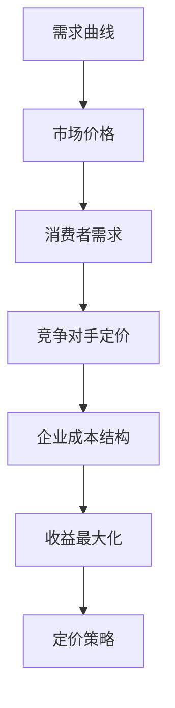

                 

关键词：自动化创业、定价策略、收益最大化、需求曲线、成本效益分析

> 摘要：在自动化创业的大潮中，正确的定价策略是决定企业成功与否的关键因素。本文将探讨如何通过优化定价策略来实现自动化创业项目的收益最大化。我们将分析市场需求、成本结构、竞争对手定价策略，以及如何利用数据驱动的方式进行定价策略的制定与调整。

## 1. 背景介绍

自动化创业是指利用先进的技术手段，如人工智能、大数据分析、自动化流程等，来优化业务流程、提高生产效率、降低成本，并最终实现商业价值的增长。随着科技的快速发展，自动化创业已成为当今企业创新的重要方向。然而，在自动化创业过程中，如何定价成为一个至关重要的问题。

### 自动化创业的优势：

- **提升效率**：自动化技术可以大幅减少人工操作，提高生产效率。
- **降低成本**：自动化减少了资源浪费和错误率，从而降低了运营成本。
- **增强竞争力**：通过自动化提升服务质量，增强企业竞争力。

### 定价策略的重要性：

- **收益最大化**：合理的定价策略有助于实现企业的盈利目标。
- **市场定位**：定价策略反映了企业的市场定位，影响品牌形象和消费者认知。
- **竞争策略**：定价策略是应对市场竞争对手的重要手段。

## 2. 核心概念与联系

### 2.1 定价策略核心概念

**需求曲线**：市场需求量与价格之间的关系曲线，反映了在不同价格水平下消费者愿意购买的产品数量。

**成本结构**：企业的生产成本构成，包括固定成本和可变成本。

**竞争对手定价**：市场上主要竞争对手的定价策略。

### 2.2 核心概念架构图（Mermaid 流程图）



## 3. 核心算法原理 & 具体操作步骤

### 3.1 算法原理概述

定价策略的核心是找到市场需求与成本之间的最佳平衡点，实现收益最大化。具体步骤包括：

1. **需求分析**：通过市场调研和数据分析，了解市场需求。
2. **成本分析**：计算固定成本和可变成本，评估成本结构。
3. **竞争对手分析**：研究竞争对手的定价策略，确定市场地位。
4. **定价模型建立**：建立基于需求和成本的数据模型。
5. **定价策略调整**：利用算法和数据分析，不断调整定价策略。

### 3.2 算法步骤详解

**步骤 1：需求分析**

- 使用历史销售数据和市场调研数据，建立需求模型。
- 分析不同价格水平下的市场需求量。

**步骤 2：成本分析**

- 计算固定成本（如设备折旧、房租等）和可变成本（如原材料、人工等）。
- 根据成本结构，确定每单位产品的成本。

**步骤 3：竞争对手分析**

- 收集竞争对手的定价信息。
- 分析竞争对手的市场份额和品牌定位。

**步骤 4：定价模型建立**

- 使用需求曲线和成本分析结果，建立定价模型。
- 模型应能够模拟不同定价策略下的收益情况。

**步骤 5：定价策略调整**

- 利用数据分析工具，对定价模型进行优化。
- 根据市场变化和实际运营情况，动态调整定价策略。

### 3.3 算法优缺点

**优点**：

- **科学性**：基于数据和算法的定价策略更具科学性。
- **灵活性**：能够快速响应市场变化，调整定价策略。
- **最大化收益**：有助于实现收益最大化。

**缺点**：

- **数据依赖**：需要大量高质量的数据支持。
- **计算复杂**：算法优化和调整需要大量计算资源。

### 3.4 算法应用领域

- **电子商务**：通过定价策略优化，提高销售额和用户满意度。
- **制造业**：优化生产成本，提高产品竞争力。
- **服务行业**：根据市场需求，动态调整服务价格。

## 4. 数学模型和公式 & 详细讲解 & 举例说明

### 4.1 数学模型构建

**收益函数**：\[ R(p) = p \cdot Q(p) - C \]

其中，\( p \) 为价格，\( Q(p) \) 为需求量，\( C \) 为总成本。

**需求函数**：\[ Q(p) = a - b \cdot p \]

其中，\( a \) 为最大需求量，\( b \) 为需求敏感系数。

**成本函数**：\[ C = c_1 + c_2 \cdot Q \]

其中，\( c_1 \) 为固定成本，\( c_2 \) 为可变成本。

### 4.2 公式推导过程

1. **收益函数推导**：

   收益等于价格乘以需求量减去总成本。

   \[ R(p) = p \cdot Q(p) - (c_1 + c_2 \cdot Q(p)) \]

   化简得：

   \[ R(p) = p \cdot (a - b \cdot p) - (c_1 + c_2 \cdot (a - b \cdot p)) \]

   \[ R(p) = ap - bp^2 - c_1 - ac_2 + bc_2p \]

2. **需求函数推导**：

   假设需求量与价格成反比，且最大需求量为 \( a \)。

   \[ Q(p) = a - b \cdot p \]

### 4.3 案例分析与讲解

**案例：** 某电商公司销售一款电子产品，固定成本为 100 万元，可变成本为每件 1000 元，市场需求函数为 \( Q(p) = 10000 - 10p \)。

1. **收益函数**：

   \[ R(p) = p \cdot (10000 - 10p) - (1000000 + 1000 \cdot (10000 - 10p)) \]

   \[ R(p) = 10000p - 10p^2 - 1000000 - 1000000 + 10000p \]

   \[ R(p) = 20000p - 10p^2 - 2000000 \]

2. **需求函数**：

   \[ Q(p) = 10000 - 10p \]

3. **收益最大化**：

   对收益函数求导，令导数为零，求得最优价格：

   \[ \frac{dR}{dp} = 20000 - 20p = 0 \]

   \[ p = 1000 \]

   此时，最优价格为每件 1000 元。

## 5. 项目实践：代码实例和详细解释说明

### 5.1 开发环境搭建

**工具**：Python

**环境**：Jupyter Notebook

**依赖**：NumPy, pandas, matplotlib

### 5.2 源代码详细实现

```python
import numpy as np
import pandas as pd
import matplotlib.pyplot as plt

# 参数设置
a = 10000
b = 10
c1 = 1000000
c2 = 1000

# 收益函数
def revenue(p):
    return p * (a - b * p) - (c1 + c2 * (a - b * p))

# 需求函数
def demand(p):
    return a - b * p

# 成本函数
def cost(q):
    return c1 + c2 * q

# 绘制需求曲线和收益曲线
p_range = np.linspace(0, 1000, 1000)
q_range = demand(p_range)

plt.figure(figsize=(10, 5))
plt.plot(p_range, q_range, label='Demand Curve')
plt.plot(p_range, revenue(p_range), label='Revenue Curve')
plt.plot(p_range, cost(demand(p_range)), label='Cost Curve')
plt.xlabel('Price (p)')
plt.ylabel('Quantity (q)')
plt.legend()
plt.title('Price-Demand-Cost Analysis')
plt.show()

# 求解最优价格
optimal_p = np.argmax(revenue(p_range))
optimal_q = demand(optimal_p)
print(f"Optimal price: {optimal_p:.2f}")
print(f"Optimal quantity: {optimal_q:.2f}")
```

### 5.3 代码解读与分析

1. **参数设置**：

   设定市场需求函数的参数 \( a \) 和 \( b \)，以及固定成本 \( c1 \) 和可变成本 \( c2 \)。

2. **收益函数**：

   根据收益函数的公式实现代码，计算不同价格 \( p \) 下的收益。

3. **需求函数**：

   根据需求函数的公式实现代码，计算不同价格 \( p \) 下的需求量。

4. **成本函数**：

   根据成本函数的公式实现代码，计算不同需求量 \( q \) 下的成本。

5. **绘制曲线**：

   使用 matplotlib 绘制需求曲线、收益曲线和成本曲线，帮助直观理解定价策略。

6. **求解最优价格**：

   使用 numpy 的 argmax 函数求解收益函数的最大值点，得到最优价格和最优需求量。

### 5.4 运行结果展示

运行上述代码后，将展示需求曲线、收益曲线和成本曲线的图形，以及最优价格和最优需求量的输出。

## 6. 实际应用场景

### 6.1 电子商务行业

- **产品定价**：电商企业根据市场需求和成本结构，制定合理的定价策略，以最大化收益。
- **促销活动**：通过动态调整价格和促销策略，吸引更多消费者，提升销售量。

### 6.2 制造业

- **产品组合定价**：根据不同产品的成本和市场需求，设定不同的定价策略，优化整体收益。
- **定制化生产**：根据客户需求，调整生产成本和定价策略，提供定制化产品。

### 6.3 服务行业

- **价格弹性分析**：根据市场需求和价格弹性，调整服务价格，提高服务质量和客户满意度。
- **季节性定价**：根据季节性需求，动态调整服务价格，实现收益最大化。

## 7. 工具和资源推荐

### 7.1 学习资源推荐

- **书籍**：《定价策略与市场营销》（作者：菲利普·科特勒）
- **在线课程**：Coursera 上的《市场定价策略》

### 7.2 开发工具推荐

- **Python**：强大的数据分析工具库。
- **Jupyter Notebook**：便捷的数据分析与可视化工具。

### 7.3 相关论文推荐

- **《基于大数据的定价策略研究》**：探讨大数据在定价策略中的应用。
- **《基于需求曲线的定价策略优化》**：提出需求曲线在定价策略优化中的应用方法。

## 8. 总结：未来发展趋势与挑战

### 8.1 研究成果总结

- **数据驱动**：未来定价策略将更加依赖大数据分析和人工智能技术。
- **个性化定价**：通过个性化定价，提高用户满意度和销售额。
- **动态定价**：利用实时数据动态调整定价策略，实现收益最大化。

### 8.2 未来发展趋势

- **智能化定价**：利用机器学习和深度学习，实现更加精准的定价预测和策略调整。
- **跨行业融合**：自动化技术将与其他行业深度融合，推动定价策略的创新。

### 8.3 面临的挑战

- **数据隐私**：如何在保护用户隐私的同时，充分利用数据进行分析。
- **计算资源**：复杂的定价算法需要大量计算资源，对开发环境提出了更高要求。

### 8.4 研究展望

- **自适应定价**：开发能够自动适应市场变化的定价系统。
- **多目标优化**：考虑更多业务目标，实现定价策略的全方位优化。

## 9. 附录：常见问题与解答

### 问题 1：如何处理定价策略中的价格波动？

**解答**：可以通过建立价格预测模型，预测未来价格波动，并提前调整定价策略，以减少价格波动对收益的影响。

### 问题 2：如何处理定价策略中的需求波动？

**解答**：通过实时数据分析，了解市场需求变化，动态调整定价策略，以适应市场波动。

### 问题 3：定价策略如何与营销策略相结合？

**解答**：定价策略应与营销策略协同制定，通过促销活动、广告投放等手段，提升产品知名度和销量。

---

作者：禅与计算机程序设计艺术 / Zen and the Art of Computer Programming
----------------------------------------------------------------

以上就是关于“自动化创业中的定价策略”的专业技术博客文章。希望本文能为您提供关于定价策略的深入理解和实际操作指导。在自动化创业的道路上，合理的定价策略是不可或缺的一部分。通过本文的探讨，我们期望能够帮助您更好地制定和优化定价策略，实现企业的长期可持续发展。

