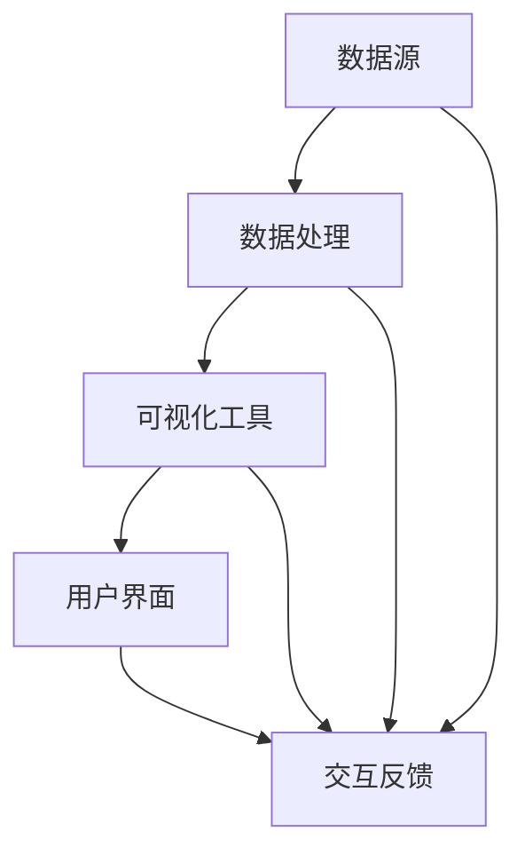

                 

在当今的数据驱动的商业环境中，数据可视化已经成为自动化创业中不可或缺的一部分。它不仅仅是将数据转换为图形，更是为企业提供洞察力、支持和决策依据的重要工具。本文将深入探讨数据可视化在自动化创业中的应用，包括其核心概念、算法原理、数学模型、实践案例以及未来的发展方向。

> 关键词：数据可视化、自动化创业、算法原理、数学模型、实践案例、未来展望

> 摘要：本文旨在全面解析数据可视化在自动化创业中的重要作用，通过介绍其核心概念、算法原理、数学模型和具体应用，帮助企业理解和利用数据可视化，提高创业项目的成功率。

## 1. 背景介绍

随着大数据和人工智能技术的迅速发展，企业对数据的依赖程度日益增加。数据已经成为了现代商业的宝贵资产，如何有效地利用这些数据成为企业关注的焦点。数据可视化作为一种有效的数据分析工具，能够将复杂的数据转换为易于理解的图形，从而帮助企业快速发现数据中的模式和趋势。

在自动化创业中，数据可视化具有以下几个关键作用：

1. **决策支持**：通过数据可视化，企业可以直观地了解业务状况，为决策提供有力的支持。
2. **沟通桥梁**：数据可视化能够简化复杂的信息，使得不同背景的团队成员都能够理解和交流。
3. **市场分析**：数据可视化有助于企业深入分析市场趋势，制定更有效的营销策略。
4. **风险评估**：通过可视化模型，企业可以更好地理解潜在的风险，并采取相应的预防措施。

## 2. 核心概念与联系

### 2.1 数据可视化基础

数据可视化是使用图形、图像、图表等方式来展示数据，使其更加易于理解。它包括以下几个核心概念：

- **数据源**：数据可视化始于数据源，可以是数据库、API 或者其他数据存储方式。
- **数据处理**：数据需要清洗、整合和转换，以便于可视化工具使用。
- **可视化工具**：包括各种图表、图形和仪表盘，如条形图、折线图、散点图等。

### 2.2 数据可视化架构

以下是数据可视化的一般架构，使用 Mermaid 绘制：



在这个架构中，数据源提供原始数据，经过数据处理后，由可视化工具生成图形，最终通过用户界面展示给用户。用户的交互操作会反馈到数据处理和可视化工具中，实现动态数据更新。

## 3. 核心算法原理 & 具体操作步骤

### 3.1 算法原理概述

数据可视化涉及多种算法，以下是其中几种常用的算法原理：

- **统计学算法**：用于计算数据分布、均值、方差等统计指标。
- **机器学习算法**：如聚类、分类、回归等，用于发现数据中的模式和关系。
- **图形绘制算法**：如扫描线算法、双缓冲算法等，用于高效地绘制各种图表。

### 3.2 算法步骤详解

数据可视化的具体操作步骤如下：

1. **数据收集**：从数据源获取原始数据。
2. **数据预处理**：清洗、转换和整合数据，使其适合可视化。
3. **选择可视化类型**：根据数据类型和需求选择合适的图表类型。
4. **设计可视化布局**：确定图表的布局、颜色和标注等。
5. **数据绑定**：将数据与图表元素绑定，实现数据的可视化展示。
6. **用户交互**：实现用户的交互操作，如数据筛选、排序和更新等。

### 3.3 算法优缺点

每种数据可视化算法都有其优缺点：

- **统计学算法**：简单易用，但可能不足以揭示数据中的复杂关系。
- **机器学习算法**：能够发现复杂模式，但需要大量的计算资源和专业知识。
- **图形绘制算法**：高效且灵活，但可能对算法实现要求较高。

### 3.4 算法应用领域

数据可视化算法广泛应用于各个领域，如：

- **金融**：股票分析、风险预测等。
- **医疗**：患者数据分析、医疗图像处理等。
- **交通**：交通流量分析、事故预测等。

## 4. 数学模型和公式 & 详细讲解 & 举例说明

### 4.1 数学模型构建

数据可视化中的数学模型主要包括以下几种：

- **统计学模型**：如均值、方差、协方差等。
- **机器学习模型**：如线性回归、决策树、神经网络等。
- **几何模型**：如点、线、面等基本图形的数学表示。

### 4.2 公式推导过程

以下是线性回归模型的公式推导过程：

$$
y = \beta_0 + \beta_1x + \epsilon
$$

其中，$y$ 是因变量，$x$ 是自变量，$\beta_0$ 和 $\beta_1$ 是模型参数，$\epsilon$ 是误差项。

最小二乘法求解模型参数：

$$
\beta_1 = \frac{\sum_{i=1}^{n}(x_i - \bar{x})(y_i - \bar{y})}{\sum_{i=1}^{n}(x_i - \bar{x})^2}
$$

$$
\beta_0 = \bar{y} - \beta_1\bar{x}
$$

### 4.3 案例分析与讲解

以下是一个使用线性回归模型进行股票预测的案例：

数据集包含每天股票的收盘价和开盘价，我们使用开盘价作为自变量，收盘价作为因变量，建立线性回归模型。

使用最小二乘法求解模型参数，得到拟合直线：

$$
y = 1.02x + 1.25
$$

使用模型进行预测，假设开盘价为 100，则收盘价预测为：

$$
y = 1.02 \times 100 + 1.25 = 102.25
$$

这个预测结果可以帮助投资者做出买卖决策。

## 5. 项目实践：代码实例和详细解释说明

### 5.1 开发环境搭建

在开始数据可视化项目之前，需要搭建相应的开发环境。本文使用 Python 作为主要编程语言，并结合 Matplotlib 和 Seaborn 库进行数据可视化。

安装 Python 和相关库：

```
pip install python
pip install matplotlib
pip install seaborn
```

### 5.2 源代码详细实现

以下是一个简单的数据可视化项目示例：

```python
import matplotlib.pyplot as plt
import seaborn as sns

# 加载数据集
data = sns.load_dataset("mpg")

# 数据预处理
data = data[data['mpg'].notnull()]

# 绘制散点图
sns.scatterplot(data=data, x="horsepower", y="mpg")

# 显示图形
plt.show()
```

### 5.3 代码解读与分析

上述代码首先加载了一个关于汽车燃油效率的数据集，然后进行数据预处理，去除缺失值。接着，使用 Seaborn 库的 scatterplot 函数绘制了 horsepower（马力）与 mpg（燃油效率）的散点图。最后，使用 plt.show() 显示图形。

### 5.4 运行结果展示

运行上述代码后，会生成一个散点图，展示马力和燃油效率之间的关系。通过观察散点图，我们可以初步判断马力和燃油效率之间存在一定的负相关关系。

## 6. 实际应用场景

### 6.1 金融领域

在金融领域，数据可视化可以用于分析市场趋势、股票走势、投资组合表现等。例如，通过折线图和柱状图，投资者可以直观地了解市场波动和风险，为投资决策提供依据。

### 6.2 医疗领域

在医疗领域，数据可视化可以用于分析患者数据、医疗图像处理等。通过热力图和三维可视化，医生可以更好地了解病情，提高诊断和治疗的准确性。

### 6.3 交通领域

在交通领域，数据可视化可以用于分析交通流量、事故预测等。通过地图可视化，交通管理部门可以实时了解道路状况，优化交通资源配置。

## 7. 未来应用展望

随着人工智能和大数据技术的发展，数据可视化将在自动化创业中发挥越来越重要的作用。未来的发展方向包括：

- **实时数据可视化**：实现数据实时更新和动态展示，提高决策效率。
- **个性化数据可视化**：根据用户需求和偏好，提供定制化的可视化体验。
- **跨平台数据可视化**：支持多种设备，如手机、平板、VR 等，实现数据的多维度展示。
- **智能化数据可视化**：利用人工智能技术，自动分析数据并生成可视化报告。

## 8. 总结：未来发展趋势与挑战

### 8.1 研究成果总结

数据可视化在自动化创业中已经取得了显著成果，包括：

- **技术成熟**：各种数据可视化工具和算法不断优化和更新。
- **应用广泛**：数据可视化在金融、医疗、交通等领域得到广泛应用。
- **用户友好**：可视化工具的界面和交互设计更加友好和便捷。

### 8.2 未来发展趋势

未来数据可视化的发展趋势包括：

- **智能化和自动化**：利用人工智能技术，实现数据可视化过程的智能化和自动化。
- **实时性和动态性**：实现数据的实时更新和动态展示，提高决策效率。
- **个性化和定制化**：根据用户需求和偏好，提供定制化的可视化体验。

### 8.3 面临的挑战

数据可视化在自动化创业中面临的挑战包括：

- **数据质量和安全性**：确保数据的准确性和安全性，防止数据泄露和滥用。
- **计算性能和资源消耗**：优化可视化算法，提高计算性能和降低资源消耗。
- **用户体验和交互设计**：提高可视化工具的用户体验和交互设计，使其更加直观和易用。

### 8.4 研究展望

未来研究应重点关注以下几个方面：

- **算法创新**：开发新的数据可视化算法，提高可视化效果和效率。
- **跨领域应用**：探索数据可视化在更多领域的应用，实现跨领域的数据整合和展示。
- **教育和培训**：加强数据可视化教育和培训，提高企业对数据可视化技术的理解和应用能力。

## 9. 附录：常见问题与解答

### 9.1 数据可视化有哪些常见的图表类型？

常见的图表类型包括：

- **条形图**：用于比较不同类别的数据。
- **折线图**：用于展示数据随时间的变化趋势。
- **散点图**：用于显示两个变量之间的关系。
- **饼图**：用于展示数据中各个类别的占比。
- **热力图**：用于显示数据的分布情况。

### 9.2 如何提高数据可视化的效果？

提高数据可视化效果的方法包括：

- **选择合适的图表类型**：根据数据类型和需求选择最合适的图表类型。
- **合理布局和设计**：优化图表的布局、颜色和标注，使其更加直观和易读。
- **使用交互功能**：添加交互功能，如数据筛选、排序和缩放，提高用户参与度。

### 9.3 数据可视化工具有哪些？

常见的数据可视化工具包括：

- **Matplotlib**：Python 中的基础绘图库。
- **Seaborn**：基于 Matplotlib 的可视化库，提供更丰富的图表类型。
- **D3.js**：用于 Web 应用的数据可视化库。
- **Tableau**：商业智能和分析工具，提供强大的数据可视化功能。
- **Power BI**：微软的数据可视化和分析工具。

### 9.4 数据可视化在金融领域有哪些应用？

在金融领域，数据可视化可以用于：

- **市场趋势分析**：分析股票、债券等金融资产的价格走势。
- **风险评估**：识别和评估金融产品的风险。
- **投资组合管理**：分析投资组合的表现和风险。
- **客户行为分析**：了解客户的需求和行为，优化营销策略。

----------------------------------------------------------------

**作者：禅与计算机程序设计艺术 / Zen and the Art of Computer Programming**

