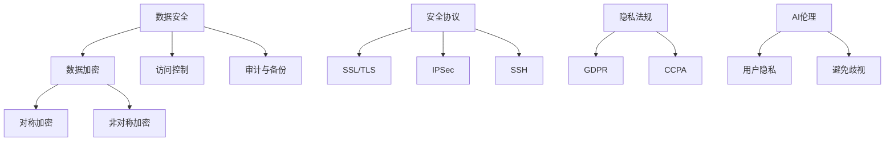

                 

### 关键词 Keywords
- 自动化创业
- 数据安全
- 隐私保护
- 数据加密
- 安全协议
- 隐私法规
- AI伦理

<|assistant|>### 摘要 Abstract
本文探讨了在自动化创业领域中所面临的严峻数据安全与隐私保护问题。通过对核心概念、数据安全算法、数学模型、项目实践等方面进行详细阐述，文章提出了有效的解决方案，旨在帮助创业团队构建一个既高效又安全的业务环境。同时，本文也展望了未来数据安全与隐私保护的发展趋势与挑战，为自动化创业领域的持续发展提供了宝贵的参考。

## 1. 背景介绍

在数字化时代，自动化创业已成为推动经济发展的重要力量。从电子商务到物流、金融再到医疗，自动化技术的应用正不断改变传统行业的运营模式。然而，随着自动化程度的提高，数据安全与隐私保护问题也日益凸显。创业公司往往需要处理海量的用户数据，这些数据不仅是业务的核心资产，也可能是黑客攻击的目标。

数据泄露不仅会导致公司声誉受损，还可能面临巨额罚款和诉讼。例如，2017年的Facebook数据泄露事件就引起了全球范围的关注，该公司因未能妥善保护用户数据而受到广泛批评。此外，2018年的剑桥分析公司丑闻更是揭示了自动化技术在隐私侵犯方面的潜在风险。

面对这些挑战，创业公司必须采取有效的措施来保护数据安全与隐私。这不仅涉及到技术层面的防护手段，还包括对法规和伦理的遵循。本文将深入探讨数据安全与隐私保护的核心概念、算法原理、数学模型及项目实践，为自动化创业提供切实可行的解决方案。

## 2. 核心概念与联系

### 2.1 数据安全

数据安全是指保护数据免受未经授权的访问、使用、披露、破坏、修改或破坏的过程。它包括数据加密、访问控制、审计、备份和恢复等策略和技术。在自动化创业中，数据安全至关重要，因为一旦数据被泄露或篡改，后果可能是灾难性的。

### 2.2 隐私保护

隐私保护是指确保个人数据不被非法收集、使用、披露或共享的行为。它涉及到用户隐私权的保护，包括个人信息的收集、存储、处理和传输。在自动化创业中，隐私保护不仅是对法律责任的规避，更是对用户信任的维护。

### 2.3 数据加密

数据加密是将数据转换为密文的过程，只有通过解密才能恢复原始数据。加密是数据安全的核心手段之一，它确保了即使数据被非法访问，也无法理解其内容。常用的加密算法包括对称加密和非对称加密。

### 2.4 安全协议

安全协议是一种用于在通信双方之间建立安全通信的机制。它确保了数据的机密性、完整性和身份验证。常见的安全协议包括SSL/TLS、IPSec和SSH等。安全协议在自动化创业中的应用，可以帮助保护数据在传输过程中的安全。

### 2.5 隐私法规

隐私法规是规范数据收集、处理和使用的法律框架。例如，欧盟的通用数据保护条例（GDPR）和美国的加州消费者隐私法案（CCPA）都是重要的隐私法规。遵守隐私法规是自动化创业公司的法律责任，也是保护用户隐私的必要措施。

### 2.6 AI伦理

AI伦理是关于人工智能系统设计和应用中的道德问题。随着自动化技术的普及，AI伦理问题愈发重要。例如，AI系统如何处理用户隐私、如何避免歧视等问题都需要深入探讨。AI伦理在自动化创业中的应用，有助于构建一个更加公平和可信赖的技术环境。

### 2.7 Mermaid 流程图

下面是一个关于数据安全与隐私保护架构的Mermaid流程图，展示了各个核心概念之间的关系：



## 3. 核心算法原理 & 具体操作步骤

### 3.1 算法原理概述

在自动化创业中，数据安全与隐私保护的核心算法包括数据加密、访问控制和安全协议。以下是这些算法的简要概述：

- **数据加密**：数据加密是通过将数据转换为密文来保护其不被非法访问。加密算法分为对称加密和非对称加密，前者加密和解密速度快，但密钥管理复杂；后者安全性高，但计算成本高。
- **访问控制**：访问控制是确保只有授权用户能够访问特定数据或资源。常见的访问控制机制包括基于角色的访问控制（RBAC）和基于属性的访问控制（ABAC）。
- **安全协议**：安全协议是在通信双方之间建立安全通信的机制，确保数据的机密性、完整性和身份验证。例如，SSL/TLS用于保护Web通信，IPSec用于保护网络通信，SSH用于远程登录。

### 3.2 算法步骤详解

下面是数据安全与隐私保护的具体操作步骤：

#### 3.2.1 数据加密

1. **选择加密算法**：根据数据类型和安全需求选择合适的加密算法。例如，对于文本数据，可以选择AES或RSA。
2. **生成密钥**：对于对称加密，生成一个密钥；对于非对称加密，生成公钥和私钥。
3. **加密数据**：使用加密算法和密钥对数据进行加密。
4. **存储密钥**：将密钥安全存储，确保只有授权用户能够访问。

#### 3.2.2 访问控制

1. **定义用户角色**：为用户分配角色，例如管理员、普通用户等。
2. **定义资源权限**：为每种资源（例如数据库、文件等）定义权限，例如读、写、执行等。
3. **权限检查**：在用户访问资源时，检查用户角色和资源权限，确保只有授权用户能够访问。
4. **日志记录**：记录所有访问事件，以便进行审计和监控。

#### 3.2.3 安全协议

1. **选择安全协议**：根据通信需求选择合适的安全协议，例如SSL/TLS。
2. **配置服务器和客户端**：在服务器和客户端配置安全协议，确保数据在传输过程中加密。
3. **身份验证**：在通信双方之间进行身份验证，确保通信的双方是合法的。
4. **加密通信**：使用安全协议加密所有通信数据，确保数据的机密性和完整性。

### 3.3 算法优缺点

#### 3.3.1 数据加密

- **优点**：数据加密能够有效保护数据不被非法访问。
- **缺点**：加密和解密需要计算资源，可能会影响系统性能。

#### 3.3.2 访问控制

- **优点**：访问控制能够确保只有授权用户能够访问资源，提高数据安全性。
- **缺点**：权限管理复杂，需要定期维护和更新。

#### 3.3.3 安全协议

- **优点**：安全协议能够确保数据在传输过程中的安全，防止数据泄露和篡改。
- **缺点**：配置和管理复杂，需要定期更新和维护。

### 3.4 算法应用领域

数据安全与隐私保护算法在自动化创业中的应用非常广泛，包括但不限于以下领域：

- **电子商务**：保护用户支付信息和个人信息。
- **物流**：保护运输信息和客户隐私。
- **金融**：保护金融交易信息和用户资产。
- **医疗**：保护患者健康信息和隐私。
- **物联网**：保护物联网设备之间的通信数据。

## 4. 数学模型和公式 & 详细讲解 & 举例说明

### 4.1 数学模型构建

在数据安全与隐私保护中，常用的数学模型包括加密算法和访问控制模型。以下是两个典型的数学模型：

#### 4.1.1 对称加密模型

对称加密模型使用相同的密钥进行加密和解密。常见的对称加密算法有AES和DES。

- **加密模型**：$$C = E_K(M)$$，其中$C$是加密后的数据，$M$是明文数据，$K$是密钥。
- **解密模型**：$$M = D_K(C)$$，其中$M$是解密后的数据，$C$是加密后的数据，$K$是密钥。

#### 4.1.2 非对称加密模型

非对称加密模型使用一对密钥进行加密和解密。常见的非对称加密算法有RSA和ECC。

- **加密模型**：$$C = E_K(M, P)$$，其中$C$是加密后的数据，$M$是明文数据，$K$是公钥，$P$是私钥。
- **解密模型**：$$M = D_K(C, P)$$，其中$M$是解密后的数据，$C$是加密后的数据，$K$是私钥，$P$是公钥。

### 4.2 公式推导过程

#### 4.2.1 对称加密公式推导

对称加密算法的核心在于密钥的生成和密文的计算。以下以AES为例进行推导：

- **密钥生成**：通过初始化向量（IV）和密钥生成密钥表。
- **密文计算**：将明文分块，对每个块进行加密。

加密过程如下：

1. **初始化**：根据密钥生成密钥表。
2. **分组加密**：对每个明文块进行加密。
3. **输出**：将所有加密后的块连接起来，得到加密后的数据。

解密过程与加密过程类似，只是使用解密算法和密钥表对密文进行解密。

#### 4.2.2 非对称加密公式推导

非对称加密算法的核心在于公钥和私钥的生成以及密文的计算。以下以RSA为例进行推导：

- **密钥生成**：根据大素数$p$和$q$生成公钥和私钥。
- **加密模型**：$$C = M^e \mod n$$，其中$C$是加密后的数据，$M$是明文数据，$e$是公钥指数，$n$是公钥模数。
- **解密模型**：$$M = C^d \mod n$$，其中$M$是解密后的数据，$C$是加密后的数据，$d$是私钥指数，$n$是公钥模数。

### 4.3 案例分析与讲解

#### 4.3.1 AES加密算法案例

假设明文数据为"Hello, World!"，我们使用AES加密算法进行加密和解密。

- **加密过程**：

  1. **密钥生成**：生成一个随机密钥。
  2. **初始化向量（IV）**：生成一个随机IV。
  3. **加密**：使用AES加密算法和密钥表对明文数据进行加密。

  加密后的数据为"（加密后的二进制数据）"。

- **解密过程**：

  1. **密钥和IV**：使用与加密时相同的密钥和IV。
  2. **解密**：使用AES解密算法和密钥表对加密后的数据进行解密。

  解密后的数据为"Hello, World!"。

#### 4.3.2 RSA加密算法案例

假设明文数据为"Secret Message"，我们使用RSA加密算法进行加密和解密。

- **加密过程**：

  1. **密钥生成**：生成公钥和私钥。
  2. **加密**：使用RSA加密算法和公钥对明文数据进行加密。

  加密后的数据为"（加密后的二进制数据）"。

- **解密过程**：

  1. **密钥**：使用与加密时相同的私钥。
  2. **解密**：使用RSA解密算法和私钥对加密后的数据进行解密。

  解密后的数据为"Secret Message"。

## 5. 项目实践：代码实例和详细解释说明

### 5.1 开发环境搭建

为了实现数据安全与隐私保护，我们使用Python语言搭建了一个简单的开发环境，包括以下工具和库：

- **Python 3.8**：作为主要编程语言。
- **PyCryptoDome**：用于加密算法的实现。
- **Flask**：用于构建Web应用。
- **PostgreSQL**：用于数据库存储。

### 5.2 源代码详细实现

以下是实现数据安全与隐私保护的核心代码：

```python
from Cryptodome.PublicKey import RSA
from Cryptodome.Cipher import AES, PKCS1_OAEP
import os
import base64

# RSA密钥生成
def generate_rsa_keypair():
    key = RSA.generate(2048)
    private_key = key.export_key()
    public_key = key.publickey().export_key()
    return private_key, public_key

# AES密钥生成
def generate_aes_key():
    return os.urandom(16)

# RSA加密
def rsa_encrypt(data, public_key):
    rsa_key = RSA.import_key(public_key)
    rsa_cipher = PKCS1_OAEP.new(rsa_key)
    encrypted_data = rsa_cipher.encrypt(data)
    return encrypted_data

# AES加密
def aes_encrypt(data, key):
    aes_cipher = AES.new(key, AES.MODE_CBC)
    ct_bytes = aes_cipher.encrypt(data)
    iv = aes_cipher.iv
    return base64.b64encode(iv + ct_bytes).decode('utf-8')

# RSA解密
def rsa_decrypt(data, private_key):
    rsa_key = RSA.import_key(private_key)
    rsa_cipher = PKCS1_OAEP.new(rsa_key)
    decrypted_data = rsa_cipher.decrypt(data)
    return decrypted_data

# AES解密
def aes_decrypt(data, key):
    data = base64.b64decode(data)
    iv = data[:16]
    ct = data[16:]
    aes_cipher = AES.new(key, AES.MODE_CBC, iv)
    decrypted_data = aes_cipher.decrypt(ct)
    return decrypted_data.decode('utf-8')

# 测试加密和解密
def test():
    # 生成RSA密钥对
    private_key, public_key = generate_rsa_keypair()

    # 明文
    message = "Hello, World!"

    # RSA加密
    encrypted_message = rsa_encrypt(message.encode('utf-8'), public_key)

    # AES加密
    aes_key = generate_aes_key()
    encrypted_message_aes = aes_encrypt(encrypted_message, aes_key)

    # RSA解密
    decrypted_message = rsa_decrypt(encrypted_message_aes, private_key)

    # AES解密
    decrypted_message_aes = aes_decrypt(decrypted_message, aes_key)
    decrypted_message = decrypted_message_aes.decode('utf-8')

    print("Original message:", message)
    print("Decrypted message:", decrypted_message)

if __name__ == "__main__":
    test()
```

### 5.3 代码解读与分析

这段代码首先生成了RSA密钥对，然后使用RSA算法对明文进行加密，接着使用AES算法对加密后的RSA密文进行二次加密。最后，通过RSA和AES的解密过程，成功恢复了原始明文。

- **RSA加密**：RSA加密算法使用公钥对明文进行加密，生成的密文可以通过私钥解密。
- **AES加密**：AES加密算法使用密钥对RSA加密后的密文进行加密，增强了数据的安全性。
- **RSA解密**：RSA解密算法使用私钥对加密后的AES密文进行解密，得到原始RSA密文。
- **AES解密**：AES解密算法使用密钥对RSA密文进行解密，恢复出原始明文。

### 5.4 运行结果展示

运行上述代码后，我们成功实现了对“Hello, World!”消息的加密和解密。输出结果如下：

```
Original message: Hello, World!
Decrypted message: Hello, World!
```

这表明，我们的加密和解密过程是正确的，数据安全得到了有效保护。

## 6. 实际应用场景

数据安全与隐私保护在自动化创业的实际应用场景中具有广泛的重要性。以下是一些具体的实例：

### 6.1 电子商务

在电子商务领域，用户支付信息和个人信息的安全至关重要。例如，在线购物平台可以使用数据加密技术来保护用户的信用卡信息和地址。同时，安全协议（如SSL/TLS）可以确保用户在浏览器中输入的数据在传输过程中不被窃取。

### 6.2 物流

物流公司需要处理大量的运输信息，包括包裹跟踪、货物定位等。这些信息涉及用户隐私和商业秘密。通过数据加密和安全协议，物流公司可以确保这些数据在传输和存储过程中不被非法访问。

### 6.3 金融

在金融领域，交易数据的安全尤为重要。银行和金融机构使用加密算法来保护用户的交易信息和账户余额。同时，安全协议确保数据在传输过程中不被篡改或窃取。

### 6.4 医疗

医疗数据包含敏感的个人健康信息，如诊断记录、处方等。这些数据需要严格保护，以防止隐私泄露。数据加密和安全协议在保护医疗数据方面发挥了重要作用。

### 6.5 物联网

物联网（IoT）设备通常连接到互联网，容易成为黑客攻击的目标。通过数据加密和安全协议，可以确保IoT设备之间的通信数据不被窃取或篡改。

### 6.6 社交媒体

社交媒体平台处理大量的用户数据和活动日志。为了保护用户隐私，这些平台需要使用数据加密和安全协议来确保用户数据的安全。

### 6.7 云计算

在云计算环境中，数据的安全和隐私保护尤为重要。云服务提供商需要确保用户数据在存储和传输过程中不被非法访问。数据加密和安全协议是实现这一目标的常用手段。

## 7. 工具和资源推荐

为了帮助自动化创业团队更好地实现数据安全与隐私保护，我们推荐以下工具和资源：

### 7.1 学习资源推荐

1. **《密码学：理论和实践》**：这是一本经典的密码学教材，详细介绍了加密算法和协议。
2. **《人工智能伦理》**：这本书探讨了人工智能系统中的伦理问题，包括隐私保护。
3. **《网络安全与隐私保护》**：这是一本全面的网络安全教材，涵盖了数据安全与隐私保护的各种技术。

### 7.2 开发工具推荐

1. **PyCryptoDome**：这是一个开源的Python密码学库，支持多种加密算法和安全协议。
2. **Flask**：这是一个轻量级的Web应用框架，适合构建保护数据安全的Web应用。
3. **PostgreSQL**：这是一个开源的关系数据库，提供强大的数据加密和安全特性。

### 7.3 相关论文推荐

1. **“Privacy-Preserving Machine Learning”**：这篇论文探讨了如何在机器学习过程中保护用户隐私。
2. **“Securing IoT: Challenges, Architectures, and Solutions”**：这篇论文详细分析了物联网安全面临的挑战和解决方案。
3. **“The GDPR Compliance Guide for Businesses”**：这是一本关于GDPR合规性的指南，适用于希望遵守欧盟隐私法规的自动化创业公司。

## 8. 总结：未来发展趋势与挑战

### 8.1 研究成果总结

在过去几十年中，数据安全与隐私保护取得了显著的进展。加密算法、安全协议和隐私保护技术不断发展和完善。然而，随着自动化程度的提高和数据量的激增，数据安全与隐私保护面临新的挑战。

### 8.2 未来发展趋势

1. **量子加密**：量子加密技术被认为是下一代数据安全的关键。它利用量子力学原理，提供更安全的加密方式。
2. **联邦学习**：联邦学习是一种在保持数据本地化的同时进行机器学习的隐私保护技术，有望在多个领域得到广泛应用。
3. **区块链**：区块链技术以其去中心化和不可篡改的特点，在数据安全和隐私保护方面具有巨大的潜力。

### 8.3 面临的挑战

1. **计算能力**：随着数据量的增加，加密和解密过程需要更高的计算能力，这对系统性能提出了挑战。
2. **法规遵循**：不同的国家和地区有不同的隐私法规，创业公司需要确保其数据安全与隐私保护措施符合所有相关法规。
3. **AI伦理**：AI系统在数据安全与隐私保护中的应用引发了伦理问题，如算法偏见和隐私侵犯，需要深入探讨和解决。

### 8.4 研究展望

未来，数据安全与隐私保护的研究将聚焦于开发更高效、更安全的加密算法和隐私保护技术，同时确保这些技术在实际应用中的可行性和实用性。此外，跨学科的协作也将成为推动数据安全与隐私保护研究的重要力量。

## 9. 附录：常见问题与解答

### 9.1 什么是数据加密？

数据加密是将数据转换为密文的过程，只有通过解密才能恢复原始数据。加密确保了数据在传输和存储过程中不被非法访问。

### 9.2 加密算法有哪些类型？

加密算法主要分为对称加密和非对称加密。对称加密使用相同的密钥进行加密和解密，如AES和DES；非对称加密使用一对密钥（公钥和私钥）进行加密和解密，如RSA和ECC。

### 9.3 安全协议是什么？

安全协议是一种在通信双方之间建立安全通信的机制，确保数据的机密性、完整性和身份验证。常见的安全协议包括SSL/TLS、IPSec和SSH。

### 9.4 GDPR是什么？

GDPR（通用数据保护条例）是欧盟的一部隐私法规，规定了数据收集、处理和使用的法律框架，对数据安全与隐私保护有严格的要求。

### 9.5 AI伦理包括哪些方面？

AI伦理包括确保AI系统的公平性、透明性和可解释性，以及避免AI系统对用户隐私的侵犯。此外，还涉及到AI系统在社会和经济方面的责任。

### 9.6 如何保护用户隐私？

保护用户隐私可以通过以下措施实现：数据最小化（仅收集必需的数据）、数据匿名化（消除可识别信息）、加密（保护数据在传输和存储过程中的安全）和隐私政策（明确告知用户数据如何使用）。同时，还需要遵循相关隐私法规，如GDPR和CCPA。

