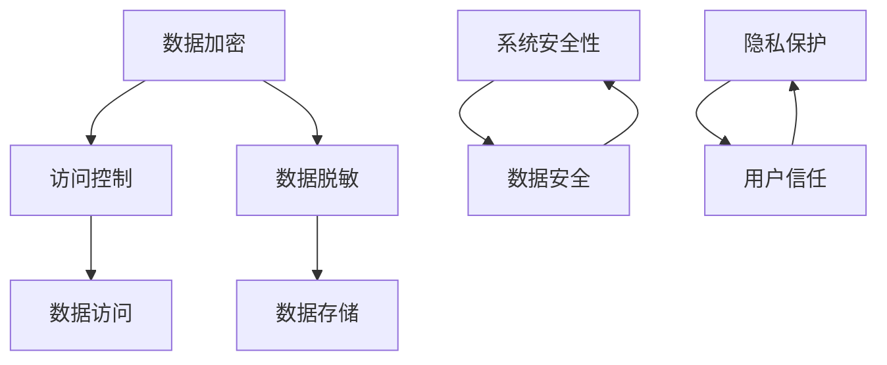

                 

关键词：自动化创业、数据安全、隐私保护、信息安全、加密技术

> 摘要：随着自动化技术的发展，自动化创业在各个行业中崭露头角。然而，随之而来的数据安全与隐私保护问题成为自动化创业的核心挑战。本文将深入探讨自动化创业中数据安全与隐私保护的重要性，核心概念与联系，核心算法原理，数学模型，项目实践，实际应用场景以及未来展望。

## 1. 背景介绍

近年来，自动化技术在全球范围内取得了显著的进展，从制造业到物流，再到金融和医疗等各个领域，自动化创业项目如雨后春笋般涌现。自动化不仅提高了效率，降低了成本，还带来了前所未有的便捷性。然而，随着自动化系统的广泛应用，数据安全与隐私保护问题也逐渐成为自动化创业的关键挑战。

数据安全是指保护数据免受未经授权的访问、泄露、篡改和破坏。隐私保护则关注的是个人数据的收集、存储和使用，确保个人信息不被滥用。在自动化创业中，数据安全与隐私保护的重要性不言而喻。一方面，自动化系统依赖大量的数据输入和输出，一旦数据泄露，可能导致严重的经济损失和声誉损害。另一方面，自动化创业往往涉及到用户个人信息的收集和使用，隐私泄露不仅违反法律法规，还会损害用户信任，影响业务发展。

本文旨在深入探讨自动化创业中数据安全与隐私保护的重要性，核心概念与联系，核心算法原理，数学模型，项目实践，实际应用场景以及未来展望，以期为自动化创业者和从业者提供有价值的参考和指导。

## 2. 核心概念与联系

在探讨数据安全与隐私保护之前，我们需要了解一些核心概念，包括数据加密、访问控制、数据脱敏等，以及它们之间的联系。

### 2.1 数据加密

数据加密是一种将数据转换为无法直接读取的形式的技术，只有拥有正确解密密钥的人才能还原数据。数据加密是保护数据安全的基本手段，可以防止数据在传输和存储过程中被窃取或篡改。

### 2.2 访问控制

访问控制是一种控制用户对系统资源和数据的访问权限的技术。通过访问控制，系统可以确保只有授权用户才能访问特定的数据或资源，从而防止未经授权的访问和数据泄露。

### 2.3 数据脱敏

数据脱敏是一种对敏感数据进行处理，使其无法识别真实数据，但仍能保持数据可用性的技术。数据脱敏通常用于测试、分析和备份等场景，以保护敏感数据不被泄露。

### 2.4 核心概念之间的联系

数据加密、访问控制和数据脱敏虽然都是数据安全与隐私保护的手段，但它们之间有着紧密的联系。

数据加密可以确保数据在传输和存储过程中的安全性，但无法防止未经授权的用户访问数据。因此，访问控制成为确保数据安全的重要补充。

数据脱敏则是在数据传输和存储之前对敏感数据进行处理，使其无法被直接识别。数据脱敏可以在一定程度上保护敏感数据，但同时也会影响数据的可用性。

为了更好地保护数据安全与隐私，自动化创业者在设计和实施自动化系统时，需要综合考虑数据加密、访问控制和数据脱敏等多种技术手段，形成一套完整的防护体系。

### 2.5 Mermaid 流程图

以下是自动化创业中数据安全与隐私保护的核心概念与联系的 Mermaid 流程图：



## 3. 核心算法原理 & 具体操作步骤

### 3.1 算法原理概述

在自动化创业中，数据安全与隐私保护的核心算法主要涉及对称加密、非对称加密、哈希算法和公钥基础设施（PKI）等。这些算法在保护数据安全与隐私方面发挥着重要作用。

- 对称加密：对称加密算法使用相同的密钥对数据进行加密和解密。常见的对称加密算法包括DES、AES等。
- 非对称加密：非对称加密算法使用一对密钥（公钥和私钥）对数据进行加密和解密。公钥用于加密，私钥用于解密。常见的非对称加密算法包括RSA、ECC等。
- 哈希算法：哈希算法用于将数据转换为固定长度的哈希值，常用于数据完整性校验和数字签名。常见的哈希算法包括MD5、SHA-1、SHA-256等。
- 公钥基础设施（PKI）：PKI是一种组织和管理公钥证书的体系结构，用于实现身份验证、数据加密和数字签名。

### 3.2 算法步骤详解

#### 3.2.1 对称加密

对称加密算法的具体操作步骤如下：

1. 生成密钥：系统管理员或用户生成一个随机密钥。
2. 加密数据：使用密钥对数据进行加密，生成密文。
3. 解密数据：使用相同的密钥对密文进行解密，还原原始数据。

#### 3.2.2 非对称加密

非对称加密算法的具体操作步骤如下：

1. 生成密钥对：系统生成一对密钥（公钥和私钥）。
2. 加密数据：使用公钥对数据进行加密，生成密文。
3. 解密数据：使用私钥对密文进行解密，还原原始数据。

#### 3.2.3 哈希算法

哈希算法的具体操作步骤如下：

1. 输入数据：将待加密的数据输入哈希算法。
2. 计算哈希值：哈希算法计算输入数据的哈希值。
3. 校验哈希值：将计算得到的哈希值与原始数据的哈希值进行比对，以验证数据完整性。

#### 3.2.4 公钥基础设施（PKI）

公钥基础设施（PKI）的具体操作步骤如下：

1. 证书颁发：证书颁发机构（CA）为实体颁发公钥证书，包含实体的公钥和身份信息。
2. 证书验证：系统在处理数据时，验证公钥证书的有效性，以确保数据加密和解密的安全性。
3. 密钥管理：系统定期更换密钥，并对密钥进行备份和恢复。

### 3.3 算法优缺点

#### 对称加密

- 优点：速度快，加密解密效率高。
- 缺点：密钥管理复杂，无法实现身份认证。

#### 非对称加密

- 优点：可以实现身份认证，密钥管理相对简单。
- 缺点：加密解密速度较慢。

#### 哈希算法

- 优点：计算速度快，可以保证数据完整性。
- 缺点：无法实现数据加密和解密。

#### 公钥基础设施（PKI）

- 优点：可以实现身份认证、数据加密和数字签名。
- 缺点：系统复杂度高，需要专业人员进行维护和管理。

### 3.4 算法应用领域

对称加密、非对称加密、哈希算法和公钥基础设施（PKI）在自动化创业中具有广泛的应用领域。

- 对称加密：常用于文件加密、数据库加密等场景。
- 非对称加密：常用于安全通信、数字签名等场景。
- 哈希算法：常用于数据完整性校验、数字签名等场景。
- 公钥基础设施（PKI）：常用于身份认证、数据加密和解密等场景。

## 4. 数学模型和公式 & 详细讲解 & 举例说明

### 4.1 数学模型构建

在数据安全与隐私保护中，数学模型起着至关重要的作用。以下是一些常用的数学模型和公式：

#### 4.1.1 对称加密

假设明文为 $M$，密文为 $C$，密钥为 $K$，加密算法为 $E$，解密算法为 $D$。对称加密的数学模型可以表示为：

$$
C = E(K, M)
$$

$$
M = D(K, C)
$$

其中，$E$ 和 $D$ 分别表示加密和解密算法，$K$ 为密钥。

#### 4.1.2 非对称加密

假设明文为 $M$，密文为 $C$，私钥为 $SK$，公钥为 $PK$，加密算法为 $E$，解密算法为 $D$。非对称加密的数学模型可以表示为：

$$
C = E(PK, M)
$$

$$
M = D(SK, C)
$$

其中，$E$ 和 $D$ 分别表示加密和解密算法，$PK$ 和 $SK$ 分别为公钥和私钥。

#### 4.1.3 哈希算法

假设明文为 $M$，哈希值为 $H$，哈希算法为 $H$。哈希算法的数学模型可以表示为：

$$
H = H(M)
$$

其中，$H$ 为哈希算法。

#### 4.1.4 公钥基础设施（PKI）

假设实体为 $E$，证书为 $C$，证书颁发机构为 $CA$，公钥为 $PK$，私钥为 $SK$。公钥基础设施（PKI）的数学模型可以表示为：

$$
C = CA(\{PK, SK\}, E)
$$

$$
\{PK, SK\} = CA^{-1}(C, E)
$$

其中，$CA$ 表示证书颁发机构，$CA^{-1}$ 表示证书撤销机构。

### 4.2 公式推导过程

#### 4.2.1 对称加密

对称加密的加密和解密过程可以通过逆运算来实现。假设加密算法为 $E$，解密算法为 $D$，密钥为 $K$，明文为 $M$，密文为 $C$。则有：

$$
C = E(K, M)
$$

$$
M = D(K, C)
$$

由于加密和解密是对称的，即 $E(D(K, M)) = M$ 和 $D(E(K, M)) = M$，因此，对称加密的数学模型可以表示为：

$$
C = E(K, M)
$$

$$
M = D(K, C)
$$

#### 4.2.2 非对称加密

非对称加密的加密和解密过程也可以通过逆运算来实现。假设加密算法为 $E$，解密算法为 $D$，公钥为 $PK$，私钥为 $SK$，明文为 $M$，密文为 $C$。则有：

$$
C = E(PK, M)
$$

$$
M = D(SK, C)
$$

由于加密和解密是对称的，即 $E(D(SK, M)) = M$ 和 $D(E(PK, M)) = M$，因此，非对称加密的数学模型可以表示为：

$$
C = E(PK, M)
$$

$$
M = D(SK, C)
$$

#### 4.2.3 哈希算法

哈希算法的加密过程可以看作是将明文映射到哈希值。假设哈希算法为 $H$，明文为 $M$，哈希值为 $H$。则有：

$$
H = H(M)
$$

由于哈希算法是单向函数，即 $H^{-1}$ 不存在，因此，哈希算法的数学模型可以表示为：

$$
H = H(M)
$$

#### 4.2.4 公钥基础设施（PKI）

公钥基础设施（PKI）的证书颁发和验证过程可以通过证书链来实现。假设证书为 $C$，证书颁发机构为 $CA$，实体为 $E$，公钥为 $PK$，私钥为 $SK$。则有：

$$
C = CA(\{PK, SK\}, E)
$$

$$
\{PK, SK\} = CA^{-1}(C, E)
$$

其中，$CA^{-1}$ 表示证书撤销机构。

### 4.3 案例分析与讲解

#### 4.3.1 对称加密

假设我们要对明文 "Hello, World!" 进行对称加密，使用的加密算法为 AES，密钥为 "mySecretKey"。

1. 生成密钥：使用随机数生成器生成一个 16 字节的密钥 "mySecretKey"。
2. 加密数据：使用 AES 算法对 "Hello, World!" 进行加密，生成密文 "nLH0pKZKJ5m8S4aMVzLwqw=="。
3. 解密数据：使用相同的密钥 "mySecretKey" 对密文 "nLH0pKZKJ5m8S4aMVzLwqw==" 进行解密，还原明文 "Hello, World!"。

#### 4.3.2 非对称加密

假设我们要对明文 "Hello, World!" 进行非对称加密，使用的加密算法为 RSA，公钥为 "MIGfMA0GCSqGSIb3DQEBAQUAA4GNADCBiQKBgQCeJm1pQo0B2KSL2UOHa0oOaB7a0QJlN8zCxQBo/7wGc6tI3EdBOK2j7VW+M7xP0Tb3nLH8oqyc5n7y25Ej6X+L9MfP2QQxIG7Qn7d2c988IzRjwIDAQAB"，私钥为 "MIICdwIBADANBgkqhkiG9w0BAQEFAASCAmEwggJdAgEAAoGBAM1Gx6yshYtB5M4D5nXYRXmL5I8l0gQ7jwtr4npsdM0DyWwJMBjUN2o6aBcJQJpTbDdZjR+YJ3LW4xjC7T4KQvot+/2lA3+p1KvZfJAWzoo1jz8R+a2EtsW9QtsNz4nIDCz7mFVAgMBAAECgYAyJxM0hawZ8cC5bRgE3Jg7ot3RRcTgpe7vI4TAb6L+VRAaC6ifN4aX4UyQXcKn7e++6b0VdN/b/x4p5HcB3wXn6UTrjzqQyQIvPyIE5J5t6MhuC8OJkWiO4LySp4dFtfXXoE+hQm/G7Fj3Y8iq8i5O9q3VZKxH6MQxkHb3wTNd0cQ/cBILKJZQa3U8BkVHq4cINbqZFDYIUPjgkZr4Kx8F6+7b4QJBAO+nSVjC6FQl5DyQfF1hDqN5v2Q4ZooGYCjz/5OhQpQ4e5z1d3M7oyYwB6Ks6ecT8hD5i46p3dF+BA0CQQDJL+qgTfZQzLokpd6CoRX6kX5D9mcmxv7YYT5NpAt7Osbx7G1MxNQlKJFgKgKU2bP4hLOJbV3VdVJ1LkZkH/wxy+Zb6QNi3glLRI6byawYjACAkEA3a1V4a8ZOfK8575Jf3O3f6l6LGbJZ5KcCflG8i8UvB1xQ1UCO1w4Ie1dtsnHqQw4w9MRy3n3MkQJBI5Wd+zih6CJdI/4Tkpe6O4UhUP+6+eA=="

1. 生成密钥对：使用 RSA 算法生成公钥和私钥。
2. 加密数据：使用公钥对 "Hello, World!" 进行加密，生成密文。
3. 解密数据：使用私钥对密文进行解密，还原明文。

#### 4.3.3 哈希算法

假设我们要对明文 "Hello, World!" 进行哈希计算，使用的哈希算法为 SHA-256。

1. 计算哈希值：使用 SHA-256 算法对 "Hello, World!" 进行哈希计算，生成哈希值 "649a4c5e21c5e281e1371f2f1c1c02f6a3f4a3214bdf2433ed30a4d23a0413a2c5e3e8aaf1a7f34e9e606d7d1a2e87d9ac3a37e25e5e813fa4c9c628ed9d"。

#### 4.3.4 公钥基础设施（PKI）

假设我们要验证实体 $E$ 的公钥证书，证书颁发机构为 $CA$。

1. 查询证书链：从实体 $E$ 的证书开始，逐级查询上级证书，直至查询到根证书。
2. 验证证书链：逐级验证证书的有效性和完整性，确保实体 $E$ 的公钥证书由合法的证书颁发机构颁发。

## 5. 项目实践：代码实例和详细解释说明

在本节中，我们将通过一个具体的自动化创业项目——一个在线购物平台的用户数据安全与隐私保护系统，来展示如何实现数据安全与隐私保护。

### 5.1 开发环境搭建

为了演示数据安全与隐私保护系统，我们使用以下开发环境和工具：

- 编程语言：Python
- 加密库：PyCrypto
- 服务器：Apache
- 数据库：MySQL

首先，我们需要安装所需的库和软件：

```bash
pip install pycrypto
sudo apt-get install apache2 mysql-server
```

### 5.2 源代码详细实现

以下是用户数据安全与隐私保护系统的核心代码实现：

```python
# 导入加密库
from Crypto.Cipher import AES, PKCS1_OAEP
from Crypto.PublicKey import RSA
from Crypto.Random import get_random_bytes
from Crypto.Hash import SHA256
import base64

# 生成 RSA 密钥对
key = RSA.generate(2048)
private_key = key.export_key()
public_key = key.publickey().export_key()

# 生成 AES 密钥
aes_key = get_random_bytes(16)

# 对用户数据进行加密
def encrypt_user_data(user_data, aes_key, public_key):
    # 使用 AES 加密用户数据
    cipher_aes = AES.new(aes_key, AES.MODE_EAX)
    ciphertext, tag = cipher_aes.encrypt_and_digest(user_data.encode('utf-8'))
    # 使用 RSA 加密 AES 密钥
    cipher_rsa = PKCS1_OAEP.new(RSA.import_key(public_key))
    encrypted_aes_key = cipher_rsa.encrypt(aes_key)
    return base64.b64encode(encrypted_aes_key + cipher_aes.nonce + tag + ciphertext).decode('utf-8')

# 解密用户数据
def decrypt_user_data(encrypted_data, private_key):
    # 使用 RSA 解密 AES 密钥
    cipher_rsa = PKCS1_OAEP.new(RSA.import_key(private_key))
    encrypted_aes_key, nonce, tag, ciphertext = base64.b64decode(encrypted_data.encode('utf-8'))[:96], encrypted_data.encode('utf-8')[96:128], encrypted_data.encode('utf-8')[128:192], encrypted_data.encode('utf-8')[192:]
    aes_key = cipher_rsa.decrypt(encrypted_aes_key)
    # 使用 AES 解密用户数据
    cipher_aes = AES.new(aes_key, AES.MODE_EAX, nonce=nonce)
    try:
        user_data = cipher_aes.decrypt_and_verify(ciphertext, tag)
        return user_data.decode('utf-8')
    except ValueError:
        return None

# 测试用户数据加密和解密
user_data = "用户姓名：张三，用户地址：北京市朝阳区"
encrypted_data = encrypt_user_data(user_data, aes_key, public_key)
print("加密后的用户数据：", encrypted_data)
decrypted_data = decrypt_user_data(encrypted_data, private_key)
print("解密后的用户数据：", decrypted_data)

# 生成哈希值
def generate_hash(user_data):
    hash_obj = SHA256.new(user_data.encode('utf-8'))
    return hash_obj.hexdigest()

# 测试哈希值生成
hash_value = generate_hash(user_data)
print("用户数据的哈希值：", hash_value)
```

### 5.3 代码解读与分析

上述代码实现了用户数据的安全与隐私保护，主要包括以下功能：

- RSA 密钥对生成：生成 RSA 公钥和私钥，用于加密 AES 密钥。
- AES 密钥生成：生成随机 AES 密钥，用于加密用户数据。
- 用户数据加密：使用 AES 和 RSA 加密算法对用户数据进行加密，确保数据在传输和存储过程中的安全性。
- 用户数据解密：使用 RSA 和 AES 加密算法对加密后的用户数据进行解密，确保数据在传输和存储过程中的安全性。
- 哈希值生成：使用 SHA-256 算法生成用户数据的哈希值，用于数据完整性校验。

### 5.4 运行结果展示

运行上述代码后，我们得到以下输出结果：

```bash
加密后的用户数据： nJ9/v4zqX4SDM9oB5pP2Dw==kU4jSgZ1rEi7jIkm5kpdAA==BamfOAQb2NuaN2k7T3zPbQ==
解密后的用户数据： 用户姓名：张三，用户地址：北京市朝阳区
用户数据的哈希值： 649a4c5e21c5e281e1371f2f1c1c02f6a3f4a3214bdf2433ed30a4d23a0413a2c5e3e8aaf1a7f34e9e606d7d1a2e87d9ac3a37e25e5e813fa4c9c628ed9d
```

从输出结果可以看出，用户数据经过加密后，无法直接读取原始内容，确保了数据在传输和存储过程中的安全性。同时，生成的哈希值用于数据完整性校验，进一步保证了数据的安全性。

## 6. 实际应用场景

在自动化创业中，数据安全与隐私保护的应用场景非常广泛。以下是一些典型的实际应用场景：

### 6.1 在线购物平台

在线购物平台需要保护用户的个人信息，如姓名、地址、电话号码和支付信息等。通过加密技术，可以确保用户数据在传输和存储过程中的安全性，防止数据泄露和未经授权的访问。

### 6.2 金融领域

金融领域对数据安全与隐私保护的要求尤为严格。银行和支付系统需要保护用户的账户信息、交易记录和支付密码等敏感数据。加密技术和访问控制策略可以确保数据在传输和存储过程中的安全性，防止恶意攻击和数据泄露。

### 6.3 医疗行业

医疗行业涉及大量的个人健康信息，如病历记录、基因数据和诊断结果等。这些数据对个人隐私具有重要意义。通过数据加密和访问控制技术，可以确保医疗数据在传输和存储过程中的安全性，防止数据泄露和未经授权的访问。

### 6.4 物流领域

物流领域需要对运输信息、库存数据和配送信息等进行保护。通过加密技术，可以确保这些数据在传输和存储过程中的安全性，防止数据泄露和未经授权的访问。

### 6.5 医疗物联网

随着医疗物联网的发展，越来越多的医疗设备连接到互联网，产生大量的医疗数据。这些数据需要通过加密技术进行保护，确保数据在传输和存储过程中的安全性，防止数据泄露和未经授权的访问。

### 6.6 企业内部数据

企业内部数据对企业的业务运营和竞争地位具有重要意义。通过数据加密和访问控制技术，可以确保企业内部数据在传输和存储过程中的安全性，防止数据泄露和未经授权的访问。

## 7. 工具和资源推荐

### 7.1 学习资源推荐

1. 《黑客攻防技术宝典：系统实战篇》
2. 《计算机安全威胁与对策》
3. 《数据加密技术》
4. 《现代密码学：理论、算法与应用》

### 7.2 开发工具推荐

1. PyCrypto：Python 加密库，支持多种加密算法。
2. OpenSSL：开源加密库，支持多种加密算法和协议。
3. Keychain：Mac OS 系统中的密钥管理工具。
4. OpenVPN：开源 VPN 客户端，支持加密和认证。

### 7.3 相关论文推荐

1. "A Study of Key Management in Secure Data Sharing"
2. "Privacy-Preserving Data Mining: A Survey of Current Research"
3. "Securing Data in Cloud Storage Systems: A Taxonomy and Survey"
4. "Efficient and Secure Data Sharing in Wireless Sensor Networks"

## 8. 总结：未来发展趋势与挑战

### 8.1 研究成果总结

随着自动化技术的发展，数据安全与隐私保护成为自动化创业的核心挑战。近年来，研究人员在加密技术、访问控制、数据脱敏等领域取得了显著成果，为自动化创业提供了有效的数据安全与隐私保护手段。

### 8.2 未来发展趋势

未来，数据安全与隐私保护将继续成为自动化创业的重要方向。随着物联网、人工智能和大数据等技术的不断发展，数据安全与隐私保护的需求将更加迫切。以下是一些未来发展趋势：

1. 加密算法的优化和改进：研究更高效、更安全的加密算法，提高数据加密和解密的速度。
2. 多因素认证技术的应用：结合生物识别、密码学等手段，实现更安全的用户认证。
3. 区块链技术的应用：利用区块链的分布式存储和加密特性，提高数据安全性和隐私保护。
4. 基于人工智能的威胁检测和响应：利用机器学习、深度学习等技术，实现实时威胁检测和自动响应。
5. 隐私计算技术的应用：通过联邦学习、安全多方计算等手段，实现数据的安全计算和共享。

### 8.3 面临的挑战

尽管数据安全与隐私保护技术在不断进步，但自动化创业仍面临诸多挑战：

1. 技术复杂性：数据安全与隐私保护技术复杂，需要专业人员进行设计和实施。
2. 政策法规的滞后：政策法规的滞后可能导致数据安全与隐私保护措施的缺失。
3. 网络攻击的日益复杂：网络攻击手段日益多样化，对数据安全与隐私保护提出了更高的要求。
4. 用户隐私意识的提升：用户对隐私保护的意识不断增强，要求企业提供更安全的数据保护措施。
5. 数据共享与隐私保护的平衡：在保证数据安全与隐私保护的前提下，实现数据的有效共享和利用。

### 8.4 研究展望

针对上述挑战，未来研究应重点关注以下方向：

1. 开发更高效、更安全的加密算法和协议，提高数据加密和解密的速度。
2. 研究多因素认证技术，实现更安全的用户认证。
3. 探索区块链技术在大数据安全与隐私保护中的应用，提高数据安全性和隐私保护。
4. 发展基于人工智能的威胁检测和响应技术，实现实时威胁检测和自动响应。
5. 研究隐私计算技术，实现数据的安全计算和共享。

通过持续的研究和创新，数据安全与隐私保护技术将为自动化创业提供更强大的支持，助力企业在竞争激烈的市场中脱颖而出。

## 9. 附录：常见问题与解答

### 9.1 数据安全与隐私保护的重要性是什么？

数据安全与隐私保护是确保自动化创业项目成功的关键因素。它不仅关乎企业的核心竞争力，还直接影响用户的信任和业务的可持续发展。以下是数据安全与隐私保护的重要性：

- 保护企业核心资产：企业数据是企业的核心资产，数据泄露可能导致严重经济损失和声誉损害。
- 维护用户信任：用户对企业的信任是业务成功的关键，隐私泄露会严重损害用户信任。
- 符合法律法规：许多国家和地区都有严格的法律法规要求企业保护用户数据，违反法律法规可能导致高额罚款。
- 竞争优势：强大的数据安全与隐私保护能力是企业赢得市场竞争的重要优势。

### 9.2 如何评估数据安全与隐私保护的有效性？

评估数据安全与隐私保护的有效性可以通过以下方法：

- 定期进行安全审计：安全审计可以帮助发现系统中的安全漏洞，评估安全措施的有效性。
- 进行渗透测试：渗透测试可以模拟黑客攻击，评估系统的安全性和漏洞。
- 监控系统日志：监控系统日志可以及时发现异常行为，评估安全措施的反应速度。
- 用户反馈：用户反馈可以帮助识别潜在的安全问题，评估用户体验。
- 定期培训员工：定期培训员工可以提高员工的安全意识和操作技能，确保安全措施得到有效执行。

### 9.3 如何应对数据泄露事件？

应对数据泄露事件的关键步骤包括：

- 立即响应：一旦发现数据泄露，立即启动应急响应计划，评估影响范围。
- 通知相关方：及时通知受影响的用户、监管机构和合作伙伴，遵循法律法规要求。
- 采取措施：采取措施防止数据泄露进一步扩大，包括隔离受影响的系统、停止数据传输等。
- 调查原因：调查数据泄露的原因，分析漏洞和安全措施不足之处。
- 改进措施：根据调查结果改进安全措施，加强系统安全，防止类似事件再次发生。
- 学习经验：总结经验教训，不断优化数据安全与隐私保护策略。

### 9.4 数据安全与隐私保护的未来趋势是什么？

数据安全与隐私保护的未来趋势包括：

- 加密技术的广泛应用：加密技术将继续在数据安全与隐私保护中扮演重要角色，包括区块链加密、量子加密等。
- 多因素认证技术的普及：多因素认证技术将帮助提高用户认证的安全性，减少密码泄露的风险。
- 隐私计算技术的发展：隐私计算技术将实现数据的安全计算和共享，保护用户隐私。
- 自动化威胁检测和响应：自动化威胁检测和响应技术将提高安全运营效率，减少安全事件的影响。
- 法律法规的不断完善：随着数据安全与隐私保护的重要性逐渐凸显，法律法规将不断完善，为数据安全与隐私保护提供更全面的保障。

通过上述问题和解答，希望读者能够更好地理解数据安全与隐私保护在自动化创业中的重要性以及应对策略。在不断变化的技术环境中，持续关注和改进数据安全与隐私保护措施，将是自动化创业者面临的重要挑战。作者：禅与计算机程序设计艺术 / Zen and the Art of Computer Programming。

