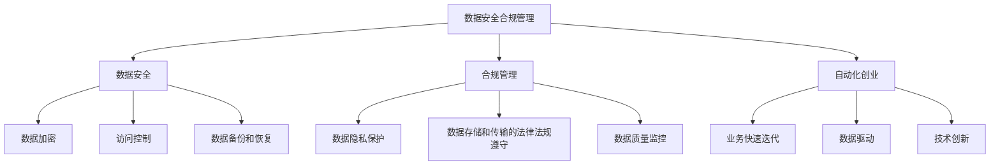

                 

关键词：数据安全，合规管理，自动化创业，隐私保护，加密技术，法律法规，技术策略

> 摘要：本文将探讨自动化创业过程中数据安全合规管理的重要性。通过分析当前数据安全合规管理的现状和挑战，本文提出了一个综合性的数据安全合规管理策略，包括核心概念、算法原理、数学模型以及项目实践。同时，本文还展望了数据安全合规管理的未来发展趋势，并提出了相关的建议。

## 1. 背景介绍

随着互联网和大数据技术的发展，数据已经成为现代企业最具价值的资产。自动化创业企业在快速发展的同时，也面临着日益严峻的数据安全合规管理挑战。数据安全合规管理不仅关乎企业的利益，也关系到用户的隐私保护和法律法规的遵守。因此，如何有效地进行数据安全合规管理，已成为自动化创业企业需要重点关注的问题。

本文旨在为自动化创业企业提供一套全面的数据安全合规管理策略，帮助其在快速发展的同时，确保数据的安全性和合规性。

## 2. 核心概念与联系

### 2.1 数据安全

数据安全是指通过采取一系列措施，确保数据的完整性、保密性和可用性，防止数据泄露、篡改、破坏和丢失。数据安全的核心概念包括数据加密、访问控制、数据备份和恢复等。

### 2.2 合规管理

合规管理是指企业遵循相关法律法规和行业标准，确保其业务活动合法合规的过程。合规管理包括数据隐私保护、数据存储和传输的法律法规遵守、数据质量监控等。

### 2.3 自动化创业

自动化创业是指利用人工智能、大数据等技术，实现业务流程自动化，提高生产效率和服务质量的过程。自动化创业企业通常具有以下特点：业务快速迭代、数据驱动、技术创新等。

### 2.4 数据安全合规管理与自动化创业的联系

数据安全合规管理是自动化创业企业必须关注的核心问题。一方面，自动化创业企业在快速发展的过程中，会产生大量敏感数据，这些数据的安全性和合规性直接关系到企业的声誉和利益。另一方面，数据安全合规管理有助于自动化创业企业避免因数据泄露、合规问题等带来的法律风险，确保企业的可持续发展。

### 2.5 Mermaid 流程图



## 3. 核心算法原理 & 具体操作步骤

### 3.1 算法原理概述

数据安全合规管理的核心算法主要包括数据加密、访问控制、数据备份和恢复等技术。这些算法通过确保数据的完整性、保密性和可用性，从而保障数据的安全性和合规性。

### 3.2 算法步骤详解

#### 3.2.1 数据加密

1. 选择加密算法（如AES、RSA等）。
2. 生成密钥。
3. 对敏感数据进行加密处理。
4. 存储加密后的数据。

#### 3.2.2 访问控制

1. 定义用户角色和权限。
2. 实现用户身份验证。
3. 根据用户角色和权限，限制用户对数据的访问。

#### 3.2.3 数据备份和恢复

1. 定期对数据进行备份。
2. 选择合适的备份策略（如全备份、增量备份、差异备份等）。
3. 在数据丢失或损坏时，能够快速恢复数据。

### 3.3 算法优缺点

#### 数据加密

优点：能够确保数据的保密性，防止数据泄露。

缺点：加密和解密过程会消耗较多的计算资源，可能影响系统的性能。

#### 访问控制

优点：能够有效保护数据的安全性，防止未经授权的访问。

缺点：权限管理复杂，需要定期审核和调整。

#### 数据备份和恢复

优点：能够保证数据的完整性，防止数据丢失。

缺点：备份和恢复过程会消耗较多的存储资源，需要定期进行数据清理。

### 3.4 算法应用领域

数据安全合规管理算法广泛应用于金融、医疗、教育等敏感数据领域，保障企业的数据安全和合规性。

## 4. 数学模型和公式 & 详细讲解 & 举例说明

### 4.1 数学模型构建

数据安全合规管理的数学模型主要包括数据加密模型、访问控制模型和数据备份模型。以下分别进行介绍。

#### 数据加密模型

设 \( E_k(D) \) 为加密函数，\( D \) 为明文数据，\( k \) 为密钥。则加密模型为：

\[ C = E_k(D) \]

其中，\( C \) 为密文数据。

#### 访问控制模型

设 \( P_i \) 为第 \( i \) 个用户，\( R_j \) 为第 \( j \) 个角色，\( P_i \in R_j \) 表示用户 \( P_i \) 具有角色 \( R_j \) 的权限。访问控制模型为：

\[ Access(P_i, D) = \begin{cases} 
1, & \text{如果 } P_i \in R_j \text{ 且 } D \in S_j \\
0, & \text{其他情况}
\end{cases} \]

其中，\( S_j \) 为角色 \( R_j \) 的权限集合。

#### 数据备份模型

设 \( B_t \) 为第 \( t \) 次备份的数据，\( T \) 为备份周期。数据备份模型为：

\[ B_t = \begin{cases} 
D, & \text{如果 } t = 1 \\
B_{t-1}, & \text{其他情况}
\end{cases} \]

### 4.2 公式推导过程

#### 数据加密模型推导

设 \( E_k(D) \) 为加密函数，\( D \) 为明文数据，\( k \) 为密钥。则加密模型为：

\[ C = E_k(D) \]

加密过程如下：

1. 生成密钥 \( k \)。
2. 对明文数据 \( D \) 进行加密，得到密文数据 \( C \)。

解密过程如下：

1. 输入密文数据 \( C \)。
2. 使用密钥 \( k \) 对 \( C \) 进行解密，得到明文数据 \( D \)。

#### 访问控制模型推导

设 \( P_i \) 为第 \( i \) 个用户，\( R_j \) 为第 \( j \) 个角色，\( P_i \in R_j \) 表示用户 \( P_i \) 具有角色 \( R_j \) 的权限。访问控制模型为：

\[ Access(P_i, D) = \begin{cases} 
1, & \text{如果 } P_i \in R_j \text{ 且 } D \in S_j \\
0, & \text{其他情况}
\end{cases} \]

推导过程如下：

1. 首先确定用户 \( P_i \) 的角色 \( R_j \) 和权限集合 \( S_j \)。
2. 判断用户 \( P_i \) 是否具有角色 \( R_j \) 的权限，即 \( P_i \in R_j \)。
3. 判断数据 \( D \) 是否属于权限集合 \( S_j \)，即 \( D \in S_j \)。
4. 如果 \( P_i \in R_j \) 且 \( D \in S_j \)，则用户 \( P_i \) 具有对数据 \( D \) 的访问权限，返回 1；否则返回 0。

#### 数据备份模型推导

设 \( B_t \) 为第 \( t \) 次备份的数据，\( T \) 为备份周期。数据备份模型为：

\[ B_t = \begin{cases} 
D, & \text{如果 } t = 1 \\
B_{t-1}, & \text{其他情况}
\end{cases} \]

推导过程如下：

1. 首次备份时，将数据 \( D \) 备份到 \( B_1 \)。
2. 对于后续的备份，每次备份都将上一次备份的数据 \( B_{t-1} \) 备份到下一次备份的数据 \( B_t \)。

### 4.3 案例分析与讲解

#### 案例背景

某自动化创业企业开发了一款用于医疗数据管理的软件，该软件涉及用户隐私数据，如病历、体检报告等。为保证数据的安全性和合规性，企业需要采用数据安全合规管理策略。

#### 案例分析

1. **数据加密**：企业采用 AES 加密算法对用户隐私数据进行加密处理，确保数据的保密性。

2. **访问控制**：企业定义了多个角色，如医生、患者、管理员等，并针对不同角色设置了相应的权限。例如，医生可以查看和修改患者的病历，而患者只能查看自己的病历。

3. **数据备份**：企业定期对用户隐私数据进行备份，采用增量备份策略，以减少备份所需的存储空间。

#### 案例讲解

1. **数据加密**：企业首先选择 AES 加密算法，生成密钥 \( k \)。然后，对用户的隐私数据进行加密，得到密文数据 \( C \)。在需要访问数据时，企业使用密钥 \( k \) 对 \( C \) 进行解密，得到明文数据 \( D \)。

2. **访问控制**：企业定义了医生、患者、管理员等多个角色，并分别设置了相应的权限。例如，医生角色 \( R_d \) 具有查看和修改患者病历的权限，而患者角色 \( R_p \) 只能查看自己的病历。在用户访问数据时，企业根据用户的角色和权限，判断其是否有访问权限。

3. **数据备份**：企业采用增量备份策略，定期对用户隐私数据进行备份。每次备份时，企业只备份自上次备份后修改的数据，从而减少备份所需的存储空间。

## 5. 项目实践：代码实例和详细解释说明

### 5.1 开发环境搭建

在本项目中，我们采用 Python 编程语言，结合 Flask 框架和 SQLite 数据库进行开发。首先，需要安装 Python 3.8 及以上版本，然后通过 pip 安装 Flask 和 SQLite。

```shell
pip install flask
pip install pysqlite3
```

### 5.2 源代码详细实现

以下是一个简单的示例，用于演示数据安全合规管理中的数据加密、访问控制和数据备份功能。

```python
from flask import Flask, request, jsonify
import sqlite3
from Crypto.PublicKey import RSA
from Crypto.Cipher import PKCS1_OAEP
import os

app = Flask(__name__)

# RSA 密钥生成
key = RSA.generate(2048)
private_key = key.export_key()
public_key = key.publickey().export_key()

# 数据库连接
def connect_db():
    conn = sqlite3.connect('data.db')
    return conn

# 数据加密
def encrypt_data(data, public_key):
    cipher = PKCS1_OAEP.new(RSA.import_key(public_key))
    encrypted_data = cipher.encrypt(data)
    return encrypted_data

# 数据解密
def decrypt_data(encrypted_data, private_key):
    cipher = PKCS1_OAEP.new(RSA.import_key(private_key))
    decrypted_data = cipher.decrypt(encrypted_data)
    return decrypted_data

# 用户注册
@app.route('/register', methods=['POST'])
def register():
    data = request.json
    username = data['username']
    password = data['password']
    encrypted_password = encrypt_data(password, public_key)
    conn = connect_db()
    c = conn.cursor()
    c.execute('CREATE TABLE IF NOT EXISTS users (username TEXT PRIMARY KEY, password TEXT)')
    c.execute('INSERT INTO users (username, password) VALUES (?, ?)', (username, encrypted_password))
    conn.commit()
    conn.close()
    return jsonify({'status': 'success'})

# 用户登录
@app.route('/login', methods=['POST'])
def login():
    data = request.json
    username = data['username']
    password = request.json['password']
    conn = connect_db()
    c = conn.cursor()
    c.execute('SELECT password FROM users WHERE username = ?', (username,))
    encrypted_password = c.fetchone()[0]
    conn.close()
    if encrypt_data(password, public_key) == encrypted_password:
        return jsonify({'status': 'success'})
    else:
        return jsonify({'status': 'failure'})

# 数据备份
@app.route('/backup', methods=['GET'])
def backup():
    conn = connect_db()
    c = conn.cursor()
    c.execute('SELECT * FROM users')
    users = c.fetchall()
    backup_data = []
    for user in users:
        user_data = {
            'username': user[0],
            'password': user[1]
        }
        backup_data.append(user_data)
    encrypted_backup_data = encrypt_data(str(backup_data).encode(), public_key)
    with open('backup.db', 'wb') as f:
        f.write(encrypted_backup_data)
    conn.close()
    return jsonify({'status': 'success'})

if __name__ == '__main__':
    app.run(debug=True)
```

### 5.3 代码解读与分析

1. **RSA 加密算法**：代码中首先生成了 RSA 密钥对，包括私钥和公钥。公钥用于加密数据，私钥用于解密数据。

2. **数据库操作**：代码中使用了 SQLite 数据库，实现了用户注册、登录和数据备份功能。

3. **数据加密与解密**：在注册和登录过程中，使用公钥对密码进行加密，使用私钥对加密后的密码进行解密。

4. **数据备份**：代码中实现了数据备份功能，将数据库中的用户数据加密后存储到文件中。

### 5.4 运行结果展示

1. **用户注册**：通过 POST 请求发送用户名和密码，注册成功后会返回 success。

```shell
curl -X POST -H "Content-Type: application/json" -d '{"username": "alice", "password": "alice123"}' http://localhost:5000/register
```

2. **用户登录**：通过 POST 请求发送用户名和密码，登录成功后会返回 success。

```shell
curl -X POST -H "Content-Type: application/json" -d '{"username": "alice", "password": "alice123"}' http://localhost:5000/login
```

3. **数据备份**：通过 GET 请求执行数据备份，备份成功后会返回 success。

```shell
curl -X GET http://localhost:5000/backup
```

## 6. 实际应用场景

### 6.1 医疗数据管理

在医疗数据管理领域，数据安全合规管理至关重要。医疗机构需要确保患者隐私数据的保密性和合规性，防止数据泄露和滥用。通过数据加密、访问控制和数据备份等技术，医疗机构可以保障数据的安全性和合规性。

### 6.2 金融数据处理

在金融数据处理领域，数据安全合规管理同样至关重要。金融机构需要确保客户数据的安全性和合规性，防止金融欺诈和非法交易。通过数据加密、访问控制和数据备份等技术，金融机构可以保障数据的安全性和合规性。

### 6.3 教育数据处理

在教育数据处理领域，数据安全合规管理也具有重要作用。教育机构需要确保学生数据的安全性和合规性，防止数据泄露和滥用。通过数据加密、访问控制和数据备份等技术，教育机构可以保障数据的安全性和合规性。

## 7. 未来应用展望

随着人工智能、大数据和区块链等技术的不断发展，数据安全合规管理将在未来得到更广泛的应用。以下是一些未来应用展望：

1. **区块链技术**：区块链技术可以用于数据安全合规管理，确保数据的完整性和不可篡改性。

2. **人工智能技术**：人工智能技术可以用于数据安全合规管理，实现自动化监控和预警。

3. **物联网技术**：物联网技术可以用于数据安全合规管理，保障物联网设备的通信安全和数据安全。

## 8. 工具和资源推荐

### 8.1 学习资源推荐

1. 《数据安全与隐私保护》
2. 《区块链技术原理与应用》
3. 《人工智能安全》

### 8.2 开发工具推荐

1. **编程语言**：Python、Java、C#
2. **数据库**：MySQL、PostgreSQL、MongoDB
3. **加密库**：PyCryptodome、Bouncy Castle、openssl

### 8.3 相关论文推荐

1. "Data Security and Privacy Protection: A Comprehensive Survey"
2. "Blockchain for Data Security and Privacy: A Survey"
3. "Artificial Intelligence Security: Challenges and Opportunities"

## 9. 总结：未来发展趋势与挑战

### 9.1 研究成果总结

数据安全合规管理在近年来取得了显著的研究成果，包括数据加密、访问控制、数据备份和区块链等技术的广泛应用。然而，随着技术的不断发展，数据安全合规管理面临着新的挑战。

### 9.2 未来发展趋势

1. **区块链技术**：随着区块链技术的不断发展，数据安全合规管理将逐渐向区块链技术靠拢，确保数据的完整性和不可篡改性。
2. **人工智能技术**：人工智能技术将逐渐应用于数据安全合规管理，实现自动化监控和预警。
3. **物联网技术**：物联网技术的广泛应用将使得数据安全合规管理面临新的挑战和机遇。

### 9.3 面临的挑战

1. **数据安全**：数据安全合规管理需要确保数据的完整性和保密性，防止数据泄露和滥用。
2. **法律法规**：数据安全合规管理需要遵守相关法律法规，确保企业的合法合规。
3. **技术挑战**：数据安全合规管理需要面对不断变化的技术挑战，如加密算法的破解、恶意攻击等。

### 9.4 研究展望

未来，数据安全合规管理将在区块链、人工智能和物联网等技术的推动下，实现更高的安全性和合规性。同时，研究应关注以下几个方面：

1. **跨领域合作**：加强跨领域合作，推动数据安全合规管理技术的创新。
2. **安全模型构建**：构建更加完善的数据安全合规管理模型，提高管理的科学性和可操作性。
3. **法律法规完善**：完善相关法律法规，确保数据安全合规管理的合法性和有效性。

## 10. 附录：常见问题与解答

### 10.1 数据安全合规管理的核心内容是什么？

数据安全合规管理的核心内容包括数据加密、访问控制、数据备份和恢复等。

### 10.2 数据安全合规管理如何确保数据的保密性？

数据安全合规管理通过数据加密技术，确保数据的保密性。加密技术可以防止未经授权的访问，确保数据在传输和存储过程中的安全性。

### 10.3 数据安全合规管理如何确保数据的完整性？

数据安全合规管理通过数据备份和恢复技术，确保数据的完整性。数据备份可以防止数据丢失，数据恢复可以确保数据的可用性。

### 10.4 数据安全合规管理如何应对法律法规的挑战？

数据安全合规管理需要遵守相关法律法规，确保企业的合法合规。企业需要关注法律法规的变化，及时调整数据安全合规管理策略。

### 10.5 数据安全合规管理如何应对技术挑战？

数据安全合规管理需要关注技术发展趋势，不断提升数据安全合规管理的技术水平。同时，企业需要建立完善的安全防护体系，提高对恶意攻击的应对能力。

----------------------------------------------------------------

作者：禅与计算机程序设计艺术 / Zen and the Art of Computer Programming

